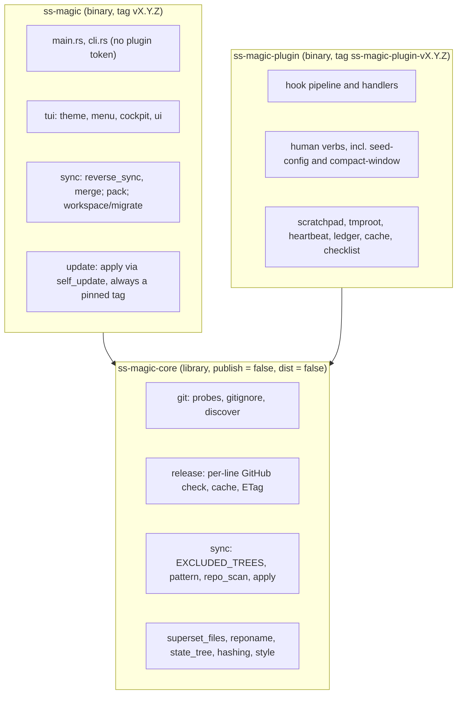

# ss-magic

Two Rust binaries for the Superset workspace contract (standalone repo:
`ViktorStiskala/superset-magic`): `ss-magic`, the interactive sync CLI, and
`ss-magic-plugin`, the Claude Code plugin. See README.md for user-facing docs.

## Build

```plaintext
make build     # cargo build --release --workspace   (all three crates)
make install   # cargo install --path crates/ss-magic
make test      # cargo test --workspace --locked
make clean     # cargo clean
```

Rust toolchain is provided by `rustup` (cargo on `~/.cargo/bin`).

The repository is a Cargo **workspace with three members**: the root
`Cargo.toml` is a virtual manifest (no `[package]`) owning `[workspace.package]`
(edition, repository, license) and BOTH profiles – `[profile.release]` with
`opt-level = "z"` (a measured decision, KTD9 of the workspace-split plan; do not
tune it per crate) and `[profile.dist]` inheriting it. Members live under
`crates/`:

- `crates/ss-magic-core` – the shared library. `publish = false` plus
  `[package.metadata.dist] dist = false`, version `0.1.0`, never a release
  surface and never tagged.
- `crates/ss-magic` – binary `ss-magic`, the sync CLI. Currently `0.11.1`.
- `crates/ss-magic-plugin` – binary `ss-magic-plugin`, the plugin's hook runtime
  and verb tree. Currently `1.0.0`.

Every `cargo` command is run from the root with `--workspace`; `cargo install
--path` needs a `[package]`, so it names `crates/ss-magic`. `make install`
installs the CLI ALONE, deliberately: the plugin binary is delivered by the
marketplace into `${CLAUDE_PLUGIN_DATA}/bin/ss-magic-plugin`, and nothing looks
for it on `PATH`, so a development copy there would be picked up by nothing.

### Two release lines

`ss-magic` releases on bare `vX.Y.Z` tags; `ss-magic-plugin` releases on
`ss-magic-plugin-vX.Y.Z`. **Their versions must always DIFFER.** cargo-dist
parses a tag as `[PACKAGE_NAME-]VERSION`, so the prefixed shape names the plugin
explicitly while the bare shape names "every dist-able package sitting at that
version" – a bare tag therefore selects the CLI alone only because the two
numbers are never equal, and there is no way to say "this tag means the CLI
only". `scripts/build-plugin-zip.py --check` refuses a tree where they match.
The CLI's bare shape is not negotiable either: the updater's anchored filter and
every already-installed binary look for `vX.Y.Z`, so a prefixed
`ss-magic-vX.Y.Z` tag would publish a release the whole installed base ignores.

Per-target archives are `ss-magic-<target>.tar.gz` (containing
`ss-magic-<target>/ss-magic`) and `ss-magic-plugin-<target>.tar.gz` (containing
`ss-magic-plugin-<target>/ss-magic-plugin`). Releases are published to GitHub
Releases via cargo-dist (`dist-workspace.toml` for the workspace defaults, plus
per-package `[package.metadata.dist]` tables); only `ss-magic` self-updates from
there. The plugin crate sets `installers = []` – the marketplace is its only
delivery path, so an installer script would be a second, unpinned one – and
declares the plugin zip as its own `[[package.metadata.dist.extra-artifacts]]`
entry with `working-dir = "../.."`, so the zip rides the PLUGIN's tag. Do not
move that entry to workspace level: it would then attach to every release,
the CLI's included. `working-dir` is easy to omit and fails late – a
package-level extra-artifact's build command resolves its working directory
against the CRATE root, so without it cargo-dist looks for the script under
`crates/ss-magic-plugin/scripts/` and fails in `build-global-artifacts`, i.e.
AFTER the tag is pushed and invisibly to `dist plan`. Verify a change there with
`dist build --artifacts=global`, never `dist plan`.

The per-target release archives are attested (cargo-dist `github-attestations` →
`actions/attest` in `build-local-artifacts`, Sigstore/Rekor provenance;
user-facing verification via `gh attestation verify` – see README, which now
covers BOTH archive names). The self-update path is unchanged and still trusts
TLS + cargo-dist checksums, not attestations. Note the attesting build job
necessarily runs third-party build scripts with `id-token: write` live –
inherent to the feature; the default (build-local) phase is deliberate because
it signs same-job build output before artifacts transit Actions storage, and
changing the phase is a security decision. End-user install instructions (the
installer script and prebuilt-binary download) live in README.md; from-source
builds and the rest of the contributor docs (tests, PR expectations, the
per-line release procedure) live in CONTRIBUTING.md.

### The packaged plugin tree and its version surfaces

`plugin/` is the packaged marketplace tree (`.claude-plugin/plugin.json`,
`hooks/hooks.json`, `hooks/bootstrap.sh`, `hooks/run-hook.sh`,
`bin/ss-magic-plugin`, `lib/tmproot.sh`, `lib/execguard.sh`, `skills/`,
`ss-magic-plugin.version`); `scripts/build-plugin-zip.py` packs it
byte-reproducibly (sorted entries, fixed 1980-01-01 timestamps, normalized
modes, STORED not deflated, `create_system` forced to unix, `.DS_Store`
excluded, symlinks and non-ASCII names refused loudly), and
`.claude-plugin/marketplace.json` pins the resulting zip by SHA-256.

Version surfaces are GROUPED BY RELEASE LINE, and a surface belongs to exactly
one group:

| Group | Surfaces |
|---|---|
| `ss-magic` | `crates/ss-magic/Cargo.toml`; the `ss-magic` entry in `Cargo.lock`; `README.md`'s pinned installer tag (compared `<=`, not `==`) |
| `ss-magic-plugin` | `crates/ss-magic-plugin/Cargo.toml`; the `ss-magic-plugin` entry in `Cargo.lock`; `plugin/.claude-plugin/plugin.json`; `plugin/ss-magic-plugin.version`; BOTH the tag and the asset name in `marketplace.json`'s release URL; the literal zip filename in the plugin crate's `extra-artifacts` (cargo-dist does not template it) |

The README pin is the one non-equality surface: it names the last PUBLISHED CLI
release, so `--check` requires only that it be a well-formed `v` + triple not
exceeding the crate version. Equality was the obvious rule and is wrong – the
release procedure is bump → merge → tag, so an equality assertion would make
main's README name an unreleased tag (and 404 the documented install command)
for the whole window between a merged bump and a published release. A lagging
pin names an older release that still works.

Do not work from a remembered count – `--check` enumerates the surfaces and is
the authority; this doc said "four" while the script checked seven, and the gap
surfaced only when a release check failed. Verify with `python3
scripts/build-plugin-zip.py --check`; after any change under `plugin/`, re-pin
with `--update-manifest` then re-run `--check`. `.gitattributes` marks
`plugin/**` as `-text` so a checkout's line-ending conversion can never move the
digest.

## Architecture

Layered to keep the pure logic unit-testable in isolation from the
interactive layer, and split across three crates so the plugin can share the
plumbing without ever linking the updater or a prompt library.



The two binaries depend on core and NEVER on each other. There is no code path
from one to the other, and that is the whole point of the split: the plugin
crate links neither `self_update` nor `inquire`/`ratatui`, so it cannot
self-update or open a TUI even by mistake.

`crates/ss-magic-core/src/` (library `ss-magic-core`, crate name
`ss_magic_core`) owns what both binaries need: `git/` (probes, `gitignore`,
`discover`), `hashing.rs`, `style.rs` (palette + color decision, NO `inquire`),
`sync/` (the pure half: `EXCLUDED_TREES`, `pattern`, `repo_scan`, `apply`),
`superset_files.rs`, `reponame.rs` (`repo_name_stem` and friends, extracted
from `pack.rs`), `state_tree.rs` (`STATE_REL` and `ensure_state_ignored`, the
`.superset/.magic` path's one owner) and `release.rs` (the per-line GitHub
release check, formerly `update/check.rs`). `testutil.rs` holds the shared test
helpers, compiled only under `cfg(test)` or the `testutil` feature.

`crates/ss-magic/src/` (binary `ss-magic`) keeps `main.rs`, `cli.rs`,
`pack.rs` (the engine; it re-exports `repo_name_stem`), `sync/{mod,
reverse_sync, merge}.rs` (the interactive half – they drive the cockpit – with
`sync/mod.rs` re-exporting core's `apply`/`pattern`/`repo_scan`/
`under_excluded_tree`), `tui/` (plus `tui/theme.rs`, which installs the
`inquire` render config from `style::enabled()`; `tui/mod.rs` re-exports
core's `style`), `workspace/{mod, migrate}.rs` (`workspace/mod.rs` re-exports
core's `superset_files`), `update/{mod, apply}.rs`, and the crate-root tests
under `tests/`. `main.rs` re-exports core's `git` and `hashing` under their old
`crate::` names, so a path inside the CLI reads exactly as it did before the
split.

`crates/ss-magic-plugin/src/` (binary `ss-magic-plugin`) is the former
`crates/ss-magic/src/plugin/` tree moved wholesale, with the old `plugin/mod.rs`
becoming the crate root `main.rs`; it has its own section below. It re-exports
core's `git` and `hashing` under `crate::` too, so every `crate::git::…` path
inside it still resolves, but it reaches the rest of core by real paths – the
two names that MOVED are `ss_magic_core::style` (the plugin has no `tui/`
module, so the CLI's old `crate::tui::style` spelling does not exist there) and
`ss_magic_core::reponame::repo_name_stem` (the plugin's identity slug used to
borrow it through `crate::pack`).

The modules, by purpose:

- `git/mod.rs` — read-only probes (`is_worktree`, `main_checkout_root`,
  `cwd_repo_root`, `main_branch_name`, `origin_url` (backs pack's
  repo-derived archive naming), plus the reverse-sync probes
  `untracked_files` (`git ls-files --others` – untracked *including*
  gitignored, since reverse sync pushes gitignored secrets), `tracked_files`
  (`git ls-files --cached -z` – the mirror of `untracked_files` that does
  POSITIVE tracked determination for the secret push gate: a path NOT in this
  set is treated as an untracked secret, so an unenumerable name fails closed),
  `is_ignored`, `is_ignored_str` (the raw-pathname variant so a caller can force
  git's directory-only match with a trailing slash), `is_ignored_no_index_str`
  (the `--no-index` variant that asks whether the IGNORE RULES cover a path,
  ignoring the index – what the plugin's state-tree gate needs, since a tracked
  file inside the tree must not read as "the tree is unignored"),
  `status_porcelain` (parsed `(status, path)` pairs behind the checklist commit
  nudge – built on `git_raw`, NEVER the trimming `git` helper, because porcelain's
  leading column is a literal space for a worktree-only modification and a blanket
  `.trim()` shifts every field), `symbolic_ref_head` / `short_head_sha` (the branch
  name and abbreviated SHA behind the plugin's `<repo>-<branch>` identity slug);
  `parse_ls_files_z` is the shared NUL-split behind BOTH `untracked_files` and
  `tracked_files`, defensively dropping any absolute / `..`-bearing entry in one
  place) and mutating primitives (`stage_paths`, `nothing_to_commit`, `commit`,
  `push`, `push_upstream`, `create_branch`, `pr_create`,
  `timestamp_branch_suffix`, `gh_available` – `nothing_to_commit` runs
  `git diff --cached --quiet` so `workspace/migrate.rs`'s final-action arms can
  skip an empty commit instead of failing on one). All `git`/`gh` invocations shell out via a shared `git_raw`
  helper that surfaces stderr verbatim; `git` and `git_optional` are thin
  one-liners on top. (The bare location-auto `probe`/`Mode` dispatch was removed
  in U13 – routing is now the menu via `is_worktree` + `main_checkout_root`.)
- `git/discover.rs` – the ONE filesystem-only reduction of git behavior in the
  crate: the two roots the plugin's hook pipeline needs (`cwd_repo_root` and
  `main_checkout_root`) answered without spawning a process, and by convention
  never anything more – no ref, index, or write handling (R23). `discover(cwd)`
  returns `Found(Roots { worktree_root, common_dir, main_checkout_root })`,
  `NotARepository`, or `Undecided(reason)`; `roots(cwd)` maps `Found` to its
  roots, `NotARepository` to two `None`s with no subprocess, and `Undecided` to
  exactly the two probe calls the pipeline made before – in the same order and
  against the same directories, including the `.git/hooks` shape where
  `--show-toplevel` fails but `--git-common-dir` still answers. The invariant
  that makes it safe: **a fast answer is byte-equal to git's, or there is
  none.** The walk (KTD8) declines on any of six `GIT_*` variables
  (`DECLINING_ENV`: R21's five plus `GIT_OBJECT_DIRECTORY`), canonicalizes
  `cwd` (`canonicalize` owns `.`/`..`/symlinks – nothing lexical is
  reimplemented), and inspects each ancestor: a directory that itself looks
  like a git dir declines; a symlinked `.git` declines; a `.git` directory
  yields `{D, D/.git, D}`; a gitfile (`gitdir: `, at most 4 KiB, resolved
  against `D`, canonicalized) needs a `commondir` beside its target – absent
  is the submodule shape and declines – and yields `{D, C, parent(C)}`; absent
  walks up unless the parent is on another filesystem. Measured against git
  2.55, KTD8's text alone would answer differently from git in a handful of
  layouts, so each of those DECLINES instead (never a different `Found`):
  `git_directory_shape` applies git's own `is_git_directory` test (a `HEAD`
  whose content is a symref or object id – `head_content_is_valid` mirrors
  `validate_headref` – plus searchable `objects/` and `refs/`, because git
  WALKS UP past a `.git` that fails it); a `.git` directory carrying a
  `commondir` declines; a gitfile target that is not a git directory declines;
  `repository_format_check` scans `<common>/config` (and `config.worktree`)
  conservatively for `core.worktree`, a `core.bare` other than `false`, an
  unsupported `repositoryformatversion` or unknown extension – honoring the
  common config's `core.*` for a linked worktree only under
  `extensions.worktreeConfig`, as git does – and declines on any line it cannot
  follow; and directories not owned by this euid decline (git's "dubious
  ownership"). The equivalence matrix in `git/discover/tests.rs` runs every
  scenario against real `git` output and asserts `roots()` equals today's
  answer in ALL of them. Wired into the plugin crate only: the hook pipeline
  (`hook/mod.rs`, where spawning nothing is the point) and the two read-only
  verbs that attribute ledger rows to a repository, `compact-window
  --recommend` and the `cost` ledger's `rows_for_repository`. Every CLI
  command keeps the subprocess probes (R22).
- `superset_files.rs` (core; the CLI reaches it as
  `crate::workspace::superset_files`) – `.superset/{config.json, magic.sh,
  magic.json, magic.local.json}` I/O (plus the legacy `setup_config.json`
  reader).
  `load_config` reads Superset-owned `config.json`;
  `merge_setup_into_config` builds a new `Config` from a new `setup`
  array while preserving `teardown` and `run` from disk;
  `write_config_json` always rewrites pretty-printed. `load_overlaid`
  reads `magic.json` and overlays `magic.local.json` (union+dedupe
  `files`, base order first); `load_magic_json` / `load_magic_local_json` read
  each layer on its own (what the plugin's config write path needs, since it
  load-modify-writes exactly one file). `write_magic_json(root, &MagicConfig)`
  and `write_magic_local_json` take the whole typed config – `MagicConfig`
  carries a `#[serde(flatten)] extras` map, so an unknown key a newer build or a
  hand edit put in the file survives a rewrite instead of being dropped – and
  both commit through a staged sibling plus `rename` (`write_atomically`,
  writing THROUGH a symlink onto its resolved target), never a truncating
  `fs::write`: `magic.json` is a tracked file with an unattended writer now
  (the plugin's `seed-config` runs from every session start), so a write that
  dies half-way must leave the previous file, not a prefix;
  `merge_files_into_magic_config` folds a new `files` list into an existing
  config for the same reason. `write_magic_sh`,
  `bootstrap_magic_local_json`, and `default_magic_files` round out the
  init/migration writers. `load_setup_config` / `SetupConfig` survive as
  a READ-ONLY legacy path: migration reads the old `setup_config.json`
  `files` to carry them into `magic.json`. `existing_unknown_entries`
  preserves user-typed patterns across re-runs. `copy_into_repo`
  materializes the staged `.superset/` tree atomically (files always
  overwritten — preservation happens upstream of the write; `*.sh` are
  chmod 0755'd; a `delete` set strips the retired `setup.sh`).
- `sync/mod.rs` (core) – the sync engine's pure root, and the home of the ONE
  excluded-trees rule every enumeration layer applies. (The CLI's own
  `sync/mod.rs` declares `reverse_sync` and `merge` and re-exports the rest
  from here.) `EXCLUDED_TREES` lists
  four whole directory trees no walk may ever yield, each as its exact sequence
  of path components: `.superset/backups` (the tool's own copies of overwritten
  bytes – recovered secrets), `.superset/.magic` (the plugin's gitignored,
  machine-local state), `.scratchpad` (a tree ss-magic does not own but must
  never push into the shared main checkout), and `.git`.
  `under_excluded_tree(rel)` answers "is this rel one of them, or inside one",
  via the component-by-component `starts_with_components` – NEVER a string
  prefix or a bare name, so a sibling `.superset/.magicked/` stays includable, a
  root-level `.magic` file is untouched, and `.superset` ITSELF is never
  excluded (widening the rule would drop the contract files `config.json`,
  `magic.sh` and `magic.json` out of sync and pack entirely). Returning `true`
  for a tree root is what lets a `WalkDir::filter_entry` caller prune the whole
  subtree. It is applied at every point of FINAL enumeration –
  `apply::walk_source`, `apply::copy_dir_recursive(root, src, dst)` (which takes
  the tree root precisely so it can classify each entry's rel), reverse sync's
  candidate computation, and pack's `append_dir_excluding_trees` – never only on
  an upstream match list. Distinct from `apply::DEFAULT_EXCLUDES`, which drops a
  match containing one of a few directory NAMES (`node_modules`, `.venv`) at ANY
  depth. (This generalizes the retired `reverse_sync::under_backups_dir`.)
- `sync/repo_scan.rs` — `matches_for_patterns(root, &[&str])` walks the
  working tree once with a multi-pattern `GlobSet` and returns a bool
  vector aligned to the input. `pattern_matches_any` is the single-
  pattern shortcut used when the user adds a custom pattern in the
  bootstrap picker.
- `sync/pattern.rs` — shared syntax checks for both the apply/sync
  expansion path and the picker UI validator: `has_glob_meta`,
  `has_parent_segment`, `SyntaxError`, `check_syntax`. One source of
  truth for "is this pattern structurally valid".
- `sync/apply.rs` — the glob/exclude/copy engine reused by forward `sync`
  (and, via `match_paths`, by reverse sync). Delegates syntax checks to
  `pattern::check_syntax`. Emits an `Event` stream via a caller-supplied
  closure so tests can collect events while production prints them.
  (`load_main_config`, the old interactive apply path, was removed in
  U13.)
- `style.rs` (core; the CLI reaches it as `crate::tui::style`, the plugin crate
  as `ss_magic_core::style`) – palette (gray
  info, bold green ok, bold orange/xterm 208 warn, bold red err, bold cyan
  header). One `OnceLock<bool>` captures the color decision (NO_COLOR +
  supports-color); `init()` makes it from the terminal, `init_no_color()`
  forces it off, `enabled()` reads it. It knows nothing about `inquire`.
- `tui/theme.rs` (CLI) – the `inquire` half of the old `style`: `install()`
  reads `style::enabled()` and installs the matching global `RenderConfig`
  (`render_config(false)` is `RenderConfig::empty()`, so with color off the
  theme adds nothing). `main.rs` calls `style::init()` then
  `tui::theme::install()`; the plugin verb tree never installs a theme, which
  is what lets the palette live in a crate that links no prompt library.
- `tui/ui.rs` — `inquire` wrappers. `pick_with_actions` is the shared
  `Select`-loop driver behind `pick_patterns`; the shared `Row` shape
  carries `dim_suffix: Option<&'static str>` for the `(no matches)`
  flag. `pick_final_action`, `print_pattern_list`, and `validate_pattern`
  (delegating to `pattern::check_syntax`) round out the module. (The
  setup-command picker/validator and the `.envrc`/apply confirms were
  removed in U13; the reverse-sync picker + overwrite-confirm were
  replaced by the `tui/cockpit.rs` merge cockpit.) See
  `docs/solutions/design-patterns/inquire-action-loop-2026-05-26.md`
  for why the pickers are `Select` loops rather than a `MultiSelect`.
- `tui/cockpit.rs` — the full-screen `ratatui` unified-Sync merge cockpit
  (`crossterm` backend, same `crossterm 0.29` as `inquire`). `run_cockpit` reads
  both versions of every offered candidate, presents a left file-list pane
  beside a live side-by-side / unified diff (via `tui/diffmodel.rs`), and lets
  the user set each file's `merge::Decision` with explicit keys (`p` push / `l`
  pull / `m` merge / `d` delete / `u` undecided) – NOTHING is pre-selected
  (every file starts `Undecided`) – gated by a batched confirm (content-sized
  popup; an overwrite list too long for the frame truncates with an explicit
  "… and N more" marker, never silently). Each candidate is loaded once into a
  `FileDiff`: `Text` (EOL-normalized on both sides via
  `diffmodel::normalize_eol` at load, so hunks are content-only and a pair equal
  after normalization renders a "line endings only" notice instead of an empty
  diff), `New` for a worktree-only file (created in main by a push), `MainOnly`
  for a main-only file (created locally by a pull – the mirror of `New`, sourced
  from main), `Binary`, `TooLarge`, or `Unreadable { note, side }` when a side's
  copy fails to read (permissions / I/O, NOT missing — surfaced verbatim, NEVER a
  fabricated empty buffer; a read error on EITHER side degrades to `Unreadable`
  rather than aborting the whole reconcile / cockpit load, and `side`
  (`UnreadableSide::Worktree`/`Main`) records WHICH copy failed). The direction
  gates are side-aware: `set_push` (`p`) is a no-op for a `MainOnly` file (no
  worktree source) or a WORKTREE-unreadable file (source can't be read) — but a
  MAIN-unreadable file can still be pushed; `set_pull` (`l`) is a no-op for a
  worktree-only file or a MAIN-unreadable file — but a WORKTREE-unreadable file
  CAN be pulled (main is readable and overwrites the local copy, the natural
  recovery). Merge needs both sides and is unavailable for any `Unreadable`.
  `status_tag` labels a `MainOnly` file `(main only)` in cyan. `m` on a DIFFERING TEXT file
  opens the per-hunk merge overlay (`Mode::Merge`, state in `App::merge`): it
  computes hunks with `merge::merge_segments`, holds one `MergeChoice` per `Diff`
  segment (default `Local`), walks them with the arrows, cycles keep-local /
  keep-main / keep-both with `←`/`→` (`h`/`l`), previews the live
  `merge::assemble` result (scrollable with `PgUp`/`PgDn`/`Space`/`b`, clamped to
  the preview and re-clamped when a choice cycle shrinks it), and on `Enter` sets
  `Decision::Merge(assembled)` (badge `⇄ merge (assembled)`); `Esc` cancels
  unchanged. For binary / oversized / one-sided files `m` is a no-op that shows a
  transient footer notice (R9). The batched confirm lists a merge as an overwrite
  of BOTH sides, a MainOnly pull as a non-destructive CREATE (EXCLUDED from the
  overwrite list), and a delete with the sides it removes; the delete badge names
  the same sides via `delete_target` (`✗ delete (worktree copy)` worktree-only,
  `✗ delete (main copy)` main-only, else `✗ delete (worktree + main)`).
  `apply_decision` (in `sync/reverse_sync.rs`) writes the bytes; the cockpit
  returns `CockpitOutcome::{Apply, Cancel}` and writes NOTHING itself;
  `reverse_sync::run` applies the decisions. `is_interactive` (stdin+stdout TTY,
  R16) guards launch. A `Drop` guard + panic hook always restore the terminal.
  This run made four TUI changes: (1) file-list rows WRAP the repo-relative path
  instead of clipping it – `file_list_item` renders badge + status on line 1,
  then the path hard-wrapped (`wrap_hard`) at `file_list_content_width` (pane
  border + reserved `HIGHLIGHT_SYMBOL`), then the mtime hint on its own lines;
  (2) the split view draws a faint DarkGray vertical divider
  (`render_split_divider`) between the Local/Main columns on both the title and
  content rows, and both split (`side_columns`) and unified (`render_unified`)
  diffs color by main = base / local = working copy – a local-only line or a
  change's local text GREEN, a main-only line or its main text RED –
  `render_unified` achieving the conventional `-` red / `+` green by calling
  `diffmodel::unified(main, local, …)` (the only swapped caller, renaming
  `old_no`/`new_no` to `main_no`/`local_no` at the print site so the visible
  gutter order stays local-first); (3) the batched confirm now uses
  Enter = apply / Esc = back (the `y`/`n` bindings were dropped in
  `render_confirm` / `handle_key`); (4) the one-sided "will be created" view
  (`render_created`, shared by `New` and `MainOnly`) shows its notice – green
  "new file — will be created in main" / cyan "main only — will be created in
  this worktree" – in a fixed `Length(1)` header row (NOT the scrollable body),
  with content numbered 1-based behind the same fixed `NEW_GUTTER` gutter the
  text-diff views use. The help overlay is sized to its content
  (`centered_rect_abs`, 22 lines) so the full help – safety facts included –
  fits an 80×24 terminal. Long diff lines are horizontally scrollable with
  `←`/`→` (`diff_hscroll`, reset per file, clamped via `max_content_width`): the
  content shifts under FIXED line-number gutters (`render_gutter_and_content`;
  `SPLIT_GUTTER`/`UNIFIED_GUTTER`/`NEW_GUTTER`), and the pane title flags clipped
  lines ("lines continue →" / "→ col N") so a change past the pane edge is never
  silently invisible. The pure `draw(frame, app)` and the pure `merge_preview`
  are exercised with `ratatui`'s `TestBackend` without the event loop.
- `cli.rs` — hand-rolled arg parser (no `clap`). `parse(&[String]) -> Parsed`
  selects `Command::{Bare, Sync { no_backup }, ReverseSync { no_backup }, Pack,
  Update}` from the first non-flag arg (absent → `Bare`; `sync` → forward copy,
  `reverse-sync` → reverse copy), short-circuits `--help`/`-h` to `Parsed::Help`,
  and returns `Parsed::Error(token)` for an unknown subcommand. `Sync` /
  `ReverseSync` are struct variants carrying `no_backup`, set by `has_no_backup`
  – a whole-slice scan for `--no-backup`/`-n` anywhere in argv (before OR after
  the subcommand token, deliberately asymmetric with the terminal `-h`/`--help`
  short-circuit). `Command` stays `Copy`/`Eq` (`bool` is both). `init
  [PATTERN...]` parses to `Parsed::Init(patterns)` (carried apart from the
  `Command` enum). There is NO `plugin` token and no `Parsed::Plugin` variant –
  the token was deleted outright when the plugin became its own binary, with no
  alias and no redirect, so `ss-magic plugin` now takes the ordinary
  `Parsed::Error` path. `--version`/`-V` short-circuits to `Parsed::Version` and
  wins over everything, with ONE deliberate asymmetry against `-h`/`--help`
  (`version_requested`): the scan runs PAST a subcommand token, so
  `ss-magic sync --version` still prints the version rather than falling through
  to the update-gated `Bare` menu when a script shells out to identify the
  binary. It used to STOP at the plugin token as well, to leave a `-V` belonging
  to a plugin verb alone; with the token gone there is no sub-argv left to
  protect, and reintroducing either the token or the stop is a regression. Pure
  and unit-testable without spawning the process.
- `tui/menu.rs` — bare-invocation operation menu. Location-gated: main
  checkout offers init / migrate / edit config; a worktree offers a SINGLE
  "Sync" entry (`MenuOp::Sync`) that opens the unified `reverse_sync::run`
  cockpit (push / pull / merge / delete per file, both directions) – the
  separate forward/reverse menu entries and the old `forward_sync_in_worktree`
  handler are gone. `Pack` is offered wherever an initialized `magic.json`
  exists (any worktree, or main on a `Normal` branch), so it appears in both
  location lists. Routes selections to their handlers via the `Select` driver;
  Esc/Ctrl-C is inert.
- `workspace/migrate.rs` — detect + migrate/init branching off `config.json`'s
  `setup` (old `setup.sh` reference → migrate; `magic.sh` marker →
  normal; neither → init). Stages renames/writes/deletes into a tempdir
  and materializes via `copy_into_repo` only after the finishing-action
  prompt. `run_init_noninteractive` is the TUI-free init behind
  `ss-magic init` (writes the layout from CLI patterns, no prompt, not
  gated by auto-update). All three write paths (`run_migrate`, `run_init`,
  `run_init_noninteractive`) call `ensure_bootstrap_gitignores`, which gitignores
  BOTH `magic.local.json` (a `gitignore::ensure_path_ignored` `File` rule) AND
  the tool's `.superset/backups/` tree (via `reverse_sync::ensure_backups_ignored`,
  the same `Dir` rule the first sync would otherwise add lazily) at the closest
  existing `.gitignore` (or the git-root file) – git-tolerant, so each degrades to
  a literal append in the non-git test tempdirs. Ignoring backups up front means
  a fresh `ss-magic init` protects the backup tree before any secret bytes are
  ever backed up.
- `sync/reverse_sync.rs` — the sync engine: reconcile the configured files
  between a worktree and main, safely, in BOTH directions. Three entry points.
  `run` is the interactive unified Sync cockpit (the worktree menu's single
  "Sync" entry): it computes `compute_reconcile_set` – every overlaid-pattern
  match on EITHER root (patterns expanded against both, so a main-only file is
  seen) whose worktree and main copies are not byte-identical, with directory
  matches and the tool's own `.superset/backups/` tree dropped – classifies each
  via the 4-way `classify` (`WorktreeOnly` / `MainOnly` / `Differs` /
  `Identical`; `(false,false)`, vanished on both sides, hides as `Identical`),
  refuses non-interactively (R16, exit 2), hands the offered set to the
  `tui/cockpit.rs` cockpit, then applies the returned per-file push / pull /
  merge / delete decisions via `apply_decision(&ApplyContext, rel, &Decision,
  Baseline)`. `run_bulk` is the non-interactive `ss-magic reverse-sync`
  (worktree → main): bulk-push every git-untracked `compute_candidates` match
  that differs from main, no TUI, `source_untracked` hard-coded `true`.
  `backup_forward_targets` is the pre-copy backup pass for the forward
  `ss-magic sync` (main → worktree), backing up under `cwd`'s
  `.superset/backups/` every worktree file the copy will overwrite. Each
  `Candidate` carries `wt_untracked`, derived by POSITIVE tracked determination
  (`git::tracked_files`) and fail-closed (`true` for anything not
  positively-tracked) – the gate for the secret-safety step below.
  `finish_batch(label)` is the shared batch tail (print recorded backups,
  best-effort `prune_old_backups`, print the applied/skipped/failed summary
  prefixed with the direction `label` – bidirectional "Sync" for `run`, one-way
  "Reverse sync" for `run_bulk` – and pick the exit code, non-zero iff a file
  failed); `backups_root_for(root, ensure_ignore)` joins the `.superset/backups`
  path under the root being OVERWRITTEN (cockpit `run` → worktree, `run_bulk` →
  main, forward `backup_forward_targets` → cwd) and, when `ensure_ignore`,
  gitignores it via `ensure_backups_ignored` – the ONE place the
  `.superset/backups` ignore rule (a `gitignore::ensure_path_ignored` `Dir` rule)
  is wired, shared with the eager init/migrate bootstrap
  (`ensure_bootstrap_gitignores`) so a fresh `ss-magic init` adds the same rule up
  front rather than waiting for the first sync. `apply_decision` is the backup-first apply
  seam: a path-safety guard; a review-time baseline re-check via `check_target`
  – per-file `(worktree, main)` `FileMeta` is captured via `review_baseline`
  BEFORE the cockpit opens (the `Baseline` passed into `apply_decision`) and
  re-compared at apply (`metas_match`: length + mtime, with a content-hash
  fallback captured when the filesystem reports no mtime, so a bare length never
  passes as unchanged), so a file edited/created/deleted during review is
  skipped, not clobbered. The baseline is COHERENT with the reviewed status,
  pinning the reviewed-ABSENT side to `None` SYMMETRICALLY: a `WorktreeOnly`
  candidate's main side and a `MainOnly` candidate's worktree side are both
  `None`, so a copy that materializes on that side between classify and apply is
  skipped instead of clobbered without having been listed in the confirm.
  `review_baseline` NEVER aborts the reconcile for one bad file: a side that
  fails to `stat` (or, on a mtime-less filesystem, to hash) degrades to `None`
  via `baseline_side` rather than propagating the error — one permission/I/O
  error on a single candidate must not tear down the whole session (mirroring
  `classify`/`load_entry`, which already degrade the same failures to a
  `FileDiff::Unreadable`). Folding to `None` is fail-closed: an
  unreadable-then-present side reads as `baseline None` vs a present target →
  `Guard::Changed` → SKIP, so nothing the review could not see is overwritten;
  only a genuinely-absent target is written (a create, no prior bytes to lose).
  Both the interactive `run` capture loop and `run_bulk`'s are covered, since
  the degradation lives in `review_baseline` itself.
  `backup_if_unchanged` takes a timestamped pre-write backup of the losing bytes
  under a gitignored `.superset/backups/<YYYYmmdd-HHMMSS>/{worktree,main}/…`
  (`apply_timestamp` → the pure `format_timestamp`, UTC civil-from-days, no date
  crate), skipped when `ApplyContext.backup` is false (`--no-backup`) though the
  TOCTOU `Guard::Changed` skip is unaffected; and `ensure_gitignored_in_main`
  runs before any secret bytes land in main, but ONLY for an untracked source
  (`Baseline.source_untracked`) – a tracked file is already committed and must
  NOT gain a `.gitignore` rule. `Push` and `Merge` each carry a one-sided guard
  (a `Push` with no worktree baseline, or a `Merge` missing either side, skips
  rather than reading an absent side – defense-in-depth against an
  out-of-contract MainOnly). `Decision::Delete` unlinks BOTH sides (whichever
  exist), each backed up first and baseline-guarded like an overwrite, main
  removed before the worktree so a failure leaves the worktree candidate intact
  – no gitignore step, nothing lands in main. After each apply,
  `prune_old_backups` keeps the `BACKUP_BATCHES_KEPT` (10) newest batch dirs and
  removes older ones – best-effort (a failure warns, never fails the sync) and
  only for names matching `is_backup_batch_name` (current or legacy epoch
  shape), never foreign entries; the unreleased-0.4.0 merge layout's top-level
  `local/<epoch>`+`main/<epoch>` dirs are folded into their epoch's batch under
  the same budget, an emptied side dir is removed only when this run pruned from
  it, and the batch written by the current run is protected by name (never
  pruned, even under a backward clock jump). `ApplyContext` carries the two tree
  roots, the batch's shared backups root/timestamp, and the `backup: bool`
  toggle. Backup paths are printed so a mistaken overwrite is recoverable.
  `sync/merge.rs` owns the pure `Decision`/`FileState` (`ExistsBoth` /
  `WorktreeOnly` / `MainOnly`)/`default_decision` – which now returns
  `Decision::Undecided` for EVERY state (nothing is pre-selected; the unified
  set includes tracked worktree-only files that must not push on a bare
  keystroke) – plus backup-naming (`backup_rel_path(ts, BackupSide, rel)` →
  `<ts>/<side>/<rel>`) and the per-hunk merge model (`merge_segments`,
  `assemble`, `diff_count`, `MergeSegment`, `MergeChoice`, `Decision::Merge`)
  driving the cockpit's merge overlay. The excluded-trees predicate the
  reconcile set and pack share is `sync::under_excluded_tree` (see
  `sync/mod.rs`), so neither a recovered secret under `.superset/backups/` nor
  the plugin's `.superset/.magic/` state is ever re-offered or archived. `tui/diffmodel.rs` owns the
  pure diff-to-rows model plus `normalize_eol` (CRLF → LF, a trailing lone CR
  treated as an EOL, + trailing newline ensured; applied to diff/merge inputs at
  cockpit load – push/pull still copy raw bytes); its `RowTag`/`UnifiedTag`
  Delete/Insert naming is relative to the diff call's `(old, new)` order and
  carries a cross-reference to `tui::cockpit`'s coloring (local-only renders
  green, main-only red), and `SPLIT_MIN_PANE_WIDTH` reserves one extra column
  (`+ 1`) for the split view's vertical divider.
- `pack.rs` — `ss-magic pack`: expand the overlaid `magic.json` patterns
  against the current git repo root (via `sync/apply.rs`'s `match_paths`) and
  write the matches — repo-relative — into `ss-magic-<repo>.tar.bz2` at that
  root. `archive_file_name` derives `<repo>` from the normalized `origin`
  remote (scheme/userinfo/host stripped, segments sanitized and joined with
  `_` — identical for ssh/https/scp forms; nested GitLab groups keep all
  segments), falling back to the primary worktree basename, then `files`.
  `repo_name_stem` is the extracted stem derivation behind it – owned by
  core's `reponame.rs` (with `stem_from_origin` and `sanitize_segment`) and
  re-exported from `pack.rs` – reused verbatim by the plugin's identity slug so
  the two can never disagree about what this repo is called. A successful pack emits `PackEvent::Done { out_path, count }`
  – `count` is UNIQUE FILE PATHS (the `added: HashSet<PathBuf>` of files and
  symlinks actually written), not tar entries: archived directories are not
  counted and two overlapping patterns naming the same file count once; the
  rendering layer (`main.rs::print_pack_event`) owns the summary line, the
  `tar -xjvf` extraction hint, and `copy_to_clipboard` (pbcopy/wl-copy/
  xclip/xsel) of the archive's canonical path — clipboard is deliberately
  outside `pack_core` so tests never touch the user's clipboard.
  Everything (config source, match target, archive destination) is the
  one `cwd_repo_root`. `pack_core(cwd, on_event)` mirrors `main::sync_core`'s
  control flow (resolve root → probe magic.json → load overlaid → empty
  guard → work) and emits a `PackEvent` stream. `write_archive` tars into a
  bzip2 stream (`bzip2` crate, pure-Rust `libbz2-rs-sys` backend — no C
  toolchain) via a `NamedTempFile` in the root, then persists atomically.
  Safety: it never packs a pack archive into itself — every root-level
  `ss-magic-*.tar.bz2` match is excluded (current derived name, legacy fixed
  name, and archives from a previous origin's name; nor a `.` match that
  resolves to the repo root); it excludes every `sync::EXCLUDED_TREES` tree so
  neither a recovered secret under `.superset/backups/` nor the plugin's
  `.superset/.magic/` state is ever packed – a LEAF match via the flat
  `sync::under_excluded_tree` retain filter, and a directory match that is an
  ANCESTOR of one (a bare `.superset` pattern, or a broad `**`) via
  `append_dir_excluding_trees`, whose recursive `WalkDir` `filter_entry` prunes
  each excluded subtree that the flat filter cannot catch – one directory match
  can sit above several at once, since `.superset` is the ancestor of BOTH
  `backups` and `.magic`; it classifies each match with
  `symlink_metadata` (no-follow) so a matched symlink — including one to a
  directory — is stored as a single symlink entry rather than followed
  (`Path::is_dir()` would follow it and archive the target tree); and it
  discards the temp file without touching an existing archive when nothing was
  actually added, so a prior good backup is never replaced by an empty tarball.
- `git/gitignore.rs` — `.gitignore` helpers at a git root. `ensure_path_ignored`
  is the single entry point shared by reverse sync (the secret-safety boundary),
  the backups dir, and the migrate/init bootstrap: it ensures a `rel` of
  `PathKind::{File, Dir}` is ignored under a target root, adding a rule only when
  git does not already ignore it, landing it in the closest EXISTING `.gitignore`
  among the path's ancestors (else the target root), preferring a covering glob
  resolved from a rule-source root (verified) over an anchored literal, and
  returning `Ignored::{Already, Appended}`. It is git-TOLERANT (a git failure –
  e.g. a non-git test tempdir – reads as "not ignored" and writes the literal),
  so a hard secret boundary re-checks strictly on top of it (see
  `reverse_sync::ensure_gitignored_in_main`). `ensure_entry` (append a line iff
  no exact match exists, create the file if absent, never reorder) is now the
  building block beneath it, still called directly where the exact rule text is
  known; the private `find_covering_rule` resolves the rule covering a path via
  `git check-ignore -v` (negations excluded), returning a typed
  `CoveringRule { pattern, source_dir }` – the source dir matters because a
  pattern is only meaningful relative to the `.gitignore` it came from, so the
  caller can verify the rule actually covers the path before copying it into the
  target root; `parse_covering_line` is its parser. The private `is_ignored_opt`
  (trailing-slash query for `Dir`), `closest_gitignore_dir`, and
  `anchored_literal` back `ensure_path_ignored`.
- `update/` – every-invocation self-update. Core's `release.rs` (the former
  `update/check.rs`, moved verbatim; `update/mod.rs` and `update/apply.rs`
  import it as `ss_magic_core::release`) does the daily-cached,
  PER-RELEASE-LINE GitHub check (ureq, ETag, 5 s timeout, silent
  fall-through). One repository hosts two release lines – the CLI on bare
  `vX.Y.Z` tags and the plugin on `ss-magic-plugin-vX.Y.Z` – so the
  repository-wide `releases/latest` mark no longer identifies the newest CLI
  release: the check fetches the first page of `/releases?per_page=100`,
  drops drafts and prereleases, keeps only the tags that pass its `Line`'s
  anchored filter (`parse_line_tag`: `tag.strip_prefix(line.tag_prefix)` then
  exactly three ASCII-digit components and nothing else – `CLI_LINE` is `v`,
  `PLUGIN_LINE` is `ss-magic-plugin-v`; the latter is consumed by the plugin
  crate alone, through its `release-check` verb and `SessionStart` suggestion),
  and `select_newest` takes the GREATEST triple, never the first entry, because
  the list is in creation order. A line with no release among the newest 100
  reads as "no update" – conservative by design. The on-disk
  `Cache { checked_at, tag_name, etag }` shape is a superset of the old one so
  an older binary's cache file still parses; `tag_name` now holds the SELECTED
  tag, and a cached tag of the other line reads as `UpToDate`. `Cache` also
  carries `suggested: Option<String>` (skipped when `None`, so the CLI's
  `version-check.json` is byte-identical to before): the plugin line's
  once-per-release marker, the tag the `SessionStart` hook has already
  announced. `refresh_cache(prior, client, line, now) -> Refresh { cache,
  outcome }` is the ONE derivation of "the next record from the prior one plus
  a fetch": always fetches with the prior ETag, bumps `checked_at` on every
  outcome, keeps the prior tag on `NotModified`/`Failed`, and carries
  `suggested` forward whenever the selected tag equals the prior tag, clearing
  it only for a DIFFERENT tag – so a daily refresh cannot re-arm a notice
  already shown. `run_check` calls it once the cache is stale; the plugin's
  `release-check --refresh` calls it on every invocation (there is no freshness
  short-circuit in the verb). `read_cache` and `now_secs` are public for the
  hook, which reads the plugin cache directly and must never construct a
  client. `UreqReleaseClient::for_product(product, version)` sets the
  user agent (`new` is the CLI's `ss-magic/<version>` shorthand).
  `resolve_newest_uncached` is the cache-free resolver behind `ss-magic
  update`. `update/mod.rs`'s
  `update_command_with` decides in a fixed order before any download: no tag
  resolved → `UpdateReport::Unavailable` ("could not check", deliberately
  distinct from "already latest", and the backend is never constructed); a
  tag failing the CLI filter → `Unavailable`; not newer → `AlreadyLatest`;
  else the swap. `update/apply.rs` does the fd-lock / download / atomic swap /
  spawn-and-wait re-exec via the `self_update` crate, and EVERY entry point
  (`apply_update`, `apply_update_unlocked`, `run_self_update`) takes a
  mandatory `&str` tag – `target_version_tag` is always pinned, so the
  backend can never pick "latest" itself and install a plugin release over
  the CLI; a compile-time test pins the signatures. Integrity rests on
  TLS + cargo-dist checksums (no SHA-256-vs-asset-digest check — see the
  KTD5 conformance notes in `update/apply.rs`); `bin_path_in_archive`
  matches cargo-dist's `<bin>-<target>/` tarball layout, and a test pins
  `BIN_NAME == CARGO_PKG_NAME` because that name is the `<bin>` half.
- `hashing.rs` (core) – the content-fingerprint primitives. `fnv1a_64` /
  `hash_file` are the non-cryptographic hashes behind cache keys and claim-file
  names; FNV-1a rather than `DefaultHasher` because std explicitly does NOT
  promise its output is stable across releases or processes, and a long-lived
  cache keyed on an unstable hash silently rots. `sha256` / `sha256_hex` are a
  hand-rolled FIPS 180-4 SHA-256 (pinned by literal test vectors), present for
  ONE reason: the plugin's per-machine temp-root identifier must be derived
  identically by this Rust code and by the shell bootstrap's `shasum -a 256`, so
  the algorithm has to be one every platform already implements the same way.
  (Replaces the removed `reverse_sync::hash_file`.)
- `main.rs` – composes everything: `cli::parse` → `tui::style::init` then
  `tui::theme::install` →
  [auto-update gate for `Bare`/`Sync`/`ReverseSync`/`Pack`, per
  `should_run_update_gate`] → `dispatch`. `Parsed::Version` prints
  `version_line()` and stops before any dispatch. The plugin no longer appears
  here at all: it used to be routed in a SIBLING arm of the update gate so no
  plugin invocation could self-update or open the TUI, and being a separate
  binary that links neither `self_update` nor `inquire` is strictly stronger
  than that arrangement. `should_run_update_gate` remains an INCLUSION list over
  `Command`. `Bare` routes to `tui::menu::run`;
  `Sync { no_backup }` runs the non-interactive forward copy (`sync_core`),
  which now runs a pre-copy backup pass (`reverse_sync::backup_forward_targets`)
  before `sync::apply::run` unless `--no-backup`; `ReverseSync { no_backup }`
  runs `run_reverse_sync_flow`, which hard-errors from the main checkout
  (nothing to push) and otherwise bulk-pushes via `reverse_sync::run_bulk`;
  `Pack` runs `pack::pack_core` (`run_pack_flow` + `print_pack_event`); `Update`
  forces a self-update. `resolve_sync_roots` resolves the cwd + main-checkout
  roots shared by the forward and reverse flows. `print_event` renders the
  `sync::apply::Event` stream.

## The Claude Code plugin (`crates/ss-magic-plugin/src/`)

`ss-magic-plugin <VERB>` is a second, largely independent program sharing core's
git, hashing and gitignore plumbing – and nothing else: it depends on
`ss-magic-core`, never on the CLI crate. Module paths below are relative to
`crates/ss-magic-plugin/src/`, and are the former `crates/ss-magic/src/plugin/`
tree moved wholesale. Three facts shape every module in it:

- **Two callers, two postures.** The harness invokes `ss-magic-plugin hook
  <event>`: the envelope arrives on stdin, the answer is JSON on stdout (so
  nothing else may be printed there), and a hook that cannot do its job exits 0
  anyway. A skill – or the person, by asking the model – invokes a named verb
  (`status`, `checklist`, ...): problems go to stderr with a non-zero exit, the
  ordinary CLI contract. **Nobody types a verb in a terminal**: the binary is
  installed under `${CLAUDE_PLUGIN_DATA}` and deliberately kept off `PATH`, and
  the Bash tool inside a session carries the `bin/ss-magic-plugin` wrapper
  instead. Keeping the two postures apart is a safety boundary, not tidiness –
  no hook reaches anything that can set `plugin.enabled` (`enable`, `disable`,
  `config set`), so a repository cannot arrange its own enablement by getting a
  hook to fire. Note the exact shape of that claim: the bootstrap DOES invoke
  one config-writing verb, `seed-config`, and it is safe because it has no code
  path to the `enabled` key at all; and the `SessionStart` handler spawns
  `release-check --refresh --quiet`, which writes only the plugin release cache
  in the OS cache directory and reads no configuration.
- **No update gate, no TUI, no install verb.** The marketplace is the only
  delivery path, and the binary is pinned alongside the skills, hooks and
  Markdown shipped with it; a mid-session self-update would leave the two
  describing different behavior. Since the split this is STRUCTURAL rather than
  a routing rule: the crate links neither `self_update` nor `inquire`/`ratatui`,
  and `--check` plus `cargo tree -i` assert that mechanically. What the plugin
  DOES do about releases is advise (R29–R33): `release-check` reports the
  newest known plugin release against the pin and, with `--refresh`, rewrites
  its cache from one bounded fetch; `SessionStart` reads that cache and tells
  the operator once per release, on `systemMessage`, that `/plugin` has a newer
  one. Nothing in the crate downloads a binary.
- **Fail-open, but fail-CLOSED on anything that could leak.** A hook that
  errors, panics or times out must look exactly like a hook that decided to do
  nothing. The gates that protect secrets invert that: an unknown answer is the
  refusing answer.

### Entry point

- `main.rs` (the crate root; formerly `mod.rs`) – the argv parse and the
  dispatch table, nothing else.
  `HookEvent::from_token` and `HumanVerb::from_token` are the two closed
  vocabularies; `HookEvent::{Unknown, Missing}` are VALUES rather than parse
  errors, because a manifest from a newer plugin build can name an event this
  binary never heard of and the contract for that is "exit 0, print nothing,
  record the unroutable name" – which the wrapper can only do if the name
  reaches it. `parse` returns `Parsed::{Invocation, Version, Help, MissingVerb,
  UnknownVerb}`; `run` calls `style::init_no_color()` for a hook invocation (an
  ANSI escape would make the JSON unparseable) and the ordinary `style::init()`
  otherwise, then dispatches. Note `HookEvent::FileChanged` parses and routes,
  but the shipped manifest declares no `FileChanged` entry – see the hook
  section.
  `-V`/`--version` prints `version_line()` – `ss-magic-plugin <version>` on ONE
  line, exit 0 – ahead of verb parsing, and both flags are recognized only as the
  FIRST token (unlike the CLI's whole-argv scan, because every verb here parses
  its own flags). That line's shape is a contract, not cosmetics:
  `hooks/bootstrap.sh` gates every install on
  `"$staged_bin" --version | head -1 | awk '{print $NF}'` equalling the pin, and
  `status.rs` probes the same flag for drift, so the version must stay LAST on
  line one and the flag must never answer with usage text.
  `HumanVerb` gained `SeedConfig` (`seed-config`) and `ReleaseCheck`
  (`release-check`), and the two predicates over it say different things:
  `writes_config` is `Enable | Disable | Config | SeedConfig`, while
  `can_set_enabled` is `Enable | Disable | Config`. Only the second carries the
  safety property – `writes_config` used to double as "nothing reachable from a
  hook may be one of these" and no longer can, since `SeedConfig` is invoked by
  the `SessionStart` bootstrap and `ReleaseCheck` is spawned by the
  `SessionStart` handler itself (`release-check --refresh --quiet`, detached).
  The test `no_hook_invoked_verb_can_set_enabled` lists exactly those two as
  hook-invoked and asserts neither can set `enabled`. Do NOT re-derive
  "hook-reachable" from `writes_config`.

### State: where the plugin keeps things, and why there

- `atomic.rs` – the one atomic-write primitive every writer below (and
  several modules outside this section) shares: create a temp file in the
  target's own directory, write and flush it, chmod it when a mode is given,
  fsync it when asked, then rename it over the target – so a reader never sees
  a half-written file, and a crash mid-write leaves the previous file
  untouched rather than truncated. `write_atomically(path, body, prefix,
  suffix, what, mode, sync)` used to live in `heartbeat.rs` under a
  narrower, hardcoded signature (a fixed `.jsonl` suffix, an always-owner-only
  mode) shared only with `ledger.rs`. It moved out here, generalized to the
  union of what every caller needed, once several more modules turned out to
  have each hand-rolled the identical `tempfile::Builder` -> `write_all` ->
  `flush` -> chmod -> `persist` sequence with their own suffix/mode/sync
  choices: `heartbeat.rs`, `ledger.rs`, `cache.rs`, `bypass.rs`,
  `expect_artifact.rs`, `scratchpad.rs` (the session pointer),
  `compact_window.rs`, `setup_ci.rs` (the CI workflow writer), and
  `checklist/verbs.rs` (the document and pointer writers) all call this one
  copy now; nothing here changed what any of them actually wrote.
- `pathnorm.rs` – the lexical path reduction every gate that decides from
  a path shares, and the reason the R88 checklist deny stopped growing new
  bypasses. `normalize` removes `.` and cancels `..` TEXTUALLY (the caller
  canonicalizes afterwards, which is what handles symlinks – and the order is not
  interchangeable, because the filesystem cancels a `..` AFTER resolving a
  symlink); a leading `..` that cannot be cancelled is COUNTED rather than
  pushed, since a pushed one is poppable by the next `..` and `../../x` would
  collapse to `x` – a path escaping its tree quietly becoming one inside it, the
  exact failure a containment check exists to catch. Do NOT reimplement it by
  walking `parent()`/`file_name()`: `file_name()` is `None` for a `..`
  component, so such a walk SKIPS the hop instead of cancelling it.
  `process_view` answers whether resolving a path here would even mean the same
  thing as resolving it there, as a property of the COMPONENT SEQUENCE rather
  than a list of recognized prefixes – `…/proc/<selector>/cwd/<rest>` is the one
  re-rootable form (`Cwd(rest)`), everything else below a process selector
  (`root`, `fd/<n>`, `task/<tid>`, `ns/…`) is `Opaque`, and the FIRST selector
  wins so `/proc/self/root/proc/self/cwd/…` cannot be re-rooted on another
  process's mount namespace. The scan runs over the whole sequence because
  procfs is mountable anywhere. `home_relative` classifies a LEADING `~`:
  `Own(rest)` for the current user's home – safe to expand here because the hook
  inherits the harness's `HOME`, so unlike `/proc/self` the expansion is
  process-INDEPENDENT – and `Other` for `~name`, whose location only a user
  database knows, so it is reported unexpandable rather than guessed at
  `/home/<name>`. It tests the leading byte through `to_string_lossy`, so a
  non-UTF-8 `~name` is still caught (missing one would leave it unexpanded,
  which is the unsafe direction).
- `tmproot.rs` – the private, per-machine, cross-session temporary root
  for coordination that predates any repository or session context.
  `resolve_root()` is `/tmp/ss-magic-plugin/<identifier>/`, falling back to
  `$TMPDIR`; `identifier(home)` is the first 16 hex chars of SHA-256 of `$HOME`
  exactly as read, matching the shell bootstrap's `shasum -a 256` byte for byte.
  A predictable path is NOT evidence of ownership, so each managed component is
  `lstat`ed (never followed) and must be a real directory owned by this
  process's euid (raw `geteuid()`, not a shelled `id -u`) at mode exactly 0700;
  any failure makes that base entirely unusable rather than writing into a root
  someone else could control. `with_lock` BLOCKS (unlike the self-updater's
  skip-on-contention lock) because concurrent hook handlers must actually
  coordinate, not silently skip; `try_with_lock` is the non-blocking variant.
  `flock` releases on process death, so there is no stale-lock reclaim.
- `identity.rs` – the deterministic `<repo>-<branch>` slug, derived from
  git alone and never from the Superset workspace name (which can be silently
  renamed). `resolve(cwd)` returns `None` outside a git repo – there is no
  fallback identity, and the plugin simply does nothing. The repo half reuses
  `ss_magic_core::reponame::repo_name_stem` – the same derivation the CLI's
  `pack.rs` re-exports, so the two can never disagree about what this repo is
  called; the branch half slugifies HEAD,
  falling back to
  `detached-<short-sha>`, and strips diacritics so a precomposed and an
  NFD-decomposed accented branch name resolve to the SAME directory.
- `scratchpad.rs` – the per-worktree state tree at `.superset/.magic/`
  (`STATE_REL`), holding `sessions/<slug>/` with the six model-owned
  `STATE_FILES` (`CONTEXT.md`, `DECISIONS.md`, `LEARNINGS.md`,
  `OPERATOR-CHECKLIST.md`, `STATUS.md`, `TASKS.md`), the `current.json` pointer,
  and the `conclusions/`, `bypass/` and `expect-artifact/` stores. Three hard
  rules: (1) **scaffold, never rewrite** – an existing state file is left
  byte-for-byte alone and only a genuinely missing one is created, via
  `create_new` so a race cannot clobber; only `current.json` is rewritten each
  run, under an fd-lock plus temp-file-then-rename so a lock-free reader never
  sees a half file. (2) **never adopt a tracked path** – POSITIVE tracked
  determination via `git::tracked_files`, so an unenumerable name fails closed
  as tracked-and-skipped. (3) **write nothing until git says the tree is
  ignored** – `ensure` refuses on both "git says no" AND "git could not be
  asked", using `git::is_ignored_no_index_str` so a tracked file inside the tree
  does not trigger a blanket refusal. Every path is containment-checked
  (`verify_contained`: an existing symlink must canonicalize inside the worktree
  root or the write is refused, checked for the `.superset` and
  `.superset/.magic` ancestors before creation). Dirs are 0700, files 0600 –
  defense in depth, NOT the sync-exclusion control, which is
  `sync::EXCLUDED_TREES`. `Refusal` and `Report` carry the outcome outward;
  `STATE_REL` and `ensure_state_ignored` are re-exports of core's
  `state_tree`, the ONE place the `.superset/.magic/` gitignore rule is
  written: `workspace/migrate.rs::ensure_bootstrap_gitignores` calls the core
  function eagerly from init/migrate (before the split it reached into this
  module – the one reverse dependency from CLI code into plugin code, now
  gone), `ss-magic-plugin enable` / `config set` call it lazily through the
  re-export,
  and no hook ever calls it. A core test pins `STATE_REL` equal to the
  `.superset/.magic` entry of `sync::EXCLUDED_TREES`.
- `claim.rs` – the exactly-once file claim both one-shot stores are built
  on. `take(dir, path)` creates a private landing file in the SAME directory and
  `fs::rename`s the claim onto it; since `rename` requires its source to exist,
  exactly one racing caller wins. It is deliberately NOT built on `unlink`'s
  `ENOENT` – see the write-up linked under the plugin hard rules below.
- `heartbeat.rs` – the append-only machine-level `hooks.jsonl` every hook
  invocation leaves a `Row` in (including no-ops and failures), which is what
  `ss-magic-plugin status` reports last-fired-at and outcome counts from. It
  lives under
  `directories`' DATA dir, not the cache dir (a history swept by disk cleanup
  would be worse than none) and outside any worktree, so rows outlive worktree
  deletion. `append` holds an exclusive `tmproot::with_lock` covering append AND
  prune together, since a prune rewrites the file wholesale. `prune` keeps the
  newest `ROWS_KEPT` (2000) rows and drops anything older than 30 days, but a
  row stamped in the FUTURE (a backward clock jump) is kept, not dropped; it
  fires only once the file passes `PRUNE_TRIGGER_BYTES` (256 KiB), so the common
  case costs one `stat`. A prune failure never fails an otherwise-good append.
  Appends go through the shared `atomic::write_atomically` helper (see
  `atomic.rs` above), which this module originally defined before it
  moved out to serve the rest of the plugin.

### Hooks (`hook/`)

- `hook/mod.rs` – the ONE pipeline: decode stdin, gate, dispatch, encode stdout,
  append a heartbeat row, always exit 0. `run` has no code path that produces a
  non-zero exit; fail-open is structural, not incidental, and a handler panic is
  caught with `catch_unwind` so it cannot take the session down. Handlers never
  touch stdout or stderr themselves – only `HookContext::diagnostic`, flushed to
  stderr after dispatch. Two gates sit HERE, before dispatch, not in the
  handlers: `plugin.enabled` re-resolved from disk on every invocation, and –
  for any route whose `Route.writes_state` is true – a fail-closed check that
  git reports `.superset/.magic/` ignored. `route()` is the whole routing table.
  The two roots the enablement gate needs come from `git::discover::roots`
  (R20): a filesystem walk that spawns nothing on the ordinary layouts, so a
  hook that stops at that gate – nearly every `PreToolUse` – runs no `git` at
  all (a PATH-shim test proves it); when the walk declines, the `rev-parse`
  probes run and every row from that invocation ends its `detail` with
  `discovery: fallback (<reason>)`, so the fallback rate is readable from
  `status`. `HookContext` carries the discovered `main_root` beside
  `repo_root`. The ignored-tree gate still asks git – it is fail-closed and
  runs only past the enablement gate. `quiet_mode(envelope, entrypoint)`
  (KTD12, R31) is the shared "is anybody watching" verdict every operator
  notice consults: quiet when the envelope's `permission_mode` is
  `bypassPermissions` or `dontAsk`, or when `CLAUDE_CODE_ENTRYPOINT`
  (`ENTRYPOINT_ENV`) names an embedding other than `cli`; ABSENT signals mean
  NOT quiet, deliberately – the notices are one operator line each and bounded
  once-per-machine or once-per-release, so a wrong "not quiet" costs a line
  while a wrong "quiet" hides the notice from every harness that omits a
  field. No further heuristic is layered on; the entrypoint is injected so the
  table is testable without touching the process environment.
- `hook/event.rs` – the pure wire format. Decoding is permissive (unknown keys
  ignored, only `cwd` required) but routing is not: the argv token picks the
  `Payload` variant, never the envelope's own `hook_event_name`. Two structural
  guarantees live in the types rather than in discipline: `PermissionDecision`
  has only a `Deny` variant (a hook can never GRANT a capability), and there is
  no `updatedInput` rewrite channel anywhere in `Response`. `PreCompact` and
  `SessionEnd` have no `Response` variant at all, so their silence is enforced
  by the compiler. `Common.permission_mode` is typed `Option<String>`: both the
  2.1.251 bundle the contract was measured on and the installed 2.1.259 build
  the common envelope with a `permission_mode` key, but its value is whatever
  the harness had and `JSON.stringify` drops an undefined one, so absence is
  never read as any particular mode. `encode` emits the harness's field names –
  `hookSpecificOutput`, `hookEventName`, `additionalContext`,
  `permissionDecision`, `permissionDecisionReason`, `systemMessage`, and a
  top-level `{decision: "block", reason}` for a `SubagentStop` block.
- `hook/session_start.rs` – scaffolds the scratchpad and returns the operating
  guidance as `additionalContext`. A hard scratchpad refusal still returns a
  response, just a short "not set up yet" explanation – it never claims a state
  file exists that does not. `version_drift_notice` compares the running binary
  against the plugin root's pin and reports drift on `systemMessage`, the
  operator channel, never the model-facing one; it is best-effort and silent on
  every failure. `compaction_advice` (R27) shares that channel: on a
  `startup` source only, when `CLAUDE_AUTOCOMPACT_PCT_OVERRIDE` is in the
  hook's environment (the harness copies every settings file's `env` block
  into its own), the session is not `quiet_mode`, and neither project settings
  file configures an `autoCompactWindow`, it emits one notice per machine,
  recorded by a `compact-advice-shown` marker in the `ss-magic` cache dir –
  CLAIMED with `create_new` (owner-only), so two sessions starting at the same
  moment on a fresh machine race for one creation and exactly one announces,
  `AlreadyExists` being the "already shown" answer; written only by a notice
  that actually went out, and resolved LAST so a plain `resume` never touches
  the cache dir;
  with no directory to record it in, the notice is withheld rather than
  repeated. `release_suggestion` (R29–R31, KTD12) is the third notice on the
  same channel and reads a FILE, never the network: on `startup` only, it
  reads the plugin line's release cache (`release_check::cache_file`), decides
  through the pure `release_check::suggestion(pinned, cache, source, quiet)`
  – not startup, no pin, no cache, no plugin tag, not newer, already
  suggested, then quiet mode LAST so a headless session with something to say
  records `release suggestion suppressed (quiet mode: …)` while one with
  nothing to say records "not newer" – and, when a newer release is due,
  RECORDS it before announcing it: `release_check::record_suggested` takes the
  shared non-blocking `release-check.lock` under the R80 root, re-reads the
  cache, and writes `suggested = tag`; contention (`Busy`), a tag the cache no
  longer names (`Superseded`), no lock root, or a write failure all WITHHOLD
  the notice for this session rather than announce without a record, because
  the record is what makes it once-per-tag. Quiet mode is decided before the
  write, so a headless session never spends the budget. Then (R30), still
  only on `startup`, only when someone is watching, and only when a pin
  exists: if the cache is missing or older than 24 h it spawns
  `current_exe() release-check --refresh --quiet` detached
  (`release_check::spawn_detached`: own process group, every stream on
  `/dev/null`, child dropped) and returns without waiting – AFTER the lock
  above is released, so the refresh never contends with this invocation's own
  marker write. A source-scan test in `hook/tests.rs` asserts no `hook/`
  module names `UreqReleaseClient`, `ureq`, `fetch_releases`, `refresh_cache`,
  `refresh_with`, `for_product` or `resolve_newest_uncached`. The three notices
  join into one `systemMessage` a blank line apart (`join_system_messages`).
  Everything the handler reads from outside the envelope – plugin root,
  override, entrypoint, the cache dir (compaction marker AND release cache),
  the lock root, and the spawner – arrives in one `Surroundings` value
  (`handle` = `handle_with(ctx, &Surroundings::from_process())`), so no test
  can write a once-per-machine marker into the developer's own cache
  directory, which running the handler against the real environment would do
  on a machine where the override is set, and no test ever spawns a real
  refresh.
- `hook/pre_tool_use.rs` – three jobs on one event, in a fixed decision order.
  (1) The **checklist deny**: a Read / Edit / Write / NotebookEdit of a checklist
  file (matched by the `docs/actions/<stem>.checklist.json` convention or by the
  pointer's recorded target) is denied with instructions to use the checklist
  verbs. It deliberately does NOT suggest an Explore agent, unlike the size
  gate – dispatching an agent to read the checklist would leak it into that
  agent's context just the same. `resolve_target` is the load-bearing part and
  runs in a FIXED order: expand a leading `~` on the RAW spelling (ahead of the
  reduction – the normalizer treats `~` as an ordinary segment, so `~/../x`
  would otherwise have its `~` popped and come out cwd-relative), reduce
  lexically, then ask `pathnorm::process_view`. A `Cwd` view re-roots on the
  ENVELOPE's cwd (the agent's, not this process's); an `Opaque` view is judged
  WITHOUT a root by the shape test, which then canonicalizes and re-asks only to
  ADD a denial, never to remove one – so a wrong answer costs a redirect to the
  CLI rather than the deny itself. (2) The **Read gate**: a `Read` past the
  configured byte threshold (`threshold_lines * BYTES_PER_LINE`) is denied and
  routed to an Explore agent, or answered with the cached conclusion when one
  exists. It never emits an allow – only `Silent` or `Deny` – so it can never
  grant a capability, and every uncertain stat, path resolution or cache lookup
  falls through to allow. Escape hatches: a bounded `offset`/`limit` window, a
  subagent's own read, the `.superset/.magic/` state tree, non-text extensions,
  configured exemption globs, and a one-shot `bypass` claim. `GateTool::from_name`
  maps `Read`, then `Edit|MultiEdit|Write|NotebookEdit` (mutating), `Grep|Glob`
  (inert), and `Bash`. (3) The **commit nudge**: a `Bash` command whose trailing
  words are `git commit`, `git push`, or `gh pr create` – and NOT `gh pr view` /
  `list` / `diff`, which open nothing – gets `additionalContext` reminding the
  model to update the checklist, but ONLY when `git::status_porcelain` shows a
  candidate checklist untracked or edited-but-unstaged. It never sets a decision;
  the command is never blocked, and the text says so.
  Every command these three jobs put in front of the model is spelled
  `ss-magic-plugin`, the wrapper on the Bash tool's PATH, and NEVER a bare
  `ss-magic`: the model runs them through Bash, where `${CLAUDE_PLUGIN_DATA}` is
  not exported and the bootstrapped binary cannot be named directly.
  `no_model_facing_deny_text_names_the_sync_cli`
  asserts the rule over every deny reason rather than per-string, because the
  checklist deny carried the wrapper from the start while the size gate did not.
  It checks each LINE for a leading `ss-magic ` (with the space that
  `ss-magic-plugin` does not have there), so it catches a command line without
  flagging prose or the conclusion cache's own `# ss-magic conclusion` heading.
  The human verbs' own `Usage:` strings USED to be a deliberate exception,
  keeping the bare spelling on the reasoning that a person runs those in a
  terminal. They are not an exception any more: nobody runs a verb in a terminal
  at all, and every `Usage:` string in the crate now spells `ss-magic-plugin`.
- `hook/pre_compact.rs` – appends one timestamped entry to a tool-owned
  `PRE-COMPACT.md` in the session dir and returns silence. That file is
  deliberately NOT one of `STATE_FILES`: those are model-owned and never
  rewritten by the tool, so this is a seventh file the model is never told to
  edit. It re-checks the tracked-path refusal for its own file, since
  `scratchpad::ensure` only guards the paths IT writes. Compaction is never
  blocked or slowed.
- `hook/subagent_stop.rs` – two independent jobs. The **artifact contract**:
  `expect_artifact::take_oldest` removes a pending declaration and, if the named
  file is missing / empty / not a file, blocks the stop once. With nothing
  declared, nothing is EVER blocked; "at most once" is guaranteed twice over, by
  the `stop_hook_active` short-circuit and by the fact that taking the record IS
  the one-shot flag. The **salvage**: an agent's assistant-message text is pulled
  from its transcript, tail-kept to `SALVAGE_BYTE_BUDGET` and written to
  `research-salvage/<ts>-<slug>.md` with `create_new`, so an earlier salvage is
  never overwritten. Salvage runs unconditionally and independently of the block
  decision, because data loss is irreversible while a block is retriable, and it
  can never fail the stop.
- `hook/session_end.rs` – the only moment the ledger row can be written, since
  the payload carries no usage data: it scans the session's transcript tree and
  appends one row. Heavily budgeted against the hook timeout (measured ~0.85 s
  cold, ~35 ms warm on a 382 MiB / 1257-file worst case, against ~1.15 s of real
  budget) using the ledger's byte-offset store. Raising the timeout is
  explicitly NOT the remedy – the CLI blocks on session exit waiting for this
  hook. It is `writes_state: false`, exempt from the ignored-tree gate, because
  the ledger is machine-level by design.
- `hook/file_changed.rs` – **present, tested, and INERT.** The shipped
  `plugin/hooks/hooks.json` declares five events – `SessionStart`, `PreToolUse`,
  `PreCompact`, `SubagentStop`, `SessionEnd` – and NO `FileChanged` entry, so
  nothing in a real session ever invokes this handler. It stays wired into
  `route()` and reachable by argv so the code stays exercised and landing the
  feature later is a manifest change rather than a rewrite. Do not describe it as
  a shipped hook. What it WOULD do: on a watched `.env`/`.envrc` write, ask
  `direnv status --json` (read-only – it never runs `direnv allow`) whether the
  user already trusts that file, and only then append the exported environment to
  the harness-supplied `$CLAUDE_ENV_FILE`, refusing if that target resolves
  inside the repo and writing nothing at all when the variable is unset.

### Human verbs

- `config.rs` – the typed `plugin` key in the overlaid `magic.json`, and
  the write path behind `enable` / `disable` / `config get` / `config set
  [--local]`. `resolve` is infallible by design: every malformed field degrades
  to a safe default and an out-of-range number CLAMPS rather than rejecting, so
  a typo can never turn the gate into something more permissive than configured.
  `enabled` is always read from the MAIN CHECKOUT's overlay regardless of cwd,
  because a worktree's own `magic.local.json` is itself a forward-sync target;
  `gate` resolves against the cwd root. `resolve(cwd_root)` finds the main
  checkout with the `git rev-parse --git-common-dir` probe and is what the
  human verbs call; `resolve_with_roots(cwd_root, main_root)` takes the main
  root already discovered and is what the hook pipeline calls, so the
  enablement gate costs no subprocess on the fast path – `None` falls back to
  `cwd_root`'s own overlay exactly as `resolve` does outside a repository.
  Writes are load-modify-write on exactly one file, preserving every unknown
  key, and every writer in the crate takes the one `magic-json.lock` under the
  R80 temp root around its load-modify-write (`write_locked`): the human verbs
  BLOCK on it (a person asked for the write), while `seed-config` uses the
  non-blocking `try_with_lock` and defers to the next session on contention,
  because it runs from a hook. Without the lock a seed that loaded the file an
  instant before `enable` wrote `plugin.enabled` would write its loaded copy
  back and silently drop the key. `enable` prints `compact_window::enable_tip`
  after its success line
  (R27) – one line naming `compact-window --recommend`, only when neither
  project settings file configures a window, and never a write.
  It also owns `seed-config` (R3a), the bootstrap's one-time gate-defaults
  write, which exists because removing the CLI's `plugin` subcommand removed the
  last terminal path to the configuration verbs: rather than document a command
  nobody can type, the install makes the settings visible in the file the
  repository already tracks. `seed_block()` is the ONE place the block's shape
  is decided – `{"gate": {"threshold_lines", "inline_byte_budget",
  "exemptions"}}`, built field by field out of `GateConfig::default()` as a
  literal map rather than serialized from a struct, precisely so the writer is
  structurally incapable of emitting `enabled` (a `Serialize` derive would move
  that guarantee into whatever fields the struct grows next). `seed_config_at`
  is its pure half, and its bounds are tests, not conventions: it never writes
  `enabled` (an absent key already reads as off, so writing `false` would buy
  nothing and would make the seed look like a decision about enablement, which
  it must not be – this verb runs from a hook); it never stages (the block shows
  up in `git status` as an ordinary edit, because it is being SURFACED, not
  slipped in); it writes only when `load_magic_json` returns a config with no
  `plugin` key at all, so it is strictly once and never fights a hand edit; it
  never creates the file (absent OR unparseable both read as
  `SeedOutcome::NotAWorkspace` – an unparseable `magic.json` is far more likely
  a merge conflict than an invitation to rebuild it); it never writes through a
  symlink that leaves the repository (`SeedOutcome::OutsideRepository`, decided
  by canonicalizing BOTH the root and `.superset/magic.json` and requiring the
  second inside the first, so a link on the file or on the `.superset` directory
  is caught, and a repository behind a link such as macOS's `/tmp` still seeds);
  and it writes through the same typed load-modify-write, so `MagicConfig`'s
  flattened `extras` preserve every other key – values, not byte order, since it
  re-serializes rather than patching. All four `SeedOutcome` variants are normal
  results, never errors – the verb runs unattended in whatever repository the
  session happens to be in, and most of those are not ss-magic workspaces. It
  seeds `root`, the
  CURRENT checkout's root, not the main checkout's, because `gate` (unlike
  `enabled`) resolves against the cwd root's own overlay.
- `cache.rs` – the conclusion cache behind `conclude` / `conclusions` /
  `gc`. `identify` keys an entry on `(realpath, size, stamp)` – NEVER the read's
  offset or limit, so a conclusion about a file answers every later read of it.
  `envelope` wraps rendered content in nonce-keyed untrusted-data markers with
  the framing text placed BEFORE the quoted body; it is shared with the
  checklist renderer and the transcript salvage, because all three inject
  repository-authored text into a model's context. `prune`/`gc` are best-effort
  and never fail the caller.
- `bypass.rs` / `expect_artifact.rs` – the two one-shot stores
  built on `claim::take`. `bypass <FILE>` lets exactly the next gated Read of a
  resolved path through (`MAX_AGE_SECS` 24 h; an expired claim is still consumed
  but does NOT open the gate, so it cannot bypass indefinitely).
  `expect-artifact <FILE> [--note TEXT]` declares an output a later subagent must
  produce (6 h, shorter because it waits only for a machine-paced stop; an
  expired record is dropped rather than enforced, since blocking an unrelated
  agent hours later is worse than not enforcing). Both resolve and
  containment-check the path at DECLARE time, write records atomically at 0600,
  and inherit the scratchpad's ignore-gate refusal so a record can never appear
  as an untracked file in the working copy.
- `ledger.rs` – the machine-level `cost.jsonl` and the `cost [--here]
  [--backfill REF] [--json]` verb. One row per session id, enforced under an
  fd-lock held for the commit only (the scan runs outside it). The scan is
  incremental via a byte-offset store keyed on inode plus size, so a rotated
  transcript forces a full rescan instead of reading garbage. Two pricing rules
  matter: the harness's own `cost-state` figure is a cumulative FLOOR (take the
  max, and add table pricing for the main thread only when no harness figure
  exists, or the cost double-counts); and cache-write tokens are split 5 m
  (1.25x) versus 1 h (2x), because reading only the flat total undercounts.
  `Basis` records which of the two priced a row. Each row also carries
  `peak_context_tokens` (R26): the largest `input + cache_read +
  cache_creation` of any ONE assistant message on the MAIN transcript –
  subagents run in their own windows – kept as a running maximum across
  incremental scans (`build_row` folds `max(prior, tail)`, a full rescan
  starts over with its totals); `None` on a row written before the field
  existed or for a session with no assistant message, and a `None` is ignored
  rather than read as zero. `rows_for_repository(store, main_root, limit)` is
  the recommendation's population: rows whose `root` (or any `also_roots`)
  `git::discover`s to the same main checkout, so every worktree of one
  repository pools together and a deleted worktree simply drops out (a root
  that is no longer a directory is answered before discovery would spawn a
  fallback probe in it), newest first.
- `status.rs` – the one place that answers "why is the plugin not doing
  anything", across every silent-failure path: config disabled, harness
  registration missing or disabled, state tree not gitignored, binary not
  installed, manifest-versus-binary drift. Read-only – it never calls
  `scratchpad::ensure`, creates a store, or adds a gitignore rule – and it exits
  0 whenever a report was produced, so a script parsing `--json` never has to
  special-case an exit code. Every null JSON value carries a non-null `note`;
  `acting` is `None` rather than a guess when the harness layer is unknown.
  `DECLARED_EVENTS` lists the five events the manifest actually registers and
  deliberately excludes `file-changed`. `PIN_FILE` is `ss-magic-plugin.version`
  and `BINARY_REL` is `bin/ss-magic-plugin` – both renamed with the split; the
  drift probe still runs `--version` and reads the LAST field of the FIRST line,
  which is why that output shape is a contract. The harness and binary probes are
  time-bounded and degrade to a note. The `compaction` section (R27) is
  `compact_window::recommend_report` rendered as four `Field`s – the override
  and where it was found, the two windows, the recommendation with its basis –
  and adds ONE `problems` line, only when the override is set AND no window is
  configured; `Inputs.compaction` carries the `Sources` so the tests point it
  at a fake home. The `Versions` section gains `newest_release` (a `Field`:
  the plugin release cache's tag with "checked <when>, fresh/stale" as the
  source, or a note when the cache is absent, holds no plugin tag, or no cache
  dir resolves) and `update_available: Option<bool>` against the pin – read
  from `Inputs.release_cache` at `Inputs.now`, never refreshed by `status`, and
  never a `problems` line (an available update is information, not a fault);
  a pin that is not a plain triple makes it `None` (unknown), never `false`,
  the same answer `release-check` gives. The cache path comes from the
  NON-creating `release_check::existing_cache_file` (core's
  `release::existing_cache_dir`), because `status` promises to create nothing
  and the writers' `cache_dir()` scaffolds the OS cache directory as a side
  effect. `SCHEMA_VERSION` is `2` since the split: `versions.cli` became
  `versions.running` and `versions` gained `newest_release` /
  `update_available` beside the top-level `compaction` section, so a reader
  of shape `1` can tell it is looking at a different report.
  The heartbeat store it reads is the non-creating
  `heartbeat::existing_store_dir` (shared with `--recommend`), so a diagnostic
  never scaffolds the store it reports on.
- `spill_index.rs` – a strictly read-only listing of the harness's own
  oversized-tool-output files for this worktree, which otherwise have
  unguessable names and no index. An empty result always carries a note
  distinguishing "nothing found" from "could not locate the directory".
- `release_check.rs` – the plugin line's release cache and the
  `release-check [--refresh] [--json] [--quiet]` verb (R32, R33), plus the
  pure pieces the `SessionStart` suggestion is built from. The cache is core's
  `PLUGIN_LINE.cache_file` (`plugin-release-check.json`) in the shared
  `ss-magic` cache dir, written ONLY through `write_cache` →
  `atomic::write_atomically` at 0600, because it has two writers (the refresh
  and the hook's `suggested` marker) and a lock-free reader (the hook).
  `LOCK_NAME` (`release-check.lock`, under the R80 tmproot) is the ONE lock
  both writers take with `tmproot::try_with_lock` – never the blocking
  variant, since a hook must not wait on a 5 s fetch and a refresh skipped
  this session runs next session. `refresh_with(client, lock_root,
  cache_file, now)` reads the prior record INSIDE the lock (so a marker the
  hook just wrote is what gets carried forward), runs core's `refresh_cache`,
  writes, and reports `Ran(outcome)` or `Busy`; `record_suggested(lock_root,
  cache_file, tag)` re-reads under the same lock and answers `Written`,
  `AlreadyRecorded`, `Superseded` (the cache's tag moved) or `Busy`.
  `spawn_detached(exe, args)` is the R30 spawn (own process group, stdio
  null, child dropped, pid returned) and `spawn_refresh` points it at
  `current_exe()` with `REFRESH_ARGV` (`release-check --refresh --quiet`),
  the one argv both the hook and the verb's parser agree on. The verb is the
  ONLY place in the crate an HTTP client is constructed
  (`UreqReleaseClient::for_product("ss-magic-plugin", …)`), and only under
  `--refresh`; `--quiet` prints nothing (what the hook spawns), and the exit
  is 0 on every path that produced a report, a failed fetch included (R33) –
  only an unknown argument exits 2. The report names the newest known tag,
  the cache's age and freshness, the pin (`${CLAUDE_PLUGIN_ROOT}` first, then
  the harness registration's `installPath`, the same way `status` finds it –
  the harness probe runs only when the variable is absent), the running
  version, whether an update is available, whether the notice was already
  shown, and what `--refresh` did; every null carries a note. `REMEDY` is the
  operator's remedy text shared by the notice and the report, and it ends in
  "start a new session" rather than `/reload-plugins` alone, because a reload
  re-registers the plugin but keeps the old binary until a fresh session's
  bootstrap swaps it (R29's literal wording named the reload; see the plan's
  amendment note). Nothing here installs anything.
- `setup_ci.rs` – writes `.github/workflows/ss-magic-checklist.yml` from
  the embedded `assets/workflow/checklist.yml`, pinning the running binary's
  version. `classify` returns `State::{Absent, Identical, PinStale, Differs}`
  and only `Differs` (a local edit) needs `--force`; `--check`/`-n` reports
  without writing. `PinStale` is proved by re-rendering the template at the
  version found in the file and requiring an exact byte match. Written 0644 –
  committed content, unlike the 0600 state tree. The template is now on the
  PLUGIN's line throughout: `VERSION_PLACEHOLDER` is `@SS_MAGIC_PLUGIN_VERSION@`
  and `PIN_KEY` is `SS_MAGIC_PLUGIN_VERSION:`, the workflow downloads
  `ss-magic-plugin-<target>.tar.gz` from an `ss-magic-plugin-v$VERSION` release
  (verifying its published `.sha256` sibling), and it runs `ss-magic-plugin
  checklist verify` / `render-md`. That is not cosmetic: the plugin's version is
  never equal to the CLI's, so a `v$VERSION` tag would name a different release
  entirely – or none at all.
- `compact_window.rs` – two halves, and the split IS the safety
  story (R28). `compact-window --set <TOKENS>` writes an absolute
  `autoCompactWindow` into the per-machine, gitignored
  `.claude/settings.local.json`, never the tracked `.claude/settings.json`. It
  is strictly opt-in (no flag at all prints usage and does nothing), never
  clobbers an existing value (an explicit `null` is NOT a value – it reads as
  unset here exactly as `read_window` reads it, so the verb every other
  surface points a `null`-window user at actually writes), load-modify-writes
  so unrelated harness keys survive, and refuses rather than rebuilding a
  malformed file – and it is the ONLY settings write in the module (it also
  appends the `.claude/settings.local.json` ignore rule to the repository's
  `.gitignore`, the same rule every per-machine file gets). `compact-window --recommend [--json]` (R24) is
  read-only: it reports whether `CLAUDE_AUTOCOMPACT_PCT_OVERRIDE` is set and
  WHERE (the process environment, then the `env` block of the user's
  `${CLAUDE_CONFIG_DIR:-~/.claude}/settings.json`, the project's two files, and
  the platform's managed-settings file – `Sources` carries those paths so tests
  run against tempdirs), the window each project file configures, and a
  recommendation with the exact `--set` command; it writes nothing and exits 0,
  which a test proves by snapshotting the repository tree, a fake home and the
  store before and after. The recommendation (R25, KTD11) is
  `recommend(peaks)`: over the newest `RECOMMEND_ROWS` (20) ledger rows
  attributable to this repository that carry `peak_context_tokens`,
  `clamp(ceil_to_10000(1.25 × max_peak), 100000, 1000000)` in INTEGER
  arithmetic (`(max*5).div_ceil(4)`, so `1.25 × 80000` stays exactly 100,000
  instead of a float rounding it up to 110,000); three or more rows are `high`
  confidence, one or two `low`, none gives no number and the generic range
  guidance instead – never a made-up figure. `recommend_report` is the shared
  read-only report `status`'s compaction section is built from;
  `window_configured` / `enable_tip` are the two small helpers the other
  advisory surfaces key on. Every advisory surface says the override is the
  person's to remove by hand; nothing in the crate ever edits the user's
  settings, a managed settings file, or the tracked project file.

### The operator checklist (`checklist/`)

The typed document at `docs/actions/<YYYY-MM-slug>.checklist.json` and its verbs.
Layered like `cache.rs` – a pure model with the hook as one caller – and the
submodules are PRIVATE behind `checklist/mod.rs`, so no caller can bypass
canonical ordering or validation. The `PreToolUse` deny above makes these verbs
the ONLY write path.

- `checklist/schema.rs` – the `Document` / `Section` / `Item` model. Every field
  is `#[serde(default)]` so a hand-edited or partial file still parses (defects
  are the validator's job, not the parser's), and every level carries a
  `#[serde(flatten)] extras` map so a key from a newer build survives a rewrite.
  `kind` defaults to the strictest `Check`, so a missing kind never silently
  disables verification; `expected` is `Option<Option<String>>` because an
  absent key and an explicit null mean different things. `parse_iso8601`
  (Hinnant's `days_from_civil`, no date crate) requires an explicit offset and
  rejects `24:00` and leap seconds. `Timestamp` deliberately has no `Ord` –
  compare through `.instant()`, since `+02:00` can sort lexically after a `Z`
  stamp that is actually earlier.
- `checklist/order.rs` – `canonicalize` re-establishes the one arrangement a
  checklist is ever stored in on every write, so a diff shows real changes.
  Items sort by `(done, priority rank, created)` with the id as final tie-break,
  making order a pure function of content rather than of prior position; an
  unreadable timestamp sorts to the end instead of aborting the sort. Section
  order is never touched – author-declared order is render order.
- `checklist/validate.rs` – pure findings, no printing and no I/O. `Severity::Error`
  blocks `verify` and the renderer; `Warning` describes shape defects the next
  CLI write self-repairs and must NEVER fail CI.
- `checklist/render.rs` – the single `render()` behind `list`, `verify`,
  `render-md`, the commit nudge and the CI PR comment, so all five are
  byte-identical. Every field of user-authored prose goes through
  `prose_inline` / `md_link` escaping, and the whole output is wrapped in
  `cache::envelope` – checklist prose is repository-authored text that reaches a
  model's context. Timestamps render through the shared UTC formatter, never a
  local clock, so output is identical across machines and timezones.
- `checklist/verbs.rs` – `init`, `add-item`, `add-entry`, `set`, `done`, `list`,
  `verify`, `render-md`. Every mutating verb is read-modify-write over the WHOLE
  document (read, mutate one field, `canonicalize`, re-stamp `updated`, write
  back), so `extras` survive; writes are temp-file-then-rename preserving the
  existing mode. An advisory `tmproot::with_lock` spans the whole
  read-mutate-write, and spans exist-check plus write for `init`, so concurrent
  verbs cannot lose an update or duplicate a slug. Exit codes are distinct on
  purpose: 2 for "the command as typed cannot be carried out", but 1 from
  `verify` for "the document is invalid", so CI can tell them apart. The
  `.superset/.magic/checklist.json` pointer's contents are NOT trusted blindly –
  the target is validated lexically against absolute paths and `..` segments –
  and `resolve_active` falls back to the naming convention (unambiguous single
  match only) when no pointer exists.

### Non-Rust assets

`plugin/` (the packaged marketplace tree), `.claude-plugin/marketplace.json`
(the digest pin), `scripts/build-plugin-zip.py` (the reproducible builder and
the release assertions), `scripts/test-bootstrap.sh` (the bootstrap's
failure-path suite), `assets/workflow/checklist.yml` (embedded by the plugin crate's `setup_ci.rs`;
it installs `ss-magic-plugin` from an `ss-magic-plugin-v…` release and its env
var is `SS_MAGIC_PLUGIN_VERSION`), `.gitattributes` (line-ending pinning for
the digest), `scripts/mark-latest.sh` + `scripts/test-mark-latest.sh` +
`.github/workflows/mark-latest.yml` (the post-announce latest-mark step, see
Build), `scripts/lib/test-harness.sh` (the assertion helpers both shell suites
source), and
`docs/runbooks/forge-tag-and-release-protection.md` (tag/release immutability
settings a human must apply by hand – currently NOT applied).

Four shell pieces are worth knowing about, because all are load-bearing and
none is Rust. `plugin/hooks/bootstrap.sh` installs the pinned binary into
`${CLAUDE_PLUGIN_DATA}` – never `${CLAUDE_PLUGIN_ROOT}`, which is version-scoped
and replaced wholesale on each plugin update. It has no `set -e` and every path
ends in `exit 0`, prints NOTHING on stdout on success (a SessionStart hook's
stdout enters the model's context every session, so silence is a token-budget
rule), never touches an existing binary on a failing install, and fetches the
platform release ARCHIVE directly – `ss-magic-plugin-<triple>.tar.gz` from
`.../download/ss-magic-plugin-v$pin/`, resolving
`ss-magic-plugin-<triple>/ss-magic-plugin` inside it – verifying it against that
archive's published `.sha256` before extracting, and refusing the install unless
the staged binary's `--version` reports exactly the pin. It deliberately does NOT
fall back to piping `ss-magic-installer.sh` into a shell: the release publishes
`.sha256` siblings for the archives but not for the installer script, so a piped
installer would be the one executed artifact no published digest covers. A
`seed_config` helper invokes `"$bin_path" seed-config`, discarding both streams
and the exit status, and is called from every point where a usable pinned binary
is known to exist – the already-installed fast path, the re-check under the
install lock, and the end of a fresh install – which is R3a's pre-seeding of the
`plugin` block. Calling it from three sites rather than one is the correction of
a real defect: the binary is installed once per MACHINE while the block must be
seeded once per REPOSITORY, so a call sited only after a fresh install seeded
the first repository and silently skipped every later one, since
`already_installed && exit 0` returns above it on every subsequent session. The
once-ness lives in the binary (it writes only when there is no `plugin` key at
all), not in the caller, so repeat calls cost a read and an exit and need no
marker file. `scripts/test-bootstrap.sh` pins both halves: a second repository on
an already-provisioned machine IS seeded, and a failed install (or a failed
upgrade over a working install) seeds nothing. There is deliberately NO cleanup of a stale
pre-split `${CLAUDE_PLUGIN_DATA}/bin/ss-magic`: nothing spawns it once
`hooks.json` and the wrapper both name `bin/ss-magic-plugin`, so it is inert, and
a bootstrap that deletes files is a new failure mode on a path that must never
fail a session. `plugin/hooks/run-hook.sh` is the shim the five EVENT
hooks are spawned through – every entry in `hooks.json` except the `SessionStart`
bootstrap, which must keep naming `bootstrap.sh` directly, because the shim does
nothing when the binary is absent and the bootstrap is the thing that installs
it; routing it through the shim would leave the plugin inert forever rather than
for one session. The indirection is the whole point:
`${CLAUDE_PLUGIN_DATA}/bin/ss-magic-plugin` does not exist until the bootstrap
fetches it, and hooks on one event fire CONCURRENTLY, so a manifest naming the
binary directly makes the harness `posix_spawn` a missing path and the session
dies with ENOENT on a first install. The binary having its own name changes
NOTHING here – it is still fetched at runtime, so naming `ss-magic-plugin` in
`hooks.json` reproduces exactly the failure the shim exists to prevent, and
`--check`'s `hooks spawn through the shim` line plus `test-bootstrap.sh` assert
that over every entry (a deliberate duplicate; change both or neither).
R77 specifies the opposite – every hook INERT for that session. The binary
implements that fail-open itself (`hook::run` has no non-zero exit path), but that
code is unreachable when the binary is the missing thing, so the guarantee has to
live in a script that ships inside `${CLAUDE_PLUGIN_ROOT}` and therefore always
exists. It is silent on BOTH streams – unlike the wrapper below, which explains
itself on stderr – because `PreToolUse` fires on nearly every tool call, and
because a `SessionStart` hook's stdout enters the model's context. It shares
`lib/tmproot.sh` with the bootstrap and the wrapper rather than reimplementing the
handoff lookup. `plugin/lib/execguard.sh` holds
`ss_magic_is_loadable_executable`, the single answer to "will the kernel actually
run this file", sourced by BOTH the shim and the wrapper. It exists as one file
because duplicating it is what went wrong: `[ -x ]` alone is true for a directory
carrying the search bit, and it cannot see execve failing on the way in - most
dangerously ENOEXEC, where bash does not report a failure at all but REINTERPRETS
a damaged binary as a shell script and exits with whatever those bytes parse to
(measured over 30 corrupted binaries on bash 3.2: exit 2 about half the time, and
exit 2 from `PreToolUse` means BLOCK the tool call). The check was added to the
shim first and the wrapper kept the weaker test, which is precisely the drift a
shared definition prevents. It matches on the magic number (ELF, Mach-O 32/64 and
universal, or `#!`), and the two failure directions are deliberately opposite: an
unrecognised FORMAT fails closed (refuse), while a missing `od` or `tr` fails OPEN
(proceed), because refusing there would silently disable the plugin on a machine
merely lacking a utility. Callers still set `shopt -s execfail` afterwards for the
exec failures no file test can see. `hooks/bootstrap.sh` deliberately does not use
it - at install time it runs the staged binary and refuses unless it reports the
pinned version, which is strictly stronger. `plugin/bin/ss-magic-plugin`
is the wrapper every skill invokes. It `exec`s the installed binary with argv
passed through VERBATIM – there is no `plugin` verb to inject any more, because
the binary's own argv starts at the verb, so `ss-magic-plugin checklist list` is
exactly what the binary sees. Its name is still deliberately `ss-magic-plugin`
rather than `ss-magic`: a wrapper called `ss-magic` would resolve
non-deterministically against a user's own install, handing a skill the sync
CLI's update gate and TUI. It finds the binary through a durable handoff file
under the R80 temp root, because `${CLAUDE_PLUGIN_DATA}` is exported to hook and
MCP processes but NOT to the Bash tool.

## Source of truth for magic.sh

`assets/magic.sh` is the canonical wrapper script, embedded into the
binary via `include_str!`. Migration and init write that body to
`.superset/magic.sh`. Edit `assets/magic.sh` and re-run migration/init
to propagate. (The legacy `assets/setup.sh` was deleted in U13 — the
binary is the sole file-copy implementation.)

## Conventions

- All git and gh COMMANDS shell out via `std::process::Command`, through the
  `git_raw` helper in core's `git/mod.rs` – in every crate, the plugin included.
  `git::discover` is the ONE filesystem-only
  reduction of two read-only probes (`--show-toplevel` and
  `--git-common-dir`), wired into the plugin crate alone – the hook pipeline
  plus the two ledger-attribution verbs named in Architecture (it reaches core
  across a crate boundary, which does not widen the rule), and it
  must never grow ref, index, or write handling – anything beyond "where are
  the two roots" is a subprocess. No git-binding crate (`git2`, `gix`) is
  added.
- Glob semantics (originally derived from the retired `setup.sh`):
  absolute / `..` rejected, literals must exist, glob-zero-match
  non-fatal, `DEFAULT_EXCLUDES` (`node_modules`, `.venv`) drop matches at
  any depth. Now owned by `sync/apply.rs` + `sync/pattern.rs`.
- Tests use `tempfile` + shell-invoked `git init` / `git worktree add`.
  Final-action git ops and the interactive menu/pickers have no unit
  tests — validated by manual smoke. The unified Sync merge cockpit
  (`tui/cockpit.rs`) is a partial exception: its event loop and terminal
  lifecycle are manual-smoke too, but its render path (`draw`) and pure key
  dispatch (`handle_key`) ARE unit-tested by driving
  `ratatui::backend::TestBackend` with synthetic key events.
- Test layout: each module declares `#[cfg(test)] mod tests;` with the
  body in a sibling child file (`<module>/tests.rs`), keeping private-item
  access – in all three crates, the plugin crate included. The CLI's
  crate-root tests live in `crates/ss-magic/src/tests/` (`sync.rs`,
  `reverse_sync_flow.rs`, `update_gate.rs`); the shared helpers are
  `ss_magic_core::testutil` (`crates/ss-magic-core/src/testutil.rs`, the former
  `src/tests/support.rs`), compiled under `cfg(test)` for core's own suite and
  behind core's `testutil` feature for a binary's – which the binary enables
  from its `[dev-dependencies]` ONLY, so no release build contains it. Every
  helper there is `pub`: `git_run`, `neutralize_global_excludes`,
  `exit_code_to_u8`, `init_main_repo`, `write_magic`, `write_file`,
  `make_worktree`, `run_ignored_test_in_child`,
  `run_ignored_test_in_child_from` and `test_path_in_binary`. A test whose
  subject is the process environment – `PATH`, a `GIT_*` variable, or the
  process's own working directory – runs its assertion in a CHILD process via
  `testutil::run_ignored_test_in_child` (or `…_from(cwd, …)` for a cwd) (an
  `#[ignore]`d child test, named through `testutil::test_path_in_binary`,
  spawned from `current_exe()` with the variable set in the child only): the
  suite runs multithreaded, and a variable set with `set_var` is inherited by
  every `git` any other thread spawns during the window, which a mutex around
  the setter does nothing to prevent. Note that `cargo test` starts a test
  binary in its PACKAGE root (`crates/<name>`), not the repository root, so a
  fixture that needs a repository-level directory such as `docs/` to exist in
  the cwd builds a scratch tree and uses the `_from` variant. `set_var` under
  `ENV_LOCK` remains acceptable only for a variable no concurrent test's child
  could misread (`HOME` in the checklist-deny tests). CI
  (`.github/workflows/ci.yml`) runs `cargo test --workspace --locked` on every
  PR commit and gates cargo-dist releases via `plan-jobs` (see
  dist-workspace.toml); its plan phase also refuses a release tag matching
  neither `^v[0-9]+\.[0-9]+\.[0-9]+$` nor
  `^ss-magic-plugin-v[0-9]+\.[0-9]+\.[0-9]+$`, since a prefixed CLI tag such as
  `ss-magic-v0.11.1` would publish a release the updater's anchored filter and
  every installed binary ignore.
- **`cargo test --workspace` is no longer the whole suite.** FIVE checks cover
  ground `cargo test` cannot reach, and CI runs all five:
  `python3 scripts/build-plugin-zip.py --selftest` (the builder's own
  reproducibility and refusal tests); `python3 scripts/build-plugin-zip.py
  --check`, which now prints SEVEN assertion lines – `R101 marketplace sha256
  key`, `R95 version surfaces (ss-magic)`, `R95 version surfaces
  (ss-magic-plugin)`, `distinct release lines`, `hooks spawn through the shim`,
  `workspace shape` and `R96 committed digest pin` (the last three are new: the
  hooks-shim manifest guard, the "no `self_update`/`inquire`/`ratatui` in the
  plugin or core manifest plus `publish = false` on core" guard, and the digest);
  `cargo tree --locked -p ss-magic-plugin -i <crate>` for each of `self_update`,
  `inquire` and `ratatui`, which must report no match – a build proves a
  dependency PRESENT and can never prove one ABSENT, so this is the only evidence
  for that requirement; and
  `/bin/bash scripts/test-bootstrap.sh` (the bootstrap's failure paths –
  offline, corrupted download, hostile pin, unwritable data dir, unsupported
  platform, concurrent sessions – each asserting exit 0, empty stdout, and an
  untouched pre-existing binary; PLUS the hook shim's own inertness contract,
  which drives `plugin/hooks/run-hook.sh` directly and asserts exit 0 with both
  streams empty and the binary un-invoked when it cannot resolve one; PLUS a
  manifest invariant asserted over EVERY `hooks.json` entry rather than the
  bootstrap group alone. Written for bash 3.2, so no associative arrays, no
  `mapfile`, no `${var^^}`; its `pass`/`fail` counters and every `assert_*`
  helper live in `scripts/lib/test-harness.sh`, sourced by both shell suites
  so the two cannot drift); and `/bin/bash scripts/test-mark-latest.sh` (the
  latest-mark selection behind the post-announce job, against a fake `gh` over
  the AE1 tag list: the plugin tag, a draft, a prerelease and a wrongly-prefixed
  CLI tag are never chosen, `v0.11.10` beats `v0.11.3` numerically, a `v*` tag
  never invokes `gh`, a dry run edits nothing, and a mark that did not take is
  exit 1 – also bash 3.2, where a `case` arm cannot sit inside `$( … )` and a
  `read` loop must handle an unterminated last line or drop the newest
  release when it is listed last).
- The plugin's packaged tree is **content-pinned**. Any change under `plugin/`
  moves the zip's digest, so it must be followed by `python3
  scripts/build-plugin-zip.py --update-manifest` and then `--check`, and by a
  version bump on every surface of the `ss-magic-plugin` GROUP –
  `crates/ss-magic-plugin/Cargo.toml`, the `ss-magic-plugin` entry in
  `Cargo.lock`, `plugin/.claude-plugin/plugin.json`,
  `plugin/ss-magic-plugin.version`, both the tag and the asset name in
  `.claude-plugin/marketplace.json`'s release URL, and the literal zip filename
  in the plugin crate's `[[package.metadata.dist.extra-artifacts]]`.
  `--check` enumerates them; do not work from a count. The resolved VERSION, not
  the digest, is the harness's update signal: changing the zip and its `sha256`
  without bumping the version leaves every installed user silently on the
  cached copy.
- After a PLUGIN release, the repository-wide `releases/latest` mark must name
  a bare `v*` release again (R12): `gh release create` marks whatever it just
  published as latest, and every `ss-magic` binary released before the
  per-line check (0.11.0) polls that mark and parses only a bare `vX.Y.Z`, so
  a plugin release left holding it makes those installs report "up to date"
  until the next CLI release. cargo-dist's post-announce job does it:
  `dist-workspace.toml` sets `post-announce-jobs = ["./mark-latest"]`, so the
  generated `release.yml` gains `custom-mark-latest` (needs `plan` and
  `announce`, `uses: ./.github/workflows/mark-latest.yml` with the plan
  manifest as `plan`, `secrets: inherit`), whose one step reads
  `announcement_tag` from the plan and runs `scripts/mark-latest.sh`. The
  script exits 0 at once for a bare `v*` tag; otherwise it lists releases
  (`--limit 200` – the default 30 would truncate), DROPS drafts and
  prereleases, keeps only exact `v` + triple tags, picks the numerically
  greatest (`v0.11.10` over `v0.11.3`, sorted on the bare triple – a
  mid-field sort key was not numeric on BSD sort), runs `gh release edit
  <tag> --latest`, and reads `releases/latest` back, FAILING the job if it
  does not name that tag so a token that cannot edit shows up red.
  `MARK_LATEST_DRY_RUN=1` prints the chosen tag instead. The workflow is also
  `workflow_dispatch`-able with the tag as input (the documented fallback);
  it asks for `contents: write`, which `release.yml` grants at workflow level.
  `scripts/test-mark-latest.sh` drives the script against a fake `gh` over
  the AE1 tag list (bash 3.2, run by CI's `plugin` job under Linux and again
  on the macOS leg of the `test` job under `/bin/bash` 3.2 itself, like the
  bootstrap suite); `dist generate
  --check` must stay green after any `dist-workspace.toml` change, and the
  `release.yml` is REGENERATED, never hand-edited.
- Version bumps follow the GROUP, never the repository. Bump
  `crates/ss-magic/Cargo.toml` and the matching `ss-magic` entry in `Cargo.lock`
  on any change that alters CLI behavior – a fix, a new/changed command or flag,
  or different output; that binary self-updates from GitHub Releases keyed on
  version (see Build), so a stale version means users never receive the change.
  Bump the plugin group (above) on any change under `plugin/` or in
  `crates/ss-magic-plugin/`. `crates/ss-magic-core/Cargo.toml` is not a surface
  at all. The two groups' versions must never be EQUAL – `--check`'s `distinct
  release lines` assertion refuses that, because a bare `vX.Y.Z` tag would then
  announce both packages. Bug fixes bump patch; new/changed user-visible
  behavior bumps minor (pre-1.0 on the CLI line; the plugin line starts at
  `1.0.0` and follows ordinary semver).
- After every implementation change, update `CLAUDE.md` and `README.md`
  to match the current state before the change is considered done. A
  new/changed command, flag, module, or behavior must be reflected in the
  README (command list + relevant prose) and in this doc's Architecture +
  Conventions sections; `CONTRIBUTING.md` must likewise be updated when
  build, test, or release-workflow facts change — the docs are expected to
  describe the code as it is now, not as it was.
- `.cursor/BUGBOT.md` holds the Cursor Bugbot review rules. It must stay
  **self-contained**: it cannot reference this `CLAUDE.md`,
  `docs/solutions/`, `.cursor/rules`, or any skill/rule — restate the
  relevant conventions inline instead. Keep it **synchronised on every
  change**: whenever a convention here or a behavior in the code changes,
  update `.cursor/BUGBOT.md` in the same change so its rules never describe
  stale conventions.

## Secret-safety constraints (hard rules)

The unified sync engine is the ONE path that writes untracked (secret) files into
the shared main checkout, and `pack` archives the configured files, so both are
secret-leak surfaces. Two constraints are load-bearing here: violating either is a
secret leak, not a cosmetic bug. Each is backed by a `docs/solutions/` write-up of
the real incident this run fixed.

- **Determine "is this a secret?" POSITIVELY, and fail closed.** The
  gitignore-in-main gate must fire for a git-UNTRACKED worktree source, decided by
  POSITIVE tracked determination (`!git::tracked_files(...).contains(rel)`) so that
  anything NOT positively known-tracked (a non-UTF-8 / NFD-vs-NFC / otherwise
  unenumerable name) defaults to secret and runs the gate. NEVER derive
  untracked-ness by ABSENCE from an untracked set (`untracked.contains(rel)`) — a
  lookup miss then lands on the permissive side and leaks. Rule for any security
  gate: phrase the question so the UNKNOWN answer is the SAFE one. See
  [docs/solutions/logic-errors/secret-gate-positive-tracked-determination-fail-closed.md](./docs/solutions/logic-errors/secret-gate-positive-tracked-determination-fail-closed.md).
- **Enforce a secret-excluding path filter at the point of final enumeration, not
  on an upstream list.** The excluded-trees filter (`sync::under_excluded_tree`
  over `sync::EXCLUDED_TREES` – `.superset/backups`, `.superset/.magic`,
  `.scratchpad`, `.git`) must be applied where the file set is actually
  materialized – every directory walk (`pack`'s `append_dir_excluding_trees`,
  `apply::walk_source`, `apply::copy_dir_recursive`, reverse sync's candidate
  computation) – NOT only on the
  flat match list, because a later step that re-walks the live filesystem
  (`append_dir_all`, `copy_dir_recursive`, `WalkDir`) bypasses an upstream filter.
  The trap is a directory match that is an ANCESTOR of the excluded subtree (a bare
  `.superset` pattern, a broad `**`) – and one such match can sit above SEVERAL
  excluded trees at once, since `.superset` is the ancestor of both `backups` and
  `.magic`. A comment asserting "X is never included" is a
  red flag unless the guard sits on the enumeration layer; test the directory-match
  shape, not just the leaf. (The write-up below records the incident under the
  names the code carried at the time, `under_backups_dir` /
  `append_dir_excluding_backups`; its Problem and What-Didn't-Work sections keep
  those deliberately, while its Solution and Related sections name the current
  `sync::under_excluded_tree` / `pack::append_dir_excluding_trees`.) See
  [docs/solutions/logic-errors/pack-backups-exclusion-must-guard-the-directory-walk.md](./docs/solutions/logic-errors/pack-backups-exclusion-must-guard-the-directory-walk.md).

## Plugin constraints (hard rules)

The plugin adds three surfaces with their own failure modes. Each rule below is
backed by a `docs/solutions/` write-up of the real incident behind it, except the
last, which is backed by the eight-bypass sequence recorded in this file.

- **Never build "consume exactly once" on `unlink`'s error, and never validate
  an exclusivity property sequentially.** Measured here: 8 threads racing to
  `unlink` one path produced up to 5 successes across 20 trials, while
  sequential testing shows exactly the `ENOENT` you expect – which is what makes
  it dangerous. The one-shot bypass token (exactly the next gated Read) was
  built on it and would have leaked to several concurrent reads. The fix is
  `rename` onto a private landing file in the same directory
  (the plugin crate's `claim.rs::take`), which gave exactly one winner in every trial. See
  [docs/solutions/logic-errors/unlink-is-not-an-exclusive-claim.md](./docs/solutions/logic-errors/unlink-is-not-an-exclusive-claim.md).
- **Parse-sensitive git output must not go through a trimming convenience
  wrapper.** The shared `git()` helper trims the whole output, which eats the
  leading space of the first `git status --porcelain` line – that column is a
  literal space when a file is modified in the worktree only – shifting every
  field and silently misreading the status. `git::status_porcelain` is written
  against `git_raw` for exactly this reason. See
  [docs/solutions/logic-errors/trimming-wrapper-corrupts-porcelain-status.md](./docs/solutions/logic-errors/trimming-wrapper-corrupts-porcelain-status.md).
- **Phrase every plugin gate so the UNKNOWN answer is the SAFE one, and never
  let a hook fail loudly.** The two postures pull in opposite directions and
  both are load-bearing: a hook that errors, panics or times out must look
  exactly like one that decided to do nothing (`hook::run` has no non-zero exit
  path, and a handler panic is caught), while the scratchpad's ignore gate, the
  tracked-path check and the tmproot ownership check all refuse on "could not
  ask" as well as on "no". Do not "simplify" either half toward the other.

- **A path gate must perform every expansion the harness performs before it
  roots a path – or refuse to root it.** Eight bypasses of the R88 checklist deny
  came from one habit: classifying from the ACTOR (the hook's process, the
  envelope's cwd) rather than from the TARGET, and recognizing SPELLINGS rather
  than the property behind them. A symlinked ancestor, a case difference, a
  relative target, a `..` component, a `/proc/self/cwd` prefix, a leading `..`, a
  decoy symlink in an opaque path's TAIL and a leading `~` were each found and
  patched one at a time; each patch produced the next hole. The rule has three
  moves, in order: (1) perform every expansion the harness performs – or refuse
  to root the path – and reduce lexically, both before anything else looks at the
  path; (2) decide process-relativeness as a PROPERTY (`pathnorm::process_view`),
  never a prefix list, and never trust a resolution whose result depends on which
  process performs it – canonicalization may be used to ADD a denial but never to
  CLEAR one; (3) derive comparison roots from the target as well as the actor.
  Note move 1's phrasing: an earlier form said only "never trust a
  process-dependent resolution", which quantifies over resolutions the code
  PERFORMS and so cannot catch one it OMITS – which is exactly what the tilde
  was. The expansion surface is bounded BY MEASUREMENT, not assumption: `~`
  diverges (handled), `$HOME` syntax was probed and provably does not (both sides
  treat it as a literal, deliberately unhandled), `/proc` is move 2. **Do not add
  speculative expansions – probe first.** Adding spellings on suspicion is what
  produced the sequence. If a ninth bypass turns up, ask which of the three moves
  it escaped, not which spelling to add.

## Documented Solutions

`docs/solutions/` — documented solutions to past problems (bugs, best
practices, design patterns, workflow learnings), organized by category
with YAML frontmatter (`module`, `tags`, `problem_type`, `component`).
Relevant when implementing or debugging in documented areas.

`CONCEPTS.md` (repo root) — shared domain vocabulary (the sync model:
main checkout, forward/reverse sync, sync patterns, candidates).
Relevant when orienting to the codebase or discussing domain concepts.
