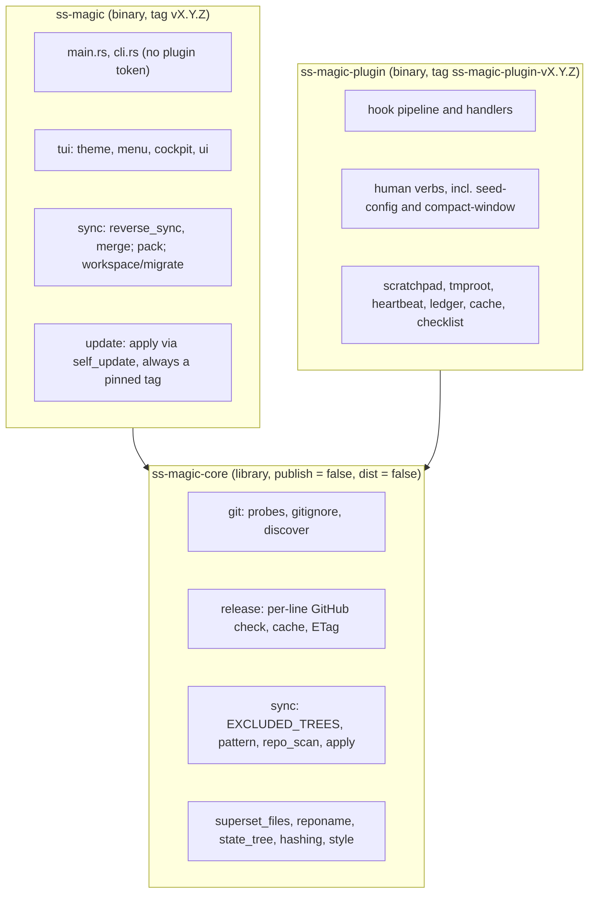

# ss-magic

Two Rust binaries for the Superset workspace contract (standalone repo:
`ViktorStiskala/superset-magic`): `ss-magic`, the interactive sync CLI, and
`ss-magic-plugin`, the Claude Code plugin. See [README.md](./README.md) for
user-facing docs.

This file is the index. The contributor instructions live in `.claude/rules/`:
three rule files load in every session, and four architecture maps load only
when a file they cover is read, written or edited. A read through `cat` or
`sed` in a shell does NOT load a map, so open the map named in the table below
before changing or explaining a file it covers.

| Rule file | Loads | Read this before |
|---|---|---|
| [.claude/rules/hard-rules.md](./.claude/rules/hard-rules.md) | every session | touching sync, pack, any plugin gate, or a path check |
| [.claude/rules/conventions.md](./.claude/rules/conventions.md) | every session | writing code, tests, docs, or a version bump |
| [.claude/rules/build-release.md](./.claude/rules/build-release.md) | every session | building, tagging, or editing a version surface |
| [.claude/rules/architecture-core.md](./.claude/rules/architecture-core.md) | `crates/ss-magic-core/**` | touching the shared library |
| [.claude/rules/architecture-cli.md](./.claude/rules/architecture-cli.md) | `crates/ss-magic/**` | touching the `ss-magic` sync CLI |
| [.claude/rules/architecture-plugin.md](./.claude/rules/architecture-plugin.md) | `crates/ss-magic-plugin/**`, `assets/workflow/**` | touching the plugin binary or the checklist CI template |
| [.claude/rules/plugin-assets.md](./.claude/rules/plugin-assets.md) | `plugin/**`, `scripts/**`, `.claude-plugin/**`, `.github/**`, `dist-workspace.toml`, `docs/runbooks/**` | touching the packaged plugin tree, a script, CI, or the release config |

## Cross-crate invariants

These hold across crate boundaries, so no single architecture map owns them:

- The two binaries depend on `ss-magic-core` and never on each other; the
  plugin crate links neither `self_update` nor `inquire`/`ratatui`.
- `STATE_REL` (core's `state_tree.rs`) equals the `.superset/.magic` entry of
  `sync::EXCLUDED_TREES`, so the plugin's state tree is never synced or packed.
- `git::discover` (core) is wired into the plugin crate only; every CLI command
  keeps the subprocess probes.
- No hook reaches a verb that can set `plugin.enabled` (`enable`, `disable`,
  `config set`).
- Skills and every model-facing text spell commands `ss-magic-plugin <verb>`;
  nobody types a plugin verb in a terminal.

## Architecture

Layered to keep the pure logic unit-testable in isolation from the
interactive layer, and split across three crates so the plugin can share the
plumbing without ever linking the updater or a prompt library.

The two binaries depend on core and never on each other, so no code path runs
from one into the other. The plugin crate links neither `self_update` nor
`inquire`/`ratatui`, so it cannot self-update or open a TUI even by mistake.

**`ss-magic-core`** (`crates/ss-magic-core/src/`, crate `ss_magic_core`) is
the shared library: `git/`, `hashing.rs`, `style.rs` (no `inquire`), the pure
half of `sync/`, `superset_files.rs`, `reponame.rs`, `state_tree.rs` (sole
owner of the `.superset/.magic` path and its ignore rule), `release.rs` and
`testutil.rs`. Map: [.claude/rules/architecture-core.md](./.claude/rules/architecture-core.md).

**`ss-magic`** (`crates/ss-magic/src/`) is the sync CLI: `main.rs`, `cli.rs`,
`pack.rs`, `sync/`, `tui/`, `workspace/`, `update/`, `src/tests/`. `main.rs`
re-exports core's `git` and `hashing` under `crate::`; other modules re-export
the rest, except `release` and `state_tree`, which are imported by path.
Map: [.claude/rules/architecture-cli.md](./.claude/rules/architecture-cli.md).

**`ss-magic-plugin`** (`crates/ss-magic-plugin/src/`, root `main.rs`) is the
hook runtime and verb tree. `main.rs` re-exports core's `git` and `hashing`,
`scratchpad.rs` re-exports `STATE_REL`, `ensure_state_ignored` and `now_secs`;
the rest (`style`, `superset_files`, `reponame`, `release`) is imported by path.
Map: [.claude/rules/architecture-plugin.md](./.claude/rules/architecture-plugin.md).

## Concepts and documented solutions

[CONCEPTS.md](./CONCEPTS.md) is the shared domain vocabulary in two halves: the
sync model (main checkout, forward and reverse sync, sync patterns, candidates,
excluded trees, pack) and the Claude Code plugin (hooks, human verbs, the state
tree, the Read gate, the operator checklist, release lines, the cost ledger).
Read it when orienting to the codebase or discussing domain concepts.

[docs/solutions/](./docs/solutions/) holds documented solutions to past problems
(bugs, best practices, design patterns, tooling decisions), organized by
category with YAML frontmatter (`module`, `tags`, `problem_type`, `component`).
Read the matching write-up when implementing or debugging in a documented area.
