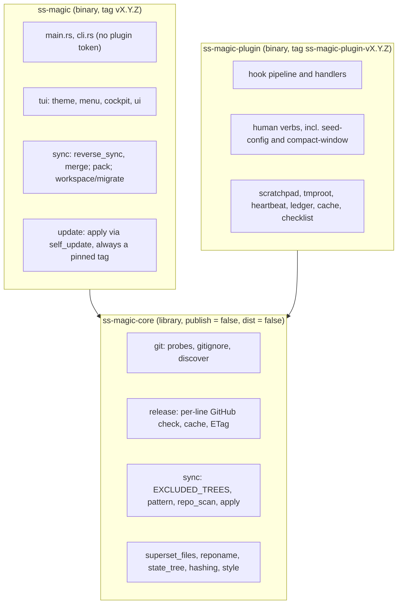

# ss-magic

Two Rust binaries for the Superset workspace contract (standalone repo:
`ViktorStiskala/superset-magic`): `ss-magic`, the interactive sync CLI, and
`ss-magic-plugin`, the Claude Code plugin. See README.md for user-facing docs.

This file is the index. The contributor instructions live in `.claude/rules/`:
three rule files load in every session, and four architecture maps load only
when a file they cover is read, written or edited. A read through `cat` or
`sed` in a shell does NOT load a map, so open the map named below before
changing or explaining a file it covers.

| Rule file | Loads | Read this before |
|---|---|---|
| [.claude/rules/hard-rules.md](./.claude/rules/hard-rules.md) | every session | touching sync, pack, any plugin gate, or a path check |
| [.claude/rules/conventions.md](./.claude/rules/conventions.md) | every session | writing code, tests, docs, or a version bump |
| [.claude/rules/build-release.md](./.claude/rules/build-release.md) | every session | building, tagging, or editing a version surface |
| [.claude/rules/architecture-core.md](./.claude/rules/architecture-core.md) | `crates/ss-magic-core/**` | touching the shared library |
| [.claude/rules/architecture-cli.md](./.claude/rules/architecture-cli.md) | `crates/ss-magic/**` | touching the `ss-magic` sync CLI |
| [.claude/rules/architecture-plugin.md](./.claude/rules/architecture-plugin.md) | `crates/ss-magic-plugin/**`, `assets/workflow/**` | touching the plugin binary or the checklist CI template |
| [.claude/rules/plugin-assets.md](./.claude/rules/plugin-assets.md) | `plugin/**`, `scripts/**`, `.claude-plugin/**`, `.github/**`, `dist-workspace.toml`, `docs/runbooks/**` | touching the packaged plugin tree, a script, CI, or the release config |

## Cross-crate invariants

These hold across crate boundaries, so no single architecture map owns them:

- The two binaries depend on `ss-magic-core` and never on each other; the
  plugin crate links neither `self_update` nor `inquire`/`ratatui`.
- `STATE_REL` (core's `state_tree.rs`) equals the `.superset/.magic` entry of
  `sync::EXCLUDED_TREES`, so the plugin's state tree is never synced or packed.
- `git::discover` (core) is wired into the plugin crate only; every CLI command
  keeps the subprocess probes.
- No hook reaches a verb that can set `plugin.enabled` (`enable`, `disable`,
  `config set`).
- Skills and every model-facing text spell commands `ss-magic-plugin <verb>`;
  nobody types a plugin verb in a terminal.

## Architecture

Layered to keep the pure logic unit-testable in isolation from the
interactive layer, and split across three crates so the plugin can share the
plumbing without ever linking the updater or a prompt library.

The two binaries depend on core and NEVER on each other. There is no code path
from one to the other, and that is the whole point of the split: the plugin
crate links neither `self_update` nor `inquire`/`ratatui`, so it cannot
self-update or open a TUI even by mistake.

`crates/ss-magic-core/src/` (library `ss-magic-core`, crate name
`ss_magic_core`) owns what both binaries need: `git/` (probes, `gitignore`,
`discover`), `hashing.rs`, `style.rs` (palette + color decision, NO `inquire`),
`sync/` (the pure half: `EXCLUDED_TREES`, `pattern`, `repo_scan`, `apply`),
`superset_files.rs`, `reponame.rs` (`repo_name_stem` and friends, extracted
from `pack.rs`), `state_tree.rs` (`STATE_REL` and `ensure_state_ignored`, the
`.superset/.magic` path's one owner) and `release.rs` (the per-line GitHub
release check, formerly `update/check.rs`). `testutil.rs` holds the shared test
helpers, compiled only under `cfg(test)` or the `testutil` feature.

`crates/ss-magic/src/` (binary `ss-magic`) keeps `main.rs`, `cli.rs`,
`pack.rs` (the engine; it re-exports `repo_name_stem`), `sync/{mod,
reverse_sync, merge}.rs` (the interactive half – they drive the cockpit – with
`sync/mod.rs` re-exporting core's `apply`/`pattern`/`repo_scan`/
`under_excluded_tree`), `tui/` (plus `tui/theme.rs`, which installs the
`inquire` render config from `style::enabled()`; `tui/mod.rs` re-exports
core's `style`), `workspace/{mod, migrate}.rs` (`workspace/mod.rs` re-exports
core's `superset_files`), `update/{mod, apply}.rs`, and the crate-root tests
under `tests/`. `main.rs` re-exports core's `git` and `hashing` under their old
`crate::` names, so a path inside the CLI reads exactly as it did before the
split.

`crates/ss-magic-plugin/src/` (binary `ss-magic-plugin`) is the former
`crates/ss-magic/src/plugin/` tree moved wholesale, with the old `plugin/mod.rs`
becoming the crate root `main.rs`; it has its own section below. It re-exports
core's `git` and `hashing` under `crate::` too, so every `crate::git::…` path
inside it still resolves, but it reaches the rest of core by real paths – the
two names that MOVED are `ss_magic_core::style` (the plugin has no `tui/`
module, so the CLI's old `crate::tui::style` spelling does not exist there) and
`ss_magic_core::reponame::repo_name_stem` (the plugin's identity slug used to
borrow it through `crate::pack`).

## Documented Solutions

`docs/solutions/` — documented solutions to past problems (bugs, best
practices, design patterns, workflow learnings), organized by category
with YAML frontmatter (`module`, `tags`, `problem_type`, `component`).
Relevant when implementing or debugging in documented areas.

`CONCEPTS.md` (repo root) — shared domain vocabulary (the sync model:
main checkout, forward/reverse sync, sync patterns, candidates).
Relevant when orienting to the codebase or discussing domain concepts.
