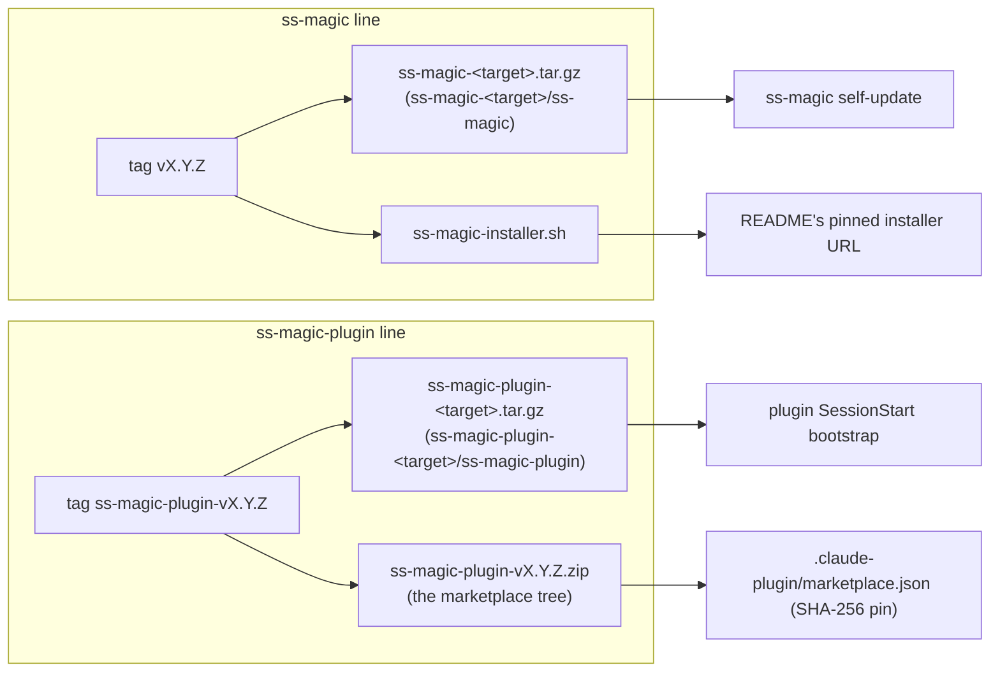

# Contributing to ss-magic

Thanks for your interest in improving ss-magic. This document covers building
from source, running the tests, and what a good PR looks like here. One thing
to keep in mind throughout: the files this tool moves commonly contain
secrets, so changes to path handling, overwrite behavior, gitignore rules,
archives, or self-update deserve particular care.

## Building from source

You need a Rust toolchain, provided by [rustup](https://rustup.rs/) (CI builds
on stable), and `git` on `PATH`. The GitHub CLI (`gh`) is optional — it's only
needed for the interactive finishing action that opens a PR, and for verifying
release attestations. Working on the Claude Code plugin additionally needs
`python3` (the packaging and release-assertion script) and `bash` – the
bootstrap suite is written for bash 3.2, the version macOS ships, so no
associative arrays, no `mapfile`, no `${var^^}`.

Install straight from git without cloning. The repository is a workspace with
two binaries, so name the package you want:

```sh
cargo install --git https://github.com/ViktorStiskala/superset-magic ss-magic
```

…or from a clone of this repo:

```sh
make build     # cargo build --release --workspace  (all three crates)
make install   # cargo install --path crates/ss-magic
make test      # cargo test --workspace --locked
make clean     # cargo clean
```

Both install paths drop `ss-magic` into `$CARGO_HOME/bin` (usually
`~/.cargo/bin`). ss-magic is not yet published to crates.io.

`make install` deliberately installs the sync CLI only. `ss-magic-plugin` is
delivered by the Claude Code marketplace and installed under Claude Code's own
plugin data directory by the plugin's `SessionStart` bootstrap; putting a
development copy on your `PATH` would not be picked up by anything, because the
hooks and the skills' wrapper both resolve the binary through that data
directory, never through `PATH`. To exercise it locally, build the workspace and
run `./target/release/ss-magic-plugin <verb>` directly.

**Tip:** the binary self-updates on bare / `sync` / `reverse-sync` / `pack`
invocations. While testing a local build, export `SS_MAGIC_NO_UPDATE=1` so the
auto-updater doesn't replace your development binary with the latest GitHub
release.

## Code layout

The repository is a Cargo workspace with three members. The root `Cargo.toml` is
a virtual manifest (no `[package]`): it owns the shared package metadata and
both build profiles (`release` with `opt-level = "z"`, and `dist`, which
cargo-dist uses and which inherits it), and lists the members under `crates/`:

- `crates/ss-magic-core` – the library both binaries share (`publish = false`
  and `[package.metadata.dist] dist = false`; its `0.1.0` version is never
  released or tagged, and is not a version surface). Nothing in it opens a
  prompt, draws a TUI, or self-updates.
- `crates/ss-magic` – the interactive sync CLI, binary `ss-magic`, released on
  bare `vX.Y.Z` tags.
- `crates/ss-magic-plugin` – the Claude Code plugin's hook runtime and verb
  tree, binary `ss-magic-plugin`, released on `ss-magic-plugin-vX.Y.Z` tags.

The two binaries are genuinely independent programs that happen to share
plumbing. `ss-magic` has no `plugin` subcommand: the token was removed, not
aliased. And the plugin crate depends on none of `self_update`, `inquire` or
`ratatui`, directly or transitively through core – so "the plugin never
self-updates and never opens a TUI" is a fact about what is linked rather than a
convention reviewers uphold. `cargo build` can only show a dependency is
*present*, so the absence is asserted by
`scripts/build-plugin-zip.py --check` and by `cargo tree -i` in CI.

Source is layered so the pure logic stays unit-testable in isolation from the
interactive layer, and grouped by purpose under each crate's `src/`.

In `ss-magic-core`:

- `git/` — git plumbing (read-only probes and mutating primitives; all git/gh
  interaction shells out via `std::process::Command` – **no `git2`**), the
  `.gitignore` helpers, and `discover`, the filesystem-only root discovery the
  plugin crate uses (its hook path, and the two read-only verbs that attribute
  ledger rows to a repository).
- `sync/` – pattern validation, the working-tree scan, the glob/exclude/copy
  engine shared by forward sync, reverse sync, and pack, and the
  `EXCLUDED_TREES` rule every enumeration applies.
- `superset_files.rs` – `.superset/` contract I/O.
- `style.rs` – the palette and the process-wide color decision (no `inquire`).
- `reponame.rs` – the `<repo>` name stem the pack archive and the plugin's
  session identity both derive from.
- `state_tree.rs` – the `.superset/.magic` constant and the one writer of its
  gitignore rule (called eagerly by `init`/`migrate`, lazily by the plugin's
  `enable` verb).
- `release.rs` – the per-line, daily-cached GitHub release check.
- `hashing.rs` – FNV-1a for cache keys and a hand-rolled SHA-256 the plugin's
  shell bootstrap has to reproduce with `shasum`.
- `testutil.rs` – shared test fixtures, compiled only for tests (see below).

In `ss-magic`:

- `sync/` – `merge.rs` owns the reverse-sync push/pull/merge decision model and
  per-hunk merge assembly (`similar`-based diffing); `reverse_sync.rs` owns the
  backup-first, TOCTOU-guarded apply seam that writes a cockpit decision to
  disk; `mod.rs` re-exports core's pure half so `crate::sync::apply` still
  resolves.
- `tui/` – the interactive layer: `inquire` menus and pickers, `theme.rs`
  (installs the `inquire` render config from core's color decision), the
  pure diff/decision models (`diffmodel`, also built on `similar`), and the
  full-screen `ratatui` reverse-sync merge cockpit (`cockpit`, on the
  `crossterm` backend). `tui/mod.rs` re-exports core's `style`.
- `workspace/` – the init/migration lifecycle (`migrate.rs`); re-exports core's
  `superset_files`.
- `update/` – the self-update apply path and the `update` verb, on top of
  core's `release`.
- `pack.rs`, `cli.rs`, `main.rs` – the pack engine (re-exporting core's
  `repo_name_stem`), the hand-rolled arg parser (**no `clap`** – this is also
  where the `-n`/`--no-backup` flag for `sync`/`reverse-sync` is parsed), and
  composition (update gate, dispatch, event rendering; `main.rs` re-exports
  core's `git` and `hashing` under their old `crate::` names).

In `ss-magic-plugin`, whose `main.rs` owns only the argv parse and the dispatch
table:

- `hook/` – the stdin decode, the two pre-dispatch gates, the per-event
  handlers and the JSON envelope.
- `checklist/` – the typed document, its canonical ordering, validator,
  renderer and verbs; the submodules are private behind `checklist/mod.rs`, so
  no caller can bypass ordering or validation.
- `config.rs`, `scratchpad.rs`, `cache.rs`, `bypass.rs`, `expect_artifact.rs`,
  `claim.rs`, `tmproot.rs`, `heartbeat.rs`, `ledger.rs`, `identity.rs`,
  `compact_window.rs`, `setup_ci.rs`, `status.rs`, `spill_index.rs`,
  `release_check.rs`, `pathnorm.rs`, `atomic.rs` – the state, reporting and
  path modules. `release_check.rs` is the one place the plugin constructs an
  HTTP client (only under `release-check --refresh`); the hooks read its cache
  and never fetch.

Two rules shape the whole crate: a hook answers the harness with JSON on stdout
and must always exit 0, while a human verb reports on stderr and exits non-zero.
And no hook may reach anything that can set `plugin.enabled`, so a repository
cannot arrange its own enablement by getting a hook to fire. That is narrower
than "no hook writes configuration": the bootstrap does invoke `seed-config`,
which writes the gate defaults into `.superset/magic.json` – but
`config::seed_block` has no code path that emits an `enabled` key at all, which
is a stronger guarantee than being kept away from it by convention.
`HumanVerb::writes_config` and `HumanVerb::can_set_enabled` are the two
predicates, and only the second one carries the safety property.

Outside the crates, the plugin ships as a packaged tree: `plugin/` (its manifest,
hooks, bootstrap script, hook shim, wrapper, shared shell libs, version pin and
skills), `.claude-plugin/marketplace.json` (which pins that tree's zip by
SHA-256), `scripts/build-plugin-zip.py` (the reproducible builder and the
release assertions), `scripts/test-bootstrap.sh`, `scripts/mark-latest.sh` (the
post-announce step that keeps the repository's "latest" mark on the CLI line,
with `scripts/test-mark-latest.sh` driving it against a fake `gh` – on Linux in
CI's `plugin` job and under `/bin/bash` 3.2 on its macOS `test` leg),
`.github/workflows/mark-latest.yml` (the reusable workflow cargo-dist calls it
from), and `assets/workflow/checklist.yml` (embedded into the plugin binary by
its `setup_ci.rs`).

`assets/magic.sh` is the canonical wrapper script, embedded into the binary
via `include_str!` — edit it there, never in a repo's generated `.superset/`
copy. Domain vocabulary (main checkout, forward/reverse sync, sync patterns,
candidates) is defined in [CONCEPTS.md](./CONCEPTS.md).

A few boundaries to preserve:

- Pattern syntax checks live in `sync/pattern.rs` and expansion (with the
  default `node_modules` / `.venv` excludes) in `sync/apply.rs` — don't add a
  second glob implementation with divergent semantics.
- The sync and pack engines emit typed events through caller-supplied
  closures; rendering and terminal side effects belong in `main.rs` / `tui/`,
  which also keeps the engines testable.
- Keep new logic out of the interactive layer where possible so it stays
  unit-testable.
- The excluded-trees filter (`sync::under_excluded_tree` over
  `sync::EXCLUDED_TREES`) must be applied at every point of **final
  enumeration** – each directory walk – never only on an upstream match list. A
  later step that re-walks the filesystem would otherwise re-admit an excluded
  subtree through an ancestor directory match.
- The plugin must stay unable to self-update or open a TUI, by construction.
  Do not add `self_update`, `inquire` or `ratatui` to
  `crates/ss-magic-plugin/Cargo.toml` – or to `crates/ss-magic-core/Cargo.toml`,
  which the plugin links, so a dependency added there reaches it transitively
  and the guarantee is gone without the plugin's own manifest changing a line.
- Do not reintroduce a `plugin` subcommand on the `ss-magic` CLI, in any form.
  It was removed outright; a compatibility alias would put the plugin's verbs
  back inside the binary that self-updates and opens a menu.

## Tests

`cargo test` is no longer the whole suite. Run all five the way CI does, from
the repository root:

```sh
cargo test --workspace --locked                  # the Rust suite, all three crates
python3 scripts/build-plugin-zip.py --selftest   # the plugin builder's own tests
python3 scripts/build-plugin-zip.py --check      # the release assertions
/bin/bash scripts/test-bootstrap.sh              # the bootstrap's failure paths
/bin/bash scripts/test-mark-latest.sh            # the latest-mark selection
```

The last four cover code `cargo test` cannot reach:

- `--selftest` exercises the builder's reproducibility guarantees (sorted
  entries, fixed 1980-01-01 timestamps, normalized modes, stored not deflated)
  and its loud refusals (a symlink or a non-ASCII filename, either of which
  would make the digest depend on which platform built it).
- `--check` prints one line per release assertion and fails on any of them. Run
  it after any change under `plugin/` – re-pin first with `--update-manifest`:

  ```plaintext
  ok   R101 marketplace sha256 key
  ok   R95 version surfaces (ss-magic)
  ok   R95 version surfaces (ss-magic-plugin)
  ok   distinct release lines
  ok   hooks spawn through the shim
  ok   workspace shape
  ok   R96 committed digest pin
  ```

  In order: the marketplace entry actually carries a `sha256` key (spelled
  exactly that – an unknown key inside a source object is silently ignored, so
  a typo installs the plugin unpinned); each release line's own version surfaces
  agree, with README's pinned installer tag compared `<=` rather than `==`; the
  two lines' versions differ; every `hooks.json` entry spawns `bash` on a script
  that ships inside `${CLAUDE_PLUGIN_ROOT}`; the plugin and core manifests
  declare none of `self_update` / `inquire` / `ratatui` and core carries
  `publish = false`; and the committed digest matches the current `plugin/`
  tree.
- `test-bootstrap.sh` drives `plugin/hooks/bootstrap.sh` through the failure
  modes that matter (offline, corrupted download, hostile version pin,
  unwritable data directory, unsupported platform, concurrent sessions) using a
  `curl` shim, asserting for each that it exits 0, prints nothing on stdout, and
  leaves any pre-existing binary untouched. Pass `-v` for per-assertion output.
  Its assertion helpers are `scripts/lib/test-harness.sh`, shared with
  `test-mark-latest.sh`; a new shell suite sources the same file.
- The same script also covers `plugin/hooks/run-hook.sh`, the shim every event
  hook is spawned through. Those cases run it the way the harness does and
  assert it exits 0 with both streams empty and the binary un-invoked whenever
  it cannot resolve one – with no binary installed, with the data directory set
  but empty, with the handoff removed, with a directory in the binary's place,
  and with no event argument, and with a binary that is present and executable
  but not a loadable executable (the ENOEXEC case, where bash reinterprets the
  file as a shell script rather than reporting a failure) – plus the two success
  paths, which must exec with exactly `hook <event>` and no leading `plugin`
  token. A separate assertion checks every `hooks.json`
  entry names `bash` and a script under `${CLAUDE_PLUGIN_ROOT}` that exists in
  the packaged tree, since a command naming a path the bootstrap creates at
  runtime is what made a first session die with ENOENT.
- The wrapper `plugin/bin/ss-magic-plugin` is covered the same way, against the
  contract it states for itself: exit 0 with one line of explanation rather than
  failing a skill mid-run. Its cases include a directory sitting where the binary
  should be and a present-but-unloadable binary, both of which reached `exec` and
  ended in bash's own diagnostic before the shared `lib/execguard.sh` landed.

One more check is not a suite but belongs in the same list, because a build can
never make it: `cargo build` proves a dependency is *present* and says nothing
about one being absent, so CI runs `cargo tree --locked -p ss-magic-plugin -i
<crate>` for each of `self_update`, `inquire` and `ratatui` and requires no
match. Run it locally when you touch either manifest.

Conventions worth knowing:

- Each module declares `#[cfg(test)] mod tests;` with the body in a sibling
  child file (`<module>/tests.rs`), keeping private-item access – in all three
  crates, the plugin crate included. The CLI's crate-root integration tests live in
  `crates/ss-magic/src/tests/` (`sync.rs`, `reverse_sync_flow.rs`,
  `update_gate.rs`); the shared helpers are `ss_magic_core::testutil`
  (`crates/ss-magic-core/src/testutil.rs`), compiled for core's own tests and,
  through core's `testutil` feature, for a binary's – enable it only from
  `[dev-dependencies]`, so a release build never contains it.
- `cargo test` starts each test binary in its crate directory
  (`crates/<name>`), not the repository root. A test that needs a
  repository-level directory to exist in the process's working directory
  runs its assertion in a child process with `run_ignored_test_in_child_from`
  and a scratch cwd, the same way environment-variable tests use
  `run_ignored_test_in_child` – never `set_current_dir` in a parallel suite.
- Tests use `tempfile` plus shell-invoked `git init` / `git worktree add` to
  build real repos — no git mocking. They must not depend on or mutate your
  real repositories, global git config, clipboard, or installed `ss-magic`.
- The interactive menu/pickers and the final-action git operations
  (commit/push/PR) have no unit tests; they are validated by manual smoke
  testing. If your change touches one of those surfaces, describe the manual
  path you exercised in the PR.
- The reverse-sync merge cockpit (`tui/cockpit.rs`) is a partial exception:
  its event loop and terminal lifecycle are manual-smoke like the rest of the
  interactive layer, but its render path (`draw`) and pure key dispatch
  (`handle_key`) ARE unit-tested by driving `ratatui::backend::TestBackend`
  with synthetic key events — no real terminal required. Prefer extending
  those tests over adding new manual-smoke-only cockpit behavior.
- Test an exclusivity property by actually racing it, never sequentially. A
  "consume exactly once" claim that is checked by calling it twice in a row
  proves the state machine, not the exclusion – see
  [docs/solutions/logic-errors/unlink-is-not-an-exclusive-claim.md](./docs/solutions/logic-errors/unlink-is-not-an-exclusive-claim.md)
  for the version of that mistake this repo shipped and measured.
- Give any parser over line-oriented command output a **single-line** fixture.
  A defect that corrupts only the first line hides completely behind a
  multi-line one; that is exactly how a trimmed `git status --porcelain` went
  unnoticed.

CI (`.github/workflows/ci.yml`) runs the Rust suite on Ubuntu and macOS for
every PR commit and every push to `main`, plus a `plugin` job carrying the
builder selftest, the release assertions, the `cargo tree` dependency-absence
proof, a check that a content change under `plugin/` came with a version bump
(its baseline considers both tag shapes), the bootstrap failure-path suite, the
latest-mark selection suite, a
build of the exact asset cargo-dist will publish, and three document greps: no
skill body may name `CLAUDE_PLUGIN_DATA`, no document may spell the retired
`ss-magic` `plugin` subcommand form, and `README.md` may name no
`releases/latest/download/` URL. The plan phase additionally refuses a release
tag matching neither `^v[0-9]+\.[0-9]+\.[0-9]+$` nor
`^ss-magic-plugin-v[0-9]+\.[0-9]+\.[0-9]+$` – a prefixed CLI tag such as
`ss-magic-v0.11.1` would publish a release the updater's anchored filter and
every installed binary ignore, stranding the line silently. The same workflow
gates releases: the cargo-dist release pipeline invokes it as a plan job, so a
release cannot ship with a red suite.

## Pull requests

- Make sure `cargo test --workspace --locked` passes locally; add or update tests for
  behavior-bearing changes (bug fixes should include a test that reproduces
  the issue).
- Make sure the four non-Rust suites above pass too, if your change touches
  `plugin/`, `scripts/`, or anything they assert about, and re-run the
  `cargo tree` absence proof if you touched either manifest.
- **Bump the version of the crate you changed**, on every surface belonging to
  its release line. The two lines are numbered independently and the surfaces do
  not mix:

  | Line | Tag shape | Version surfaces |
  | --- | --- | --- |
  | `ss-magic` | `vX.Y.Z` | `crates/ss-magic/Cargo.toml`; the `ss-magic` entry in `Cargo.lock`; `README.md`'s pinned installer tag (`<=`, never `==` – see below) |
  | `ss-magic-plugin` | `ss-magic-plugin-vX.Y.Z` | `crates/ss-magic-plugin/Cargo.toml`; the `ss-magic-plugin` entry in `Cargo.lock`; `plugin/.claude-plugin/plugin.json`; `plugin/ss-magic-plugin.version`; both the tag **and** the asset name in `.claude-plugin/marketplace.json`'s release URL; the literal zip filename in the plugin crate's `[[package.metadata.dist.extra-artifacts]]` |

  `crates/ss-magic-core/Cargo.toml` is *not* a surface: core is `publish = false`
  and `dist = false`, never released or tagged, and its `0.1.0` moves only on an
  incompatible change to its own API. Let `python3
  scripts/build-plugin-zip.py --check` enumerate the surfaces rather than working
  from a remembered count – this file once said "four" while the script checked
  seven.
- **The two versions must never be equal.** cargo-dist reads a release tag as
  `[PACKAGE_NAME-]VERSION`, so a bare `vX.Y.Z` tag announces *every* dist-able
  package sitting at that version. Keeping the numbers apart is the entire
  mechanism by which a bare CLI tag releases the CLI alone; `--check` refuses a
  tree where they match, and `Cargo.lock` must be regenerated by `cargo build`
  rather than edited by a blind version replace (it holds one `[[package]]` per
  crate, so a bump must match on the `name = "…"` line).
- **Which bump, and why it matters.** For `ss-magic`: any change that alters CLI
  behavior – a fix, a new/changed command or flag, different output. The
  installed binary self-updates from GitHub Releases keyed on version, so a
  change without a bump never reaches users. For `ss-magic-plugin`: any change
  under `plugin/` or in the plugin crate. The resolved *version*, not the
  digest, is what tells the Claude Code client to update, so changing the zip
  and its `sha256` without bumping the version leaves every installed user
  silently on the cached copy. Pre-1.0 rules for the CLI: bug fixes bump patch;
  new or changed user-visible behavior bumps minor. The plugin line starts at
  `1.0.0` and follows ordinary semver.
- **A change under `plugin/` also re-pins the digest.** Run `python3
  scripts/build-plugin-zip.py --update-manifest`, then `--check`.
- Update the docs in the same PR: `README.md` must describe the tool as it is
  after your change, and `CLAUDE.md` / `.cursor/BUGBOT.md` must reflect any
  architecture or convention change. `.cursor/BUGBOT.md` has to stay
  self-contained – restate a convention inline there rather than linking to it.
- Keep the secret-safety invariants intact unless the change is explicitly
  about them: absolute / `..` patterns rejected, reverse-synced paths always
  gitignored in main, no overwrite of an existing main-checkout file without a
  diff + explicit confirm, pack never following symlinks or packing itself,
  staged/atomic writes for `.superset/` and archives, and the excluded trees
  (`.superset/backups`, `.superset/.magic`, `.scratchpad`, `.git`) pruned during
  every directory walk.
- Keep the plugin's two postures intact: a hook always exits 0 and never prints
  anything but its JSON envelope on stdout, while the gates that protect secrets
  refuse on "could not determine" as well as on "no". Do not simplify either
  half toward the other.

## Releases and versioning

Releases are built and published to GitHub Releases by
[cargo-dist](https://opensource.axo.dev/cargo-dist/) (configured in
`dist-workspace.toml`), which also generates the one-line installer script and
per-archive checksums. The pipeline runs the locked test suite before building
macOS (arm64/x86-64) and Linux (arm64/x86-64) archives, and attests the
per-target `.tar.gz` archives with signed build provenance (Sigstore/Rekor);
users can verify them with `gh attestation verify` as described in the README.
The self-updater itself trusts the TLS-authenticated download plus cargo-dist
checksums — it does not consume the attestations.

### Two release lines out of one workspace



cargo-dist parses a tag as `[PACKAGE_NAME-]VERSION`. The prefixed shape names
the plugin explicitly; the bare shape names "every dist-able package sitting at
that version", so a bare tag selects the CLI alone **only because the two crate
versions always differ**. There is no way to say "this tag means the CLI only",
which is why `--check` refuses a tree where the versions match. The CLI's bare
shape is not negotiable either: the updater's anchored filter and every
already-installed binary look for `vX.Y.Z`, so a prefixed `ss-magic-vX.Y.Z` tag
would publish a release the whole installed base ignores.

The plugin zip is declared as an extra artifact on the **plugin crate**
(`[[package.metadata.dist.extra-artifacts]]` in
`crates/ss-magic-plugin/Cargo.toml`, with `working-dir = "../.."`), never at
workspace level – a workspace-level entry would attach the zip to every release,
the CLI's included. `scripts/build-plugin-zip.py` packs `plugin/` into
`ss-magic-plugin-v<version>.zip` byte-reproducibly, and
`.claude-plugin/marketplace.json` pins that zip by SHA-256 with a release-asset
URL. Reproducibility is what lets the digest be computed and committed *before*
the release exists and re-derived identically by CI; `.gitattributes` marks
`plugin/**` as `-text` so a checkout's line-ending conversion can never move it.

Because the CLI self-updates from the newest `vX.Y.Z` release it finds in the
repository's release list, its version number is the release mechanism:
publishing a release with a higher version rolls it out to every installed
binary within a day (or immediately via `ss-magic update`). The plugin's binary
works the other way round – it is pinned by `plugin/ss-magic-plugin.version` and
replaced only when the plugin itself is updated through `/plugin`, so the
shipped hooks, skills and Markdown never describe a different binary than the
one running them.

### Release procedure, per line

**Both lines.** The repository's tag ruleset (recorded in
[docs/runbooks/forge-tag-and-release-protection.md](./docs/runbooks/forge-tag-and-release-protection.md))
refuses a tag push whose COMMIT does not carry a signature GitHub verifies, and
refuses every later move or delete of a tag that landed. Tagging `main`'s tip
satisfies the first rule as long as the commits there are signed – the
maintainer's SSH-signed commits and GitHub's own merge commits both are – while
a tag on a locally made, unsigned commit is refused before the pipeline runs.
The tag object itself need not be signed (measured: an unsigned lightweight tag
on a signed commit was accepted), so `git tag -s` is good practice rather than
a requirement. The second rule is why a mis-cut release is fixed by a new patch
release, never by moving the tag.

**CLI (`ss-magic`).** Bump `crates/ss-magic/Cargo.toml`, run `cargo build` so
`Cargo.lock` follows, run `--check`, merge. Then `git tag v<X.Y.Z>` on `main`
and push the tag. Finally, advance `README.md`'s pinned installer tag to
`v<X.Y.Z>` in a follow-up commit – the pin is only ever moved **after** the
release it names exists.

That last step is why `--check` compares the README pin with `<=` and not `==`.
The procedure is bump → merge → tag, so an equality rule would make `main`'s
README name an unreleased tag – and 404 the documented install command – for the
whole window between a merged bump and a published release. A lagging pin names
an older release that still works, which is harmless.

**Plugin (`ss-magic-plugin`).** Bump `crates/ss-magic-plugin/Cargo.toml`,
`plugin/.claude-plugin/plugin.json`, `plugin/ss-magic-plugin.version`, the
marketplace URL (tag and asset), and the extra-artifact filename. Run `cargo
build`, then `--update-manifest`, then `--check`. Merge. Then `git tag
ss-magic-plugin-v<X.Y.Z>` on `main` and push the tag. Afterwards, confirm the
newest `v*` release is still marked latest:

```sh
gh api repos/ViktorStiskala/superset-magic/releases/latest --jq .tag_name
```

That must print a bare `v*` tag. `gh release create` marks whatever it just
published as the repository's latest release, and every `ss-magic` binary
released before the per-line update check polls `releases/latest` and parses
only a bare `vX.Y.Z`; a plugin release left holding the mark makes those
installs report "already up to date" until the next CLI release. So the release
workflow's post-announce job (`custom-mark-latest`, from
`dist-workspace.toml`'s `post-announce-jobs = ["./mark-latest"]`, running
`.github/workflows/mark-latest.yml` → `scripts/mark-latest.sh`) hands the mark
back: for a plugin tag it lists the releases, drops drafts and prereleases,
picks the numerically greatest bare `v*` tag, runs `gh release edit <tag>
--latest`, and reads `releases/latest` back – failing the job loudly if the
mark did not take. For a `v*` tag it exits 0 without touching anything.

If the command above prints the plugin tag anyway – the job was red, or the
token could not edit the release – put the mark back by hand, either from the
Actions tab (`Mark newest CLI release as latest` → Run workflow, with the
plugin tag as input) or with the one-liner the job itself prints on failure:

```sh
gh release edit <newest bare v tag> --latest
```

**Plugin tags are cut only from commits already on the default branch.**
`/plugin` resolves the available version from `.claude-plugin/marketplace.json`
on the default branch, while a release check sees a tag the moment it is
published – so a tag cut from an unmerged commit produces a suggestion pointing
at an update the user cannot yet obtain.

**Never tag a commit where the two crates share a version string.** `--check`
refuses it, and CI's plan phase runs `--check`, so such a tag fails before any
artifact is built.

## License

ss-magic is dual-licensed under [MIT](./LICENSE-MIT) and
[Apache-2.0](./LICENSE-APACHE). Unless you explicitly state otherwise, any
contribution intentionally submitted for inclusion in the work by you, as
defined in the Apache-2.0 license, shall be dual licensed as above, without
any additional terms or conditions.
