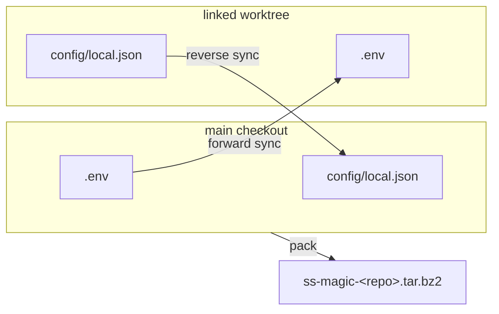

# ss-magic

Keep gitignored files – `.env` secrets, local overrides, machine-specific
config – in sync across git worktrees: automatically when a
[Superset](https://superset.sh) workspace is created, on demand from the
command line anywhere else.

## The problem

Git worktrees share your repo's history, branches, and objects – but not its
gitignored files. Create a new worktree and every file git ignores stays
behind in the original checkout: `.env`, `.dev.vars`, local database configs,
per-developer overrides. The new tree is "clean" in the worst way – nothing
runs until you hand-copy your secrets in, and you re-do that copy for every
worktree you create.

The same asymmetry bites in reverse: add or rotate a secret *inside* a
worktree and it's stranded there. Gitignored files never travel through a
merge, so the main checkout – and every future worktree created from it –
silently misses the update.

## What ss-magic does

You declare the files once, as glob patterns in a committed
`.superset/magic.json`. ss-magic then gives you three operations over that one
file set:

- **Forward sync** (`ss-magic sync`) – copy every matching file from the
  repo's main checkout into the current worktree, backing up every file it's
  about to overwrite first (skip with `-n`/`--no-backup`). Under Superset this
  runs automatically the moment a workspace is created, via the setup-script
  hook; without Superset it's one command to run in a fresh worktree.
- **Sync** (interactive, worktree menu) – reconcile every configured file
  against the main checkout in either direction, through a full-screen merge
  cockpit: a file list beside a live side-by-side diff, where you set each
  file's direction (push to main / pull from main / per-hunk merge / delete
  from both / undecided) and apply the batch behind one confirmation, with a
  timestamped backup taken before every overwrite or delete. It's how a new
  secret created in a worktree reaches everywhere else, and how a file added
  directly to main reaches a worktree. For scripted use, `ss-magic
  reverse-sync` non-interactively bulk-pushes every git-untracked candidate
  that differs from main.
- **Pack** (`ss-magic pack`) – snapshot the whole configured file set into a
  single `ss-magic-<repo>.tar.bz2` for backup, machine migration, or handing
  to a teammate.



Tracked files are deliberately out of scope – they already travel through
normal git commits and merges. And ss-magic is not a secrets manager: the
files remain ordinary files on disk, and you decide which paths may be copied
or packed.

ss-magic also ships a **Claude Code plugin** built on the same
`.superset/magic.json` contract – a durable per-worktree scratchpad, a gate that
keeps oversized file reads out of the context window, an operator checklist, and
a per-session cost ledger. It is a separate binary (`ss-magic-plugin`) on its
own release line, installs from a marketplace, is off until you enable it per
repository, and is described in [its own section](#the-claude-code-plugin)
below.

If you work with git worktrees and carry per-developer gitignored files, this
tool is for you. It is built for Superset's workspace lifecycle, but forward
sync, reverse sync, pack, and init are ordinary CLI commands that work in any
worktree setup.

## How it works with Superset

Superset workspaces are isolated git worktrees. When Superset creates one, it
runs the `setup` commands from `.superset/config.json` sequentially inside the
new worktree (see the
[setup & teardown scripts docs](https://docs.superset.sh/setup-teardown-scripts)).
ss-magic's init writes this hook for you:

```json
{
  "setup": ["./.superset/magic.sh sync"]
}
```

`magic.sh` is a small committed wrapper: it `exec`s the installed `ss-magic`
binary, and if the binary isn't installed it prints an install hint and exits
0 – a missing ss-magic never blocks Superset's setup pipeline. ss-magic's role
in the hook is the file copy only; dependency installation, migrations, and
dev servers stay in Superset's own `config.json` commands. The result: every
new workspace starts with your secrets and local config already in place.

## Install

### One-line installer (recommended – macOS & Linux)

```sh
curl -sSfL https://github.com/ViktorStiskala/superset-magic/releases/download/v0.11.2/ss-magic-installer.sh | sh
```

It fetches the right prebuilt binary for your platform and puts `ss-magic` on
your `PATH`. From then on the binary keeps itself current – see
[Self-update](#self-update).

**Supported platforms:** macOS (Apple Silicon and Intel) and Linux (x86-64 and
arm64). Windows is not in the release matrix yet.

#### Why that URL names a version instead of `latest`

This repository publishes **two release lines** out of one workspace: the
`ss-magic` CLI on bare `vX.Y.Z` tags, and the
[Claude Code plugin](#the-claude-code-plugin) on `ss-magic-plugin-vX.Y.Z` tags.
GitHub's "latest" mark is repository-wide, so right after a plugin release it
points at that release – which publishes no installer script at all, and would
404 the command above. (The release workflow hands the mark back to the newest
CLI release in a post-announce step, so the window is minutes, but a pinned
URL never depends on it.) A pinned URL is also simply reproducible: what you
copy today installs the same bytes tomorrow.

The pinned tag is allowed to lag the newest CLI version, and usually does by one
release. The release procedure is bump → merge → tag, so a README forced to name
the current crate version would name an *unreleased* tag – and 404 – for the
whole window between a merged version bump and a published release. Naming a
slightly older release is harmless instead: it exists, it installs, and the
binary updates itself to the newest release within a day (or immediately with
`ss-magic update`).

### Manual download

Grab the archive for your platform plus its `.sha256` from the
[v0.11.2 release](https://github.com/ViktorStiskala/superset-magic/releases/tag/v0.11.2),
verify the checksum, extract, and move `ss-magic` onto your `PATH`. The CLI's
archives are named `ss-magic-<target>.tar.gz`. The plugin's own
`ss-magic-plugin-<target>.tar.gz` archives sit on the plugin's releases and are
not installed by hand – its `SessionStart` bootstrap fetches the one it pins.

Building from source is covered in [CONTRIBUTING.md](./CONTRIBUTING.md).

### Verify a release

Releases after v0.2.0 attest their platform archives with signed build
provenance – `ss-magic-<target>.tar.gz` on the CLI's `vX.Y.Z` releases and
`ss-magic-plugin-<target>.tar.gz` on the plugin's `ss-magic-plugin-vX.Y.Z`
releases. This repo is public, so attestations are recorded in Sigstore's public
[Rekor](https://docs.sigstore.dev/logging/overview/) transparency log. Verify a
downloaded archive with the [GitHub CLI](https://cli.github.com/):

```sh
gh attestation verify ss-magic-aarch64-apple-darwin.tar.gz -R ViktorStiskala/superset-magic
gh attestation verify ss-magic-plugin-aarch64-apple-darwin.tar.gz -R ViktorStiskala/superset-magic
```

This proves the archive was built by this repository's release workflow from a
specific commit – provenance, not a security audit of the contents. Only the
`.tar.gz` archives are attested; the installer script, the `.sha256` files and
the plugin's marketplace zip are not. Each of those has its own integrity path:
TLS plus the checksummed archives for the installer, the published `.sha256`
sibling for the plugin bootstrap's download, and the SHA-256 pin in
`.claude-plugin/marketplace.json` for the zip. Release notes also include a
`gh attestation verify --bundle` variant generated by cargo-dist – both commands
are equivalent checks.

## Getting started

In your repo's **main checkout** (the primary checkout your worktrees are
linked to), run:

```sh
ss-magic
```

and pick **init** from the menu. It walks you through selecting the file
patterns to sync and writes the [`.superset/` contract](#the-superset-contract)
– `config.json` with the setup hook, the `magic.sh` wrapper, `magic.json` with
your patterns, and a gitignored `magic.local.json` overlay. You then choose a
finishing action: commit and push, open a PR, or leave the changes on disk.

For scripted provisioning there's a non-interactive form:

```sh
ss-magic init '.env' '**/.dev.vars' 'config/local/*'
```

Quote glob patterns so your shell doesn't expand them before ss-magic sees
them. The non-interactive init leaves the generated files uncommitted on disk.

Once the contract is committed, every worktree created through Superset.sh app
gets the matching files copied in automatically. In a worktree created any
other way, run `ss-magic sync` yourself.

## Commands

```plaintext
ss-magic              # interactive operation menu (location-aware)
ss-magic sync         # non-interactive forward copy: main → current worktree
ss-magic reverse-sync # non-interactive bulk copy: current worktree → main,
                       # for git-untracked files matching the configured
                       # patterns
ss-magic pack         # archive the configured files into ss-magic-<repo>.tar.bz2
ss-magic update       # force a self-update to the newest CLI release
ss-magic init [PATTERN...]   # non-interactively seed .superset (magic.json
                             # layout); extra args become magic.json `files`
ss-magic --help       # usage
ss-magic --version    # print the version and exit
```

`sync` and `reverse-sync` both take a timestamped backup of every file they're
about to overwrite unless `-n`/`--no-backup` is given – skipping it leaves no
recovery path for an overwritten or deleted untracked secret. The worktree
menu opened by bare `ss-magic` offers a single interactive **Sync** entry that
reconciles files in both directions through the merge cockpit; there's no
separate forward/reverse choice there. `SS_MAGIC_NO_UPDATE=1` disables the
auto-update gate (the explicit `ss-magic update` ignores it and always checks).

There is no `plugin` subcommand: the [Claude Code plugin](#the-claude-code-plugin)
is a separate binary, `ss-magic-plugin`, delivered by the marketplace and reached
from inside a Claude Code session. `ss-magic plugin` is an unknown subcommand
like any other and gets the ordinary unknown-subcommand error.

### `ss-magic` – the interactive menu

The bare invocation opens a menu whose options depend on where you run it:

- **Main checkout** – one lifecycle operation, chosen from the detected state:
  init the contract, migrate an old `setup.sh` layout, or edit the
  synced-files config.
- **Worktree** – a single **Sync** entry: the interactive merge cockpit,
  reconciling every configured file against main in both directions.
- **Pack** is offered in every worktree and in a main checkout whose contract
  is already set up (it fails with an error if `magic.json` is missing).

Nothing runs until you pick it; Esc / Ctrl-C leaves the tree untouched. The
menu needs a terminal on both stdin and stdout: run piped or from a script, it
exits 2 without opening and points at `ss-magic --help` for the
non-interactive commands.

#### Init and migration (main checkout)

From the main-checkout menu, ss-magic branches on `config.json`'s `setup`:

- An entry referencing the old `./.superset/setup.sh` → **migrate**: rename
  `setup_config.json` → `magic.json` (carrying its patterns along), write
  `magic.sh`, replace the `setup.sh` entry in place with
  `./.superset/magic.sh sync`, delete `setup.sh`, bootstrap
  `magic.local.json` + its `.gitignore` entry.
- A `magic.sh` / `ss-magic` marker only → **edit config**.
- Neither marker (or absent `config.json`) → **init** the contract.

Init and migration both gitignore three things up front:

- the per-machine `magic.local.json` overlay;
- the tool's `.superset/backups/` tree (where a sync stores the bytes it
  overwrites, which can include recovered secrets), so the backup tree is
  protected before the first sync ever writes to it;
- `.superset/.magic/`, the Claude plugin's per-worktree state tree, which the
  plugin will not write to until git reports it ignored.

Both flows preserve `config.json`'s `teardown` and `run` arrays verbatim.
Nothing is written until the finishing-action prompt returns: Esc / Ctrl-C
there leaves the old layout intact, never a half-migrated tree. Any choice,
"Done for now" included, then stages the changes into a tempdir and
materializes them in one step; "Done for now" leaves them on disk, uncommitted.
Migration warns that worktrees created before the migration keep the old
`setup.sh` / `setup_config.json` and should be recreated.

Init and migration also remove a leftover pre-marketplace copy of the plugin at
`~/.claude/skills/ss-magic/`, if there is one: the marketplace install shadows
it, so it does nothing except show up as a conflict in Claude Code's plugin
errors. That is the one write they make outside the repository. Nothing else
under `~/.claude` is touched, a symlink at that path is removed as a link and
never followed, and a failed removal only prints a warning.

The finishing actions (picked first; the changes are staged and written only
after the pick):

1. Commit and push to the main branch.
2. Create a feature branch, commit, push, then `gh pr create --fill`.
3. Done for now (no git operations).

If nothing on disk changed, the commit step is skipped automatically.

### `ss-magic sync` – forward sync (main → worktree)

Non-interactive, files-only – the command the Superset app setup hook runs:

1. Resolve the main checkout root (parent of `git --git-common-dir`).
2. Require `.superset/magic.json` there (hard error, non-zero exit, if absent
   or malformed – a visible failure beats a silent no-copy inside Superset
   setup).
3. Load the overlaid config (`magic.json` + `magic.local.json`) from main.
4. Copy every match into the current working tree, following the
   [pattern semantics](#pattern-semantics) below. Matched directories are
   copied recursively; existing files in the destination are overwritten.

No git/gh operations, no setup commands – setup commands live in Superset's
own `config.json` and are run by Superset.

By default every worktree file this is about to overwrite is backed up first,
under a gitignored `<worktree>/.superset/backups/<YYYYmmdd-HHMMSS>/…`; pass
`-n`/`--no-backup` to skip it. Forward sync is not offered from the worktree
menu – the menu's single **Sync** entry (below) covers pulling from main too.

### `ss-magic reverse-sync` – bulk push (worktree → main)

Non-interactive, worktree → main, files-only: pushes every configured file
that is git-**untracked** in the current worktree and differs from main.
"Untracked" includes **gitignored** files – that is the point, since this
command exists for secrets like `.env` / `.dev.vars` (and the gitignored
`magic.local.json`), which never merge via git. Tracked files are never
touched by this command – they reach main via a normal merge; use the
interactive **Sync** menu entry below if you want to push a tracked file's
local edits into main's working copy.

1. Resolve the current repo root and the main checkout root; hard error
   (non-zero exit) if run from the main checkout itself – there is nothing to
   push.
2. Compute the untracked candidates matching the overlaid patterns that differ
   from main (identical files are skipped, nothing to do).
3. For each: back up main's existing bytes first (unless `-n`/`--no-backup`)
   under a gitignored `<main>/.superset/backups/<YYYYmmdd-HHMMSS>/…`, ensure
   the path is gitignored in main (the same secret-safety gate the interactive
   cockpit uses – see below), then write the worktree's bytes into main,
   creating the file there if it was absent.

`-n`/`--no-backup` skips the pre-overwrite backup – the only recovery path for
an overwritten or deleted untracked secret, so use it deliberately. Exit code
is non-zero if any file failed to apply.

### Sync (worktree ↔ main, via the menu)

From a worktree's menu, the single **Sync** entry reconciles every configured
file against the main checkout **in either direction**, tracked or untracked.
Candidates come from expanding the overlaid patterns against *both* roots and
classifying each path into one of four situations (directory matches and
anything under the tool's own `.superset/backups/` tree are dropped before
classification, so a directory pattern or a recovered backup copy is never
offered):

- **Differs** – exists on both sides with different bytes.
- **Worktree-only** – absent in main; a push *creates* it there.
- **Main-only** – absent in the worktree; a pull *creates* it locally, a
  delete removes main's copy (push is unavailable – there is no worktree copy
  to push).
- **Identical** – hidden; nothing to reconcile.

The flow:

- Opens a full-screen merge cockpit: a file list – long paths wrap onto
  additional lines instead of clipping – beside a live diff, side-by-side on a
  wide terminal (with a faint divider between the two columns) or unified when
  narrow; binary / oversized files show a whole-file notice instead of a diff.
  In both the split and the unified view, local additions/changes render
  **green** and main additions/changes render **red**. A worktree-only or
  main-only file instead shows its content as numbered `+` lines under a
  colored header (`new file — will be created in main` in green,
  `main only — will be created in this worktree` in cyan). Diffs are EOL-normalized
  (CRLF → LF, trailing newline) so hunks reflect content changes only; a pair
  that differs *only* by line endings says so instead of showing an empty diff.
- Nothing is pre-selected – every file starts *undecided*, including a
  worktree-only file (a bare Enter never auto-pushes anything). You set each
  file's direction with explicit keys: `p` push to main, `l` pull from main,
  `m` interactive merge, `d` delete from both sides, `u` undecided
  (arrows/`j`/`k` navigate, `PgUp`/`PgDn`/`Space` scroll the diff, `←`/`→`
  scroll long lines horizontally, `?` toggles help). Lines wider than the pane
  are flagged in its title ("lines continue →") so a change past the right
  edge – a trailing comment, a long value – is never silently invisible. Each
  row's mtimes are shown only as an unreliable hint.
- `m` on a differing text file opens a per-hunk merge overlay: walk the hunks
  with the arrows and cycle each between keep-local / keep-main / keep-both
  (`←`/`→` or `h`/`l`) while a live preview assembles the result
  (`PgUp`/`PgDn`/`Space`/`b` scroll a long preview); `Enter` accepts
  it and `Esc` cancels. The accepted bytes are written to **both** sides on apply
  so they stop differing (normalized to LF + trailing newline). Merge is
  unavailable for binary / oversized / worktree-only / main-only files (which
  offer only push/pull as applicable).
- `Enter` opens one batched confirmation listing every existing-target
  overwrite and delete (a delete names exactly which side(s) it removes, e.g.
  "delete (main copy)" for a main-only file). `Enter` again applies; `Esc`
  backs out to the file list, changing nothing. Before each destructive write
  or unlink, the losing bytes are copied to a timestamped backup under the
  worktree's gitignored `.superset/backups/<YYYYmmdd-HHMMSS>/{worktree,main}/…`,
  whose path is printed so a mistaken decision is recoverable; the 10 newest
  backup batches are kept and older ones pruned after each apply. A file
  changed on either side since you reviewed it is skipped rather than
  clobbered.
- Gitignore-safety: a push into main only touches main's `.gitignore` when the
  worktree source is git-**untracked** – pushing a **tracked** file instead
  updates main's working copy in place with no `.gitignore` change (it's
  recoverable via the pre-write backup and ordinary `git restore`, like any
  other overwrite in the batch). Tracked-ness is determined positively; a path
  that can't be confirmed tracked is treated as a secret. When an untracked
  push isn't already gitignored in main, ss-magic adds a rule to the closest
  existing `.gitignore` among the file's ancestor directories (else main's
  root `.gitignore`, creating it if absent), preferring the worktree's own
  covering rule (e.g. `**/.dev.vars`) over a literal path – the guard that
  prevents a reverse-synced secret from becoming committable in main.

The cockpit needs an interactive terminal; run piped or in CI it refuses to
launch and writes nothing – use the non-interactive `ss-magic sync` (main →
worktree) or `ss-magic reverse-sync` (worktree → main, untracked-only)
instead. Pressing `Esc` – or applying with everything undecided – leaves both
sides fully untouched.

### `ss-magic pack` – archive the configured files

Snapshot the files defined by the config into a single portable archive –
useful for backup, transfer to a new machine, or handing the bundle to a
teammate. Non-interactive, and also offered from the menu in every worktree
and in a main checkout whose contract is already set up. The flow, all
relative to the current git repo root:

1. Resolve the current repo root; require `.superset/magic.json` there (hard
   error, non-zero exit, if absent or malformed).
2. Load the overlaid config (`magic.json` + `magic.local.json`) and expand the
   patterns with the same [pattern semantics](#pattern-semantics) as forward
   sync (matched directories included recursively, de-duped).
3. Write every match – preserving its repo-relative path – into
   `ss-magic-<repo>.tar.bz2` at the git root. Compression is bzip2; the
   archive is a standard `.tar.bz2` any `tar` can read.

The archive name identifies the repo: with an `origin` remote it is derived
from the normalized remote URL – `ss-magic-viktorstiskala_upx-cz.tar.bz2` for
`github.com/ViktorStiskala/upx.cz`, identical whether origin uses `https://`,
`ssh://`, or the `git@host:` form (GitLab nested groups keep every path
segment). Without an origin, the primary worktree's directory basename is used
instead (`ss-magic-upx-cz.tar.bz2` for a checkout at `.../upx.cz`). After
packing, ss-magic prints the `tar -xjvf` extraction command and copies the
archive's full path to the clipboard (`pbcopy`, `wl-copy`, `xclip`, or `xsel`,
whichever is available – "full path copied to clipboard" confirms it).

The archive is built to a temp file and atomically renamed into place, and
never packs itself (a stale archive at the root – current or pre-0.3
`ss-magic-files.tar.bz2` name – is excluded even if a broad pattern would
match it). Symlinks are stored as symlink entries, never followed – a matched
link (even to a directory) is recorded as a link, so it can't pull in a target
outside the repo. An empty config, no matches, or a match set that contains
nothing packable is a success with no archive written – and an existing
archive is left untouched rather than replaced by an empty one.

### `ss-magic init [PATTERN...]` – scripted init

The scriptable form of the interactive init: it writes the `.superset/`
contract without prompts (for CI / automated provisioning) and leaves the
changes uncommitted on disk. Extra arguments become the `files` patterns in
`magic.json`. It preserves an existing `magic.local.json`, performs no git/gh
operations, and skips the auto-update gate. Like the interactive form, it
gitignores the same three paths and removes a leftover
`~/.claude/skills/ss-magic/` (see
[Init and migration](#init-and-migration-main-checkout) above).

### `ss-magic update` – force a self-update

Resolves the newest CLI release from GitHub's release list regardless of the
daily cache, installs it when it is newer than the running binary, and reports
one of four outcomes: the resulting version; "already latest"; that it could
not check, when the list could not be fetched (being offline is never reported
as being up to date); or that another update is already in progress, in which
case it skips and you can try again in a moment. See [Self-update](#self-update).

## The Claude Code plugin

An optional [Claude Code](https://claude.com/claude-code) plugin, published from
this repository and built on the same `.superset/` contract. Its binary is
`ss-magic-plugin` – a second program beside the sync CLI, on its own
`ss-magic-plugin-vX.Y.Z` release line, sharing the same git and `.superset/`
plumbing but linking neither a self-updater nor a terminal-UI library, so it can
neither update itself mid-session nor open a prompt. It is off until you turn it
on, and it does four things:

- **A durable session scratchpad.** Each worktree gets
  `.superset/.magic/sessions/<repo>-<branch>/` with `STATUS.md`, `TASKS.md`,
  `DECISIONS.md`, `LEARNINGS.md`, `CONTEXT.md` and `OPERATOR-CHECKLIST.md`, so
  working state survives a context compaction by living on disk. The directory
  name is derived from git alone, so the same worktree always resolves to the
  same place. It is gitignored, never committed, and the plugin refuses to write
  anything until git confirms that.
- **A read gate with a conclusion cache.** A `Read` of a file past the
  configured size threshold is denied and routed to an Explore agent instead, so
  a large file never lands whole in the context window. The agent's answer is
  recorded, and any later read of the same file is answered with that conclusion
  inline. The gate is advisory, not a security boundary – a timeout, a malformed
  envelope, or a missing binary all leave the read to proceed.
- **An operator checklist.** One JSON document per action under
  `docs/actions/`, with the steps a change needs before it is safe to ship. The
  plugin's own verbs are the only write path (direct reads and edits of the file
  are denied), which is what keeps the document canonically ordered and valid,
  and a GitHub Actions workflow verifies the checklists a pull request changes
  and renders them into a comment on it.
- **A cost ledger.** One row per ended session, read from that session's own
  transcript, using the harness's priced records where they exist and a
  versioned price table otherwise. A relative signal for comparing branches,
  never an authoritative bill.

### Install and enable

The marketplace is the only delivery path – there is no `install` verb, and
`ss-magic sync` never installs anything. In Claude Code:

```plaintext
/plugin marketplace add ViktorStiskala/superset-magic
/plugin install ss-magic
```

The marketplace entry pins the plugin archive by SHA-256, so the client refuses
an archive whose bytes do not match. On the first session after install, a
`SessionStart` hook downloads the pinned `ss-magic-plugin` binary the hooks run,
verifying it against the release's published checksum before anything is moved
into place. That bootstrap never fails a session: offline, DNS failure, proxy,
404, checksum mismatch, unwritable data directory, or an unsupported platform
all end in "do nothing, one line on stderr, carry on", and an already-installed
binary is never touched by a failed install.

On every fresh session start where the pinned binary is usable, the bootstrap
also runs it to fold a `plugin` block of defaults into your repository's
existing `.superset/magic.json` (it writes only the first time), so the knobs
are visible in a file you already track:

```json
{
  "files": [".env"],
  "plugin": {
    "gate": {
      "threshold_lines": 3000,
      "inline_byte_budget": 10000,
      "exemptions": []
    }
  }
}
```

**To turn the plugin on for a repository, add `"enabled": true` to that block**
and commit it (or set it in the main checkout's gitignored
`.superset/magic.local.json` if you want it on for you alone – `enabled` is
always read from the main checkout's overlay, so that is where a per-machine
answer belongs):

```json
{
  "plugin": {
    "enabled": true,
    "gate": { "threshold_lines": 3000 }
  }
}
```

The seed is deliberately narrow, and each of these bounds is a test rather than
a convention. It never writes `enabled` – enabling is a decision a person makes,
and the plugin's standing rule is that a repository must not be able to arrange
its own enablement by getting a hook to fire, so the writer has no code path to
that key at all. It never stages the change: the block shows up in `git status`
as an ordinary edit, because it is being surfaced, not slipped in. It writes
only when there is a `.superset/magic.json` with no `plugin` key at all, so it
writes at most once per repository and never fights a deliberate edit – the
bootstrap invokes it on every fresh session start, and that one check is what makes every
call after the first a read and an exit. It never writes through a symlink that
leaves the repository, on the file or on `.superset` itself: this runs
unattended in whatever checkout you opened, and that path is one the checkout
controls. It never creates the file
– an absent or unparseable `magic.json` means this is not an ss-magic workspace
(or is mid-merge-conflict), and installing a plugin must not introduce a tracked
file either way. And the write goes through the same typed load-modify-write the
rest of the tool uses, so every other key in the file survives – including one
a newer build or a hand edit put there – under the same per-machine lock every
other configuration write takes, and committed by rename, so two sessions
starting at once cannot interleave and a write that dies half-way leaves the
previous file rather than a truncated one. The file is rewritten in the tool's own
canonical form rather than patched in place, so a hand-ordered file comes back
alphabetized; on a `magic.json` that `ss-magic init` wrote, which is every file
that has one, the diff is exactly the added block.

Both layers must be on: the plugin must be installed and enabled in Claude Code,
**and** `plugin.enabled` must be true for the repository. `ss-magic-plugin
status` is the one place that reports both, plus whether the state tree is
gitignored, whether the binary arrived, and whether its version matches the
plugin's pin – ask Claude to run it first whenever nothing seems to be
happening.

**The first session after installing does nothing, and that is expected.** The
plugin ships without a binary; a `SessionStart` hook fetches the pinned release
in the background. Hooks on one event run at the same time, so that first session
is already underway before the download lands, and every ss-magic hook is
deliberately inert for it – silently, without failing anything. Start a new
session and the plugin is live.

For the same reason, `/reload-plugins` alone is not enough. It re-registers the
plugin but emits no session-start event, so nothing fetches or updates the
binary, and what you get depends on which case you are in:

- **After a fresh install**, there is no binary at all, so every hook stays
  inert until the next real session.
- **After a version bump**, the previously installed binary is still there and
  keeps serving hooks – so the session runs the *old* binary against the *new*
  manifest and skills until a fresh session's bootstrap swaps it.

`ss-magic-plugin status` tells the two apart: it reports whether the binary
arrived at all, and whether its version matches the plugin's pin.

### Skills

The plugin ships four skills. Claude picks one up when a request matches its
description, and you can invoke one by name. The skills decide what to do and
the [verbs](#verbs) do the writing. `/ss-magic:setup-github-ci` and
`/ss-magic:migrate-repository` ask before they write anything; the scratchpad
and checklist skills act as the work happens.

- **`/ss-magic:scratchpad`** – opens or resumes this worktree's session
  scratchpad at the start of a substantial task and keeps it current, so the
  work survives a compaction. Drives `scratchpad ensure`; a dispatched agent
  that received no injected context uses `status --json` to find the session
  directory, and `conclude <FILE>` to record what a gated `Read` of that file
  should be answered with.
- **`/ss-magic:operator-checklist`** – keeps the operator checklist for a change
  whose consequences reach beyond the diff. Drives the `checklist` verbs:
  `init`, `add-item`, `add-entry`, `set`, `done`, `list`, `verify` and
  `render-md`.
- **`/ss-magic:setup-github-ci`** – adds or updates the checklist pull-request
  workflow. Runs `setup-github-ci --check`, branches on the `state:` token it
  prints (`absent`, `identical`, `pin-stale` or `differs`), and on confirmation
  runs `setup-github-ci` – or `setup-github-ci --force`, only for a workflow
  edited locally and only on an explicit yes.
- **`/ss-magic:migrate-repository`** – moves a repository that keeps a
  hand-written Markdown checklist per branch
  (`docs/actions/<YYYY-MM-branch>/CHECKLIST.md`) onto the JSON checklist. It
  converts the current branch's checklist only, leaves older ones as Markdown
  history, retires the hand-written rules that maintained them, and sets up CI.
  It asks for an explicit yes at exactly five gates – enabling, each commit,
  discarding an uncommitted checklist document, the workflow write and the
  retirement diff – and never switches branches or pushes. Drives
  `status --json`, `seed-config`, `enable` / `enable --local`, the `checklist`
  verbs (`init`, `add-item`, `add-entry`, `set`, `done`, and `verify <FILE>`)
  and the `setup-github-ci` sequence above. It is not the `ss-magic` CLI's
  [workspace migration](#init-and-migration-main-checkout) from `setup.sh` to
  `magic.sh`.

### Verbs

**You are not expected to type any of these in a terminal.** The plugin's binary
is installed under Claude Code's own plugin data directory and is deliberately
kept off your `PATH`, so it cannot collide with an `ss-magic` you installed
yourself. Every verb below is reached from *inside* a Claude Code session: the
[shipped skills](#skills) invoke them, the hooks' own messages point the model
at them, and you can ask Claude to run one directly. The session's Bash tool carries a
`ss-magic-plugin` wrapper on its `PATH`, so the spelling below is exactly what
runs there.

```plaintext
ss-magic-plugin status [--all] [--json]
                                  # what the plugin sees, and why it is or isn't
                                  # acting; --all lists every heartbeat row, not
                                  # just this worktree's
ss-magic-plugin cost [--here] [--backfill REF] [--json]
                                  # what recorded sessions cost, across every
                                  # worktree; --here limits it to this one,
                                  # --backfill records a session that left no row
                                  # (REF: a session id or a transcript path)
ss-magic-plugin spill-index [--json]
                                  # list the harness's own oversized-output files
ss-magic-plugin scratchpad ensure # create/refresh this worktree's state tree
ss-magic-plugin conclude <FILE> [--from BODY_FILE]
                                  # record a conclusion about a file; the body
                                  # is read from stdin unless --from names a file
ss-magic-plugin conclusions [KEY|FILE]
                                  # list recorded conclusions, or show one
ss-magic-plugin gc                # prune conclusions whose file changed or is
                                  # gone, then trim to the retention bounds
ss-magic-plugin bypass <FILE>     # let the next Read of that file through, once
ss-magic-plugin expect-artifact <FILE> [--note TEXT]
                                  # require the next subagent to produce a file
ss-magic-plugin enable  [--local] # turn the hooks on for this repository
ss-magic-plugin disable [--local] # stop them acting (leaves the install alone)
ss-magic-plugin config get <plugin.DOTTED.KEY>      # e.g. plugin.gate.threshold_lines
ss-magic-plugin config set <plugin.DOTTED.KEY> <VALUE> [--local]
ss-magic-plugin seed-config       # fold the gate defaults into an existing
                                  # magic.json (the bootstrap runs it on each
                                  # fresh session start; it writes only once)
ss-magic-plugin compact-window --recommend [--json]
                                  # size an auto-compaction window; writes nothing
ss-magic-plugin compact-window --set <TOKENS>
                                  # opt into an absolute auto-compaction window
ss-magic-plugin release-check [--refresh] [--json] [--quiet]
                                  # newest known plugin release vs. the pin;
                                  # --refresh re-reads GitHub's list once,
                                  # --quiet prints nothing
ss-magic-plugin setup-github-ci [--check|-n] [--force|-f]
                                  # write the checklist PR-comment workflow
ss-magic-plugin checklist <SUBVERB>
                                  # init, add-item, add-entry, set, done, list,
                                  # verify, render-md – the only write path
ss-magic-plugin checklist verify [FILE...]
                                  # the active checklist, or each FILE named;
                                  # non-zero exit if any is invalid
ss-magic-plugin checklist render-md [--max-bytes N] [FILE...]
                                  # the Markdown CI posts; --max-bytes bounds
                                  # the whole output, naming what it left out
ss-magic-plugin --help
ss-magic-plugin --version         # prints `ss-magic-plugin <version>`; the
                                  # bootstrap gates every install on it
```

Every `--json` above prints the same report in machine-readable form.
`enable` / `disable` / `config set` are the precise way to flip
`plugin.enabled` or a gate knob when you have a session open; editing
`.superset/magic.json` by hand does the same thing and is the path that needs
no session at all. All three keep the seed's one bound: if `.superset/magic.json`
(or `.superset` itself) is a symlink that leaves the repository, they refuse
with an error and write nothing, so a checkout cannot point them at a file of
yours outside it. A link that stays inside the repository is followed.

The operator checklist is one file per action,
`docs/actions/<YYYY-MM-slug>.checklist.json`, created by `checklist init <slug>`,
which also records it as this worktree's active checklist. With no `FILE`,
`checklist verify` and `render-md` work on that active checklist (or, where no
pointer was recorded, on the one document in `docs/actions/` when there is
exactly one). Given `FILE` arguments, they work on exactly those, never
consulting or writing the pointer: each must be a repository-relative
`docs/actions/<stem>.checklist.json`, and an absolute path, a `..`, a nested or
differently named file, a symlink, or a path resolving outside the repository
is refused. `verify` reports each document in turn and exits non-zero if any is
invalid; `render-md` renders them one after another, in the order given.
`--max-bytes N` (at least 2048) bounds `render-md`'s whole output: it keeps as
many leading documents as fit and closes with a line naming the ones left out,
and when even the first does not fit, it truncates that one inside its own
untrusted-data envelope.

`setup-github-ci` writes `.github/workflows/ss-magic-checklist.yml`, which
installs the `ss-magic-plugin` release it pins (an `ss-magic-plugin-vX.Y.Z`
archive, verified against its published `.sha256`), verifies and renders the
pull request's checklists in a `render` job that holds only `contents: read`,
and posts the result from a separate `comment` job that holds
`pull-requests: write` and checks out no code. The checklists it selects are
the top-level `docs/actions/*.checklist.json` files the pull request adds or
modifies, compared with the tip of the branch it targets: a checklist merged by
an earlier pull request is left alone, a deleted one is not selected, a renamed
one is selected at its new path, and a file in a subdirectory of
`docs/actions/` never is. The names travel NUL-separated in a file and reach
the binary as separate arguments, never interpolated into a command line, just
as the rendered Markdown reaches `gh` only as a file. A pull request that
touches no checklist gets a green run and no comment; one that touches several
gets one comment holding each in turn, bounded to 60,000 bytes. The selection fails closed: a checkout
that is not the pull request's merge commit, or a failed `git diff`, fails the
job rather than reading as "no checklists". The comment job is skipped for pull
requests opened from a fork, whose token cannot post, while the render job
still runs, so an invalid checklist still fails the run. `--check` (`-n`)
reports what it would do and writes nothing; `--force` (`-f`) is needed only to
overwrite a workflow you edited locally. A workflow an earlier release wrote and
nobody edited is advanced without it – see
[Upgrading to 1.1.0](#upgrading-to-110).

### Sizing the auto-compact window

Claude Code compacts a session once its context nears the model's window. The
knob most people reach for, the `CLAUDE_AUTOCOMPACT_PCT_OVERRIDE` environment
variable, is a percentage that can only lower that point and means a different
absolute cap on every model. The better knob is the first-class
`autoCompactWindow` setting, an absolute token count (100000-1000000), and
`ss-magic-plugin compact-window --recommend` is how you find a value for it –
ask Claude to run it in a session on the repository you want sized:

```plaintext
ss-magic-plugin compact-window --recommend
```

It reports whether the override is set and where it came from (your shell, your
`~/.claude/settings.json`, the project's `.claude/settings.json` or
`.claude/settings.local.json`, or a managed settings file), the window each
project file configures, and a recommendation sized from this repository's own
recorded sessions: 1.25x the largest context any of the newest twenty needed,
rounded up to the next 10,000, with `high` confidence from three or more
sessions and `low` from fewer. With nothing recorded yet it says so and prints
the accepted range instead of a made-up number. `--json` gives the same report
for scripts.

Nothing here writes. `--recommend` prints the exact `compact-window --set <N>`
command and stops; `--set` is the only write the verb makes, only ever to the
gitignored `.claude/settings.local.json`, and never over a value already there.
ss-magic never edits your `~/.claude/settings.json`, the tracked project file,
or a managed settings file, and never removes the override for you: the report
names the file, and the key is yours to delete. `ss-magic-plugin status` shows
the same picture in its `Compaction` section and lists the override as a
problem while no window replaces it; `enable` prints a one-line tip when no
window is configured; and a fresh session start, on a machine where the
override is in the environment and the repository sets no window, gets one
operator notice per machine on the `systemMessage` channel (never into the
model's context, and never in a headless session).

### Keeping the plugin current

The plugin never updates itself – updating it is a `/plugin` action, and the
new binary lands at the next fresh session start, when the bootstrap installs
the version the updated plugin pins (`/reload-plugins` alone re-registers the
plugin but keeps the old binary until then). What the plugin does do is tell
you, once per release, that a newer one exists: on a fresh session start it
reads a small cache of GitHub's release list and, when the newest
`ss-magic-plugin-vX.Y.Z` release is newer than the one the loaded plugin pins,
prints one operator notice on the `systemMessage` channel naming the release
and the `/plugin` flow. It never enters the model's context, is never shown in
a headless session (`bypassPermissions`, `dontAsk`, or an SDK/IDE entrypoint),
and is never repeated for the same release on the same machine.

That cache is refreshed in the background, never in the hook's own time: when
it is missing or older than 24 hours, the session-start hook spawns a detached
`ss-magic-plugin release-check --refresh` and returns immediately, so session
start never waits on the network – and a headless session spawns nothing at
all. You can ask Claude to run the same verb by hand:

```plaintext
ss-magic-plugin release-check            # what the cache knows, vs. the pin
ss-magic-plugin release-check --refresh  # re-read GitHub's list once (5 s budget)
```

It reports the newest known release and when the list was last checked, the
version the plugin pins and where that pin was read from, the binary answering,
whether an update is available, and whether the notice was already shown.
`--refresh` exits 0 whether or not GitHub could be reached; a failed fetch
keeps the previous answer. `ss-magic-plugin status` shows the same "newest
release" row in its `Versions` section.

#### Upgrading to 1.1.0

If the repository has a checklist workflow, re-run `/ss-magic:setup-github-ci`
in a fresh session after the update, so the 1.1.0 binary is the one answering.
A workflow any earlier release wrote and nobody edited since – the shape
`v0.10.0` and `v0.11.0` wrote, which pinned the `ss-magic` CLI, or the one that
pins the plugin, as of `ss-magic-plugin-v1.0.1` – reports `pin-stale`, the
report names the template generation it found, a diff of the change is shown
(a long diff is cut off after 120 lines with a note saying how many remain),
and on confirmation it is replaced without `--force`. One you edited by hand
reports `differs` instead, and is replaced only with `--force` once you have
decided the local change can go. The new workflow verifies and renders only the
checklists the pull request adds or modifies: the old one rendered whichever
single checklist it found with no arguments, so a later pull request commented
with a checklist merged long ago, and every run failed once `docs/actions/`
held two.

### Hooks

The plugin registers five hook events:

| Event | What it does |
| --- | --- |
| `SessionStart` | On a fresh start (`startup`), the bootstrap installs or refreshes the pinned binary and runs `seed-config`, which folds the `plugin` block into an existing `.superset/magic.json` the first time only. On every start (`startup`, `resume`, `clear`, `compact`, `fork`), the hook scaffolds the scratchpad, injects the operating guidance, and posts a one-line operator notice when the running binary is not the version the loaded plugin pins. On a fresh start only, it can add two more operator notices, neither shown in a headless session: once per machine, a pointer at `compact-window --recommend` when a percentage override is set with no window configured; and once per release, that a newer plugin release exists (read from a cache file; when that cache is stale the hook spawns a background `release-check --refresh` and returns without waiting on it). |
| `PreToolUse` | The read gate, the checklist-file deny, and an advisory nudge to update the checklist before `git commit` / `git push` / `gh pr create`. |
| `PreCompact` | Records that a compaction is about to happen. Never blocks or slows it. |
| `SubagentStop` | Blocks the stop once if an artifact declared with `expect-artifact` is missing. When the subagent ends without reporting a result, recovers the text it did write from its transcript into the session's `research-salvage/` directory. |
| `SessionEnd` | Writes the session's cost-ledger row. |

Every hook fails open: an error, a panic, or a timeout looks to Claude Code
exactly like a hook that decided to do nothing, because a tool that is only
advisory must never break a session in progress. The commit nudge in particular
never blocks the command it comments on.

Hooks are also cheap to fire: the repository roots are found by walking the
filesystem, not by spawning `git`, so a hook that stops at the `enabled` check –
which is every hook in a repository that has not turned the plugin on – runs no
subprocess at all. The walk hands back to `git rev-parse` whenever a layout is
unusual (a symlinked `.git`, `GIT_DIR` or one of the other
[`GIT_*` variables](#environment-variables) in the environment, a submodule,
a bare repository), and a fast answer is always the same answer git would give.

### Configuration

The plugin reads a `plugin` block from the same overlaid `magic.json` /
`magic.local.json` pair the sync patterns live in:

```json
{
  "files": [".env"],
  "plugin": {
    "enabled": true,
    "gate": {
      "threshold_lines": 3000,
      "inline_byte_budget": 10000,
      "exemptions": ["docs/reference/*.md"]
    }
  }
}
```

The `gate` half of that block is what the bootstrap seeds on the first fresh
session start in each repository once the pinned binary is installed, so in a
repository that already has a `magic.json` you should find it there without
doing anything; `enabled` is the one key it
will never write, and the one you add by hand.

| Knob | What it does | Default | Accepted range |
| --- | --- | --- | --- |
| `threshold_lines` | Size above which a `Read` (or the offset/limit window it asks for) is denied and routed to an Explore agent. Measured in bytes at 40 bytes per line, so the default gates files over 120,000 bytes. | `3000` | 500–20000 |
| `inline_byte_budget` | Byte budget for a cached conclusion served inline in the denial; a longer conclusion is cut short with a pointer to its full text. | `10000` | 1000–100000 |
| `exemptions` | Glob patterns the gate never applies to, matched against the worktree-relative path (or the absolute path for a file outside the worktree). | `[]` | – |

`enabled` is always read from the **main checkout's** config, because a
worktree's own `magic.local.json` is itself a forward-sync target. The `gate`
knobs resolve against whichever checkout you are in, since they are tuning, not
a per-machine safety switch. Every field is optional and every malformed value
falls back to a safe default rather than failing – a number outside its
accepted range is clamped to the nearest bound, not rejected. Edit the file
directly, or from inside a session use `ss-magic-plugin config get` / `set`,
which preserve every other key in the file.

### What it stores, and where

- `.superset/.magic/` in each worktree – the scratchpad
  (`sessions/<repo>-<branch>/` with its six state files, plus the tool-written
  `PRE-COMPACT.md` log and `research-salvage/` for recovered subagent text),
  the `current.json` and `checklist.json` pointers, the conclusion cache, and
  the one-shot bypass / expected-artifact records. Gitignored (the plugin
  refuses to write until git says so), owner-only, and excluded from sync and
  pack, so it never travels between trees or into an archive.
- A per-machine data directory outside any repository
  (`~/Library/Application Support/ss-magic/plugin/` on macOS,
  `~/.local/share/ss-magic/plugin/` on Linux) – the hook heartbeat log, the
  cost ledger and its transcript-offset index, which have to outlive the
  worktrees they describe.
- The OS cache directory (`~/Library/Caches/ss-magic/` on macOS,
  `~/.cache/ss-magic/` on Linux, shared with the CLI's own update cache) –
  `plugin-release-check.json`, the plugin release cache, which also records
  which release has already been announced, and `compact-advice-shown`, the
  marker that keeps the compaction notice to once per machine.
- A private temp root, `/tmp/ss-magic-plugin/<id>/` (or the same path under
  `$TMPDIR` when `/tmp` cannot host it), where `<id>` is derived from `$HOME`
  and every directory must be owned by you at mode 0700 – the locks that
  coordinate concurrent sessions, and the `data-root` file that tells the Bash
  tool's `ss-magic-plugin` wrapper where the binary was installed.
- Claude Code's plugin data directory, `${CLAUDE_PLUGIN_DATA}` (when the
  variable is unset, `${CLAUDE_CONFIG_DIR:-~/.claude}/plugins/data/ss-magic-ss-magic`)
  – the installed `bin/ss-magic-plugin`.

Outside the gitignored `.superset/.magic/` tree, files in your repository
change only when you ask, with one exception: the seed's one-time `plugin` block in `.superset/magic.json`. `enable`, `disable`
and `config set` edit `.superset/magic.json` (or, with `--local`, the main
checkout's `magic.local.json`), and enabling also adds the `.superset/.magic/`
rule to `.gitignore`; the `checklist` verbs write
`docs/actions/*.checklist.json`; `setup-github-ci` writes
`.github/workflows/ss-magic-checklist.yml`; and `compact-window --set` writes
`.claude/settings.local.json` and gitignores it.

Nothing from your repository is sent anywhere: every file above is local. The
plugin touches the network in two places only: the bootstrap's download of the
pinned binary from this repository's GitHub releases, and a background
`release-check --refresh` that reads the public release list from the GitHub
API (identifying itself only as `ss-magic-plugin/<version>`) at most once a
day, never in a headless session, with a 5 s budget. Asking Claude to run
`release-check --refresh` makes the same request on demand.

## The `.superset/` contract

A repo using ss-magic carries:

- `.superset/config.json` – Superset-owned `{ setup, teardown, run }`. Its
  `setup` array runs `./.superset/magic.sh sync` during workspace creation.
  `teardown` and `run` are preserved verbatim by ss-magic.
- `.superset/magic.sh` – the committed wrapper Superset invokes. It runs
  `command -v ss-magic` then `exec ss-magic "$@"` (propagating the binary's
  real exit code); if the binary is absent it prints a bold-red install hint
  and exits 0, so Superset's setup pipeline is never blocked.
- `.superset/magic.json` – committed `{ files: [pattern, ...] }`. The glob
  patterns of files to sync from main into each worktree.
- `.superset/magic.local.json` – gitignored local overlay of the same shape.
  Patterns here are unioned with `magic.json` (de-duped, `magic.json` order
  first) at sync time, so a developer can add machine-specific patterns
  without committing them.

A typical `magic.json`:

```json
{
  "files": [
    ".superset/magic.local.json",
    ".env",
    "**/.dev.vars"
  ]
}
```

`magic.json` itself is tracked and travels via git; `magic.local.json` is
ignored (ss-magic bootstraps it and adds the `.gitignore` entry).
`.superset/magic.local.json` is a default `magic.json` pattern, so the local
overlay is itself copied into each worktree.

## Pattern semantics

Forward sync, the Sync menu's reconcile set, `ss-magic reverse-sync`, and pack
all expand the same overlaid pattern list with the same rules:

- Patterns are repo-relative. Absolute patterns (`/etc/foo`) and patterns
  containing a `..` segment are rejected (counted as skipped).
- Literal patterns must exist (counted as skipped when missing); invalid glob
  syntax is also a counted skip.
- Glob patterns with zero matches are non-fatal and uncounted.
- Matches inside `node_modules` or `.venv` are dropped at any depth
  (uncounted, logged gray as "excluded").
- Matches are de-duplicated by relative path. Matched directories are
  copied/archived recursively by forward sync and pack; the Sync menu and
  `ss-magic reverse-sync` reconcile individual files only, so a directory
  match yields no candidate of its own.
- Four directory trees are excluded from every operation – forward sync's copy
  walk, the Sync menu's reconcile set, `ss-magic reverse-sync`, and pack:
  `.superset/backups/` (the tool's own copies of overwritten bytes, so a
  recovered secret is never re-offered or re-archived), `.superset/.magic/` (the
  Claude Code plugin's gitignored local state), `.scratchpad/`, and `.git/`.
  Each is matched as an exact path, so a sibling like `.superset/.magicked/` is
  unaffected – and `.superset/` itself is never excluded, so the contract files
  still sync and pack normally. The exclusion is applied during the directory
  walk, so a broad pattern such as `.superset` or `**` cannot re-admit the
  subtrees through an ancestor match.
- Existing files in the destination are overwritten (forward sync; the Sync
  menu instead classifies every match against both roots – differs /
  worktree-only / main-only / identical – and reconciles them in the merge
  cockpit, a batched confirm and a pre-write backup gating every overwrite;
  `ss-magic reverse-sync` narrows further to untracked-only candidates pushed
  straight into main).
- Matching uses [`globset`](https://docs.rs/globset): unlike a POSIX shell
  glob, `*` can cross path separators. Quote patterns on the command line so
  your shell doesn't expand them first.

## Self-update

This section is about the `ss-magic` CLI only. The plugin's binary never
installs an update at all: it is pinned alongside the skills, hooks and
Markdown the marketplace ships with it, so a silent mid-session swap would leave
the two describing different behavior. It links no updater, so that is a
property of the binary rather than a rule about it, and updating the plugin
through `/plugin` is what replaces its binary. The plugin does *check*, on the
plugin's own `ss-magic-plugin-vX.Y.Z` release line and only to tell you once
that a newer release exists – see "Keeping the plugin current" above.

Every invocation of `ss-magic` (bare), `sync`, `reverse-sync`, and `pack` runs
a cheap, daily-cached check for a newer GitHub release. `init`, `--help` and
`--version` skip the gate entirely; the `update` subcommand forces its own path
instead.

- The version cache lives in the OS cache dir; if it's fresh (< 24 h) no
  network call is made.
- Otherwise the first page of `GET /releases` (100 entries) runs with an ETag
  and a 5 s timeout. Drafts and pre-releases are dropped, only tags of the
  exact shape `vMAJOR.MINOR.PATCH` count – the plugin's own
  `ss-magic-plugin-vMAJOR.MINOR.PATCH` release line and any other spelling are
  ignored, by an anchored filter rather than a prefix search – and the greatest
  version wins, not the most recently created entry. Any offline / non-200 /
  timeout / malformed response falls through silently on the installed version.
  The repository-wide "latest" mark is not consulted, which is what keeps a
  plugin release from ever looking like a CLI one.
- When a newer release is found, ss-magic acquires an advisory lock
  (skip-on-contention), downloads that exact release's archive over TLS (the
  updater always pins the tag it resolved; it never asks GitHub for "latest"
  itself), atomically swaps the running binary, then re-execs the original
  command on the new binary and blocks until it finishes (propagating its exit
  code). Integrity
  rests on the TLS-authenticated GitHub download plus cargo-dist's published
  per-archive checksums; there is no separate SHA-256-vs-GitHub-digest check
  and the updater does not consume the release attestations – binary signing
  is a deferred future item.

The gate also covers the non-interactive `sync` inside Superset's pipeline –
the bounded timeouts and block-until-child contract keep it from ever slowing
or breaking an unattended caller.

Escape hatches:

- `SS_MAGIC_NO_UPDATE=1` – skip the auto-update gate entirely (`ss-magic
  update` still checks – it's an explicit request).
- `SS_MAGIC_UPDATED=1` – set internally on the re-exec'd child to prevent
  re-check loops.
- `ss-magic update` – force a check regardless of the 24 h cache and report
  the resulting version, "already latest", "could not check for a release"
  when GitHub could not be reached, or that another update is already in
  progress (skipped; try again in a moment).

## Environment variables

| Variable | Effect |
| --- | --- |
| `NO_COLOR` | Disable ANSI color output. Stdout is also checked for TTY support and color is auto-disabled when piping. |
| `SS_MAGIC_NO_UPDATE` | Disable the self-update gate. |
| `SS_MAGIC_UPDATED` | Internal re-exec guard preventing update loops – not meant to be set by hand. |
| `CLAUDE_CONFIG_DIR` | Read (not set) by `ss-magic-plugin` and its bootstrap to locate Claude Code's own state when it is not at `~/.claude`. |
| `CLAUDE_PLUGIN_ROOT` | Set by Claude Code for a running plugin; read to find the version pin (`ss-magic-plugin.version`). Not meant to be set by hand. |
| `CLAUDE_PLUGIN_DATA` | Set by Claude Code for hook processes; where the bootstrap installs `bin/ss-magic-plugin` (when unset, `${CLAUDE_CONFIG_DIR:-~/.claude}/plugins/data/ss-magic-ss-magic`). It is *not* exported to the Bash tool, which is why skills reach the binary through the `ss-magic-plugin` wrapper. |
| `CLAUDE_CODE_ENTRYPOINT` | Set by Claude Code to name what launched it. Any non-empty value other than `cli` (an SDK or IDE embedding) makes the plugin treat the session as headless: no compaction advice, no update notice, no background release refresh. |
| `CLAUDE_AUTOCOMPACT_PCT_OVERRIDE` | Read, never set or removed. `compact-window --recommend` and `status` report whether it is set and where (the environment or a settings file's `env` block); a fresh session start that finds it in the environment with no `autoCompactWindow` configured posts the once-per-machine compaction notice. |
| `GIT_DIR`, `GIT_WORK_TREE`, `GIT_COMMON_DIR`, `GIT_CEILING_DIRECTORIES`, `GIT_DISCOVERY_ACROSS_FILESYSTEM`, `GIT_OBJECT_DIRECTORY` | Any of them set makes a plugin hook find the repository roots with `git rev-parse` instead of its filesystem walk; the hook's heartbeat row then ends with `discovery: fallback (<reason>)`. |
| `HOME`, `TMPDIR` | `HOME` derives the plugin's private temp-root identifier; `TMPDIR` is the temp root's fallback base when `/tmp` cannot host it. |

## Contributing

Bug reports and PRs are welcome. Building from source, running the test suite,
and the release/versioning rules are covered in
[CONTRIBUTING.md](./CONTRIBUTING.md). Domain vocabulary (main checkout,
forward/reverse sync, candidates) is defined in [CONCEPTS.md](./CONCEPTS.md).

## License

Licensed under either of

- Apache License, Version 2.0 ([LICENSE-APACHE](./LICENSE-APACHE) or
  <https://www.apache.org/licenses/LICENSE-2.0>)
- MIT license ([LICENSE-MIT](./LICENSE-MIT) or
  <https://opensource.org/licenses/MIT>)

at your option.

Unless you explicitly state otherwise, any contribution intentionally
submitted for inclusion in the work by you, as defined in the Apache-2.0
license, shall be dual licensed as above, without any additional terms or
conditions.
