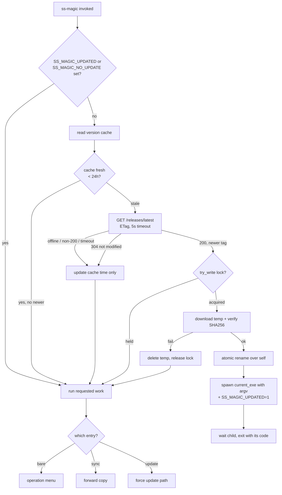
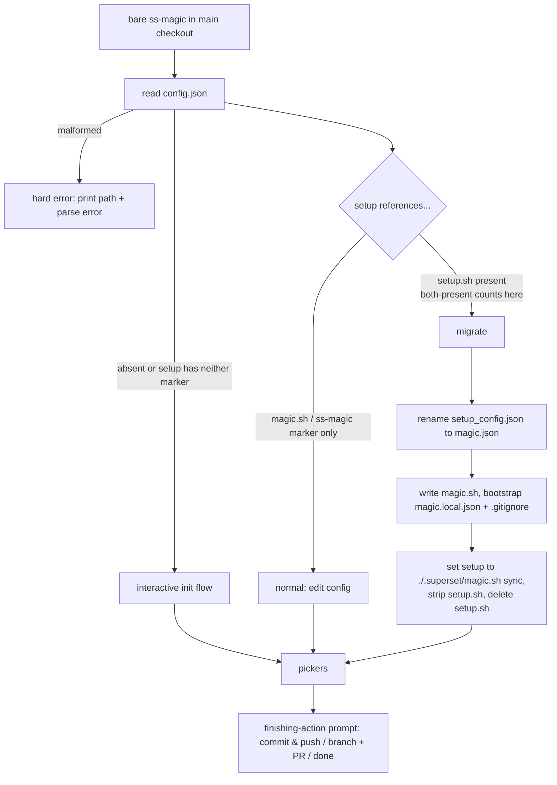
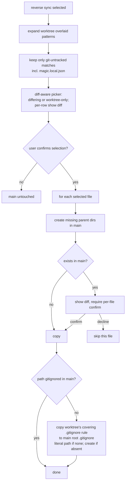

# feat: ss-magic self-updating CLI rewrite

## Summary

Rename and extend the `superset-setup` Rust CLI into `ss-magic`: a menu-driven
interactive tool plus two non-interactive subcommands (`sync`, `update`), a
self-update path that runs on every invocation, a `magic.json` /
`magic.local.json` config model fronted by a committed `magic.sh` wrapper,
interactive main-checkout migration, and untracked-only reverse sync — packaged
to GitHub Releases via cargo-dist. The existing `apply.rs` copy engine and
`ui.rs` action-loop picker are reused; new modules carry the self-update,
menu, reverse-sync, and migration logic.

All paths below are relative to the project root `projects/superset-setup/`
unless noted. `.superset/...` paths are relative to a consuming repo's root.

---

## Problem Frame

The current tool duplicates file-copy logic across `assets/setup.sh` (bash,
needs `bash >= 4` + `jq`) and `src/apply.rs` (Rust, already feature-complete),
installs only via `cargo install` from a local checkout (every fix needs a
rebuild), and only syncs main → worktree. The last gap has teeth: an untracked
secret file edited in a worktree (a new `.dev.vars` key) is lost when the
worktree is deleted after merge, because nothing copies it back. The rewrite
collapses onto the binary, adds GitHub Releases distribution with invisible
self-update, and adds reverse sync for untracked files — in preparation for
splitting the project out of the monorepo as an open-source tool.

See origin: `docs/brainstorms/2026-06-17-ss-magic-rewrite-requirements.md`.

---

## Requirements

Grouped by concern; each group cites the origin requirement IDs it implements.
Implementation units below trace to these same IDs.

- **Binary & commands** (origin R1–R5): rename to `ss-magic`; bare invocation
  opens a location-appropriate operation menu; `ss-magic sync` does a
  non-interactive forward file copy; `ss-magic update` forces a self-update; a
  committed `.superset/magic.sh` wrapper degrades gracefully when the binary is
  absent.
- **Config model** (origin R6–R9): `magic.json` (committed) holds `{files}`;
  `magic.local.json` (gitignored) overlays it (arrays unioned, scalar
  local-wins); the tool bootstraps `magic.local.json` and its `.gitignore`
  entry; forward sync resolves patterns from the main checkout's overlaid
  config.
- **Migration & init** (origin R10–R14): three-way branch on `config.json`'s
  `setup` — migrate the old layout, proceed when already migrated, or run init
  when neither marker is present; migration is interactive, main-checkout-only,
  and routes through the existing finishing-action prompt.
- **Self-update** (origin R15–R21): every invocation checks for a newer release
  (1-day cached, 5 s timeout, silent fall-through); when newer, lock + download
  + checksum-verify + atomic swap + re-exec that blocks the caller and
  propagates the exit code; loop-guarded against re-checks.
- **Reverse sync** (origin R22–R26): from a worktree, push only git-untracked
  files matching the worktree's overlaid patterns back to main, with a
  diff-aware picker, directory creation, and gitignore-safety.
- **Distribution & cleanup** (origin R27–R28): cargo-dist → GitHub Releases for
  the macOS/Linux matrix; remove the embedded `setup.sh`, its `include_str!`
  source, and the `exec.rs` setup.sh fallback.

---

## Key Technical Decisions

### Self-update

- KTD1. **Use the `self_update` crate for download/verify/swap, not cargo-dist's
  `axoupdater`.** `axoupdater` requires an install receipt written only by
  cargo-dist's `curl | sh` installer; it fails for `cargo install`, manual
  downloads, and dev builds — all real install paths for an open-source tool.
  `self_update` is self-contained (repo owner/name/bin hard-coded). cargo-dist
  is still used for building and releasing, just not for the update path.
- KTD2. **Roll our own daily-cached pre-check that gates the heavier update.**
  On every invocation, read a cache file in the OS cache dir; if older than 24 h,
  query GitHub `GET /releases/latest` with an `If-None-Match` ETag and a 5 s
  timeout (`ureq`). Any timeout, offline, or non-200 response → proceed silently
  on the installed version. Only when the cache says a newer tag exists do we
  invoke the `self_update` download/swap path. This keeps the GitHub API hit to
  ~once/machine/day, well under the 60/hr unauthenticated limit.
- KTD3. **Re-exec via spawn-and-wait, not `execv`.** Spawn the swapped binary
  with the original argv (resolved through `std::env::current_exe()`, never
  `argv[0]`/`$PATH`), `wait()` on it, and `exit()` with its code. This blocks
  the caller until the child finishes (so Superset never advances mid-swap),
  propagates the exit code, and still runs the parent's RAII cleanup (which
  `execv` would skip). Map a signal-killed child (`None` code) to exit 1.
- KTD4. **`fd-lock` advisory lock, skip-on-contention.** Acquire `try_write()`
  on a lock file in the cache dir before the download/swap; if it's held, skip
  the update and proceed on the current version (do not wait). `flock` is
  released by the kernel on crash, so stale locks are structurally impossible;
  add an mtime-based TTL (≥ 60 s, strictly greater than download+verify+rename)
  only as defense-in-depth.
- KTD5. **Atomic-swap contract.** Download (under a bounded read/connect
  timeout) to a sibling temp file created mode 0600 on the same filesystem as the
  binary, verify SHA-256 against the GitHub asset `digest` field (exposed since
  June 2025), `chmod 0755`, and only then `rename()` over the running binary
  (`self-replace` semantics, used transitively by `self_update`). Any failure —
  including a download timeout — deletes the temp file and leaves the original
  untouched, falling through silently to the installed version. Mode 0600 during
  the download/verify window keeps the in-flight executable from being
  world-readable in the shared cache dir.
- KTD6. **Loop guard via env var.** Set `SS_MAGIC_UPDATED=1` on the re-exec'd
  child; the update check returns early when it sees the marker. Also honor a
  documented `SS_MAGIC_NO_UPDATE=1` opt-out.

### Config & sync

- KTD7. **Thin sync reuses `apply.rs`.** `ss-magic sync` is files-only; setup
  commands stay in the Superset-owned `config.json` `setup` array. `magic.json`
  carries `{files}`; `magic.local.json` overlays it (arrays unioned + de-duped,
  scalar keys local-wins). A missing/malformed `magic.json` or
  `magic.local.json` in the main checkout is a hard error with a non-zero exit
  (visible failure beats a silent no-copy inside Superset setup).

### Migration & wrapper

- KTD8. **Branch on `config.json` `setup` contents.** Old `setup.sh` reference →
  migrate; `magic.sh`/`ss-magic sync` marker → proceed; neither → interactive
  init. Both markers present → migrate wins (strip the `setup.sh` entry, keep
  the wrapper entry). A malformed `config.json` is a hard error, never silently
  treated as "neither".
- KTD9. **`magic.sh` wrapper delegates with `exec`.** The wrapper runs
  `command -v ss-magic` then `exec ss-magic "$@"` (which propagates the binary's
  real exit code); the missing-binary `else` branch prints a bold-red install
  hint and `exit 0`. `config.json` `setup` invokes `./.superset/magic.sh sync`.

### Reverse sync

- KTD10. **Reverse sync moves git-untracked files only.** Candidates = files
  matching the worktree's overlaid patterns that are git-untracked (tracked
  files reach main via merge). On copy: create missing parent dirs in main; if a
  copied path isn't gitignored in main, copy the worktree `.gitignore` rule that
  covers it (resolved via `git check-ignore -v --no-index`) into main's root
  `.gitignore` (creating the file if absent), falling back to the literal
  relative path only when no covering rule exists — per origin R25; a candidate
  that already exists in main requires a per-file diff +
  confirm before overwrite.

### Packaging & dependencies

- KTD11. **cargo-dist via `dist-workspace.toml`, plain `vX.Y.Z` tags.** As a
  standalone repo there's no tag namespace; targets are
  `aarch64-apple-darwin`, `x86_64-apple-darwin`, `x86_64-unknown-linux-gnu`,
  `aarch64-unknown-linux-gnu`; `installers = ["shell", "powershell"]`;
  `install-updater = false` (we own the update path). New crates:
  `self_update`, `directories`, `fd-lock`, `ureq`.

---

## High-Level Technical Design

### Every-invocation flow and the auto-update gate



Prose remains authoritative where it and the diagram disagree. The work step
(`W`) is reached on every non-update path; the update path terminates the
current process by re-exec'ing and waiting.

### Migration / init branch (main checkout, bare invocation)



### Reverse-sync safety branches (worktree → main)



---

## Output Structure

New and changed modules under `src/` (existing modules in plain text, new in
**bold**):

```text
src/
  main.rs              # subcommand dispatch + auto-update entrypoint (rewritten)
  cli.rs               # NEW: arg parsing for bare / sync / update
  superset_files.rs    # magic.json/magic.local.json types + overlay (reworked)
  gitignore.rs         # NEW: ensure-entry / create / append-path helpers
  update/
    mod.rs             # NEW: orchestration (check -> lock -> apply -> re-exec)
    check.rs           # NEW: version cache + GitHub latest check (ureq, ETag)
    apply.rs           # NEW: lock, download, verify, swap, spawn-and-wait
  menu.rs              # NEW: operation menu + submenu routing
  migrate.rs           # NEW: detect + migrate/init branching
  reverse_sync.rs      # NEW: untracked-candidate diff picker + safe copy
  apply.rs             # forward-copy engine (reused; sync calls it)
  git.rs               # + untracked-files probe (main-checkout-root exists)
  repo_scan.rs / repo_detect.rs / pattern.rs / ui.rs / style.rs / exec.rs
assets/
  magic.sh             # NEW: wrapper (embedded via include_str!)
  setup.sh             # REMOVED in U13
dist-workspace.toml    # NEW (U12)
.github/workflows/release.yml  # NEW, cargo-dist generated (U12)
```

The tree is a scope declaration; the implementer may adjust module boundaries.
Per-unit `Files:` lists are authoritative.

---

## Implementation Units

Grouped into phases by dependency; ordering is enforced *between* phases, while
within a phase a unit's explicit `Dependencies` still constrain build order
(e.g., in Phase D, U11 is built before U10). U-IDs are stable.

### Phase A — Foundation & config

### U1. Rename to ss-magic and add subcommand dispatch

- **Goal:** Rename the binary and introduce `bare` / `sync` / `update` dispatch.
- **Requirements:** R1, R2 (origin).
- **Dependencies:** none.
- **Files:** `Cargo.toml`, `Makefile`, `README.md`, `src/main.rs`,
  `src/cli.rs` (new), `CLAUDE.md`.
- **Approach:** Set `[[bin]] name = "ss-magic"`. Add a small hand-rolled
  arg parser (no `clap` — three entry points don't justify the dependency):
  first non-flag arg selects `sync` / `update`; absent → interactive. Keep the
  existing location/git probe but defer the bootstrap-vs-apply decision to the
  menu (U9). `update` and `sync` route to their units; bare routes to the menu.
- **Patterns to follow:** existing `main.rs` composition order
  (`style::init` → `git::probe` → dispatch).
- **Test scenarios:**
  - `sync` and `update` tokens dispatch to their handlers; an unknown subcommand
    errors with usage text.
  - No-arg invocation routes to the interactive entrypoint.
  - `--help`/`-h` prints usage listing the three modes.
- **Verification:** `ss-magic --help` lists modes; `cargo build` produces an
  `ss-magic` binary.

### U2. magic.json / magic.local.json config model and overlay

- **Goal:** Replace `setup_config.json` with `magic.json` + overlaid
  `magic.local.json`.
- **Requirements:** R5, R6, R7, R9 (origin).
- **Dependencies:** none.
- **Files:** `src/superset_files.rs`, tests in same file.
- **Approach:** New `MagicConfig { files: Vec<String>, /* future keys */ }`
  with `serde(default)`. `load_overlaid(root)` reads `magic.json` then overlays
  `magic.local.json`: union+dedupe `files` (preserve magic.json order, append
  new local entries), scalar/object keys local-wins. Missing base is `None`;
  malformed either file is a hard error naming the path. Keep
  `existing_unknown_entries` preservation for custom patterns.
- **Execution note:** Implement the overlay merge test-first — it's the
  load-bearing data rule and easy to get wrong on dedupe/order.
- **Patterns to follow:** existing `read_json` / `write_*_json` helpers and the
  malformed-JSON error tests in `superset_files.rs`.
- **Test scenarios:**
  - Covers AE7. `magic.json files=["**/.env"]` + local `["**/.dev.vars"]` →
    overlay yields both, de-duped, magic.json order first.
  - Local repeats a base pattern → appears once.
  - `magic.json` present, `magic.local.json` absent → base only.
  - Malformed `magic.json` → error names the path; malformed `magic.local.json`
    → error names the path (no silent fallback).
  - Round-trip write is pretty-printed with trailing newline.
- **Verification:** overlay unit tests pass; malformed-file errors carry the
  path.

### U3. magic.local.json bootstrap and .gitignore management

- **Goal:** Create `magic.local.json`, ignore it, and make it a default synced
  pattern.
- **Requirements:** R8 (origin).
- **Dependencies:** U2.
- **Files:** `src/gitignore.rs` (new), `src/superset_files.rs`.
- **Approach:** Write `magic.local.json` as `{}` plus an explanatory comment —
  use a `_comment` string key (strict JSON; serde round-trips it) rather than
  JSONC. `gitignore.rs`: `ensure_entry(git_root, line)` appends the line if no
  exact match exists, creating `.gitignore` if absent; never reorders existing
  content. Add `.superset/magic.local.json` to the default `magic.json` `files`
  set so forward sync copies it into worktrees.
- **Patterns to follow:** atomic write + trailing-newline convention in
  `superset_files.rs`.
- **Test scenarios:**
  - `.gitignore` absent → created containing exactly the entry.
  - Entry already present → file unchanged (byte-identical).
  - Entry absent among others → appended; existing lines untouched.
  - Bootstrapped `magic.local.json` parses as `{}` (+ comment key) and overlays
    as empty.
- **Verification:** gitignore helper unit tests pass; bootstrap produces a
  valid overlay no-op file.

### Phase B — Sync & wrapper

### U4. ss-magic sync forward copy (thin)

- **Goal:** Non-interactive forward file copy, main → current worktree.
- **Requirements:** R3, R9 (origin).
- **Dependencies:** U1, U2.
- **Files:** `src/main.rs` (sync handler), `src/git.rs` (reuse existing
  `main_checkout_root`; only the untracked-files probe is new), `src/apply.rs`
  (reused).
- **Approach:** Resolve the main checkout root (parent of `git --git-common-dir`
  or current root when not a worktree). Immediately probe the resolved root for
  `.superset/magic.json`; if absent/unreadable, hard error naming the resolved
  path and what was expected. Load the overlaid config from main, run the
  existing `apply` engine into the current working tree. No git/gh, no setup
  commands. Malformed config → non-zero exit.
- **Execution note:** Add characterization tests pinning the current `apply.rs`
  copy/exclude/glob behavior before wiring `magic.json` into it, so the engine's
  semantics are locked while the config source changes.
- **Patterns to follow:** existing apply-mode main-checkout resolution and
  `apply::run` event stream.
- **Test scenarios:**
  - Patterns from main's overlaid config copy into the worktree (literal, glob,
    `**` depth, `node_modules`/`.venv` exclusion) — characterization parity with
    today's apply.
  - Main checkout resolves but has no `magic.json` → error names the path,
    non-zero exit.
  - Malformed `magic.json` in main → non-zero exit, parse error shown.
  - Main-root cannot be resolved → clear error, non-zero exit.
- **Verification:** `ss-magic sync` in a worktree copies configured files;
  failure modes exit non-zero with actionable messages.

### U5. magic.sh wrapper asset and writer

- **Goal:** Embed and write the graceful-degradation wrapper.
- **Requirements:** R5 (origin).
- **Dependencies:** none (writer wired in U8).
- **Files:** `assets/magic.sh` (new), `src/superset_files.rs` (writer +
  `include_str!`).
- **Approach:** `assets/magic.sh`: `command -v ss-magic >/dev/null 2>&1` then
  `exec ss-magic "$@"`; else print a bold-red (NO_COLOR-aware) error with
  install instructions and `exit 0`. Embed via `include_str!`; `write_magic_sh`
  writes it 0755, mirroring the retired `write_setup_sh`.
- **Patterns to follow:** the embedded-asset + `chmod_executable` pattern in
  `superset_files.rs`.
- **Test scenarios:**
  - Writer emits an executable (0755) file byte-equal to the embedded asset.
  - Covers AE8. Wrapper script, run with `ss-magic` absent from `PATH`, prints
    the install error and exits 0 (shell-level test).
  - Wrapper with a stub `ss-magic` on `PATH` that exits 3 → wrapper exits 3
    (exit-code propagation via `exec`).
- **Verification:** wrapper round-trips; both exit paths behave per AE8.

### Phase C — Self-update

### U6. Self-update: cached version check

- **Goal:** Decide "is a newer release available?" cheaply and offline-safely.
- **Requirements:** R15, R16, R17 (origin).
- **Dependencies:** U1.
- **Files:** `src/update/mod.rs`, `src/update/check.rs` (new),
  `Cargo.toml` (`directories`, `ureq`).
- **Approach:** Resolve the cache dir via the `directories` app-scoped cache dir
  (`~/Library/Caches/ss-magic`, `~/.cache/ss-magic`, platform equiv). Cache file
  records `checked_at`, latest `tag_name`, ETag. If fresh (< 24 h) use it; else
  `GET /releases/latest` with `If-None-Match` and a 5 s timeout. 200 → store
  tag+ETag; 304 → refresh `checked_at`; timeout/offline/non-200 → refresh
  `checked_at` only and report "no update" (silent). Compare `tag_name` to
  `CARGO_PKG_VERSION` with semver.
- **Execution note:** Put the HTTP call behind a trait/seam so tests inject
  responses (200/304/timeout/non-200) without network.
- **Patterns to follow:** none local; new subsystem.
- **Test scenarios:**
  - Covers AE1. Stale cache + injected timeout → returns "no update", logs
    nothing, refreshes `checked_at`.
  - Fresh cache → no network call; returns cached verdict.
  - 200 with a higher tag → "update to vX"; equal/lower → "no update".
  - 304 → "no update", ETag retained.
  - Non-200 (rate-limited body) → treated as "no update", no panic.
  - Malformed/missing cache file → treated as stale, recreated.
- **Verification:** version-check unit tests pass across all injected responses.

### U7. Self-update: lock, swap, re-exec, and the update command

- **Goal:** Apply an update safely and re-run the requested work on the new
  binary; `ss-magic update` forces it.
- **Requirements:** R4, R16, R18, R19, R20, R21 (origin).
- **Dependencies:** U6.
- **Files:** `src/update/mod.rs`, `src/update/apply.rs` (new),
  `Cargo.toml` (`fd-lock`, `self_update`).
- **Approach:** Acquire `fd-lock` `try_write()` on a cache-dir lock file;
  contention → skip (proceed current). Treat a lock file older than the TTL
  (≥ 60 s) as stale and reclaim. Inside the lock, run the `self_update` GitHub
  path: download (under a bounded read/connect timeout) to a sibling temp file
  created mode 0600 → SHA-256 verify against asset digest → `chmod 0755` →
  `self-replace` atomic rename over self. On a download timeout/offline, delete
  the temp file and fall through silently to the installed version (mirroring the
  U6 check's 5 s posture) so an unattended caller is never blocked indefinitely.
  Drop the lock, then spawn
  `current_exe()` with `args_os().skip(1)` and `SS_MAGIC_UPDATED=1`, `wait()`,
  and `exit(status.code().unwrap_or(1))`. `ss-magic update` bypasses the cache
  (force check) and reports the resulting version or "already latest".
- **Execution note:** Unit-test the lock/skip and exit-code-propagation logic
  via seams; do not perform live downloads in tests.
- **Patterns to follow:** none local; new subsystem.
- **Test scenarios:**
  - Covers AE2. Lock held → second caller skips immediately (no wait), runs
    current version.
  - Covers AE4. Child sees `SS_MAGIC_UPDATED` → check returns early (no loop).
  - Stale lock (mtime > TTL) → reclaimed.
  - Checksum mismatch → temp deleted, original binary intact, "no update".
  - Re-exec target is `current_exe()` (absolute), not `argv[0]`.
  - Child exit code (incl. non-zero) propagates; signal-kill maps to 1.
  - `ss-magic update` with no newer release reports "already latest".
  - `ss-magic update` on a *fresh* cache still re-checks (daily-cache gate
    bypassed), confirming the force path is not gated by the 24 h TTL.
- **Verification:** lock/skip, loop-guard, and exit propagation covered by
  tests; manual smoke against a real release confirms swap + re-exec.

### U8. Wire auto-update into every entrypoint

- **Goal:** Run the update gate before any work, on every entrypoint.
- **Requirements:** R15, R21 (origin).
- **Dependencies:** U6, U7; also writes `magic.sh` via U5 during migration (U9).
- **Files:** `src/main.rs`.
- **Approach:** At startup, unless `SS_MAGIC_UPDATED`/`SS_MAGIC_NO_UPDATE` is
  set, run check (U6); on "newer" run apply+re-exec (U7), which terminates this
  process. The explicit `update` subcommand bypasses this daily-cache gate
  entirely and routes straight to U7's forced check (so `ss-magic update` always
  re-checks even on a fresh cache); the gate's cached path governs only bare and
  `sync`. Otherwise continue to bare/sync/update. Applies uniformly so
  `magic.sh sync` from Superset also self-updates.
- **Test scenarios:**
  - Covers AE3. With a stubbed "newer + spawn", the parent blocks in `wait()`
    and exits with the child's code (caller cannot advance until child returns).
  - Guard env set → no check fires; work runs directly.
- **Verification:** update gate fires once per entrypoint and never recurses.

### Phase D — Migration & interactive

### U9. Migration and init branching

- **Goal:** Upgrade the old layout, or run init, from the main checkout.
- **Requirements:** R10, R11, R12, R13, R14 (origin).
- **Dependencies:** U2, U3, U5.
- **Files:** `src/migrate.rs` (new), `src/superset_files.rs`, `src/main.rs`.
- **Approach:** Read `config.json` (malformed → hard error). Branch: old
  `setup.sh` reference (incl. both-markers-present) → migrate; marker only →
  normal; neither/absent → init. Migration: rename `setup_config.json` →
  `magic.json`, write `magic.sh` (U5), set `setup` to `./.superset/magic.sh
  sync` replacing the `setup.sh` entry in place (preserve order, preserve
  `teardown`/`run`), delete `setup.sh`, bootstrap `magic.local.json` + gitignore
  (U3). **Stage every rename/delete/write into a tempdir** (mirroring bootstrap)
  and materialize via `copy_into_repo` only after the finishing-action prompt
  returns a non-cancel choice, so picking "done" or aborting leaves the old
  layout intact on disk — never a half-migrated tree. Idempotent re-run reports
  nothing changed. As part of the change summary shown *before* the
  finishing-action prompt, print a bold-orange (`style::warn`) advisory that
  worktrees created before migration keep the old `setup.sh`/`setup_config.json`
  and must be recreated. All changes flow through the existing finishing-action
  prompt; nothing auto-committed.
- **Patterns to follow:** `merge_setup_into_config` preservation and the staged
  tempdir → `copy_into_repo` materialization in `main.rs`. The reuse is
  structural, not call-as-is: `copy_into_repo` currently hardcodes `fs::copy` of
  `setup.sh`/`setup_config.json`, so rework it to materialize `magic.sh` (0755) +
  `magic.json` (and update its `MaterializeReport`/doc comment) before the
  migration staging tree can use it.
- **Test scenarios:**
  - Covers AE5. `setup` references neither marker → init path taken.
  - Covers AE6. Already-migrated repo → no renames/deletes, marker not
    duplicated, "nothing changed".
  - Old `setup.sh` reference → renamed config, wrapper entry, `setup.sh` deleted,
    `teardown`/`run` preserved, order otherwise intact.
  - Both markers present → migrate wins; `setup.sh` entry stripped, wrapper kept.
  - Malformed `config.json` → hard error naming the path (not treated as init).
  - "Done"/cancel at the finishing-action prompt → tempdir discarded; on-disk
    `setup.sh`/`setup_config.json` remain intact (no half-migrated tree).
  - `copy_into_repo` materializes `magic.sh` (0755) + `magic.json`, not the
    legacy filenames.
  - Completing a migration prints the stale-worktree advisory before the
    finishing-action prompt.
- **Verification:** branch table exercised by tests; migrated `.superset/`
  matches the new contract.

### U10. Menu-driven interactive mode

- **Goal:** Replace location-auto dispatch with an explicit operation menu.
- **Requirements:** R2 (origin).
- **Dependencies:** U4, U9, U11. U11 precedes U10 in build order even though it
  appears later in this document — the menu routes worktree selections into
  reverse sync, so the reverse-sync handler must exist first.
- **Files:** `src/menu.rs` (new), `src/main.rs`, `src/ui.rs`.
- **Approach:** Bare invocation lists location-appropriate operations via the
  existing `pick_with_actions` driver, then routes to a submenu. Main checkout:
  init / migrate / edit config. Worktree: forward sync, reverse sync. Forward
  sync is offered in a worktree even though it's also non-interactive, because
  main may have gained files since the worktree was created. Nothing runs until
  selected.
- **Patterns to follow:** `ui.rs::pick_with_actions` and the action-loop pattern
  in `docs/solutions/design-patterns/inquire-action-loop-2026-05-26.md`
  (`with_starting_cursor(n).min(len-1)`).
- **Test scenarios:**
  - Menu shows main-only operations in the main checkout and worktree-only
    operations in a worktree (location gating).
  - Selecting an operation routes to its handler; Esc/Ctrl-C leaves the tree
    untouched.
  - Test expectation: interactive prompt wiring covered by routing-level unit
    tests; full TUI flow validated by manual smoke (consistent with existing
    final-action git ops having no unit tests).
- **Verification:** each menu path reaches the right handler; cancel is inert.

### U11. Reverse sync (untracked-only)

- **Goal:** Push untracked worktree files back to main safely.
- **Requirements:** R22, R23, R24, R25, R26 (origin).
- **Dependencies:** U2; new git primitive.
- **Files:** `src/reverse_sync.rs` (new), `src/git.rs` (untracked-files probe),
  `src/gitignore.rs`, `src/ui.rs`.
- **Approach:** Candidates = files matching the worktree's overlaid patterns
  that are git-untracked in the worktree (incl. `magic.local.json`); tracked
  files are excluded (merge handles them). If the candidate set is empty, print a
  gray `style::info` line ("No untracked files match the configured patterns.")
  and return to the menu without opening the picker. Otherwise build a diff-aware
  picker (action-loop reuse) listing differing/worktree-only candidates, each
  with a "show diff" action shelling to `git diff --no-index --color=auto <main>
  <worktree>` piped to `$PAGER` (default `less -R`) so the diff isn't buried by
  the picker re-render — `git` is already a hard dependency and ships a portable
  colored differ (`diff --color` is GNU-only and absent on macOS BSD diff). On
  confirm, copy into main: create missing parent dirs; if a copied path isn't
  gitignored in main, copy the worktree `.gitignore` rule that covers it
  (resolved via `git check-ignore -v --no-index`) into main's root `.gitignore`
  (create if absent), falling back to the literal relative path only when no
  covering rule exists (per origin R25) — do not hand-parse inherited rules; a
  candidate that already exists in main requires a per-file diff + explicit
  confirm before overwrite. Decline → main untouched.
- **Patterns to follow:** `git.rs` shell-out via `git_raw`; `pick_with_actions`;
  `apply.rs` directory-create + copy semantics. Expose `apply.rs`'s pattern
  expansion (currently the private `expand_patterns`) as a public matcher
  returning the matched relative paths, and have reverse sync copy only the
  user-selected untracked subset itself — `apply::run` copies every match
  unconditionally and offers no filtered-subset seam.
- **Test scenarios:**
  - Covers AE9. Untracked `apps/api/.dev.vars` is offered, tracked `magic.json`
    is not; on copy, `apps/api/` is created in main and the path is ensured in
    main's `.gitignore` (its covering rule, or the literal path if none, appended
    when absent).
  - Worktree-only (new) file appears as a candidate; identical files are hidden.
  - Candidate already gitignored in main via an exact line → no duplicate line.
  - Candidate exists in main → diff shown, requires per-file confirm; decline
    leaves main's copy intact.
  - `magic.local.json` flows through the same path (no special-casing) and lands
    gitignored.
  - Decline at the picker → main fully untouched.
  - No untracked candidates after filtering → info line printed, picker not
    opened, main untouched.
- **Verification:** reverse sync copies only selected untracked files, never
  leaks a secret unignored, and never silently overwrites.

### Phase E — Packaging & cleanup

### U12. cargo-dist packaging and release workflow

- **Goal:** Build + publish multi-arch binaries to GitHub Releases.
- **Requirements:** R27 (origin).
- **Dependencies:** U1.
- **Files:** `dist-workspace.toml` (new), `.github/workflows/release.yml`
  (cargo-dist generated), `Cargo.toml`.
- **Approach:** Initialize cargo-dist (v0.32.x) with `ci = "github"`, the
  four-target matrix, `installers = ["shell", "powershell"]`,
  `install-updater = false`, plain `vX.Y.Z` tag trigger. The shell installer is
  the initial-install path; `self_update`'s GitHub backend reads the same
  per-archive `.sha256`/digest. Record the GitHub `owner/repo` slug once
  (consumed by `self_update`, cargo-dist, and the wrapper's install hint).
- **Test scenarios:** Test expectation: none — CI/packaging config; validated by
  a dry-run `dist plan` and a tagged pre-release smoke, not unit tests.
- **Verification:** `dist plan` succeeds; a tagged build publishes archives +
  checksums + `dist-manifest.json`; `self_update` downloads from the result.

### U13. Remove the legacy setup.sh path

- **Goal:** Make the binary the sole file-copy implementation.
- **Requirements:** R28 (origin).
- **Dependencies:** U4 (sync must replace it first).
- **Files:** `assets/setup.sh` (delete), `src/superset_files.rs` (drop
  `SETUP_SH`/`write_setup_sh`/`include_str!`), `src/main.rs` (remove the
  empty-array `setup.sh` routing arm in `run_setup_step`), `src/exec.rs` (drop
  `run_setup_sh`), `CLAUDE.md`, `README.md`.
- **Approach:** Delete the asset and its write path; remove the `exec.rs`
  "empty `setup` array → run `setup.sh`" branch. Update docs to describe the
  `magic.sh` wrapper instead.
- **Test scenarios:** existing tests referencing `setup.sh` are removed or
  retargeted; `exec.rs` tests cover only the command-array path.
  Test expectation: behavioral coverage shifts to U4 (sync) and U9 (migration);
  this unit is deletion + doc update.
- **Verification:** no references to `setup.sh` remain; build + test green.

---

## Acceptance Examples

Carried from origin and mapped to units/tests; `Covers AE<N>` tags appear in the
relevant test scenarios above.

- AE1 (offline sync) → U6.
- AE2 (concurrent update, loser skips) → U7.
- AE3 (updater blocks the caller) → U8.
- AE4 (no re-exec loop) → U7.
- AE5 (init when neither marker present) → U9.
- AE6 (idempotent migration) → U9.
- AE7 (local overlay union) → U2.
- AE8 (wrapper without the binary) → U5.
- AE9 (reverse sync respects tracking + gitignore) → U11.

---

## System-Wide Impact

- **Superset.app contract change.** Migration rewrites `config.json`'s `setup`
  from `./.superset/setup.sh` to `./.superset/magic.sh sync`. Superset reads
  this array verbatim during workspace creation, so the wrapper must be present
  and executable in every migrated repo before the next workspace is created —
  this is the cross-system interface the change touches.
- **Every-invocation update reach.** The auto-update gate runs on bare, `sync`,
  and `update`, including the non-interactive `sync` inside Superset's pipeline
  and any CI/script that calls it. The 5 s check timeout, the bounded download
  timeout (both with silent fall-through), and the block-until-child-finishes
  contract exist so this reach never slows or breaks an unattended caller;
  `SS_MAGIC_NO_UPDATE=1` is the documented escape hatch.
- **Secret-safety boundary.** Reverse sync is the one path that writes untracked
  (often secret) files into the main checkout. Its gitignore-safety step is the
  guard preventing a reverse-synced `.dev.vars` from becoming committable in
  main — a regression here is a secret-leak, not a cosmetic bug.
- **Stale worktrees after migration.** Worktrees created before migration keep
  the old `setup.sh` / `setup_config.json`; they are not upgraded in place and
  should be recreated. Migration output should say so.

---

## Scope Boundaries

### Deferred to follow-up work

- Pagination/filtering for the reverse-sync picker when candidates exceed ~20
  (the action-loop pattern's documented practical ceiling).
- A `magic.local.json` overlay that *removes* a shared pattern (v1 unions only).

### Outside this work

- Windows in the build matrix (cargo-dist makes it a small later addition).
- Binary signing / notarization beyond checksum verification; ad-hoc signing in
  `~/.cargo/bin`-style locations is accepted for v1.
- R2/S3 distribution — replaced by GitHub Releases.
- A "sync `magic.json` back to main" operation — `magic.json` is tracked and
  merges via git.
- The actual repo split / open-source release mechanics (LICENSE, public README,
  repo move).
- `SUPERSET_WORKSPACE_NAME` injection — unchanged limitation.

---

## Risks & Dependencies

- **`self_update` archive layout must match cargo-dist's output.** The
  `bin_path_in_archive` template must track cargo-dist's archive naming; a
  mismatch silently fails updates. Mitigation: pin both, smoke-test a real
  release end-to-end before relying on auto-update.
- **GitHub unauthenticated rate limit (60/hr).** The 24 h cache keeps real
  usage to ~1/machine/day; a non-200 is treated as "no update", so a throttled
  response never breaks a run.
- **Atomic swap requires a user-writable binary on one filesystem.** Works for
  `~/.cargo/bin` and the cargo-dist install prefix; a system-path install needs
  elevated permissions — surface a clear error rather than failing silently.
- **macOS re-exec after replacing the running binary** can be constrained by
  codesigning in protected locations; acceptable for `~/.cargo/bin`, flagged in
  scope as signing-deferred.
- **Stale worktrees post-migration** keep the old `setup.sh`/`setup_config.json`;
  they should be recreated rather than updated in place (documentation note in
  migration output).
- **New dependencies** (`self_update`, `directories`, `fd-lock`, `ureq`) widen
  the dependency surface for an `opt-level = "z"` release profile; keep features
  minimal (e.g., `self_update` with `rustls` + `archive-tar` only).

---

## Open Questions

### Resolve before/at repo creation

- The GitHub `owner/repo` slug is unknown until the standalone repo exists. It
  feeds `self_update`'s backend config, cargo-dist's release host, and the
  wrapper's install instructions — wire it as a single constant to fill at split
  time. Not a blocker for building the logic against a placeholder.

### Deferred to implementation

- Exact stale-lock TTL value (default 60 s; tune if download time on slow links
  approaches it).
- Whether to use `self_update`'s built-in archive extraction or extract the
  tarball manually after our own download — decide once the cargo-dist archive
  layout is fixed.
- The precise wording of the wrapper's bold-red install instructions (depends on
  the final install URL / repo slug).

---

## Sources / Research

- `src/apply.rs` — the glob/exclude/copy engine `ss-magic sync` and reverse sync
  reuse.
- `src/superset_files.rs` — current `.superset/` I/O, `config.json`
  `{setup, teardown, run}` shape, embedded-asset pattern, malformed-JSON error
  tests; the `setup_config.json` → `magic.json` migration starting point.
- `src/ui.rs` + `docs/solutions/design-patterns/inquire-action-loop-2026-05-26.md`
  — the `pick_with_actions` action-loop pattern for the menu and reverse-sync
  picker (clamp `with_starting_cursor`; ~20-row practical ceiling).
- `src/git.rs` — `git_raw` shell-out pattern; extend with untracked-files and
  main-checkout-root probes.
- `md-cli`'s `.github/workflows/cli-release.yml` + `dist-workspace.toml` —
  cargo-dist reference (v0.32.0, `tag-namespace` mechanism; dropped here for
  plain `vX.Y.Z`).
- Crate findings: `self_update` (GitHub backend, checksum, `Status::UpToDate`/
  `Updated`); `axoupdater` rejected (install-receipt dependency breaks
  `cargo install`/dev/manual); `self-replace` (atomic running-binary swap);
  `directories` (app-scoped cache dir); `fd-lock` (advisory lock, kernel-released
  on crash); `ureq` (sync HTTP, 5 s timeout); GitHub asset `digest` field
  (SHA-256, since June 2025) for checksum.
