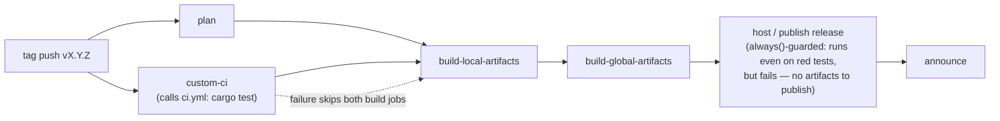
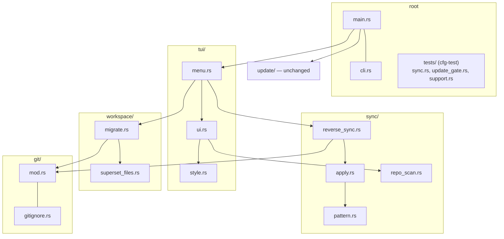

# feat: CI test workflow, release gating, and src/ restructure

## Summary

Add a GitHub Actions CI workflow that runs the full `cargo test` suite on every commit pushed to a pull request, wire that same workflow into the cargo-dist release pipeline as a hard gate (a failing test suite blocks artifact builds and publishing), extract the inline `#[cfg(test)] mod tests` blocks into dedicated test files, and reorganize the flat `src/` module list into purpose-grouped subfolders. Pure structural work — no runtime behavior changes, so no crate version bump.

**Product Contract preservation:** no upstream brainstorm/requirements doc exists; contract bootstrapped from the request (`product_contract_source: ce-plan-bootstrap`).

---

## Problem Frame

The repo has no test-running CI at all — the only workflow is the cargo-dist-generated `release.yml`, which builds and publishes release artifacts on version tags without ever running `cargo test`. A tagged release can ship with a broken test suite. Separately, all 201 tests live as inline `mod tests` blocks appended to the end of each source file (some files are >50% test code, e.g. `migrate.rs` at 1218 lines with tests from line 550), and `src/` is a flat list of 14 modules with no grouping, which makes navigation and review harder as the crate grows.

---

## Requirements

- **R1** — A CI workflow (`.github/workflows/ci.yml`) runs the full test suite on every commit of every pull request (GitHub's `pull_request` trigger fires on each push/synchronize) and on pushes to `main`.
- **R2** — The release workflow cannot publish artifacts unless the test suite passes on the released commit. Gating must survive `dist init` regeneration (no hand-edits to `release.yml` that would trip dist's drift check).
- **R3** — Inline `#[cfg(test)] mod tests` blocks are separated from production code into dedicated test files, following Rust best practice (child `tests` modules in sibling files, preserving private-item access; crate-root test modules under `src/tests/`).
- **R4** — `src/` source files are grouped into subfolders by functionality/purpose; `cargo test` passes with the same 201 tests after the move.
- **R5** *(pipeline-owned)* — After implementation, `ce-simplify-code` and `ce-code-review` run and their findings are applied. Owned by the LFG pipeline stages, not by an implementation unit in this plan.

---

## Key Technical Decisions

- **KTD1 — Release gating via cargo-dist custom `plan-jobs`, not hand-edited `release.yml`.** `dist-workspace.toml` gets `plan-jobs = ["./ci"]`; `dist init` (pinned v0.32.0) regenerates `release.yml` with a `custom-ci` job that calls `.github/workflows/ci.yml` as a reusable workflow. Verified against cargo-dist's generated-output snapshots (`axolotlsay_user_plan_job.snap`) and its own dogfooded `release.yml`: `build-local-artifacts` adds `custom-ci` to its `needs:`, and GitHub's implicit `success()` on its `if:` means a failing custom job skips `build-local-artifacts` and therefore `build-global-artifacts`. The `host` job is `always()`-guarded and tolerates skipped builds, so it still *runs* on red tests — but it fails at `gh release create … artifacts/*` because no artifacts were ever built. The hard guarantee is "no artifacts are built on red tests, hence none can be released" (surfacing as a red `host` job, not a fully-skipped pipeline), and it fails fast (before paying for artifact builds). Hand-editing `release.yml` was rejected: without `allow-dirty = ["ci"]` the `dist plan` step inside the release workflow errors on any drift, and `allow-dirty` forfeits dist's regeneration/upgrade support (officially discouraged).
- **KTD2 — One `ci.yml` serves both roles.** Triggers: `pull_request` + `push: branches: [main]` + `workflow_call` (the `plan` input is omitted/optional — cargo-dist calls `plan-jobs` workflows *without* a `plan` input, unlike later-phase custom jobs). A concurrency group cancels superseded runs on the same PR.
- **KTD3 — Test extraction uses sibling child-module files, not a central test tree.** 9 of the 16 test-bearing source files (15 module files plus `main.rs`) have tests calling private parent items (`git()`, `stage_migration()`, `is_safe_rel()`, `reexec_target()`, …), so tests must remain child modules: each `mod tests { … }` body moves to a sibling file declared as `#[cfg(test)] mod tests;` (e.g. `src/git/tests.rs` for `git/mod.rs`, `src/sync/apply/tests.rs` for `sync/apply.rs`). The user's "src/tests/*.rs or similar per best practices" is satisfied at the crate root: `main.rs`'s two inline test modules (`sync_tests`, `update_gate_tests`) plus the shared `test_support.rs` move under `src/tests/` (child modules of the crate root retain access to the private `sync_core`). A fully central `src/tests/` for everything would force `pub(crate)` churn across half the crate — rejected.
- **KTD4 — Grouping scheme** (from the module dependency map): `git/` = git plumbing (`git.rs` → `git/mod.rs`, `gitignore.rs`), `sync/` = the sync engine (`apply.rs`, `pattern.rs`, `repo_scan.rs`, `reverse_sync.rs`), `tui/` = interactive layer (`ui.rs`, `style.rs`, `menu.rs`), `workspace/` = `.superset` contract I/O and its lifecycle (`superset_files.rs`, `migrate.rs`), `update/` unchanged, and `main.rs` + `cli.rs` stay at the root (composition root + arg parsing). Module *leaf names* are preserved (`gitignore` stays `gitignore`, referenced as `crate::git::gitignore`) to keep the rename mechanical.
- **KTD5 — Regeneration is done with the exact pinned dist version.** Install dist v0.32.0 locally via the same installer URL `release.yml` already uses, then `dist init --yes`. Using a different dist version risks template drift that the release workflow's `dist plan` check would then reject.
- **KTD6 — CI runs on `ubuntu-latest` + `macos-latest`,** matching the release target platforms (tests are Unix-only by design — `/dev/null` gitignore trick, `0o755` assertions — but not macOS-specific; the matrix covers both families cheaply). Steps: checkout → stable Rust toolchain → `Swatinem/rust-cache` → `cargo test --locked`. Tests shell out to real `git` (preinstalled on both runners) and never hit the network (update checks are mocked behind `ReleaseClient`/`Spawner` seams).
- **KTD7 — No crate version bump.** Per repo convention, versions bump only on CLI-behavior changes; this work changes no runtime behavior and requires no release.

---

## High-Level Technical Design

Release gating after `dist init` regeneration (new `custom-ci` node gates everything downstream):



Module regrouping (arrows = "depends on", from the crate::X usage map):



---

## Output Structure

```plaintext
.github/workflows/
  ci.yml                    (new — PR tests + reusable workflow_call)
  release.yml               (regenerated by dist init with custom-ci job)
src/
  main.rs                   (mod decls updated; inline test mods removed)
  cli.rs        + cli/tests.rs   (file module with child dir — valid Rust, same as update/check.rs)
  git/
    mod.rs                  (from git.rs)
    tests.rs                (extracted from git.rs)
    gitignore.rs
    gitignore/tests.rs
  sync/
    mod.rs                  (submodule declarations only)
    apply.rs      + apply/tests.rs
    pattern.rs    + pattern/tests.rs
    repo_scan.rs  + repo_scan/tests.rs
    reverse_sync.rs + reverse_sync/tests.rs
  tui/
    mod.rs                  (submodule declarations only)
    menu.rs   + menu/tests.rs
    style.rs  + style/tests.rs
    ui.rs     + ui/tests.rs
  workspace/
    mod.rs                  (submodule declarations only)
    migrate.rs        + migrate/tests.rs
    superset_files.rs + superset_files/tests.rs
  update/
    mod.rs    + tests.rs    (extracted from mod.rs)
    apply.rs  + apply/tests.rs
    check.rs  + check/tests.rs
  tests/                    (#[cfg(test)] — crate-root tests)
    mod.rs
    sync.rs                 (from main.rs `mod sync_tests`)
    update_gate.rs          (from main.rs `mod update_gate_tests`)
    support.rs              (from test_support.rs)
```

The tree is the expected shape; per-unit `**Files:**` lists are authoritative.

---

## Implementation Units

### U1. CI workflow running the full test suite

**Goal:** `.github/workflows/ci.yml` runs `cargo test` on every PR commit and on `main`, and is callable as a reusable workflow.

**Requirements:** R1, and the reusable-workflow half of R2.

**Dependencies:** none.

**Files:** `.github/workflows/ci.yml` (new).

**Approach:** Triggers `pull_request`, `push: branches: [main]`, and `workflow_call:` with no required inputs (KTD2 — cargo-dist invokes `plan-jobs` workflows with no `plan` input, so do not declare a required one). Workflow-level `permissions: contents: read` (keeps the token read-only even when invoked via `workflow_call` from `release.yml`, which grants `contents: write`) and `persist-credentials: false` on checkout, matching the existing `release.yml` baseline — `cargo test` executes third-party build scripts, so the write-capable token must not be reachable from the test job. One `test` job, matrix over `ubuntu-latest` and `macos-latest`: `actions/checkout@v6` → `dtolnay/rust-toolchain@stable` → `Swatinem/rust-cache@v2` → `cargo test --locked` (pin all actions to version tags, consistent with the repo baseline). Concurrency group keyed on workflow + ref with `cancel-in-progress: true` — but guard it so `workflow_call` invocations from a release run don't cancel each other (e.g. key on `github.ref` which differs per tag; verify the group key is safe for tag refs).

**Test scenarios:** Test expectation: none — CI configuration; verified by the workflow itself running.

**Verification:** After push, the CI workflow appears on the PR and the test job passes on both runners with 201 tests executed (LFG's CI-watch stage observes this).

### U2. Gate the release workflow on the test suite

**Goal:** A tagged release fails before building artifacts if `cargo test` fails on that commit.

**Requirements:** R2.

**Dependencies:** U1.

**Files:** `dist-workspace.toml` (add `plan-jobs = ["./ci"]`), `.github/workflows/release.yml` (regenerated, not hand-edited).

**Approach:** Add `plan-jobs = ["./ci"]` under `[dist]`. Install dist v0.32.0 with the pinned installer URL already referenced in `release.yml` (line 67), then run `dist init --yes` (accepting existing config) to regenerate `release.yml`. Inspect the regenerated file: it must contain a `custom-ci` job with `uses: ./.github/workflows/ci.yml` / `secrets: inherit`, and `build-local-artifacts.needs` must include `custom-ci`. The diff against the old file should be limited to the custom-job wiring (same dist version → same base template); if unrelated drift appears, stop and reconcile rather than committing a mystery diff. `dist init` also rewrites `dist-workspace.toml` itself — diff it too and restore any stripped rationale comments (notably the `unix-archive = ".tar.gz"`-for-`self_update` constraint and the `install-updater = false` note) before committing.

**Execution note:** If `dist init --yes` proves non-idempotent or interactive in a way that blocks, the fallback is `dist generate` (the lower-level primitive); do **not** fall back to hand-editing plus `allow-dirty`.

**Test scenarios:** Test expectation: none — release config; gating semantics were verified against cargo-dist's generated-output snapshots (see Sources).

**Verification:** Regenerated `release.yml` contains the `custom-ci` job wired into `build-local-artifacts.needs`; inspect the `host` job's `if:`/`needs:` to confirm the KTD1-described semantics (host runs under `always()` but cannot publish without artifacts); `dist plan` (or the release workflow's own plan job on the PR) passes the drift check.

### U3. Restructure src/ into purpose-grouped subfolders

**Goal:** Flat `src/*.rs` becomes the grouped layout in Output Structure (KTD4), with all module paths updated and behavior unchanged.

**Requirements:** R4.

**Dependencies:** none (independent of U1/U2; do before U4 so test files land in final locations once).

**Files:** `git mv` of `src/{git,gitignore}.rs` → `src/git/`, `src/{apply,pattern,repo_scan,reverse_sync}.rs` → `src/sync/`, `src/{ui,style,menu}.rs` → `src/tui/`, `src/{superset_files,migrate}.rs` → `src/workspace/`; new `src/{sync,tui,workspace}/mod.rs` (declaration-only); `src/main.rs` mod declarations; every `crate::X` / `use crate::X` reference across `src/` (per the dependency map: `menu`, `migrate`, `reverse_sync`, `ui`, `gitignore`, `apply`, `update/apply` are the main referencing sites).

**Approach:** `git.rs` becomes `git/mod.rs` so the `crate::git` path is unchanged; all other moved modules become `crate::<group>::<leaf>` (e.g. `crate::sync::apply`, `crate::git::gitignore`). Group `mod.rs` files contain only `pub(crate) mod …;` declarations. `main.rs` declares `mod git; mod sync; mod tui; mod workspace; mod update; mod cli;` — and, until U4 relocates them, keeps the existing `#[cfg(test)] mod test_support;` plus its two inline test modules (the `crate::test_support::` references in `git`, `reverse_sync`, and `gitignore` tests must still resolve in the U3 intermediate state). Update `CLAUDE.md`'s Architecture section paths in the same commit so docs don't drift.

**Patterns to follow:** `src/update/` is the existing directory-module precedent (mod.rs + submodules).

**Test scenarios:** Pure move — the existing 201 tests are the coverage. Happy path: `cargo test --locked` passes with exactly 201 tests before and after (capture baseline count first). Edge: `cargo build --release` also compiles (release profile, no cfg(test) leakage).

**Verification:** `cargo test --locked` green, 201 tests, `git log --follow` traceability preserved via `git mv`.

### U4. Extract inline test modules into dedicated test files

**Goal:** No production source file contains an inline `mod tests { … }` body; every test lives in a dedicated file (R3).

**Requirements:** R3.

**Dependencies:** U3.

**Files:** For each of the 15 module files with inline tests: replace the inline block with `#[cfg(test)] mod tests;` and create the sibling child file (`src/git/tests.rs`, `src/git/gitignore/tests.rs`, `src/sync/apply/tests.rs`, `src/sync/pattern/tests.rs`, `src/sync/repo_scan/tests.rs`, `src/sync/reverse_sync/tests.rs`, `src/tui/menu/tests.rs`, `src/tui/style/tests.rs`, `src/tui/ui/tests.rs`, `src/workspace/migrate/tests.rs`, `src/workspace/superset_files/tests.rs`, `src/update/tests.rs`, `src/update/apply/tests.rs`, `src/update/check/tests.rs`, `src/cli/tests.rs`). For the crate root: new `src/tests/mod.rs` (declared `#[cfg(test)] mod tests;` in `main.rs`) with `sync.rs` (from `mod sync_tests`), `update_gate.rs` (from `mod update_gate_tests`), and `support.rs` (moved from `src/test_support.rs`); update the four `crate::test_support::` referencing sites to `crate::tests::support::`.

**Approach:** Mechanical: each extracted file keeps the module body verbatim (starting with its `use super::*;`). Crate-root test files access root privates via `use crate::…` (child modules of the root see `sync_core`). Keep `#[cfg(test)]` on the `mod` declarations (child files need no own cfg attribute). One non-mechanical edit: `src/tests/mod.rs` must declare `pub(crate) mod support;` — a bare `mod support;` would be visible only inside `crate::tests`, and the referencing test modules (`git`, `gitignore`, `reverse_sync`) live outside it (today's `crate::test_support` works only because root-level items are crate-visible to descendants).

**Patterns to follow:** rustc/cargo standard child-module test layout; `src/update/` shows the directory-module shape.

**Test scenarios:** Happy path: `cargo test --locked` passes with exactly 201 tests. Edge: `cargo build --release` compiles without the test files (cfg(test) gating intact — no test file reachable in non-test builds). Error path: none (compile-time property).

**Verification:** `grep -rn "mod tests {" src/` returns nothing; test count unchanged; release build green.

---

## Scope Boundaries

**In scope:** the four units above; CLAUDE.md architecture-path updates alongside U3/U4.

**Out of scope (true non-goals):**
- Changing any runtime behavior, CLI surface, or crate version (KTD7).
- Renaming module leaf names or splitting large modules (`migrate.rs` at ~550 production lines stays one module).
- Windows CI/support (crate is Unix-only by design).

**Deferred to follow-up work:**
- `cargo fmt --check` / `clippy` lint jobs in CI — the request asked for the test suite only.
- GitHub branch-protection "required status check" settings for merging PRs — repo-settings change, orthogonal to the release-workflow gate the request named.
- A `docs/solutions/` capture for the cargo-dist custom-jobs gating pattern (good ce-compound candidate post-merge).

---

## Assumptions

*(Headless run — these inferred bets proceed without chat confirmation.)*

- **A1** — "src/tests/*.rs or similar according to the best practices" is satisfied by sibling child-module test files plus `src/tests/` for crate-root tests (KTD3); a fully centralized test tree was rejected for visibility reasons, which the "or similar / best practices" wording licenses.
- **A2** — The grouping names `git/`, `sync/`, `tui/`, `workspace/` are the planner's choice (KTD4); any regrouping is cheap to adjust in review.
- **A3** — "Make it a requirement for the release workflow" means the release pipeline is gated on tests (KTD1), not GitHub branch-protection settings.
- **A4** — CI covers ubuntu + macos only (release targets both families; Windows unsupported).

---

## Risks & Dependencies

- **`dist init` regeneration drift (medium):** regenerating with v0.32.0 should reproduce the current template byte-for-byte plus the custom job; if the local run produces unrelated drift, U2's approach says reconcile before committing. Mitigation: pinned installer version (KTD5), diff inspection.
- **`plan-jobs` gating relies on implicit `success()` (low):** verified against generated snapshots, but the implementer must confirm `custom-ci` appears in `build-local-artifacts.needs` in the actual regenerated file. The release workflow also runs on `pull_request`, so the wiring is smoke-tested on this very PR before any tag exists.
- **Test-count regression during moves (low):** 201-test baseline asserted before/after each of U3/U4.
- **CI runtime cost (low):** macos runners are slower/pricier; rust-cache keeps repeat runs short. Note that after U2, every PR push runs the suite twice — once via `ci.yml`'s own `pull_request` trigger and once via `release.yml`'s unconditioned `custom-ci` calling the same reusable workflow (their concurrency groups differ, so neither cancels the other). Accepted deliberately: the release-side run is what smoke-tests the gate wiring on the PR itself.

---

## Verification Contract

1. `cargo test --locked` passes locally with 201 tests after U3 and after U4.
2. `cargo build --release` compiles after U4 (cfg(test) gating intact).
3. `grep -rn "mod tests {" src/` is empty after U4.
4. The PR's CI workflow run is green on both runners (R1).
5. Regenerated `release.yml` shows `custom-ci` in `build-local-artifacts.needs`, and the release workflow's PR-triggered `plan` job passes the drift check (R2).

## Definition of Done

All four units landed; Verification Contract satisfied; CI green on the PR; simplify + code-review findings applied (R5, pipeline-owned); CLAUDE.md architecture paths updated to the new layout.

---

## Sources & Research

- Test-structure sweep of `src/` (this session): per-file inline-test inventory, private-item coupling (9/16 files), `test_support` consumers, module dependency map.
- cargo-dist custom-jobs research (this session, load-bearing for KTD1/KTD2/KTD5): [Customizing CI](https://axodotdev.github.io/cargo-dist/book/ci/customizing.html), [config reference](https://axodotdev.github.io/cargo-dist/book/reference/config.html) (`plan-jobs`, `allow-dirty`, `cargo-dist-version`), [updating](https://axodotdev.github.io/cargo-dist/book/updating.html) (`dist init` is the regeneration command), generated-output snapshots `axolotlsay_user_plan_job.snap` et al. in axodotdev/cargo-dist, and maintainer discussion in [cargo-dist#121](https://github.com/axodotdev/cargo-dist/issues/121).
- Repo conventions: `CLAUDE.md` (no git2, version-bump rule, test conventions), `dist-workspace.toml` (v0.32.0, targets, `.tar.gz` rationale).
