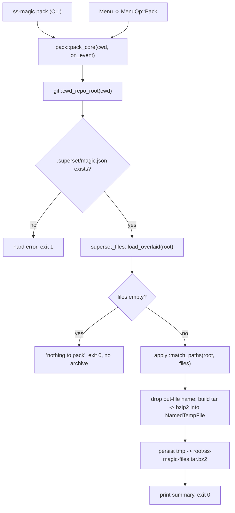

# feat: Add `ss-magic pack` command

## Summary

Add a `pack` operation to `ss-magic` that expands the sync patterns from the
overlaid `magic.json` config, collects every matching file/directory from the
current git repo root, and writes them — preserving repo-relative structure —
into a single `ss-magic-files.tar.bz2` at the git root. Expose it as both a
non-interactive subcommand (`ss-magic pack`) and an interactive menu option
(offered wherever an initialized `magic.json` exists). Bump the crate version.

The pattern-expansion engine (`apply::match_paths`), config loading
(`superset_files::load_overlaid`), and repo-root resolution (`git::cwd_repo_root`)
already exist and are reused verbatim — the new work is a thin `pack.rs` module
that tars + bzip2-compresses the matched paths, plus wiring into `cli.rs`,
`main.rs`, and `menu.rs`.

---

## Problem Frame

`ss-magic` manages a set of workspace files (secrets, dev vars, local config)
described by glob/literal patterns in `.superset/magic.json`. Today those files
can be forward-synced (main → worktree) and reverse-synced (worktree → main),
but there is no way to **snapshot the whole configured set into a single
portable archive** — useful for backup, transfer to a new machine, or handing
the bundle to a teammate.

`ss-magic pack` fills that gap: one command produces
`<git-root>/ss-magic-files.tar.bz2` containing exactly the files the config
defines, at their repo-relative paths.

---

## Scope & Key Decisions

### KTD1 — Config source and pack target: the current git repo root

`pack` resolves the current repo root via `git::cwd_repo_root(cwd)` and does
**everything** relative to that root: it reads the overlaid `magic.json`
(`magic.json` + `magic.local.json`) from `<root>/.superset/`, expands patterns
against `<root>`, and writes the archive to `<root>/ss-magic-files.tar.bz2`.

Rationale: this is the least-surprising mental model ("pack the configured
files that are here, into the git root here"). It works identically in the main
checkout and in a worktree (both carry a committed `magic.json`; a properly
forward-synced worktree also carries `magic.local.json` since it is in
`default_magic_files`). It avoids the main-checkout-resolution branch that
`sync` needs, because `pack` never copies across trees.

Alternative considered — read config from the main checkout root (like `sync`)
but pack files from cwd: rejected as more complex with no user benefit for the
snapshot use case, and it would surface main-vs-worktree drift confusingly.

### KTD2 — bzip2 backend: pure-Rust, no C toolchain

Add two dependencies:
- `tar` (pure-Rust tar archive writer/reader).
- `bzip2` with the `libbz2-rs-sys` backend feature so compression is pure Rust
  and requires **no system libbz2 / C toolchain**. This keeps the cargo-dist
  cross-platform release builds (and the from-source install path) hermetic,
  consistent with the existing `self_update` choice of rustls + rust-native
  archive handling.

Implementer must confirm at build time that the chosen `bzip2` version exposes
the `libbz2-rs-sys` feature (0.5.x line). If a version mismatch surfaces, pin to
the version that does rather than falling back to a C-linked backend.

### KTD3 — Atomic write, and never pack the archive into itself

Build the archive into a temporary file in the git root (`NamedTempFile::new_in`,
already a dependency via `tempfile`), then persist/rename it onto
`ss-magic-files.tar.bz2`. Before archiving, defensively drop any matched path
equal to the output file name at the repo root, so a broad user pattern
(e.g. `*.bz2`) can never recurse the archive into itself.

### KTD4 — Reuse `apply::match_paths` for expansion

`pack` calls the existing `apply::match_paths(root, &cfg.files)` seam (currently
used by reverse sync) to get the deduped, syntax-checked, exclude-filtered list
of repo-relative paths. This inherits `DEFAULT_EXCLUDES` (`node_modules`,
`.venv`), absolute/`..` rejection, and dedupe for free. Pattern-level skip
detail (bad glob, no-match) is swallowed by `match_paths`; that is acceptable
because the same patterns are already validated on the sync path — `pack` emits
its own per-entry "added" events for user feedback.

### KTD5 — Version bump: minor (new user-visible command)

Bump `version` in `Cargo.toml` and the matching `ss-magic` entry in
`Cargo.lock` from `0.1.1` to `0.2.0`. Per the repo convention, a new
user-visible command is a minor bump (pre-1.0). The binary self-updates keyed
on version, so this is mandatory.

---

## Scope Boundaries

**In scope:** new `pack` subcommand, menu entry, `pack.rs` module, `tar`/`bzip2`
deps, version bump, unit tests, README + CLAUDE.md doc touch-ups.

### Deferred to Follow-Up Work
- Adding `ss-magic-files.tar.bz2` to `.gitignore` automatically (nice-to-have;
  not requested — the archive is written to the git root and a user may want it
  tracked or ignored per their own workflow).
- A `--output <path>` flag to override the archive location.
- Configurable compression level or alternate formats (`.tar.gz`, `.zip`).

---

## High-Level Technical Design

The control-flow mirrors `main::sync_core` deliberately: resolve root → probe
`magic.json` → load overlaid config → empty-guard → do work. Reviewers should
read `pack_core` against `sync_core` for parity.

---

## Implementation Units

### U1. Add `tar` + `bzip2` dependencies and bump version

**Goal:** Make the archive libraries available and bump the crate version.

**Files:**
- `Cargo.toml` (add `tar`, `bzip2` deps; bump `version` to `0.2.0`)
- `Cargo.lock` (regenerated; verify the `ss-magic` package entry is `0.2.0`)

**Approach:**
- Add `tar = "0.4"`.
- Add `bzip2 = { version = "0.5", features = ["libbz2-rs-sys"] }` (KTD2). Confirm
  the feature name/version resolves to the pure-Rust backend; adjust the pin if
  the resolved version differs. Run a release build to confirm no C toolchain is
  pulled in.
- Bump `version = "0.2.0"` and let `cargo build` update `Cargo.lock`.

**Test scenarios:** `Test expectation: none — dependency/version change, exercised
transitively by U2–U5 tests and the build.`

**Verification:** `cargo build --release` succeeds; `Cargo.lock` shows `ss-magic`
at `0.2.0`; no `bzip2-sys`/C-link in the dependency tree.

---

### U2. New `pack.rs` module: expand config, build tar.bz2

**Goal:** Implement the pure pack engine, testable in isolation from CLI/menu.

**Dependencies:** U1.

**Files:**
- `src/pack.rs` (new)
- `src/main.rs` (add `mod pack;`)

**Approach:**
- Define `const PACK_FILE_NAME: &str = "ss-magic-files.tar.bz2";`.
- Define a minimal event type for feedback, e.g.
  `pub enum PackEvent { Add { rel: PathBuf } }`, mirroring `apply::Event`'s
  closure-driven design so tests collect events and production prints them.
- `pub fn pack_core<F: FnMut(&PackEvent)>(cwd: &Path, on_event: F) -> Result<ExitCode>`
  following `sync_core`'s shape:
  1. `git::cwd_repo_root(cwd)` → hard error (exit 1) if not a repo.
  2. Probe `<root>/.superset/magic.json`; hard error (exit 1, naming the path)
     if absent — reuse the same message shape as `sync_core`.
  3. `superset_files::load_overlaid(root)`; propagate parse errors as exit 1.
  4. Empty `files` → print "nothing to pack", exit 0, write **no** archive.
  5. `apply::match_paths(root, &cfg.files)` → matched rel paths.
  6. Drop any rel equal to `PACK_FILE_NAME` at root (KTD3).
  7. If, after filtering, there is nothing to archive, print "nothing to pack"
     and exit 0 without writing an archive.
  8. Build the archive (helper below); print a summary line
     (`Packed N files → <path>`), exit 0.
- Private helper `fn write_archive<F>(root, rels, out_path, on_event) -> Result<usize>`:
  - `NamedTempFile::new_in(root)`.
  - `BzEncoder::new(tmp, Compression::default())` → `tar::Builder::new(enc)`.
  - For each rel: if `root.join(rel)` is a dir → `builder.append_dir_all(rel, abs)`;
    if a file → `builder.append_path_with_name(abs, rel)`; emit `PackEvent::Add`.
    (Directory entries are added recursively, matching `apply`'s dir semantics.)
  - `builder.into_inner()?` then `enc.finish()?` to flush both layers; persist
    the temp file onto `out_path` (rename).
  - Return the count of top-level entries added.

**Patterns to follow:** `main::sync_core` (control flow, error/exit shape),
`apply::run` (file-vs-dir branch), `reverse_sync` (use of `match_paths` +
`NamedTempFile`/atomic persist idioms already in the repo).

**Test scenarios (`src/pack.rs` `#[cfg(test)]`, using `tempfile` +
shell-invoked `git init`, like existing modules):**
- Happy path — literal file: repo with `magic.json` `[".env"]` and a `.env`
  file → `pack_core` exits 0, `ss-magic-files.tar.bz2` exists at root, and
  decompressing it (bzip2 + tar reader) yields exactly `.env` with matching
  bytes.
- Happy path — glob at depth: `["**/.dev.vars"]` with
  `apps/api/.dev.vars` + `apps/web/.dev.vars` → archive contains both at their
  repo-relative paths.
- Repo-relative structure preserved: nested `a/b/c/.env` appears as `a/b/c/.env`
  inside the archive (not flattened, not absolute).
- Matched directory packed recursively: `magic.json` `["apps/api/config"]`
  with files under it → all nested files present in the archive.
- Excludes inherited: `["**/.env"]` with a `node_modules/pkg/.env` and a
  `.venv/lib/.env` present → those are absent from the archive; the real one is
  present.
- Empty `files` → exit 0, **no** archive file created.
- Missing `magic.json` → non-zero exit (hard error).
- Malformed `magic.json` → non-zero exit.
- Not in a git repo → non-zero exit.
- Self-exclusion: a stale `ss-magic-files.tar.bz2` at root plus a `*.bz2`-style
  pattern → the output archive does not contain an entry for itself.

**Verification:** `cargo test pack` green; archive round-trips through a
bzip2+tar reader in-test.

---

### U3. CLI wiring: `Command::Pack` + parse + usage

**Goal:** Route `ss-magic pack` to the pack flow.

**Dependencies:** U2.

**Files:**
- `src/cli.rs`

**Approach:**
- Add `Pack` to `enum Command`.
- In `parse`, map `"pack"` → `Parsed::Command(Command::Pack)`.
- Add a `pack` line to `USAGE`.

**Test scenarios (extend `cli.rs` tests):**
- `parse(["pack"])` → `Parsed::Command(Command::Pack)`.
- `usage()` text contains `pack`.
- `parse(["--help", "pack"])` still returns `Help` (help precedence unchanged).

**Verification:** `cargo test cli` green.

---

### U4. Dispatch + update gate: run pack from `main.rs`

**Goal:** Execute the pack flow and include it in the auto-update gate for parity
with `sync`.

**Dependencies:** U2, U3.

**Files:**
- `src/main.rs`

**Approach:**
- Add `pub fn run_pack_flow(cwd: &Path) -> Result<ExitCode>` that calls
  `pack::pack_core(cwd, print_pack_event)` (a small printer mapping `PackEvent`
  to a `style::info("Added: …")` line; reuse `style` helpers).
- In `dispatch`, add `Command::Pack => run_pack_flow(&cwd)`.
- Extend `should_run_update_gate` to fire for `Pack` as well as `Bare`/`Sync`
  (update the doc-comment truth table). Rationale: `pack` is a non-interactive
  "do work" command like `sync`; gating keeps pack users self-updating. `Update`
  still bypasses.

**Test scenarios (extend `main.rs` `update_gate_tests`):**
- `should_run_update_gate(Command::Pack, false)` → `true`.
- `should_run_update_gate(Command::Pack, true)` → `false` (guard active).

**Verification:** `cargo test` green; manual smoke of `ss-magic pack` in a test
repo produces the archive.

---

### U5. Menu wiring: `MenuOp::Pack`

**Goal:** Offer Pack interactively wherever an initialized `magic.json` exists.

**Dependencies:** U2, U4.

**Files:**
- `src/menu.rs`

**Approach:**
- Add `Pack` to `enum MenuOp` with `Display` label
  (e.g. `"Pack configured files into ss-magic-files.tar.bz2"`).
- In `operations_for`, append `Pack` to:
  - `Location::Worktree` → `[ForwardSync, ReverseSync, Pack]`
  - `Location::Main` + `Branch::Normal` → `[EditConfig, Pack]`
  - Leave `Branch::Init` and `Branch::Migrate` unchanged (no `magic.json` yet).
- In `run`, add a `MenuOp::Pack => crate::run_pack_flow(cwd)` arm to **both**
  the worktree and main-checkout dispatch closures.

**Test scenarios (extend `menu.rs` tests):**
- Worktree ops equal `[ForwardSync, ReverseSync, Pack]` for every branch value.
- `Main` + `Normal` ops contain `Pack` (and `EditConfig`).
- `Main` + `Init` and `Main` + `Migrate` do **not** contain `Pack`.
- The main-only/worktree-only disjointness invariant test is updated so `Pack`
  (offered in both locations) does not break it — treat `Pack` as a shared op or
  adjust the invariant to exclude `Pack` explicitly, documenting why.

**Verification:** `cargo test menu` green; manual smoke: menu shows Pack in a
worktree and in a Normal main checkout, and running it writes the archive.

---

### U6. Docs: README + CLAUDE.md

**Goal:** Document the new command and module.

**Dependencies:** U3, U5.

**Files:**
- `README.md` (user-facing: add `pack` to the command list / usage)
- `CLAUDE.md` (Architecture: add a `pack.rs` bullet; note the new command in
  `main.rs`/`cli.rs`/`menu.rs` descriptions)

**Approach:** Mirror the phrasing/structure of the existing `sync` entries.

**Test scenarios:** `Test expectation: none — documentation.`

**Verification:** Docs read correctly and match the shipped behavior.

---

## Verification Contract

- `cargo build --release` succeeds with no C-toolchain dependency introduced.
- `cargo test` is green, including the new `pack`, `cli`, `main`, and `menu`
  tests.
- `cargo fmt --check` and `cargo clippy` (repo convention) are clean.
- Manual smoke: in a test repo with a populated `magic.json`, `ss-magic pack`
  writes `ss-magic-files.tar.bz2` at the git root; extracting it reproduces the
  configured files at their repo-relative paths.
- `Cargo.toml`/`Cargo.lock` show version `0.2.0`.

## Definition of Done

- `ss-magic pack` and the menu Pack entry both produce a correct
  `ss-magic-files.tar.bz2` at the git root containing the configured files with
  repo-relative structure.
- Empty config and error paths (no repo, no/malformed `magic.json`) behave as
  specified (exit codes and messages parallel `sync`).
- Version bumped to `0.2.0` in `Cargo.toml` + `Cargo.lock`.
- All new and existing tests pass; docs updated.

---

## Sources & Research

- Existing engine reused: `src/apply.rs` (`match_paths`), `src/superset_files.rs`
  (`load_overlaid`, `MagicConfig`), `src/git.rs` (`cwd_repo_root`),
  `src/main.rs` (`sync_core` shape), `src/menu.rs` (`operations_for`),
  `src/cli.rs` (`parse`/`USAGE`).
- Dependency choice grounded in the repo's existing hermetic-build posture
  (`self_update` uses rustls + rust-native archive features; no C linkage).
