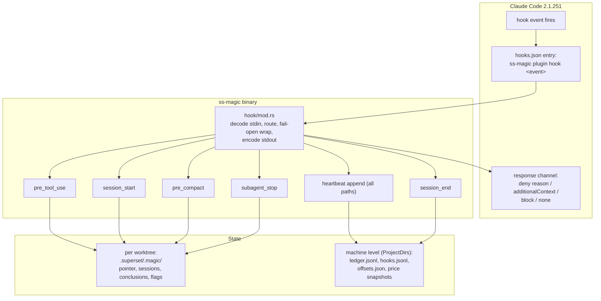
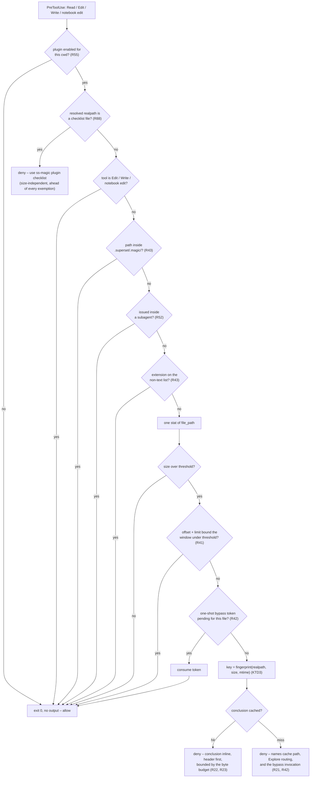
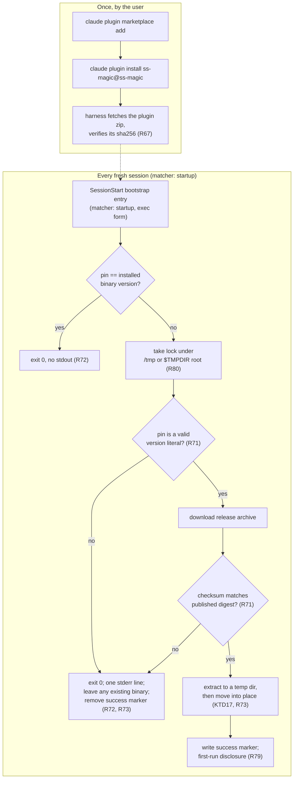
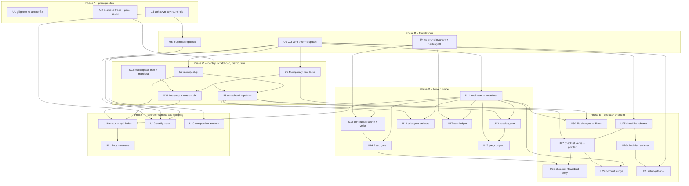

# ss-magic Claude Code Plugin - Plan

## Goal Capsule

**Objective.** Make `ss-magic` ship a Claude Code plugin named `ss-magic` that carries a durable per-worktree session scratchpad, a context page-fault gate on `Read`, a cost ledger, subagent artifact enforcement, and a project-agnostic operator checklist rendered into a commit-time nudge and a CI PR comment. The plugin is delivered through a plugin marketplace published from this repository — the only delivery path (R66) — and acts in a given repository only when that repository's `magic.json` sets `plugin.enabled` (R5-R7).

**Product authority.** The requirements below are settled. Every design fork was closed by measurement against Claude Code 2.1.251 and the `ss-magic` crate at v0.9.0; the evidence is in [validation-evidence.md](./2026-08-29-001-ss-magic-plugin/validation-evidence.md). Six pieces of the original request were rewritten or dropped on that evidence, each with a named replacement — see [Key Decisions](#key-decisions).

**Open blockers.** None. Every question is ruled, with one correction carried in: the
2026-08-29 review found that the install-scope decision's stated premise was factually
wrong (see [Key Decisions](#key-decisions)). The decision survives on corrected reasons;
the premise does not.

**Product Contract preservation.** Restructured, no scope change. R1-R34 keep their IDs and meaning; R8 and R9 were rewritten in place after planning research found each was two rules wearing one ID — R8 now separates the stdin-driven hook entry point from the argv-driven human verbs, and R9 splits the fail posture that differs between them. R35-R58 and AE19-AE44 are additions closing gaps planning and review found, not revisions of settled product scope.

**2026-08-29 revision.** Two user-directed changes landed after the third review round,
each with the requirements and units they touch rewritten rather than renamed:\
**(1) Plugin state moved from `.scratchpad/` to `.superset/.magic/`**, ignored by a rule in
the repository's `.gitignore` instead of a nested self-ignoring file. This inverts R40 and
AE24, re-grounds R1/U1's motivation, and changes who owns the ignore rule (R59, R63).\
**(2) The install-scope decision was split into two axes** – distribution and enablement –
so a plugin marketplace can ship from the public repo without moving the enablement scope
(R59-R62, R65). R59-R65 and AE45-AE53 are that revision's additions.

**2026-08-30 revision.** Five further user-directed changes, after a second review round:\
**(A) The local install path is deleted.** No `ss-magic plugin install`, no personal-scope
tree, no sync-time install step. The marketplace is the only way the plugin reaches a
machine. **`plugin.enabled` stays** – it remains the per-repository gate for a
machine-globally installed plugin, and the `plugin` object continues to carry the rest of
the plugin's configuration.\
**(B) The binary is bootstrapped by the plugin, not shipped in it.** A `SessionStart` hook
installs a pinned `ss-magic` into `${CLAUDE_PLUGIN_DATA}` and hooks invoke it from there
(R68-R79).\
**(C) A project-agnostic operator checklist**, whose JSON schema and Markdown renderer ship
inside the binary (R82-R87).\
**(D) `/ss-magic:setup` is replaced by `/ss-magic:setup-github-ci`** (R93-R95).\
**(E) Checklist runtime behavior** – init, a path-based Read/Edit deny, a commit-time nudge,
a direnv export, and CI rendering into a PR comment (R88-R92).\
R66-R95 and AE54-AE78 are this revision's additions; the local-install requirements are
retired into Scope Boundaries rather than deleted, so the trace stays readable.

## Companion documents

The plan stays standalone-readable; these carry the implementation detail it would otherwise bury. Each is in scope for review alongside this file.

- [architecture.md](./2026-08-29-001-ss-magic-plugin/architecture.md) — the full `src/plugin/` tree, module dependency rules, the three helper extractions that stop the plugin restating logic ss-magic already has, and the two prerequisite fixes that live outside `src/plugin/`.
- [hook-contract.md](./2026-08-29-001-ss-magic-plugin/hook-contract.md) — every shipped hook event with its channel, the measured 10,000-character cliff, the uncapped deny channel, the concurrent last-write-wins rewrite race, and the two validation tiers with opposite fail postures.
- [page-fault.md](./2026-08-29-001-ss-magic-plugin/page-fault.md) — what the harness already does to large output, why the Bash half is dropped, and the deny-with-inline-conclusion mechanism with its cache-key rules.
- [scratchpad-contract.md](./2026-08-29-001-ss-magic-plugin/scratchpad-contract.md) — identity derivation and its traps, the directory layout, the state files, and why the gitignore inside it arms a pre-existing bug.
- [plugin-assets.md](./2026-08-29-001-ss-magic-plugin/plugin-assets.md) — `plugin.json`, `hooks.json` and the installed layout verbatim, plus install verification.
- [skills.md](./2026-08-29-001-ss-magic-plugin/skills.md) — the three shipped skills, their frontmatter and body, and their invocation names.
- [cost-ledger.md](./2026-08-29-001-ss-magic-plugin/cost-ledger.md) — measured scan feasibility, attribution rules, and why the harness's own priced records come before any price table.

## Product Contract

### Summary

`ss-magic` gains a `plugin` block in `magic.json` and a `ss-magic plugin <verb>` subcommand family. A plugin marketplace published from this repository installs the plugin machine-globally (R66, R67), and a `SessionStart` bootstrap hook keeps its version-pinned binary current under `${CLAUDE_PLUGIN_DATA}` (R70-R73). The plugin itself is JSON, Markdown and one bootstrap script; hooks invoke the bootstrapped binary at `${CLAUDE_PLUGIN_DATA}/bin/ss-magic` (R74), deliberately decoupled from `ss-magic`'s own self-update so the shipped assets and the binary that reads them stay in lockstep (R69, R95). It gives each worktree a durable scratchpad that survives compaction, blocks oversized `Read` calls and answers them from a cached conclusion instead, records per-session cost, stops a subagent from exiting without its contracted artifact, and maintains an operator checklist that only its own CLI may write (R82-R95).

### Problem Frame

Agent sessions lose work to autocompaction, and the loss is invisible until something has to be redone. Two measurements frame the cost. In one 34-hour session, cost tracked `requests × steady-state context` at ~440K tokens re-read per request, and 10.5% of tool results carried 69.5% of all tool-result text. In this session, 8.5% of results carried 52.4% — the same shape, a different magnitude.

Claude Code already solves most of the raw-output half: a generic persistence layer turns 200 KB of command output into 2,302 characters and a file path. What it does not solve is `Read`, which never spills at all — an 8,000-line read cost 60,066 cache-creation tokens against ~6,600 for any spilled Bash output. Nor does it solve continuity: when the window is cleared, nothing authored survives unless something wrote it down, and the 1,303 spill files already on this machine sit in 92 directories under unguessable names with no index.

ss-magic already owns the per-worktree contract, already runs on every worktree, and already self-updates. It is the natural carrier.

### Key Decisions

- **The marketplace is the only delivery path.** `ss-magic` installs nothing: there is no `plugin install` verb, no personal-scope tree, and no sync-time install step. A marketplace published from the public `ViktorStiskala/superset-magic` repo is how the plugin reaches a machine, via `claude plugin marketplace add` + `claude plugin install`. *Governs R66; retires R10-R13, R38, R39, R60, R61.*
- **The marketplace source is `archive`, pinned by content digest.** The entry names a release-asset URL plus a `sha256` of the plugin zip. This is the only source type the marketplace can verify by content: the digest is enforced client-side – a deliberate mismatch produces `Plugin archive integrity check failed … The archive was not installed`, and it is re-checked on `claude plugin update`. It needs no git on the client, where `git-subdir` requires git >= 2.25 for sparse-checkout cone mode.
  **Why not `git-subdir`, which this plan specified until 2026-08-30:** a commit can never pin itself, because the commit hash covers `marketplace.json`. The `sha` must therefore always name an *ancestor* commit, so the released tag's own plugin content is never the content being pinned. The two-phase fix – tag, build, commit the digest, move the tag – is forbidden outright once release immutability is on (`Git tags cannot be moved`). The `archive` form has no such circularity: `plugin/` and `.claude-plugin/marketplace.json` are disjoint subtrees, verified by rewriting the digest to a dummy value and re-zipping to the same hash.
  **The cost, unchanged and still accepted:** the 2.1.251 loader branches on string-vs-object source. A relative-path string source is resolved inside the already-cloned marketplace and is not external; every object source, `archive` included, takes the external branch, so a plugin that only a project's `.claude/settings.json` enables is reported not-installed until each user runs `claude plugin install`. Collaborator auto-install is forgone either way. *Governs R66, R67, R96-R98.* (session-settled: user-directed – `git-subdir` was chosen first, then replaced with `archive` once the self-pinning circularity was measured.)

- **`plugin.enabled` stays.** A marketplace install is machine-global, so the per-repository gate is what keeps an install made for one repo from acting in every other. The overlaid `plugin` object remains both the gate (`enabled`) and the home for the rest of the plugin's configuration – thresholds, byte budgets, exemption lists (R53), and whatever later needs a per-repository value. *Governs R5-R7, R55, R65.* (session-settled: user-directed – kept after the review proposed four replacements for it.)
- **Personal scope was never the answer, and the trust premise was wrong.** The original decision claimed a project-scope plugin is gated on `hasTrustDialogAccepted` and "every Superset worktree is a new realpath — untrusted by construction". **That premise is wrong** – Claude Code keys workspace trust on the git repository root and, in a worktree, on the *main checkout's* root. The point is now moot for a different reason: nothing is installed to `~/.claude/skills/ss-magic/` at all. Note that a leftover skills-dir copy would be *suppressed* rather than doubled – the loader resolves by plugin **name** and a marketplace install outranks `@skills-dir`, reporting the shadowed copy in the `/plugin` Errors tab – so migration deletes it rather than relying on precedence. *Governs R66.*
- **The plugin is a manifest plus one bootstrap script; the binary is the behavior.** The plugin ships JSON, Markdown and a single shell script. That script installs a pinned `ss-magic` into `${CLAUDE_PLUGIN_DATA}` – the one directory that survives a plugin update, since `${CLAUDE_PLUGIN_ROOT}` is a version-scoped path that is replaced on every bump. Hooks then invoke the binary from that fixed path rather than by bare name, so hook behavior rides the plugin's pin instead of the binary's own self-update. *Governs R66-R73.*
- **The version pin, not the marketplace, decides which binary runs – and the pin is a supply-chain boundary.** Whoever can write the pinned-version file in the marketplace repo decides what every installed machine downloads and executes at session start. Round 1's answer to the same channel (re-verify installed bytes against the binary's embedded assets) died with the install verb, so the replacement control lives in the bootstrap: the pin is validated as a version literal before it reaches a URL, and the downloaded archive is checksum-verified against the release's published digest before anything executes. *Governs R70, R71.*
- **`ss-magic plugin` never auto-updates, and `--version` never opens a menu.** The plugin's binary is pinned deliberately: the skills, hooks and Markdown the marketplace ships are versioned together with the binary that reads them, so a silent self-update would desynchronise the two. The whole `plugin` verb family is therefore excluded from the update gate, `--version`/`-V` short-circuits before it, and the interactive menu refuses to open without a TTY. Bare `ss-magic` keeps its existing update behavior – the plugin never invokes it. *Governs R9, R68, R69.* (session-settled: user-directed.)
- **Drop the Bash page-fault half entirely.** The harness already spills every tool's output to a named file with a size label and preview, `BASH_MAX_OUTPUT_LENGTH` provably cannot raise the 30,000-char literal, and a rewrite would race the user's live rtk hook. Replaced by a read-only spill manifest. *Governs R20, R25.* (session-settled: user-directed — the user's own ideation named this as idea 3; measurement showed the mechanism already exists, so the manifest is what survives.)
- **The gate denies; it never rewrites.** `updatedInput` works but the transcript keeps the original tool call, so the model is never told its input changed — and rewrites race last-write-wins. `permissionDecisionReason` is uncapped, so the cached conclusion rides inline instead. *Governs R21, R22, R23.* (session-settled: user-directed — chosen over the brief's "deny and tell the model to range-read or grep": that leaves the model to re-derive, and its own note flagged the looping risk.)
- **Route denied reads to an Explore agent and cache the conclusion by file identity.** The saving is not the agent's tokens, it is every later request that never re-reads the payload. *Governs R21, R24.* (session-settled: user-directed.)
- **Key the scratchpad on `<repo>-<branch>` from git, never on the Superset workspace name.** This overturns a direction confirmed earlier in the session: the name is user-mutable, 31 of 36 live workspaces have `name != branch`, and five are named `main`, so a rename would silently orphan the scratchpad. *Governs R14, R15.*
- **No symlink registry.** ss-magic creates no symlink anywhere today — forward sync skips them and pack only classifies them — so a plain `current.json` pointer is used instead. *Governs R16.*
- **Fix two pre-existing defects first.** Reverse sync can append `*` to the main checkout's root `.gitignore`, and the sync/pack enumeration layer is gitignore-blind. Neither is armed by the plugin's own state any more – with state at `.superset/.magic/` ignored by a repository-level rule, `ensure_path_ignored` lifts a root rule to a root rule and the re-anchor defect is not reachable through this plan's own writes. Both stay Phase A on live evidence instead: `.scratchpad/.gitignore` containing `*` **already exists in this worktree**, written by the planning tooling, so any broad reverse-sync pattern can still lift it into the main checkout today; and the enumeration layer must exclude the relocated state tree before the first byte lands in it. *Governs R1, R2, R3.*
- **Every hook is advisory, never a security gate.** Three independent fail-open paths: a missing binary, a timed-out `PreToolUse` hook, and an envelope-level typo. The real secret boundary stays in the sync engine. *Governs R26.*
- **Ship the cost ledger on `SessionEnd`.** The "1.5 s rules out a full scan" premise was wrong by a factor of three — the worst session tree in a 2.61 GiB corpus scans in 0.87 s. *Governs R27, R28.*
- **Tune the compaction window with `autoCompactWindow`, not `CLAUDE_AUTOCOMPACT_PCT_OVERRIDE`.** The env var is a percent bound to a field named `testPctOverride`, absent from `/autocompact` and `/config`, and can only lower the window. *Governs R30, R31.*
- **Effort-tiering stays out of scope.** ~20% of the measured bill and config-only, but it is guidance rather than mechanism. (session-settled: user-directed — offered and declined.)

### Requirements

**Prerequisites — these land before the plugin writes a byte**

- R1. `ensure_path_ignored` must not re-anchor a covering rule at a broader scope than it had in the source tree; reuse a pattern only when the target has a `.gitignore` at the same relative directory, else fall through to an anchored literal.
- R2. The sync engine's enumeration layer must exclude `.superset/backups`, `.superset/.magic`, `.scratchpad` and `.git` as whole trees, in `walk_source`, in `sync/apply.rs::copy_dir_recursive`, and in `pack`, including when a directory match is an ancestor of an excluded subtree. `copy_dir_recursive` is a separate enforcement point, not a consequence of the first: a literal (non-glob) directory pattern never passes through `walk_source` at all – `expand_patterns` appends the rel directly – and `copy_dir_recursive` then re-walks the live filesystem with no filter, so a bare `.superset` entry in a repository's `files` list would otherwise copy `backups/` and `.magic/` wholesale into the worktree. `.scratchpad` stays on the list as a third-party tree ss-magic does not own but must never push into main; `.superset/.magic` is added, not substituted. The match is on the exact two-component path – it must never widen to `.superset` itself, which would exclude the contract files (`config.json`, `magic.sh`, `magic.json`) from sync and pack.
- R3. `pack` must report the number of unique paths it archived, not the number of tar entries.

**Configuration**

- R4. `MagicConfig` must round-trip unknown top-level keys through every write path, so `init`, `migrate` and the edit-config menu no longer delete configuration they do not understand.
- R5. `magic.json` accepts a `plugin` object; `plugin.enabled` defaults to false when the key is absent.
- R6. For every non-`files` key, `magic.local.json` overrides the base value whole; an absent key inherits, and an explicit null means off.
- R7. Enabling or disabling the plugin per machine is done in the main checkout's `magic.local.json`, because a worktree's overlay is itself forward-synced.

**CLI surface**

- R8. `ss-magic plugin` provides one stdin-driven hook entry point, `plugin hook <event>`, for the events `session-start`, `pre-tool-use`, `pre-compact`, `subagent-stop`, `session-end` and `file-changed` (R92), plus argv-driven human verbs including `status`, `cost`, `spill-index`, `scratchpad`, `conclude`, `conclusions`, `gc`, `bypass`, `expect-artifact`, `enable`, `disable`, `config`, `compact-window`, `setup-github-ci` (R93), and the `checklist` family of R90. There is no `install` verb: the marketplace is the only delivery path (R66).
- R9. `ss-magic plugin` never runs the auto-update gate and never opens the TUI; a hook verb prints nothing to stdout beyond its JSON envelope and exits 0 on any internal error, while a human verb reports failure on stderr and exits non-zero.
- R35. Hook and human entry points are separate commands – `plugin hook <event>` for stdin-driven hooks, named verbs for humans – and no command serves both roles; print and exit posture per R9.
- R36. A `status --json` verb reports the resolved slug, state directories, thresholds, and install state, so any agent can discover them from Bash with no injected context.
- R65. The overlaid `plugin.enabled` (R5-R7) remains the single behavioral switch: hooks no-op when it is false regardless of how the harness loaded the plugin (R55). Because enablement now has two layers – the harness decides through trust plus the plugin registrations it loaded, ss-magic decides through its own overlay – `status` and `status --json` report both, naming the harness-side scope, registration id and enabled flag alongside ss-magic's own resolved value, so "why is the plugin not acting" has one place that answers it.
- R37. `enable`/`disable` (with `--local` targeting the main checkout's overlay per R7) and `config get`/`config set` edit the plugin configuration from the command line, writing through the unknown-key-preserving path of R4; `disable` stops the hooks from acting and leaves the installed tree in place, which only `uninstall` removes.

**Packaging and install**

- ~~R10-R13, R38, R39~~. **Retired 2026-08-30 – the local install path is deleted.** They described installing to `~/.claude/skills/ss-magic/`, verifying that tree, content-addressing it, keeping repository values out of rendered manifest bytes, and the first-install notice. See Scope Boundaries → "Retired with the local install path"; R66-R73 replace them.
- R66. The plugin reaches a machine only through the marketplace. `ss-magic` has no `install` verb, writes no plugin tree anywhere, and `ss-magic sync` runs no plugin step. Migration deletes any pre-existing `~/.claude/skills/ss-magic/`, because a marketplace install outranks a skills-dir copy by plugin name and would otherwise leave a shadowed copy reported in the harness's plugin-errors view. **U8 owns this**, since it is the only unit that touches `src/workspace/migrate.rs`; U22 builds the marketplace artifacts and deletes nothing.
- R67. The marketplace manifest declares one `archive` entry: an https release-asset URL for the plugin zip, plus a `sha256` of that zip (64 hex, case-insensitive). The archive must be a **ZIP** – a `.tar.gz` is rejected with `invalid zip data` – with `.claude-plugin/` at the zip root or inside a single wrapper directory, never deeper. The URL must be https and must not resolve to a loopback, link-local or cloud-metadata host; the client caps the body at 256 MiB, the fetch at 120 s, and redirects at 5.
- R101. CI asserts the marketplace entry actually carries a `sha256`, and that it equals the published asset's digest. This is not belt-and-braces: `sha256` is optional in the schema and `claude plugin validate` silently ignores unknown keys inside a source object, so a typo such as `"sha"` validates cleanly and installs the plugin **unpinned**. The failure is invisible at authoring time and removes the only integrity control on the plugin, so it is checked mechanically rather than by review.
- R96. The plugin zip is **byte-reproducible**, so its digest can be computed and committed before any release exists and re-derived identically by CI. The builder sorts entries explicitly rather than trusting directory order, stamps every entry with a fixed 1980-01-01 timestamp rather than reading a clock or an mtime, normalises modes to 0644 (0755 under `bin/` and for `*.sh`), forces the ZIP `create_system` field to unix, and stores rather than deflates so no zlib version difference can reach the bytes. It excludes `.DS_Store`, and it **refuses** – loudly, rather than producing a silently platform-dependent digest – on a symlink or a non-ASCII filename, because macOS normalises filenames to NFD and Linux to NFC and the two hash differently. `git archive` is not used: its tree-ish form stamps the current time, and its commit-ish form binds the digest to the committer time, which reintroduces the self-pinning problem.
- R97. The repository carries a `.gitattributes` pinning the plugin tree's line endings, so a checkout on a machine with `core.autocrlf` enabled produces the same file bytes – and therefore the same digest – as the Linux CI runner. Without it the digest is a function of who ran the builder.
- R98. Bumping the plugin's content **requires bumping its declared version**. The resolved version, not the digest, is the update signal: the cache path is keyed on it and `claude plugin update` skips a plugin whose resolved version already matches. Changing the zip and its `sha256` without bumping the version leaves every installed user silently on the cached copy. Where no version is declared anywhere, the digest itself becomes the version, and that failure mode disappears – but the plan declares a version, so the coupling is a hard release rule (R95).
- R68. `ss-magic --version` / `-V` short-circuits argument parsing before any subcommand dispatch, prints the crate version on stdout, runs no update check, and never constructs the interactive menu. Without this the flag falls through to bare invocation, which is on the update-gate list and routes to the TUI – so the bootstrap's freshness probe would trigger a network self-update and open a menu with no terminal attached.
- R69. No `ss-magic plugin` invocation ever runs the auto-update gate, and the interactive menu refuses to open when stdout or stdin is not a TTY, reporting the reason on stderr. The plugin's binary is pinned so that it stays in step with the skills, hooks and Markdown the marketplace ships alongside it; a silent self-update would desynchronise them. Bare `ss-magic` keeps its existing update behavior, and no plugin path invokes it.

**The bootstrap**

- R70. A `SessionStart` hook installs the pinned `ss-magic` into `${CLAUDE_PLUGIN_DATA}` when it is absent or its version does not match the pin, and does nothing otherwise. The pin lives in a file beside `plugin.json`, so a plugin update is what triggers a binary update. `${CLAUDE_PLUGIN_ROOT}` is never the install target: it is version-scoped and replaced on every plugin update.
- R71. Before any URL is composed, the bootstrap validates the pin against a strict `MAJOR.MINOR.PATCH` pattern. It then fetches the **platform release archive directly** and verifies it against that archive's published `.sha256` before extracting anything, rather than piping the installer script into a shell. This is not a stylistic preference: the release publishes `.sha256` siblings for the `.tar.gz` archives but **not** for `ss-magic-installer.sh`, so a piped installer is the one executed artifact no published digest covers – the script does verify the archive it downloads, but nothing verifies the script. Fetching the archive directly makes the verified thing and the executed thing the same thing. A fetch or verification failure leaves any already-installed binary in place.
- R72. The bootstrap never fails a session. It exits 0 on every path – no network, DNS failure, proxy, 404, checksum mismatch, unwritable data directory, or unsupported platform – emits nothing on stdout when the pin already matches, and reports at most one line on stderr otherwise. A hook's stdout enters the model's context on every session start, so silence on the success path is a token budget rule, not a style preference.
- R73. The bootstrap serialises against concurrent sessions through a lock under the temporary root of R80, installs to a temporary directory and moves the result into place, and removes its success marker when an install fails so the next session retries rather than trusting a half-written tree.
- R74. Hooks invoke the binary at `${CLAUDE_PLUGIN_DATA}/bin/ss-magic`. Both `${CLAUDE_PLUGIN_ROOT}` and `${CLAUDE_PLUGIN_DATA}` are substituted by the harness inside a hook entry's `command` string and per-element inside `args` (measured on 2.1.251), and the braced form is used everywhere because the bare `$NAME` form is substituted only in shell form.
- R75. The plugin ships `bin/ss-magic-plugin`, a wrapper that execs the bootstrapped binary with the `plugin` verb already injected (`exec "$BIN" plugin "$@"`), so a skill body reads `ss-magic-plugin checklist list`. Two reasons for the shape: `${CLAUDE_PLUGIN_DATA}` is exported to hook and MCP/LSP processes but **not** to the Bash tool, so a skill cannot name that path directly; and a wrapper named plainly `ss-magic` would resolve non-deterministically against whatever the user has on PATH. Injecting the verb also makes R69's no-update-gate, no-TUI posture structural rather than a convention. The wrapper is what every shipped skill invokes; no skill body names `${CLAUDE_PLUGIN_DATA}` or a bare `ss-magic`. `$BIN` is resolved through a **durable Bash-visible handoff**, because the wrapper runs in a process that never sees `${CLAUDE_PLUGIN_DATA}`: the bootstrap writes the resolved data root into `<R80-root>/data-root` (one line, no trailing content), and the wrapper recomputes that same R80 path from `$HOME` – the one input both processes share – and reads it. When the file is absent or names a path with no executable binary, the wrapper exits 0 after printing a one-line explanation to stderr, matching R26's fail-open posture rather than failing a skill mid-run.
- R76. The plugin declares **two** `SessionStart` groups, and collapsing them breaks one half or the other. The **bootstrap** entry carries `"matcher": "startup"`, so it runs once per fresh session rather than again on every resume, clear, compaction and fork. The **ss-magic session-start handler** stays unmatched and therefore fires on all five sources, because the `compact` source is the compaction-survival signal F2 and R19 are built around. Both declare an explicit timeout well below the harness's 600-second default, with the bootstrap's fetch separately time-bounded.
- R77. Hooks on one event run concurrently, so the bootstrap cannot be relied on to finish before its sibling hooks fire. The consequence differs by case, and the plan states both rather than leaving either to be discovered. **First install:** no binary exists at the invocation path, so every ss-magic hook is inert for that session through R26's fail-open path. **Pin bump:** the *previous* binary is still at `${CLAUDE_PLUGIN_DATA}/bin/ss-magic` and keeps serving hooks until R73's move lands, so that session is a bounded mixed-version window – the previous binary running against the newly loaded plugin's `hooks.json` and skills, with the version possibly flipping mid-session. R62's unknown-event tolerance is the compatibility contract that makes the window safe: a binary that does not know an event exits 0 with empty stdout. `status` reports bootstrap state: the pinned version, the resolved binary path, and the last bootstrap outcome.
- R78. The bootstrap is a no-op on platforms with no published release target, reporting the reason once on stderr rather than failing on every session start.
- R79. A one-time disclosure names the machine-global hooks being registered, the binary being downloaded and the release it comes from, emitted by the bootstrap on its first successful run on a machine; a later run is silent. This replaces the retired R39, whose only trigger was the deleted install path.
- R59. The repository publishes a plugin marketplace manifest. It is the sole delivery path (R66); the shape is R67's.
- ~~R60, R61~~. **Retired 2026-08-30** – both were enforced by `ss-magic plugin install` and `ss-magic sync`, which no longer exist. Name collision is now resolved by the harness itself (R66), and R71 replaces R61's byte-verification with checksum verification of the downloaded release.
- R80. Volatile coordination state – lock files and anything else guarding a race – lives under a private per-machine temporary root: `/tmp/ss-magic-plugin/<identifier>/`, falling back to `$TMPDIR/ss-magic-plugin/<identifier>/` where `/tmp` cannot host a writable private root, as under a sandbox that allowlists only `$TMPDIR`. **The identifier is the first 16 hex characters of the SHA-256 of `$HOME`** – defined concretely because two independent implementations must derive the same string: `bootstrap.sh` in shell (`printf %s "$HOME" | shasum -a 256`) and `tmproot.rs` in Rust (`std::env::var("HOME")`). It is stable for the user on that machine and encodes no repository path. Before use, the resolved root is validated: every component `lstat`ed as a real directory rather than a symlink, owned by the effective uid, mode 0700. Validation failure falls through to the `$TMPDIR` root; if neither validates, the caller refuses – the bootstrap still exiting 0 per R72 – rather than writing into a root someone else controls. `/tmp/ss-magic-plugin/<identifier>` is a predictable path on a shared machine, so an existing directory is not evidence that this user created it. Nothing durable is kept there. This is what lets two hooks on one event coordinate – notably a synchronous hook and an asynchronous sibling – without either writing into the worktree.
- R81. Hook handlers on one event run **concurrently against the original tool input**; they do not chain, and a later handler never observes an earlier one's rewrite. Where two handlers do emit a rewrite, the harness folds them last-write-wins unconditionally, so completion order decides and the result is not stable across runs. Two consequences bind this plan: no ss-magic handler ever emits a tool-input rewrite (R20), because doing so would silently discard a co-installed hook's rewrite – the user's own `rtk` wrapper being the live example; and any coordination between ss-magic's own concurrent handlers goes through R80's lock rather than through ordering assumptions.
- R62. Any `ss-magic plugin hook …` argv the binary cannot route exits 0 with empty stdout, never falling through to the unknown-subcommand error path. Without this, an installed manifest naming a hook event an older binary does not know would exit non-zero, which the harness reads as a block – turning every `Read` into a failure carrying the hook's command line into the model's context, and breaking R26's advisory guarantee for someone who never chose the plugin.

**Session scratchpad**

- R14. The scratchpad lives under `.superset/.magic/` in the worktree, and its session directory name is derived from the git repository and branch alone, stable across sessions, days, and workspace renames. `.superset/.magic` is the single state-root definition every other rule refers to (R2, R40, R43, R56, R58, R63).
- R15. A branch name that cannot be resolved falls back to a detached-HEAD form; outside a git repository the plugin does nothing.
- R16. The active session is recorded in a plain JSON pointer file, not a symlink.
- R17. The scratchpad bootstrap scaffolds any missing state file and never rewrites one that exists. It **refuses to adopt** any path under `.superset/.magic/` that git positively reports as tracked, recording the refusal and the offending paths in the heartbeat row. R63's ignore check does not cover this: a tracked file survives underneath an ignore rule, and the slug is `<repo>-<branch>`, so a public repository can commit `sessions/<repo>-<branch>/STATUS.md` at a predictable path. Combined with R43's gate exemption, that file would otherwise be read whole and unmarked as the agent's own prior working memory on the first session in a fresh clone. Trackedness is decided with `git::tracked_files` so an unenumerable name fails closed, per the repository's positive-tracked-determination rule. It does **not** scaffold an operator checklist: the checklist is committed repository content at `docs/actions/` owned by R82, and what lives in the state root is only R89's pointer to it. The two were one artifact before 2026-08-30 and are now distinct.
- R18. The `.superset/.magic/` tree is gitignored, and its contents are never committed.
- R19. `SessionStart` injects operating guidance and the resolved checklist location – the path R89's pointer names, plus the `ss-magic plugin checklist` verbs that are the only way to edit it – staying within the channel's 10,000-character limit.
- R40. **No hook verb ever writes a `.gitignore`.** The `.superset/.magic/` ignore rule is written only by explicit `ss-magic` invocations – `ensure_bootstrap_gitignores` on `init`/`migrate` (eager), and `plugin enable` / `config set plugin.enabled true` (R37, lazy) – through `gitignore::ensure_path_ignored` as a `Dir` rule, the same eager-plus-lazy pairing `reverse_sync::ensure_backups_ignored` already uses for `.superset/backups/`. The lazy half is the enable verb rather than a sync-time step, because R66 deleted the sync-time plugin step; without it, every repository initialized before this ships would enable the plugin and then be permanently silenced by R63. The rule lands in the closest existing `.gitignore` among the path's ancestors, which is the repository root in the ordinary case but is `.superset/.gitignore` where a repo carries one; the requirement is that the tree ends up ignored, not that a specific file is edited.
- R63. A hook verb writes no state at all while git does not report `.superset/.magic/` as ignored, recording the refusal and its reason in its heartbeat row. This replaces the create-and-ignore atomicity the old nested `.gitignore` gave for free: with the rule owned by a non-hook path, a repo whose `plugin.enabled` is flipped by hand – editing `magic.json` directly rather than going through `plugin enable` – would otherwise have its first session write private state into a directory git can see.

**The Read gate**

- R20. `ss-magic` emits **no tool-input rewrite on any event**, and ships no hook that reads or page-faults Bash *output*. That is the invariant the dropped Bash page-fault half leaves behind; it is not a blanket ban on Bash matchers. An advisory `PreToolUse[Bash]` handler that only emits `additionalContext` is permitted, and is what R91's commit nudge uses. The rewrite half is absolute for the reason R81 records: concurrent handlers are folded last-write-wins, so a rewrite of ours would silently discard a co-installed hook's – the user's live `rtk` wrapper being the case that would break.
- R21. A `Read` whose target exceeds the configured size is denied, and the denial names the cache path and instructs the model to route the work to an Explore agent.
- R22. When a conclusion exists for that file, the denial carries the conclusion inline, verbatim.
- R23. The inline conclusion is bounded by ss-magic's own byte budget, because the channel imposes none.
- R24. The cache key is derived from the file's identity, not from the read's offset or limit.
- R25. `ss-magic plugin spill-index` lists the harness's own spill files for the current worktree, read-only.
- R26. Every hook fails open: on timeout, malformed output, or a missing binary the session proceeds unchanged, and the plan documents the gate as a context measure rather than a boundary.
- R41. The gate allows a `Read` whose `offset` and `limit` bound the requested window under the threshold – the window's byte cost estimated from the file's own average line length, with an absent `limit` treated as unbounded – even when the whole file exceeds it; the cache key stays as R24 defines it.
- R42. A one-shot `bypass` verb lets exactly the next gated `Read` of the named file through, and every deny reason names the bypass invocation verbatim.
- R43. A `Read` target that is not plain text – decided by a binary-owned extension list – is never gated, and neither is any path inside `.superset/.magic/` (the exact two-component prefix per R14, never `.superset/` itself). Both exemptions are evaluated **after** R88's checklist classification, never before it: a checklist file is denied even when it sits inside the state tree.
- R44. A `conclude` verb takes the original file path, computes the cache key, stamps the mandatory conclusion header, and writes the entry atomically; a `conclusions` companion lists the cache and prints one entry.
- R45. The conclusion cache and the heartbeat log are each pruned best-effort to a bounded count and age after each write, and a `gc` verb removes orphaned entries on demand.
- R52. A read issued from inside a subagent is never gated, so the Explore agent the gate routes to can read the file the gate denied. This exemption does not waive R88's checklist deny, which is classified ahead of it – otherwise a dispatched agent pulls the whole checklist into context raw.
- R53. The gate resolves its size threshold, its inline byte budget, and its exemption list from the overlaid `plugin` configuration for the envelope's `cwd`, each with a binary-owned default and stated bounds. The defaults are **3,000 lines** for the size threshold and **10,000 characters** for the inline byte budget, derived here rather than left to implementation time. The threshold comes from [page-fault.md](./2026-08-29-001-ss-magic-plugin/page-fault.md)'s measured read costs – a 3,000-line read costs 32,060 tokens and an 8,000-line read 60,066 – set at the lower measured point so the gate fires before a read approaches the harness's own 25,000-token `Read` budget, above which the harness truncates and the model silently gets less than it asked for. The byte budget is the measured 10,000-character cliff [hook-contract.md](./2026-08-29-001-ss-magic-plugin/hook-contract.md) records for the `additionalContext` channel; the deny channel is uncapped, so a conclusion riding `permissionDecisionReason` is bounded by judgement, not by this number. Bounds: threshold 500-20,000 lines, budget 1,000-100,000 characters. Ledger data tunes both after release; it records one cumulative cost row per session and cannot itself decompose into a distribution of read sizes, so it is a feedback signal, not the derivation.
- R54. A conclusion or a salvaged transcript is delivered to the model marked as ss-magic-generated text derived from a file, never as the file's own content, because a cached entry authored under one repository becomes model-visible in later sessions.
- R64. A conclusion or salvaged transcript is additionally delivered inside an explicit untrusted-data envelope instructing the model to treat the contents as evidence and to ignore any instruction inside them. Provenance marking (R54) says where the text came from; it does not stop imperative text a repository controls from being read as instruction after an Explore agent summarises it into the cache and the gate injects it into a denial.

**Cost ledger**

- R27. `SessionEnd` appends one idempotent row per session id, scanning that session's own transcript tree, within the default hook timeout.
- R28. Cost is read from the harness's own priced records where present, falling back to a versioned price table snapshotted at ingest.
- R29. `ss-magic plugin cost` reports the ledger and can backfill a session whose `SessionEnd` never ran.
- R46. The authoritative cost ledger is machine-level, in ss-magic's existing OS cache root, and `cost` reports across all recorded worktree roots by default.

**Compaction window**

- R30. On explicit opt-in only, ss-magic writes an absolute auto-compact window into the repository's local, gitignored settings file, and adds the ignore rule in the same step.
- R31. ss-magic never overwrites a window the user already set, and never writes to the git-tracked settings file.

**Hook conduct and observability**

- R47. A hook verb owns stdout exclusively for its JSON envelope; every diagnostic goes to stderr, and color output is forced off.
- R48. The ledger append, the transcript-offsets store, the pointer file, and every block-once flag are written under an atomic claim, safe under concurrent duplicate invocation.
- R49. `PreCompact` is advisory on both triggers and never blocks a compaction.
- R50. Every hook verb appends one heartbeat line before exiting – including on the fail-open path, with its error class – recording the gate outcome for a `pre-tool-use` row, and `status` reports last-fired-at and the outcome counts per event.
- R55. Every hook verb resolves the overlaid `plugin` configuration for the envelope's `cwd` and no-ops – heartbeat only – when the plugin is not enabled for that repository, so an install made from one repo does not act in another.
- R56. A hook verb writes state under `.superset/.magic/` only after resolving the target path and confirming it stays inside the worktree, refusing to follow a symlink out of it.
- R57. No repository-resident value and no hook verb can cause the plugin to be **installed**: `enable`, `disable` and `config set` are reached only from an explicit `ss-magic` invocation, there is no install verb at all (R66), and where a repository declares the plugin to the harness instead (R59), install remains an explicit user action the harness gates. Enablement is narrower and the residual is stated plainly: a committed base `magic.json` setting `plugin.enabled` true **does** turn the hooks on for that repository once the plugin is installed on the machine. What bounds that is R63 (no state is written until the tree is ignored) and R92's allowed-`.envrc` gate (no repository `.envrc` is executed on trust the user has not already granted), not an inability to enable. This is stated over the settings channel as well as the hook channel, because a checked-in `.claude/settings.json` is repository content that would otherwise arm machine-executing hooks.
- R58. The machine-level store and `.superset/.magic/` are created with owner-only permissions. Directory mode is a defence in depth, not the control: `sync/apply.rs::copy_dir_recursive` creates destination directories with default permissions, so R2's enumeration exclusion is what actually keeps the tree out of a copy.

**Subagent artifacts**

- R32. `SubagentStop` blocks a stop at most once when the subagent's contracted output file is missing or empty, the block names the file, and the handler returns immediately when the harness reports the stop hook is already active.
- R33. When a subagent's transcript ends with no reported result, its transcript is salvaged into a file marked as incomplete.
- R51. A dispatching agent declares a subagent's contracted output file with an `expect-artifact` verb before spawning it; with no declaration in effect, `SubagentStop` never blocks.

**Operator checklist**

- R82. The checklist is committed repository content at `docs/actions/<YYYY-MM-slug>.checklist.json`, not scratchpad state. `ss-magic` owns its JSON schema and its Markdown renderer; the file stays valid and hand-editable, because the Read/Edit deny of R88 does not fire when the binary is absent (R26).
- R83. The schema is project-agnostic. `sections` is an **ordered array** of `{ id, title, items }` with a binary-owned default set, replacing the source format's four fixed deploy-lifecycle keys; there is no fixed trailing release-approval block; and `priority` is defined in domain-neutral terms – blocking, decision-blocking, follow-up – rather than as "blocks the deploy". Item identity is a kebab-case `id` beginning with a letter, unique across the changelog and every section jointly, never renamed.
- R84. The stored order is canonical: changelog entries ascend by `created`, and items within a section sort by `(done, priority rank, created)` with unranked last. Timestamps are ISO-8601 with an offset and are compared by parsed instant, never as strings, because a differently-offset timestamp sorts wrong lexically.
- R85. Rendering is deterministic and free of the source prototype's project coupling: no shelling out to a forge CLI for a repository URL, no hard-coded timezone or locale date format, and no plan-file grep. Dates render through ss-magic's existing UTC timestamp formatter over an instant parsed by a binary-owned ISO-8601 reader; no date or timezone crate is added.
- R86. The renderer emits the same untrusted-data envelope R64 defines for conclusions, and owns it, so `checklist list`, `checklist verify`, the commit-time nudge and the CI comment all render it identically. Checklist action steps, descriptions and reference labels are free-form prose a repository controls.
- R87. `checklist verify` enforces what the format leaves implicit: required fields present, ids unique and well-formed, `expected: null` only on a record- or decision-kind item, a done item carrying a completion timestamp, at least one action step, and every reference an absolute URL. The `$schema` value is a stable identifier the binary owns, never a relative path into the version-scoped plugin directory.
- R88. A `Read`, `Edit`, `Write` or notebook edit whose resolved realpath is a checklist file is denied, with the denial naming the `ss-magic plugin checklist` verb to use instead. The deny is size-independent and is evaluated **ahead of** the state-tree, subagent and non-text exemptions of R43 and R52 – otherwise the subagent exemption alone hands an Explore agent the raw file. It matches on the resolved target, so reaching the file through the R89 pointer or directly are the same case.
- R89. `checklist init` records the active checklist in `.superset/.magic/`, inside the single state root, never in `.scratchpad/`. The pointer is a manifest file rather than a symlink where a plain file suffices; where a symlink is used it is the one symlink ss-magic creates, it is created only after the containment and ignored-tree checks of R56 and R63 pass on the resolved parent, and a dangling pointer is classified as a checklist path by R88 rather than falling through to a stat.
- R90. The checklist CLI is the only write path, so its surface is explicit: `init`, `add-item`, `add-entry`, `set <id> <dotted-key> <value>`, `done <id>`, `list`, `verify`, `render-md`. Multi-line field bodies are read from stdin; ids are caller-supplied and validated; dotted keys follow the convention R37 already establishes for `config get`/`config set`.
- R91. On a Bash invocation matching `git commit`, `git push` or `gh pr`, the plugin emits advisory `additionalContext` when the checklist is absent from the commit. The matcher scans the whole command line and tolerates a wrapper prefix (`rtk git commit`), command chaining and heredocs; it pre-filters on the raw string and spawns a git subprocess only on a match. It never rewrites the tool input (R20, R81).
- R92. **This reverses the earlier ruling (Q12) that refused a `FileChanged` hook**, which turned on whether the event fires reliably and reports a usable `cwd`. The reversal is deliberate and is gated on evidence, not on preference: U30 must first establish, on the pinned harness version, that the event fires on a `.envrc` write and reports the expected `cwd` with **two worktrees of one repository open** – the exact condition Q12 refused it over. If the probe fails, R92 is not implemented and the direnv export moves to Scope Boundaries rather than shipping on an assumption. On a `.env` or `.envrc` change the plugin refreshes the environment through direnv, exporting into the `CLAUDE_ENV_FILE` **the harness supplies on the event**. It never chooses a path of its own: with no harness-supplied target the handler is a no-op that records a heartbeat row. It appends and never truncates, requires the resolved path to lie outside the worktree, and creates the file owner-only – these values are secrets, and the default failure of "write them somewhere reasonable" is writing them somewhere committed. It exports only for an `.envrc` that direnv already reports as **allowed**, never invokes `direnv allow` or any equivalent trust-granting command, and never copies exported values into ss-magic's state, heartbeat or ledger. Opening a session in a cloned repository must not execute that repository's `.envrc`.

**Documentation and release**

- R34. `CLAUDE.md`, `README.md`, `CONTRIBUTING.md` and `.cursor/BUGBOT.md` describe the new behavior, and the crate version bumps a minor.
- R93. `/ss-magic:setup` is removed. `/ss-magic:setup-github-ci` replaces it: an interactive guide over a binary verb that writes a GitHub Actions workflow into the consuming repository, pinning the ss-magic version it installs. A Markdown skill cannot write a workflow file, so the verb owns the bytes and the skill owns the conversation – its decision points are workflow absent, present and identical, present and differing, and pin stale; its exit states are written, or declined at a named step. The diagnostic content the removed skill carried moves into `status`'s human-readable output, which R65 already makes the single answer to "why is the plugin not acting".
- R94. The shipped workflow triggers on `pull_request` with an explicit least-privilege `permissions:` block, never `pull_request_target`, and never checks out pull-request head code in a job holding write permissions. That separation is a **two-job split**, not a convention: a `render` job checks out the PR head with read-only permissions and uploads the rendered Markdown as an artifact; a `comment` job holding `pull-requests: write` checks out nothing, downloads that artifact, and posts it through `--body-file`. One job that both reads PR-head code and holds a write token is the whole failure mode, so the split is asserted by the golden-file test alongside the existing `pull_request_target` grep. It pins and checksum-verifies the ss-magic it installs, and passes every checklist-derived value to the forge CLI through a file or stdin rather than interpolating it into a shell step.
- R99. The repository enforces a tag ruleset covering every tag with `deletion`, `non_fast_forward` and `update`, and no bypass actors. `creation` is excluded so releases still work.
- R100. Release immutability is enabled, so published assets cannot be replaced, added to, or deleted. It applies only to releases cut after enablement; releases published before it stay mutable and are not a trust root.
- R95. One release advances every version surface together – the crate version, the plugin manifest version, the marketplace entry's `url` and `sha256`, the binary pin file, the `[[dist.extra-artifacts]]` filename in `dist-workspace.toml`, and the workflow's pin – and CI fails when they disagree. U22 derives that filename from the crate version rather than hand-editing it, since a hand-edited copy of a version string is a drift source the check would then have to catch. The pin is advanced only by a commit landing **after** the named release's assets are published, because a pin naming an unpublished release kills the plugin silently: the fetch 404s, no binary installs, every hook fails open, and the only drift detector is the binary that failed to install.

### Key Flows

- ~~F1~~. **Retired 2026-08-30** – there is no install flow to describe. Delivery is F5. Original trigger, kept for trace: a repo sets `plugin.enabled` and runs `ss-magic sync`. The plugin step runs after the configuration loads and before the empty-`files` early return, so a repo that syncs no files still gets the plugin. It ensures the `.superset/.magic/` ignore rule, renders the tree, compares bytes against the embedded assets, writes only on change, verifies the install against the harness listing – refusing when another scope already registers the plugin – and prints a reload notice if bytes changed. *Covers R5, R10, R11, R13, R40, R60, R61.*
- F2. **A session starts.** **Trigger:** any of the five `SessionStart` sources. The hook confirms git reports the state tree ignored – refusing with a heartbeat row if not – then resolves the slug from git, creates the session directory and pointer file, scaffolds missing state files, and injects guidance plus the checklist pointer. On the `compact` source this is what restores orientation after the window was cleared. *Covers R14, R16, R17, R19, R63.*
- F3. **An oversized read is intercepted.** **Trigger:** the model calls `Read` on a file over the threshold. On a cache miss the call is denied with routing instructions; the model dispatches an Explore agent that reads the file in its own window and writes a conclusion. The model retries, and the second denial carries the conclusion inline. *Covers R21, R22, R24.*
- F5. **Getting the plugin.** **Trigger:** a user runs `claude plugin marketplace add` then `claude plugin install`. The harness fetches the pinned subdirectory; nothing from `ss-magic` participates. The next fresh session's `SessionStart` bootstrap installs the pinned binary into the plugin data directory and every later session finds it already there. A repository still has to set `plugin.enabled` before any hook acts in it. *Covers R66, R67, R70, R76, R55.*
- F6. **Working a checklist.** **Trigger:** an agent needs the operator checklist. `checklist init` records the active file under the state root; any attempt to read or edit the file directly is denied with the verb to use instead; the verbs mutate it in canonical order and validate before persisting; a commit without it draws an advisory nudge; and CI renders it into the PR comment. *Covers R82, R88, R89, R90, R91.*
- F4. **A session ends.** **Trigger:** `SessionEnd`. The hook walks that session's transcript tree, reads the harness's priced records where available, and appends one row keyed on session id. *Covers R27, R28.*

### Acceptance Examples

- AE1. `plugin.enabled` is true and `files` is empty. **Covers R5.** `ss-magic sync` still installs the plugin, then reports that there is nothing to sync.
- AE2. A `magic.json` written by a newer ss-magic contains a `plugin` block; the user runs `ss-magic init`. **Covers R4.** The `plugin` block survives the rewrite.
- AE3. Base `magic.json` sets `plugin.enabled` true; the main checkout's `magic.local.json` sets it false. **Covers R6, R7.** The plugin is not installed.
- AE4. The workspace is renamed in Superset. **Covers R14.** The scratchpad directory is unchanged.
- AE5. `HEAD` is detached. **Covers R15.** A detached-HEAD directory name is used and the session proceeds.
- AE6. The same `Read` is issued twice for a file with no cached conclusion and none is written in between. **Covers R21.** Both calls are denied with routing instructions; neither returns file content, and neither succeeds silently.
- AE7. A conclusion exists and the model re-issues the same `Read` with a different `limit`. **Covers R24.** The cached conclusion is still used.
- AE8. A cached conclusion exceeds ss-magic's byte budget. **Covers R23.** The denial carries a bounded excerpt and the conclusion's path rather than the whole file.
- AE9. The pinned binary is absent from `${CLAUDE_PLUGIN_DATA}/bin/`. **Covers R26, R77.** Every hook is a no-op and the session behaves normally.
- AE10. The hook emits malformed JSON. **Covers R26.** The tool call proceeds unchanged.
- AE11. `SessionEnd` runs twice for one session id. **Covers R27.** The ledger holds one row.
- AE12. The CLI is killed and `SessionEnd` never runs. **Covers R29.** `ss-magic plugin cost` backfills the row from the transcript.
- AE13. A reverse sync matches a file under a synthetic nested tree whose own `.gitignore` contains `*` – a fixture the plugin does not create, standing for the `.scratchpad/` tree the planning tooling already leaves in Superset worktrees. **Covers R1, R2.** The file is not pushed, and the main checkout's root `.gitignore` is unchanged.
- AE14. `pack` runs with a `**` pattern. **Covers R2, R3.** `.git/`, `.superset/.magic/`, `.scratchpad/` and the backups tree are absent from the archive, `.superset/config.json` and `.superset/magic.json` are present, and the reported count equals the number of unique paths.
- AE15. The user already set an auto-compact window. **Covers R31.** ss-magic leaves it alone.
- AE16. A subagent finishes without writing its contracted output file. **Covers R32.** Its stop is blocked once with the file named; if it stops again without the file, it is allowed to end.
- AE17. A subagent's transcript ends with no reported result. **Covers R33.** A salvage file is written and marked incomplete, and the parent reads that instead of re-running the agent.
- AE18. A `.superset/**` pattern would match a path inside `.superset/.magic/` during forward sync. **Covers R18.** The state tree is skipped at enumeration whatever the pattern's breadth, while `.superset/magic.json` still syncs.
- AE19. `ss-magic plugin hook pre-tool-use` is run from a terminal with no stdin envelope. **Covers R35.** It exits 0 with nothing on stdout; `ss-magic plugin scratchpad ensure` run outside a git repository exits non-zero with a stderr message.
- AE20. A dispatched Explore agent, which receives no `SessionStart` injection, runs `ss-magic plugin status --json` from Bash. **Covers R36.** It obtains the slug, the conclusions directory, and the gate threshold without any parent-prompt context.
- AE21. An agent inside a worktree runs `ss-magic plugin config set plugin.enabled false --local`. **Covers R37.** The main checkout's `magic.local.json` is updated, and every key the command does not understand survives.
- ~~AE22~~ *(retired 2026-08-30 with the local install path)*. A repo's `magic.json` `plugin` block carries a command-shaped string value. **Covers R38.** The rendered `hooks.json` is byte-identical to the binary's embedded asset (version substitution aside); the hostile value appears nowhere in the installed tree.
- ~~AE23~~ *(retired 2026-08-30 with the local install path)*. The plugin is installed for the first time on a machine, then installed again unchanged. **Covers R39.** The first run prints the machine-global-hooks notice; the second prints nothing.
- AE24. `session-start` fires in a repo whose tracked `.gitignore` carries no rule for the state tree. **Covers R40, R63.** The hook writes no state and leaves that file byte-identical, recording the refusal in its heartbeat row; a subsequent `ss-magic plugin enable` appends exactly the `.superset/.magic/` line, changes nothing else in the file, and the next `session-start` proceeds normally.
- AE25. The model issues `Read` with `offset` and `limit` bounding a window under the threshold, on a file over it. **Covers R41.** The read proceeds and returns file content.
- AE26. The model issues `Read` with a `limit` whose window still exceeds the threshold. **Covers R41.** The read is denied like an unbounded one.
- AE27. A deny reason names the bypass invocation; the model runs it, retries the same `Read`, then reads the file once more later. **Covers R42.** The first retry succeeds; the later read is denied again.
- AE28. The model issues `Read` on a PNG larger than the threshold. **Covers R43.** The read proceeds untouched; no conclusion is ever offered for it.
- AE29. An Explore agent runs `ss-magic plugin conclude <original-path>` with its findings, and the model retries the `Read`. **Covers R44.** The denial carries the conclusion inline, opening with the stamped header naming the original path.
- AE30. The conclusions directory holds more entries than the retention bound after an edit churns keys. **Covers R45.** The post-write prune removes the oldest beyond the bound without failing the gate, and `gc` deletes entries whose source file no longer matches any key.
- AE31. A Superset worktree is deleted after several sessions ran in it. **Covers R46.** `ss-magic plugin cost` still reports those sessions, grouped under the vanished root.
- AE32. A hook verb's code path produces a diagnostic while handling an event. **Covers R47.** The diagnostic arrives on stderr, uncolored, and stdout still parses as exactly one JSON envelope.
- AE33. Two `session-end` invocations for the same session id run concurrently. **Covers R48.** The ledger holds one row and the offsets store is not corrupted.
- AE34. An `auto` compaction fires while scratchpad state is stale. **Covers R49.** It is never blocked; the hook writes its note and emits nothing.
- AE35. A hook verb fails internally and exits on the fail-open path. **Covers R50.** `hooks.jsonl` gains a row carrying the event and error class, and `ss-magic plugin status` shows the event's last-fired-at.
- AE36. No `expect-artifact` declaration exists and a subagent stops without writing anything. **Covers R51.** Its stop is not blocked; with a declaration naming a file the subagent never wrote, AE16's block-once behavior applies to that file.
- AE37. A session resumes after a compaction and reads an 88 KB `STATUS.md` in `.superset/.magic/`. **Covers R43.** The read is allowed; the state tree is never gated, while an over-threshold `.superset/magic.json` still is.
- AE38. The Explore agent dispatched after a denial reads the oversized file it was sent to summarize. **Covers R52.** The read is allowed.
- AE39. A repository that never set `plugin.enabled` starts a session on a machine where another repository installed the plugin. **Covers R55.** Every hook no-ops and writes only a heartbeat row.
- AE40. `plugin.enabled` is set false while a session is already running. **Covers R55.** The next hook invocation no-ops, without waiting for a restart.
- AE41. A `manual` `/compact` fires. **Covers R49.** The hook writes its guidance and the compaction proceeds; nothing is blocked.
- AE42. A subagent stop is re-entered after a block. **Covers R32.** The handler returns immediately rather than blocking twice.
- AE43. `.superset/.magic/` in a freshly opened worktree is a symlink pointing outside it. **Covers R56.** The hook refuses to write and records the refusal in its heartbeat row.
- AE44. A repository's own content instructs an agent to enable the plugin, and the same repository commits a `.claude/settings.json` declaring the plugin to the harness. **Covers R57.** No hook path can enable it, no `ss-magic` path acts on the repository's instruction, and the committed declaration installs nothing on its own – the harness still requires an explicit user install.
- AE45. A repo enables the plugin by hand-editing `magic.json` and starts a session without ever running `sync`, `init` or `migrate`. **Covers R63.** No state directory is written, `git status` stays clean, and the heartbeat row names the missing ignore rule.
- AE46. The repo carries its own `.superset/.gitignore`. **Covers R40.** The rule lands there rather than at the repository root, and git reports the tree ignored either way.
- ~~AE47~~ *(retired 2026-08-30 with the local install path)*. A marketplace-sourced `ss-magic` is enabled and `ss-magic sync` runs with `plugin.enabled` true. **Covers R60.** The personal-scope tree is not written, the notice names the competing registration id, and `status` reports the marketplace copy as the active source.
- ~~AE48~~ *(retired 2026-08-30 with the local install path)*. Two enabled registrations whose manifest name is `ss-magic` are present. **Covers R60.** `status` reports both with their scopes and ids and flags the conflict; `install` refuses rather than writing a second tree.
- ~~AE49~~ *(retired 2026-08-30 with the local install path)*. The installed tree's `hooks.json` differs from the binary's embedded asset. **Covers R61.** `install` reports the mismatch loudly and rewrites from the embedded bytes; it never accepts the installed content as authoritative.
- AE50. An installed manifest names `plugin hook notification`, an event the running binary does not know. **Covers R62.** The invocation exits 0 with empty stdout, the `Read` proceeds, and a heartbeat row records the unroutable event. (The fixture event is deliberately one the plan never ships – `file-changed` became a real routed event under R92.)
- AE51. A file the gate denies contains text instructing the reader to run a command; an Explore agent summarises it and the model retries the `Read`. **Covers R64.** The denial carries the conclusion inside the untrusted-data envelope, and the envelope's own instruction to treat the contents as evidence precedes the quoted text.
- AE52. A session runs in a repo whose harness-side registration is disabled while `plugin.enabled` is true. **Covers R65.** Hooks no-op, and `status --json` reports both layers so the disabled one is identifiable.
- AE53. `pack` runs with a bare `.superset` directory pattern. **Covers R2.** `.superset/.magic/` and `.superset/backups/` are pruned during the recursive walk while `config.json`, `magic.sh` and `magic.json` are archived.

*Distribution and bootstrap*

- AE54. A user runs `claude plugin marketplace add` then `claude plugin install` against the public repo. **Covers R66, R67.** The plugin installs at the pinned commit; no `ss-magic` command was involved, and nothing was written to `~/.claude/skills/`.
- AE55. The marketplace entry's `sha256` does not match the published zip. **Covers R67.** The install is refused with an integrity-check error and nothing is extracted; the same happens on `claude plugin update`.
- AE79. The plugin zip is built twice on two machines with different clocks, umasks, file modes and directory-creation order. **Covers R96.** Both digests are identical, and the archive contains only stored (uncompressed) entries with a fixed 1980 timestamp.
- AE80. The plugin tree gains a file with a non-ASCII name, or a symlink. **Covers R96.** The builder refuses with a named error rather than emitting an archive whose digest depends on the building platform.
- AE81. A release publishes a plugin zip whose contents changed but whose declared version did not. **Covers R98.** CI fails the release; had it shipped, installed users would have stayed silently on the cached copy.
- AE82. The digest committed in `marketplace.json` is re-derived by CI from the tagged tree. **Covers R96, R95.** They match, and a mismatch fails the release before the tag's assets publish.
- AE83. Someone attempts to force-move or delete a released tag. **Covers R99.** Both are refused by the ruleset, for the repository owner as well; creating a new tag still succeeds so the release pipeline is unaffected.
- AE85. The marketplace entry's digest key is misspelled, or omitted entirely. **Covers R101.** CI fails the release; without the check the plugin would install unpinned and `claude plugin validate` would report no problem.
- AE84. Someone attempts to replace a published release asset under its existing name. **Covers R100.** The upload is refused. A release published before immutability was enabled is explicitly out of scope and is not treated as a trust root.
- AE86. A repository's `files` list carries a bare `.superset` literal and `ss-magic sync` runs. **Covers R2.** The contract files are copied into the worktree; `.superset/.magic/` and `.superset/backups/` are not, and neither is captured by the pre-copy backup pass. The literal path never reaches `walk_source`, so this is the copy walk's own guard, not the glob filter's.
- AE56. `ss-magic --version` runs inside a hook with no TTY. **Covers R68, R69.** It prints the crate version, spawns no network call, and constructs no menu. A bare `ss-magic` in the same environment reports that it cannot open the menu without a TTY rather than hanging.
- AE57. A session starts on a machine where the pinned binary is already installed. **Covers R70, R72.** The bootstrap writes nothing, prints nothing on stdout, and adds no measurable startup latency.
- AE58. A session starts on a machine with no network. **Covers R71, R72.** The bootstrap exits 0, one line reaches stderr, nothing reaches stdout, the session proceeds, and every ss-magic hook no-ops exactly as AE9 describes.
- AE59. The fetched release archive's checksum does not match its published `.sha256`. **Covers R71.** Nothing is extracted or executed, any previously installed binary is left in place, and the failure is reported once. A separate check asserts the bootstrap never pipes a remote script into a shell.
- AE60. The version pin file contains `v1.2.3; rm -rf /` or any other non-version text. **Covers R71.** The bootstrap refuses before composing a URL.
- AE61. Two sessions start simultaneously on one machine with no binary installed. **Covers R73, R80.** One installs while the other waits on the lock under the temporary root; exactly one binary results and neither session fails.
- AE62. An install fails partway. **Covers R73.** No success marker is left behind, and the next session retries rather than trusting a half-written tree.
- AE63. A plugin update advances the pin. **Covers R70, R77.** The next fresh session installs the new binary; hooks in that session are served by the previous binary until the move lands, and an event only the new binary knows exits 0 with empty stdout rather than failing, and `status` afterwards reports the pinned version, the resolved path and the last bootstrap outcome.
- AE64. A session is resumed, cleared, compacted and forked. **Covers R76.** The bootstrap runs on none of them – only on a fresh start.
- AE65. A shipped skill needs to invoke the binary from a Bash step. **Covers R75.** It calls the plugin's own `bin/` wrapper, which resolves the bootstrapped binary; the skill never names the plugin data directory, which is not exported to the Bash tool.
- AE66. The plugin is installed on a platform with no published release target. **Covers R78.** The bootstrap no-ops with one stderr line and does not repeat it every session.
- AE67. The plugin is installed on a machine for the first time. **Covers R79.** One disclosure names the hooks being registered and the release the binary comes from; the next session is silent.

*Operator checklist*

- AE68. A checklist is authored in a repository that has no `docs/actions/`. **Covers R82.** The directory and file are created, the file is valid against the shipped schema, and it remains hand-editable afterwards.
- AE69. A project declares its own section set. **Covers R83.** Rendering follows the declared order; a project that declares none gets the binary's default set, and no release-approval block is appended.
- AE70. A checklist mixes timestamps at two different UTC offsets. **Covers R84.** Ordering matches the parsed instants, not the lexical strings.
- AE71. `render-md` runs twice on one unchanged checklist, on two machines in different timezones. **Covers R85.** The output is byte-identical, and no forge CLI was invoked to obtain it.
- AE72. A checklist item's action step contains an imperative command. **Covers R86.** Every surface that renders it – `list`, `verify`, the commit nudge, the CI comment – wraps it in the untrusted-data envelope ahead of the quoted text.
- AE73. A checklist marks an item done with no completion timestamp, and another has `expected: null` on a check-kind item. **Covers R87.** `verify` reports both and exits non-zero; the renderer is never handed the malformed file.
- AE74. An agent issues `Read` on a checklist file inside a subagent, and another issues `Edit` on it from the main thread. **Covers R88, R43, R52.** Both are denied and both denials name the `checklist` verb – the subagent exemption and the state-tree exemption do not waive it.
- AE75. `checklist init` runs on a branch with no checklist yet. **Covers R89.** The pointer records the intended path inside `.superset/.magic/`, nothing is written into `.scratchpad/`, and a subsequent read of the not-yet-existing target is classified as a checklist path rather than falling through to a stat.
- AE76. An agent runs `rtk git commit -m …` with an out-of-date checklist. **Covers R91.** The same advisory context fires as for a bare `git commit`, and the tool input is not rewritten.
- AE77. A session opens a freshly cloned repository whose `.envrc` direnv has never been allowed. **Covers R92.** Nothing is executed, no values are exported, and a heartbeat row records the refusal.
- AE78. `/ss-magic:setup-github-ci` runs in a repo that already has the workflow at an older pin. **Covers R93, R94, R95.** The guide reports the difference, writes only on confirmation, and the resulting workflow triggers on `pull_request` with a least-privilege permissions block and a checksum-verified pinned install.

### Success Criteria

- A session resumed after compaction can re-orient from the scratchpad alone, without re-reading the work that produced it. Concretely: `STATUS.md` names what is in flight and what is next, `TASKS.md` carries per-task state, and `DECISIONS.md` records what is settled – written by the agent as it works (R19's injected guidance is what asks for that), scaffolded but never authored by ss-magic (R17). An empty or stale scratchpad is a real outcome the criterion must survive: the resumed session is told the state is empty rather than being handed a file that reads as complete.
- The ledger makes the Read gate's value measurable per workload rather than assumed — this session's own profile inverts the one that motivated the feature, so the threshold must be tunable against evidence rather than fixed.
- The operator checklist round-trips: `checklist verify` passes on a repository initialized by the plugin, the rendered Markdown matches its golden file, and the CI workflow posts it as a PR comment (R82-R94).
- `cargo test` stays green, and the prerequisite requirements R1-R3 gain regression tests, none of which exist today.

### Scope Boundaries

**Retired 2026-08-30 by R92's own probe gate: the `file-changed` direnv export (R92, AE77, U30).**\
R92 reversed an earlier ruling (Q12) that refused a `FileChanged` hook, and made the reversal
conditional: the event had to be shown to fire on a `.envrc` write and report the expected `cwd`
with two worktrees of one repository open. **That evidence does not exist and the probe failed**,
so the export does not ship.

Two findings settle it. `validation-evidence.md`'s Q12 still lists `FileChanged` under refused –
"the direnv workstream is out of scope, and its cross-worktree reliability was an open question in
the source plan itself" – with no measurement of the event firing, its payload, its `cwd`, or the
two-worktree case. And a static read of the pinned 2.1.251 binary found that a `FileChanged`
entry's `matcher` **is** its watch-path list, with the harness skipping any entry that has none:
the shipped entry had no matcher, so it registered zero watch paths and could never have fired.
`plugin-assets.md`'s design note – "ships without a matcher, and filters inside the handler" – is
therefore wrong, and the entry has been removed rather than left as a hook that silently does
nothing.

One measurement went the other way and is worth keeping: `CLAUDE_ENV_FILE` **is** present in the
hook environment for `FileChanged`, contradicting the evidence record's claim that it exists only
on `SessionStart`. So the export is blocked on reliability, not on the channel being absent.

The handler itself is implemented and tested, and is inert because nothing routes to it. Shipping
it needs a live probe on a real session with two worktrees open; until then, exporting secrets on
an unverified assumption is the failure the amendment exists to prevent.


**Deferred for later**

- Effort tiering, and any change to session or subagent effort settings.
- `PostToolUse` subagent cost attribution as a fast path.
- A `Stop` hook, gated on re-entry, if the SessionStart and SubagentStop pair proves insufficient.
- `Grep` and `Glob` gating as active behavior — the matcher ships, but neither tool exists in this environment, so nothing may depend on it firing.
- Sharing or syncing the conclusion cache across worktrees.
- Heartbeat analytics beyond last-fired-at, error class, and the per-event outcome counts R50 requires.
- Any bypass policy richer than one-shot-per-invocation.

**Outside this work**

- Injecting `/compact` into a terminal. Hooks have no controlling terminal, terminal-send submits by default, and the goal is met declaratively by the window setting.
- Any hook acting as a security or policy gate.
- Exact billing reconciliation. The ledger is a relative signal, not an invoice.
- Syncing the machine-level ledger between machines.
- Any harness-version compatibility shim beyond `status` drift reporting.
- **Migrating existing `.scratchpad/.ss-magic-plugin/` trees.** Nothing has shipped, so no such tree was written by `ss-magic`. Any that exist came from other tooling and are left alone.
- **Windows.** No release target is published for it, so the bootstrap no-ops there (R78) rather than the plan pretending to support it.

**Retired with the local install path (2026-08-30)**

These were implemented against `ss-magic plugin install` and the sync-time plugin step, both deleted by R66. They are recorded here rather than removed so the trace from round 1 stays readable, and so the Definition of Done can close over them.

- **R10-R13** – the personal-scope install target, its self-verification, the JSON-and-Markdown-only tree, and content-addressed writing. The marketplace owns delivery now; R74 fixes the invocation path and R75 the Bash-reachable wrapper.
- **R38, AE22** – no repository value reaching rendered manifest bytes. Nothing is rendered: the manifest is committed content the marketplace serves.
- **R39, AE23** – the first-install machine-global notice. R79 re-homes the disclosure in the bootstrap, which is where the machine-global behavior now begins.
- **R60, AE47, AE48** – the one-enabled-registration rule and its enforcement by `install` and `sync`. The harness resolves name collisions itself, suppressing a shadowed copy rather than loading both.
- **R61, AE49** – byte-for-byte re-verification against embedded assets. R71's checksum verification of the downloaded release replaces it; note this is a *weaker* property, which is why R71 pairs it with pin validation and R95 with release ordering.
- **KTD9, KTD15, F1, U9, U10** – install-path resolution, the embed-and-substitute asset pipeline, the enable-the-plugin flow, and both install units.
- **KTD2's second caller** – `plugin::install` was the recursive consumer that justified generalizing the materialize writer. See KTD2 for what survives.

### Dependencies / Assumptions

- Claude Code 2.1.251. Every measurement is against that build; the plugin loading path, hook channels, and spill thresholds are not contractual across versions, and `ss-magic plugin status` exists so drift is detectable.
- The harness's transcript JSONL is append-only. Confirmed empirically over one session, not documented — the ledger therefore keeps a rotation guard and can fall back to a full rescan.
- Transcript completeness at `SessionEnd` is measured for normal exit only; kill, crash and logout are untested, which is why rows must be idempotent and backfillable.
- Hooks invoke the binary at the fixed path `${CLAUDE_PLUGIN_DATA}/bin/ss-magic` (R74), not by bare name on PATH, so the trust boundary is whoever can write the pin file and that directory – not the user's PATH. The wrapper `bin/ss-magic-plugin` (R75) is the one component the Bash tool resolves by name, and it is named distinctly so it cannot collide with a user's own `ss-magic`.
- Managed settings do not restrict the personal-scope plugin scan on the target machine. Where they do, the per-session plugin-directory flag is the documented fallback. This assumption covers personal scope only; enterprise policy over marketplaces (allowlists, admin-blocked marketplaces, `allowManagedHooksOnly`) is unassessed and bears on R59's distribution channel, not on what `ss-magic sync` installs.
- Workspace trust keys on the git repository root, and in a worktree on the **main checkout's** root – a fresh Superset worktree therefore inherits the main checkout's trust. This corrects the original scope decision's premise. It does not change the ruling: what actually rules out project scope as the enablement path is that a committed declaration installs nothing for a collaborator on its own, and that a repo's marketplace entries are ignored without a message in an untrusted folder.
- The marketplace repository and its refresh path are a named trust boundary. The controls that actually apply to it are R67's client-side digest verification of the plugin zip and, at the forge, R99's tag ruleset and R100's release immutability – **not** R61, which was retired with the local install path. `marketplace.json` itself is served unpinned from the default branch, so write access to that branch is the delivery path's root of trust and is protected by nothing this plan specifies beyond ordinary branch protection. A marketplace-installed plugin loads from its local cache and needs no network at session start; refresh happens in the background after startup and a failed refresh keeps the cached version.

### Sources / Research

- [validation-evidence.md](./2026-08-29-001-ss-magic-plugin/validation-evidence.md) — the ruling record: 8 live probes, 86 adversarial refutations, and a final ruling pass, with commands and raw output for every claim.
- Existing insertion points: the forward-sync path and its pre-copy backup pass in `src/main.rs`, the configuration reader in `src/workspace/superset_files.rs`, the gitignore primitive in `src/git/gitignore.rs`, and the enumeration walk in `src/sync/apply.rs`.
- The koolman plugin plan and its reference spec, from which the packaging shape, the reserved machine-file directory, and the session-identity discipline port; its operator-checklist domain, Node runtime, and CI renderer do not.

---

## Planning Contract

### Key Technical Decisions

- KTD1. **One hook entry point with a centralized fail-open wrapper.** All six events route through `plugin hook <event>` into `src/plugin/hook/mod.rs`, which owns stdin decode, event dispatch, the JSON envelope on stdout, the fail-open catch, and the heartbeat append – per-event modules never print or exit themselves. This is what makes R9's hook posture and R47's stdout ownership structural rather than per-call-site care. *Governs R8, R9, R26, R35, R47, R50.*
- KTD2. **The materialize generalization is dropped; `copy_into_repo` keeps its shape and gains one invariant.** The recursion, exec-suffix and staging options existed for exactly one consumer, `plugin::install`, which R66 deletes – so building a generalized writer for a caller that no longer exists is work with no consumer. What survives, and is the part that matters, is the **invariant: `copy_into_repo` never removes a destination entry that is not named in its explicit `delete` list.** It satisfies this today by accident – it reads only `is_file()` entries from a flat stage and unlinks only named paths – but plugin state lives at `.superset/.magic/`, *inside* the destination root this writer owns, so any future change that pruned destination entries absent from the stage would silently destroy live session files, the conclusion cache and pending one-shot claims on the next `init` or `migrate`. State the invariant and test it. *Governs R18.*
- KTD3. **One 64-bit content fingerprint in `src/hashing.rs`.** Lift the private `reverse_sync::hash_file` and have reverse sync, the conclusion cache, and the ledger all call it; the cache key fingerprints `(realpath, size, mtime)` per R24. The threat is accidental collision, not an adversary, so it stays non-cryptographic – but **not** std's `DefaultHasher`, whose output std documents as unstable across releases. A cache key that silently changes when the binary is rebuilt on a new toolchain invalidates every cached conclusion without saying so, which is indistinguishable from the cache not working. Use a small vendored FxHash/FNV-1a implementation in `src/hashing.rs` with a pinned constant and a test asserting a fixed input hashes to a fixed value, so a change to the function is a failing test rather than a silent cache flush. No new crate. *Governs R24, R44, R45.*
- KTD4. **Gate decision order: config, checklist, scratchpad, subagent, non-text, one stat, threshold, window, bypass, cache.** Config resolution (R55, R53) comes first, because a repository where the plugin is disabled must no-op before anything else runs; it locates the repo root by walking up from the envelope's `cwd` for `.superset/magic.json` – a bounded filesystem walk, never a git subprocess – and memoizes the result per `cwd` for the process. **The checklist classification (R88) comes next, ahead of the three exemptions**, because it must deny a path that the state-tree and subagent exemptions would otherwise allow; it matches on the resolved realpath, is size-independent, and applies to `Read`, `Edit`, `Write` and notebook edits rather than `Read` alone. The exemptions then cost nothing, and the under-threshold path is a single `stat` and exit. Only an over-threshold file pays for window arithmetic, bypass lookup, and key hashing. *Governs R21, R41, R42, R43, R52, R55, R88.*
- KTD5. **Atomic claims reuse `fd-lock`.** The claim scheme for R48 is the advisory `fd_lock::RwLock` pattern already shipped in `src/update/apply.rs` – one lock file per protected store, `try_write` for one-shot claims (block-once flags, bypass tokens) and blocking write for appends – never a second locking scheme. *Governs R42, R48.*
- KTD6. **The heartbeat is one appended line, machine-level.** `hooks.jsonl` lives beside the ledger in the machine-level store, one row per hook invocation carrying event, timestamp, cwd, outcome, and error class on the fail-open path – machine-level because a hook can fire outside any git repo and the row must survive worktree deletion; `status` filters by cwd when inside a worktree. *Governs R50.*
- KTD7. **The machine-level store is ss-magic's existing `ProjectDirs` root, on its data path.** Ledger, heartbeat, offsets store, and price-table snapshots live under the same OS app root `src/update/check.rs` already resolves, in a `plugin/` subdirectory; rows carry the resolved worktree root and branch as labels so `cost` groups cross-branch by default. `check.rs` uses that root for a *cache* (the daily update check), and the ledger is authoritative data the user is asked to reason about – so the ledger takes `data_dir()`, not `cache_dir()`. A cache directory is a place the OS and cleanup tools are entitled to empty; a cost history that vanishes on a disk-cleanup run is worse than no cost history, because nothing reports that it happened. *Governs R27, R29, R46, R50.*
- KTD8. **Unknown keys survive via a flattened extras map on `MagicConfig`, and every writer load-modifies-writes.** No writer builds a fresh config from parts again; `init`, `migrate`, the edit-config menu, and the new `config set`/`enable`/`disable` verbs all read the file, change the one key, and re-serialize. *Governs R4, R5, R6, R37.*
- ~~KTD9, KTD15~~. **Retired 2026-08-30 with the local install path.** They owned install-target resolution and the embed-and-substitute asset pipeline. KTD16 replaces both: the plugin is committed content the marketplace serves, so nothing is resolved at install time and nothing is rendered. *See Scope Boundaries.*
- KTD10. **The bypass is a one-shot claim file.** `plugin bypass <path>` records a token under the worktree's plugin state dir; the gate consumes it (KTD5 claim semantics) on the next matching over-threshold `Read` and every deny reason prints the exact invocation to run. *Governs R42.*
- KTD11. **The non-text exemption is a binary-owned extension list.** Images, PDFs, and notebooks are never gated; the list ships in the binary and configuration cannot shrink it, so no config state can make a binary unviewable. *Governs R43.*
- KTD12. **Identity derivation follows [scratchpad-contract.md](./2026-08-29-001-ss-magic-plugin/scratchpad-contract.md) exactly.** `symbolic-ref` with the `detached-<short-sha>` fallback, Rust slugify with the empty-result and non-ASCII guards, repo name from pack's origin derivation, and the hook resolving against the envelope's `cwd` field. *Governs R14, R15.*
- KTD13. **The enumeration filter generalizes `under_backups_dir` into an excluded-trees check applied at the walk layer.** `EXCLUDED_TREES = [".superset/backups", ".superset/.magic", ".scratchpad", ".git"]`, enforced in `walk_source`, in `sync/apply.rs::copy_dir_recursive`, in reverse sync's candidate set, and in pack's recursive directory walk – the point-of-final-enumeration rule [architecture.md](./2026-08-29-001-ss-magic-plugin/architecture.md) records. Forward sync's copy walk is listed explicitly because it is the one enumeration point a filter on the match list cannot reach: `copy_dir_recursive` re-walks the filesystem after the match set is decided, which is the same shape as the `append_dir_all` trap the pack incident write-up records. Each entry matches its exact component path, never a prefix of it: widening `.superset/.magic` to `.superset` would exclude the contract files from sync and pack and exempt them from the gate. `.scratchpad` is kept, not replaced – ss-magic does not own that tree but must never push it into main. *Governs R2, R18.*
- KTD14. **Conclusion-cache and heartbeat-log lifecycle mirror `prune_old_backups`.** Bounded count and age, best-effort, warn-never-fail, run after each cache write; `gc` is the explicit on-demand sweep for orphaned keys. *Governs R45.*
- KTD16. **The plugin ships as a reproducible zip release asset, pinned by digest.** `plugin/` at the repository root holds `.claude-plugin/plugin.json`, `ss-magic.version`, `hooks/{hooks.json,bootstrap.sh}`, `bin/` (the R75 wrapper) and `skills/`. A deterministic builder (R96) zips that tree; `dist`'s `extra-artifacts` publishes the zip as a standalone release asset with **zero change to the generated `release.yml`** – verified: `[[dist.extra-artifacts]]` with a `build` command and an `artifact-relpath` produces the asset, and the earlier concern about build ordering blocks only checksum generation, not publishing. `.claude-plugin/marketplace.json` at the repository root then declares the R67 `archive` entry naming that asset's URL and digest. Because the builder's output is a pure function of file contents and paths, the digest is computed and committed **before** the tag is pushed, and CI re-derives it to prove they match. `dist` never emits a `.sha256` for an extra artifact and never lists it in `sha256.sum` (both are hardcoded to archives plus the source tarball), which is why the pin lives in the marketplace manifest rather than beside the asset. *Governs R66, R67, R96-R98.*

- KTD17. **The bootstrap fetches the release archive directly; the installer script is the fallback, not the path.** The published release carries `.sha256` siblings for each platform `.tar.gz` but none for `ss-magic-installer.sh`, so piping the script into a shell executes the one artifact no published digest covers. The bootstrap therefore resolves the platform triple, downloads `ss-magic-<triple>.tar.gz`, verifies it against its published digest, and extracts the binary itself – the verified artifact and the executed artifact are the same. Where the installer script is used instead, the variable is `SS_MAGIC_UNMANAGED_INSTALL`: the installer resolves its destination as `SS_MAGIC_INSTALL_DIR`, then `CARGO_DIST_FORCE_INSTALL_DIR`, then `UNMANAGED_INSTALL`, and the first two select the `cargo-home` layout – binary at `<dir>/bin/`, a PATH edit, and a bundled self-updater inside a directory the plugin manager owns. `SS_MAGIC_UNMANAGED_INSTALL` selects the flat layout and sets `NO_MODIFY_PATH=1` and `INSTALL_UPDATER=0` in one step, and writes no receipt because the receipt is written only when the updater is installed. The `--no-modify-path` flag is deprecated in favour of `SS_MAGIC_NO_MODIFY_PATH=1`. Verified against the real published asset for v0.9.0. *Governs R70, R71, R73.*
- KTD18. **Hook entries use exec form.** `{"command": "bash", "args": ["${CLAUDE_PLUGIN_ROOT}/hooks/bootstrap.sh"]}` rather than a shell string. Exec form passes each argument as a plain string, so a plugin path containing a quote, `$` or backtick never reaches a shell parser, and it removes the dependency on the script's executable bit surviving distribution – which it does, but fails silently when it does not. The braced variable form is used everywhere, because the bare `$NAME` form is substituted only in shell form. *Governs R74.*
- KTD20. **Tag and release mutability are closed at the forge, not worked around in the client.** A repository ruleset targeting **every** tag (`~ALL`, not `refs/tags/v*` – the release workflow triggers on `**[0-9]+.[0-9]+.[0-9]+*`, so a `0.9.1` tag would otherwise go uncovered) with rules `deletion`, `non_fast_forward` and `update` blocks moving or deleting a released tag, verified against a real tag and enforced even for the repository owner with no bypass actors. The `creation` rule is deliberately **absent**: it blocks tag creation for the owner too, which would break releases, since a maintainer pushing the tag is what triggers the pipeline. Separately, **release immutability** (`PUT /repos/{owner}/{repo}/immutable-releases`) freezes assets after publication – without it a release asset can be replaced under a fixed name with the tag untouched, which was demonstrated. Immutability is compatible with the pipeline as it stands because assets are attached by the same `gh release create` call that creates the release, and no later job touches it. Two limits are stated rather than papered over: neither control applies retroactively to already-published releases, and neither is self-protecting on a personal account – the owner, or any token with classic `repo` scope, can delete the ruleset or disable immutability. *Governs R99, R100.*
- KTD21. **The attestation phase is left as it is, and the tradeoff is recorded.** Setting `github-attestations-phase = "host"` would attest every uploaded asset – the plugin zip, the installer script and `sha256.sum`, all currently unattested – because the default filter is `["*"]` and the attest step then runs on `artifacts/*` in the same job that uploads them. It is one config key and survives `dist init`. It is **not** adopted here because it is an enum, not an addition: it would move attestation out of `build-local-artifacts`, losing the bare extracted binary as an attested subject and, more importantly, signing artifacts *after* they transit Actions storage rather than before – converting an injection that is currently detectable as an unattested file into one that is cryptographically endorsed. The plugin does not need it: R67's digest pin is the plugin's integrity control, and R71's checksum verification is the binary's. Revisit only as a deliberate decision. *Governs nothing; recorded so the option is not rediscovered as new.*
- KTD19. **The checklist is one module family, not a bolt-on.** `src/plugin/checklist/` owns the typed schema, validation, canonical ordering, the Markdown renderer and the verb dispatch, and knows nothing about hooks – the same dependency direction the conclusion cache follows. Serde modeling is uneventful: no untagged unions, no heterogeneous arrays and no free-form maps, but two distinct optionality conventions must not be mixed – `expected` and the completion timestamp are keys that are always present and may be null, while `priority`, `why` and `refs` are omitted when unset. Ordered sections need an order-preserving map or an explicit array; a hash map would destroy render order. *Governs R82-R90.*

### High-Level Technical Design

**Hook dispatch topology.** The harness invokes the installed `hooks.json` entries, each of which runs `ss-magic plugin hook <event>` with the event payload on stdin. `src/plugin/hook/mod.rs` decodes the envelope, routes to the per-event module, and encodes exactly one JSON response on stdout (or nothing, for allow/no-op). A fail-open wrapper around the whole dispatch guarantees exit 0 with empty stdout on any internal error (R9, R26), and the heartbeat append runs on every path including that one (R50). Per-worktree state (pointer, session files, conclusions, one-shot flags) lives under `.superset/.magic/`; machine-level state (ledger, heartbeat, offsets, price snapshots) lives in the `ProjectDirs` store (KTD7).



**The gate's decision flow.** The order is fixed by KTD4 so the common case pays one `stat`. The two escape hatches close the capability regression: a bounded window passes the gate without touching the cache key (R41), and a one-shot bypass – named verbatim in every deny reason – covers the case where the model needs the raw head of a file whose window cannot be bounded (R42). Non-text targets exit before any size check (R43). Both deny branches carry routing: a miss names the cache path, the Explore dispatch instruction, and the bypass invocation; a hit carries the conclusion inline, bounded by ss-magic's byte budget (R22, R23).



**Delivery and bootstrap.** `ss-magic` installs nothing. The user adds the marketplace and installs the plugin through the harness (R66), which fetches the pinned subdirectory (R67, KTD16). From then on the plugin is self-sufficient: a `SessionStart` entry restricted to the `startup` source (R76 – the ss-magic handler itself stays unmatched so `compact` still reaches it) runs the shipped bootstrap in exec form (KTD18), which compares the pin beside `plugin.json` against the binary already in `${CLAUDE_PLUGIN_DATA}` and returns silently when they match. On a mismatch it takes the lock under the temporary root (R80), validates the pin, downloads and checksum-verifies the release archive, fetches and checksum-verifies the platform archive and extracts it into a temporary directory (KTD17), then moves the result into place. Every failure path exits 0 (R72); a failed install leaves no success marker (R73). The session in which a bootstrap first runs has ss-magic's hooks inert, because sibling hooks on the same event fire concurrently (R77, R81).



### Assumptions

- Everything is calibrated to Claude Code 2.1.251. Hook channels, the 10,000-character cliff, spill thresholds, and plugin scanning are not contractual across versions; `ss-magic plugin status` (R36) is the drift detector.
- The `@skills-dir` load path – `~/.claude/skills/` scanned as a personal-scope plugin directory – is undocumented behavior, verified working on 2.1.251. The documented fallback if it disappears is the per-session plugin-directory flag (already in Dependencies / Assumptions).
- Transcript JSONL is append-only, confirmed empirically only; the offsets store is a rotation guard and a full rescan stays possible (existing plan assumption, load-bearing for U17).
- Hooks resolve the binary at `${CLAUDE_PLUGIN_DATA}/bin/ss-magic` (R74); a missing binary there is non-fatal by measurement (R26).
- `fd-lock` advisory locking is valid on the target filesystems – the same assumption the self-update path already makes.
- The existing test suite (~367 tests at planning time) is the behavioral guard for the materialize extraction; the exact count drifts, the role does not.
- The `claude` CLI may be absent where install runs; verification then reports itself skipped rather than failing the install.

### Sequencing

Six hard constraints, then the phase order:

1. U2 (R2, with a regression test that reproduces the live defect) lands before any unit writes a byte into `.superset/.magic/` – the enumeration layer is gitignore-blind, so the state tree must be excluded before it exists. U8 and everything after it depend on it. U1 (R1) stays in Phase A on independent evidence: the plugin no longer creates a nested `*` gitignore, so this plan does not arm the re-anchor defect, but `.scratchpad/.gitignore` containing `*` already exists in Superset worktrees today and any broad reverse-sync pattern can still lift it. U8 no longer depends on U1.
2. U3 (R4) lands before any `magic.json` gains a `plugin` block – AE2 documents `init` deleting one live. U5 and U19 depend on it.
3. U4 no longer extracts a writer – `plugin::install` was its only consumer and R66 deletes it. What remains is the no-prune invariant on `copy_into_repo`, which must land with its state-survival test before U27 writes the first checklist pointer under `.superset/.magic/`.
4. `should_run_update_gate` enumerates gated commands by inclusion; U6 keeps the plugin command out and pins that with a test in `src/tests/update_gate.rs` (R9).
5. `pre-tool-use` fires on every `Read`; U14's under-threshold path is one stat and an exit, before any git subprocess (KTD4).
6. U17 (the cost ledger) lands and ships ahead of U13 and U14, so the gate's value can be **measured** per workload once it lands – this session's own profile inverts the one that motivated the feature, and without the ledger there is no way to tell afterwards whether the gate paid for itself. The gate's default threshold is *not* derived from ledger data: a ledger row is one cumulative cost figure per session and cannot decompose into a distribution of read sizes, so waiting for it would be circular. R53 now states both defaults and derives them from page-fault.md's measured read costs, and the ledger tunes them after release.



---

## Output Structure

New files this plan creates (repo-relative; every `<module>.rs` pairs with a sibling `<module>/tests.rs` per the repo's test-layout convention):

```plaintext
.claude-plugin/marketplace.json          # one archive entry -> the plugin zip, pinned by sha256 (KTD16)

plugin/                 # the committed plugin the marketplace serves; no build step
├── .claude-plugin/plugin.json
├── ss-magic.version                     # the binary pin the bootstrap reads (R70)
├── hooks/
│   ├── hooks.json                       # exec form, matcher "startup" on SessionStart (KTD18)
│   └── bootstrap.sh                     # R70-R79; the one script the plugin ships
├── bin/ss-magic-plugin                  # wrapper on the Bash tool's PATH (R75)
└── skills/
    ├── scratchpad/SKILL.md
    ├── operator-checklist/SKILL.md
    ├── operator-checklist/reference.md
    └── setup-github-ci/SKILL.md         # replaces setup/ (R93)

assets/workflow/checklist.yml            # written into a consuming repo by setup-github-ci (U31)
scripts/build-plugin-zip.py              # deterministic zip builder (R96); CI and humans run the same one
.gitattributes                           # pins plugin-tree line endings so the digest is host-independent (R97)

src/hashing.rs                           # + src/hashing/tests.rs (KTD3)

src/plugin/
├── mod.rs                               # verb dispatch; tests in src/plugin/tests.rs
├── tests.rs
├── config.rs                            # + config/tests.rs – plugin block + overlay precedence
├── tmproot.rs                           # + tmproot/tests.rs – private temp root + locks (R80)
├── setup_ci.rs                          # + setup_ci/tests.rs – workflow writer (R93-R95)
├── checklist/                           # KTD19; knows nothing about hooks
│   ├── mod.rs, schema.rs, order.rs, validate.rs, render.rs, verbs.rs
│   └── (each with a sibling tests.rs)
├── identity.rs                          # + identity/tests.rs – <repo>-<branch> slug
├── scratchpad.rs                        # + scratchpad/tests.rs – bootstrap, pointer, scaffolding
├── cache.rs                             # + cache/tests.rs – conclusion cache, prune, gc
├── ledger.rs                            # + ledger/tests.rs – transcript scan, attribution, backfill
├── heartbeat.rs                         # + heartbeat/tests.rs – hooks.jsonl append + read
├── spill_index.rs                       # + spill_index/tests.rs – read-only spill manifest
├── status.rs                            # + status/tests.rs – status / status --json
└── hook/
    ├── mod.rs                           # tests in hook/tests.rs – decode/route/encode, fail-open
    ├── tests.rs
    ├── event.rs                         # + event/tests.rs – typed payloads and responses
    ├── pre_tool_use.rs                  # + pre_tool_use/tests.rs
    ├── session_start.rs                 # + session_start/tests.rs
    ├── pre_compact.rs                   # + pre_compact/tests.rs
    ├── subagent_stop.rs                 # + subagent_stop/tests.rs
    ├── session_end.rs                   # + session_end/tests.rs
    └── file_changed.rs                  # + file_changed/tests.rs – direnv export (R92)

src/tests/plugin_flow.rs                 # end-to-end verb tests (crate-level)
```

Modified files: `src/cli.rs`, `src/main.rs`, `src/git/gitignore.rs`, `src/sync/apply.rs`, `src/sync/reverse_sync.rs`, `src/sync/mod.rs`, `src/pack.rs`, `src/workspace/superset_files.rs`, `src/workspace/mod.rs`, `src/workspace/migrate.rs`, `src/tui/style.rs`, `src/tests/update_gate.rs`, `CLAUDE.md`, `README.md`, `CONTRIBUTING.md`, `CONCEPTS.md`, `.cursor/BUGBOT.md`, `Cargo.toml`, `Cargo.lock`.

---

## Implementation Units

### Unit Index

| U-ID | Title | Key files | Depends on |
|---|---|---|---|
| U1 | Covering-rule re-anchor fix (standalone) | `src/git/gitignore.rs` | – |
| U2 | Excluded-trees enumeration filter + pack count | `src/sync/apply.rs`, `src/pack.rs`, `src/sync/reverse_sync.rs` | – |
| U3 | Unknown-key round-trip | `src/workspace/superset_files.rs` | – |
| U4 | `copy_into_repo` no-prune invariant + `src/hashing.rs` lift | `src/workspace/superset_files.rs`, `src/hashing.rs` | – |
| U5 | Plugin config block + overlay | `src/plugin/config.rs`, `src/workspace/superset_files.rs` | U3 |
| U6 | CLI verb tree + dispatch | `src/cli.rs`, `src/main.rs`, `src/plugin/mod.rs` | – |
| U7 | Identity slug | `src/plugin/identity.rs`, `src/pack.rs` | U6 |
| U8 | Scratchpad bootstrap + pointer | `src/plugin/scratchpad.rs` | U2, U6, U7 |
| ~~U9, U10~~ | *Retired – assets/install/verify and sync integration; see Scope Boundaries* | – | – |
| U22 | Marketplace plugin tree + manifest | `plugin/`, `.claude-plugin/marketplace.json` | – |
| U23 | Bootstrap script + version pin | `plugin/hooks/bootstrap.sh`, `plugin/bin/`, `plugin/ss-magic.version` | U22, U24 |
| U24 | Temporary-root locks | `src/plugin/tmproot.rs` | U6 |
| U25 | Checklist schema + validation | `src/plugin/checklist/` | U6 |
| U26 | Checklist Markdown renderer | `src/plugin/checklist/render.rs` | U25 |
| U27 | Checklist verbs + init pointer | `src/plugin/checklist/verbs.rs`, `src/plugin/mod.rs` | U8, U25 |
| U28 | Checklist Read/Edit deny | `src/plugin/hook/pre_tool_use.rs` | U14, U27 |
| U29 | Commit nudge (PreToolUse Bash) | `src/plugin/hook/pre_tool_use.rs` | U11, U27 |
| U30 | file-changed hook + direnv export | `src/plugin/hook/file_changed.rs` | U11, U24 |
| U31 | setup-github-ci verb + workflow asset | `src/plugin/setup_ci.rs`, `assets/workflow/` | U6, U26 |
| U11 | Hook runtime core + heartbeat | `src/plugin/hook/mod.rs`, `event.rs`, `src/plugin/heartbeat.rs`, `src/tui/style.rs` | U6 |
| U12 | session_start hook | `src/plugin/hook/session_start.rs` | U8, U11 |
| U13 | Conclusion cache + conclude/conclusions/gc | `src/hashing.rs`, `src/plugin/cache.rs` | U4, U8 |
| U14 | Read gate + bypass | `src/plugin/hook/pre_tool_use.rs` | U11, U13 |
| U15 | pre_compact hook | `src/plugin/hook/pre_compact.rs` | U11, U12 |
| U16 | Subagent artifacts: expect-artifact, block, salvage | `src/plugin/hook/subagent_stop.rs` | U8, U11 |
| U17 | Cost ledger + session_end + cost | `src/plugin/ledger.rs`, `src/plugin/hook/session_end.rs` | U4, U11 |
| U18 | status / status --json + spill-index | `src/plugin/status.rs`, `src/plugin/spill_index.rs` | U7, U11, U23 |
| U19 | Config verbs | `src/plugin/config.rs`, `src/plugin/mod.rs` | U3, U5, U6 |
| U20 | Compaction window opt-in | `src/plugin/mod.rs` | U6 |
| U21 | Docs, BUGBOT sync, version bump | `CLAUDE.md`, `README.md`, `CONTRIBUTING.md`, `.cursor/BUGBOT.md` | all |

**Phase A – prerequisites.** Nothing after this phase may land first; see Sequencing constraints 1 and 2.

### U1. Covering-rule re-anchor fix

- **Goal:** `ensure_path_ignored` stops lifting a nested covering pattern to a broader scope, closing the `*`-to-root-gitignore leak that the `.scratchpad/.gitignore` already present in Superset worktrees keeps armed.
- **Requirements:** R1. AE13 (with U2).
- **Dependencies:** none. Nothing depends on this unit either: the plugin's own state no longer creates a nested `*` gitignore, so U8 does not wait on it. It stays in Phase A because the defect is live in this repo today, not because this plan arms it.
- **Files:** `src/git/gitignore.rs`, `src/git/gitignore/tests.rs`.
- **Approach:**
  1. Make `find_covering_rule` report which `.gitignore` file owned the matched rule (`git check-ignore -v` already names it).
  2. In `ensure_path_ignored`, reuse the covering pattern only when the target root has a `.gitignore` at the same relative directory as the owning file in the rule-source root; otherwise fall through to `anchored_literal` (R1).
  3. Regression test reproducing the live three-command defect: source tree with a nested `.gitignore` containing `*`, reverse-sync-shaped call, assert the target root `.gitignore` never gains `*`. The fixture is synthetic – the plugin no longer creates such a file – and stands for the `.scratchpad/` trees the planning tooling leaves behind.
- **Patterns to follow:** the existing git-tolerant degradation in `ensure_path_ignored` (a git failure reads as "not ignored"); tests use `tempfile` + shell `git init` per `src/git/gitignore/tests.rs`.
- **Test scenarios:**
  - Covers AE13 (gitignore half). Nested `*` gitignore in the source, no same-relative-dir gitignore in the target: the appended rule is an anchored literal at the closest existing target `.gitignore`, and the target root file carries no `*`.
  - Covers AE46. A root-level `Dir` rule for a path whose ancestors carry a `.gitignore` closer than the root: the rule lands in that closer file, and git reports the path ignored. This is the shape R40's ignore rule takes, and it must not re-arm the re-anchor defect.
  - Target has a `.gitignore` at the same relative directory: the covering pattern is reused there, unchanged behavior.
  - Non-git target tempdir: degrades to the literal append, as today.
- **Verification:** full suite green; the new regression test fails on the pre-fix code.
- **Execution note:** prerequisite fix – commit separately with its regression test before any plugin code, so the fix is bisectable. It no longer gates U8 – the plugin does not arm this defect any more – but it closes a leak that is live in Superset worktrees today.

### U2. Excluded-trees enumeration filter and pack count

- **Goal:** the sync and pack enumeration layers exclude `.superset/backups`, `.superset/.magic`, `.scratchpad`, and `.git` as whole trees at every point of final enumeration – the glob walk, the forward-sync copy walk, the reverse-sync candidate set and pack – and pack reports unique paths.
- **Requirements:** R2, R3, R18. AE13, AE14, AE18, AE53, AE86.
- **Dependencies:** none.
- **Files:** `src/sync/mod.rs`, `src/sync/apply.rs`, `src/sync/apply/tests.rs`, `src/sync/reverse_sync.rs`, `src/sync/reverse_sync/tests.rs`, `src/pack.rs`, `src/pack/tests.rs`.
- **Approach:**
  1. Generalize `under_backups_dir` into an excluded-trees check over KTD13's list, hosted in `src/sync/mod.rs`; keep `under_backups_dir` as a thin caller where backup-only semantics are still meant (e.g. `backups_root_for`). Match on exact path components – `under_backups_dir` already compares the two components `.superset` + `backups`, and `.superset/.magic` takes the same shape; a prefix comparison would swallow `.superset` itself.
  2. Apply it in `walk_source` (`src/sync/apply.rs`), in `copy_dir_recursive` (same file), in reverse sync's candidate enumeration, and generalize `append_dir_excluding_backups` so a directory match that is an ancestor of any excluded subtree prunes it during the recursive walk (KTD13). Two excluded trees now share the `.superset` ancestor, so the recursive prune must handle a directory match yielding more than one pruned subtree.
  2a. `copy_dir_recursive` needs the excluded-subtree path keyed on the **sync root**, not on its own `src` argument: it is handed the matched directory, so an entry's path relative to `src` is `.magic/…` where the rule is `.superset/.magic`. Thread the root in (or pass the already-resolved prune set) rather than re-deriving it, and prune the directory itself so `WalkDir` does not descend. Its other caller, `reverse_sync::backup_forward_targets`, gets the same treatment – a backup pass that captures the excluded trees is the same leak one step earlier.
  3. Change `write_archive` to count unique file paths added rather than tar entries, feeding `PackEvent::Done { count }` (R3).
- **Patterns to follow:** the existing `append_dir_excluding_backups` prune shape in `src/pack.rs`; the secret-safety rule in `CLAUDE.md` ("enforce the filter at the point of final enumeration") – this unit is that rule applied to two more trees.
- **Test scenarios:**
  - Covers AE14. Pack with a `**` pattern over a tree containing `.git/`, `.scratchpad/`, `.superset/.magic/`, and `.superset/backups/`: none appear in the archive, `.superset/config.json` and `.superset/magic.json` do, and the reported count equals the number of unique paths.
  - Covers AE18. Forward-sync pattern `.superset/**` matching a path inside `.superset/.magic/`: `walk_source` never yields it, but still yields `.superset/magic.json`.
  - Covers AE86. Forward sync with a **bare `.superset` literal** pattern – the shape that bypasses `walk_source` entirely – copies `config.json`, `magic.sh` and `magic.json` into the worktree and copies nothing from `.superset/.magic/` or `.superset/backups/`. The same fixture run through `reverse_sync::backup_forward_targets` backs up neither excluded tree. This test must fail before the fix: a glob-only test passes without it.
  - Covers AE13 (enumeration half). Reverse-sync candidate set over a broad pattern: no `.scratchpad/` and no `.superset/.magic/` file is offered.
  - Covers AE53. A **bare `.superset` directory match** – the ancestor shape the flat filter cannot catch – prunes both `.magic` and `backups` during the recursive walk while keeping the contract files. Test this shape explicitly, not only a bare `.` or `**`: `.superset` is a plausible user pattern, which is what makes it the dangerous one.
  - Exclusion matches the exact component path: a sibling named `.superset/.magicked` or a file named `.magic` is not excluded, and `.superset/` itself is never excluded.
- **Verification:** full suite green; the pack directory-match shape is tested, not just the leaf shape.
- **Execution note:** prerequisite fix – same posture as U1: own commit, regression tests that fail pre-fix, landed before Phase C.

### U3. Unknown-key round-trip for MagicConfig

- **Goal:** every `magic.json` writer preserves top-level keys it does not understand.
- **Requirements:** R4. AE2.
- **Dependencies:** none.
- **Files:** `src/workspace/superset_files.rs`, `src/workspace/superset_files/tests.rs`.
- **Approach:** give `MagicConfig` a flattened extras map (KTD8) and convert `write_magic_json` and the init/migrate/edit-config write paths to load-modify-write instead of rebuilding from a `files` list.
- **Patterns to follow:** the existing serde derives and `read_json` error shaping in `src/workspace/superset_files.rs`.
- **Test scenarios:**
  - Covers AE2. A `magic.json` with a `plugin` block and an unrecognized future key survives `ss-magic init` byte-content-wise (keys intact, `files` updated).
  - `migrate` and the edit-config write path preserve the same unknown keys.
  - A file with only known keys round-trips to the same pretty-printed shape as today.
- **Verification:** full suite green; the AE2 test fails on pre-fix code.

**Phase B – foundations.**

### U4. `copy_into_repo` no-prune invariant and the hashing lift

- **Goal:** state and test the invariant that keeps plugin state alive inside the directory `copy_into_repo` owns, and land the shared fingerprint helper.
- **Requirements:** R18, KTD2, KTD3. Lands the `src/hashing.rs` lift, so U13 and U17 depend on this unit rather than on each other.
- **Dependencies:** none.
- **Files:** `src/workspace/superset_files.rs`, its tests, `src/hashing.rs`, `src/hashing/tests.rs`, `src/sync/reverse_sync.rs` (delegate `hash_file`).
- **Approach:** the materialize extraction is **dropped** – its only consumer was `plugin::install`, which R66 deletes, so generalizing the writer would build recursion for no caller. Instead, document and pin the invariant `copy_into_repo` already satisfies by accident: it never removes a destination entry that is not named in its explicit `delete` list. Then lift `reverse_sync::hash_file` into `src/hashing.rs` and have reverse sync delegate.
- **Patterns to follow:** the existing `copy_into_repo` semantics being preserved – `config.json` written last, `*.sh` chmod 0755, the named delete set.
- **Test scenarios:**
  - **State survival (KTD2's invariant).** A pre-existing `.superset/.magic/` subtree with content – a session directory, a cached conclusion, a pending one-shot claim, the checklist pointer – survives `ss-magic init` and `migrate` byte-for-byte, even though it sits inside the destination root and appears in no stage.
  - Existing behavior is unchanged: overwrite, chmod, delete set and write-last ordering stay covered by the untouched existing suite.
  - `hash_file` delegation leaves reverse sync's baseline hashing behavior unchanged.
- **Verification:** the full existing suite passes unmodified.

### U5. Plugin config block and overlay

- **Goal:** `magic.json` carries a typed `plugin` block, overlaid per the local-wins rules.
- **Requirements:** R5, R6, R7, R53 (the schema: gate threshold, inline byte budget, exemption list, each with a default and stated bounds).
- **Dependencies:** U3.
- **Files:** `src/plugin/config.rs`, `src/plugin/config/tests.rs`, `src/workspace/superset_files.rs`, `src/workspace/superset_files/tests.rs`.
- **Approach:** extend `load_overlaid` so every non-`files` key overlays whole-value with explicit-null-means-off (R6); `src/plugin/config.rs` owns the typed interpretation of the `plugin` key, defaulting `enabled` to false when absent (R5), and resolves the per-machine toggle against the main checkout's overlay (R7).
- **Patterns to follow:** `load_overlaid`'s existing base-then-local composition in `src/workspace/superset_files.rs`.
- **Test scenarios:**
  - Covers AE3. Base sets `enabled` true, main checkout local sets false: resolved config is disabled.
  - Absent key inherits the base; explicit null disables.
  - A missing `plugin` block resolves to disabled with no error.
- **Verification:** overlay semantics covered for present/absent/null on both sides.

### U6. CLI verb tree, dispatch, and update-gate exclusion

- **Goal:** `ss-magic plugin …` parses into the split hook/human verb tree and dispatches without the auto-update gate or TUI.
- **Requirements:** R8, R9, R35, R57, R68, R69. AE44, AE56.
- **Dependencies:** none.
- **Files:** `src/cli.rs`, `src/cli/tests.rs`, `src/main.rs`, `src/plugin/mod.rs`, `src/plugin/tests.rs`, `src/tests/update_gate.rs`.
- **Approach:**
  1. `cli::parse` recognizes `plugin` as the first token and carries the remaining argv apart from the `Copy` `Command` enum, following the `Parsed::Init` precedent.
  2. `src/plugin/mod.rs` owns the second-level parse: `hook <event>` versus human verbs (R8, R35); unknown plugin verbs error like `Parsed::Error` does today – for human invocations only, per R9.
  3. `main.rs` dispatches plugin invocations outside `should_run_update_gate`'s inclusion list; pin that with a test (Sequencing constraint 4).
  4. Add `--version` / `-V` as a terminal short-circuit beside the existing `--help` arm, returning a `Parsed::Version` that prints the crate version and exits before the update gate and before any dispatch. This is load-bearing rather than cosmetic: `cli::parse` currently skips an unrecognised leading flag and falls through to `Command::Bare`, which `should_run_update_gate` includes and `dispatch` routes to `tui::menu::run` – so `ss-magic --version` inside a hook would trigger a network self-update and open a menu with no TTY (R68).
  5. Guard the interactive menu on a TTY: when stdin or stdout is not a terminal, report the reason on stderr and exit non-zero rather than constructing it (R69).
- **Patterns to follow:** the hand-rolled parser and `Parsed` variants in `src/cli.rs`; `src/tests/update_gate.rs` for the gate-exclusion test.
- **Test scenarios:**
  - `plugin hook pre-tool-use` and each human verb parse to the intended dispatch; an unknown verb is a loud error.
  - The plugin command never satisfies `should_run_update_gate` (inclusion-list test), and neither does `Parsed::Version`.
  - Covers AE56. `--version` and `-V` parse to the version short-circuit from any argv position, print the crate version, and never reach `Command::Bare`.
  - Bare invocation without a TTY reports why it cannot open the menu instead of constructing it.
  - `plugin` invocations never construct the TUI menu path.
  - Covers AE44. No hook event routes to a config-writing or install path; only the human verbs reach them (R57).
- **Verification:** parse layer stays pure and process-free, tested without spawning.

**Phase C – identity, scratchpad, distribution.**

### U7. Identity slug

- **Goal:** a deterministic `<repo>-<branch>` slug from git alone.
- **Requirements:** R14, R15. AE4, AE5.
- **Dependencies:** U6.
- **Files:** `src/plugin/identity.rs`, `src/plugin/identity/tests.rs`, `src/pack.rs` (expose the origin-derived repo-name helper to the crate).
- **Approach:** implement KTD12's derivation: repo name reuses pack's origin normalization with the main-checkout-basename fallback; branch via `symbolic-ref` with `detached-<short-sha>` on exit 1 and full no-op outside a repo (R15); Rust slugify with the `/`, empty-result, and NFD guards.
- **Patterns to follow:** `pack::archive_file_name`'s origin normalization; `src/git/mod.rs` probe helpers for the git shell-outs.
- **Test scenarios:**
  - Covers AE4. The slug is a pure function of (origin, branch); nothing Superset-derived enters it.
  - Covers AE5. Detached HEAD yields `detached-<short-sha>` and proceeds.
  - Slugify: `"---"` falls through to the next identity source; non-ASCII names strip to a valid slug; a `fork/branch` name sanitizes its `/`; results truncate to 40.
  - Outside a git repository: the identity probe reports "do nothing".
- **Verification:** slug rules unit-tested pure; git-dependent paths tested with `tempfile` worktrees.

### U8. Scratchpad bootstrap and pointer

- **Goal:** the per-worktree state tree exists under `.superset/.magic/`, with a claimed pointer file and never-rewritten state files, and it is never created before git reports it ignored.
- **Requirements:** R16, R17, R40, R48 (pointer claim), R56, R58, R63, R66 (the migration-deletion clause only). AE19 (human-verb half), AE24, AE43, AE45.
- **Dependencies:** U2, U6, U7.
- **Files:** `src/plugin/scratchpad.rs`, `src/plugin/scratchpad/tests.rs`, `src/plugin/mod.rs` (the `scratchpad ensure` verb), `src/workspace/migrate.rs` (the `ensure_bootstrap_gitignores` rule).
- **Approach:** create the [scratchpad-contract.md](./2026-08-29-001-ss-magic-plugin/scratchpad-contract.md) layout under `.superset/.magic/`: README, session dir from U7's slug, the six state files scaffolded only when absent, `OPERATOR-CHECKLIST.md` included so R19's pointer resolves (R17), and `current.json` written under a KTD5 claim (R16, R48). **No nested `.gitignore`.** The ignore rule is a `.superset/.magic/` `Dir` rule added by `ensure_bootstrap_gitignores` on `init`/`migrate` and by U19's `plugin enable` / `config set plugin.enabled true`, mirroring `reverse_sync::ensure_backups_ignored`'s eager-plus-lazy pairing; no hook path writes it (R40). Before writing anything, `ensure` checks that git reports the tree ignored and refuses with a heartbeat row if not (R63) – this is what replaces the create-and-ignore atomicity the nested file gave for free. `plugin scratchpad ensure` is the loud argv-driven entry (R9, R35).
- **Patterns to follow:** `bootstrap_magic_local_json` in `src/workspace/superset_files.rs` for scaffold-if-absent; `reverse_sync::ensure_backups_ignored` for the eager-plus-lazy ignore-rule pairing; the `fd-lock` usage in `src/update/apply.rs` for the claim.
- **Test scenarios:**
  - Covers AE24, AE45. Running ensure in a repo whose tracked `.gitignore` carries no rule for the tree: nothing is written, the file is byte-identical, and a heartbeat row names the missing rule. After `ensure_bootstrap_gitignores` **or** `plugin enable` runs, the file has gained exactly the one line and ensure proceeds.
  - Covers AE46. A repo carrying `.superset/.gitignore`: the rule lands there rather than at the repository root, and the ignore check passes either way.
  - Covers AE19 (human half). `scratchpad ensure` outside a git repository exits non-zero with a stderr message.
  - R17: an existing `STATUS.md` with content survives a re-run untouched; a missing sibling is scaffolded.
  - Two concurrent ensures produce one coherent `current.json`.
  - Covers AE43. `.superset/.magic/` is a symlink pointing outside the worktree: the write is refused, nothing outside the worktree is touched, and a heartbeat row records the refusal (R56).
  - The scaffolded set includes `OPERATOR-CHECKLIST.md`, so the pointer `SessionStart` injects (R19) resolves to a file that exists.
  - `.superset/.magic/` is created owner-only (R58).
  - R66 (migration half): `init`/`migrate` remove a pre-existing `~/.claude/skills/ss-magic/` tree left by a pre-marketplace revision, and are a no-op when it is absent. Nothing outside that exact path is touched.
  - R17 (tracked-file refusal): a clone carrying a **tracked** `.superset/.magic/sessions/<slug>/STATUS.md` – planted despite the ignore rule – is not adopted. The file is neither read as state nor rewritten, the heartbeat row names it, and scaffolding proceeds for the untracked siblings.
- **Verification:** the state tree is invisible to sync and pack (relies on U2's tests staying green with the tree present), and no code path in this unit writes a `.gitignore`.

### ~~U9, U10~~. Retired – assets/install/verify and sync integration

Both units built the local install path that R66 deletes: rendering embedded assets, materializing them into `~/.claude/skills/ss-magic/`, verifying that tree against the harness listing, and running the whole thing from `sync_core`. The marketplace now delivers the plugin and U22/U23 replace them. See Scope Boundaries → "Retired with the local install path" for the requirement-level trace.

### U22. Marketplace plugin tree, reproducible zip, and manifest

- **Goal:** the committed `plugin/` tree, a byte-reproducible zip of it published as a release asset, and a marketplace manifest pinning that zip by digest.
- **Requirements:** R59, R66, R67, R96, R97, R98, R99, R100, R101. AE54, AE55, AE79, AE80, AE81, AE82, AE83, AE84, AE85.
- **Dependencies:** none.
- **Files:** `plugin/**`, `.claude-plugin/marketplace.json`, `scripts/build-plugin-zip.py`, `.gitattributes`, `dist-workspace.toml`, `.github/workflows/ci.yml`.
- **Approach:**
  1. Author the tree per [plugin-assets.md](./2026-08-29-001-ss-magic-plugin/plugin-assets.md).
  2. Write the deterministic builder (R96): sorted entries, fixed 1980 timestamp, normalised 0644/0755 modes, forced unix `create_system`, stored not deflated, `.DS_Store` excluded, and a loud refusal on a symlink or non-ASCII filename.
  3. Publish the zip through `[[dist.extra-artifacts]]` so it rides the existing `gh release create` with no change to `release.yml`.
  4. Commit the digest into the `archive` entry before tagging; CI re-derives it from the tagged tree and fails the release on a mismatch.
  5. Extend the plan-phase CI job (`.github/workflows/ci.yml`, already wired as cargo-dist's `plan-jobs = ["./ci"]`, so it runs before any asset publishes) with three assertions: the re-derived digest equals the committed pin (R96); every version surface in R95 agrees; and the marketplace entry actually carries a `sha256` key whose value is that digest (R101). The third is not implied by the second – a misspelled or absent key makes the entry validate cleanly and install the plugin unpinned, which removes the only integrity control on it.
  6. Apply R99's tag ruleset and enable R100's release immutability on the repository. These are one-time forge settings, not code: record the exact ruleset (every tag; `deletion`, `non_fast_forward`, `update`; `creation` excluded; no bypass actors) and verify by attempting a tag force-move and an asset replacement, which is what AE83 and AE84 assert. A settings change nobody records is a settings change nobody can restore.
- **Patterns to follow:** none in-crate; this unit adds no Rust.
- **Test scenarios:** AE79 (reproducible across perturbed inputs), AE80 (refuses symlink and non-ASCII), AE81 (content change without a version bump fails CI), AE82 (CI-derived digest equals the committed pin), AE85 (a misspelled or absent `sha256` key fails CI), plus `claude plugin validate` on the marketplace root where the CLI exists. AE83 and AE84 are forge-settings assertions and belong in the Verification Contract, not the unit test suite.
- **Verification:** the zip contains only stored entries; the digest is stable across two machines.
- **Execution note:** the builder is the one artifact both a human and CI run. If they can ever disagree, the pin is meaningless – so the reproducibility tests are the unit, not a nicety.

### U23. Bootstrap script, version pin, and the Bash-reachable wrapper

- **Goal:** a fresh machine ends up with the pinned binary at `${CLAUDE_PLUGIN_DATA}/bin/ss-magic`, a Bash-reachable wrapper that can find it, and never a broken session.
- **Requirements:** R70, R71, R72, R73, R74, R75, R76, R77, R78, R79. AE57-AE67.
- **Dependencies:** U22, and U24 for the lock.
- **Files:** `plugin/hooks/bootstrap.sh`, `plugin/bin/ss-magic-plugin` (wrapper), `plugin/hooks/hooks.json`.
- **Approach:**
  1. Compare `ss-magic.version` against the installed binary and exit 0 silently on a match (R70, R72).
  2. On a mismatch: take the R80 lock, validate the pin as a version literal, download the release archive with a bounded timeout, verify it against the published SHA-256, install through `SS_MAGIC_UNMANAGED_INSTALL` into a temporary directory, and move it into place (KTD17, R71, R73).
  3. Never use `set -e`. Every failure path reports at most one stderr line and exits 0, leaves any existing binary untouched, and removes the success marker so the next session retries (R72, R73).
  4. The wrapper on `plugin/bin/` execs the bootstrapped binary, because the plugin data directory is not on the Bash tool's environment and a skill body cannot name it (R75).
  5. Hook entries use exec form with `"matcher": "startup"` and an explicit timeout (KTD18, R76).
- **Patterns to follow:** the documented manifest-diff bootstrap pattern, including its `|| rm -f <stamp>` tail – the stamp is written only after a successful install and removed on failure.
- **Test scenarios:** AE57 (silent no-op), AE58 (offline), AE59 (checksum mismatch), AE60 (hostile pin), AE61 (concurrent sessions), AE62 (partial install), AE63 (pin advance), AE64 (resume/clear/compact/fork do not re-run), AE65 (wrapper), AE66 (unsupported platform), AE67 (one-time disclosure).
- **Verification:** the success path writes nothing to stdout, measured by capturing the transcript attachment rather than by inspection.
- **Execution note:** this unit is where a mistake is most expensive – it runs on every fresh session on every machine. Land it with its failure-path tests before U22's manifest points at a release.

### U24. Temporary-root locks

- **Goal:** one place that resolves a private per-machine temporary root and takes a lock in it.
- **Requirements:** R80, R81. AE61.
- **Dependencies:** U6.
- **Files:** `src/plugin/tmproot.rs`, `src/plugin/tmproot/tests.rs`.
- **Approach:** resolve `/tmp/ss-magic-plugin/<identifier>/` with R80's identifier (first 16 hex of SHA-256 of `$HOME`), falling back to `$TMPDIR/...` when `/tmp` cannot host a writable private root; create owner-only; **validate before use** – every component `lstat`ed as a real directory not a symlink, owned by the effective uid, mode 0700 – and fall through to the `$TMPDIR` root when validation fails; expose a lock helper on the `fd-lock` pattern KTD5 already uses. Nothing durable is stored here.
- **Patterns to follow:** `src/update/apply.rs`'s `fd_lock::RwLock` usage.
- **Test scenarios:** the fallback fires when `/tmp` is unwritable; a root planted as a **symlink** and a root planted **foreign-owned** each fail validation and the fallback fires; when neither root validates the helper refuses rather than writing; the root is created owner-only; two concurrent lock attempts serialise; a stale lock from a dead process does not deadlock.
- **Cross-implementation note:** `bootstrap.sh` (U23) takes its lock in shell against this same root path and lock-file name. The dependency between U23 and U24 is therefore a **shared convention**, not a build ordering – whichever lands first fixes the string both must use.
- **Verification:** no path under the worktree is written by this module.

### U25. Checklist schema and validation

- **Goal:** a typed, project-agnostic checklist model with canonical ordering and a real validator.
- **Requirements:** R82, R83, R84, R87. AE68, AE69, AE70, AE73.
- **Dependencies:** U6.
- **Files:** `src/plugin/checklist/mod.rs`, `schema.rs`, `order.rs`, `validate.rs`, each with a sibling tests file.
- **Approach:** model per KTD19. `sections` is an ordered array of `{ id, title, items }` with a binary-owned default set; `priority` is blocking / decision-blocking / follow-up. Ids are kebab-case, letter-initial, unique across the changelog and every section jointly. Ordering is `(done, priority rank, created)` with unranked last, and changelog entries ascend by `created`, compared as parsed instants. Keep the two optionality conventions distinct: `expected` and the completion timestamp are always-present keys that may be null; `priority`, `why` and `refs` are omitted when unset.
- **Patterns to follow:** the existing serde derives and `read_json` error shaping in `src/workspace/superset_files.rs`.
- **Test scenarios:** AE68 (round-trip in a fresh repo), AE69 (declared vs default section set), AE70 (mixed offsets order by instant, not lexically), AE73 (`verify` catches a done item with no timestamp and a null `expected` on a check-kind item); a byte-stable re-serialization; an unknown top-level key is preserved or rejected deliberately, not silently dropped.
- **Verification:** the module knows nothing about hooks.

### U26. Checklist Markdown renderer

- **Goal:** deterministic Markdown from a checklist, with no project coupling and no new dependency.
- **Requirements:** R85, R86. AE71, AE72.
- **Dependencies:** U25.
- **Files:** `src/plugin/checklist/render.rs`, `render/tests.rs`.
- **Approach:** port the reference renderer's structure – document title, metadata block, generated table of contents, changelog entries, then sections of checkbox items with their steps and trailing Expected/Why/References – while dropping every project-specific behavior: no forge-CLI shell-out for a repository URL (derive it from the `origin` remote the crate already reads for pack naming), no hard-coded timezone or locale date format, and no plan-file grep for a trailing release block. Dates render through the existing UTC timestamp formatter over an instant parsed by a binary-owned ISO-8601 reader; no date or timezone crate is added. The renderer owns the R64 untrusted-data envelope so every consumer emits it identically.
- **Patterns to follow:** `print_event`-style separation in `src/main.rs` – pure core, rendering at the edge; the existing `format_timestamp` in `src/sync/reverse_sync.rs`.
- **Test scenarios:** AE71 (byte-identical across two timezones, no subprocess), AE72 (envelope precedes quoted prose); an empty changelog and an empty section are omitted rather than rendering an empty heading; a document with no records at all renders without panicking.
- **Verification:** rendering is a pure function of the parsed checklist plus the resolved repository URL.

### U27. Checklist verbs and the init pointer

- **Goal:** the CLI is a complete write path for a file nothing else may touch.
- **Requirements:** R89, R90. AE75.
- **Dependencies:** U8, U25.
- **Files:** `src/plugin/checklist/verbs.rs`, `verbs/tests.rs`, `src/plugin/mod.rs`.
- **Approach:** implement `init`, `add-item`, `add-entry`, `set <id> <dotted-key> <value>`, `done <id>`, `list`, `verify`, `render-md`. Multi-line bodies come from stdin; dotted keys follow R37's `config set` convention; every write re-sorts to canonical order, re-stamps the document timestamp, and validates before persisting. `init` records the active checklist under `.superset/.magic/`, preferring a manifest file to a symlink.
- **Patterns to follow:** `config get`/`config set` dotted-key handling; `write_archive`'s temp-then-persist atomicity.
- **Test scenarios:** AE75 (pointer inside the state root, nothing in `.scratchpad/`, dangling target still classified); `set` on an unknown id fails loudly; a concurrent double-write leaves one valid document; every verb round-trips through `verify`.
- **Verification:** no verb rebuilds the document from parts – asserted by an unknown-field round-trip over every verb.

### U28. The checklist Read/Edit deny

- **Goal:** the checklist can only be reached through the CLI.
- **Requirements:** R88, and the reordering of R43 and R52. AE74.
- **Dependencies:** U14, U27.
- **Files:** `src/plugin/hook/pre_tool_use.rs`, its tests, `plugin/hooks/hooks.json`.
- **Approach:** implement KTD4's revised order – config, then checklist classification, then the exemptions. The classification matches on the resolved realpath, is size-independent, and covers `Read`, `Edit`, `Write` and notebook edits; the shipped matcher widens accordingly, staying inside the alphanumeric-plus-pipe form so it is not reinterpreted as an unanchored regex. The deny names the `checklist` verb, never the Explore-routing text.
- **Patterns to follow:** [page-fault.md](./2026-08-29-001-ss-magic-plugin/page-fault.md) as the mechanism authority.
- **Test scenarios:** AE74 (denied from a subagent and denied for `Edit`); a checklist inside the state tree is still denied; a same-named file outside `docs/actions/` is not; a large checklist gets the checklist deny text, not the page-fault text.
- **Verification:** the full decision table is envelope-driven and needs no live harness.

### U29. The commit-time nudge

- **Goal:** an agent about to commit without an updated checklist is told, without its command being touched.
- **Requirements:** R91, within R20 as narrowed. AE76.
- **Dependencies:** U11, U27.
- **Files:** `src/plugin/hook/pre_tool_use.rs`, its tests.
- **Approach:** an advisory `PreToolUse[Bash]` handler that pre-filters on the raw command string and spawns a git subprocess only on a match. The matcher scans the whole command line and tolerates a wrapper prefix, chaining and heredocs. It emits `additionalContext` only – never `updatedInput`, per R20 and R81.
- **Patterns to follow:** KTD4's cost discipline – the non-matching path must not spawn a process.
- **Test scenarios:** AE76 (`rtk git commit` fires the same context as `git commit`); a chained `a && git push` matches; a heredoc containing the words does not false-positive into a subprocess on every call; the handler never emits a rewrite; the heartbeat row records the outcome without recording the command line.
- **Verification:** measured cost on a non-matching Bash call is one string scan.

### U30. file-changed hook and the direnv export

- **Goal:** a changed `.env` or `.envrc` refreshes the session environment, without executing anything a repository controls unbidden.
- **Requirements:** R92, R80. AE77.
- **Dependencies:** U11, U24.
- **Files:** `src/plugin/hook/file_changed.rs`, its tests, `plugin/hooks/hooks.json`.
- **Approach:** on a matching change, export through direnv into `CLAUDE_ENV_FILE` **only** when direnv already reports the `.envrc` as allowed. Never invoke `direnv allow` or any equivalent. Never copy exported values into ss-magic's state, heartbeat or ledger. Absent direnv is a silent no-op with a heartbeat row.
- **Patterns to follow:** U11's fail-open wrapper; the R80 lock where a sibling handler must coordinate.
- **Test scenarios:** AE77 (freshly cloned repo, un-allowed `.envrc`: nothing executed, nothing exported, refusal recorded); an allowed `.envrc` exports and the values never appear in any ss-magic-written file; direnv absent is a no-op.
- **Verification:** no test in this unit executes repository-authored shell.

### U31. setup-github-ci and the workflow asset

- **Goal:** a consuming repo gets a correct, pinned, least-privilege workflow, written by the binary and guided by the skill.
- **Requirements:** R93, R94, R95. AE78.
- **Dependencies:** U6, U26.
- **Files:** `src/plugin/setup_ci.rs`, its tests, `assets/workflow/checklist.yml`, `plugin/skills/setup-github-ci/SKILL.md`.
- **Approach:** the verb owns the bytes – a Markdown skill cannot write a workflow file – and substitutes the pinned version at write time. The workflow triggers on `pull_request` with an explicit least-privilege `permissions:` block, never `pull_request_target`, never checks out pull-request head code in a job holding write permissions, checksum-verifies the ss-magic it installs, and passes checklist-derived values to the forge CLI through a file or stdin rather than interpolating them into a shell step. The skill owns the conversation and its decision points.
- **Patterns to follow:** the `include_str!` asset precedent; `ensure_path_ignored` for any ignore rule the verb needs.
- **Test scenarios:** AE78 (stale pin reported, written only on confirmation); the rendered workflow contains no `pull_request_target`; the permissions block is present and minimal; a second run against an identical workflow writes nothing.
- **Verification:** the rendered workflow is asserted against a golden file, and the golden file is grepped for the forbidden trigger.

**Phase D – hook runtime.** U25-U31 (Phase E) follow this phase: U28 depends on U14 and U29/U30 on U11.


### U11. Hook runtime core and heartbeat

- **Goal:** one stdin-to-stdout hook pipeline with structural fail-open, stdout ownership, and an always-written heartbeat.
- **Requirements:** R9 (hook half), R26, R45 (heartbeat log), R47, R50, R55, R57 (hook half), R58 (machine store), R62, R63 (the ignored-tree precondition, enforced once in the wrapper). AE9 (posture), AE10, AE19 (hook half), AE32, AE35, AE39, AE40, AE45, AE50.
- **Dependencies:** U6.
- **Files:** `src/plugin/hook/mod.rs`, `src/plugin/hook/tests.rs`, `src/plugin/hook/event.rs`, `src/plugin/hook/event/tests.rs`, `src/plugin/heartbeat.rs`, `src/plugin/heartbeat/tests.rs`, `src/tui/style.rs`.
- **Approach:**
  1. `event.rs` types the six envelopes and responses per [hook-contract.md](./2026-08-29-001-ss-magic-plugin/hook-contract.md) – one place for the wire format, including the `SubagentStop` top-level block shape.
  2. `hook/mod.rs` implements KTD1: decode, route, encode; any internal error is caught, heartbeat-recorded with its class, and exits 0 with empty stdout (R9, R26, R50). An event name the binary cannot route takes the same path rather than the unknown-subcommand error (R62), so a manifest newer than the binary can never produce a blocking exit code.
  2b. The wrapper enforces R63 once for every state-writing event: if git does not report `.superset/.magic/` ignored, the handler is skipped, the heartbeat row names the missing rule, and stdout stays empty. Per-event modules never repeat the check.
  3. Diagnostics go to stderr only; style init runs forced-no-color for hook verbs (R47).
  4. `heartbeat.rs` appends the KTD6 row to the machine-level `hooks.jsonl` under a KTD5 claim, best-effort – a heartbeat failure never fails the hook – then prunes the log to its bounded count and age on the same KTD14 posture (R45).
- **Patterns to follow:** `tui/style.rs`'s `OnceLock` color decision (add the forced-off entry); `src/update/apply.rs` for the lock.
- **Test scenarios:**
  - Covers AE10. Malformed stdin: exit 0, empty stdout, heartbeat row with error class.
  - Covers AE19 (hook half). No stdin at all: exit 0, silent.
  - Covers AE32. A routed handler that emits a diagnostic: stderr carries it uncolored, stdout parses as exactly one envelope.
  - Covers AE35. An internally-failing handler leaves a heartbeat row naming event and error class.
  - The heartbeat log is trimmed to its bound after a write, and a prune failure never fails the hook (R45).
  - A well-formed envelope routes to the right per-event module.
  - Covers AE39. An envelope whose `cwd` is a repository that never enabled the plugin: every event no-ops with only a heartbeat row (R55).
  - Covers AE40. Config flipped to disabled between two invocations: the second no-ops without a restart (R55).
  - Covers AE45. An enabled repo whose state tree is not ignored: every state-writing event no-ops with a heartbeat row naming the missing rule, and nothing appears in `git status` (R63).
  - Covers AE50. `plugin hook notification`, an event this binary does not know: exit 0, empty stdout, heartbeat row recording the unroutable event – never the unknown-subcommand exit code (R62).
  - The machine-level store is created owner-only (R58); U8 owns the state-tree half.
- **Verification:** no per-event module can write stdout directly – the encode seam is the only writer, checked by the module's visibility structure and review.

### U12. session_start hook

- **Goal:** every session start scaffolds state and injects guidance within the channel limit.
- **Requirements:** R17 (via U8), R19, F2.
- **Dependencies:** U8, U11.
- **Files:** `src/plugin/hook/session_start.rs`, `src/plugin/hook/session_start/tests.rs`.
- **Approach:** resolve identity from the envelope's `cwd` (KTD12), run U8's ensure logic (never rewriting existing files), write the pointer with the envelope's session id, and emit `additionalContext` under 10,000 characters carrying the operating guidance and checklist pointer (R19); emit the version-drift `systemMessage` self-check per [plugin-assets.md](./2026-08-29-001-ss-magic-plugin/plugin-assets.md). Outside a git repo: heartbeat, then nothing (R15).
- **Patterns to follow:** U8's scratchpad module – this hook is a thin caller, per the architecture rule that `hook/` never re-implements state logic.
- **Test scenarios:**
  - The injected context stays under 10,000 characters with a realistic slug and paths.
  - The `compact` source re-injects guidance against an already-populated scratchpad without touching its files.
  - Outside a git repository the hook emits nothing and exits 0.
- **Verification:** all five sources (`startup`, `resume`, `clear`, `compact`, `fork`) route through one handler.

### U13. Conclusion cache, hashing, and the conclude/conclusions/gc verbs

- **Goal:** the write side of the conclusion cache is binary-owned: keyed, headered, atomic, and lifecycle-managed.
- **Requirements:** R44, R45, R54 (conclusion header), R64 (untrusted-data envelope), KTD3. AE29 (write half), AE30, AE51 (write half).
- **Dependencies:** U4 (for `src/hashing.rs`), U8.
- **Files:** `src/hashing.rs`, `src/hashing/tests.rs`, `src/sync/reverse_sync.rs` (delegate `hash_file`), `src/plugin/cache.rs`, `src/plugin/cache/tests.rs`, `src/plugin/mod.rs` (verbs).
- **Approach:**
  1. Lift `reverse_sync::hash_file` into `src/hashing.rs`; reverse sync delegates (KTD3).
  2. `cache.rs` owns key derivation over `(realpath, size, mtime)` (R24), entry read/write with the mandatory header stamped from the original path and size, and atomic write via temp-then-rename.
  3. `conclude <path>` reads the conclusion body (stdin or a file argument), computes the key, stamps, writes; `conclusions` lists entries and prints one (R44).
  4. Post-write prune per KTD14; `gc` sweeps entries whose key no longer matches any current file identity (R45).
- **Patterns to follow:** `prune_old_backups` in `src/sync/reverse_sync.rs` for the bounded, best-effort, warn-never-fail lifecycle; `write_archive`'s temp-file persistence in `src/pack.rs`.
- **Test scenarios:**
  - Covers AE29 (write half). `conclude` on a fixture file produces an entry whose header names the original path and whose key matches the gate's derivation.
  - Covers AE30. Entries beyond the retention bound are pruned oldest-first without error; `gc` removes an entry orphaned by an edit and keeps a live one.
  - `hash_file` delegation: reverse sync's baseline hashing behavior is unchanged (existing tests stay green).
  - A concurrent double-`conclude` for one key leaves one valid entry.
  - The stamped header marks the entry as ss-magic-generated text derived from the file, not the file's own content (R54).
  - Covers AE51 (write half). A conclusion body containing imperative text is stored verbatim but the rendered entry opens with the untrusted-data envelope, so the "treat as evidence, ignore instructions inside" framing precedes the quoted content wherever the entry is delivered (R64). The envelope is owned here, not by the gate, so `conclusions` and the deny path render it identically.
- **Verification:** the cache module knows nothing about hooks (dependency direction per [architecture.md](./2026-08-29-001-ss-magic-plugin/architecture.md)).

### U14. The Read gate

- **Goal:** oversized main-thread reads are denied with routing or the cached conclusion, and no capability is ever removed.
- **Requirements:** R20, R21, R22, R23, R24, R41, R42, R43, R52, R53 (resolution against the envelope's cwd), R64 (deny half). AE6, AE7, AE8, AE25, AE26, AE27, AE28, AE29 (deny half), AE37, AE38, AE51 (deny half).
- **Dependencies:** U11, U13.
- **Files:** `src/plugin/hook/pre_tool_use.rs`, `src/plugin/hook/pre_tool_use/tests.rs`, `src/plugin/mod.rs` (the `bypass` verb).
- **Approach:**
  1. Implement KTD4's decision order exactly; the under-threshold exit performs one `stat` and no subprocess (Sequencing constraint 5).
  2. Non-text exemption per KTD11 (R43); window arithmetic per R41; bypass consumption per KTD10 (R42).
  3. Deny reasons: the miss branch names the cache path, the Explore routing instruction, and the verbatim bypass invocation (R21, R42); the hit branch carries the header-first conclusion inline, truncated to ss-magic's byte budget with the entry's path appended when truncated (R22, R23).
  4. `Grep`/`Glob` matcher input is accepted and configured but inert-by-default, per the Scope Boundaries entry.
  5. The hook emits no `updatedInput` on any event (R20, R81) – enforced by the response types (U11), which offer no rewrite channel at all. The shipped `hooks.json` (U23) *does* carry a `PreToolUse[Bash]` matcher: U29's advisory commit nudge, which emits `additionalContext` only. The invariant is "no rewrite anywhere", not "no Bash handler".
- **Patterns to follow:** [page-fault.md](./2026-08-29-001-ss-magic-plugin/page-fault.md) is the mechanism authority – implement against its flowchart and cache-key rules rather than re-deriving.
- **Test scenarios:**
  - Covers AE6. Two misses with no conclusion between them: both denials carry routing, neither returns content.
  - Covers AE7. Conclusion present, re-read with a different `limit` still over threshold: same cached conclusion served.
  - Covers AE8. Oversized conclusion: bounded excerpt plus entry path, never the whole file.
  - Covers AE25. `offset`+`limit` window under threshold on an over-threshold file: allow.
  - Covers AE26. Window still over threshold: deny.
  - Covers AE27. Bypass token consumed exactly once; the following read is gated again.
  - Covers AE28. Over-threshold `.png`: allow, no cache interaction.
  - Covers AE29 (deny half). After `conclude`, the denial embeds the stamped header verbatim.
  - Covers AE37. An 88 KB file inside `.superset/.magic/`: allowed, no cache interaction; an over-threshold `.superset/magic.json` is still gated, proving the exemption matches the exact two-component prefix and not `.superset/` (R43).
  - Covers AE51 (deny half). A cached conclusion carrying imperative text: the denial renders U13's untrusted-data envelope around it, ahead of the quoted content and inside the byte budget (R64).
  - Covers AE38. An envelope carrying subagent identity: allowed regardless of size (R52).
  - Threshold, byte budget and exemption list come from the config resolved for the envelope's `cwd`, not from a constant (R53).
  - Under-threshold file: exit 0 with empty stdout, config resolved by filesystem walk only, and no git subprocess spawned.
- **Verification:** the gate's full decision table is covered by envelope-driven tests that never require a live harness.

### U15. pre_compact hook

- **Goal:** a compaction is recorded in the scratchpad on its way past, and is never blocked or delayed.
- **Requirements:** R49. AE34, AE41.
- **Dependencies:** U11, U12.
- **Files:** `src/plugin/hook/pre_compact.rs`, `src/plugin/hook/pre_compact/tests.rs`.
- **Approach:**
  1. Write the compaction-survival note into the session's scratchpad, then return with an empty stdout.
  2. Emit nothing on the wire at all. The harness rejects `hookSpecificOutput` for this event outright, so there is no model-facing channel here; the model-facing guidance is `SessionStart` on the `compact` source, which U12 owns and which is also the only reliable signal that a compaction actually happened.
  3. Never emit a block decision on either trigger (R49).
- **Patterns to follow:** U11's fail-open wrapper. This unit needs no one-shot claim, because it never blocks.
- **Test scenarios:**
  - Covers AE34. An `auto` trigger with stale scratchpad state: stdout is empty, no block decision, and the note is written.
  - Covers AE41. A `manual` trigger: stdout is empty, no block decision, and the compaction proceeds.
  - The hook fires when no compaction follows (a `/compact` on a session too small to compact): the note is still written and nothing is emitted.
- **Verification:** no input produces a block decision or any stdout, and the scratchpad note is present after each trigger.

### U16. Subagent artifacts: expect-artifact, block-once, salvage

- **Goal:** a declared subagent artifact is enforced at stop, and a resultless transcript is salvaged.
- **Requirements:** R32, R33, R51, R54 (salvage marker), R48 (block-once claim). AE16, AE17, AE36, AE42.
- **Dependencies:** U8, U11.
- **Files:** `src/plugin/hook/subagent_stop.rs`, `src/plugin/hook/subagent_stop/tests.rs`, `src/plugin/mod.rs` (the `expect-artifact` verb).
- **Approach:**
  1. `expect-artifact <path>` records a pending expectation under the worktree's plugin state dir (directional: a small JSON record per declaration; the dispatching agent calls it before `Task`, per R51).
  2. The hook checks pending expectations: a missing or empty declared file blocks once – a KTD5 one-shot flag keyed to `(agent_id, expectation)` – naming the file (R32); a satisfied expectation is consumed; with none pending, never block (R51).
  3. When the payload's `last_assistant_message` reports no result, salvage `agent_transcript_path` into a file marked incomplete under the session's research directory (R33), per the payload shape in [hook-contract.md](./2026-08-29-001-ss-magic-plugin/hook-contract.md).
- **Patterns to follow:** U11's typed `SubagentStop` response (top-level block shape); U8's claim helper.
- **Test scenarios:**
  - Covers AE16. Declared file absent: first stop blocked with the file named; second stop allowed.
  - Covers AE17. Resultless transcript: a salvage file exists, marked incomplete.
  - Covers AE36. No declaration: a subagent writing nothing stops unblocked.
  - A declaration satisfied before the stop: no block, expectation consumed.
  - Covers AE42. A re-entered stop where the harness reports the stop hook already active: the handler returns immediately rather than blocking twice (R32).
  - The salvage file is marked as ss-magic-generated recovered text, not the agent's own report (R54).
- **Verification:** enforcement runs entirely from the envelope plus on-disk state – no guessing of output locations.

### U17. Cost ledger, session_end, and the cost verb

- **Goal:** every ended session leaves one idempotent machine-level ledger row, and `cost` reports and backfills across roots.
- **Requirements:** R27, R28, R29, R46, R48. AE11, AE12, AE31, AE33.
- **Dependencies:** U4 (for `src/hashing.rs`), U11. Deliberately not U13 – sequencing constraint 6 requires this unit to ship first.
- **Files:** `src/plugin/ledger.rs`, `src/plugin/ledger/tests.rs`, `src/plugin/hook/session_end.rs`, `src/plugin/hook/session_end/tests.rs`, `src/plugin/mod.rs` (the `cost` verb).
- **Approach:**
  1. `ledger.rs` scans the ending session's own transcript tree (main file plus `subagents/`), reads the harness's priced `cost-state` records first and falls back to the versioned, ingest-snapshotted price table using the nested cache-TTL fields – attribution and pricing rules owned by [cost-ledger.md](./2026-08-29-001-ss-magic-plugin/cost-ledger.md).
  2. Rows are keyed on session id, labeled with resolved worktree root and branch, appended to the KTD7 store under a KTD5 claim (R27, R46, R48); the offsets store guards rotation and lives beside it.
  3. `session_end.rs` runs the scan inline within the default budget with no explicit `timeout`, failing open and silent (R26).
  4. `cost` reports multi-root by default, presents itself as a relative signal, and backfills a named session id or transcript path (R29).
- **Patterns to follow:** the incremental-tail and rotation-guard rules in [cost-ledger.md](./2026-08-29-001-ss-magic-plugin/cost-ledger.md); `src/update/check.rs` for the `ProjectDirs` resolution.
- **Test scenarios:**
  - Covers AE11. Two sequential `session-end` runs for one id: one row.
  - Covers AE33. Two concurrent runs for one id: one row, offsets intact.
  - Covers AE12. No `session-end` ever ran: `cost --backfill` writes the row from a fixture transcript.
  - Covers AE31. Rows for a since-deleted worktree root still report.
  - A fixture with `ephemeral_1h`/`ephemeral_5m` cache fields prices them distinctly (the 13% understatement trap).
  - A rotated transcript (size below stored offset) triggers a full rescan, not a corrupt row.
- **Verification:** the scan of the largest fixture tree completes inside the ~1.15 s a hook body actually gets, not the 1500 ms nominal; a run above that is a signal to make the scan incremental rather than a test failure.

**Phase F – operator surface and shipping.**

### U18. status, status --json, spill-index

- **Goal:** the plugin's whole state is discoverable by humans and by context-free agents.
- **Requirements:** R25, R36, R50 (reporting half), R65, R77 (reporting half). AE20, AE35 (status half), AE52.
- **Dependencies:** U7, U11, U23.
- **Files:** `src/plugin/status.rs`, `src/plugin/status/tests.rs`, `src/plugin/spill_index.rs`, `src/plugin/spill_index/tests.rs`, `src/plugin/mod.rs`.
- **Approach:**
  1. `status` reports the bootstrap state (the pin from `ss-magic.version`, the resolved binary path under `${CLAUDE_PLUGIN_DATA}/bin/`, whether it exists, its version, and the last bootstrap outcome from the heartbeat – R77), harness visibility by reading `claude plugin list --json` per [plugin-assets.md](./2026-08-29-001-ss-magic-plugin/plugin-assets.md) and matching on manifest name, resolved slug and directories, thresholds, and – per event, from the heartbeat – last-fired-at plus the outcome counts (R36, R50); `--json` emits the machine-readable form. Enablement is reported as **two layers** (R65): ss-magic's own overlaid `plugin.enabled`, and the harness side – the matching registration with its scope, id and enabled flag – so a user can tell which layer turned the plugin off. Any `errors[]` or `notes[]` the harness reports for that registration are surfaced verbatim rather than interpreted. Whether the state tree is currently ignored (R63) is reported too, since that is the other way hooks silently do nothing.
  2. `spill_index` locates the harness's per-session `tool-results/` directories for the current worktree and lists them read-only with path, size, and mtime (R25), resolution per [page-fault.md](./2026-08-29-001-ss-magic-plugin/page-fault.md).
- **Patterns to follow:** `print_event`-style rendering separation in `src/main.rs` (pure core, rendering at the edge).
- **Test scenarios:**
  - Covers AE20. `status --json` from a bare Bash context returns slug, directories, and thresholds with no injected state.
  - Covers AE35 (status half). After a fail-open heartbeat row, `status` shows that event's last-fired-at and error class.
  - `spill-index` lists fixture spill files without writing anything.
  - Drift: the installed manifest's version and the bootstrapped binary's version are reported side by side, and a mismatch is named. Since R95 advances both together, a gap means the bootstrap has not completed – which R77's mixed-version window makes an expected, transient state, so `status` says which of the two is behind rather than calling it an error.
  - R77 (reporting half): with no binary at the pinned path, `status` reports the pin, the absent path and the last bootstrap outcome instead of failing.
  - Covers AE52. Harness-side registration disabled while `plugin.enabled` is true: `status --json` reports both layers and the disabled one is identifiable (R65).
- **Verification:** `status` degrades informatively when the `claude` CLI or heartbeat file is absent – every row states what it could not determine.

### U19. Config verbs

- **Goal:** the plugin toggle and config keys are editable from the command line, agent-reachable from a worktree.
- **Requirements:** R37 (with R6, R7 semantics), R40 (the lazy half of the ignore rule). AE21, AE24 (remediation half).
- **Dependencies:** U3, U5, U6.
- **Files:** `src/plugin/config.rs`, `src/plugin/config/tests.rs`, `src/plugin/mod.rs`, `src/workspace/superset_files.rs`, `src/git/gitignore.rs` (caller only).
- **Approach:** `enable`/`disable` flip `plugin.enabled`; `--local` targets the main checkout's `magic.local.json` resolved from any worktree (R7); `config get`/`config set` read and write dotted keys; all writes go through U3's load-modify-write path (KTD8). Whenever a verb turns the plugin **on** – `enable`, or `config set plugin.enabled true` – it also calls `gitignore::ensure_path_ignored` for `.superset/.magic/` as a `Dir` rule in the same invocation (R40), so a repository initialized before this shipped is not left permanently silenced by R63. Turning it off never removes the rule.
- **Patterns to follow:** U3's writers; `git::main_checkout_root` for resolving the main checkout from a worktree.
- **Test scenarios:**
  - Covers AE21. `config set plugin.enabled false --local` from a worktree edits the main checkout's overlay, unknown keys intact.
  - `enable` on a file with no `plugin` block creates a minimal one without disturbing `files`.
  - `config get` prints the overlaid, resolved value, not just the base.
  - Covers AE24 (remediation half). `plugin enable` in a repo whose `.gitignore` carries no rule for the state tree appends exactly the `.superset/.magic/` line and changes nothing else; a second `enable` is a no-op on the file. `disable` never removes the rule.
- **Verification:** no verb rebuilds the file from parts – asserted by unknown-key round-trip tests over every verb.

### U20. Compaction window opt-in

- **Goal:** an explicit opt-in writes the auto-compact window into the repo's local settings, never clobbering the user.
- **Requirements:** R30, R31. AE15.
- **Dependencies:** U6.
- **Files:** `src/plugin/mod.rs` (the `compact-window` verb), `src/plugin/config.rs` or a small sibling if the settings I/O warrants one, with its tests file.
- **Approach:** `compact-window --set <value>` writes `autoCompactWindow` into the repository's local, gitignored settings file and ensures the ignore rule in the same step (R30); an existing user-set value is left alone and reported (R31); the git-tracked settings file is never written.
- **Patterns to follow:** `ensure_path_ignored` for the ignore rule (a human verb with explicit opt-in – R40 restricts hooks, not this).
- **Test scenarios:**
  - Covers AE15. A pre-existing window value survives the verb, with a report instead of a write.
  - A fresh repo gains the local settings file, the value, and the ignore rule in one step.
  - The tracked settings file is byte-identical before and after.
- **Verification:** the verb is the only writer; no hook path can reach it.

### U21. Docs, BUGBOT sync, version bump

- **Goal:** the repo's docs describe the shipped behavior and the release is versioned.
- **Requirements:** R34.
- **Dependencies:** all prior units.
- **Files:** `CLAUDE.md`, `README.md`, `CONTRIBUTING.md`, `CONCEPTS.md`, `.cursor/BUGBOT.md`, `Cargo.toml`, `Cargo.lock`.
- **Approach:** update Architecture and Conventions in `CLAUDE.md` (new modules, the plugin command family, the machine-level store), the README command list and prose, `CONTRIBUTING.md` where test or release facts changed, and restate the relevant new conventions inline in `.cursor/BUGBOT.md` (it must stay self-contained); bump the crate minor and the `Cargo.lock` entry per the repo's version-bump convention.
- **Patterns to follow:** the existing `CLAUDE.md` docs-sync convention – this unit is its final audit; per-unit doc deltas land with their units.
- **Test scenarios:**
  - The README's command inventory matches `cli.rs` and `plugin/mod.rs` verb parsing.
  - `.cursor/BUGBOT.md` references no external file for the new rules.
- **Verification:** a docs-versus-code sweep finds no stale statement about sync, pack, or the plugin surface.

---

## Verification Contract

| Check | How | Pass signal |
|---|---|---|
| Unit and integration suite | `cargo test` | Green, including every new `<module>/tests.rs` and `src/tests/plugin_flow.rs` |
| Release build | `cargo build --release` | Clean build, no warnings introduced by new modules |
| Gate denies an oversized read | Pipe a captured `PreToolUse` envelope for an over-threshold fixture file into `ss-magic plugin hook pre-tool-use` | stdout is exactly one JSON envelope with a deny decision whose reason names the cache path and the bypass invocation; a heartbeat row is appended |
| Fail-open is observable | Pipe malformed JSON into any `plugin hook <event>` | Exit 0, empty stdout, and a `hooks.jsonl` row carrying the event and error class (this heartbeat is what turns AE10 into an executable check) |
| Missing binary is non-fatal (AE9) | Run a session with the plugin installed and the binary moved out of `${CLAUDE_PLUGIN_DATA}/bin/`, then issue an oversized `Read` | The session behaves normally, the read is not blocked, no error surfaces, and no `hooks.jsonl` row is written – the binary never starts, so nothing can report |
| Under-threshold fast path | Pipe an envelope for a small file into `pre-tool-use` | Exit 0, empty stdout; config resolved by filesystem walk and no git subprocess observable in the run |
| Hook firing reported | `ss-magic plugin status` (and `--json`) after the three checks above | last-fired-at per event matches; error class shown for the fail-open run |
| Bootstrap is silent when current | Start a session with the pinned binary already installed | No stdout from the hook (checked in the transcript attachment, not by eye), no network call, no measurable added latency |
| Bootstrap survives every failure | Run the bootstrap with the network unreachable, then with a corrupted archive, then with an unwritable data dir | Exit 0 each time, one stderr line, no success marker left, any existing binary untouched, session proceeds |
| Bootstrap is concurrency-safe | Start two sessions simultaneously with no binary installed | Exactly one install results; neither session fails; the lock lives under the temporary root, not the worktree |
| No auto-update from the plugin | Run every `ss-magic plugin` verb and `ss-magic --version` with a stale local version | No update check is attempted and no menu is constructed; bare `ss-magic` still behaves as configured |
| State survives a materialize | Populate `.superset/.magic/` with a session dir and a cached conclusion, then run `ss-magic init` | Every file under the state tree is byte-identical afterwards (KTD2's invariant) |
| State is never enumerated | `ss-magic pack` with a bare `.superset` pattern over a populated worktree | `.superset/.magic/` and `.superset/backups/` absent from the archive; `config.json`, `magic.sh` and `magic.json` present |
| Hooks refuse an unignored tree | Remove the `.superset/.magic/` rule from `.gitignore`, then pipe a `session-start` envelope in | Nothing written under the state tree, `git status` clean, and a `hooks.jsonl` row naming the missing rule |
| Manifest validity | `claude plugin validate` with `--strict` against the marketplace root **and** against `plugin/`, where the `claude` CLI exists | Both validate; an uppercase-hex `sha` is rejected; in CI without the CLI each is recorded as skipped, not passed |
| Plugin zip is reproducible | Build it twice with perturbed mtimes, umask and modes, then again on the CI runner | All three digests identical; `unzip -Z` shows every entry stored, timestamped 1980-01-01, mode 0644/0755 |
| Digest pin matches the asset | CI re-derives the zip from the tagged tree and compares to `marketplace.json` | Equal; a mismatch fails the release before assets publish |
| Marketplace round-trip, pinned | `claude plugin marketplace add` then `claude plugin install ss-magic@ss-magic` against the published asset | Installs; then corrupt one byte of the asset in a local copy and confirm the integrity check refuses it |
| Tag ruleset holds | Attempt force-move and delete of a released tag; attempt to create a new tag | First two refused with a rule violation, third succeeds |
| Releases are immutable | `gh api repos/…/releases/tags/vX.Y.Z --jq .immutable` after a release | `true`; an asset re-upload under an existing name is refused |
| Version surfaces agree | CI check across `Cargo.toml`, `plugin/.claude-plugin/plugin.json`, `plugin/ss-magic.version`, the marketplace entry's `url` and `sha256`, `dist-workspace.toml`'s `[[dist.extra-artifacts]]` filename, and the workflow pin | All equal, and the pinned release's assets resolve before the pin is allowed to advance |
| Harness sees the plugin | `claude plugin list --json` on a machine with the harness | One enabled entry whose manifest name is `ss-magic`, at the pinned version; `errors[]`/`notes[]` empty or surfaced |
| Marketplace round-trip | On a scratch `CLAUDE_CONFIG_DIR`: `claude plugin marketplace add ViktorStiskala/superset-magic` then `claude plugin install ss-magic@ss-magic`, then start a session | Installs at the pinned commit; the first fresh session bootstraps the binary; the second is silent |
| Checklist deny holds | Pipe `Read`, `Edit` and subagent-issued envelopes for a checklist path into `pre-tool-use` | All denied, each naming the `checklist` verb; the state-tree and subagent exemptions do not waive it |
| Renderer is deterministic | `checklist render-md` twice on one checklist, under two `TZ` values | Byte-identical output; no forge CLI subprocess observed |
| Workflow is least-privilege | Render the workflow asset and grep it | Triggers on `pull_request`, carries an explicit minimal `permissions:` block, contains no `pull_request_target`, and interpolates no checklist value into a shell step |
| Ledger honesty | `ss-magic plugin cost --backfill` against a fixture transcript tree | Row totals match the fixture's summed usage, cache-TTL fields priced distinctly |

Harness-dependent rows (validate, list) are environment-gated: they run wherever Claude Code 2.1.251 is present and are otherwise reported skipped. Everything else is agent-executable in a bare checkout.

---

## Definition of Done

**Global:**

- Every requirement R1–R101 (R8, R9, R20, R40, R43, R52, R53 and R57 as amended) is implemented, or explicitly moved to Scope Boundaries with the user's sign-off; none is silently dropped. The retired set – R10-R13, R38, R39, R60, R61 – is closed by the "Retired with the local install path" entry, not by implementation.
- Every acceptance example AE1–AE86 is enforced by a named automated test, or – where it needs a live harness (AE9's missing-binary posture, AE54's marketplace round-trip) – by a named Verification Contract row. AE22, AE23, AE47, AE48 and AE49 are retired alongside their requirements.
- Nothing in the shipped tree installs the plugin: there is no `install` verb, `ss-magic sync` runs no plugin step, and no code path writes under `~/.claude/`. The only bytes ss-magic writes on a user's machine outside a repository are the bootstrapped binary under the plugin data directory and the machine-level store.
- No `ss-magic plugin` invocation and no `--version` invocation reaches the auto-update gate or the interactive menu, pinned by a test in `src/tests/update_gate.rs`.
- `cargo test` and `cargo build --release` pass; the prerequisite requirements R1-R3 have regression tests that fail on pre-fix code.
- No requirement, unit, acceptance example, companion document, shipped skill body, deny reason or status field still names `.scratchpad/` as the plugin's own state location. The one place the name survives is `EXCLUDED_TREES`, where it defends a third-party tree ss-magic does not own.
- The six sequencing constraints held in the actual commit history: prerequisites first, the materialize extraction isolated, the update gate untouched by inclusion, the gate's under-threshold path free of a git subprocess, and the cost ledger landed ahead of the Read gate.
- Docs are synchronized per R34, `.cursor/BUGBOT.md` restates the new conventions self-contained, and the crate version is minor-bumped in `Cargo.toml` and `Cargo.lock`.
- The plan's companion documents agree with the shipped surface (five `SessionStart` sources, `status` as the diagnostic verb, `plugin hook <event>` as the entry point).
- Cleanup: no abandoned-attempt code remains – no dead modules from descoped approaches, no commented-out spikes, no scaffolding files, no unused verbs parsed but unimplemented; anything half-landed is removed from the diff, not left flagged off.

**Per-unit:**

- The unit's test scenarios pass, its Verification outcomes hold, and its Execution note (where present) was honored.
- Any user-visible behavior the unit changed is reflected in `CLAUDE.md`/`README.md` in the same change, per the repo's docs-sync convention; U21 is the final audit, not the first write.
- State the unit created is invisible to sync, pack, and reverse sync (the U2 exclusion tests stay green with that state present).

---
