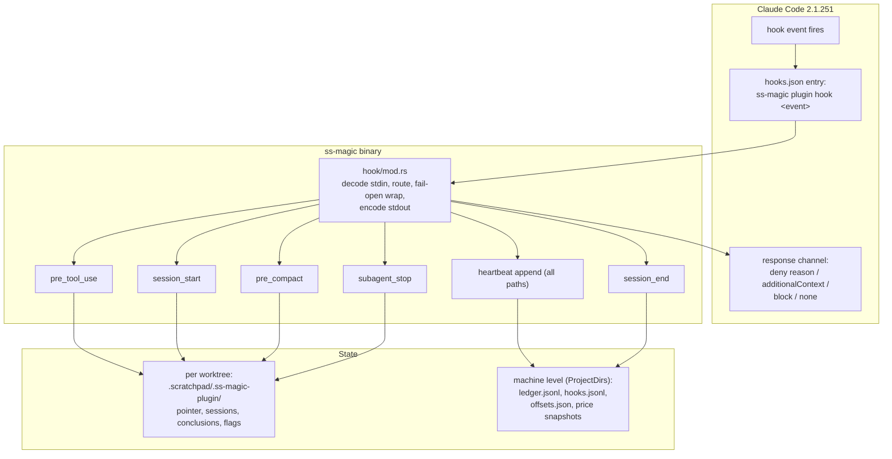
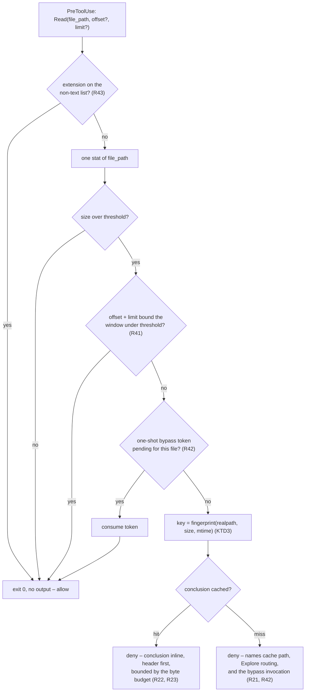
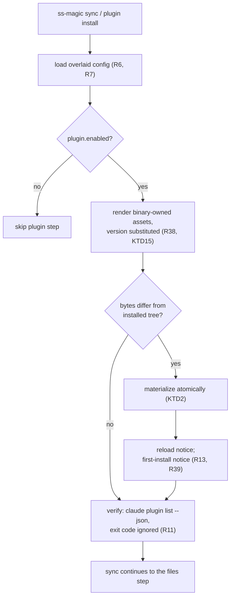
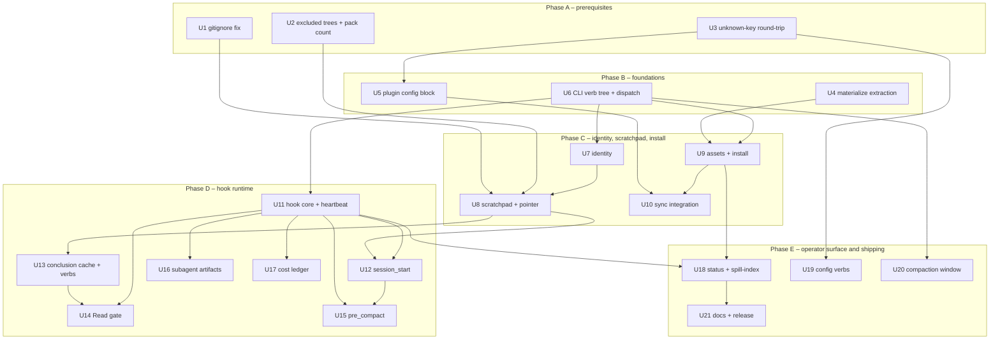

# ss-magic Claude Code Plugin - Plan

## Goal Capsule

**Objective.** Make `ss-magic` ship and install a Claude Code plugin named `ss-magic` that carries a durable per-worktree session scratchpad, a context page-fault gate on `Read`, a cost ledger, and subagent artifact enforcement — installed and refreshed from `ss-magic sync` whenever `magic.json` sets `plugin.enabled`.

**Product authority.** The requirements below are settled. Every design fork was closed by measurement against Claude Code 2.1.251 and the `ss-magic` crate at v0.9.0; the evidence is in [validation-evidence.md](./2026-08-29-001-ss-magic-plugin/validation-evidence.md). Six pieces of the original request were rewritten or dropped on that evidence, each with a named replacement — see [Key Decisions](#key-decisions).

**Open blockers.** None. Every question is ruled.

**Product Contract preservation.** Restructured, no scope change. R1-R34 keep their IDs and meaning; R8 and R9 were rewritten in place after planning research found each was two rules wearing one ID — R8 now separates the stdin-driven hook entry point from the argv-driven human verbs, and R9 splits the fail posture that differs between them. R35-R51 and AE19-AE36 are additions closing gaps planning found, not revisions of settled product scope.

## Companion documents

The plan stays standalone-readable; these carry the implementation detail it would otherwise bury. Each is in scope for review alongside this file.

- [architecture.md](./2026-08-29-001-ss-magic-plugin/architecture.md) — the full `src/plugin/` tree, module dependency rules, the three helper extractions that stop the plugin restating logic ss-magic already has, and the two prerequisite fixes that live outside `src/plugin/`.
- [hook-contract.md](./2026-08-29-001-ss-magic-plugin/hook-contract.md) — every shipped hook event with its channel, the measured 10,000-character cliff, the uncapped deny channel, the concurrent last-write-wins rewrite race, and the two validation tiers with opposite fail postures.
- [page-fault.md](./2026-08-29-001-ss-magic-plugin/page-fault.md) — what the harness already does to large output, why the Bash half is dropped, and the deny-with-inline-conclusion mechanism with its cache-key rules.
- [scratchpad-contract.md](./2026-08-29-001-ss-magic-plugin/scratchpad-contract.md) — identity derivation and its traps, the directory layout, the state files, and why the gitignore inside it arms a pre-existing bug.
- [plugin-assets.md](./2026-08-29-001-ss-magic-plugin/plugin-assets.md) — `plugin.json`, `hooks.json` and the installed layout verbatim, plus install verification.
- [skills.md](./2026-08-29-001-ss-magic-plugin/skills.md) — the three shipped skills, their frontmatter and body, and their invocation names.
- [cost-ledger.md](./2026-08-29-001-ss-magic-plugin/cost-ledger.md) — measured scan feasibility, attribution rules, and why the harness's own priced records come before any price table.

## Product Contract

### Summary

`ss-magic` gains a `plugin` block in `magic.json` and a `ss-magic plugin <verb>` subcommand family. When enabled, `ss-magic sync` installs a Claude Code plugin into `~/.claude/skills/ss-magic/` and keeps it current. The plugin is pure JSON and Markdown; every hook calls the `ss-magic` binary by name, so behavior versions with the tool's existing self-update. It gives each worktree a durable scratchpad that survives compaction, blocks oversized `Read` calls and answers them from a cached conclusion instead, records per-session cost, and stops a subagent from exiting without its contracted artifact.

### Problem Frame

Agent sessions lose work to autocompaction, and the loss is invisible until something has to be redone. Two measurements frame the cost. In one 34-hour session, cost tracked `requests × steady-state context` at ~440K tokens re-read per request, and 10.5% of tool results carried 69.5% of all tool-result text. In this session, 8.5% of results carried 52.4% — the same shape, a different magnitude.

Claude Code already solves most of the raw-output half: a generic persistence layer turns 200 KB of command output into 2,302 characters and a file path. What it does not solve is `Read`, which never spills at all — an 8,000-line read cost 60,066 cache-creation tokens against ~6,600 for any spilled Bash output. Nor does it solve continuity: when the window is cleared, nothing authored survives unless something wrote it down, and the 1,303 spill files already on this machine sit in 92 directories under unguessable names with no index.

ss-magic already owns the per-worktree contract, already runs on every worktree, and already self-updates. It is the natural carrier.

### Key Decisions

- **Install to personal scope, never project scope.** A project-scope plugin is gated on `hasTrustDialogAccepted`, and every Superset worktree is a new realpath — untrusted by construction, which is exactly ss-magic's domain. *Governs R10, R11.*
- **The plugin is a manifest; the binary is the behavior.** Hooks call `ss-magic` by bare name on PATH, so nothing is vendored and hook behavior rides the existing self-update. *Governs R12, R13.*
- **Drop the Bash page-fault half entirely.** The harness already spills every tool's output to a named file with a size label and preview, `BASH_MAX_OUTPUT_LENGTH` provably cannot raise the 30,000-char literal, and a rewrite would race the user's live rtk hook. Replaced by a read-only spill manifest. *Governs R20, R25.* (session-settled: user-directed — the user's own ideation named this as idea 3; measurement showed the mechanism already exists, so the manifest is what survives.)
- **The gate denies; it never rewrites.** `updatedInput` works but the transcript keeps the original tool call, so the model is never told its input changed — and rewrites race last-write-wins. `permissionDecisionReason` is uncapped, so the cached conclusion rides inline instead. *Governs R21, R22, R23.* (session-settled: user-directed — chosen over the brief's "deny and tell the model to range-read or grep": that leaves the model to re-derive, and its own note flagged the looping risk.)
- **Route denied reads to an Explore agent and cache the conclusion by file identity.** The saving is not the agent's tokens, it is every later request that never re-reads the payload. *Governs R21, R24.* (session-settled: user-directed.)
- **Key the scratchpad on `<repo>-<branch>` from git, never on the Superset workspace name.** This overturns a direction confirmed earlier in the session: the name is user-mutable, 31 of 36 live workspaces have `name != branch`, and five are named `main`, so a rename would silently orphan the scratchpad. *Governs R14, R15.*
- **No symlink registry.** ss-magic creates no symlink anywhere today — forward sync skips them and pack only classifies them — so a plain `current.json` pointer is used instead. *Governs R16.*
- **Fix two pre-existing defects first.** Reverse sync can append `*` to the main checkout's root `.gitignore`, and the sync/pack enumeration layer is gitignore-blind. The plugin's own state lives under `.scratchpad/`, so shipping without these turns a private scratchpad into a leak surface. *Governs R1, R2, R3.*
- **Every hook is advisory, never a security gate.** Three independent fail-open paths: a missing binary, a timed-out `PreToolUse` hook, and an envelope-level typo. The real secret boundary stays in the sync engine. *Governs R26.*
- **Ship the cost ledger on `SessionEnd`.** The "1.5 s rules out a full scan" premise was wrong by a factor of three — the worst session tree in a 2.61 GiB corpus scans in 0.87 s. *Governs R27, R28.*
- **Tune the compaction window with `autoCompactWindow`, not `CLAUDE_AUTOCOMPACT_PCT_OVERRIDE`.** The env var is a percent bound to a field named `testPctOverride`, absent from `/autocompact` and `/config`, and can only lower the window. *Governs R30, R31.*
- **Effort-tiering stays out of scope.** ~20% of the measured bill and config-only, but it is guidance rather than mechanism. (session-settled: user-directed — offered and declined.)

### Requirements

**Prerequisites — these land before the plugin writes a byte**

- R1. `ensure_path_ignored` must not re-anchor a covering rule at a broader scope than it had in the source tree; reuse a pattern only when the target has a `.gitignore` at the same relative directory, else fall through to an anchored literal.
- R2. The sync engine's enumeration layer must exclude `.superset/backups`, `.scratchpad` and `.git` as whole trees, in `walk_source` and in `pack`, including when a directory match is an ancestor of an excluded subtree.
- R3. `pack` must report the number of unique paths it archived, not the number of tar entries.

**Configuration**

- R4. `MagicConfig` must round-trip unknown top-level keys through every write path, so `init`, `migrate` and the edit-config menu no longer delete configuration they do not understand.
- R5. `magic.json` accepts a `plugin` object; `plugin.enabled` defaults to false when the key is absent.
- R6. For every non-`files` key, `magic.local.json` overrides the base value whole; an absent key inherits, and an explicit null means off.
- R7. Enabling or disabling the plugin per machine is done in the main checkout's `magic.local.json`, because a worktree's overlay is itself forward-synced.

**CLI surface**

- R8. `ss-magic plugin` provides one stdin-driven hook entry point, `plugin hook <event>`, for the events `session-start`, `pre-tool-use`, `pre-compact`, `subagent-stop` and `session-end`, plus argv-driven human verbs including `install`, `uninstall`, `status`, `cost`, `spill-index`, `scratchpad`, `conclude`, `conclusions`, `gc`, `bypass`, `expect-artifact`, `enable`, `disable`, `config` and `compact-window`.
- R9. `ss-magic plugin` never runs the auto-update gate and never opens the TUI; a hook verb prints nothing to stdout beyond its JSON envelope and exits 0 on any internal error, while a human verb reports failure on stderr and exits non-zero.
- R35. Hook and human entry points are separate commands – `plugin hook <event>` for stdin-driven hooks, named verbs for humans – and no command serves both roles; print and exit posture per R9.
- R36. A `status --json` verb reports the resolved slug, state directories, thresholds, and install state, so any agent can discover them from Bash with no injected context.
- R37. `enable`/`disable` (with `--local` targeting the main checkout's overlay per R7) and `config get`/`config set` edit the plugin configuration from the command line, writing through the unknown-key-preserving path of R4; `disable` stops the hooks from acting and leaves the installed tree in place, which only `uninstall` removes.

**Packaging and install**

- R10. The plugin installs to the user's `~/.claude/skills/ss-magic/`, resolved from the home directory and honouring `CLAUDE_CONFIG_DIR`.
- R11. Install verifies itself against the harness's own plugin listing and surfaces any reported errors and notes verbatim, ignoring the listing's exit code.
- R12. The installed tree contains only JSON and Markdown; hooks invoke `ss-magic` by bare name.
- R13. Install is content-addressed: identical bytes write nothing, and changed bytes print one notice naming the reload command.
- R38. No value from `magic.json` or `magic.local.json` reaches the rendered plugin manifest bytes; configuration only gates whether the binary-owned bytes are written.
- R39. The first install on a machine prints a loud notice that machine-global hooks are being installed and what they do; a subsequent identical install stays silent per R13.

**Session scratchpad**

- R14. The scratchpad directory name is derived from the git repository and branch alone, and is stable across sessions, days, and workspace renames.
- R15. A branch name that cannot be resolved falls back to a detached-HEAD form; outside a git repository the plugin does nothing.
- R16. The active session is recorded in a plain JSON pointer file, not a symlink.
- R17. `session-start` scaffolds any missing state file and never rewrites one that exists.
- R18. The scratchpad tree is gitignored, and its contents are never committed.
- R19. `SessionStart` injects operating guidance and the checklist pointer, staying within the channel's 10,000-character limit.
- R40. The scratchpad ignores itself through its own nested `.gitignore`, and no hook verb ever modifies a `.gitignore` outside `.scratchpad/`.

**The Read gate**

- R20. `ss-magic` ships no hook on `PreToolUse[Bash]` and emits no tool-input rewrite on any event.
- R21. A `Read` whose target exceeds the configured size is denied, and the denial names the cache path and instructs the model to route the work to an Explore agent.
- R22. When a conclusion exists for that file, the denial carries the conclusion inline, verbatim.
- R23. The inline conclusion is bounded by ss-magic's own byte budget, because the channel imposes none.
- R24. The cache key is derived from the file's identity, not from the read's offset or limit.
- R25. `ss-magic plugin spill-index` lists the harness's own spill files for the current worktree, read-only.
- R26. Every hook fails open: on timeout, malformed output, or a missing binary the session proceeds unchanged, and the plan documents the gate as a context measure rather than a boundary.
- R41. The gate allows a `Read` whose `offset` and `limit` bound the requested window under the threshold, even when the whole file exceeds it; the cache key stays as R24 defines it.
- R42. A one-shot `bypass` verb lets exactly the next gated `Read` of the named file through, and every deny reason names the bypass invocation verbatim.
- R43. A `Read` target that is not plain text – decided by a binary-owned extension list – is never gated, and neither is any path inside `.scratchpad/`.
- R44. A `conclude` verb takes the original file path, computes the cache key, stamps the mandatory conclusion header, and writes the entry atomically; a `conclusions` companion lists the cache and prints one entry.
- R45. The conclusion cache and the heartbeat log are each pruned best-effort to a bounded count and age after each write, and a `gc` verb removes orphaned entries on demand.
- R52. A read issued from inside a subagent is never gated, so the Explore agent the gate routes to can read the file the gate denied.
- R53. The gate resolves its size threshold, its inline byte budget, and its exemption list from the overlaid `plugin` configuration for the envelope's `cwd`, each with a binary-owned default and stated bounds.
- R54. A conclusion or a salvaged transcript is delivered to the model marked as ss-magic-generated text derived from a file, never as the file's own content, because a cached entry authored under one repository becomes model-visible in later sessions.

**Cost ledger**

- R27. `SessionEnd` appends one idempotent row per session id, scanning that session's own transcript tree, within the default hook timeout.
- R28. Cost is read from the harness's own priced records where present, falling back to a versioned price table snapshotted at ingest.
- R29. `ss-magic plugin cost` reports the ledger and can backfill a session whose `SessionEnd` never ran.
- R46. The authoritative cost ledger is machine-level, in ss-magic's existing OS cache root, and `cost` reports across all recorded worktree roots by default.

**Compaction window**

- R30. On explicit opt-in only, ss-magic writes an absolute auto-compact window into the repository's local, gitignored settings file, and adds the ignore rule in the same step.
- R31. ss-magic never overwrites a window the user already set, and never writes to the git-tracked settings file.

**Hook conduct and observability**

- R47. A hook verb owns stdout exclusively for its JSON envelope; every diagnostic goes to stderr, and color output is forced off.
- R48. The ledger append, the transcript-offsets store, the pointer file, and every block-once flag are written under an atomic claim, safe under concurrent duplicate invocation.
- R49. `PreCompact` is advisory on both triggers and never blocks a compaction.
- R50. Every hook verb appends one heartbeat line before exiting – including on the fail-open path, with its error class – recording the gate outcome for a `pre-tool-use` row, and `status` reports last-fired-at and the outcome counts per event.
- R55. Every hook verb resolves the overlaid `plugin` configuration for the envelope's `cwd` and no-ops – heartbeat only – when the plugin is not enabled for that repository, so an install made from one repo does not act in another.
- R56. A hook verb writes scratchpad state only after resolving the target path and confirming it stays inside the worktree, refusing to follow a symlink out of it.
- R57. No hook verb writes configuration or installs the plugin; `enable`, `disable`, `config set` and `install` are reached only from an explicit `ss-magic` invocation.
- R58. The machine-level store and the scratchpad's plugin directory are created with owner-only permissions.

**Subagent artifacts**

- R32. `SubagentStop` blocks a stop at most once when the subagent's contracted output file is missing or empty, the block names the file, and the handler returns immediately when the harness reports the stop hook is already active.
- R33. When a subagent's transcript ends with no reported result, its transcript is salvaged into a file marked as incomplete.
- R51. A dispatching agent declares a subagent's contracted output file with an `expect-artifact` verb before spawning it; with no declaration in effect, `SubagentStop` never blocks.

**Documentation and release**

- R34. `CLAUDE.md`, `README.md`, `CONTRIBUTING.md` and `.cursor/BUGBOT.md` describe the new behavior, and the crate version bumps a minor.

### Key Flows

- F1. **Enabling the plugin.** **Trigger:** a repo sets `plugin.enabled` and runs `ss-magic sync`. The plugin step runs after the configuration loads and before the empty-`files` early return, so a repo that syncs no files still gets the plugin. It renders the tree, compares to disk, writes only on change, verifies the install, and prints a reload notice if bytes changed. *Covers R5, R10, R11, R13.*
- F2. **A session starts.** **Trigger:** any of the five `SessionStart` sources. The hook resolves the slug from git, creates the session directory and pointer file, scaffolds missing state files, and injects guidance plus the checklist pointer. On the `compact` source this is what restores orientation after the window was cleared. *Covers R14, R16, R17, R19.*
- F3. **An oversized read is intercepted.** **Trigger:** the model calls `Read` on a file over the threshold. On a cache miss the call is denied with routing instructions; the model dispatches an Explore agent that reads the file in its own window and writes a conclusion. The model retries, and the second denial carries the conclusion inline. *Covers R21, R22, R24.*
- F4. **A session ends.** **Trigger:** `SessionEnd`. The hook walks that session's transcript tree, reads the harness's priced records where available, and appends one row keyed on session id. *Covers R27, R28.*

### Acceptance Examples

- AE1. `plugin.enabled` is true and `files` is empty. **Covers R5.** `ss-magic sync` still installs the plugin, then reports that there is nothing to sync.
- AE2. A `magic.json` written by a newer ss-magic contains a `plugin` block; the user runs `ss-magic init`. **Covers R4.** The `plugin` block survives the rewrite.
- AE3. Base `magic.json` sets `plugin.enabled` true; the main checkout's `magic.local.json` sets it false. **Covers R6, R7.** The plugin is not installed.
- AE4. The workspace is renamed in Superset. **Covers R14.** The scratchpad directory is unchanged.
- AE5. `HEAD` is detached. **Covers R15.** A detached-HEAD directory name is used and the session proceeds.
- AE6. The same `Read` is issued twice for a file with no cached conclusion and none is written in between. **Covers R21.** Both calls are denied with routing instructions; neither returns file content, and neither succeeds silently.
- AE7. A conclusion exists and the model re-issues the same `Read` with a different `limit`. **Covers R24.** The cached conclusion is still used.
- AE8. A cached conclusion exceeds ss-magic's byte budget. **Covers R23.** The denial carries a bounded excerpt and the conclusion's path rather than the whole file.
- AE9. The `ss-magic` binary is absent from PATH. **Covers R26.** Every hook is a no-op and the session behaves normally.
- AE10. The hook emits malformed JSON. **Covers R26.** The tool call proceeds unchanged.
- AE11. `SessionEnd` runs twice for one session id. **Covers R27.** The ledger holds one row.
- AE12. The CLI is killed and `SessionEnd` never runs. **Covers R29.** `ss-magic plugin cost` backfills the row from the transcript.
- AE13. A reverse sync matches a file under `.scratchpad/` whose nested `.gitignore` contains `*`. **Covers R1, R2.** The file is not pushed, and the main checkout's root `.gitignore` is unchanged.
- AE14. `pack` runs with a `**` pattern. **Covers R2, R3.** `.git/`, `.scratchpad/` and the backups tree are absent from the archive, and the reported count equals the number of unique paths.
- AE15. The user already set an auto-compact window. **Covers R31.** ss-magic leaves it alone.
- AE16. A subagent finishes without writing its contracted output file. **Covers R32.** Its stop is blocked once with the file named; if it stops again without the file, it is allowed to end.
- AE17. A subagent's transcript ends with no reported result. **Covers R33.** A salvage file is written and marked incomplete, and the parent reads that instead of re-running the agent.
- AE18. A pattern would match a path inside the scratchpad during forward sync. **Covers R18.** The scratchpad tree is skipped at enumeration, whatever the pattern's breadth.
- AE19. `ss-magic plugin hook pre-tool-use` is run from a terminal with no stdin envelope. **Covers R35.** It exits 0 with nothing on stdout; `ss-magic plugin scratchpad ensure` run outside a git repository exits non-zero with a stderr message.
- AE20. A dispatched Explore agent, which receives no `SessionStart` injection, runs `ss-magic plugin status --json` from Bash. **Covers R36.** It obtains the slug, the conclusions directory, and the gate threshold without any parent-prompt context.
- AE21. An agent inside a worktree runs `ss-magic plugin config set plugin.enabled false --local`. **Covers R37.** The main checkout's `magic.local.json` is updated, and every key the command does not understand survives.
- AE22. A repo's `magic.json` `plugin` block carries a command-shaped string value. **Covers R38.** The rendered `hooks.json` is byte-identical to the binary's embedded asset (version substitution aside); the hostile value appears nowhere in the installed tree.
- AE23. The plugin is installed for the first time on a machine, then installed again unchanged. **Covers R39.** The first run prints the machine-global-hooks notice; the second prints nothing.
- AE24. `session-start` fires in a repo whose root `.gitignore` is git-tracked. **Covers R40.** That file is byte-identical afterwards; the scratchpad is ignored solely by `.scratchpad/.gitignore`.
- AE25. The model issues `Read` with `offset` and `limit` bounding a window under the threshold, on a file over it. **Covers R41.** The read proceeds and returns file content.
- AE26. The model issues `Read` with a `limit` whose window still exceeds the threshold. **Covers R41.** The read is denied like an unbounded one.
- AE27. A deny reason names the bypass invocation; the model runs it, retries the same `Read`, then reads the file once more later. **Covers R42.** The first retry succeeds; the later read is denied again.
- AE28. The model issues `Read` on a PNG larger than the threshold. **Covers R43.** The read proceeds untouched; no conclusion is ever offered for it.
- AE29. An Explore agent runs `ss-magic plugin conclude <original-path>` with its findings, and the model retries the `Read`. **Covers R44.** The denial carries the conclusion inline, opening with the stamped header naming the original path.
- AE30. The conclusions directory holds more entries than the retention bound after an edit churns keys. **Covers R45.** The post-write prune removes the oldest beyond the bound without failing the gate, and `gc` deletes entries whose source file no longer matches any key.
- AE31. A Superset worktree is deleted after several sessions ran in it. **Covers R46.** `ss-magic plugin cost` still reports those sessions, grouped under the vanished root.
- AE32. A hook verb's code path produces a diagnostic while handling an event. **Covers R47.** The diagnostic arrives on stderr, uncolored, and stdout still parses as exactly one JSON envelope.
- AE33. Two `session-end` invocations for the same session id run concurrently. **Covers R48.** The ledger holds one row and the offsets store is not corrupted.
- AE34. An `auto` compaction fires while scratchpad state is stale; later the user runs `/compact` in the same situation. **Covers R49.** The auto compaction is never blocked and receives advisory context only; the manual one is blocked at most once and proceeds on retry.
- AE35. A hook verb fails internally and exits on the fail-open path. **Covers R50.** `hooks.jsonl` gains a row carrying the event and error class, and `ss-magic plugin status` shows the event's last-fired-at.
- AE36. No `expect-artifact` declaration exists and a subagent stops without writing anything. **Covers R51.** Its stop is not blocked; with a declaration naming a file the subagent never wrote, AE16's block-once behavior applies to that file.
- AE37. A session resumes after a compaction and reads an 88 KB `STATUS.md` in `.scratchpad/`. **Covers R43.** The read is allowed; the scratchpad is never gated.
- AE38. The Explore agent dispatched after a denial reads the oversized file it was sent to summarize. **Covers R52.** The read is allowed.
- AE39. A repository that never set `plugin.enabled` starts a session on a machine where another repository installed the plugin. **Covers R55.** Every hook no-ops and writes only a heartbeat row.
- AE40. `plugin.enabled` is set false while a session is already running. **Covers R55.** The next hook invocation no-ops, without waiting for a restart.
- AE41. A `manual` `/compact` fires. **Covers R49.** The hook writes its guidance and the compaction proceeds; nothing is blocked.
- AE42. A subagent stop is re-entered after a block. **Covers R32.** The handler returns immediately rather than blocking twice.
- AE43. `.scratchpad/` in a freshly opened worktree is a symlink pointing outside it. **Covers R56.** The hook refuses to write and records the refusal in its heartbeat row.
- AE44. A repository's own content instructs an agent to enable the plugin. **Covers R57.** No hook path can perform it; only an explicit user-run command can.

### Success Criteria

- A session resumed after compaction can re-orient from the scratchpad alone, without re-reading the work that produced it.
- The ledger makes the Read gate's value measurable per workload rather than assumed — this session's own profile inverts the one that motivated the feature, so the threshold must be tunable against evidence rather than fixed.
- `cargo test` stays green, and the three prerequisite defects gain regression tests, none of which exist today.

### Scope Boundaries

**Deferred for later**

- Effort tiering, and any change to session or subagent effort settings.
- `PostToolUse` subagent cost attribution as a fast path.
- A `Stop` hook, gated on re-entry, if the SessionStart and SubagentStop pair proves insufficient.
- `Grep` and `Glob` gating as active behavior — the matcher ships, but neither tool exists in this environment, so nothing may depend on it firing.
- Sharing or syncing the conclusion cache across worktrees.
- Heartbeat analytics beyond last-fired-at and error class.
- Any bypass policy richer than one-shot-per-invocation.

**Outside this work**

- Injecting `/compact` into a terminal. Hooks have no controlling terminal, terminal-send submits by default, and the goal is met declaratively by the window setting.
- A `FileChanged` hook and any direnv workstream.
- Any hook acting as a security or policy gate.
- Exact billing reconciliation. The ledger is a relative signal, not an invoice.
- Syncing the machine-level ledger between machines.
- Any harness-version compatibility shim beyond `status` drift reporting.

### Dependencies / Assumptions

- Claude Code 2.1.251. Every measurement is against that build; the plugin loading path, hook channels, and spill thresholds are not contractual across versions, and `ss-magic plugin status` exists so drift is detectable.
- The harness's transcript JSONL is append-only. Confirmed empirically over one session, not documented — the ledger therefore keeps a rotation guard and can fall back to a full rescan.
- Transcript completeness at `SessionEnd` is measured for normal exit only; kill, crash and logout are untested, which is why rows must be idempotent and backfillable.
- Hooks invoke `ss-magic` by bare name on PATH, so a PATH an attacker can prepend to yields execution on every gated call. This matches the repo's existing convention for `git` and `gh` and is not introduced here, but the plan depends on it and states it rather than leaving it implicit.
- Managed settings do not restrict the personal-scope plugin scan on the target machine. Where they do, the per-session plugin-directory flag is the documented fallback.

### Sources / Research

- [validation-evidence.md](./2026-08-29-001-ss-magic-plugin/validation-evidence.md) — the ruling record: 8 live probes, 86 adversarial refutations, and a final ruling pass, with commands and raw output for every claim.
- Existing insertion points: the forward-sync path and its pre-copy backup pass in `src/main.rs`, the configuration reader in `src/workspace/superset_files.rs`, the gitignore primitive in `src/git/gitignore.rs`, and the enumeration walk in `src/sync/apply.rs`.
- The koolman plugin plan and its reference spec, from which the packaging shape, the reserved machine-file directory, and the session-identity discipline port; its operator-checklist domain, Node runtime, and CI renderer do not.

---

## Planning Contract

### Key Technical Decisions

- KTD1. **One hook entry point with a centralized fail-open wrapper.** All five events route through `plugin hook <event>` into `src/plugin/hook/mod.rs`, which owns stdin decode, event dispatch, the JSON envelope on stdout, the fail-open catch, and the heartbeat append – per-event modules never print or exit themselves. This is what makes R9's hook posture and R47's stdout ownership structural rather than per-call-site care. *Governs R8, R9, R26, R35, R47, R50.*
- KTD2. **Generalize `copy_into_repo` into `src/workspace/materialize.rs`; do not fork it.** One atomic stage-then-materialize writer with recursion as a declared option; `superset_files::copy_into_repo` becomes a thin non-recursive caller and `plugin::install` the recursive second caller. Shape and options per [architecture.md](./2026-08-29-001-ss-magic-plugin/architecture.md). *Governs R10, R12, R13.*
- KTD3. **One 64-bit content fingerprint in `src/hashing.rs`.** Lift the private `reverse_sync::hash_file` (std `DefaultHasher`, non-cryptographic – the threat is accidental collision, not an adversary) and have reverse sync, the conclusion cache, and the ledger all call it; the cache key fingerprints `(realpath, size, mtime)` per R24. No new crate. *Governs R24, R44, R45.*
- KTD4. **Gate decision order: exemption, one stat, threshold, window, bypass, cache.** The under-threshold path is a single `stat` and exit before any git subprocess, because `pre-tool-use` fires on every `Read`; only an over-threshold file pays for window arithmetic, bypass lookup, and key hashing. *Governs R21, R41, R42, R43.*
- KTD5. **Atomic claims reuse `fd-lock`.** The claim scheme for R48 is the advisory `fd_lock::RwLock` pattern already shipped in `src/update/apply.rs` – one lock file per protected store, `try_write` for one-shot claims (block-once flags, bypass tokens) and blocking write for appends – never a second locking scheme. *Governs R42, R48, R49.*
- KTD6. **The heartbeat is one appended line, machine-level.** `hooks.jsonl` lives beside the ledger in the machine-level store, one row per hook invocation carrying event, timestamp, cwd, outcome, and error class on the fail-open path – machine-level because a hook can fire outside any git repo and the row must survive worktree deletion; `status` filters by cwd when inside a worktree. *Governs R50.*
- KTD7. **The machine-level store is ss-magic's existing `ProjectDirs` root.** Ledger, heartbeat, offsets store, and price-table snapshots live under the same OS app root `src/update/check.rs` already resolves, in a `plugin/` subdirectory; rows carry the resolved worktree root and branch as labels so `cost` groups cross-branch by default. *Governs R27, R29, R46, R50.*
- KTD8. **Unknown keys survive via a flattened extras map on `MagicConfig`, and every writer load-modifies-writes.** No writer builds a fresh config from parts again; `init`, `migrate`, the edit-config menu, and the new `config set`/`enable`/`disable` verbs all read the file, change the one key, and re-serialize. *Governs R4, R5, R6, R37.*
- KTD9. **Install path and verification per the companions.** Resolve `~/.claude` from the home directory honoring `CLAUDE_CONFIG_DIR` (never `ProjectDirs`), and verify with `claude plugin list --json`, matching id and enabled while ignoring the exit code – rules owned by [architecture.md](./2026-08-29-001-ss-magic-plugin/architecture.md) and [plugin-assets.md](./2026-08-29-001-ss-magic-plugin/plugin-assets.md). *Governs R10, R11.*
- KTD10. **The bypass is a one-shot claim file.** `plugin bypass <path>` records a token under the worktree's plugin state dir; the gate consumes it (KTD5 claim semantics) on the next matching over-threshold `Read` and every deny reason prints the exact invocation to run. *Governs R42.*
- KTD11. **The non-text exemption is a binary-owned extension list.** Images, PDFs, and notebooks are never gated; the list ships in the binary and configuration cannot shrink it, so no config state can make a binary unviewable. *Governs R43.*
- KTD12. **Identity derivation follows [scratchpad-contract.md](./2026-08-29-001-ss-magic-plugin/scratchpad-contract.md) exactly.** `symbolic-ref` with the `detached-<short-sha>` fallback, Rust slugify with the empty-result and non-ASCII guards, repo name from pack's origin derivation, and the hook resolving against the envelope's `cwd` field. *Governs R14, R15.*
- KTD13. **The enumeration filter generalizes `under_backups_dir` into an excluded-trees check applied at the walk layer.** `EXCLUDED_TREES = [".superset/backups", ".scratchpad", ".git"]`, enforced in `walk_source`, in reverse sync's candidate set, and in pack's recursive directory walk – the point-of-final-enumeration rule [architecture.md](./2026-08-29-001-ss-magic-plugin/architecture.md) records. *Governs R2, R18.*
- KTD14. **Conclusion-cache lifecycle mirrors `prune_old_backups`.** Bounded count and age, best-effort, warn-never-fail, run after each cache write; `gc` is the explicit on-demand sweep for orphaned keys. *Governs R45.*
- KTD15. **Assets are embedded per file with a single version substitution.** One `include_str!` per shipped file plus a manifest table (the `MAGIC_SH` precedent); rendering substitutes only the crate version into `plugin.json`, which is what makes R38 checkable as byte equality. *Governs R12, R13, R38.*

### High-Level Technical Design

**Hook dispatch topology.** The harness invokes the installed `hooks.json` entries, each of which runs `ss-magic plugin hook <event>` with the event payload on stdin. `src/plugin/hook/mod.rs` decodes the envelope, routes to the per-event module, and encodes exactly one JSON response on stdout (or nothing, for allow/no-op). A fail-open wrapper around the whole dispatch guarantees exit 0 with empty stdout on any internal error (R9, R26), and the heartbeat append runs on every path including that one (R50). Per-worktree state (pointer, session files, conclusions, one-shot flags) lives under `.scratchpad/.ss-magic-plugin/`; machine-level state (ledger, heartbeat, offsets, price snapshots) lives in the `ProjectDirs` store (KTD7).



**The gate's decision flow.** The order is fixed by KTD4 so the common case pays one `stat`. The two escape hatches close the capability regression: a bounded window passes the gate without touching the cache key (R41), and a one-shot bypass – named verbatim in every deny reason – covers the case where the model needs the raw head of a file whose window cannot be bounded (R42). Non-text targets exit before any size check (R43). Both deny branches carry routing: a miss names the cache path, the Explore dispatch instruction, and the bypass invocation; a hit carries the conclusion inline, bounded by ss-magic's byte budget (R22, R23).



**Install and refresh.** The plugin step runs inside `sync_core` after configuration loads and before the empty-`files` early return (F1). It reads the overlaid `plugin` block (R6, R7), and when enabled renders the embedded assets with only the version substituted (KTD15), compares bytes against the installed tree, materializes atomically through the shared writer only on change (KTD2, R13), verifies against the harness's own listing (R11), and prints the reload notice plus – on a machine's first install – the loud hooks notice (R39). `ss-magic plugin install` is the same path invoked directly.



### Assumptions

- Everything is calibrated to Claude Code 2.1.251. Hook channels, the 10,000-character cliff, spill thresholds, and plugin scanning are not contractual across versions; `ss-magic plugin status` (R36) is the drift detector.
- The `@skills-dir` load path – `~/.claude/skills/` scanned as a personal-scope plugin directory – is undocumented behavior, verified working on 2.1.251. The documented fallback if it disappears is the per-session plugin-directory flag (already in Dependencies / Assumptions).
- Transcript JSONL is append-only, confirmed empirically only; the offsets store is a rotation guard and a full rescan stays possible (existing plan assumption, load-bearing for U17).
- `ss-magic` resolves by bare name on PATH inside the harness's hook environment; a missing binary is non-fatal by measurement (R26).
- `fd-lock` advisory locking is valid on the target filesystems – the same assumption the self-update path already makes.
- The existing test suite (~367 tests at planning time) is the behavioral guard for the materialize extraction; the exact count drifts, the role does not.
- The `claude` CLI may be absent where install runs; verification then reports itself skipped rather than failing the install.

### Sequencing

Six hard constraints, then the phase order:

1. U1 and U2 (R1, R2, with regression tests that reproduce the live defects) land before any unit writes a byte into `.scratchpad/` – the tree's own `*` gitignore is the trigger that arms both bugs. U8 and everything after it depend on them.
2. U3 (R4) lands before any `magic.json` gains a `plugin` block – AE2 documents `init` deleting one live. U5, U10, and U19 depend on it.
3. U4, the materialize extraction, lands as its own commit with byte-identical behavior verified by the full existing suite before `plugin::install` (U9) becomes its second caller.
4. `should_run_update_gate` enumerates gated commands by inclusion; U6 keeps the plugin command out and pins that with a test in `src/tests/update_gate.rs` (R9).
5. `pre-tool-use` fires on every `Read`; U14's under-threshold path is one stat and an exit, before any git subprocess (KTD4).
6. U17 (the cost ledger) lands and ships ahead of U13 and U14, because the ledger is what makes the gate's value measurable per workload – this session's own profile inverts the one that motivated the feature, so the gate's default threshold is set from observed ledger data rather than chosen at implementation time.



---

## Output Structure

New files this plan creates (repo-relative; every `<module>.rs` pairs with a sibling `<module>/tests.rs` per the repo's test-layout convention):

```plaintext
assets/plugin/
├── plugin.json                          # version placeholder, substituted at render (KTD15)
├── hooks.json                           # verbatim per plugin-assets.md, args ["plugin","hook","<event>"]
└── skills/
    ├── scratchpad/SKILL.md
    ├── operator-checklist/SKILL.md
    ├── operator-checklist/reference.md
    └── setup/SKILL.md

src/hashing.rs                           # + src/hashing/tests.rs (KTD3)
src/workspace/materialize.rs             # + src/workspace/materialize/tests.rs (KTD2)

src/plugin/
├── mod.rs                               # verb dispatch; tests in src/plugin/tests.rs
├── tests.rs
├── config.rs                            # + config/tests.rs – plugin block + overlay precedence
├── assets.rs                            # + assets/tests.rs – embedded tree + manifest table
├── install.rs                           # + install/tests.rs – materialize/refresh/verify/uninstall
├── identity.rs                          # + identity/tests.rs – <repo>-<branch> slug
├── scratchpad.rs                        # + scratchpad/tests.rs – bootstrap, pointer, scaffolding
├── cache.rs                             # + cache/tests.rs – conclusion cache, prune, gc
├── ledger.rs                            # + ledger/tests.rs – transcript scan, attribution, backfill
├── heartbeat.rs                         # + heartbeat/tests.rs – hooks.jsonl append + read (G13 delta to architecture.md)
├── spill_index.rs                       # + spill_index/tests.rs – read-only spill manifest
├── status.rs                            # + status/tests.rs – status / status --json (G10/G13 delta to architecture.md)
└── hook/
    ├── mod.rs                           # tests in hook/tests.rs – decode/route/encode, fail-open
    ├── tests.rs
    ├── event.rs                         # + event/tests.rs – typed payloads and responses
    ├── pre_tool_use.rs                  # + pre_tool_use/tests.rs
    ├── session_start.rs                 # + session_start/tests.rs
    ├── pre_compact.rs                   # + pre_compact/tests.rs
    ├── subagent_stop.rs                 # + subagent_stop/tests.rs
    └── session_end.rs                   # + session_end/tests.rs

src/tests/plugin_flow.rs                 # end-to-end verb tests (crate-level)
```

Modified files: `src/cli.rs`, `src/main.rs`, `src/git/gitignore.rs`, `src/sync/apply.rs`, `src/sync/reverse_sync.rs`, `src/sync/mod.rs`, `src/pack.rs`, `src/workspace/superset_files.rs`, `src/workspace/mod.rs`, `src/tui/style.rs`, `src/tests/update_gate.rs`, `CLAUDE.md`, `README.md`, `CONTRIBUTING.md`, `CONCEPTS.md`, `.cursor/BUGBOT.md`, `Cargo.toml`, `Cargo.lock`.

---

## Implementation Units

### Unit Index

| U-ID | Title | Key files | Depends on |
|---|---|---|---|
| U1 | Covering-rule re-anchor fix | `src/git/gitignore.rs` | – |
| U2 | Excluded-trees enumeration filter + pack count | `src/sync/apply.rs`, `src/pack.rs`, `src/sync/reverse_sync.rs` | – |
| U3 | Unknown-key round-trip | `src/workspace/superset_files.rs` | – |
| U4 | Materialize extraction | `src/workspace/materialize.rs` | – |
| U5 | Plugin config block + overlay | `src/plugin/config.rs`, `src/workspace/superset_files.rs` | U3 |
| U6 | CLI verb tree + dispatch | `src/cli.rs`, `src/main.rs`, `src/plugin/mod.rs` | – |
| U7 | Identity slug | `src/plugin/identity.rs`, `src/pack.rs` | U6 |
| U8 | Scratchpad bootstrap + pointer | `src/plugin/scratchpad.rs` | U1, U2, U6, U7 |
| U9 | Assets + install/uninstall/verify | `src/plugin/assets.rs`, `src/plugin/install.rs`, `assets/plugin/` | U4, U6 |
| U10 | Sync integration | `src/main.rs` | U5, U9 |
| U11 | Hook runtime core + heartbeat | `src/plugin/hook/mod.rs`, `event.rs`, `src/plugin/heartbeat.rs`, `src/tui/style.rs` | U6 |
| U12 | session_start hook | `src/plugin/hook/session_start.rs` | U8, U11 |
| U13 | Conclusion cache + conclude/conclusions/gc | `src/hashing.rs`, `src/plugin/cache.rs` | U8 |
| U14 | Read gate + bypass | `src/plugin/hook/pre_tool_use.rs` | U11, U13 |
| U15 | pre_compact hook | `src/plugin/hook/pre_compact.rs` | U11, U12 |
| U16 | Subagent artifacts: expect-artifact, block, salvage | `src/plugin/hook/subagent_stop.rs` | U8, U11 |
| U17 | Cost ledger + session_end + cost | `src/plugin/ledger.rs`, `src/plugin/hook/session_end.rs` | U11, U13 |
| U18 | status / status --json + spill-index | `src/plugin/status.rs`, `src/plugin/spill_index.rs` | U7, U9, U11 |
| U19 | Config verbs | `src/plugin/config.rs`, `src/plugin/mod.rs` | U3, U5, U6 |
| U20 | Compaction window opt-in | `src/plugin/mod.rs` | U6 |
| U21 | Docs, BUGBOT sync, version bump | `CLAUDE.md`, `README.md`, `CONTRIBUTING.md`, `.cursor/BUGBOT.md` | all |

**Phase A – prerequisites.** Nothing after this phase may land first; see Sequencing constraints 1 and 2.

### U1. Covering-rule re-anchor fix

- **Goal:** `ensure_path_ignored` stops lifting a nested covering pattern to a broader scope, closing the `*`-to-root-gitignore leak before `.scratchpad/.gitignore` arms it.
- **Requirements:** R1. AE13 (with U2).
- **Dependencies:** none.
- **Files:** `src/git/gitignore.rs`, `src/git/gitignore/tests.rs`.
- **Approach:**
  1. Make `find_covering_rule` report which `.gitignore` file owned the matched rule (`git check-ignore -v` already names it).
  2. In `ensure_path_ignored`, reuse the covering pattern only when the target root has a `.gitignore` at the same relative directory as the owning file in the rule-source root; otherwise fall through to `anchored_literal` (R1).
  3. Regression test reproducing the live three-command defect: source tree with `.scratchpad/.gitignore` containing `*`, reverse-sync-shaped call, assert the target root `.gitignore` never gains `*`.
- **Patterns to follow:** the existing git-tolerant degradation in `ensure_path_ignored` (a git failure reads as "not ignored"); tests use `tempfile` + shell `git init` per `src/git/gitignore/tests.rs`.
- **Test scenarios:**
  - Covers AE13 (gitignore half). Nested `*` gitignore in the source, no same-relative-dir gitignore in the target: the appended rule is an anchored literal at the closest existing target `.gitignore`, and the target root file carries no `*`.
  - Target has a `.gitignore` at the same relative directory: the covering pattern is reused there, unchanged behavior.
  - Non-git target tempdir: degrades to the literal append, as today.
- **Verification:** full suite green; the new regression test fails on the pre-fix code.
- **Execution note:** prerequisite fix – commit separately with its regression test before any plugin code, so the fix is bisectable and provably precedes the first `.scratchpad/` write.

### U2. Excluded-trees enumeration filter and pack count

- **Goal:** the sync and pack enumeration layers exclude `.superset/backups`, `.scratchpad`, and `.git` as whole trees at the point of final enumeration, and pack reports unique paths.
- **Requirements:** R2, R3, R18. AE13, AE14, AE18.
- **Dependencies:** none.
- **Files:** `src/sync/mod.rs`, `src/sync/apply.rs`, `src/sync/apply/tests.rs`, `src/sync/reverse_sync.rs`, `src/sync/reverse_sync/tests.rs`, `src/pack.rs`, `src/pack/tests.rs`.
- **Approach:**
  1. Generalize `under_backups_dir` into an excluded-trees check over KTD13's list, hosted in `src/sync/mod.rs`; keep `under_backups_dir` as a thin caller where backup-only semantics are still meant (e.g. `backups_root_for`).
  2. Apply it in `walk_source` (`src/sync/apply.rs`), in reverse sync's candidate enumeration, and generalize `append_dir_excluding_backups` so a directory match that is an ancestor of any excluded subtree prunes it during the recursive walk (KTD13).
  3. Change `write_archive` to count unique file paths added rather than tar entries, feeding `PackEvent::Done { count }` (R3).
- **Patterns to follow:** the existing `append_dir_excluding_backups` prune shape in `src/pack.rs`; the secret-safety rule in `CLAUDE.md` ("enforce the filter at the point of final enumeration") – this unit is that rule applied to two more trees.
- **Test scenarios:**
  - Covers AE14. Pack with a `**` pattern over a tree containing `.git/`, `.scratchpad/`, and `.superset/backups/`: none appear in the archive, and the reported count equals the number of unique paths.
  - Covers AE18. Forward-sync pattern matching a path inside `.scratchpad/`: `walk_source` never yields it.
  - Covers AE13 (enumeration half). Reverse-sync candidate set over a broad pattern: no `.scratchpad/` file is offered.
  - A directory match that is an ancestor of `.scratchpad` (a bare `.` or broad pattern): the walk prunes the subtree, not just the flat list.
- **Verification:** full suite green; the pack directory-match shape is tested, not just the leaf shape.
- **Execution note:** prerequisite fix – same posture as U1: own commit, regression tests that fail pre-fix, landed before Phase C.

### U3. Unknown-key round-trip for MagicConfig

- **Goal:** every `magic.json` writer preserves top-level keys it does not understand.
- **Requirements:** R4. AE2.
- **Dependencies:** none.
- **Files:** `src/workspace/superset_files.rs`, `src/workspace/superset_files/tests.rs`.
- **Approach:** give `MagicConfig` a flattened extras map (KTD8) and convert `write_magic_json` and the init/migrate/edit-config write paths to load-modify-write instead of rebuilding from a `files` list.
- **Patterns to follow:** the existing serde derives and `read_json` error shaping in `src/workspace/superset_files.rs`.
- **Test scenarios:**
  - Covers AE2. A `magic.json` with a `plugin` block and an unrecognized future key survives `ss-magic init` byte-content-wise (keys intact, `files` updated).
  - `migrate` and the edit-config write path preserve the same unknown keys.
  - A file with only known keys round-trips to the same pretty-printed shape as today.
- **Verification:** full suite green; the AE2 test fails on pre-fix code.

**Phase B – foundations.**

### U4. Materialize extraction

- **Goal:** one atomic stage-to-destination writer shared by `.superset/` sync and the plugin install.
- **Requirements:** KTD2 (enables R10, R12, R13).
- **Dependencies:** none (lands before U9 per Sequencing constraint 3).
- **Files:** `src/workspace/materialize.rs`, `src/workspace/materialize/tests.rs`, `src/workspace/superset_files.rs`, `src/workspace/mod.rs`.
- **Approach:** extract `copy_into_repo`'s core into `materialize` with the options [architecture.md](./2026-08-29-001-ss-magic-plugin/architecture.md) specifies (recursion, exec suffixes, write-last ordering, delete set); `copy_into_repo` becomes a thin non-recursive caller with unchanged semantics, including `config.json` written last and `*.sh` chmod.
- **Patterns to follow:** `copy_into_repo` in `src/workspace/superset_files.rs` (the behavior being preserved); `NamedTempFile`-then-persist atomicity as in `src/pack.rs::write_archive`.
- **Test scenarios:**
  - Existing `copy_into_repo` behavior is byte-identical: overwrite, chmod, delete set, write-last ordering all covered by targeted tests plus the untouched existing suite.
  - Recursive mode materializes a nested tree without the silent-drop defect (a nested directory arrives complete).
  - A failed stage never leaves a partially-written destination.
- **Verification:** the full existing suite passes unmodified before any second caller exists.
- **Execution note:** land as its own commit with byte-identical behavior verified by the whole suite before U9 makes `plugin::install` the second caller (Sequencing constraint 3). Do not batch it with plugin code.

### U5. Plugin config block and overlay precedence

- **Goal:** `magic.json` carries a typed `plugin` block, overlaid per the local-wins rules.
- **Requirements:** R5, R6, R7.
- **Dependencies:** U3.
- **Files:** `src/plugin/config.rs`, `src/plugin/config/tests.rs`, `src/workspace/superset_files.rs`, `src/workspace/superset_files/tests.rs`.
- **Approach:** extend `load_overlaid` so every non-`files` key overlays whole-value with explicit-null-means-off (R6); `src/plugin/config.rs` owns the typed interpretation of the `plugin` key, defaulting `enabled` to false when absent (R5), and resolves the per-machine toggle against the main checkout's overlay (R7).
- **Patterns to follow:** `load_overlaid`'s existing base-then-local composition in `src/workspace/superset_files.rs`.
- **Test scenarios:**
  - Covers AE3. Base sets `enabled` true, main checkout local sets false: resolved config is disabled.
  - Absent key inherits the base; explicit null disables.
  - A missing `plugin` block resolves to disabled with no error.
- **Verification:** overlay semantics covered for present/absent/null on both sides.

### U6. CLI verb tree, dispatch, and update-gate exclusion

- **Goal:** `ss-magic plugin …` parses into the split hook/human verb tree and dispatches without the auto-update gate or TUI.
- **Requirements:** R8, R9, R35.
- **Dependencies:** none.
- **Files:** `src/cli.rs`, `src/cli/tests.rs`, `src/main.rs`, `src/plugin/mod.rs`, `src/plugin/tests.rs`, `src/tests/update_gate.rs`.
- **Approach:**
  1. `cli::parse` recognizes `plugin` as the first token and carries the remaining argv apart from the `Copy` `Command` enum, following the `Parsed::Init` precedent.
  2. `src/plugin/mod.rs` owns the second-level parse: `hook <event>` versus human verbs (R8, R35); unknown plugin verbs error like `Parsed::Error` does today – for human invocations only, per R9.
  3. `main.rs` dispatches plugin invocations outside `should_run_update_gate`'s inclusion list; pin that with a test (Sequencing constraint 4).
- **Patterns to follow:** the hand-rolled parser and `Parsed` variants in `src/cli.rs`; `src/tests/update_gate.rs` for the gate-exclusion test.
- **Test scenarios:**
  - `plugin hook pre-tool-use` and each human verb parse to the intended dispatch; an unknown verb is a loud error.
  - The plugin command never satisfies `should_run_update_gate` (inclusion-list test).
  - `plugin` invocations never construct the TUI menu path.
- **Verification:** parse layer stays pure and process-free, tested without spawning.

**Phase C – identity, scratchpad, install.**

### U7. Identity slug

- **Goal:** a deterministic `<repo>-<branch>` slug from git alone.
- **Requirements:** R14, R15. AE4, AE5.
- **Dependencies:** U6.
- **Files:** `src/plugin/identity.rs`, `src/plugin/identity/tests.rs`, `src/pack.rs` (expose the origin-derived repo-name helper to the crate).
- **Approach:** implement KTD12's derivation: repo name reuses pack's origin normalization with the main-checkout-basename fallback; branch via `symbolic-ref` with `detached-<short-sha>` on exit 1 and full no-op outside a repo (R15); Rust slugify with the `/`, empty-result, and NFD guards.
- **Patterns to follow:** `pack::archive_file_name`'s origin normalization; `src/git/mod.rs` probe helpers for the git shell-outs.
- **Test scenarios:**
  - Covers AE4. The slug is a pure function of (origin, branch); nothing Superset-derived enters it.
  - Covers AE5. Detached HEAD yields `detached-<short-sha>` and proceeds.
  - Slugify: `"---"` falls through to the next identity source; non-ASCII names strip to a valid slug; a `fork/branch` name sanitizes its `/`; results truncate to 40.
  - Outside a git repository: the identity probe reports "do nothing".
- **Verification:** slug rules unit-tested pure; git-dependent paths tested with `tempfile` worktrees.

### U8. Scratchpad bootstrap and pointer

- **Goal:** the per-worktree scratchpad tree exists, self-ignored, with a claimed pointer file and never-rewritten state files.
- **Requirements:** R16, R17, R40, R48 (pointer claim). AE19 (human-verb half), AE24.
- **Dependencies:** U1, U2, U6, U7.
- **Files:** `src/plugin/scratchpad.rs`, `src/plugin/scratchpad/tests.rs`, `src/plugin/mod.rs` (the `scratchpad ensure` verb).
- **Approach:** create the [scratchpad-contract.md](./2026-08-29-001-ss-magic-plugin/scratchpad-contract.md) layout: nested self-ignoring `.gitignore` and README, session dir from U7's slug, the five state files scaffolded only when absent (R17), and `current.json` written under a KTD5 claim (R16, R48). No call touches any `.gitignore` outside `.scratchpad/` (R40). `plugin scratchpad ensure` is the loud argv-driven entry (R9, R35).
- **Patterns to follow:** `bootstrap_magic_local_json` in `src/workspace/superset_files.rs` for scaffold-if-absent; the `fd-lock` usage in `src/update/apply.rs` for the claim.
- **Test scenarios:**
  - Covers AE24. Running ensure in a repo with a tracked root `.gitignore` leaves that file byte-identical; the tree is ignored by its own nested file.
  - Covers AE19 (human half). `scratchpad ensure` outside a git repository exits non-zero with a stderr message.
  - R17: an existing `STATUS.md` with content survives a re-run untouched; a missing sibling is scaffolded.
  - Two concurrent ensures produce one coherent `current.json`.
- **Verification:** the scratchpad tree is invisible to sync and pack (relies on U2's tests staying green with the tree present).

### U9. Assets, install, uninstall, verify

- **Goal:** `ss-magic plugin install` materializes the personal-scope plugin tree idempotently and verifies it against the harness.
- **Requirements:** R10, R11, R12, R13, R38, R39. AE22, AE23.
- **Dependencies:** U4, U6.
- **Files:** `assets/plugin/` (all shipped files, verbatim from [plugin-assets.md](./2026-08-29-001-ss-magic-plugin/plugin-assets.md) with hook args `["plugin", "hook", "<event>"]`), `src/plugin/assets.rs`, `src/plugin/assets/tests.rs`, `src/plugin/install.rs`, `src/plugin/install/tests.rs`.
- **Approach:**
  1. `assets.rs` embeds each shipped file with a manifest table (KTD15); rendering substitutes only the crate version into `plugin.json`.
  2. `install.rs` resolves the target per KTD9, stages the rendered tree, compares bytes, materializes through U4's writer only on change (R13), prints the reload notice on change and the loud first-install notice when the target did not previously exist (R39).
  3. Verification shells `claude plugin list --json` per KTD9, surfacing `errors[]`/`notes[]` verbatim; a missing `claude` CLI reports the check skipped.
  4. `uninstall` removes the installed tree and reports what it removed.
- **Patterns to follow:** the `MAGIC_SH` `include_str!` precedent in `src/workspace/superset_files.rs`; `git_optional`-style tolerant subprocess handling in `src/git/mod.rs` for the verify call.
- **Test scenarios:**
  - Covers AE22. Render with a hostile `plugin` block in scope: rendered `hooks.json` equals the embedded asset bytes; the hostile string appears nowhere under the install root.
  - Covers AE23. First install into an empty target prints the notice; an identical re-install writes nothing and prints nothing.
  - R10: `CLAUDE_CONFIG_DIR` overrides the home-derived target.
  - A changed asset rewrites only the changed bytes and prints the reload notice.
- **Verification:** installed tree contains only JSON and Markdown (R12), assertable over the manifest table.

### U10. Sync integration

- **Goal:** `ss-magic sync` runs the plugin step for an enabled repo, before the empty-`files` early return.
- **Requirements:** R5 (trigger), F1. AE1, AE3.
- **Dependencies:** U5, U9.
- **Files:** `src/main.rs`, `src/tests/plugin_flow.rs`.
- **Approach:** insert the plugin step into `sync_core` after configuration load and before the empty-`files` early return (F1); it resolves U5's overlaid config and calls U9's install path; disabled config skips silently.
- **Patterns to follow:** `sync_core`'s existing resolve-probe-load-guard-work order in `src/main.rs`.
- **Test scenarios:**
  - Covers AE1. Enabled plugin, empty `files`: install runs, then the nothing-to-sync report follows.
  - Covers AE3. Base-enabled, main-local-disabled: no install occurs.
  - Plugin step failure does not abort the file sync (advisory posture, R26's spirit at install time – report on stderr, continue).
- **Verification:** end-to-end flow test in `src/tests/plugin_flow.rs` drives a real tempdir worktree through sync with a fake install target via `CLAUDE_CONFIG_DIR`.

**Phase D – hook runtime.**

### U11. Hook runtime core and heartbeat

- **Goal:** one stdin-to-stdout hook pipeline with structural fail-open, stdout ownership, and an always-written heartbeat.
- **Requirements:** R9 (hook half), R26, R47, R50. AE9 (posture), AE10, AE19 (hook half), AE32, AE35.
- **Dependencies:** U6.
- **Files:** `src/plugin/hook/mod.rs`, `src/plugin/hook/tests.rs`, `src/plugin/hook/event.rs`, `src/plugin/hook/event/tests.rs`, `src/plugin/heartbeat.rs`, `src/plugin/heartbeat/tests.rs`, `src/tui/style.rs`.
- **Approach:**
  1. `event.rs` types the five envelopes and responses per [hook-contract.md](./2026-08-29-001-ss-magic-plugin/hook-contract.md) – one place for the wire format, including the `SubagentStop` top-level block shape.
  2. `hook/mod.rs` implements KTD1: decode, route, encode; any internal error is caught, heartbeat-recorded with its class, and exits 0 with empty stdout (R9, R26, R50).
  3. Diagnostics go to stderr only; style init runs forced-no-color for hook verbs (R47).
  4. `heartbeat.rs` appends the KTD6 row to the machine-level `hooks.jsonl` under a KTD5 claim, best-effort – a heartbeat failure never fails the hook.
- **Patterns to follow:** `tui/style.rs`'s `OnceLock` color decision (add the forced-off entry); `src/update/apply.rs` for the lock.
- **Test scenarios:**
  - Covers AE10. Malformed stdin: exit 0, empty stdout, heartbeat row with error class.
  - Covers AE19 (hook half). No stdin at all: exit 0, silent.
  - Covers AE32. A routed handler that emits a diagnostic: stderr carries it uncolored, stdout parses as exactly one envelope.
  - Covers AE35. An internally-failing handler leaves a heartbeat row naming event and error class.
  - A well-formed envelope routes to the right per-event module.
- **Verification:** no per-event module can write stdout directly – the encode seam is the only writer, checked by the module's visibility structure and review.

### U12. session_start hook

- **Goal:** every session start scaffolds state and injects guidance within the channel limit.
- **Requirements:** R17 (via U8), R19, F2.
- **Dependencies:** U8, U11.
- **Files:** `src/plugin/hook/session_start.rs`, `src/plugin/hook/session_start/tests.rs`.
- **Approach:** resolve identity from the envelope's `cwd` (KTD12), run U8's ensure logic (never rewriting existing files), write the pointer with the envelope's session id, and emit `additionalContext` under 10,000 characters carrying the operating guidance and checklist pointer (R19); emit the version-drift `systemMessage` self-check per [plugin-assets.md](./2026-08-29-001-ss-magic-plugin/plugin-assets.md). Outside a git repo: heartbeat, then nothing (R15).
- **Patterns to follow:** U8's scratchpad module – this hook is a thin caller, per the architecture rule that `hook/` never re-implements state logic.
- **Test scenarios:**
  - The injected context stays under 10,000 characters with a realistic slug and paths.
  - The `compact` source re-injects guidance against an already-populated scratchpad without touching its files.
  - Outside a git repository the hook emits nothing and exits 0.
- **Verification:** all five sources (`startup`, `resume`, `clear`, `compact`, `fork`) route through one handler.

### U13. Conclusion cache, hashing, and the conclude/conclusions/gc verbs

- **Goal:** the write side of the conclusion cache is binary-owned: keyed, headered, atomic, and lifecycle-managed.
- **Requirements:** R44, R45, KTD3. AE29 (write half), AE30.
- **Dependencies:** U8 (and it lands the `src/hashing.rs` lift used later by U17).
- **Files:** `src/hashing.rs`, `src/hashing/tests.rs`, `src/sync/reverse_sync.rs` (delegate `hash_file`), `src/plugin/cache.rs`, `src/plugin/cache/tests.rs`, `src/plugin/mod.rs` (verbs).
- **Approach:**
  1. Lift `reverse_sync::hash_file` into `src/hashing.rs`; reverse sync delegates (KTD3).
  2. `cache.rs` owns key derivation over `(realpath, size, mtime)` (R24), entry read/write with the mandatory header stamped from the original path and size, and atomic write via temp-then-rename.
  3. `conclude <path>` reads the conclusion body (stdin or a file argument), computes the key, stamps, writes; `conclusions` lists entries and prints one (R44).
  4. Post-write prune per KTD14; `gc` sweeps entries whose key no longer matches any current file identity (R45).
- **Patterns to follow:** `prune_old_backups` in `src/sync/reverse_sync.rs` for the bounded, best-effort, warn-never-fail lifecycle; `write_archive`'s temp-file persistence in `src/pack.rs`.
- **Test scenarios:**
  - Covers AE29 (write half). `conclude` on a fixture file produces an entry whose header names the original path and whose key matches the gate's derivation.
  - Covers AE30. Entries beyond the retention bound are pruned oldest-first without error; `gc` removes an entry orphaned by an edit and keeps a live one.
  - `hash_file` delegation: reverse sync's baseline hashing behavior is unchanged (existing tests stay green).
  - A concurrent double-`conclude` for one key leaves one valid entry.
- **Verification:** the cache module knows nothing about hooks (dependency direction per [architecture.md](./2026-08-29-001-ss-magic-plugin/architecture.md)).

### U14. The Read gate

- **Goal:** oversized main-thread reads are denied with routing or the cached conclusion, and no capability is ever removed.
- **Requirements:** R20, R21, R22, R23, R24, R41, R42, R43. AE6, AE7, AE8, AE25, AE26, AE27, AE28, AE29 (deny half).
- **Dependencies:** U11, U13.
- **Files:** `src/plugin/hook/pre_tool_use.rs`, `src/plugin/hook/pre_tool_use/tests.rs`, `src/plugin/mod.rs` (the `bypass` verb).
- **Approach:**
  1. Implement KTD4's decision order exactly; the under-threshold exit performs one `stat` and no subprocess (Sequencing constraint 5).
  2. Non-text exemption per KTD11 (R43); window arithmetic per R41; bypass consumption per KTD10 (R42).
  3. Deny reasons: the miss branch names the cache path, the Explore routing instruction, and the verbatim bypass invocation (R21, R42); the hit branch carries the header-first conclusion inline, truncated to ss-magic's byte budget with the entry's path appended when truncated (R22, R23).
  4. `Grep`/`Glob` matcher input is accepted and configured but inert-by-default, per the Scope Boundaries entry.
  5. The hook emits no `updatedInput` on any event and no `PreToolUse[Bash]` handler exists (R20) – enforced by the shipped `hooks.json` (U9) and by the response types (U11) offering no rewrite channel.
- **Patterns to follow:** [page-fault.md](./2026-08-29-001-ss-magic-plugin/page-fault.md) is the mechanism authority – implement against its flowchart and cache-key rules rather than re-deriving.
- **Test scenarios:**
  - Covers AE6. Two misses with no conclusion between them: both denials carry routing, neither returns content.
  - Covers AE7. Conclusion present, re-read with a different `limit` still over threshold: same cached conclusion served.
  - Covers AE8. Oversized conclusion: bounded excerpt plus entry path, never the whole file.
  - Covers AE25. `offset`+`limit` window under threshold on an over-threshold file: allow.
  - Covers AE26. Window still over threshold: deny.
  - Covers AE27. Bypass token consumed exactly once; the following read is gated again.
  - Covers AE28. Over-threshold `.png`: allow, no cache interaction.
  - Covers AE29 (deny half). After `conclude`, the denial embeds the stamped header verbatim.
  - Under-threshold file: exit 0 with empty stdout and no git subprocess spawned.
- **Verification:** the gate's full decision table is covered by envelope-driven tests that never require a live harness.

### U15. pre_compact hook

- **Goal:** compaction is advised on `auto` and refused at most once on `manual`, never wedging a session.
- **Requirements:** R49. AE34.
- **Dependencies:** U11, U12.
- **Files:** `src/plugin/hook/pre_compact.rs`, `src/plugin/hook/pre_compact/tests.rs`.
- **Approach:** on `auto`, emit only `additionalContext` nudging a scratchpad reconcile (R49); on `manual`, when the scratchpad state looks stale, block once via a KTD5 one-shot flag keyed to the session, and always allow the retry.
- **Patterns to follow:** U11's response types; the claim helper from U8.
- **Test scenarios:**
  - Covers AE34. `auto` trigger never produces a block decision; `manual` with a stale scratchpad blocks once, and the identical second envelope passes.
  - `manual` with fresh state passes immediately.
- **Verification:** no path can block twice for one session (flag persistence covered under concurrent duplicate invocation).

### U16. Subagent artifacts: expect-artifact, block-once, salvage

- **Goal:** a declared subagent artifact is enforced at stop, and a resultless transcript is salvaged.
- **Requirements:** R32, R33, R51. AE16, AE17, AE36.
- **Dependencies:** U8, U11.
- **Files:** `src/plugin/hook/subagent_stop.rs`, `src/plugin/hook/subagent_stop/tests.rs`, `src/plugin/mod.rs` (the `expect-artifact` verb).
- **Approach:**
  1. `expect-artifact <path>` records a pending expectation under the worktree's plugin state dir (directional: a small JSON record per declaration; the dispatching agent calls it before `Task`, per R51).
  2. The hook checks pending expectations: a missing or empty declared file blocks once – a KTD5 one-shot flag keyed to `(agent_id, expectation)` – naming the file (R32); a satisfied expectation is consumed; with none pending, never block (R51).
  3. When the payload's `last_assistant_message` reports no result, salvage `agent_transcript_path` into a file marked incomplete under the session's research directory (R33), per the payload shape in [hook-contract.md](./2026-08-29-001-ss-magic-plugin/hook-contract.md).
- **Patterns to follow:** U11's typed `SubagentStop` response (top-level block shape); U8's claim helper.
- **Test scenarios:**
  - Covers AE16. Declared file absent: first stop blocked with the file named; second stop allowed.
  - Covers AE17. Resultless transcript: a salvage file exists, marked incomplete.
  - Covers AE36. No declaration: a subagent writing nothing stops unblocked.
  - A declaration satisfied before the stop: no block, expectation consumed.
- **Verification:** enforcement runs entirely from the envelope plus on-disk state – no guessing of output locations.

### U17. Cost ledger, session_end, and the cost verb

- **Goal:** every ended session leaves one idempotent machine-level ledger row, and `cost` reports and backfills across roots.
- **Requirements:** R27, R28, R29, R46, R48. AE11, AE12, AE31, AE33.
- **Dependencies:** U11 (and U13's `src/hashing.rs` if fingerprinting is reused for row identity).
- **Files:** `src/plugin/ledger.rs`, `src/plugin/ledger/tests.rs`, `src/plugin/hook/session_end.rs`, `src/plugin/hook/session_end/tests.rs`, `src/plugin/mod.rs` (the `cost` verb).
- **Approach:**
  1. `ledger.rs` scans the ending session's own transcript tree (main file plus `subagents/`), reads the harness's priced `cost-state` records first and falls back to the versioned, ingest-snapshotted price table using the nested cache-TTL fields – attribution and pricing rules owned by [cost-ledger.md](./2026-08-29-001-ss-magic-plugin/cost-ledger.md).
  2. Rows are keyed on session id, labeled with resolved worktree root and branch, appended to the KTD7 store under a KTD5 claim (R27, R46, R48); the offsets store guards rotation and lives beside it.
  3. `session_end.rs` runs the scan inline within the default budget with no explicit `timeout`, failing open and silent (R26).
  4. `cost` reports multi-root by default, presents itself as a relative signal, and backfills a named session id or transcript path (R29).
- **Patterns to follow:** the incremental-tail and rotation-guard rules in [cost-ledger.md](./2026-08-29-001-ss-magic-plugin/cost-ledger.md); `src/update/check.rs` for the `ProjectDirs` resolution.
- **Test scenarios:**
  - Covers AE11. Two sequential `session-end` runs for one id: one row.
  - Covers AE33. Two concurrent runs for one id: one row, offsets intact.
  - Covers AE12. No `session-end` ever ran: `cost --backfill` writes the row from a fixture transcript.
  - Covers AE31. Rows for a since-deleted worktree root still report.
  - A fixture with `ephemeral_1h`/`ephemeral_5m` cache fields prices them distinctly (the 13% understatement trap).
  - A rotated transcript (size below stored offset) triggers a full rescan, not a corrupt row.
- **Verification:** the scan of the largest fixture tree stays well inside the 1500 ms budget on CI hardware.

**Phase E – operator surface and shipping.**

### U18. status, status --json, spill-index

- **Goal:** the plugin's whole state is discoverable by humans and by context-free agents.
- **Requirements:** R25, R36, R50 (reporting half). AE20, AE35 (status half).
- **Dependencies:** U7, U9, U11.
- **Files:** `src/plugin/status.rs`, `src/plugin/status/tests.rs`, `src/plugin/spill_index.rs`, `src/plugin/spill_index/tests.rs`, `src/plugin/mod.rs`.
- **Approach:**
  1. `status` reports install location and drift (installed manifest version versus binary), harness visibility (via KTD9's listing call when available), resolved slug and directories, thresholds, and last-fired-at per event from the heartbeat (R36, R50); `--json` emits the machine-readable form.
  2. `spill_index` locates the harness's per-session `tool-results/` directories for the current worktree and lists them read-only with path, size, and mtime (R25), resolution per [page-fault.md](./2026-08-29-001-ss-magic-plugin/page-fault.md).
- **Patterns to follow:** `print_event`-style rendering separation in `src/main.rs` (pure core, rendering at the edge).
- **Test scenarios:**
  - Covers AE20. `status --json` from a bare Bash context returns slug, directories, and thresholds with no injected state.
  - Covers AE35 (status half). After a fail-open heartbeat row, `status` shows that event's last-fired-at and error class.
  - `spill-index` lists fixture spill files without writing anything.
  - Drift: an installed manifest older than the binary is reported.
- **Verification:** `status` degrades informatively when the `claude` CLI or heartbeat file is absent – every row states what it could not determine.

### U19. Config verbs

- **Goal:** the plugin toggle and config keys are editable from the command line, agent-reachable from a worktree.
- **Requirements:** R37 (with R6, R7 semantics). AE21.
- **Dependencies:** U3, U5, U6.
- **Files:** `src/plugin/config.rs`, `src/plugin/config/tests.rs`, `src/plugin/mod.rs`, `src/workspace/superset_files.rs`.
- **Approach:** `enable`/`disable` flip `plugin.enabled`; `--local` targets the main checkout's `magic.local.json` resolved from any worktree (R7); `config get`/`config set` read and write dotted keys; all writes go through U3's load-modify-write path (KTD8).
- **Patterns to follow:** U3's writers; `git::main_checkout_root` for resolving the main checkout from a worktree.
- **Test scenarios:**
  - Covers AE21. `config set plugin.enabled false --local` from a worktree edits the main checkout's overlay, unknown keys intact.
  - `enable` on a file with no `plugin` block creates a minimal one without disturbing `files`.
  - `config get` prints the overlaid, resolved value, not just the base.
- **Verification:** no verb rebuilds the file from parts – asserted by unknown-key round-trip tests over every verb.

### U20. Compaction window opt-in

- **Goal:** an explicit opt-in writes the auto-compact window into the repo's local settings, never clobbering the user.
- **Requirements:** R30, R31. AE15.
- **Dependencies:** U6.
- **Files:** `src/plugin/mod.rs` (the `compact-window` verb), `src/plugin/config.rs` or a small sibling if the settings I/O warrants one, with its tests file.
- **Approach:** `compact-window --set <value>` writes `autoCompactWindow` into the repository's local, gitignored settings file and ensures the ignore rule in the same step (R30); an existing user-set value is left alone and reported (R31); the git-tracked settings file is never written.
- **Patterns to follow:** `ensure_path_ignored` for the ignore rule (a human verb with explicit opt-in – R40 restricts hooks, not this).
- **Test scenarios:**
  - Covers AE15. A pre-existing window value survives the verb, with a report instead of a write.
  - A fresh repo gains the local settings file, the value, and the ignore rule in one step.
  - The tracked settings file is byte-identical before and after.
- **Verification:** the verb is the only writer; no hook path can reach it.

### U21. Docs, BUGBOT sync, version bump

- **Goal:** the repo's docs describe the shipped behavior and the release is versioned.
- **Requirements:** R34.
- **Dependencies:** all prior units.
- **Files:** `CLAUDE.md`, `README.md`, `CONTRIBUTING.md`, `CONCEPTS.md`, `.cursor/BUGBOT.md`, `Cargo.toml`, `Cargo.lock`.
- **Approach:** update Architecture and Conventions in `CLAUDE.md` (new modules, the plugin command family, the machine-level store), the README command list and prose, `CONTRIBUTING.md` where test or release facts changed, and restate the relevant new conventions inline in `.cursor/BUGBOT.md` (it must stay self-contained); bump the crate minor and the `Cargo.lock` entry per the repo's version-bump convention.
- **Patterns to follow:** the existing `CLAUDE.md` docs-sync convention – this unit is its final audit; per-unit doc deltas land with their units.
- **Test scenarios:**
  - The README's command inventory matches `cli.rs` and `plugin/mod.rs` verb parsing.
  - `.cursor/BUGBOT.md` references no external file for the new rules.
- **Verification:** a docs-versus-code sweep finds no stale statement about sync, pack, or the plugin surface.

---

## Verification Contract

| Check | How | Pass signal |
|---|---|---|
| Unit and integration suite | `cargo test` | Green, including every new `<module>/tests.rs` and `src/tests/plugin_flow.rs` |
| Release build | `cargo build --release` | Clean build, no warnings introduced by new modules |
| Gate denies an oversized read | Pipe a captured `PreToolUse` envelope for an over-threshold fixture file into `ss-magic plugin hook pre-tool-use` | stdout is exactly one JSON envelope with a deny decision whose reason names the cache path and the bypass invocation; a heartbeat row is appended |
| Fail-open is observable | Pipe malformed JSON into any `plugin hook <event>` | Exit 0, empty stdout, and a `hooks.jsonl` row carrying the event and error class (this heartbeat is what turns AE9/AE10 into executable checks) |
| Under-threshold fast path | Pipe an envelope for a small file into `pre-tool-use` | Exit 0, empty stdout; no git subprocess observable in the run |
| Hook firing reported | `ss-magic plugin status` (and `--json`) after the three checks above | last-fired-at per event matches; error class shown for the fail-open run |
| Idempotent install | Run `ss-magic plugin install` twice against a scratch `CLAUDE_CONFIG_DIR` | Second run writes nothing (byte and mtime comparison) and prints nothing |
| Manifest validity | `claude plugin validate` with `--strict` against the rendered tree, where the `claude` CLI exists | Validation passes; in CI without the CLI the check is recorded as skipped, not passed |
| Harness sees the plugin | `claude plugin list --json` on a machine with the harness | An entry with the ss-magic id, `enabled == true`; `errors[]`/`notes[]` empty or surfaced |
| Ledger honesty | `ss-magic plugin cost --backfill` against a fixture transcript tree | Row totals match the fixture's summed usage, cache-TTL fields priced distinctly |

Harness-dependent rows (validate, list) are environment-gated: they run wherever Claude Code 2.1.251 is present and are otherwise reported skipped. Everything else is agent-executable in a bare checkout.

---

## Definition of Done

**Global:**

- Every requirement R1–R51 (R8 and R9 as amended) is implemented, or explicitly moved to Scope Boundaries with the user's sign-off; none is silently dropped.
- Every acceptance example AE1–AE36 is enforced by a named automated test, or – where it needs a live harness (AE9's missing-binary posture) – by a named Verification Contract row.
- `cargo test` and `cargo build --release` pass; the three prerequisite defects (R1–R3) have regression tests that fail on pre-fix code.
- The five sequencing constraints held in the actual commit history: prerequisites first, the materialize extraction isolated, the update gate untouched by inclusion.
- Docs are synchronized per R34, `.cursor/BUGBOT.md` restates the new conventions self-contained, and the crate version is minor-bumped in `Cargo.toml` and `Cargo.lock`.
- The plan's companion documents agree with the shipped surface (five `SessionStart` sources, `status` as the diagnostic verb, `plugin hook <event>` as the entry point).
- Cleanup: no abandoned-attempt code remains – no dead modules from descoped approaches, no commented-out spikes, no scaffolding files, no unused verbs parsed but unimplemented; anything half-landed is removed from the diff, not left flagged off.

**Per-unit:**

- The unit's test scenarios pass, its Verification outcomes hold, and its Execution note (where present) was honored.
- Any user-visible behavior the unit changed is reflected in `CLAUDE.md`/`README.md` in the same change, per the repo's docs-sync convention; U21 is the final audit, not the first write.
- State the unit created is invisible to sync, pack, and reverse sync (the U2 exclusion tests stay green with that state present).

---
