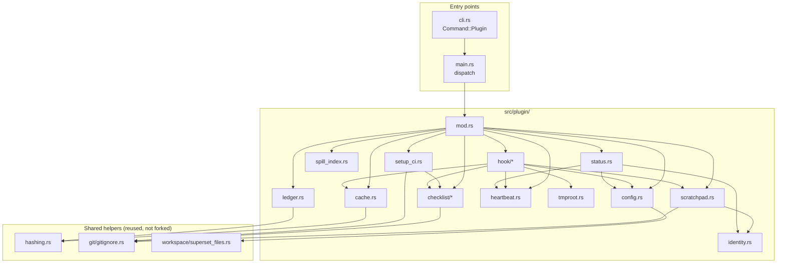

# Architecture — `src/plugin/` and the shared helpers it must not duplicate

Companion to [the plan](../2026-08-29-001-feat-ss-magic-claude-plugin-plan.md). Owns the full module tree, the decoupling boundaries, and every helper extraction that keeps plugin code from restating logic ss-magic already has.

## Constraints this layout is shaped by

All measured, not assumed — see [validation-evidence.md](./validation-evidence.md).

- `cli::parse` has **no extension point**: an unknown subcommand is `Parsed::Error`, exit 2.
- `MagicConfig` **destroys unknown keys on rewrite** — `init` deleted a `plugin` key in a live run.
- `copy_into_repo` is flat and `.superset/`-specific, and **silently drops** nested directories with no error. Nothing in this plan needs it to do more – but plugin state now lives *inside* the root it writes, which turns its accidental no-prune behavior into a load-bearing invariant (below).
- `sync_core` **returns early when `files` is empty**, before the engine.
- No symlink is created anywhere in `src/` today; `sync/apply.rs` explicitly skips them.
- No hashing crate, no date crate. That second one binds the checklist too: R85's ISO-8601 reading and UTC rendering are binary-owned, over the existing `format_timestamp`, and no date or timezone crate is added for them. `directories` is present but resolves OS app dirs (`~/Library/Application Support/...` on macOS), **not** `~/.claude`.

## The tree

```plaintext
src/plugin/
├── mod.rs                 dispatch for `ss-magic plugin <verb>`; the ONLY pub surface
├── config.rs              the `plugin` block in magic.json + its overlay precedence
├── identity.rs            deterministic <repo>-<branch> slug, from git only
├── scratchpad.rs          .superset/.magic bootstrap, current.json pointer, state-file scaffolding
├── cache.rs               hash-keyed conclusion cache under .superset/.magic/
├── ledger.rs              cost attribution over transcript JSONL
├── heartbeat.rs           hooks.jsonl append/read: one row per hook invocation, event + timestamp + cwd + outcome + error class (KTD6)
├── spill_index.rs         read-only manifest over the harness's tool-results/ spill files
├── status.rs              status / status --json: resolved slug, state dirs, thresholds, BOTH enablement layers, bootstrap state, last-fired-at per event (R36, R65, R77)
├── tmproot.rs             the private per-machine temporary root + its fd-lock helper (R80, R81)
├── setup_ci.rs            setup-github-ci: renders and writes the pinned workflow (R93, R94)
├── checklist/
│   ├── mod.rs             the family's only pub surface
│   ├── schema.rs          the typed, project-agnostic document model (R83)
│   ├── order.rs           canonical order: changelog by created; items by (done, priority, created) (R84)
│   ├── validate.rs        what the format leaves implicit (R87)
│   ├── render.rs          deterministic Markdown + the untrusted-data envelope it owns (R85, R86)
│   └── verbs.rs           init / add-item / add-entry / set / done / list / verify / render-md (R90)
└── hook/
    ├── mod.rs             stdin decode -> route -> stdout encode; the fail-open policy
    ├── event.rs           typed payloads + responses (serde), one place for the wire format
    ├── pre_tool_use.rs    the checklist deny (R88) ahead of every exemption, then the Read gate: deny-and-route on miss, deny-with-conclusion on hit; plus the advisory Bash commit nudge (R91)
    ├── session_start.rs   additionalContext: operating guidance + the checklist pointer
    ├── pre_compact.rs     write the scratchpad note on both triggers, then emit nothing and never block (R49) — the harness rejects hookSpecificOutput for this event, so there is no channel to emit on anyway
    ├── subagent_stop.rs   artifact enforcement (block once) + salvage
    ├── session_end.rs     inline ledger scan: reads that session's transcript tree and appends one idempotent row before returning (R27/KTD7; measured worst case 0.87 s against a 354.7 MiB tree)
    └── file_changed.rs    direnv export into CLAUDE_ENV_FILE, for an already-allowed .envrc only; never `direnv allow` (R92)
```

**Two modules a reader of the first draft will look for are gone.** `assets.rs` and `install.rs`
died with R66: there is no embedded plugin tree, because the plugin is committed bytes the
marketplace serves, and there is no install target, because `ss-magic` installs nothing. Nothing
replaced them inside `src/plugin/` – the work moved out of the crate entirely, into `plugin/` and
`.claude-plugin/marketplace.json` (see [plugin-assets.md](./plugin-assets.md)).

Tests follow the existing convention exactly: `#[cfg(test)] mod tests;` in each module with the body in a sibling `<module>/tests.rs`, so private items stay reachable.

## Decoupling: one invariant and two shared helpers, so nothing is written twice

The rule: **when the plugin needs behavior that already exists in a shape too specific to reuse, generalize the existing one and make both call it — never fork it.** The corollary, which round 1 got wrong and this round fixes: **do not generalize for a caller that does not exist.**

### 1. `copy_into_repo` – no extraction; one stated, tested invariant

Round 1 planned to extract `copy_into_repo`'s core into a general `src/workspace/materialize.rs` with recursion, exec-suffix and staging options. That extraction is **dropped** (KTD2). Its only second caller was `plugin::install`, which R66 deletes, so the generalized writer would have been built for nobody – and a recursive rewrite of a writer that owns `.superset/` is a real risk taken for no gain. `copy_into_repo` keeps its shape: flat, `.superset/`-only, always-overwrite, `config.json` written last, `*.sh` chmod 0755, plus a delete set.

What survives is the part that actually mattered, and it now applies to the existing function rather than to a new one:

**Invariant: `copy_into_repo` never removes a destination entry that is not named in its explicit `delete` list.**

This matters more than it looks, because plugin state lives at `.superset/.magic/` – *inside* the destination root `init` and `migrate` write into. A writer that pruned destination entries absent from the stage (the natural thing to want the moment anyone reaches for recursion again) would silently destroy live session files, the conclusion cache, and pending one-shot claims on the very next `init` or `migrate`, since none of that state is part of the `.superset/` stage tree those flows build.

Today the function satisfies the invariant **by accident**: it reads exclusively `is_file()` entries from a flat stage and unlinks only the paths named in `delete`, so it never even sees `.superset/.magic/` to consider removing it. An accident is not a guarantee. U4 states the invariant in the code and tests it directly – stage a `.superset/` tree, materialize it over a destination that already holds `.superset/.magic/` with live files, assert every one of them survives byte-for-byte.

`copy_into_repo`'s inline comment – "the tree is flat — no subdirectories under `.superset/`" (`src/workspace/superset_files.rs:309`, quoted verbatim) – became stale the moment `.superset/.magic/` exists as a real subdirectory. It must be corrected in the same change, to say that the *stage* is flat while the destination root is not, which is exactly why the no-prune rule exists.

### 2. `src/hashing.rs` — one content fingerprint

`reverse_sync::hash_file` (`DefaultHasher`, 64-bit, non-cryptographic, "the threat model is a concurrent edit, not an adversary") is private. `plugin::cache` needs the same property for cache keys — accidental collision matters, adversaries do not. U4, the shared-helper extraction phase, lifts it to `src/hashing.rs` — not U13 — so that U17 can ship ahead of U13 per sequencing constraint 6 without depending on it. Both `cache.rs` and `ledger.rs` are callers. **No new crate**; `DefaultHasher` is std.

Cache keys additionally hash the *identity* of a file, deliberately **not** its paging window — see [page-fault.md](./page-fault.md) for why `offset`/`limit` must be excluded.

### 3. `src/git/gitignore.rs` — already shared, reuse as-is

`ensure_path_ignored` is the single gitignore primitive and is already shared by reverse sync, the backups tree, and the init/migrate bootstrap. The plugin adds **no new gitignore code**; it adds callers. Note the severe pre-existing rule-lifting bug documented in [validation-evidence.md](./validation-evidence.md) – with plugin state at `.superset/.magic/` ignored by a repository-level rule, `ensure_path_ignored` lifts a root rule to a root rule, so this plan's own writes never reach the defective path. The fix still ships (see "Two prerequisite fixes" below), on evidence independent of the plugin.

## What each module may depend on

Enforced by review, and by keeping `mod.rs` the only `pub` surface:



Rules that fall out of the graph:

- **Nothing in `src/plugin/` installs anything.** There is no install module to depend on, and the rule that used to keep hooks away from one is now structural: delivery is the marketplace's job and the bootstrap script's, neither of which is Rust in this crate. A hook runs on the model's clock and must never acquire a tree-write.
- **`checklist/` knows nothing about hooks.** Same dependency direction as `cache.rs`: it is a document store with a validator, a canonical ordering and a renderer, and `hook/pre_tool_use.rs` is a *caller* – it asks "is this resolved path a checklist file?" and gets a yes or no. Inverting that, by teaching the checklist about tool envelopes, would make the schema untestable without a harness payload. `setup_ci.rs` is the other caller, because the workflow it renders runs `verify` and `render-md`.
- **`tmproot.rs` writes nothing durable and nothing inside a worktree.** It resolves `/tmp/ss-magic-plugin/<frozen-identifier>/` – `$TMPDIR` where `/tmp` cannot host a writable private root, as under a sandbox that allowlists only `$TMPDIR` – creates it owner-only, and hands back a lock on the `fd_lock::RwLock` pattern `src/update/apply.rs` already uses (KTD5). The identifier is stable per machine and encodes no repository path. This is the *only* coordination channel between concurrent handlers on one event, because R81 makes ordering unusable: handlers run concurrently against the original input, never chaining, and two rewrites fold last-write-wins.
- **`identity.rs` touches git and nothing else.** Superset is never consulted for identity — the workspace name is user-mutable (`superset ws update --name` exists; 31 of 36 live workspaces have `name != branch`, five are named `main`), so a name-derived directory silently orphans the whole scratchpad on a rename. `superset ws get` is also 0.73-1.19 s versus 5-8 ms for the whole git probe, which alone disqualifies it from a hook path. Superset may be read for a *display* name only, best-effort. The module is pure enough to unit-test the slug rules, which is where the real bugs are — an empty slug and a mangled non-ASCII name were both found by running it.
- **`cache.rs` knows nothing about hooks.** It is a keyed store; `pre_tool_use.rs` is its only caller today, and `ledger.rs` may reuse the hashing.
- **`heartbeat.rs` has exactly one writer: `hook/mod.rs`.** KTD1 puts the append in the centralized fail-open wrapper, not in each per-event module, so every hook verb gets a row because the wrapper that dispatches all five events owns the append — not because five call sites each remembered to make it. `status.rs` is heartbeat's other caller, reading the same log to report last-fired-at per event (R50).
- **No symlink is created anywhere.** `scratchpad.rs` writes a plain `current.json` pointer file instead, and `checklist init` records the active document as a manifest file for the same reason (R89). ss-magic creates no symlink today – forward sync explicitly *skips* them (`sync/apply.rs:315`) and pack only classifies them no-follow – so introducing one would mean teaching three code paths a primitive they currently drop, or accepting that the pointer vanishes from every sync and every archive.
- **`setup_ci.rs` owns the workflow bytes, and the skill owns the conversation.** A Markdown skill cannot write a file, so the split is forced rather than chosen (R93). The workflow ships as an `include_str!` asset with the pin substituted at write time, mirroring the existing `MAGIC_SH` precedent; the golden-file test greps the rendered output for the forbidden `pull_request_target` trigger (R94).

## The checklist family: serde modeling, and the two traps

The schema is deliberately uneventful serde – **no untagged unions, no heterogeneous arrays, no free-form maps.** Every one of those buys flexibility the format does not need and pays for it with error messages that name the wrong field. Two modeling decisions do need stating, because getting either wrong is silent rather than loud (KTD19).

**1. Two optionality conventions, which must not be mixed.** The document has both, and they mean different things on the wire:

| field | convention | serde shape |
|---|---|---|
| `expected` | always-present key, value may be `null` | `Option<T>`, **no** `skip_serializing_if` |
| the completion timestamp | always-present key, value may be `null` | `Option<T>`, **no** `skip_serializing_if` |
| `priority` | omitted entirely when unset | `Option<T>` + `skip_serializing_if = "Option::is_none"` |
| `why` | omitted entirely when unset | same |
| `refs` | omitted entirely when unset | same |

Both render as `Option<T>` in Rust, which is exactly why the distinction is easy to lose: adding `skip_serializing_if` to `expected` makes an item that legitimately has no expectation indistinguishable from one that never declared the field, and R87 requires `verify` to tell those apart (`expected: null` is *only* valid on a record- or decision-kind item). Dropping it from `priority` writes `"priority": null` into every unranked item and makes the ordering rule of R84 – unranked last – read as a value rather than an absence. Assert both directions in a round-trip test, not just deserialization.

**2. `sections` is ordered, so a hash map is disqualified.** The render order *is* the declared order (R83, AE69). `HashMap<String, Section>` destroys it; `BTreeMap` replaces it with a lexical order nobody asked for, which is worse because it looks deterministic. Model it as an **explicit array** of `{ id, title, items }` – or an order-preserving map if one is already in the dependency graph – and let `id` carry identity while position carries order. The same reasoning covers the changelog, which R84 sorts by parsed `created` instant.

Two smaller rules that fall out of the same discipline:

- **Timestamps are compared as parsed instants, never as strings** (R84). Two ISO-8601 timestamps at different UTC offsets sort wrong lexically and correctly by instant, and the failure is invisible until a repository has contributors in two timezones (AE70).
- **Unknown top-level keys are handled deliberately** – preserved on the R4 pattern, or rejected by `verify` – but never silently dropped. This is the same defect R4 fixes for `MagicConfig`, and the checklist is hand-editable by requirement (R82), so it will meet keys a newer ss-magic wrote.

## Why a Rust binary rather than a script

The plugin's hook command is the ss-magic binary itself (`ss-magic plugin hook <event>`), not a shell or Node script. Three measured reasons:

1. **The koolman original used `npx tsx`** – ss-magic ships no ambient Node toolchain, so that does not transfer. The same reasoning is why the checklist schema, validator and renderer are Rust rather than a ported TypeScript module.
2. **Shell slugify silently broke in the spike.** BSD `sed` (macOS default) does not support `\+`, so `"Magic plugin"` kept its space and produced an invalid directory name — with no error. A compiled implementation cannot fail that way.
3. **Hook behavior versions with a single artifact.** Note this is no longer the binary's *self-update* doing the versioning: the plugin path is excluded from the update gate and the binary it runs is pinned (R69), precisely so the skills, hooks and Markdown the marketplace ships stay in step with the binary that reads them. What the argument survives on is that one versioned artifact carries all of it, instead of loose scripts on disk drifting independently.

Exactly one shell script ships, `plugin/hooks/bootstrap.sh`, and it exists only because it has to run *before* the binary is present. Everything it does is deliberately small and failure-tolerant for that reason (R72).

## Delivery: nothing in this crate installs anything

There is **no install target**, because there is no install code (R66). The two things that used to be resolved at install time are now resolved by other parties entirely:

| what | who resolves it | where it lands |
|---|---|---|
| the plugin tree (manifest, hooks, skills, bootstrap, wrapper) | the harness, from the marketplace's pinned `git-subdir` entry | `${CLAUDE_PLUGIN_ROOT}` – version-scoped, replaced on every plugin update |
| the `ss-magic` binary the hooks run | `plugin/hooks/bootstrap.sh`, from the pin beside `plugin.json` | `${CLAUDE_PLUGIN_DATA}/bin/ss-magic` – survives plugin updates |

`ss-magic` writes neither. `ss-magic sync` runs no plugin step, and migration *deletes* any pre-existing `~/.claude/skills/ss-magic/` rather than maintaining it: the loader resolves by plugin **name**, a marketplace install outranks a `@skills-dir` copy, and a leftover copy is suppressed and reported in the `/plugin` Errors tab rather than loaded. Deleting it beats relying on that precedence.

Three consequences bind the code that remains:

- **Nothing resolves `~/.claude`.** The old `BaseDirs::home_dir().join(".claude")` path resolution existed for the install target and goes with it. `ProjectDirs` stays for ss-magic's own machine-level store (`src/update/check.rs:243`, KTD7) – ledger, heartbeat, offsets, price snapshots – which was never `~/.claude` and is unaffected.
- **`status.rs` reads the harness's view; it never writes it.** `claude plugin list --json` returns a bare top-level **array** on 2.1.251, and `status` matches on **manifest name** `ss-magic` rather than on id, because a marketplace registration carries `ss-magic@ss-magic` while an older skills-dir copy carries `ss-magic@skills-dir`. It **ignores the exit code** – 0 in every run including total failure – and surfaces `errors[]` and `notes[]` verbatim. R65 makes it report *both* enablement layers side by side: the harness's scope, registration id and enabled flag, and ss-magic's own overlaid `plugin.enabled` for this repository. The `claude` CLI may be absent, in which case the harness half reports itself skipped rather than failing.
- **`plugin.enabled` is the only switch this crate owns.** A marketplace install is machine-global, so the per-repository overlay is what keeps an install made for one repository from acting in every other (R5-R7, R55, R65). Every hook verb resolves it for the envelope's `cwd` and no-ops – heartbeat only – when it is false.

### Marketplace

`.claude-plugin/marketplace.json` sits at the **repository root**, and `plugin/` is the committed subdirectory it points at with a `git-subdir` source pinned by `ref` plus lowercase-hex `sha` (KTD16, R67). No code path in `src/plugin/` opens either file at runtime; they are repository content the harness reads. The full manifest, the `git-subdir`-is-external tradeoff, and the `claude plugin list --json` field shapes are in [plugin-assets.md](./plugin-assets.md).

One release advances every version surface together – the crate version, `plugin.json`, `plugin/ss-magic.version`, the marketplace entry's `ref`/`sha`, and the workflow's pin – and CI fails when they disagree (R95). That check is the only place this repository's build reasons about the marketplace at all.

## Two prerequisite fixes, outside `src/plugin/`

Neither was in the original request, and both are still hard prerequisites – but only one is armed by the plugin's own writes now. With state at `.superset/.magic/` ignored by a repository-level rule, `ensure_path_ignored` lifts a root rule to a root rule, so fix 1 below is no longer reachable through anything this plan writes; it stays a prerequisite anyway because `.scratchpad/.gitignore` containing `*` already exists in Superset worktrees today, written by the planning tooling, so a broad reverse-sync pattern can still lift it into the main checkout regardless of this plan. Fix 2 *is* armed by this plan: the enumeration layer must exclude `.superset/.magic/` before the first byte lands in it, and every unit that writes into that tree depends on it landing first.

1. **`git/gitignore.rs` — the covering-rule lift.** Reverse-syncing a file under a nested `*` `.gitignore` appends `*` to the **main checkout's root** `.gitignore`, blinding git to the whole shared checkout. Reproducible in three commands, covered by no test. Fix: only reuse a covering pattern when the target has a `.gitignore` at the **same relative directory** that owned it in the source; otherwise fall through to `anchored_literal`.
2. **`sync/apply.rs::walk_source` and `pack.rs` — the enumeration filter.** Generalize `under_backups_dir` into `under_excluded_dir` over `EXCLUDED_TREES = [".superset/backups", ".superset/.magic", ".scratchpad", ".git"]`, and generalize `append_dir_excluding_backups` the same way so a directory match that is an *ancestor* of an excluded subtree cannot re-admit it through the recursive walk. `.scratchpad` stays on the list as a third-party tree ss-magic does not own but must never push into main; `.superset/.magic` is the plugin's own state tree, added alongside it. Each entry matches its exact path components, never a prefix – widening `.superset/.magic` to `.superset` would exclude the contract files (`config.json`, `magic.sh`, `magic.json`) from sync and pack too. This is the repo's own documented rule — enforce the filter at the point of final enumeration, not on an upstream list.
