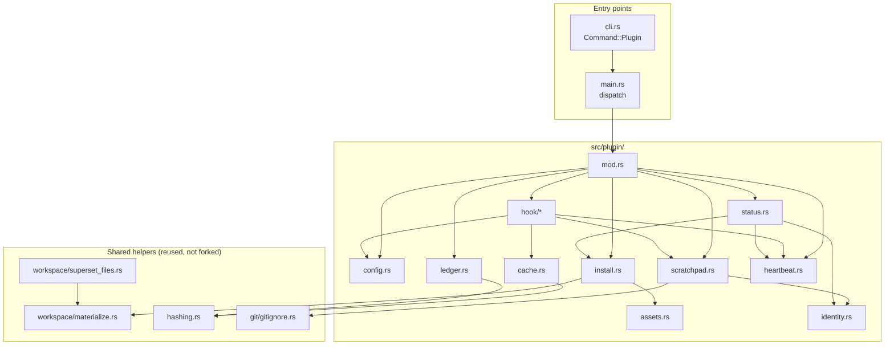

# Architecture — `src/plugin/` and the shared helpers it must not duplicate

Companion to [the plan](../2026-08-29-001-feat-ss-magic-claude-plugin-plan.md). Owns the full module tree, the decoupling boundaries, and every helper extraction that keeps plugin code from restating logic ss-magic already has.

## Constraints this layout is shaped by

All measured, not assumed — see [validation-evidence.md](./validation-evidence.md).

- `cli::parse` has **no extension point**: an unknown subcommand is `Parsed::Error`, exit 2.
- `MagicConfig` **destroys unknown keys on rewrite** — `init` deleted a `plugin` key in a live run.
- `copy_into_repo` is flat and `.superset/`-specific, and **silently drops** nested directories with no error. A nested `.claude/skills/ss-magic/` tree cannot use it.
- `sync_core` **returns early when `files` is empty**, before the engine.
- No symlink is created anywhere in `src/` today; `sync/apply.rs` explicitly skips them.
- No hashing crate, no date crate. `directories` is present but resolves OS app dirs (`~/Library/Application Support/...` on macOS), **not** `~/.claude`.

## The tree

```plaintext
src/plugin/
├── mod.rs                 dispatch for `ss-magic plugin <verb>`; the ONLY pub surface
├── config.rs              the `plugin` block in magic.json + its overlay precedence
├── assets.rs              the embedded plugin tree (include_str! table) + asset manifest
├── install.rs             materialize/refresh .claude/skills/ss-magic/; version reconcile
├── identity.rs            deterministic <repo>-<branch> slug, from git only
├── scratchpad.rs          .scratchpad bootstrap, current.json pointer, state-file scaffolding
├── cache.rs               hash-keyed conclusion cache under .scratchpad/.ss-magic-plugin/
├── ledger.rs              cost attribution over transcript JSONL
├── heartbeat.rs           hooks.jsonl append/read: one row per hook invocation, event + timestamp + cwd + outcome + error class (KTD6)
├── spill_index.rs         read-only manifest over the harness's tool-results/ spill files
├── status.rs              status / status --json: resolved slug, state dirs, thresholds, install state, last-fired-at per event (R36)
└── hook/
    ├── mod.rs             stdin decode -> route -> stdout encode; the fail-open policy
    ├── event.rs           typed payloads + responses (serde), one place for the wire format
    ├── pre_tool_use.rs    the Read gate: deny-and-route on miss, deny-with-conclusion on hit
    ├── session_start.rs   additionalContext: operating guidance + checklist init
    ├── pre_compact.rs     block compaction until scratchpad state is durable
    ├── subagent_stop.rs   artifact enforcement (block once) + salvage
    └── session_end.rs     inline ledger scan: reads that session's transcript tree and appends one idempotent row before returning (R27/KTD7; measured worst case 0.87 s against a 354.7 MiB tree)
```

Tests follow the existing convention exactly: `#[cfg(test)] mod tests;` in each module with the body in a sibling `<module>/tests.rs`, so private items stay reachable.

## Decoupling: three extractions, so nothing is written twice

The rule: **when the plugin needs behavior that already exists in a shape too specific to reuse, generalize the existing one and make both call it — never fork it.**

### 1. `src/workspace/materialize.rs` — one atomic stage→repo writer

`copy_into_repo` today: flat, `.superset/`-only, always-overwrite, `config.json` written last, `*.sh` chmod 0755, plus a delete set. The plugin needs the same *core* (stage into a tempdir, then materialize atomically) with **recursion** and a different root.

Extract that core to `materialize(stage_root, dest_root, &MaterializeOpts)`:

```rust
pub struct MaterializeOpts<'a> {
    pub recursive: bool,
    pub exec_suffixes: &'a [&'a str],   // [".sh"] today; plugin adds none
    pub write_last: Option<&'a str>,    // Some("config.json") preserves crash-safety ordering
    pub delete: &'a [&'a str],
}
```

`superset_files::copy_into_repo` becomes a thin caller with `recursive: false` — behavior byte-identical, guarded by the existing **367 passing tests**. `plugin::install` is the second caller with `recursive: true`. One writer, two policies.

**This also fixes a latent bug**: the silent-drop of nested directories becomes impossible because recursion is a declared option rather than an accident of the loop shape.

### 2. `src/hashing.rs` — one content fingerprint

`reverse_sync::hash_file` (`DefaultHasher`, 64-bit, non-cryptographic, "the threat model is a concurrent edit, not an adversary") is private. `plugin::cache` needs the same property for cache keys — accidental collision matters, adversaries do not. Lift it to a shared module and have both call it. **No new crate**; `DefaultHasher` is std.

Cache keys additionally hash the *identity* of a file, deliberately **not** its paging window — see [page-fault.md](./page-fault.md) for why `offset`/`limit` must be excluded.

### 3. `src/git/gitignore.rs` — already shared, reuse as-is

`ensure_path_ignored` is the single gitignore primitive and is already shared by reverse sync, the backups tree, and the init/migrate bootstrap. The plugin adds **no new gitignore code**; it adds callers. Note the severe pre-existing rule-lifting bug documented in [validation-evidence.md](./validation-evidence.md) — the plan fixes it *before* introducing a `.scratchpad/.gitignore` containing `*`, because that file is what arms it.

## What each module may depend on

Enforced by review, and by keeping `mod.rs` the only `pub` surface:



Rules that fall out of the graph:

- **`hook/` never touches `install.rs`.** A hook runs on the model's clock; installing is a `sync`-time concern. Mixing them would put a tree-write in a latency-critical path.
- **`identity.rs` touches git and nothing else.** Superset is never consulted for identity — the workspace name is user-mutable (`superset ws update --name` exists; 31 of 36 live workspaces have `name != branch`, five are named `main`), so a name-derived directory silently orphans the whole scratchpad on a rename. `superset ws get` is also 0.73-1.19 s versus 5-8 ms for the whole git probe, which alone disqualifies it from a hook path. Superset may be read for a *display* name only, best-effort. The module is pure enough to unit-test the slug rules, which is where the real bugs are — an empty slug and a mangled non-ASCII name were both found by running it.
- **`cache.rs` knows nothing about hooks.** It is a keyed store; `pre_tool_use.rs` is its only caller today, and `ledger.rs` may reuse the hashing.
- **`heartbeat.rs` has exactly one writer: `hook/mod.rs`.** KTD1 puts the append in the centralized fail-open wrapper, not in each per-event module, so every hook verb gets a row because the wrapper that dispatches all five events owns the append — not because five call sites each remembered to make it. `status.rs` is heartbeat's other caller, reading the same log to report last-fired-at per event (R50).
- **No symlink is created anywhere.** `scratchpad.rs` writes a plain `current.json` pointer file instead. ss-magic creates no symlink today — forward sync explicitly *skips* them (`sync/apply.rs:315`) and pack only classifies them no-follow — so introducing one would mean teaching three code paths a primitive they currently drop, or accepting that the registry vanishes from every sync and every archive.
- **`assets.rs` is generated-shaped, hand-maintained.** One `include_str!` per shipped file plus a manifest table, mirroring the existing `MAGIC_SH` precedent. No `include_dir!` crate is a dependency and none is added.

## Why a Rust binary rather than a script

The plugin's hook command is the ss-magic binary itself (`ss-magic plugin hook <Event>`), not a shell or Node script. Three measured reasons:

1. **The koolman original used `npx tsx`** — ss-magic ships no ambient Node toolchain, so that does not transfer.
2. **Shell slugify silently broke in the spike.** BSD `sed` (macOS default) does not support `\+`, so `"Magic plugin"` kept its space and produced an invalid directory name — with no error. A compiled implementation cannot fail that way.
3. **The binary already self-updates.** Hook behavior then versions with the tool rather than drifting as loose scripts on disk.

## Install target

`~/.claude/skills/ss-magic/` — **personal scope**, never a project's `.claude/skills/`.

A project-scope `@skills-dir` plugin is gated on `projects["<normalized realpath>"].hasTrustDialogAccepted === true`, and every Superset worktree is a brand-new realpath under `~/.superset/worktrees/<projectId>/<branch>` — untrusted by construction, which is exactly ss-magic's domain. Verified in situ: this worktree is absent from the 20 `projects` entries in `~/.claude.json`, so a plugin installed here would have been suppressed in this very session. The worktree *does* carry `.claude/skills/plugin-structure/` (a plain `SKILL.md`, no `.claude-plugin/`) and that skill loads fine — confirming the split exactly: plain project skills are not trust-gated, plugin-shaped ones are.

Resolve the path with `BaseDirs::home_dir().join(".claude")`, honouring `CLAUDE_CONFIG_DIR`. **Not** `ProjectDirs` — measured, it resolves to `~/Library/Application Support/ss-magic` on macOS. `ProjectDirs` stays for ss-magic's own cache (`src/update/check.rs:243`).

Verify the install with `claude plugin list --json`, matching `id == "ss-magic@skills-dir" && enabled == true`, and **ignore the exit code** — it was 0 in every run including total failure. Surface `errors[]` and `notes[]` verbatim.

## Two prerequisite fixes, outside `src/plugin/`

Both are pre-existing defects that the plugin's own state directory would arm. Neither was in the original request; both are hard prerequisites.

1. **`git/gitignore.rs` — the covering-rule lift.** Reverse-syncing a file under a nested `*` `.gitignore` appends `*` to the **main checkout's root** `.gitignore`, blinding git to the whole shared checkout. Reproducible in three commands, covered by no test. Fix: only reuse a covering pattern when the target has a `.gitignore` at the **same relative directory** that owned it in the source; otherwise fall through to `anchored_literal`.
2. **`sync/apply.rs::walk_source` and `pack.rs` — the enumeration filter.** Generalize `under_backups_dir` into `under_excluded_dir` over `EXCLUDED_TREES = [".superset/backups", ".scratchpad", ".git"]`, and generalize `append_dir_excluding_backups` the same way so a directory match that is an *ancestor* of an excluded subtree cannot re-admit it through the recursive walk. This is the repo's own documented rule — enforce the filter at the point of final enumeration, not on an upstream list.
