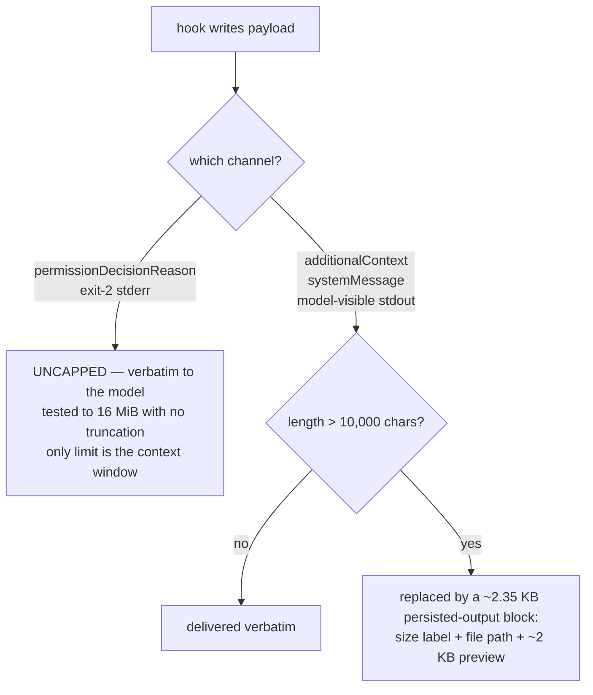

# Hook contract — every event the plugin ships, and the measured limits that bind it

Companion to [the plan](../2026-08-29-001-feat-ss-magic-claude-plugin-plan.md).
Measured on Claude Code **2.1.251** by capturing real payloads and driving live sessions, not by
reading docs. Raw captures and commands: [validation-evidence.md](./validation-evidence.md).

## The one fact that governs every design choice: channel capacity



Consequences the plan is built on:

1. **A deny reason can carry an arbitrarily large payload inline** — no cap, no wrapper, exact
   verbatim delivery. This is the highest-capacity model-facing hook channel that exists, and it
   settles the one unknown the source ideation flagged as blocking ("can
   `permissionDecisionReason` carry a full cached report?"). **Yes.**
2. **But the harness will not protect us from a runaway hook.** 16 MiB went straight through into
   a 34 MB transcript and a context-overflow API error. **ss-magic must impose its own byte
   budget on the deny channel** — nothing else will.
3. **`additionalContext` cliffs at 10,000 characters** (JS string length, not bytes — 18 KB of
   UTF-8 fits in 9,000 chars). Over that, the harness auto-persists and hands back a preview plus
   path. That is a *supported* "digest inline, full report on demand" path, and it means **we do
   not need to build a cache-and-link mechanism for context injection** — only for Read.
4. **Plain stdout is model-visible on exactly three events**: `UserPromptSubmit`,
   `UserPromptExpansion`, `SessionStart`. On `PreToolUse` / `PostToolUse` / `SessionEnd` it is
   silently discarded from the model's context *but still recorded in the transcript* — so
   transcript-only verification will lie to you. Use `hookSpecificOutput.additionalContext` there.
5. **`systemMessage` is a user/SDK channel, not a model channel.** Operator notices only.

## The shipped hook set

| event | matcher | purpose | channel | why it can work |
|---|---|---|---|---|
| `PreToolUse` | `Read` | the page-fault gate | `deny` + reason, or `updatedInput` | deny verified to block on 2.1.251 |
| `SessionStart` | `startup`,`resume`,`clear`,`compact` | operating guidance + checklist init | `additionalContext` (<10k) | one of only 3 model-visible-stdout events |
| `PreCompact` | `manual`,`auto` | force durable state before context is lost | `additionalContext`; `decision:"block"` to refuse | exit 2 blocks compaction |
| `SubagentStop` | — | artifact enforcement + salvage | top-level `{"decision":"block","reason":…}` | carries `last_assistant_message` + `agent_transcript_path` |
| `SessionEnd` | — | append to the cost ledger | none (side effect only) | `transcript_path` present; transcript **is** complete |

`Stop` and `PostToolUse` are **not** shipped in the first version — see "Deliberately not shipped".

## Per-event notes that change the implementation

### `SessionStart` — four sources, and one is the compaction-survival hook

Captured sources: `startup`, `resume`, `clear`, and **`compact`** — which fires *after every
compaction*. That last one is how scratchpad state is re-injected once the window has been
cleared, and it is a better instrument than `PreCompact` alone. `resume` additionally carries
`context_tokens` and `estimated_cache_write_usd`, the only place cost-shaped fields appear in a
hook payload.

`CLAUDE_ENV_FILE` is the documented env-persistence channel and Claude Code runs it as a script
preamble before each Bash command.

### `SessionEnd` — viable for the ledger, with a caveat about latency

- **No usage data in the payload.** Six keys only: `session_id`, `transcript_path`, `cwd`,
  `prompt_id`, `hook_event_name`, `reason`. The ledger must parse the transcript.
- **The transcript IS fully written when the hook fires.** Tested twice (single-turn and
  multi-turn tool-using); the snapshot taken inside the hook was byte-identical to the file after
  the CLI exited, final `usage` block included. **The ledger is not lossy on this axis.**
  *(Untested: SIGKILL of the CLI, `/logout`, crash — unverified there.)*
- **Real usable time is ~1.15 s** of the 1500 ms default; the process is genuinely SIGKILLed, not
  abandoned. The budget is a **shared deadline**, not a per-hook slice: three parallel hooks were
  each cancelled at the same wall-clock moment.
- **`timeout` is overridable per hook entry.** `"timeout": 30` let a 5-second hook complete — but
  the CLI blocks on exit waiting for it, so it is **paid in user-visible exit latency**.

→ **Ruling:** SessionEnd does only a cheap incremental append within the default budget. The full
report is an on-demand `ss-magic plugin cost` subcommand, off the model's clock entirely. This
gets the always-on capture without taxing every session exit.

### `SubagentStop` — enforcement is viable; cost data is not here

- **`last_assistant_message` confirmed present**, plus `agent_id`, `agent_type`, and — most
  useful — **`agent_transcript_path`** pointing at `…/<session>/subagents/agent-<id>.jsonl`.
  That path is what makes salvage possible without guessing.
- **No usage data.** Per-subagent cost lives on `PostToolUse` where `tool_name == "Agent"`
  (**not** `"Task"`), whose `tool_response` carries `totalTokens`, `resolvedModel`, and
  `totalDurationMs`.
- The response shape is **`{"decision":"block","reason":…}` at the top level**. Emitting
  `hookSpecificOutput{hookEventName:"Stop"}` fails validation — there is no `Stop` member in that
  union.

This event is the only one addressing genuine **data loss** rather than context economy: agent
reports are tail-truncated by `TASK_MAX_OUTPUT_LENGTH` with the explicit marker *"the earlier part
of the report is not retrievable"* — not spilled, lost.

## Composition with the user's existing hooks

`PreToolUse` handlers **run concurrently on the ORIGINAL input**. They do *not* form a chain, and
a later handler does *not* see an earlier one's rewrite — an earlier draft of this document said
otherwise and was refuted by measurement:

```plaintext
A rewrite 1787978231.847 pid 16203 {"command":"echo ORIGINAL"...}
B log     1787978231.847 pid 16204 {"command":"echo ORIGINAL"...}
```

Same millisecond, adjacent PIDs, and the logging hook `B` received the **original** command while
`A` was rewriting it. Reproduced with a real plugin loaded via `--plugin-dir`: the plugin hook and
the settings hook fired 1 ms apart, both on the original input.

Rewrites are then folded **last-write-wins, unconditionally**:

```js
var o9e = {deny:3, ask:2, allow:1, none:0};   // permission decisions are monotonic by RANK
…
if (F !== void 0) u = F;                      // <- LAST updatedInput wins, unconditionally
```

Measured consequences: the **slow, first-declared** hook won twice, so declaration order does not
decide — completion order does; an identical pair flipped between two back-to-back runs of the
same command; and with the user's live `rtk hook claude` attached, a hook rewriting to
`echo MINE_WON` **silently and completely discarded rtk's rewrite**.

→ **Ruling: ss-magic ships no `PreToolUse[Bash]` hook and emits `updatedInput` on no event at
all.** Two rewriting hooks on one event is a race with a nondeterministic winner whose loser
vanishes silently. `deny` and exit 2 compose safely because the decision is monotonic by `RANK`
and cannot be downgraded — so the gate uses `deny`, which is order-independent.

Also: hooks matching via `if` conditions **spawn once per matching `&&` subcommand with the same
`tool_use_id`**, and plugin hook copies are **not** deduplicated against a settings copy of the
same handler. Every handler must be idempotent.

**Never use a hook `allow` to grant a capability.** In this user's auto mode it is funnelled back
through the classifier (*"Hook approved tool use for X, but auto mode requires classifier
adjudication"*) and an always-deny rule still overrides it. Only `deny` is a hard guarantee.

## Failure posture — the gate is fail-open, and the plan says so

- A **timed-out** `PreToolUse` hook does **not** block; it falls through to the normal permission
  flow.
- A **crashing** hook also fails open, silently. This was hit for real during the spike: a syntax
  error made the hook exit non-zero with no stdout, and an oversized `Read` sailed through with
  nothing reporting a problem.
- **The two validation tiers have OPPOSITE fail postures**, which is the subtlest trap here:
  an **envelope**-level malformation (e.g. `updatedInput` as a string instead of an object) fails
  **OPEN** — the harness logs a validation error and the tool runs unchanged; a **tool-schema**
  level malformation (a wrong type inside `updatedInput`) fails **CLOSED** — a hard deny that is
  indistinguishable from a policy block. So a typo in the envelope silently disables the gate,
  while a typo in the payload blocks the user's work.
- **Exit 1 is silently ignored** — it never blocks. Only exit 2 blocks.
- **Prefer JSON `deny` over exit 2.** Exit 2 works, but it wraps the message and **leaks the
  hook's configured command line** into the model's context:
  `PreToolUse:Bash hook error: [$CLAUDE_PROJECT_DIR/../../bin/hook.py A exit2]: <reason>`.

→ The Read gate is a **context-economy measure, never a security boundary.** The plan states this
explicitly, and ships `ss-magic plugin doctor` so a broken gate is detectable rather than silent.

## Deliberately not shipped in v1

- **`PreToolUse[Bash]`** — the harness spills natively and rtk already digests it. See
  [page-fault.md](./page-fault.md).
- **`PreToolUse[Grep|Glob]` as active gates** — these tools do not exist in this user's session at
  all; the matchers ship inert for forward-compatibility with their thresholds behind config.
- **`Stop`** — its `additionalContext` behavior is contradicted between docs and shipping code and
  was not settled; `SessionStart(source:"compact")` covers the reconcile need with a verified
  channel.
- **`PostToolUse`** — it fires after the tool ran and its output already reached the model, so it
  cannot shrink context. It *is* the right place for subagent cost capture in a later version.
