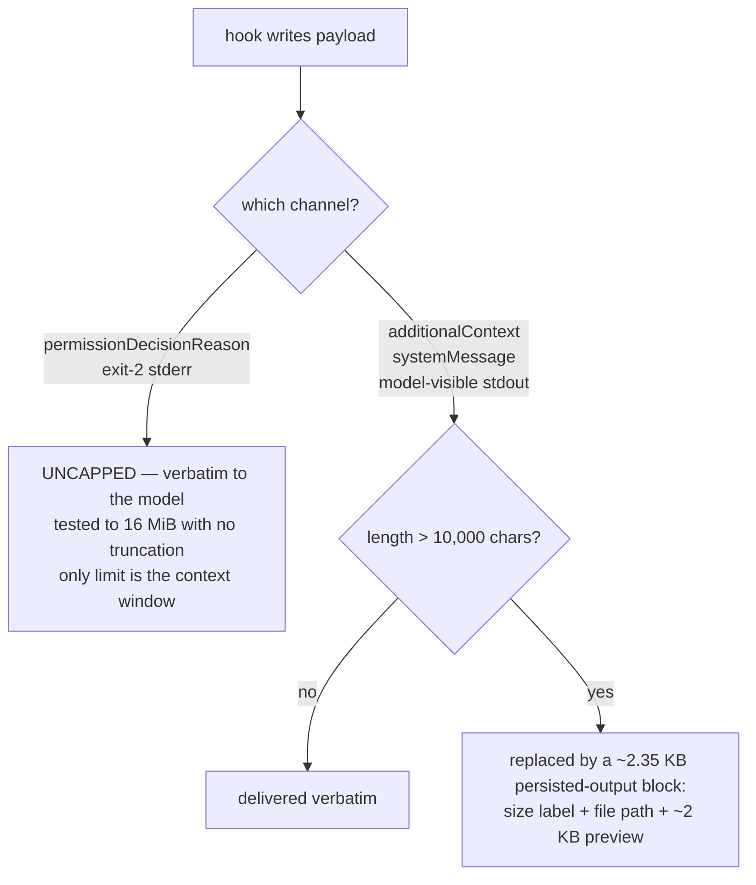

# Hook contract — every event the plugin ships, and the measured limits that bind it

Companion to [the plan](../2026-08-29-001-feat-ss-magic-claude-plugin-plan.md). Measured on Claude Code **2.1.251** by capturing real payloads and driving live sessions, not by reading docs. Raw captures and commands: [validation-evidence.md](./validation-evidence.md).

## The one fact that governs every design choice: channel capacity



Consequences the plan is built on:

1. **A deny reason can carry an arbitrarily large payload inline** — no cap, no wrapper, exact verbatim delivery. This is the highest-capacity model-facing hook channel that exists, and it settles the one unknown the source ideation flagged as blocking ("can `permissionDecisionReason` carry a full cached report?"). **Yes.**
2. **But the harness will not protect us from a runaway hook.** 16 MiB went straight through into a 34 MB transcript and a context-overflow API error. **ss-magic must impose its own byte budget on the deny channel** — nothing else will.
3. **`additionalContext` cliffs at 10,000 characters** (JS string length, not bytes — 18 KB of UTF-8 fits in 9,000 chars). Over that, the harness auto-persists and hands back a preview plus path. That is a *supported* "digest inline, full report on demand" path, and it means **we do not need to build a cache-and-link mechanism for context injection** — only for Read.
4. **Plain stdout is model-visible on exactly three events**: `UserPromptSubmit`, `UserPromptExpansion`, `SessionStart`. On `PreToolUse` / `PostToolUse` / `SessionEnd` it is silently discarded from the model's context *but still recorded in the transcript* — so transcript-only verification will lie to you. Use `hookSpecificOutput.additionalContext` there.
5. **`systemMessage` is a user/SDK channel, not a model channel.** Operator notices only.

## The shipped hook set

| event | matcher | purpose | channel | why it can work |
|---|---|---|---|---|
| `SessionStart` | `startup` | bootstrap the pinned binary into `${CLAUDE_PLUGIN_DATA}` (R70, R76) | none – silent on the success path | `startup` alone keeps it off every resume, clear, compaction and fork, where the pin cannot have moved |
| `SessionStart` | – (all five sources) | operating guidance + checklist pointer | `additionalContext` (<10k) | one of only 3 model-visible-stdout events |
| `PreToolUse` | `Read\|Edit\|Write\|NotebookEdit\|Grep\|Glob` | the checklist deny (all four write-capable tools) and the page-fault gate (`Read` only) | `deny` + reason | deny verified to block on 2.1.251; `Grep`/`Glob` ship inert – neither tool exists in this user's session, so the matcher is shipped for forward-compatibility only |
| `PreToolUse` | `Bash` | advisory checklist nudge on `git commit` / `git push` / `gh pr` (R91) | `additionalContext` **only** | it emits no `updatedInput`, so it cannot discard a co-installed rewriting hook's output – the narrowed prohibition, below |
| `PreCompact` | `manual`,`auto` | write the compaction-survival note to the scratchpad | none — side effect only | `hookSpecificOutput{hookEventName:"PreCompact"}` is rejected outright, so there is no model-facing channel on this event at all; guidance ships instead on `SessionStart(source:"compact")`, see below |
| `SubagentStop` | — | artifact enforcement + salvage | top-level `{"decision":"block","reason":…}` | carries `last_assistant_message` + `agent_transcript_path` |
| `SessionEnd` | — | append to the cost ledger | none (side effect only) | `transcript_path` present; transcript **is** complete |
| `file-changed` | — | direnv export into `CLAUDE_ENV_FILE` on a `.env` / `.envrc` change (R92) | none – side effect only | `CLAUDE_ENV_FILE` is the documented env-persistence channel, see below |

`Stop` and `PostToolUse` are **not** shipped in the first version — see "Deliberately not shipped".

## How a hook entry is declared – exec form, variables, matchers, timeouts

**Exec form is what ships** (KTD18): an entry carrying `command` plus `args` is spawned directly, with **no shell**.

```json
{ "type": "command",
  "command": "bash",
  "args": ["${CLAUDE_PLUGIN_ROOT}/hooks/bootstrap.sh"],
  "timeout": 60 }
```

- `${CLAUDE_PLUGIN_ROOT}` and `${CLAUDE_PLUGIN_DATA}` are substituted **per element** inside `args` and inside the `command` string, as plain strings – no word splitting, no glob expansion – so a plugin path holding a quote, `$` or backtick never reaches a parser. Shell form (a bare `command` string with no `args`) *additionally* substitutes the bare `$NAME` spelling; exec form does not. The braced form is therefore used everywhere, because it is the only one both forms understand.
- **Both variables are plugin-only.** A hook declared in a skills directory, or in a `settings.json`, that references `${CLAUDE_PLUGIN_DATA}` is a **hard error** – not an empty expansion that degrades quietly.
- **Neither variable is exported to the Bash tool.** A skill body cannot name `${CLAUDE_PLUGIN_DATA}/bin/ss-magic` and have it resolve; that gap is exactly what the shipped `bin/` wrapper (R75) exists to close.

**The default hook timeout is 600 seconds**, per entry, overridable with `"timeout": <seconds>` – seconds, not milliseconds. On expiry the process is **killed**, and a killed `PreToolUse` hook does not block (see Failure posture). 600 s is far too long for anything on a session-start or per-tool path, so every ss-magic entry declares its own much smaller timeout, and the bootstrap separately time-bounds its own fetch (R76).

`SessionEnd` is the exception that proves the shape: it is bounded by the CLI's ~1500 ms *shutdown* deadline rather than by the 600 s hook default, and that deadline is shared across every hook on the event (see below).

**Matcher hazard.** A matcher built only from alphanumerics, `_`, `-`, space, `,` and `|` is treated as a literal alternation. Introduce any character outside that set and the matcher is compiled as an **unanchored regex** instead – so `Edit.*` also matches `NotebookEdit`, and a matcher written to narrow the set silently widens it. Ship plain alternations only, and name every tool explicitly rather than reaching for a wildcard.

## Per-event notes that change the implementation

### `SessionStart` – five sources, one compaction-survival hook, and one bootstrap

Captured sources: `startup`, `resume`, `clear`, **`compact`**, and `fork` — `compact` fires *after every compaction*. That last one is how scratchpad state is re-injected once the window has been cleared, and it is a better instrument than `PreCompact` alone. `resume` additionally carries `context_tokens` and `estimated_cache_write_usd`, the only place cost-shaped fields appear in a hook payload; `fork` carries the same cost-shaped fields.

**With no matcher, one entry re-runs on all five sources.** `"matcher": "startup"` restricts it to a fresh start – verified by driving a `-c` resume, which did not fire the restricted entry. That is why the guidance hook ships unmatched (it *wants* the compaction re-injection) while the binary bootstrap ships as a second entry matched to `startup` alone (R76): the pin cannot have moved between a session and its own resume.

Three measured facts make `SessionStart` the most expensive event to get wrong:

1. **It blocks session start.** The session does not begin until the hook returns. A deliberately slow 6-second hook made a `claude -p` run take **~10.35 s** end to end. Every millisecond here is paid by the user on every session.
2. **Its stdout becomes the model-facing `content` of a transcript attachment** – it is one of the three events whose plain stdout reaches the model at all. So anything printed is **paid for in tokens on every single session**, which is why the bootstrap prints nothing on its success path (R72). `stderr` is recorded in the transcript but is **not** model-facing, and is the right channel for the one-line failure report.
3. **`async: true` is a trap for a bootstrap.** It does make startup non-blocking, but the binary is then not ready for the first turn – the very session that most needs it runs with every ss-magic hook inert – and in `claude -p` the backgrounded hook is **killed when the session exits**: a 10-second async hook never reached its second line. Prefer sync-but-fast, with a small explicit `timeout`, over async.

### `file-changed` – the direnv export

`CLAUDE_ENV_FILE` is the documented env-persistence channel: Claude Code runs that file as a script preamble before each Bash command, so writing exports into it is how a hook changes the environment later tool calls see. The `file-changed` handler uses it to re-export a `.env` / `.envrc` change through direnv (R92) – and only for an `.envrc` direnv **already** reports as allowed, never by granting that trust itself. It emits nothing on the wire; the export *is* the effect.

### `PreCompact` — writes the scratchpad, emits nothing on the wire, never a veto

`PreCompact` is absent from the `hookSpecificOutput` schema map — `hookSpecificOutput{hookEventName:"PreCompact"}` is rejected outright — so there is no model-facing channel on this event at all, on either trigger. The hook writes the compaction-survival note straight to the scratchpad and emits nothing back: no `additionalContext`, no decision, empty stdout, exit 0.

`PreCompact` never blocks, on either the `manual` or the `auto` trigger. A `manual` `/compact` fires when the user is already at the context wall, and refusing it costs a round trip at the worst possible moment; the evidence record separately shows that a buggy `PreCompact` hook can wedge a session.

The model-facing guidance instead lives on `SessionStart` with the `compact` source (see above) — it is both the designed channel for this and the only reliable signal that a compaction actually happened, since `PreCompact` itself fires even when no compaction follows (a `/compact` on a session too small to compact still fires the hook).

### `SessionEnd` — viable for the ledger, with a caveat about latency

- **No usage data in the payload.** Six keys only: `session_id`, `transcript_path`, `cwd`, `prompt_id`, `hook_event_name`, `reason`. The ledger must parse the transcript.
- **The transcript IS fully written when the hook fires.** Tested twice (single-turn and multi-turn tool-using); the snapshot taken inside the hook was byte-identical to the file after the CLI exited, final `usage` block included. **The ledger is not lossy on this axis.** *(Untested: SIGKILL of the CLI, `/logout`, crash — unverified there.)*
- **Real usable time is ~1.15 s** of the 1500 ms default; the process is genuinely SIGKILLed, not abandoned. The budget is a **shared deadline**, not a per-hook slice: three parallel hooks were each cancelled at the same wall-clock moment.
- **`timeout` is overridable per hook entry.** `"timeout": 30` let a 5-second hook complete — but the CLI blocks on exit waiting for it, so it is **paid in user-visible exit latency**.

→ **Ruling:** SessionEnd does only a cheap incremental append within the default budget. The full report is an on-demand `ss-magic plugin cost` subcommand, off the model's clock entirely. This gets the always-on capture without taxing every session exit.

### `SubagentStop` — enforcement is viable; cost data is not here

- **`last_assistant_message` confirmed present**, plus `agent_id`, `agent_type`, and — most useful — **`agent_transcript_path`** pointing at `…/<session>/subagents/agent-<id>.jsonl`. That path is what makes salvage possible without guessing.
- **No usage data.** Per-subagent cost lives on `PostToolUse` where `tool_name == "Agent"` (**not** `"Task"`), whose `tool_response` carries `totalTokens`, `resolvedModel`, and `totalDurationMs`.
- The response shape is **`{"decision":"block","reason":…}` at the top level**. Emitting `hookSpecificOutput{hookEventName:"Stop"}` fails validation — there is no `Stop` member in that union.

This event is the only one addressing genuine **data loss** rather than context economy: agent reports are tail-truncated by `TASK_MAX_OUTPUT_LENGTH` with the explicit marker *"the earlier part of the report is not retrievable"* — not spilled, lost.

## Concurrency – handlers do not chain, and rewrites are folded last-write-wins

This is the single most consequential fact in the document, and it binds two design rules stated at the end of the section.

Every handler registered on one event **runs concurrently against the ORIGINAL tool input**. They do *not* form a chain, and a later handler does *not* observe an earlier one's rewrite – an earlier draft of this document said otherwise and was refuted by measurement:

```plaintext
A rewrite 1787978231.847 pid 16203 {"command":"echo ORIGINAL"...}
B log     1787978231.847 pid 16204 {"command":"echo ORIGINAL"...}
```

Same millisecond, adjacent PIDs, and the logging hook `B` received the **original** command while `A` was rewriting it. Reproduced with a real plugin loaded via `--plugin-dir`: the plugin hook and the settings hook fired **1 ms apart**, both on the original input.

The results are then folded, and the two channels fold differently. Permission decisions are **monotonic by rank** (`deny` > `ask` > `allow` > `none`) and cannot be downgraded. `updatedInput` has no such protection – it is simply **overwritten by whichever handler finishes last, unconditionally**:

```js
var o9e = {deny:3, ask:2, allow:1, none:0};   // permission decisions are monotonic by RANK
…
if (F !== void 0) u = F;                      // <- LAST updatedInput wins, unconditionally
```

Measured consequences: the **slow, first-declared** hook won twice, so declaration order does not decide – **completion order does**; an identical pair **flipped between two back-to-back runs** of the same command; and with the user's live `rtk hook claude` attached, a hook rewriting the command to `echo MINE_WON` **silently and completely discarded rtk's rewrite**.

→ **Two rules follow, and the plan holds both (R20, R80, R81):**

1. **No ss-magic handler ever emits a tool-input rewrite** – on any event, for any reason. Two rewriting hooks on one event is a race with a nondeterministic winner whose loser vanishes with no error anywhere, and the user's `rtk` wrapper is the live loser. `deny` and exit 2 compose safely because the decision is monotonic by `RANK`, so the gate uses `deny`, which is order-independent. This is a ban on **rewrites**, not on Bash matchers: an advisory `PreToolUse[Bash]` handler emitting only `additionalContext` composes safely and is what R91's commit nudge uses.
2. **Coordination between ss-magic's own concurrent handlers goes through a lock file**, under the temporary root of R80 (see [scratchpad-contract.md](./scratchpad-contract.md#volatile-coordination-state--the-temporary-root)) – **never through ordering assumptions.** Nothing may assume the bootstrap finished before its sibling hooks fired; the session in which a bootstrap first runs has ss-magic's hooks inert by design (R77).

Also: hooks matching via `if` conditions **spawn once per matching `&&` subcommand with the same `tool_use_id`**, and plugin hook copies are **not** deduplicated against a settings copy of the same handler. Every handler must be idempotent.

**Never use a hook `allow` to grant a capability.** In this user's auto mode it is funnelled back through the classifier (*"Hook approved tool use for X, but auto mode requires classifier adjudication"*) and an always-deny rule still overrides it. Only `deny` is a hard guarantee.

## Failure posture — the gate is fail-open, and the plan says so

- A **timed-out** `PreToolUse` hook does **not** block; it falls through to the normal permission flow.
- A **crashing** hook also fails open, silently. This was hit for real during the spike: a syntax error made the hook exit non-zero with no stdout, and an oversized `Read` sailed through with nothing reporting a problem.
- **The two validation tiers have OPPOSITE fail postures**, which is the subtlest trap here: an **envelope**-level malformation (e.g. `updatedInput` as a string instead of an object) fails **OPEN** — the harness logs a validation error and the tool runs unchanged; a **tool-schema** level malformation (a wrong type inside `updatedInput`) fails **CLOSED** — a hard deny that is indistinguishable from a policy block. So a typo in the envelope silently disables the gate, while a typo in the payload blocks the user's work.
- **Exit 1 is silently ignored** — it never blocks. Only exit 2 blocks.
- **Prefer JSON `deny` over exit 2.** Exit 2 works, but it wraps the message and **leaks the hook's configured command line** into the model's context: `PreToolUse:Bash hook error: [$CLAUDE_PROJECT_DIR/../../bin/hook.py A exit2]: <reason>`.

→ The Read gate is a **context-economy measure, never a security boundary.** The plan states this explicitly, and ships `ss-magic plugin status` so a broken gate is detectable rather than silent.

## Deliberately not shipped in v1

- **Any `PreToolUse[Bash]` handler that rewrites the tool input or page-faults Bash *output*.** The harness spills natively and rtk already digests it. See [page-fault.md](./page-fault.md). **The prohibition has been narrowed to exactly those two things:** an advisory `PreToolUse[Bash]` matcher emitting only `additionalContext` **is** shipped (R91's commit-time checklist nudge), because it adds context without entering the last-write-wins fold.
- **`PreToolUse[Grep|Glob]` as active gates** — these tools do not exist in this user's session at all; the matchers ship inert for forward-compatibility with their thresholds behind config.
- **`Stop`** — its `additionalContext` behavior is contradicted between docs and shipping code and was not settled; `SessionStart(source:"compact")` covers the reconcile need with a verified channel.
- **`PostToolUse`** — it fires after the tool ran and its output already reached the model, so it cannot shrink context. It *is* the right place for subagent cost capture in a later version.
