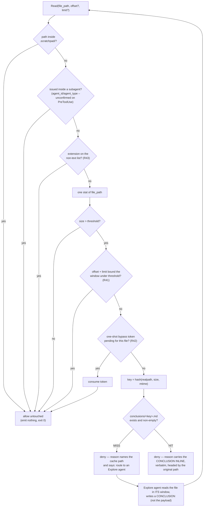

# Page-fault: what to build, what the harness already does, and why

Companion to [the plan](../2026-08-29-001-feat-ss-magic-claude-plugin-plan.md). Every number here was measured on Claude Code **2.1.251**; see [validation-evidence.md](./validation-evidence.md) for commands and raw output.

## The original idea, and what measurement did to it

The brief proposed: a `PreToolUse[Bash]` hook that tees oversized output to `.scratchpad/.ss-magic-plugin/spill/<id>.txt` and returns a head/tail digest plus a descriptor, paired with a `PreToolUse[Read]` deny that names the size and says "range-read or grep".

**The Bash half is already built, by the harness, and better.** Claude Code has a *tool-agnostic* result-persistence layer: over a per-tool threshold it writes the full untruncated result to disk and hands the model a ~2.3 KB envelope naming the file.

```plaintext
<persisted-output>
Output too large (195.3KB). Full output saved to: ~/.claude/projects/<cwd>/<session>/tool-results/<id>.txt

Preview (first 2KB):
...
</persisted-output>
```

| stdout chars | tool_result chars | % retained |
|---|---|---|
| 29,000 | 29,000 | 100 (inline) |
| 31,000 | 2,301 | 7.4 |
| 200,000 | 2,302 | **1.15** |

Files are full-fidelity, survive the session, stay greppable ~30 days, and behave identically in subagents. A subagent demonstrably read its own spill path back and reported the content correctly. Cost is flat at ~6,600 `cache_creation_input_tokens` regardless of output size.

**Ruling: do not build a spill mechanism, path reporting, or a size banner.** They exist and work. Two further reasons: `rtk 0.46.0` already ships a head-preview-plus-file-pointer digest for Bash on this machine (3,000 grep matches → 1,194 chars), and an ss-magic plugin hook on `PreToolUse[Bash]` would compose in a chain with rtk's settings hook, with both potentially returning `updatedInput`.

## Per-tool spill thresholds

| tool | `maxResultSizeChars` | spills? |
|---|---|---|
| Bash | 30,000 | yes |
| Grep | 20,000 | yes |
| Glob | 50,000 | yes |
| **Read** | **`Infinity`** | **never** |
| Agent/Task | 50,000 | tail-truncated, **not** spilled |

`BASH_MAX_OUTPUT_LENGTH` can only *lower* the threshold; 30,000 is a literal, so the inline budget cannot be raised from outside the harness.

## What remains genuinely unbuilt

### 1. Read — the whole point

Read never spills. Its real cap is a **25,000-token budget** (the "2,000-line" and "2,000-char line" limits are both **refuted**: a 3,000-line file returned all 3,000 lines; an 8,000-line file cut at 3,541; a 9,000-char line came back whole). Above 256 KB it hard-errors.

Measured `cache_creation_input_tokens`, same prompt shape:

| call | tokens |
|---|---|
| 3,000-line Read | **32,060** |
| 8,000-line Read | **60,066** |
| any spilled Bash | **~6,600** |

Read is the largest un-spilled context sink in the harness. This independently reproduces the user's own session measurement, where `Read` carried 46% of all tool-result text at one-seventh the call count of `Bash`.

### 2. A manifest

Spill filenames are unguessable short ids — **1,277 of 1,303** on this machine — scattered across **92** per-session directories with no index, totalling **188 MB**. Each session's directory resolves to `~/.claude/projects/<encoded-cwd>/<session-uuid>/tool-results/`; the `<session-uuid>` leaf is unguessable, so `spill-index` (R25) cannot reconstruct it and instead reads it back from the tool-result envelope that named it. Once the envelope scrolls out of context or compaction clears the tool result (`[Old tool result content cleared]`), the path is gone and the corpus is unnavigable. This is the real gap the brief identified correctly.

### 3. Head **+** tail

Foreground spills preview the **first** 2 KB; backgrounded task output previews the **last** 5 chunks. Neither gives both. For a build or test run whose verdict is in the last 20 lines and whose invocation is in the first 5, the native preview shows the wrong end.

## The mechanism, as ruled

`PreToolUse` matcher `Read|Grep|Glob`, with a hash-keyed conclusion cache under `.scratchpad/.ss-magic-plugin/conclusions/`. Two checks allow untouched before KTD4's own order even starts – a scratchpad path and a subagent-issued read, both reasoned about below – then KTD4 takes over: the non-text exemption (R43), one stat, the threshold, the bounded-window pass-through (R41), the one-shot bypass (R42), and only then the cache. **Both remaining branches deny**; the difference is what the deny reason carries.



The HIT path is the **never-blocked-forever guarantee**: the same input is never denied *empty* twice. The second attempt returns the answer, in the deny reason itself.

### Why `.scratchpad/` is exempt, unconditionally

The gate must never deny a read whose path is inside `.scratchpad/`. The observed real `STATUS.md` is 594 lines / 88.7 KB (see [scratchpad-contract.md](./scratchpad-contract.md)), and the shipped scratchpad skill tells the model to read `STATUS.md` first on resume (see [skills.md](./skills.md)). A session that just survived compaction relies on exactly that read to re-orient; gating it on size would deny the read the scratchpad exists to serve, defeating the feature's own headline outcome – a session resumed after compaction re-orienting from the scratchpad alone. The check is a path prefix test, not a size check, so it costs nothing on the exempt path and never touches the cache key.

### Why a subagent's own read must skip the gate

The MISS branch's routing sends the oversized read to an Explore agent, which then reads the same file to write the conclusion. If that read is itself subject to the gate, it is denied too, and the deny reason routes it to dispatch another Explore agent – the dispatching agent is both required to read the file and blocked from doing so, forever. The gate must no-op for a `Read` issued inside a subagent. The identification signal is the envelope's `agent_id`/`agent_type` fields, confirmed present on `SubagentStop` (see [hook-contract.md](./hook-contract.md)); their presence on `PreToolUse` specifically was **not measured** in this spike, so implementation must confirm both fields arrive on a subagent-issued `PreToolUse` envelope before relying on them as the gate's identification signal.

### Why deny-with-inline-conclusion, and not an `updatedInput` redirect

A working `updatedInput` redirect was built and verified end to end — the hook rewrote the Read to the conclusion file, the model read it, and answered correctly. It was then **rejected on measured evidence**:

1. **The model is not told its input changed.** The transcript keeps the ORIGINAL `tool_use` block. In the spike the model reported *"The Read tool succeeded without being blocked"* — it believed it had read the file it asked for. In a separate probe where a rewrite changed the *result*, the model became visibly confused: *"`echo ORIGINAL` can only print `ORIGINAL`, so something between my tool call and the shell altered it."* A silent substitution is a correctness hazard.
2. **Rewrites race, last-write-wins, nondeterministically** — see [hook-contract.md](./hook-contract.md). Shipping zero `updatedInput` anywhere removes that class of bug entirely.
3. **`permissionDecisionReason` is uncapped and delivered verbatim** with zero wrapper text (`tool_result` strlen == payload length exactly, tested to 16 MiB). So the conclusion rides inline at no fidelity cost, and the model is *told* it was blocked and why.
4. **`updatedInput` fails closed on a type error.** A wrong type inside it is a hard deny indistinguishable from a policy block, and it REPLACES rather than merges — a dropped required key produced *"The required parameter `command` is missing"*. Not emitting it at all removes an entire failure mode.

**Budget requirement.** The uncapped channel has **no runaway protection** — 16 MiB produced a 34 MB transcript and a `Prompt is too long` API error. ss-magic must impose its own byte budget on the inline conclusion, sized against the context window at roughly `bytes / 4` tokens.

### Verified by running it

| claim | result |
|---|---|
| `permissionDecision: "deny"` blocks `Read` on 2.1.251 | **CONFIRMED** |
| blocks in `bypassPermissions`, `acceptEdits`, `dontAsk`, and `auto` | **CONFIRMED** |
| `permissionDecisionReason` reaches the model verbatim, no wrapper | **CONFIRMED** |
| `updatedInput` can rewrite a Read (built, then rejected above) | **CONFIRMED** |

GitHub issue **#43407** (deny silently not blocking on v2.1.87) **does not reproduce** on 2.1.251.

## Three rulings the spike forced

1. **Every conclusion file opens with a header naming the original path, its size, and that it is a paged-out summary.** Without it the model quotes a summary as source. This survives the switch to inline delivery: the header is what makes the inline text self-describing.

2. **Key on file identity, not the paging window.** The standalone probe (no `limit`) and the live model (`limit: 1`) produced *different keys for the same file*, so a conclusion would never be reused across differently-windowed reads. Key on `(realpath, size, mtime)`; exclude `offset`/`limit`.

3. **The gate is fail-open by construction, and must be described that way.** Mid-spike a syntax error made the hook exit non-zero with no stdout, and the oversized Read sailed through with nothing reporting a problem. A timed-out `PreToolUse` hook also does not block, and an envelope-level typo makes the hook a silent no-op. → It is a **context-economy measure, never a security boundary**, and `ss-magic plugin status` exists so a broken gate is detectable rather than silent.

## Scope note: Grep and Glob

The brief named `Read`, `Grep` and `Glob`. In this user's environment **`Grep` and `Glob` do not exist as tools** — a live session enumerated its tools and neither was present; `ToolSearch select:Grep` returned no match, and the model falls back to `Bash grep` (which rtk already digests). A `PreToolUse[Grep|Glob]` matcher would never fire here.

**Ruling:** target `Read`. Ship the `Grep`/`Glob` matchers as forward-compatibility with their thresholds behind config, and mark them **unverified** — they could not be exercised.
