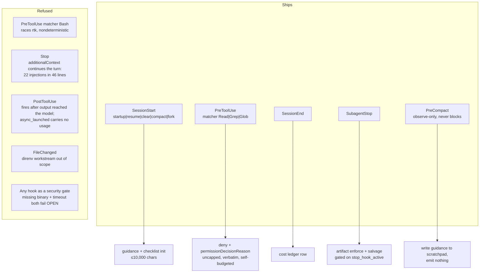

# Validation evidence — every ruling and the measurement that forces it

Companion to [the plan](../2026-08-29-001-feat-ss-magic-claude-plugin-plan.md).
Produced by an empirical validation pass: 8 live probes that executed real experiments
against Claude Code 2.1.251 and the ss-magic crate, then 86 adversarial refutation agents
over every CONFIRMED/REFUTED verdict, then a max-effort ruling pass. 99 agents total.

Promoted verbatim from the run's decision record so the plan's claims stay auditable.

---


Date: 2026-08-29\
Binary under test: Claude Code **2.1.251** (`/Users/viktorstiskala/.local/share/claude/versions/2.1.251`)\
Crate under test: `ss-magic` **v0.9.0**, worktree `ss-magic-plugin` (clean, 367 tests green)\
Evidence base: 8 lab reports under [lab/](./) plus the merged dossier [grounding.md](../grounding.md)

Every question below has a **ruling**, not a recommendation. Confidence is marked
`measured` (a command produced the fact), `inferred` (a design choice forced by measured
facts), or `assumed` (neither, and flagged as such).

New measurements taken while writing this record, not present in any report, are marked
**[NEW]** and their commands are in [Appendix: new measurements](#appendix-new-measurements).

---

## Q1 – Install scope

**RULING. Install to `~/.claude/skills/ss-magic/` (personal scope). Never to a project's
`<worktree>/.claude/skills/`.**

Basis: a project-scope `@skills-dir` plugin is gated on the persisted config flag
`projects["<normalized realpath>"].hasTrustDialogAccepted === true`, and `claude --help`
states the trust dialog is *skipped* (not auto-accepted) under `-p` or a non-TTY stdout. The
CLI reports the block itself, verbatim:

```plaintext
{ "id": "(suppressed)@skills-dir", "scope": "project", "enabled": false,
  "notes": ["1 project-scope directory under ./.claude/skills/ that may load as a plugin was
             skipped because this workspace was not trusted when plugins were scanned."] }
```

The decisive part is not headlessness – a pre-trusted path loads fine – it is that **every
Superset worktree is a brand-new realpath under `~/.superset/worktrees/<projectId>/<branch>`**,
so it is untrusted by construction. ss-magic's entire domain is fresh worktrees.

> **CORRECTION – 2026-08-29 review. The paragraph immediately above is wrong.**
> Trust is not keyed on the worktree's own realpath. Claude Code keys workspace trust on the
> git repository root and, **in a worktree, on the main checkout's root** – the same way it
> keys saved rules. A fresh Superset worktree therefore *inherits* the main checkout's trust
> rather than arriving untrusted. Verified two ways: the documented behavior in
> `permissions#what-runs-before-you-trust-a-folder`, and this machine's own `~/.claude.json`,
> where `~/Work/personal/superset-magic` carries `hasTrustDialogAccepted: true` while the
> worktree this plan was written in has no `projects` entry at all.
>
> The **ruling stands**; only this basis for it does not. What actually rules out project
> scope as the enablement path, measured after the correction:\
> – Committing `extraKnownMarketplaces` + `enabledPlugins` to a repo does **not** install the
> plugin for a collaborator. The docs are explicit that an externally-sourced plugin enabled
> in a project's settings is reported as not installed until each user runs
> `claude plugin install` themselves – so project scope buys no zero-touch onboarding.\
> – A repo's `extraKnownMarketplaces` entries are ignored **without a message** in a folder
> the user has not trusted, so the failure is silent when it does bite.\
> – `~/.claude/skills/<name>/` is a *documented* personal-scope plugin path (loaded as
> `<name>@skills-dir`, scaffoldable with `claude plugin init`) with no trust gate, no network
> and no install step. The original write-up treated it as an undocumented load path.
>
> Two caveats this section did not carry and should have:\
> – The Q1 probe was run under `-p` only. An interactive trust acceptance was never exercised,
> so "measured" overstates coverage of that specific path.\
> – Pre-seeding `hasTrustDialogAccepted = true` in a throwaway config did **not** un-suppress
> the project-scope plugin. That result is unexplained and is *not* accounted for by the
> correction above; anyone reopening project scope should start there.
>
> See the install-scope Key Decisions in
> [the plan](../2026-08-29-001-feat-ss-magic-claude-plugin-plan.md), which now splits
> distribution from enablement.

**[NEW] The target worktree is untrusted right now, in situ.** `~/.claude.json` holds 20
`projects` entries and **none** of them is
`/Users/viktorstiskala/.superset/worktrees/487339a1-…/ss-magic-plugin` – the key is absent
entirely, so `hasTrustDialogAccepted` is unset. Had ss-magic installed a plugin-shaped
`.claude/skills/ss-magic/.claude-plugin/plugin.json` into this worktree, it would be suppressed
in this very session. The worktree *does* carry `.claude/skills/plugin-structure/` – a plain
`SKILL.md` with no `.claude-plugin/` – and that skill is loaded and available here, which
confirms the split precisely: plain project skills are not trust-gated, plugin-shaped ones are.
This is the ruling's basis observed on the real target, not reconstructed in a lab.

Personal
scope has zero gate, zero settings edit, zero marketplace, and a shipping precedent on this
machine: `~/.claude/skills/superset/` (`.claude-plugin/plugin.json` + `skills/*/SKILL.md` +
`commands/*.md`) is live in this session as `superset:10x`, `superset:page`, … with no
`enabledPlugins` entry.

Three secondary factors all point the same way and none point back:

- Background **monitors do not load at all** at project scope.
- Per-repo versioning buys nothing: the plugin is a manifest, the behavior is in the binary,
  and the binary self-updates globally from GitHub Releases.
- Subdirectory launch: `.claude/skills` *does* walk up, but `.claude/settings.json`
  (projectSettings) does **not**, and `enabledPlugins` is a settings-tier key – so the
  project-scope story is inconsistent across the two files it depends on.

`strictKnownMarketplaces` is the one risk that cuts the other way: the sentinel is scoped to
`~/.claude/skills/` and, in managed settings, any allowlist blocks the scan unless
`{"source":"skills-dir"}` is present. It is **not** set in managed settings anywhere on this
machine (no `managed-settings.json` on any OS policy path, no managed preference, no
`managed-settings.d`, `CLAUDE_CODE_MANAGED_SETTINGS_PATH` unset). It *is* set in 13
project-level `.claude/settings.json` files in the user's other repos, but the key is
managed-settings-only, and none applies to this worktree.

**Therefore also:**

- Ship `--plugin-dir <path>` as the documented per-session fallback for policy-restricted
  machines. Measured to load skills **and** hooks under `-p` with no trust gate. It is itself
  policy-blockable (`areSideloadFlagsDisabledByPolicy`), so it is a second option, not a
  guarantee.
- Verify the install with `claude plugin list --json`, matching
  `id == "ss-magic@skills-dir" && enabled == true`. **Ignore the exit code** – it was 0 in
  every run including total failure. Surface `errors[]` and `notes[]` verbatim.
- Resolve `~/.claude` with `BaseDirs::home_dir().join(".claude")`, honouring
  `CLAUDE_CONFIG_DIR`, and copy the existing Option-returning silent-no-op-on-no-home pattern.
  **Do not** use `ProjectDirs` – on macOS it resolves to
  `~/Library/Application Support/ss-magic`, not `~/.claude`. Keep `ProjectDirs` for ss-magic's
  own cache (`src/update/check.rs:243`).
- Keep the manifest `name` as `ss-magic`; it becomes the invocation prefix. Name the skills
  `operator-checklist` and `setup`, not `ss-operator-checklist` / `ss-magic-setup`, so they
  read `/ss-magic:operator-checklist` and `/ss-magic:setup` rather than stuttering.

Confidence: **measured**, for the ruling – with the correction above applied to its stated
basis, and with the interactive trust-acceptance path recorded as untested.

---

## Q2 – Hook reload while a session is live

**RULING. Write the plugin tree on every `ss-magic plugin install` (and on the sync-path
install step), but make the write content-addressed: render the manifest bytes, compare to
disk, write nothing when identical. When bytes change, print a one-line notice naming
`/reload-plugins` and "restart for monitors". Do not refuse, do not write-once, do not
stay silent.**

Basis: nothing hot-reloads. Measured in a single `-p` session where the model rewrote both
`hooks/hooks.json` and `SKILL.md` mid-session – the *old* hook kept firing for the remaining
three tool calls and the model was served the *old* skill body while `V2` sat on disk. This
refutes the docs' "SKILL.md edits apply immediately"; in 2.1.251 the whole plugin is
snapshotted at session start.

Each rejected option fails on a measured fact:

- *Refuse while a session is live* is unimplementable. There is no registry of live sessions
  ss-magic can consult, hooks have no controlling terminal to ask on, and every invocation
  from inside a Claude session is by definition a live session – the refusal would fire always.
- *Write on first install only* strands users on a stale manifest permanently, and the manifest
  is exactly where new hook events get added.
- *Do nothing* reproduces the failure mode every report keeps hitting: a stale or missing hook
  is a silent no-op with no error at the call site.

Content-addressing is also required for a second, independent reason: plugin hook copies are
**not** deduplicated against a settings copy of the same handler, and the `if` field spawns a
handler once per matching `&&` subcommand with the same `tool_use_id`. The install must be
idempotent, and so must every hook it declares.

Print the notice on ss-magic's own stdout – it is a CLI the user ran. Not `systemMessage`
(that channel only exists inside a hook, and is a user/SDK channel there).

Confidence: **measured** for the reload facts, **inferred** for the once-per-change policy.

---

## Q3 – What the spill feature actually buys

**RULING. Drop the Bash half entirely – both the spill and the raise-the-budget variants.
Keep exactly two things: a read-only `ss-magic plugin spill-index` manifest, and the
PreToolUse Read deny-and-route.**

This is the largest deletion the measurements force, and it kills the feature on three
independent axes.

**Token savings: already delivered, nothing left to win.** The harness has a generic
tool-result persistence layer that fires for every tool, in the main thread and in subagents
identically. A 200,000-char command output enters the transcript as **2,302 characters
(~575 tokens, ~1.15% of raw)**, and the cost is *flat* – `cache_creation_input_tokens` was
6,574–6,691 for the 31k / 60k / 100k / 200k runs versus 13,400 for a sub-threshold 29k inline
run. Spill-to-file, path reporting, the size banner, a newline-aligned preview, ~30-day
retention and greppability all already exist.

**Raising the budget: provably impossible.** The Bash tool declares a hard literal
`maxResultSizeChars: 30000`, and the generic layer takes `Math.min(maxResultSizeChars, ceiling)`.
`BASH_MAX_OUTPUT_LENGTH` can only *lower* the effective threshold – measured with the knob at
150000 and at 999999, output of 45k / 100k / 200k spilled anyway; at 5000 a 10,000-char output
spilled; at 200 even a 1,000-char output spilled.

**Changing the preview shape: not implementable safely.** The only genuine gap is that
foreground spills preview the first 2 KB while backgrounded task output previews the last 5
chunks – neither gives head *and* tail, which is the wrong end for a build whose verdict is in
the last 20 lines. But PostToolUse fires after the output already reached the model and cannot
undo it, and a PreToolUse `updatedInput` rewrite that pipes the command **races the user's live
`rtk hook claude` with a nondeterministic winner** (Q11). There is no safe seam.

One trap to record so nobody re-derives it: the marker `... [N characters truncated] ...` will
**never** fire for a tool result. The only reliable detector is the `<persisted-output>` /
`</persisted-output>` wrapper and the `Output too large (SIZE). Full output saved to: PATH`
line.

**What survives, and why:** filenames are unguessable short ids (1,277 of 1,303 on this
machine), scattered across 92 per-session directories, 188 MB, with no index. Once the envelope
scrolls out of context or a compaction clears the tool result, the path is gone. That is the
real gap, it is cheap to close, and it needs no hook – a read-only directory walk exposed as
`ss-magic plugin spill-index`, plus a line in SessionStart `additionalContext` when the current
session already has spill files.

Confidence: **measured**.

---

## Q4 – Where the plugin step sits, and the update gate

**RULING (placement). The plugin step sits ABOVE the empty-`files` guard – immediately after
`load_magic_or_exit` at `src/main.rs:262`, before the early return at `src/main.rs:267`.**

Basis: measured on all three commands, an empty `files` returns early with exit 0 and never
reaches the engine.

```plaintext
$ ss-magic sync          -> magic.json `files` is empty - nothing to sync.        EXIT=0
$ ss-magic reverse-sync  -> Nothing to reverse-sync - no untracked candidates...  EXIT=0
$ ss-magic pack          -> magic.json `files` is empty - nothing to pack.        EXIT=0
```

A plugin step below that guard is dead code in exactly the repo that wants the plugin and no
file sync. Above the guard it still gets `resolve_sync_roots` and a loaded, overlaid config,
which is everything it needs. This mirrors the existing precedent of
`reverse_sync::backup_forward_targets` composing *around* the engine rather than inside it –
the engine has no mid-loop hook points.

**RULING (prerequisite, same change). Add `#[serde(flatten)] extra: serde_json::Map<String, Value>`
to `MagicConfig` before any `plugin` key ships.**

Basis: measured, the key is destroyed by any write path. `write_magic_json` re-serializes
`MagicConfig`, which knows only `files`:

```plaintext
before: {"files":[".env"], "plugin":{"name":"keepme"}}
$ ss-magic init .env CLAUDE.md
after:  {"files":[".superset/magic.local.json",".env","CLAUDE.md"]}     <- plugin gone
```

Flatten is smaller than adding a typed field *and* protects every future key. Without it, the
first `init`, `migrate`, or edit-config run silently deletes the user's plugin config.

**RULING (update gate). `Sync` keeps its existing gate unchanged; the new
`Command::Plugin(..)` is EXCLUDED from it, like `init`.**

Basis: the gate is a network round-trip (`src/main.rs:43`). A PreToolUse hook that must block
has to return well inside its timeout or it silently becomes a no-op – measured,
`outcome: "cancelled"`, `exit_code: 1`, and the tool ran normally. SessionEnd gets ~1.15 s of
usable wall time out of its 1500 ms default. Neither survives a network call on the hot path.
The existing exclusion comment for `init` ("one-time setup shouldn't depend on a network
round-trip") extends verbatim.

Confidence: **measured**.

---

## Q5 – `plugin.enabled` in `magic.local.json`

**RULING. Yes. Precedence for every non-`files` key is LOCAL WINS, WHOLE-VALUE – no deep
merge. Key present in `magic.local.json` replaces the base value entirely; key absent
inherits from base.**

Basis: measured, `load_overlaid` merges only `files` today (union + dedupe, base order first).
A local `{"plugin":{"name":"LOCAL-OVERRIDE"}}` had **zero** effect. The module doc at
`src/workspace/superset_files.rs:76` already promises the rule – *"Scalar / object keys
(future): local value wins"* – and no code implements it. Implement the comment.

Whole-value, not deep merge, for two reasons: deep merge has no precedent anywhere in this
codebase, and it makes `{"plugin": {"enabled": false}}` indistinguishable from "unset" once
`plugin` grows a second sub-key. `absent` ≠ `null`: an explicit `"plugin": null` means off, a
missing `plugin` means inherit.

**Consequence that must be documented, not discovered.** This repo's `magic.json` lists
`.superset/magic.local.json` in `files`, so the overlay file is itself forward-synced
main → worktree. A `plugin` block written in a *worktree's* overlay is clobbered by the next
`ss-magic sync`. That is correct semantics, not a bug: the opt-out is per-machine, and the main
checkout is the per-machine root. Write the opt-out in the **main checkout's**
`magic.local.json`.

Confidence: **inferred** (the absence of merge behavior is measured; the rule is a design
choice, forced by the existing doc comment plus the opt-out requirement).

---

## Q6 – Session identity

**RULING. Key the scratchpad on `<repo>-<branch>`, derived entirely from git. Never on the
Superset workspace name. This overturns the user's confirmed direction, and the measurement
is unambiguous.**

Basis: the workspace name is user-mutable and non-unique.

- `superset ws update --name <string>` exists – renaming is a one-command, zero-friction
  operation performed in normal use.
- The schema carries `is_unnamed integer DEFAULT false`, which only makes sense if `name`
  starts as a placeholder and is later changed.
- **31 of 36** live workspaces have `name != branch`; **five** are named `main`; names contain
  spaces, `+` and mixed case.
- `worktreePath` tracks the *branch*, never the name – workspace `"Invoices"` lives at
  `…/worktrees/<projectId>/computer-control-invoices`.

A name-derived directory therefore silently orphans the whole scratchpad on a rename, with no
error and no migration signal. Candidate `(d) name + createdAt` is strictly worse, not better:
the immutable half does not rescue it because the *mutable* half is the name half, and it
additionally breaks on workspace re-create.

The concrete derivation, with the corrections that matter:

```plaintext
<repo>   = pack::archive_file_name's origin-derived name (already shipped: scheme/userinfo/host
           stripped, segments sanitized, joined with '_'), falling back to
           basename(git::main_checkout_root)
<branch> = git symbolic-ref --quiet --short HEAD, '/' -> '-', unsafe chars -> '-',
           runs collapsed, leading/trailing '-' trimmed, lowercased, truncated to 40
dir      = <worktree-root>/.scratchpad/.ss-magic-plugin/sessions/<repo>-<branch>/
```

- **Do not** use `basename(git rev-parse --git-common-dir)`. It is cwd-relative and returns
  `.git` or `../.git` in any ordinary checkout – absolute only inside a linked worktree – so
  outside Superset every repo would slug to `.git-<branch>`.
- **Do not** use `git rev-parse --abbrev-ref HEAD`; it returns the literal string `HEAD` under
  detached HEAD. `symbolic-ref` exits 1 instead, which is a usable signal. Fall back to
  `detached-<short-sha>`; outside a repo (exit 128) the plugin does nothing at all.
- **Do not** append a path hash. In the Superset layout `worktrees/<projectId>/<branch>` it is
  merely a function of (project, branch), adds no independent identity, and breaks on directory
  rename. The suffix is unnecessary anyway: the scratchpad lives *inside* the worktree, and a
  worktree has exactly one branch, so the slug only has to be unique within one directory.
- Sanitizing `/` is load-bearing, not cosmetic: a cross-repo PR workspace produces
  `localBranchName = <forkOwner>/<headRefName>`.
- Superset PR workspaces end up on an **attached** local branch (`gh pr checkout --branch
  <localBranchName> --force`, asserted before creation is called successful), so detached HEAD
  is defensive hardening, not a live defect.

**Superset is read for display only, never for identity.** `SUPERSET_WORKSPACE_PATH` and
`SUPERSET_ROOT_PATH` are already in the environment at zero cost. If a human-readable workspace
name is wanted for a printed line, read `~/.superset/host/<orgId>/host.db` (`workspaces` joined
to `projects` on `worktree_path`, ~4 ms, ~15.6 ms including `git rev-parse`) as a best-effort
fast path – it is an undocumented internal schema, so treat any failure as "no name". **Never
call `superset ws get` on any hook path**: 0.73–0.98 s warm, 1.19 s cold, versus 5.4–8 ms for
the whole git probe.

**"Fallback when no Superset env exists" is not a case that needs designing.** The identity
path never touches Superset, so there is one code path inside and outside a Superset workspace,
with nothing to test for and nothing to fall back from.

**Which directory the hook resolves against:** read the `cwd` field from the hook's stdin JSON.
Not `${CLAUDE_PROJECT_DIR}` – documented and directly load-bearing here: *"`${CLAUDE_PROJECT_DIR}`
stays put … `cwd` follows Claude"* when Claude enters a worktree. Not the process cwd either.
Feed that `cwd` into `git::is_worktree` / `git::main_checkout_root`, not
`resolve_sync_roots`' implicit cwd.

Confidence: **measured** (name mutability, timings, path-hash redundancy, git-common-dir
portability); **inferred** (the exact slug shape).

---

## Q6b – The symlink registry

**RULING. Do not build one. Replace the symlink with a plain JSON pointer file,
`.scratchpad/.ss-magic-plugin/current.json`, written by the SessionStart hook.**

Basis: **no symlink is created anywhere in `src/` today.** `sync/apply.rs:315` explicitly
*skips* symlinks during copy, and `pack.rs` only classifies them with `symlink_metadata`
(no-follow) so a matched symlink is stored as a single entry rather than followed. Introducing
one would mean teaching three separate code paths (forward copy, reverse-sync classify, pack) to
handle a primitive they currently drop or sidestep – or accepting that the registry silently
vanishes from every sync and every archive.

The thing the registry existed for – koolman R15a's "one branch never gets two checklists" – is
solved by the deterministic slug itself (Q6). What remains is a pointer for humans and for
`ss-magic plugin status`, and a regular file serves that while being copied, packed and diffed
correctly by every existing path:

```json
{ "slug": "superset-magic-ss-magic-plugin", "dir": ".scratchpad/.ss-magic-plugin/sessions/…",
  "repo": "superset-magic", "branch": "ss-magic-plugin", "resolved_at": "2026-08-29T…Z" }
```

Confidence: **measured** (symlink absence and the skip/classify behavior); **inferred** (the
replacement shape).

---

## Q7 – Cost ledger

**RULING. Ship the SessionEnd hook. It writes one ledger row for the ending session and
computes nothing wider. Do not use an on-demand-only subcommand, and do not detach.**

Basis, and the budget objection is dead:

| scope | warm | cache-bypassed | vs 1500 ms |
| --- | --- | --- | --- |
| this session's tree (113 files, 8,689 lines) | 0.078–0.099 s | – | **5%** |
| largest session tree in the whole 2.61 GiB corpus (1,256 files, 354.7 MiB) | 0.78–0.91 s | **0.866–0.870 s** | **58%** |
| session-tree size distribution | p50 = 0 KB · p90 = 15 MB · p99 = 95 MB · max = 382 MB | | |

The all-time worst case fits with ~40% headroom, and it is CPU-bound rather than IO-bound, so
a cold cache does not change it. An on-demand subcommand can never observe a session that has
already ended, which is the whole point of a ledger; a detached background write is
unobservable and un-debuggable and the numbers show it is unnecessary.

Constraints, each forced by a measurement:

- **Scope = the ending session's own tree only**: `transcript_path` plus
  `find <dirname>/<session_id>/ -name '*.jsonl'`. Main-jsonl-only misses **~82%** of usage
  records (450 opus messages across the tree, 83 in the main file).
- **Do not set an explicit `timeout`.** 1500 ms is the *default per-hook* timeout, and hooks run
  in parallel each with their own abort timer – adding hooks does not shrink the window. But the
  CLI genuinely blocks on process exit: a `"timeout": 30` hook made a ~3 s baseline run take
  8.39 s. Raising it is paid in user-visible exit latency.
- **Read Claude Code's own priced figures first.** `{"type":"cost-state", totalCostUSD,
  modelUsage{<model>:{costUSD}}}` records are written into main-session transcripts (28 found
  across 15 files, all dated ≥ 2026-08-26); `claude -p --output-format json` exposes
  `total_cost_usd` and `modelUsage[].costUSD` with `costBasis: list|managed|unknown`. Ship a
  private price table **only** as the fallback for subagent transcripts (which never carry
  cost-state), pre-2026-08-26 transcripts, per-turn attribution (cost-state is session-cumulative
  and does not decompose – 696,545 opus output tokens in cost-state vs 323,008 summed from the
  same transcript's assistant messages), and `hasUnknownModelCost:true`. The original plan's
  "carry your own price table" was the primary mechanism; it is now the fallback.
- **Keep the byte-offset store** `{path → (offset, inode, size)}` – not for speed any more, but as
  the rotation guard. Offsets always land on `\n` (append-only confirmed by re-hashing a 983,819-byte
  prefix), so no partial-line handling. Reset one file to 0 when `size < stored_offset` or the
  inode changed.
- **Append-only and idempotent, keyed on `session_id`.** `/clear` mints a new session id and
  emits `SessionEnd(reason:"clear")` then `SessionStart(source:"clear")` then
  `SessionEnd(reason:"other")` – more than one session id per CLI process. Transcript-complete-at-
  SessionEnd is measured only for normal `-p` exit; SIGKILL / crash / logout are untested, so a row
  must be safe to write twice.
- **Do not attribute subagent cost via `PostToolUse[Agent]` as the primary path.** For
  *backgrounded* subagents – the default in this environment – it fires at launch with
  `{"isAsync":true,"status":"async_launched"}`, carries no usage, and no later PostToolUse fires.
  Sum `message.usage` from the agent transcript JSONL instead (verified 13,310 computed vs 13,307
  reported). Use PostToolUse/Agent only as a fast path when `tool_response.status == "completed"`,
  and never treat `async_launched` as a completed zero-cost agent.
- **Fail open and silent.** On any error, exit 0 with no output. The audit channel is the
  transcript's `hook_non_blocking_error` attachment.
- **`ss-magic plugin cost` must be able to backfill a session whose SessionEnd never ran.** SIGKILL
  is uncatchable, so a killed CLI runs no SessionEnd hook at all and simply leaves no row – this is
  not a lossy-transcript problem, it is a missing-invocation one. The human-facing `cost` verb
  therefore takes an optional session id or path and writes the row from the transcript on demand,
  which is also what makes the hook's idempotency requirement pay for itself.

Confidence: **measured**.

---

## Q8 – The autocompact cap

**RULING. Do not write `CLAUDE_AUTOCOMPACT_PCT_OVERRIDE` anywhere. Write the first-class
`autoCompactWindow` key – an absolute token count, 100k–1M – into a gitignored
`.claude/settings.local.json`, and add the `.gitignore` rule with `ensure_path_ignored` in the
same step. Only on explicit opt-in, never silently, and never over a value the user already
set.**

The env var is real – it is read live from `process.env`, not compiled out – but three
measured facts make it the wrong knob. **[NEW]**, from the 2.1.251 bundle:

```js
function W3(e,t){ let r=e-13000, o=t.testPctOverride;
  if(o!==void 0 && !isNaN(o) && o>0 && o<=100) return Math.min(Math.floor(e*(o/100)), r);
  return r }
function rhe(e,t,r){ let o=process.env.CLAUDE_AUTOCOMPACT_PCT_OVERRIDE, …
  return { …, testPctOverride: o?parseFloat(o):void 0, … } }
```

It is a **percent** valid only for `0 < p ≤ 100`; it can only *lower* `window - 13000`; it is
bound to a field literally named `testPctOverride`; it appears in neither `/autocompact` nor
`/config`; and its effect drifts with the model, since the same percent means a wildly
different absolute cap on a 1M-window opus than on a 200k-window sonnet.

A product-surfaced equivalent exists and expresses exactly what the user means. **[NEW]**:

```js
function GA(e,t,r=Gp()){ …
  if(process.env.CLAUDE_CODE_AUTO_COMPACT_WINDOW){
    let A=uee("CLAUDE_CODE_AUTO_COMPACT_WINDOW", …, rCe, YNe);
    if(A.status!=="invalid"){ let x=Math.max(rCe,A.effective);
      return {window:Math.min(u,x), configured:x, source:"env"} } }
  if(t!==void 0) return {window:Math.min(u,t), configured:t, source:"settings"}; … }
```

with `autoCompactWindow: Qn().describe("Auto-compact window size")` in the settings zod schema,
`/autocompact` writing it via `rn("userSettings",{autoCompactWindow:u},…)`, its parser accepting
`'auto' or 100k–1M tokens (e.g. 500k, 200000, or 200 as shorthand)`, and precedence
**env > settings > clientdata > experiment > model-default**, each clamped by
`Math.min(modelWindow, configured)`.

**Which file, and why not the tracked one.** This repo tracks `.claude/settings.json` in git
(`git ls-files .claude/` returns exactly that file), and a per-machine context budget is not a
repo fact – writing it there commits one developer's setting to everyone.
`.claude/settings.local.json` is also the more robust tier. **[NEW]**, verified live end to end
with `/autocompact`, which prints the resolved window and its source:

| file at the repo root | launched from the root | launched from `sub/deeper/` |
| --- | --- | --- |
| *(none – control)* | `Auto-compact window: auto` | `Auto-compact window: auto` |
| `.claude/settings.local.json` = `{"autoCompactWindow": 200000}` | – | **`200k tokens (from settings)`** |
| `.claude/settings.json` = `{"autoCompactWindow": 300000}` | `300k tokens (from settings)` | **`auto`** |

Two facts in one table. The setting is genuinely honoured from `settings.local.json` – this is
the end-to-end confirmation, not a source inference. And the walk-up asymmetry is real and
independently replicated: `settings.json` (projectSettings, `_(t.cwd)`) is anchored at cwd with
**no** walk-up, while `settings.local.json` (localSettings, `X6(t.cwd, canonicalGitRoot)`) walks
up to the canonical git root inside a git repo. A session launched from a subdirectory of the
worktree silently loses the project file and keeps the local one.

The file is **not** gitignored in this repo today (`.gitignore` is `/target`,
`.superset/magic.local.json`, `.superset/backups/`), so the rule must be added.

**Not the `env` block, even though it works.** **[NEW]**: `applySafeConfigEnvironmentVariables()`
does `Object.assign(process.env, this.filterSettingsEnv(ye(scope)?.env, scope))` for every
settings scope, so a settings `env` entry does reach the CLI's own `process.env`. But setting
`CLAUDE_CODE_AUTO_COMPACT_WINDOW` there makes `/autocompact` refuse to change it –
*"CLAUDE_CODE_AUTO_COMPACT_WINDOW is set and takes precedence. Unset it to change this setting."* –
taking the control away from the user. Use the plain `autoCompactWindow` key.

Confidence: **measured** (binary read, live `/autocompact` resolution, walk-up asymmetry,
settings-env assignment, tracked-file check); **inferred** (the opt-in-only policy).

---

## Q9 – Pack and reverse-sync safety

**RULING. Give `.scratchpad/` (and `.git/`) the same hard, two-layer exclusion `.superset/backups/`
already has, in BOTH pack and the sync engine's walk, before the plugin writes a single byte
there. Exclude the whole `.scratchpad/` tree, not just `.scratchpad/.ss-magic-plugin/spill/`.**

Basis, all measured, and the live repo is already in the hazardous state:

```plaintext
$ git check-ignore -v .scratchpad/ .scratchpad/.ss-magic-plugin/
.scratchpad/.gitignore:1:*      .scratchpad/
.scratchpad/.gitignore:1:*      .scratchpad/.ss-magic-plugin/
```

`.scratchpad/` is ignored **only** by its own nested, untracked `.gitignore` whose sole rule is
`*`. Meanwhile `git ls-files --others` (deliberately without `--exclude-standard`, because reverse
sync must push gitignored secrets) enumerates 3,465 paths here including
`.scratchpad/.ss-magic-plugin/**`, and `walk_source` knows only
`DEFAULT_EXCLUDES = ["node_modules", ".venv"]` plus `.superset/backups/`. A live run under
`{"files": ["**"]}` pushed `.env`, `.claude/settings.local.json` and a file containing
`SECRET NOTES top-secret-token=abc123` into the shared main checkout – non-interactive, no
confirmation, exit 0. `pack` under the same pattern archived `.git/config`, `.git/objects/**`,
`.git/index`, `target/`, `.claude/settings.local.json` and `.scratchpad/`, and under-reported the
entry count ~3x (201 tar entries, 72 unique) because directory matches are appended recursively on
top of leaf matches.

Mechanics are dictated by the repo's own documented incident, *"enforce a secret-excluding path
filter at the point of final enumeration, not on an upstream list"*:

- Generalize `under_backups_dir(rel)` into `under_excluded_dir(rel)` over a const
  `EXCLUDED_TREES = [".superset/backups", ".scratchpad", ".git"]`, keeping it as the flat leaf
  filter (`src/pack.rs:249`, `:426`).
- Generalize `append_dir_excluding_backups` (`src/pack.rs:415`) the same way, so a directory match
  that is an **ancestor** of an excluded subtree – a bare `.superset`, a broad `**` – cannot
  re-admit it via the recursive `WalkDir`. Test the directory-match shape, not just the leaf.
- Apply the same filter in `sync/apply.rs::walk_source` (`:267`, `:288`), which is the enumeration
  layer for `compute_candidates` and `compute_reconcile_set`. Today it only knows
  `DEFAULT_EXCLUDES`.

Whole-tree, not `spill/` only, because the rest of `.scratchpad/` is exactly what its own
`CLAUDE.md` calls out as never-to-be-shared, and a leaf-scoped exclusion leaves it pushable into a
shared checkout with no confirmation. `.git/` because packing it is a credential and full-history
leak in an archive the tool tells the user to share.

Confidence: **measured**.

---

## Q9b – The gitignore-rule-lifting bug (hard prerequisite)

**RULING. Fix `ensure_path_ignored`'s covering-rule reuse before any default pattern ships. It
is not optional and not deferrable.**

Basis: measured, and reproducible in three commands. With `{"files": ["**/*.md"]}`, reverse-syncing
one file under `.scratchpad/` appended the literal pattern `*` to **main's root `.gitignore`**,
making git blind to the entire main checkout:

```plaintext
$ cat q5/main/.gitignore
/target
.superset/backups/
*                                   <- appended by ss-magic
$ cd q5/main && git ls-files --others --exclude-standard
(empty)
```

The mechanism is visible at `src/git/gitignore.rs:115-135`: `find_covering_rule(rule_source_root, rel)`
returns the *pattern text* `*` that `git check-ignore -v` reports from `.scratchpad/.gitignore:1` in
the **source** tree; `closest_gitignore_dir(target_root, rel)` finds no `.scratchpad/.gitignore` in the
target and falls back to `target_root`; `ensure_entry(&gi_dir, &pattern)` writes `*` at the target root;
and the verification `is_ignored_opt(target_root, rel, kind) == Some(true)` passes, because `*` does
indeed ignore the file. The guard cannot catch it – it asks the wrong question.

Fix: only reuse a covering pattern when the target has a `.gitignore` at the **same relative directory**
that owned it in the source; otherwise fall through to `anchored_literal`. Equivalently, reject a lifted
rule whose scope in the target is broader than in the source. No existing test covers this.

Confidence: **measured**.

---

## Q10 – The `ss-magic plugin` subcommand family

**RULING. Yes – one subcommand family, user-facing and hook entry point both. Add
`Command::Plugin(PluginVerb)` to `cli::parse` as a fieldless enum (keeping `Command: Copy`) with
args carried separately, exactly as `Parsed::Init(Vec<String>)` already does.**

Basis: there is no extension point – an unknown token is a hard `error: unknown command \`plugin\``,
exit 2. And a compiled binary invoked by **bare name on PATH** is a valid hook command, measured
with a real Mach-O binary:

```json
{ "type": "command", "command": "ss-magic", "args": ["plugin", "session-start"], "timeout": 10 }
```

```plaintext
argv[0]=ss-magic-fake  argv[1]=plugin  argv[2]=SessionStart  argv[3]=/…/plug
CLAUDE_PLUGIN_ROOT=/…/plug   CLAUDE_PLUGIN_DATA=/Users/…/.claude/plugins/data/ssmagic-probe-inline
```

No absolute path, no vendoring, no wrapper script – the plugin is pure JSON
(`.claude-plugin/plugin.json` + `hooks/hooks.json`) and the binary keeps its independent
self-update path. `CLAUDE_PLUGIN_ROOT` and `CLAUDE_PLUGIN_DATA` arrive as env vars, so read them
with `std::env::var` rather than threading them through argv. Note `CLAUDE_PLUGIN_ROOT` is
explicitly ephemeral; `CLAUDE_PLUGIN_DATA` (`~/.claude/plugins/data/<id>/`) is the only
update-surviving write location.

Verbs, and only these:

| verb | kind | purpose |
| --- | --- | --- |
| `session-start` | hook | resolve slug, create/refresh session dir + `current.json`, emit `additionalContext`, append to `$CLAUDE_ENV_FILE` |
| `pre-tool-use` | hook | the Read/Grep/Glob deny-and-route gate |
| `pre-compact` | hook | write compaction guidance to the scratchpad; emit nothing |
| `session-end` | hook | write the cost-ledger row |
| `subagent-stop` | hook | artifact enforcement and salvage |
| `install` | human | write/refresh `~/.claude/skills/ss-magic/`, verify, notice on change |
| `uninstall` | human | remove that tree |
| `status` | human | where installed, whether the harness sees it, which hooks, what the slug resolves to here |
| `cost` | human | read the ledger the SessionEnd hook wrote |
| `spill-index` | human | the manifest over `tool-results/` (the Q3 replacement) |

Hard constraints on the family, each forced by a measurement:

- **Never runs the auto-update gate** (Q4).
- **Never touches the TUI.** Command hooks run without a controlling terminal on macOS and Linux
  and cannot open `/dev/tty`. The cockpit is unreachable from a hook, and `reverse_sync::run`
  already refuses non-interactively.
- **On any internal error, print nothing and exit 0.** A schema-invalid `updatedInput` converts
  into a hard DENY that is indistinguishable from a policy block, while a malformed envelope fails
  open and is discarded. Half-built JSON is the worst outcome available; silence is the safe one.
- **Echo back every required key** of a tool's schema on any `updatedInput`, and validate against
  that schema before emitting – `updatedInput` REPLACES `tool_input`, it does not merge, and a
  delta becomes a hard deny (measured: `{"description": …}` alone produced *"The required parameter
  `command` is missing"*). Extra keys are tolerated, so round-tripping the whole received
  `tool_input` and mutating one field is safe.
- **Read `cwd` from stdin JSON**, never `${CLAUDE_PROJECT_DIR}`, never the process cwd (Q6).
- **Be idempotent and tolerate concurrent duplicate invocation** – plugin hook copies are not
  deduped against a settings copy, and an `if`-gated handler is spawned once per matching `&&`
  subcommand with the same `tool_use_id`.

Manifest shape: `{"name":"ss-magic","version":…,"description":…,"repository":…,"license":…,"author":…}`
– only `name` is required. Gate CI on `claude plugin validate ./plugin --strict`. There is **no**
declarative way to require `ss-magic` on PATH: `dependencies` covers other plugins only, the
undocumented `binaries` map fetches by digest from Anthropic's own asset API and is gated off by
default, and the only automatic install is Node packages from a lockfile. Follow the documented LSP
precedent – README install instructions plus a SessionStart self-check that emits a `systemMessage`
when `ss-magic` is missing or too old. A missing binary is measured non-fatal (exit 0, normal
session), which is also precisely why no ss-magic hook may ever be a security gate.

Confidence: **measured**.

---

## Q11 – Coexisting with `rtk hook claude`

**RULING. ss-magic ships NO `PreToolUse[Bash]` hook, and emits `updatedInput` on no event
whatsoever.**

Basis: two rewriting hooks on one event is a race with a nondeterministic winner, and the loser is
discarded silently. The fold is unconditional last-write-wins over an async iterator:

```js
var o9e = {deny:3, ask:2, allow:1, none:0};   // Ib.RANK
…
if (F !== void 0) u = F;                      // <- LAST updatedInput wins, unconditionally
```

Measured consequences: the **slow, first-declared** hook won twice, so declaration order does not
decide – completion order does; an identical pair flipped between two back-to-back runs of the same
command; and with the user's live rtk hook attached, a project hook rewriting to `echo MINE_WON`
**silently and completely discarded rtk's rewrite**. Plugin `hooks.json` hooks land in the settings
tier and run concurrently with settings hooks on the **original** input, so there is no ordering
privilege to lean on and no priority field to set.

`deny` and exit 2 do compose safely – the permission decision is monotonic by `RANK` and cannot be
downgraded – but ss-magic now has no Bash-shaped reason to deny, because the Bash spill feature is
dropped (Q3). Adding a Bash matcher purely to observe would put a second process on the hottest hook
path in every session for zero decisions.

The one PreToolUse matcher ss-magic ships is `Read|Grep|Glob`, where rtk does not run (its settings
hook matches `Bash` only) and where the output is `deny` + `permissionDecisionReason` – order-
independent and monotonic. If a Bash-shaped need ever returns, the only safe shapes are (a) deny
plus `additionalContext`, or (b) shipping the transformation as an `rtk` subcommand that rtk itself
calls. Never a second rewriting hook.

One further rule that falls out: **never use a hook `allow` to grant a capability.** In the user's
auto mode it is funnelled back through the classifier
(`"Hook approved tool use for X, but auto mode requires classifier adjudication"`) and an always-deny
rule still overrides it. Only `deny` is a hard guarantee.

Confidence: **measured**.

---

## Q12 – Which hook events ship

**RULING. Five events ship. Five candidates are refused.**



**SessionStart** – match all five sources, not four: the schema is
`["startup","resume","clear","compact","fork"]`, and `fork` carries the cost fields
(`context_tokens`, `estimated_cache_write_usd`, …) alongside `resume`, so a cost-aware hook that
matches only `resume` misses forks. Both plain stdout and
`hookSpecificOutput.additionalContext` reach the model here; **budget ≤10,000 characters** or the
payload degrades into a `<persisted-output>` indirection costing the model an extra tool call. One
off-by-one to respect: plain stdout has a single trailing newline trimmed before the length check, so
it survives at 10,001 raw bytes while the JSON fields fail at 10,001. `CLAUDE_ENV_FILE` exists only
on this event and works – **append, never truncate**, the file is per-hook (`sessionstart-hook-1.sh`)
and truncating clobbers a sibling.

**PreToolUse `Read|Grep|Glob`** – `deny` blocks a Read as reliably as a Bash call, in `auto` mode as
well as `bypassPermissions`; issue #43407's silent-deny failure does not reproduce on 2.1.251.
`permissionDecisionReason` is **uncapped and delivered verbatim with zero wrapper text**
(`tool_result` strlen == payload length exactly), so a cached Explore conclusion rides inline – but
the harness imposes **no** runaway protection (16 MiB produced a 34 MB transcript and a
`Prompt is too long` API error), so the design must impose its own byte budget against the context
window at roughly `bytes/4` tokens. Prefer it over exit 2, which works but prepends
`PreToolUse:<Tool> hook error: [<the hook's configured command line>]:` into the model's context.
The matcher `Read|Grep|Glob` is a **list**, not a regex – only `|`, `,`, spaces, alnum, `_` and `-`
keep list semantics; any other character makes it an unanchored regex where `Edit.*` also matches
`NotebookEdit`. Two constraints on the gate itself: it must return well inside its timeout, because a
timed-out PreToolUse hook is a silent no-op rather than a block; and **Grep and Glob are not present
in this user's session at all** (the tool roster enumerated by a live `claude -p` run has neither, and
`ToolSearch select:Grep` returns nothing), so ship the matcher for generality but do not let anything
depend on those two halves firing.

**SessionEnd** – as ruled in Q7. Its plain stdout is discarded from the model's context, which is
correct: a ledger has nothing to tell the model.

**SubagentStop** – carries `last_assistant_message`, `agent_id`, `agent_type` and
`agent_transcript_path`, and blocks with a top-level `{"decision":"block","reason":…}` (measured: the
subagent was forced to continue and the parent received the corrected result). **Must gate on
`stop_hook_active`**, which flips to `true` on re-entry.

**PreCompact – observe-only, and it must never block.** Both exit 2 and `decision:block` genuinely
veto compaction and show the reason to the user, so a buggy PreCompact hook can wedge a session that
needs to compact. It also fires when no compaction happens at all (`/compact` on a tiny session
printed *"Not enough messages to compact."* and the hook still fired), so "I fired ⇒ a compaction
occurred" is wrong. `hookSpecificOutput{hookEventName:"PreCompact"}` is rejected outright – PreCompact
is absent from the schema map. Plain stdout does survive past the compact boundary for a manual
`/compact`, but only because it rides that slash command's `local-command-stdout`, and the same is
unverified for auto-compaction. So: write guidance to the scratchpad, emit nothing, and put the
model-facing guidance on **`SessionStart` matcher `compact`**, which is the designed channel and is
the reliable "a compaction actually happened" signal.

**Refused, with the measured reason:**

- **`PreToolUse` matcher `Bash`** – Q11.
- **`Stop`** – `hookSpecificOutput{hookEventName:"Stop", additionalContext}` is a *supported* shape
  (the "it fails validation" claim is refuted), but it **continues the conversation**: in the
  measurement it injected 22 times across 46 transcript lines because `stop_hook_active` was never
  consulted. Its workstream is covered by SessionStart plus SubagentStop. If it ever ships it must be
  gated on `stop_hook_active` and emit at most once.
- **`PostToolUse`** – fires after the tool output already reached the model and cannot undo it, and
  its plain stdout is discarded from the model's context. Its one attraction, per-subagent cost, is
  unavailable for backgrounded subagents (Q7).
- **`FileChanged`** – the direnv workstream is out of scope, and its cross-worktree reliability was an
  open question in the source plan itself.
- **Any hook as a security or policy gate** – hard rule, three independent fail-open paths: a missing
  binary degrades to no hook at all with a normal session, a timed-out PreToolUse hook does not block,
  and an envelope-level typo makes the hook a silent no-op. Every ss-magic hook is advisory or
  bookkeeping. The real secret boundary stays in the sync engine (Q9), where a `bail!` can actually
  stop a write.

Confidence: **measured**.

---

## Q12b – `superset terminals send "/compact"`

**RULING. Do not ship it, in the plugin or anywhere on the hook path.**

Basis: hooks have no controlling terminal, `terminals send` **submits by default** (`--no-submit`
stages instead), and a hook injecting `/compact` into its own terminal is writing a command into the
session it is concurrently running inside – with no captured response schema (`terminals send --json`
was never exercised; `--help` shows no fields) and no idempotency story. The actual goal is achieved
declaratively by `autoCompactWindow` (Q8) and, if wanted, `DISABLE_AUTO_COMPACT`. If a manual trigger
is ever wanted it belongs in a skill the user invokes, not in a hook.

Confidence: **measured** (no TTY, submit-by-default, unknown response schema); **inferred** (the
replacement).

---

## Q13 – Marketplace distribution [NEW, 2026-08-29 review]

**RULING. Ship a marketplace from the public repo as a distribution channel. Keep personal
scope as the enablement scope.** This is the "distribution and enablement are separate
decisions" Key Decision; Q1's correction block carries the enablement half.

Measured on Claude Code 2.1.251 against a throwaway `CLAUDE_CONFIG_DIR`:

- **A marketplace may live in the same repo as the plugin it serves.** With `.claude-plugin/`
  holding both `plugin.json` and `marketplace.json`, and the entry `{"name": "ss-magic",
  "source": "."}`, the install succeeds:

  ```plaintext
  ✔ Successfully added marketplace: ss-magic
  ✔ Successfully installed plugin: ss-magic@ss-magic (scope: user)
  ```

- **Project-scope install writes exactly two settings keys**, and they are the shapes the plan
  assumes: `extraKnownMarketplaces` (marketplace name → `{"source": {...}}`) and
  `enabledPlugins` (`plugin@marketplace` → boolean), in `.claude/settings.json`.
- **Committing those keys does not install for anyone else.** The docs are explicit: an
  externally-sourced plugin enabled in a project's settings is reported as *not installed* on
  every path that loads plugins until each user runs `claude plugin install` themselves. This
  is the finding that decides the enablement half – project scope buys no zero-touch.
- **Version is the cache key**, resolved from `plugin.json`'s `version`, then the marketplace
  entry's, then the source commit SHA. Declaring an explicit version makes updates
  release-gated; omitting it makes every push an update. The repo's existing convention (bump
  the crate version on any behavior change) makes the explicit-version path the fit.
- **Offline is safe.** An installed plugin loads from its local cache with no network at
  startup; marketplace refresh runs in the background after startup with a randomized delay,
  and a failed refresh falls back to the cached catalog.
- **`claude plugin list --json` returns a bare top-level array on 2.1.251**, not the
  `{"plugins": [...]}` object the docs show. Entries carry `id`, `version`, `scope`, `enabled`,
  `installPath`, `installedAt`, `lastUpdated`, `projectPath`; `errors[]` / `notes[]` appear
  only when there is something to report, which is how Q1's trust suppression surfaced.
  Duplicate ids appear once per `projectPath`. `claude plugin validate` has no `--json`, so CI
  relies on the exit code (`--strict` treats warnings as errors).
- **No separate hook-approval prompt exists** for plugin-supplied hooks. The gate is enabling
  the plugin, plus workspace trust for a project-scope `@skills-dir` plugin. The only
  plugin-hook-specific UI is a `[plugin:<name>]` provenance label on an `ask` decision.

**Not measured, and load-bearing if the enablement half is ever reopened:** whether a
*relative-path* source inside the same repo counts as "external" for the no-auto-install rule
(the docs enumerate only GitHub repos and npm packages), and whether the harness loads or
deduplicates two registrations sharing the manifest name `ss-magic` from different scopes. The
plan assumes it loads both, which is what makes the one-enabled-registration rule necessary.

Confidence: **measured**, except the two items named above, which are **assumed**.

---

## Q14 – Marketplace-only delivery and the SessionStart bootstrap [NEW, 2026-08-30]

**RULING. The marketplace is the ONLY delivery path, its entry is a `git-subdir` source, and a
`SessionStart` hook bootstraps a pinned binary into `${CLAUDE_PLUGIN_DATA}`.** `ss-magic` installs
nothing: there is no `plugin install` verb, no personal-scope tree under `~/.claude/skills/`, and no
sync-time plugin step. `plugin.enabled` **stays**, as the per-repository gate for a
machine-globally installed plugin.

This section is **additive**. It does not revise Q1's or Q13's probe records; it records what was
measured on 2026-08-30, against Claude Code 2.1.251, that forces the change on top of them.

### The marketplace source

- **`git-subdir` schema.** `url` (the repository), `path` (the committed plugin subdirectory,
  resolved **from the repository root**, not from `.claude-plugin/`), optional `ref`, and optional
  `sha` which must be **lowercase hex** – an uppercase `sha` is rejected, so a malformed pin cannot
  reach a release. **measured.**
- **String vs object is the branch that costs the collaborator auto-install.** The 2.1.251 plugin
  loader branches on whether a source is a *string* or an *object*. A relative-path string source
  (`"./plugin"`) is resolved inside the already-cloned marketplace and is **not** treated as
  external. **Every object source – `git-subdir` included – takes the external branch**, and an
  externally-sourced plugin that only a project's `.claude/settings.json` enables is reported as
  *not installed* on every path that loads plugins until each user runs `claude plugin install`
  themselves. Choosing `git-subdir` therefore **forgoes collaborator auto-install**, knowingly, in
  exchange for an explicit release pin. **measured** (the loader branch); the no-auto-install
  consequence is the same finding Q13 already recorded.
- **`claude plugin validate` is non-strict about unknown keys inside a source object.** An
  unrecognised key there is silently ignored rather than flagged – so validation passing is *not*
  evidence that a source field is being honoured, and CI cannot use it to prove the pin is read.
  **measured.**
- **Whether a `git-subdir` install can pin to a tag or release rather than tracking the default
  branch in practice was not exercised end to end.** The schema accepts `ref` and `sha`, and the CLI
  refuses to install when a pinned commit does not match; that a released pin survives a later
  background marketplace refresh unchanged is **assumed, not measured**. R95's release ordering is
  written so a wrong assumption here fails loudly – a pin naming an unpublished release 404s and the
  bootstrap no-ops – rather than silently upgrading.

### Plugin data, and variable substitution

- **`${CLAUDE_PLUGIN_DATA}` resolves to a per-plugin directory named `<plugin>-<marketplace>`, with
  the `@` replaced** – `ss-magic@ss-magic` becomes `ss-magic-ss-magic`. That directory **survives a
  plugin update**, whereas `${CLAUDE_PLUGIN_ROOT}` is version-scoped and is replaced on every bump,
  which is why the root can never be the install target (R70). **measured.**
- **Substitution works in both `command` and `args`** – per element inside `args`, and inside the
  `command` string – for both variables. Shell form *additionally* substitutes the bare `$NAME`
  spelling; exec form does not, so the braced form is used everywhere (R74, KTD18). **measured.**
- **Both variables are plugin-only, and neither is exported to the Bash tool.** A skills-dir hook or
  a `settings.json` hook referencing `${CLAUDE_PLUGIN_DATA}` is a **hard error**, not an empty
  expansion; and a skill body cannot name the path at all, which is what the shipped `bin/` wrapper
  (R75) exists to close. **measured.**

### The hook the bootstrap rides on

- **The default hook timeout is 600 seconds**, overridable per entry with `timeout` in **seconds**;
  on expiry the process is killed. **measured.**
- **`SessionStart` blocks session start.** A deliberately slow 6-second hook made a `claude -p` run
  take **~10.35 s** end to end. **measured.**
- **`SessionStart` stdout enters the model's context**, as the `content` of a transcript attachment –
  so anything printed is paid for in tokens on *every* session. `stderr` is recorded in the
  transcript but is **not** model-facing. This is what makes R72's silence-on-success a budget rule
  rather than a style preference. **measured.**
- **`"matcher": "startup"` restricts the entry to a fresh start** – verified by driving a `-c`
  resume, which did not fire it. With no matcher, one entry re-runs on all of `startup`, `resume`,
  `clear`, `compact` and `fork`. **measured.**
- **`async: true` is a trap for a bootstrap.** It does make startup non-blocking, but the binary is
  then not ready for the first turn, and in `claude -p` the backgrounded hook is **killed when the
  session exits** – a 10-second async hook never reached its second line. Sync-but-fast, with a small
  explicit `timeout`, is the shape that works. **measured.**

### Installing the pinned binary

- **The published `ss-magic-installer.sh` (cargo-dist 0.32.0) honours three install-dir variables**,
  in this order: `SS_MAGIC_INSTALL_DIR`, then `CARGO_DIST_FORCE_INSTALL_DIR`, then
  `UNMANAGED_INSTALL`. The first two select the `cargo-home` layout – binary under `<dir>/bin/`, a
  receipt written outside the plugin data directory, the user's shell profile edited, and a
  self-updater installed. **`SS_MAGIC_UNMANAGED_INSTALL` selects the flat layout and sets
  `NO_MODIFY_PATH=1` and `INSTALL_UPDATER=0` in one step**, which is the only one of the three
  compatible with a pinned binary living inside a directory the plugin manager owns: no PATH edit,
  and no second updater to fight the pin (R69). The `--no-modify-path` flag is deprecated in favour
  of the environment variable. Verified against the real published asset for v0.9.0. **measured.**
- **No Windows target is published**, so the bootstrap no-ops there and reports the reason once on
  stderr (R78) rather than failing on every session start. **measured.**

Confidence: **measured** throughout, except the `git-subdir` tag/release pinning behaviour named
above, which is **assumed**.

---

## What the measurements changed about the original request

Six pieces of the original ask are dead or materially rewritten. Each is replaced, not dropped.

**1. The Bash spill/page-fault workstream is gone.** The harness already writes the full output to a
named file, names that file in the model-facing result, labels the size, previews 2 KB, keeps it ~30
days and does all of it in subagents too – delivering 200 KB → 2,302 chars at a flat ~575 tokens.
`BASH_MAX_OUTPUT_LENGTH` provably cannot raise the 30,000-char literal, and the only remaining gap –
head+tail instead of head-only – cannot be reached without a `PreToolUse[Bash]` rewrite that races
rtk. **Replaced by:** a read-only `ss-magic plugin spill-index` over the 1,303 orphaned files in 92
directories, which is the gap the measurement actually found.

**2. The deterministic slug is NOT derived from the Superset workspace name.** This overturns a
direction the user had already confirmed. The name is user-mutable via `superset ws update --name`,
the schema carries an `is_unnamed` flag, 31 of 36 live workspaces have `name != branch`, and five are
named `main`. A rename would silently orphan the whole scratchpad. **Replaced by:** `<repo>-<branch>`
from git at 5–8 ms, with Superset read for display only and `superset ws get` never called on a hook
path.

**3. The symlink registry is gone.** No symlink is created anywhere in `src/` today – forward sync
skips them and pack only classifies them – so introducing one means teaching three code paths a
primitive they currently drop. **Replaced by:** a plain `current.json` pointer file that every
existing path already handles correctly.

**4. `CLAUDE_AUTOCOMPACT_PCT_OVERRIDE` is the wrong knob, and there is a right one.** It is live but
it is a percent bound to a field named `testPctOverride`, absent from `/autocompact` and `/config`,
can only lower `window - 13000`, and drifts with the model's window. **Replaced by:** the first-class
`autoCompactWindow` settings key (100k–1M, absolute), written to a gitignored
`.claude/settings.local.json` – not the git-tracked `.claude/settings.json`, and not an `env` block
(which would make `/autocompact` refuse to change the value).

**5. The cost ledger does not need to ship a price table as its primary mechanism, and does not need
to compromise its scope.** Claude Code writes its own priced `cost-state` records into main-session
transcripts. And the "1.5 s rules out a full scan" premise was wrong by a factor of three: the
all-time worst session tree in a 2.61 GiB corpus scans in 0.87 s cache-bypassed. **Replaced by:**
read the harness's own figures, keep a private table only as the fallback for subagent transcripts and
`hasUnknownModelCost`, and keep byte offsets as a rotation guard rather than a performance necessity.

**6. Two pre-existing landmines must be fixed before the plugin writes anything, and they were not in
the request at all.** Reverse-syncing a file under a nested `*` `.gitignore` appends `*` to the main
checkout's **root** `.gitignore`, making git blind to the entire shared checkout – reproducible in
three commands, uncovered by any test. And the sync/pack enumeration layer is gitignore-blind, so
`.scratchpad/`, `.claude/`, `.git/` and `target/` are all in scope for any broad pattern. The plugin's
own state directory lives under `.scratchpad/`, so shipping it without these fixes converts a private
scratchpad into a shared-checkout leak surface.

**What survived intact:** the plugin-as-manifest packaging with the binary on PATH; personal-scope
install; `ss-magic plugin <verb>` as both CLI and hook entry point; SessionStart carrying guidance and
initialising the operator checklist; the Read deny-and-route with a hash-keyed conclusion cache;
SubagentStop artifact enforcement; and the two skills.

---

## Appendix: new measurements

Taken while writing this record; not present in any lab report. Binary:
`/Users/viktorstiskala/.local/share/claude/versions/2.1.251`.

**A. `CLAUDE_AUTOCOMPACT_PCT_OVERRIDE` is a percent that can only lower the threshold, bound to
`testPctOverride`** – extracted with a byte-offset scan over the bundle at offsets 158229686 and
159907870. Quoted in full in Q8.

**B. `autoCompactWindow` is a first-class settings key with env precedence** – `GA()` at offset
158231865 reads `process.env.CLAUDE_CODE_AUTO_COMPACT_WINDOW` first and falls through to a
settings-supplied value; the zod settings schema at offset 153112092 carries
`autoCompactWindow: Qn().describe("Auto-compact window size")`; the `/autocompact` command at offset
168218015 writes it via `rn("userSettings",{autoCompactWindow:u},…)`, parses
`'auto' or 100k–1M tokens (e.g. 500k, 200000, or 200 as shorthand)`, and refuses when the env var is
set. Bounds `y=1e5` / `v=1e6` at offset 184002214.

**C. settings `env` reaches the CLI's own `process.env`** – `applySafeConfigEnvironmentVariables()` at
offset 154713724 does `Object.assign(process.env, this.filterSettingsEnv(ye(scope)?.env, scope))` for
every settings scope, and the typed accessor `a` at offset 152642669 is defined with per-key getters
reading `process.env[E]`, so `a.X` and `process.env.X` are one source.

**C2. `autoCompactWindow` works end to end, and only `settings.local.json` walks up** – four live
`claude -p '/autocompact'` runs in throwaway git repos under the session scratchpad, producing the
table in Q8. Reproduce with:

```plaintext
mkdir -p p/.claude p/sub/deeper && cd p && git init -q .
echo '{ "autoCompactWindow": 200000 }' > .claude/settings.local.json
claude -p '/autocompact' --permission-mode bypassPermissions | grep -i 'Auto-compact window'
cd sub/deeper && claude -p '/autocompact' --permission-mode bypassPermissions | grep -i 'Auto-compact window'
```

Swap the filename to `.claude/settings.json` to observe the subdirectory run fall back to `auto`.

**C3. The target worktree is untrusted, and the plain-vs-plugin skill split is visible in it** –
`~/.claude.json` has 20 `projects` entries and no key for this worktree's path;
`.claude/skills/plugin-structure/` (plain `SKILL.md`, no `.claude-plugin/`) is nonetheless loaded
and available in this session. Quoted in Q1.

**D. This repo is already in the Q9 hazardous state** –
`git check-ignore -v .scratchpad/ .scratchpad/.ss-magic-plugin/` returns
`.scratchpad/.gitignore:1:*` for both; `git ls-files .claude/` returns exactly
`.claude/settings.json` (tracked); the root `.gitignore` is `/target`, `.superset/magic.local.json`,
`.superset/backups/` with nothing under `.claude/`.

**E. The Q9b bug site, read directly** – `src/git/gitignore.rs:115-135` shows
`find_covering_rule(rule_source_root, rel)` feeding `ensure_entry(&gi_dir, &pattern)` where
`gi_dir = closest_gitignore_dir(target_root, rel)` falls back to `target_root`, and the
`is_ignored_opt(target_root, rel, kind) == Some(true)` verification passing for a lifted `*`.

**F. The exclusion primitives to generalize** – `under_backups_dir` used as a flat filter at
`src/pack.rs:249` and `:426`, `append_dir_excluding_backups` at `src/pack.rs:415`, and
`DEFAULT_EXCLUDES` / `walk_source` at `src/sync/apply.rs:28`, `:267`, `:288`.
