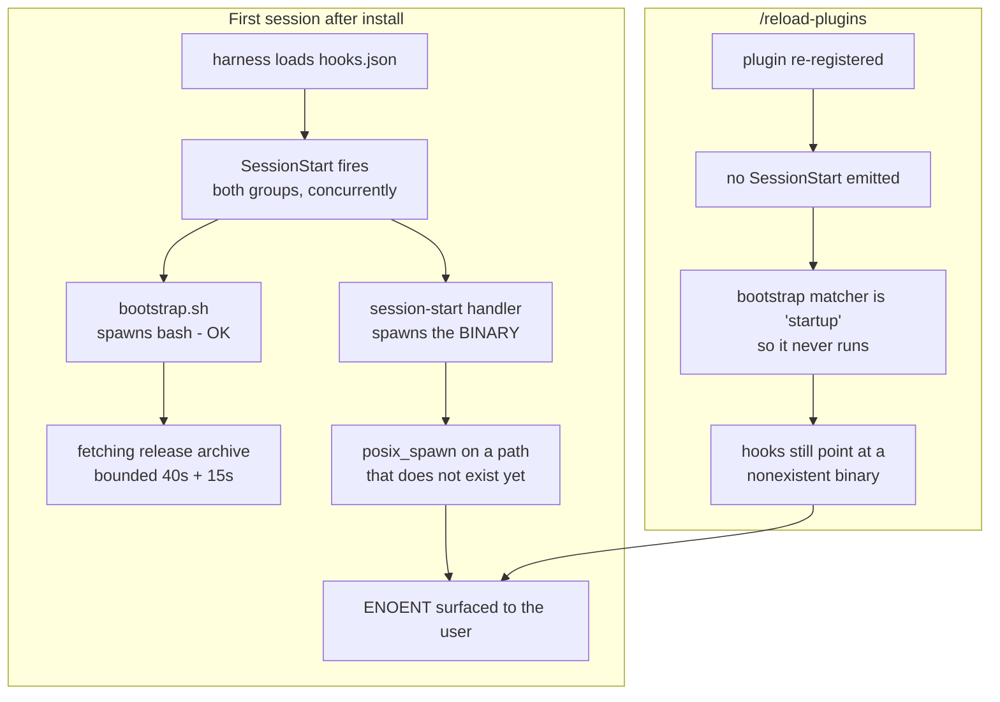

# Fix the plugin's first-session ENOENT

## Problem

The shipped plugin **errors** on a user's first session instead of being silently
inert. Reported symptoms: `ENOENT (posix_spawn), file does not exist` on first
launch, and no activation after `/reload-plugins`.

Both are one cause.

`plugin/hooks/hooks.json` declares five hook entries whose `"command"` is the
binary itself:

```plaintext
"command": "${CLAUDE_PLUGIN_DATA}/bin/ss-magic"
```

That binary is a release artifact fetched at runtime by `hooks/bootstrap.sh`,
which is itself just another `SessionStart` entry. **The manifest spawns an
artifact the manifest is responsible for creating, with nothing in between to
absorb its absence.** The harness `posix_spawn`s a path that does not exist yet
and the session surfaces ENOENT.

### The fail-open guarantee sits one layer too high

The plugin's hard rule is that a hook which cannot do its job exits 0 anyway.
That rule is real, and it is implemented **inside the binary**: `hook::run` in
[src/plugin/hook/mod.rs](../../src/plugin/hook/mod.rs) has no code path that
produces a non-zero exit, and handler panics are caught. None of that is
reachable when the binary is the missing thing.

The bootstrap entry already spawns `bash` with an args array. **The one entry
that could not assume the binary exists does it correctly; the other five do
not.**

### The prior plan specified the correct behaviour

R77 in [the plugin plan](./2026-08-29-001-feat-ss-magic-claude-plugin-plan.md),
verbatim:

> "**First install:** no binary exists at the invocation path, so every ss-magic
> hook is **inert** for that session through R26's fail-open path."

AE9 says the same: "Every hook is a no-op and the session behaves normally."
**Inert, not ENOENT.** This is a specification-versus-implementation gap, not a
missed requirement.

`plugin/bin/ss-magic-plugin`'s own header states the mechanism and handles it
correctly for the Bash tool: *"hooks on one event fire concurrently and the
bootstrap cannot be relied on to finish before a skill runs."* The wrapper got it
right. The manifest did not.

### Second symptom, same cause

Measured and recorded in
[plugin-assets.md](./2026-08-29-001-ss-magic-plugin/plugin-assets.md) and
`validation-evidence.md` Q2: the whole plugin is snapshotted at session start and
**nothing hot-reloads**. `/reload-plugins` emits no `SessionStart`, and the
bootstrap entry's matcher is `"startup"` (R76, deliberate), so the bootstrap
never runs on a reload and every hook keeps failing until a genuinely new
session.



### Why nothing caught it

**AE9 has no test.** The only `AE9` matches in the tree are an unrelated case in
[src/sync/reverse_sync/tests.rs](../../src/sync/reverse_sync/tests.rs). Every
Rust test exercises the binary *by running it*, so no test can observe the state
where it is absent. `scripts/test-bootstrap.sh` asserts on install **outcomes**,
never on hook **invocation** with no binary present. Nothing validates that
`hooks.json`'s `command` values are spawnable at all.

That is the coverage hole this plan closes, and it matters more than the four
lines of JSON: 1126 tests, three non-Rust suites, five review rounds and a Bugbot
pass all missed the single most user-visible failure mode in the product.

## Key technical decisions

### KTD1 - a dedicated silent shim, not the existing wrapper `session-settled:` no

`plugin/bin/ss-magic-plugin` already resolves the binary and exits 0 when it is
missing, so reusing it as the hook command is the obvious cheap move. **Rejected.**
The wrapper's `explain()` prints one line to **stderr** on every failure path,
which is correct for its consumer - a person running a skill through the Bash
tool, who needs to know why nothing happened. A `PreToolUse` hook fires on
essentially every tool call, so the same line would be emitted dozens of times per
session for the entire first session. Different consumer, different posture.

The shim shares the *resolution logic* by sourcing `lib/tmproot.sh` - the same
file the wrapper and the bootstrap already source - so the two cannot drift about
where the handoff lives. It does not share the messaging.

### KTD2 - the shim does NOT spawn the bootstrap `session-settled:` no

Settling the open question. A shim that spawned `bootstrap.sh` detached on a
missing binary would make `/reload-plugins` self-healing. **Rejected**, on three
grounds, the third decisive:

1. `PreToolUse` carries a 5 s timeout and fires on nearly every tool call. Even
   detached, this means a background network fetch the user never asked for,
   retried continuously until it succeeds.
2. The R80 install lock serialises concurrent installs with a 20 s wait, so dozens
   of queued attempts is a real cost, not a theoretical one.
3. **R79's one-time disclosure** names the machine-global hooks being registered
   and the binary being downloaded, and fires from the bootstrap's first
   successful run. Moving its trigger into a detached process spawned from an
   unrelated tool call means a consent notice appearing at an arbitrary moment, or
   being lost entirely. That is a disclosure regression, not a performance
   trade-off.

**Consequence, to be stated honestly in the docs rather than papered over:** after
this fix a `/reload-plugins` is silently inert, and the plugin activates at the
next session start. The error goes away; the activation delay does not.

### KTD3 - R76's matcher split is preserved `session-settled:` yes

Considered and rejected as out of scope: widening the bootstrap entry's matcher
from `startup` to the handler's broader set would mean fewer sessions run inert,
and the bootstrap's `already_installed` fast path makes a re-run nearly free. But
R76 settled `startup` deliberately, this change addresses neither reported
symptom, and `/reload-plugins` emits no `SessionStart` at all - so it would not
fix the second symptom either. Noted here so the option is not silently lost.

### KTD4 - the manifest invariant becomes a test, not a convention `session-settled:` no

The four JSON strings were never the real defect. The defect is that a manifest
*may* name a runtime-created artifact at all. The test therefore asserts the
property over every entry in `hooks.json`, so the class cannot return.

## Implementation units

### U1 - `plugin/hooks/run-hook.sh`

New file. Mirrors `bootstrap.sh`'s posture: no `set -e`, every path exits 0.

- Source `lib/tmproot.sh` relative to its own location, as the wrapper does.
- Resolve the data dir: prefer `$CLAUDE_PLUGIN_DATA` when set and non-empty (a
  hook process has the authoritative value); otherwise `ss_magic_resolve_root`
  in read-only mode and read the `SS_MAGIC_DATA_ROOT_FILE` handoff.
- Missing lib, unresolvable root, unreadable handoff, empty value, or a binary
  that is not executable: **exit 0, printing nothing on stdout and nothing on
  stderr.** Stdout silence is required because a `SessionStart` hook's stdout
  enters the model's context every session. Stderr silence is what distinguishes
  this from the wrapper (KTD1).
- Otherwise `exec "$bin" plugin hook "$1"`.
- Takes the event name as `$1`. A missing or empty `$1` exits 0 without spawning.

### U2 - `plugin/hooks/hooks.json`

All five entries move to the bootstrap's proven form:

```plaintext
"command": "bash",
"args": ["${CLAUDE_PLUGIN_ROOT}/hooks/run-hook.sh", "<event>"]
```

Both `SessionStart` groups and every matcher and timeout stay exactly as they are
(KTD3). Only the `command`/`args` pair changes.

### U3 - `scripts/test-bootstrap.sh`

Bash 3.2 only: no associative arrays, no `mapfile`, no `${var^^}`.

- **AE9, the missing case:** invoke the shim with no binary present. Assert exit
  0, **empty stdout**, empty stderr, and that no state was written.
- Same, with the data dir resolvable only through the R80 handoff (no
  `CLAUDE_PLUGIN_DATA` in the environment), covering the reload path.
- With a fake executable binary present, assert the shim `exec`s it with exactly
  `plugin hook <event>`, reusing the existing `fakebin.log` technique.
- **Manifest invariant:** every `"command"` in `hooks.json` is either a bare
  literal (`bash`) or a path under `${CLAUDE_PLUGIN_ROOT}` - never
  `${CLAUDE_PLUGIN_DATA}`, never any other runtime-created path.
- Placement: a new section after the existing wrapper tests, which already build
  the sandbox and `fakebin` scaffolding this needs.

### U4 - version surfaces and digest

A change under `plugin/` moves the zip digest. Bug fix, so **patch**: `0.10.0` ->
`0.10.1` across `Cargo.toml`, the `ss-magic` entry in `Cargo.lock`,
`plugin/.claude-plugin/plugin.json`, `plugin/ss-magic.version`, and the release
URL in `.claude-plugin/marketplace.json`. Then
`python3 scripts/build-plugin-zip.py --update-manifest`, then `--check`.

The builder normalises `*.sh` to 0755 automatically and has no hardcoded file
list, so the new shim needs no builder change.

### U5 - docs

- `CLAUDE.md`: the hooks description gains the shim and the reason for it; the
  non-Rust assets paragraph gains `run-hook.sh`.
- `README.md`: one short troubleshooting note that the first session after an
  install runs inert while the binary arrives, and that `/reload-plugins` does not
  install it - a new session does. Settles open area (b): yes, it is needed,
  because the honest consequence of KTD2 is user-visible.
- `.cursor/BUGBOT.md`, self-contained: no `hooks.json` command may name
  `${CLAUDE_PLUGIN_DATA}` or any runtime-created artifact, because fail-open must
  live in a shim that always exists rather than inside the thing that may be
  missing.

## Verification contract

All must pass:

- `cargo test --locked`
- `cargo build --release`, **0 warnings**
- `python3 scripts/build-plugin-zip.py --selftest`
- `python3 scripts/build-plugin-zip.py --check`
- `/bin/bash scripts/test-bootstrap.sh`
- `claude plugin validate . --strict`

**Prove the new AE9 test bites:** revert U2 (point one entry back at the binary)
and confirm the manifest-invariant assertion fails; revert U1's silence and
confirm the stdout assertion fails. Restore both. A test that has never failed has
not been shown to test anything - which is precisely how this bug shipped.

## Constraints

- Stay on `fix/plugin-first-session-spawn`. Never switch branches.
- Never bare `git stash` / `git stash pop`; the stash stack is shared across
  worktrees.
- Keep `.claude/settings.json`, `.claude/skills/`, `skills-lock.json` and
  `.scratchpad/` out of every commit.
- Preserve both plugin postures: a hook always exits 0 and prints only its JSON
  envelope on stdout, while secret-protecting gates refuse on "could not
  determine" as well as on "no".

## Out of scope

- Widening the bootstrap matcher (KTD3).
- Making `/reload-plugins` install the binary (KTD2).
- The six pre-existing unused imports in `src/tests/`, which are on `main` and
  unrelated.
