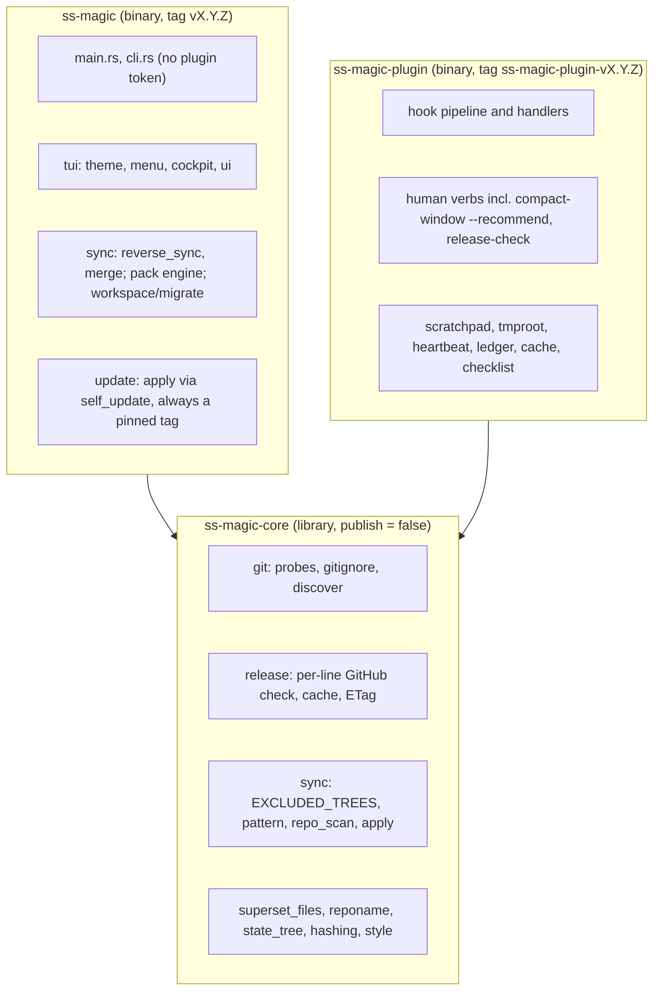
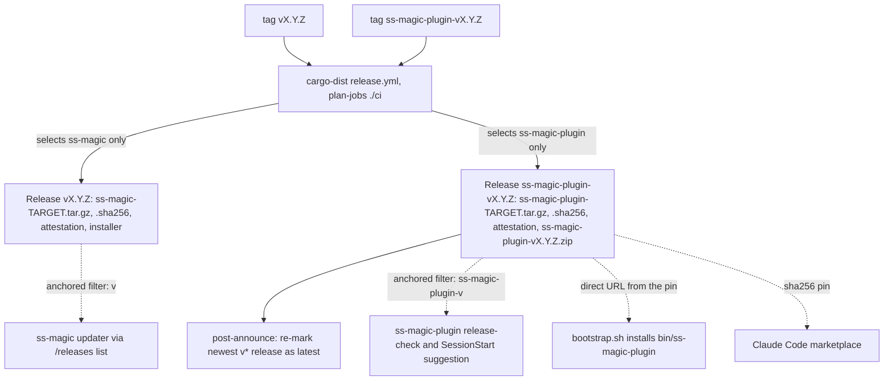
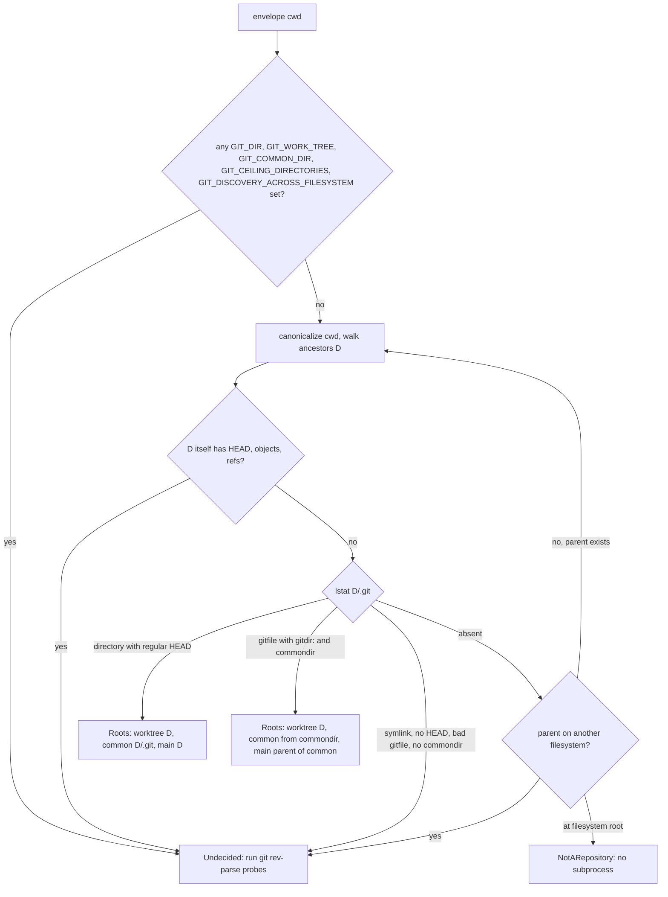
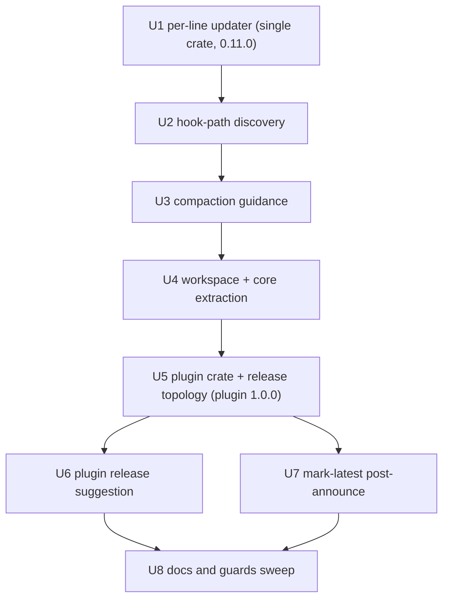

# Workspace Split and Independent Release Lines - Plan

## Goal Capsule

- **Objective:** A user of the `ss-magic` sync CLI and a user of the Claude Code plugin each receive updates on their own schedule, from their own release, without one line's release ever stalling, breaking, or being installed by the other; every session hook takes the subprocess-free root-discovery fast path, with the git probes reserved for the layouts discovery declines (an ENABLED hook still runs its `git check-ignore`, so the saving there is two subprocesses of three, and `SessionStart` gains cache and settings reads this plan adds); and a user discovers the `autoCompactWindow` opt-in, the recommended value for their repository, and a newer plugin release, without the tool ever writing a setting or performing an update on their behalf.
- **Means:** A three-crate Cargo workspace with two release lines on distinct, anchored tag shapes (KTD1, KTD3, KTD4); filesystem-only git root discovery on the hook path (KTD8); advice-only compaction and plugin-update guidance on the operator channel (KTD11, KTD12).
- **Authority hierarchy:** The eight settled decisions in the Key Technical Decisions are constraints. Product behavior is owned by the R-IDs; mechanism by the KTDs; units carry only local deltas. Repo conventions in `CLAUDE.md` bind every unit, with the two amendments this plan makes (R23, R11) applied in their own units.
- **Stop conditions:** Stop and report if `self_update` rejects a pinned `target_version_tag` for a plain `v` tag (it is the shape released today, so this is not expected); or if any unit cannot be made green on all four suites before commit.
- **Execution profile:** Deep. Eight units, each independently committable on branch `fix/plugin-first-session-spawn`, in the order given, never switching branches.
- **Tail ownership:** The implementing session commits per unit, runs the Verification Contract per unit, and leaves PR #7 open for review; tagging releases is a maintainer action described in Documentation / Operational Notes, not part of the units.

---

## Product Contract

### Summary

Split the single `ss-magic` crate into `ss-magic-core` (shared library), `ss-magic` (interactive sync CLI) and `ss-magic-plugin` (the Claude Code plugin's hook runtime and verb tree).
Release the two binaries independently: the CLI keeps `vX.Y.Z` tags, the plugin takes `ss-magic-plugin-vX.Y.Z`.
Make the CLI's self-updater resolve "newest release" per line, with an anchored tag filter, and never let the update backend choose "latest" itself.
Replace the two `git rev-parse` subprocesses on the hook path with filesystem discovery that falls back to git whenever it cannot decide.
Surface the existing `autoCompactWindow` opt-in with a recommendation computed from this repository's own recorded sessions, and advise removing a detected `CLAUDE_AUTOCOMPACT_PCT_OVERRIDE`.
Have the plugin notice a newer plugin release and suggest the `/plugin` update flow on the operator channel, once per release, silent in headless modes.

### Problem Frame

Plugin code is 65 percent of the source (research figure, not re-measured here) and its exclusion from self-update is a parse-layer convention (`Parsed::Plugin` is dispatched in a sibling arm of the update gate in `src/main.rs:109`), not a structural guarantee.
Both binaries ship from one `vX.Y.Z` tag, so a plugin-only fix forces a CLI release and vice versa.
The self-updater reads GitHub's repository-wide `releases/latest` (`src/update/check.rs:265`) and the forced `ss-magic update` path hands `None` to `self_update` (`src/update/mod.rs:69-70`), so a second release line in the same repository would make the CLI either stall silently or try to install a plugin release.
One `PreToolUse` hook spends 8.8 ms of its 16 ms in two `git rev-parse` subprocesses.
`compact-window --set` exists but nothing tells a user it exists, what value fits their project, or that a global `CLAUDE_AUTOCOMPACT_PCT_OVERRIDE` is the worse knob.
Once the plugin has its own release line, "is there a newer plugin release" becomes a well-defined question for the first time; the earlier decision not to have the hook shim spawn the bootstrap after `/reload-plugins` (documented in the README as a limitation) makes a suggestion the sanctioned counterpart to that rejected self-healing.

### Key Decisions

- **Independent release lines with a per-line, prefix-filtered self-updater** (session-settled: user-directed – chosen over one shared `vX.Y.Z` tag covering both binaries: the two audiences update through different machinery, and an unfiltered updater would try to move the CLI to a plugin release). Governs R8, R16, R17, R18.
- **Land everything in the open PR #7 on branch `fix/plugin-first-session-spawn`** (session-settled: user-directed – chosen over a separate branch and PR: the user reaffirmed after the blast-radius concern was raised). Governs R36.
- **Compaction guidance is advice only; nothing is written automatically** (session-settled: user-directed – chosen over applying a default window on `enable`: `compact-window --set` is the only writer, it refuses to overwrite a window already present, and the detected override lives in the user's global settings which this tool must never edit (the identifiers R30/R31 belong to the plugin-release cache and quiet-mode rules in THIS document; the compaction rules are R27/R28)). Governs R24, R27, R28.
- **A newer plugin release is suggested, never applied, and only where a user can see it** (user-directed scope addition: the plugin's new release line makes the question well-defined, and a once-per-release suggestion is what the R79 one-time consent disclosure permits where self-healing did not). Governs R29, R30, R31, R32.
- **The checklist-adoption feature for legacy `docs/actions/<slug>/CHECKLIST.md` repositories is out of scope** and must not appear here.

### Requirements

**Workspace split**

- R1. The repository is a Cargo workspace whose virtual root manifest owns `[profile.release]` and `[profile.dist]`, with members `crates/ss-magic-core` (library, `publish = false`), `crates/ss-magic` (binary `ss-magic`) and `crates/ss-magic-plugin` (binary `ss-magic-plugin`).
- R2. `ss-magic-plugin` has no dependency on `self_update`, `inquire` or `ratatui`, directly or transitively through `ss-magic-core`; the plugin cannot self-update or open a TUI by construction. This is asserted, not assumed: `cargo tree -p ss-magic-plugin -i <crate>` must report no match for each of the three, run in U5's test scenarios and in CI's plugin job, and `check_workspace_shape` asserts all three names are absent from BOTH the plugin and the core manifest. A plain `cargo build` cannot show a dependency is absent, so it is not the evidence for this requirement.
- R3. The CLI keeps a `plugin` subcommand for CONFIGURATION ONLY – `enable`, `disable`, `config get`, `config set [--local]`, plus a narrow `check` reporting whether the binary is installed at `${CLAUDE_PLUGIN_DATA}/bin/ss-magic-plugin`, whether it answers `--version` at the pin, whether `plugin.enabled` is true, and whether `.superset/.magic/` is ignored. Every other verb (`status`, `cost`, `compact-window`, `spill-index`, `scratchpad`, `conclude`/`conclusions`/`gc`, `bypass`, `expect-artifact`, `setup-github-ci`, `release-check`, the whole `checklist` tree) exists ONLY on `ss-magic-plugin`, and the configuration verbs exist ONLY on the CLI – they are not duplicated. Rationale, and why the split is drawn here:
  - **A person needs these four in a terminal.** `ss-magic` is what the shell installer puts on `PATH`; `ss-magic-plugin` installs into `${CLAUDE_PLUGIN_DATA}/bin/`, which is not on anyone's `PATH`, and KTD5 gives the plugin release no installer. Enabling the plugin for a repository is the one thing a person must be able to do before Claude Code can do anything for them, so it cannot live only where Claude Code can reach it.
  - **It makes the config-write boundary structural, which it is not today.** No shipped skill invokes a config-writing verb (verified: the only `config set` strings under `plugin/skills/` are prose describing dotted-key syntax). Once the verbs live solely on the CLI, the binary the harness spawns CANNOT write configuration at all – a repository cannot arrange its own enablement even if a hook were somehow induced to run a human verb. Today that property is held by the `HumanVerb::writes_config` convention inside one binary; after this it is held by the binary boundary, which is the same upgrade from convention to structure that KTD1 makes for the update gate.
  - **`status` deliberately does NOT come back.** `src/plugin/status.rs` imports `bypass, cache, checklist, compact_window, config, expect_artifact, identity, scratchpad, tmproot, heartbeat` – effectively the whole plugin tree – so hosting it on the CLI would undo R2 and most of the split. The narrow `check` above covers the one case the full `status` cannot: a bootstrap that never installed the binary, where `ss-magic-plugin status` is itself unrunnable. For every other question `check` prints the pointer to `ss-magic-plugin status`.
- R4. `ss-magic init` and `migrate` still write the `.superset/.magic/` gitignore rule eagerly, with the same rule text at the same location, before any plugin state exists; `ss-magic-plugin enable` and `config set plugin.enabled true` still write it lazily.
- R5. The `.superset/.magic` path has one owning constant in core; the `sync::EXCLUDED_TREES` entry and the state-tree rule are asserted equal by a core test.
- R6. The color palette and the color decision are shared; installing the `inquire` render config stays in the CLI.
- R7. Machine-level file locations are unchanged: heartbeat and cost ledger under the `ss-magic` data directory, version caches under the `ss-magic` cache directory, the R80 temporary root under `ss-magic-plugin/<identifier>`.

**Release topology and version surfaces**

- R8. `ss-magic` releases from tags of the exact shape `vMAJOR.MINOR.PATCH`; `ss-magic-plugin` releases from tags of the exact shape `ss-magic-plugin-vMAJOR.MINOR.PATCH`; a tag of one shape builds and publishes only that crate's artifacts.
- R9. Each release publishes per-target archives with a `.sha256` sibling and a build attestation: `ss-magic-<target>.tar.gz` containing `ss-magic-<target>/ss-magic`, and `ss-magic-plugin-<target>.tar.gz` containing `ss-magic-plugin-<target>/ss-magic-plugin`.
- R10. The plugin zip `ss-magic-plugin-v<V>.zip` is published on the plugin release, and `.claude-plugin/marketplace.json` pins `https://github.com/ViktorStiskala/superset-magic/releases/download/ss-magic-plugin-v<V>/ss-magic-plugin-v<V>.zip` by SHA-256.
- R11. `scripts/build-plugin-zip.py --check` asserts, in addition to the R101 sha256 key and the R96 digest pin: the CLI version group agrees (`crates/ss-magic/Cargo.toml`, the `ss-magic` entry in `Cargo.lock`, and – under R12a's `<=` rule rather than equality – `README.md`'s pinned installer tag, which must be a well-formed `v` + triple not exceeding the crate version; the same tag is used by the manual-download and attestation links); the plugin version group agrees (`crates/ss-magic-plugin/Cargo.toml`, the `ss-magic-plugin` entry in `Cargo.lock`, `plugin/.claude-plugin/plugin.json`, `plugin/ss-magic-plugin.version`, the marketplace URL's tag, the marketplace URL's asset name, the extra-artifact zip filename); the two groups' versions differ; every `plugin/hooks/hooks.json` entry spawns `bash` with `${CLAUDE_PLUGIN_ROOT}/hooks/run-hook.sh` or `${CLAUDE_PLUGIN_ROOT}/hooks/bootstrap.sh` as its first argument; `crates/ss-magic-plugin/Cargo.toml` declares no `self_update` dependency; `crates/ss-magic-core/Cargo.toml` declares `publish = false`.
- R12. After a plugin release is published, the newest `v*` release is re-marked as the repository's latest release, so `releases/latest` always resolves to a CLI release. This protects installed pre-split binaries, which poll `releases/latest` and parse only a bare triple.
- R12b. An intermediary CLI release, bare `v0.11.0`, is cut from the commit closing U3 – the last commit before the workspace split – and published BEFORE any plugin release exists. Its binary already resolves updates through the releases LIST with the anchored bare-CLI filter (R16, R17) rather than `releases/latest`, so every install that takes it becomes immune to the latest-mark race described in R12. This is not a tag-shape bridge: the CLI's shape never changes, and a 0.10.x binary would update to a post-split release perfectly well. Its purpose is to shrink, before the plugin line exists at all, the population whose update path depends on a mark that a plugin release transiently steals and a post-announce job has to give back. The commit closing U3 must therefore be a complete, releasable single-package tree: `--check` green with every surface at `0.11.0`.
- R12a. `README.md`'s documented install line pins the CLI's own release asset (`releases/download/v<V>/ss-magic-installer.sh`) rather than `releases/latest/download/…`, and the pinned tag becomes a CLI version surface asserted by `--check` (R11). The assertion is `<=`, NOT equality: the pin names the last PUBLISHED CLI release, and `--check` requires it to be a well-formed `v` + triple that does not exceed `crates/ss-magic/Cargo.toml`'s version. Equality was the obvious form and is wrong – the release procedure is bump, merge, then tag, so an equality assertion would make `main`'s README name an unreleased tag from the moment any CLI bump merges until the tag is pushed and cargo-dist finishes, turning a bounded post-plugin-release window into an unbounded pre-release one and 404-ing the documented command in it. Under `<=` a lagging pin points at an older release that still works, which is benign; the per-line release procedure gains a final step that advances the pin after the tag is published. A new user's install therefore does not depend on the latest mark at all, so the transient window after each plugin release – before the mark-latest job runs – cannot 404 the documented command. The manual-download link and the attestation example point at the same release.
- R13. `plugin/hooks/bootstrap.sh` installs `${CLAUDE_PLUGIN_DATA}/bin/ss-magic-plugin` from `releases/download/ss-magic-plugin-v<pin>/ss-magic-plugin-<triple>.tar.gz`, reads the pin from `plugin/ss-magic-plugin.version`, and verifies the `.sha256` sibling as today. It does NOT clean up a stale `${CLAUDE_PLUGIN_DATA}/bin/ss-magic` left by a pre-split install: `ss-magic plugin` is not used in production, so the plugin carries no migration code at all. A dogfooding machine that has one deletes it by hand; the file is inert either way, since nothing spawns that path once `hooks.json` and the wrapper name the new binary.
- R14. Every event entry in `plugin/hooks/hooks.json` keeps spawning `bash ${CLAUDE_PLUGIN_ROOT}/hooks/run-hook.sh <event>`; no entry names a binary.
- R15. The embedded CI workflow template installs `ss-magic-plugin` from the plugin tag and invokes `ss-magic-plugin checklist verify` and `render-md`. `classify`'s existing states are unchanged and no migration state is added: the previous template was never deployed to any repository, so no file rendered from it exists to migrate. A locally edited file still needs `--force`.

**Self-update per release line**

- R16. The CLI resolves its newest release by fetching `GET /repos/ViktorStiskala/superset-magic/releases?per_page=100` (first page only), dropping drafts and prereleases, keeping tags that match its line (R17), and selecting the greatest `(major, minor, patch)`; the 24 h cache and ETag `If-None-Match` handling are kept.
- R17. Tag matching is anchored at the start and exact: the CLI line accepts only `v` immediately followed by `MAJOR.MINOR.PATCH` and nothing else; the plugin line accepts only `ss-magic-plugin-v` immediately followed by `MAJOR.MINOR.PATCH` and nothing else; each line's filter rejects the other line's tags, `ss-magic-v…`, pre-release suffixes, extra components, and case variants.
- R18. No self-update apply path ever lets the backend choose a release: every `self_update` call pins `target_version_tag` to a tag resolved by the per-line check; `ss-magic update` resolves without the cache and reports "could not check for a release" when resolution fails, rather than "already latest".
- R19. A network failure, a non-200 status, a malformed body, or an unparseable tag remains a silent no-update on the gated path, as today.

**Hook-path git discovery**

- R20. On the hook path, the worktree root and the main checkout root are discovered without spawning a process; when discovery declines, the existing `git rev-parse --show-toplevel` and `--git-common-dir` probes run; a fast answer is always byte-equal to the subprocess answer.
- R21. Discovery declines and falls back when any of `GIT_DIR`, `GIT_WORK_TREE`, `GIT_COMMON_DIR`, `GIT_CEILING_DIRECTORIES`, `GIT_DISCOVERY_ACROSS_FILESYSTEM` is set; when `.git` is a symlink; when a `.git` directory has no regular `HEAD` file; when a gitfile does not start with `gitdir:`, its target cannot be canonicalized, or its target has no `commondir` file; when an ancestor itself looks like a git directory (`HEAD`, `objects`, `refs`); or when the walk would cross a filesystem boundary.
- R22. The CLI's own commands keep the subprocess probes; discovery is wired only into the plugin's hook pipeline.
- R23. The convention "No `git2` – all git/gh interactions shell out" is amended to: all git and gh COMMANDS shell out; `git::discover` is the one filesystem-only reduction of two read-only probes and must never grow ref, index, or write handling; no git-binding crate (`git2`, `gix`) is added.

**autoCompactWindow guidance**

- R24. `ss-magic-plugin compact-window --recommend [--json]` prints whether `CLAUDE_AUTOCOMPACT_PCT_OVERRIDE` is set and where it was found, the `autoCompactWindow` configured in the project's local and tracked settings files, a recommended window with its basis, and the exact `compact-window --set <N>` command; it writes nothing and exits 0.
- R25. The recommendation uses the newest 20 cost-ledger rows attributable to this repository that carry `peak_context_tokens`; `recommended = clamp(ceil_to_10000(1.25 × max_peak), 100000, 1000000)`; three or more rows give confidence `high`, one or two give `low`, none gives no number and the generic guidance instead.
- R26. The cost ledger records `peak_context_tokens` per session: the maximum over the main transcript's assistant messages of `input_tokens + cache_read_input_tokens + cache_creation_input_tokens`, maintained as a running maximum across incremental scans; rows written before the field exists are ignored by R25.
- R27. Three more surfaces advise without writing: `status` gains a `compaction` section and a `problems` line when the override is set and no window is configured; `enable` prints one tip line when no window is configured; `SessionStart` with source `startup` emits one `systemMessage` per machine when the override is present in the hook's environment and no window is configured.
- R28. The tool never edits `~/.claude/settings.json`, the project's tracked `.claude/settings.json`, or any managed settings file, and never removes the override; `compact-window --set` remains the only write and keeps its R30/R31 behavior.

**Plugin release suggestion**

- R29. On `SessionStart` with source `startup`, when the cached newest plugin release is greater than the pin in `${CLAUDE_PLUGIN_ROOT}/ss-magic-plugin.version`, the hook emits one `systemMessage` naming the release and the remedy "run `/plugin`, update ss-magic there, then `/reload-plugins`"; at most once per newest tag per machine; never on `additionalContext`.
- R30. The `SessionStart` hook performs no network I/O for this: it reads the plugin release cache; when the cache is missing or older than 24 h it spawns a detached `ss-magic-plugin release-check --refresh` and returns without waiting. The spawn is gated on the SAME `hook::quiet_mode` verdict R31 uses for the notice: a session that can never display the suggestion must not fork a process that outlives it to make an outbound request on the operator's behalf.
- R31. The suggestion is suppressed when the envelope's `permission_mode` is `bypassPermissions` or `dontAsk`, when `CLAUDE_CODE_ENTRYPOINT` is set to a value other than `cli`, when the source is not `startup`, or when the cache is missing, unreadable, malformed, or names a tag that fails the plugin line's filter; suppression is silence, never a block or an error.
- R32. The plugin never updates itself; `release-check --refresh` writes only the cache file.
- R33. `ss-magic-plugin release-check [--refresh] [--json]` reports the newest known plugin release, the pin, and the running binary version; `--refresh` performs one bounded (5 s) fetch under a non-blocking lock and exits 0 whether or not the fetch succeeded.

**Documentation and guards**

- R34. `CLAUDE.md`, `README.md`, `CONTRIBUTING.md`, `.cursor/BUGBOT.md` and `docs/runbooks/forge-tag-and-release-protection.md` describe the workspace, the two release lines, the version groups, the discovery convention, and the new verbs; `.cursor/BUGBOT.md` stays self-contained. README must be explicit about WHICH binary answers a given verb (R3): `ss-magic plugin enable|disable|config|check` are typed in a terminal, every other verb is `ss-magic-plugin <verb>` and is normally reached through Claude Code, whose Bash tool has the wrapper on `PATH`.
- R35. CI runs `cargo test --workspace --locked`; the R98 bump-check baseline considers both tag shapes; the asset-build step reads the extra-artifact filename from its new location; a grep guard rejects the spelling `ss-magic plugin ` in `plugin/skills/`, `README.md`, `CONTRIBUTING.md`, `CONCEPTS.md` and `.cursor/BUGBOT.md` – the last three carry the stale spelling in the tree today (`CONCEPTS.md:315`, `CONTRIBUTING.md:101`, `.cursor/BUGBOT.md:34,492,908`) and `.cursor/BUGBOT.md` is required by this repo's conventions to stay self-contained and synchronised, so leaving them unguarded lets KTD14's removed token reappear undetected; a grep guard rejects any `releases/latest/download/` URL in `README.md` (R12a); and the plan phase fails when `GITHUB_REF_TYPE` is `tag` and the tag matches neither `^v[0-9]+\.[0-9]+\.[0-9]+$` nor `^ss-magic-plugin-v[0-9]+\.[0-9]+\.[0-9]+$` – a prefixed CLI tag such as `ss-magic-v0.11.1` would otherwise release the CLI under a shape the R17 filter and every pre-split binary ignore, stranding the line silently. (The EQUAL-version collision needs no separate guard here: a bare `v*` tag announces both packages only when their versions MATCH, which `--check`'s distinct-line guard already refuses in the same plan phase. An earlier draft of this requirement had the condition inverted, rejecting the differing-version case that is in fact the correct one.)
- R36. `cargo test --workspace`, `scripts/test-bootstrap.sh`, `build-plugin-zip.py --selftest` and `--check` are green at every unit's commit.

### Acceptance Examples

- AE1. Per-line selection ignores the other line
  - **Covers:** R16, R17
  - **Given:** The releases endpoint returns, in creation order, `ss-magic-plugin-v1.2.0`, `v0.11.3`, `v0.12.0` (draft), `ss-magic-v0.13.0`, `v0.11.10`, `v0.9.0-rc1`.
  - **When:** The CLI at 0.11.3 runs its check.
  - **Then:** It selects `v0.11.10` (numeric compare beats `v0.11.3`, the draft and the prefixed tags are dropped) and reports `Newer { tag: "v0.11.10" }`.
- AE2. The plugin filter rejects CLI tags and vice versa
  - **Covers:** R17
  - **Given:** Tags `v1.0.0`, `ss-magic-plugin-v1.0.0`, `ss-magic-v1.0.0`, `xv1.0.0`, `V1.0.0`, `ss-magic-plugin-v1.0.0.zip`, `v1.0.0-rc1`, `v1.0`.
  - **When:** Each line's `parse_line_tag` is applied.
  - **Then:** The CLI line accepts only `v1.0.0`; the plugin line accepts only `ss-magic-plugin-v1.0.0`; everything else is rejected by both.
- AE3. Forced update never asks the backend for latest
  - **Covers:** R18
  - **Given:** `ss-magic update` is run.
  - **When:** The uncached per-line resolution fails (offline).
  - **Then:** Output is "could not check for a release; try again", exit 0, and `self_update` was not invoked at all.
- AE4. A stale cache from a pre-split binary is harmless
  - **Covers:** R17, R19
  - **Given:** `version-check.json` holds `tag_name: "ss-magic-plugin-v1.0.0"` (written by nothing today, but representable) and is fresh.
  - **When:** The CLI runs its check.
  - **Then:** The verdict is `UpToDate`; no download is attempted.
- AE5. Discovery agrees with git in a linked worktree
  - **Covers:** R20
  - **Given:** A main checkout at `M` and `git worktree add W`, with the hook `cwd` at `W/src/deep`.
  - **When:** `git::discover::roots(cwd)` runs.
  - **Then:** It returns `worktree_root = canonical(W)` and `main_checkout_root = canonical(M)` without a subprocess, equal to `git::cwd_repo_root` and `git::main_checkout_root`.
- AE6. Discovery declines rather than guessing
  - **Covers:** R21
  - **Given:** `cwd` is `M/.git/hooks`, or `GIT_DIR` is set, or `M/.git` is a symlink, or `W/.git` is a gitfile whose target has no `commondir`.
  - **When:** Discovery runs.
  - **Then:** It returns `Undecided(reason)`, the subprocess probes run, and the hook's answer equals today's answer (including an error for the `.git/hooks` case).
- AE7. Recommendation degrades to guidance
  - **Covers:** R24, R25
  - **Given:** No ledger row for this repository carries `peak_context_tokens`.
  - **When:** `compact-window --recommend` runs.
  - **Then:** The report shows the override findings and the configured windows, says "no recorded sessions for this repository yet", prints the generic range guidance and the `--set` syntax, and exits 0.
- AE8. Recommendation from recorded sessions
  - **Covers:** R25
  - **Given:** Five matching rows with peaks 143,000, 151,200, 96,000, 210,400, 180,000.
  - **When:** `--recommend` runs.
  - **Then:** `1.25 × 210400 = 263000` rounds up to 270,000; confidence `high`; the basis line names five sessions and the peak.
- AE9. Override detected in the user's global settings
  - **Covers:** R24, R28
  - **Given:** `~/.claude/settings.json` has `env.CLAUDE_AUTOCOMPACT_PCT_OVERRIDE = "60"` and the project sets no window.
  - **When:** `--recommend` runs from a terminal (variable not in the process environment).
  - **Then:** The report names that file as the location, advises removing the key by hand, states that this tool never edits that file, and recommends the `--set` command.
- AE10. Plugin update suggested once
  - **Covers:** R29, R31
  - **Given:** Pin `1.0.0`, cache newest `ss-magic-plugin-v1.1.0`, `suggested` empty, source `startup`, `permission_mode` `default`.
  - **When:** `SessionStart` runs twice.
  - **Then:** The first run's `systemMessage` names `ss-magic-plugin-v1.1.0` and the `/plugin` then `/reload-plugins` flow; the second run emits nothing because `suggested` now equals that tag; `additionalContext` never mentions it.
- AE11. Headless session stays silent
  - **Covers:** R31
  - **Given:** The same cache as AE10 and `permission_mode: "bypassPermissions"` (or `CLAUDE_CODE_ENTRYPOINT=sdk-ts`).
  - **When:** `SessionStart` runs.
  - **Then:** No `systemMessage`; the heartbeat row's detail records `release suggestion suppressed (quiet mode)`; exit 0.
- AE12. Session start is not delayed by the check
  - **Covers:** R30
  - **Given:** The plugin release cache is absent and the network is unreachable.
  - **When:** `SessionStart` runs.
  - **Then:** The handler returns within its normal budget (no client is constructed in the hook path), a detached `release-check --refresh` process was spawned, and the next `startup` reads whatever that process cached.
- AE13. `--check` catches a version collision
  - **Covers:** R11
  - **Given:** `crates/ss-magic/Cargo.toml` and `crates/ss-magic-plugin/Cargo.toml` both read `0.12.0`.
  - **When:** `build-plugin-zip.py --check` runs.
  - **Then:** It fails with `distinct release lines: ss-magic and ss-magic-plugin both declare 0.12.0; a bare v0.12.0 tag would announce both`.

### Scope Boundaries

- **Deferred for later:** memoizing the `git check-ignore --no-index` gate on the hook path (a third subprocess on every enabled state-writing hook; see Sources); using discovery from the CLI's own commands; a `FileChanged` manifest entry; Windows targets.
- **Outside this work's identity:** adding `gix` or `git2`; a plugin self-update of any kind; automatic removal of `CLAUDE_AUTOCOMPACT_PCT_OVERRIDE`; the checklist-adoption feature for legacy `CHECKLIST.md` repositories (separate queued work).

### Dependencies

- cargo-dist 0.32.0 (pinned in `dist-workspace.toml`) must release one member on a bare `vX.Y.Z` tag while another member is at a different version and releases on `<package>-vX.Y.Z`; verified in U5 with a named fallback (KTD5).
- `self_update` 0.44 must honor `target_version_tag` for a tag of the plain `v` shape (this is the shape released today, so the existing smoke path already exercises it).
- The `gh` CLI must be able to run `gh release edit <tag> --latest` from a cargo-dist post-announce job (KTD6; manual fallback documented).

### Open Questions

All are non-blocking; each has a named fallback in its KTD and is verified inside the unit that depends on it.

- ANSWERED 2026-09-03: cargo-dist 0.32 accepts the asymmetric tag shapes, and honors package-level `extra-artifacts` and `installers = []`. Measured with `dist plan` on a scratch workspace of the proposed shape; see KTD5.
- Deferred: whether a post-announce job's token may edit releases (KTD6, U7).
- Deferred: whether the harness sends `permission_mode` on `SessionStart` envelopes and exports `CLAUDE_CODE_ENTRYPOINT` to hook processes (KTD12, U6; captured the same way `docs/plans/2026-08-29-001-ss-magic-plugin/hook-contract.md` captured its payloads).

---

## Planning Contract

### Key Technical Decisions

- KTD1. **Three-crate workspace: `ss-magic-core` library, `ss-magic` binary, `ss-magic-plugin` binary** (session-settled: user-directed – chosen over one binary whose plugin exclusion from self-update is held by the `should_run_update_gate` inclusion list: plugin code is 65 percent of the source and the separation is a parse-layer convention rather than structure). Layout: virtual root `Cargo.toml` (`[workspace] members`, `resolver = "2"`, `[workspace.package]` for `edition`/`repository`/`license`, both profiles), `crates/ss-magic-core`, `crates/ss-magic`, `crates/ss-magic-plugin`. Test helpers shared across crates live in core behind a `testutil` feature enabled only from the two binaries' `[dev-dependencies]` (resolver 2 keeps dev-feature unification out of normal builds).
- KTD2. **Core boundary.** Core owns: `git/` (probes, `gitignore`, new `discover`), `hashing`, `style` (palette, `OnceLock`, `init`/`init_no_color`/`enabled`/`paint`, the role functions, `print_section`; no `inquire`), `sync/` (`EXCLUDED_TREES`, `under_excluded_tree`, `pattern`, `repo_scan`, `apply`), `superset_files`, `reponame` (`repo_name_stem`, `stem_from_origin`, `sanitize_segment` extracted from `pack.rs`), `state_tree` (`STATE_REL`, `ensure_state_ignored`), `release` (the per-line GitHub check from `update/check.rs`, `REPO_SLUG`, `cache_dir`). The CLI keeps `main.rs`, `cli.rs`, `pack.rs` (engine, `archive_file_name`), `sync/{reverse_sync, merge}` (they call the cockpit), `tui/` (plus a new `tui/theme.rs` installing the `inquire` render config from `style::enabled()`), `workspace/migrate.rs`, `update/{mod, apply}`. The plugin keeps everything under today's `src/plugin/` (`atomic`, `tmproot`, `heartbeat`, `ledger`, `cache`, `scratchpad`, `hook/`, `checklist/`, …). Chosen over moving `reverse_sync` into core with an inverted cockpit dependency: that is a behavioral refactor the split does not need, and the plugin never calls reverse sync.
- KTD3. **Tag shapes: the CLI keeps the plain `vX.Y.Z` tag; the plugin takes `ss-magic-plugin-vX.Y.Z`** (session-settled: user-directed – chosen over giving both lines a prefix, or moving the CLI to a prefixed shape: every published release and the marketplace download URL already embed the plain form, so renaming that line retroactively would strand the installed base and break the digest pin). The plugin prefix `ss-magic-plugin-v` is chosen over the shorter `plugin-v` because the release already publishes an asset literally named `ss-magic-plugin-v0.10.3.zip`, and because it is cargo-dist's native `<package>-v<version>` form for the `ss-magic-plugin` package, so no tag-namespace configuration is needed for that line. Consequences: the marketplace URL becomes `…/releases/download/ss-magic-plugin-v1.0.0/ss-magic-plugin-v1.0.0.zip` (tag and asset both carry the prefix; the asset name shape is unchanged); the extra-artifact filename stays `ss-magic-plugin-v<V>.zip`; the bootstrap URL becomes `…/releases/download/ss-magic-plugin-v<pin>/ss-magic-plugin-<triple>.tar.gz`. The alternative of prefixing BOTH lines (`ss-magic-vX.Y.Z` plus `ss-magic-plugin-vX.Y.Z`) was raised and
verified to work too, but was rejected on evidence: with no bare `v*` line, `releases/latest` resolves to
whichever line published most recently, so it needs the same U7 mark-latest job AND a transitional bare
release to carry the installed base across, AND a hard rollout ordering constraint whose violation strands
pre-split binaries permanently. Keeping the CLI bare needs only U7. The two crates must never share a version string at a tagging moment, because a bare `v0.12.0` would announce every package at 0.12.0; R11's distinct-line guard is the mechanical backstop.
- KTD4. **Per-line release resolution in core `release`, anchored exact-match filters, always-pinned apply** (inherits the Key Decision on independent release lines: session-settled: user-directed – chosen over one shared `vX.Y.Z` tag covering both binaries: different audiences and update machinery, and an unfiltered updater would try to update the CLI to a plugin release; governs R16, R17, R18). Three code paths change, and the second is the one a reviewer would miss. (1) `check.rs`: `UreqReleaseClient` fetches `/repos/{slug}/releases?per_page=100`, which is paginated (a line that has not released in the last 100 releases reads as "no update" – conservative and documented), includes drafts and prereleases (filtered out to preserve today's `releases/latest` semantics), and is ordered by creation time, so selection parses every candidate and takes the greatest triple rather than the first match; the `Cache { checked_at, tag_name, etag }` shape is kept so an existing cache file parses. (2) `update/mod.rs`: `apply_update(&lock, None)` and `apply_update_unlocked(None)` are removed; `run_self_update(tag: &str)` takes a mandatory tag, and `update_command` resolves it through `release::resolve_newest_uncached(&CLI_LINE)` first – `None` is no longer expressible at the type level, and a unit test pins that the force path maps a failed resolution to a new `UpdateReport::Unavailable` without constructing the backend. (3) `apply.rs`: `BIN_NAME` stays `"ss-magic"` and `bin_path_in_archive` stays `{{ bin }}-{{ target }}/{{ bin }}` because cargo-dist names each app's archive `<app>-<target>` with the binary nested one directory deep; a test asserts `BIN_NAME == env!("CARGO_PKG_NAME")`. The plugin binary has no `bin_path_in_archive` at all: only `bootstrap.sh` resolves its archive (`ss-magic-plugin-<triple>/ss-magic-plugin`, flat fallback kept). `REPO_SLUG` stays shared in core – one repository, two lines – which is why the filter is mandatory. Filters are `parse_line_tag(line, tag)`: `tag.strip_prefix(line.tag_prefix)` then exactly three ASCII-digit components separated by `.` with nothing before or after; `CLI_LINE.tag_prefix = "v"`, `PLUGIN_LINE.tag_prefix = "ss-magic-plugin-v"`; the mutual-exclusion tests are named in U1.
- KTD5. **What is needed from cargo-dist 0.32, and the fallback.** Needed: `members = ["cargo:."]` sees the workspace; a bare `vX.Y.Z` tag selects exactly the `ss-magic` package while `ss-magic-plugin` sits at a different version; `ss-magic-plugin-vX.Y.Z` selects exactly the plugin package; `plan-jobs = ["./ci"]` stays workspace-level and gates both lines on the full suite; `github-attestations = true` attests whichever app's archives a tag builds; `installers = ["shell"]` applies to the CLI only (plugin package sets `installers = []`); the plugin zip moves from `[[dist.extra-artifacts]]` in `dist-workspace.toml` to `[package.metadata.dist] extra-artifacts` on the plugin crate so it rides plugin releases only, **and that entry MUST carry `working-dir = "../.."`** (see the measurement below); core sets `dist = false`. **VERIFIED 2026-09-03** against `dist` 0.32.0, the version this repo pins, using a scratch workspace of the
exact proposed shape (three members, `ss-magic-plugin` 1.0.0, core `dist = false`). The first run used
`ss-magic` 0.11.0; it was re-run at `ss-magic` 0.11.1 after KTD7's unconditional bump, with identical results:

```plaintext
dist plan --tag v0.11.0                 -> releases: [ss-magic 0.11.0], artifacts include ss-magic-installer.sh
dist plan --tag ss-magic-plugin-v1.0.0  -> releases: [ss-magic-plugin 1.0.0], artifacts include ss-magic-plugin-v1.0.0.zip
```

**The `working-dir` key is load-bearing, and `dist plan` cannot tell you so.** A package-level
extra-artifact's build command runs with its working directory resolved against the CRATE root, not the
workspace root. Measured 2026-09-03 on the same scratch workspace: with the entry written the obvious way
(`build = ["python3", "scripts/build-plugin-zip.py"]`, no `working-dir`), `dist plan --tag
ss-magic-plugin-v1.0.0` cheerfully LISTS the zip, and then `dist build --artifacts=global` fails:

```plaintext
building extra artifacts target (via python3 scripts/build-plugin-zip.py)
python3: can't open file '<ws>/crates/ss-magic-plugin/scripts/build-plugin-zip.py': No such file or directory
  x failed to exec build: python3 (status: exit status: 2)
```

That failure lands in `build-global-artifacts`, i.e. AFTER the tag is pushed, and it is invisible to every
`dist plan` check – which is exactly why the plan-only verification below could not have caught it. Adding
`working-dir = "../.."` to the `[[package.metadata.dist.extra-artifacts]]` entry fixes it completely and was
verified end to end on the same workspace: the build command then runs at the workspace root, `scripts/` and the
`artifacts` relpath both resolve, and `ss-magic-plugin-v1.0.0.zip` is collected into `target/distrib/`. The CLI
tag's isolation is unaffected – `dist build --artifacts=global --tag v0.11.1` on the same tree builds only
`ss-magic-installer.sh` and never runs the plugin's build command at all. No change to
`scripts/build-plugin-zip.py`'s own path handling is needed.

The asymmetric shape is supported. cargo-dist parses a tag as `[PACKAGE_NAME-]VERSION`; with no package name it
announces every dist-able package AT THAT VERSION, which is why R11's distinct-version guard is what makes the
bare tag select the CLI alone rather than both. Package-level `[[package.metadata.dist.extra-artifacts]]` is
honored (the zip appeared only on the plugin tag), `installers = []` on the plugin package is honored (the
installer appeared only on the CLI tag), and `dist = false` kept core out of both. Fallbacks A and B below are
therefore NOT needed and are retained only as a record of what was considered; U5 re-runs the two `dist plan`
invocations against the real tree as a regression check, not as a decision point – and, because `dist plan`
provably does not execute an extra-artifact's build command, U5 ALSO runs `dist build --artifacts=global --tag
ss-magic-plugin-v1.0.0` (the zip must be produced) and `dist build --artifacts=global --tag v0.11.1` (the plugin
build command must not run at all). Fallback A (extra-artifacts only): if package-level `extra-artifacts` is not honored, keep it in `dist-workspace.toml`; the zip then also rides CLI releases, harmless because the marketplace pins the plugin tag's copy. Fallback B (asymmetric tags refused): the plugin crate sets `dist = false`; a hand-written `.github/workflows/release-plugin.yml` triggered on `ss-magic-plugin-v*` builds the four target archives with `cargo build --release -p ss-magic-plugin`, packs `ss-magic-plugin-<target>/ss-magic-plugin` into `.tar.gz` with a `.sha256` sibling in `sha256sum` format, attests with `actions/attest-build-provenance`, builds the zip, and publishes with `gh release create --latest=false`; `allow-dirty = ["ci"]` and a narrowed `tags: ['v[0-9]+.[0-9]+.[0-9]+']` trigger keep cargo-dist off plugin tags; `ci.yml` is invoked from that workflow as a gate.
- KTD6. **`releases/latest` stays on the CLI line.** A cargo-dist `post-announce-jobs = ["./mark-latest"]` reusable workflow runs `gh release edit "$(newest v* tag)" --latest` whenever the announced tag starts with `ss-magic-plugin-v`. Reason: pre-split binaries in the field poll `releases/latest` and parse only `vX.Y.Z`; the README's installer URL used to use `releases/latest/download/ss-magic-installer.sh` – R12a replaces it with a pinned `releases/download/v<V>/…`, so mark-latest now protects only the pre-split installed base, not new installs. Fallback: a documented manual step in `CONTRIBUTING.md` after every plugin release. New binaries do not depend on "latest" at all (KTD4).
- KTD7. **Version numbers.** U1 bumps the single crate to `0.11.0` on all seven current surfaces (the updater change is user-visible behavior). The split bumps the CLI to `0.11.1` and starts the plugin at `1.0.0`: its first standalone release line, and a number that cannot collide with the CLI's `0.x` line for the foreseeable future (KTD3). Core carries `0.1.0`, `publish = false`, is never a release surface, and is bumped only on an incompatible change to its API. `Cargo.lock` is regenerated by `cargo build`, never edited by a blind version replace: the file holds one `[[package]]` per crate and other crates can share a version string, so a bump script must match on the `name = "…"` line (today no other package shares `0.10.3`, but the trap is structural). The `0.11.1` bump is UNCONDITIONAL, not a fallback: R12b consumes `v0.11.0` on the pre-split commit, so the post-split tree can never be tagged `v0.11.0`; and R3 removes the `plugin` subcommand, a user-visible CLI change this repo's conventions require a bump for. The earlier "one bump per PR" framing does not survive R12b – the PR necessarily ships two CLI versions, the intermediary and the post-split one.
- KTD8. **Filesystem-only root discovery with a git fallback** (session-settled: user-directed after requiring verification – chosen over combining the two `rev-parse` flags into one call: measured, the combined call was 0.48 ms slower, subprocess-free was 67 percent faster). Algorithm in `git/discover.rs`: if any of the five `GIT_*` variables in R21 is set, return `Undecided`; canonicalize `cwd`; walk ancestors `D`; at each `D`: if `D/HEAD` is a regular file and `D/objects` and `D/refs` are directories, return `Undecided("inside a git directory or bare repository")`; `lstat(D/.git)`: symlink → `Undecided`; directory → require regular `D/.git/HEAD`, then `Roots { worktree_root: D, common_dir: D/.git, main_checkout_root: D }`; regular file → read at most 4 KiB, require the `gitdir: ` prefix, resolve the path relative to `D`, canonicalize (failure → `Undecided`), require `<gitdir>/commondir` (absent → `Undecided`, the submodule shape), resolve it relative to the gitdir, canonicalize, and return `Roots { worktree_root: D, common_dir: C, main_checkout_root: canonical(parent(C)) }`; absent → if `parent(D)` has a different `st_dev`, `Undecided("filesystem boundary")`, else continue; at the filesystem root, `NotARepository`. `roots(cwd)` maps `Found` to its roots, `NotARepository` to `None` without a subprocess, and `Undecided` to today's `cwd_repo_root` + `main_checkout_root` calls. The `Undecided` set is deliberately wide: the fast path must never return a wrong answer, and the fallback is always correct. The literal `.`/`..` handling is not reimplemented; `canonicalize` owns it.
- KTD9. **Keep `opt-level = "z"` for both binaries** (session-settled: user-approved – chosen over `opt-level = 3` for `ss-magic-plugin`: measured 0.13 ms for a 47 percent larger binary). The profiles move to the virtual root unchanged.
- KTD10. **`run-hook.sh` stays the only spawn path; the data-dir binary and the pin file are renamed** (session-settled: user-approved – chosen over naming `ss-magic-plugin` directly in `hooks.json` now that it is its own binary: the binary is fetched at runtime, so naming it reproduces the ENOENT first-session failure this branch exists to fix). Inside the tree: `bin/ss-magic-plugin` under `${CLAUDE_PLUGIN_DATA}`, `plugin/ss-magic-plugin.version`, `exec "$bin" hook "$event"` in the shim and `exec "$bin" "$@"` in the wrapper; the binary answers `-V`/`--version` with `ss-magic-plugin <version>` on one line and exit 0 AHEAD of verb parsing (U5's Approach specifies this; it is restated here because `bootstrap.sh` gates every install on `"$staged_bin" --version | head -1 | awk '{print $NF}'` equalling the pin, and `status` probes the same flag for drift – a binary that answered the flag with usage-and-exit-2 would make the bootstrap discard every download) (the binary's own argv has no `plugin` token, so a skill's `ss-magic-plugin checklist list` is exactly the binary's argv), marker files unchanged, `MANIFEST_NAME` and the marketplace plugin name unchanged (`ss-magic`, so `${CLAUDE_PLUGIN_DATA}` and all state stay where they are).
- KTD11. **Advice-only compaction guidance with a ledger-derived recommendation** (inherits the Key Decision on advice only: session-settled: user-directed – chosen over applying a default window on `enable`: `compact-window --set` is the only writer, it refuses to overwrite an existing window, and the override lives in global settings this tool must never edit (R27/R28 here; R30/R31 in this document are the plugin-release rules); governs R24, R27, R28). The heuristic in R25 is grounded in this repository's own sessions because context need is a property of how the repository is worked on, not of its size; the 1.25 factor leaves headroom above the largest observed context so auto-compaction does not fire at the point the largest session needed; rounding up to 10,000 keeps the number readable; the clamp is the harness's own accepted range. Repository attribution reuses `git::discover` on each row's `root` (rows whose root discovers to the same main checkout as the current directory), so worktrees of one repository pool together and a deleted worktree simply drops out. Override detection reads the process environment and the `env` blocks of `${CLAUDE_CONFIG_DIR:-~/.claude}/settings.json`, `<repo>/.claude/settings.json`, `<repo>/.claude/settings.local.json`, and the platform managed-settings file when readable, reporting each location found.
- KTD12. **Plugin release suggestion: cache-only hook, detached refresh, quiet-mode suppression, once per tag.** Reuses core `release` (`PLUGIN_LINE`, cache file `plugin-release-check.json` in the shared cache dir, the same ETag and 24 h rules) rather than a second implementation, because the anchored filter, the pagination semantics and the draft/prerelease exclusion must be identical for both lines and are tested once. The hook path constructs no HTTP client: `session_start.rs` reads the cache and, when stale, spawns `current_exe() release-check --refresh --quiet` detached (`process_group(0)`, stdio null, child dropped) so session start never waits on the network. `Cache` gains `#[serde(default)] suggested: Option<String>`, written by the hook under `tmproot::try_with_lock` (contention → skip, at worst one duplicate line). Quiet mode is the shared helper U3 ALREADY LANDED – `hook::quiet_mode(envelope: &Envelope, entrypoint: Option<&OsStr>) -> Option<&'static str>` (`src/plugin/hook/mod.rs:156`), with `Common.permission_mode: Option<String>` added alongside it (`src/plugin/hook/event.rs:89`, commit 53f9477). U6 only CALLS it; neither `hook/mod.rs` nor `hook/event.rs` is in U6's file list. Its verdict: `bypassPermissions`, `dontAsk`, or `CLAUDE_CODE_ENTRYPOINT` set and not `cli` → quiet; absent signals → not quiet, because the notice is one operator line, `version_drift_notice` already emits on the same channel unconditionally, and the once-per-tag rule bounds the cost of a wrong guess. The message goes on `systemMessage` only; `additionalContext` enters the model's context every session.
- KTD13. **Sequencing on one branch, pre-split units first, every unit green** (inherits the Key Decision to land in PR #7: session-settled: user-directed – chosen over a separate branch and PR: the user reaffirmed after the concern was raised; governs R36). U1–U3 land in the single crate because none of them depends on the split, which keeps the split units mechanical (moves, not behavior) and lets the pre-split units be reviewed as behavior. U4 keeps `--check` green by updating the script's `Cargo.toml` path in the same commit; U5 regroups `--check` in the same commit that changes the surfaces, because a split commit with a stale `--check` cannot be green.
- KTD14. **The CLI keeps `plugin` for configuration only** (session-settled: user-directed, REVISED 2026-09-03 – the earlier form removed the token outright; the user reopened it on the ground that the configuration verbs are the ones a person must be able to type, and R3 now records the split and its two consequences: the config-write boundary becomes structural, and `status` stays on the plugin binary because it transitively imports the whole plugin tree). The superseded reasoning follows, and still governs every verb OTHER than the four configuration ones: **the `plugin` token would be removed from the CLI outright** (session-settled: user-directed – chosen over a `Parsed::PluginMoved` redirect naming `ss-magic-plugin` and exiting 2: `ss-magic plugin` is not used in production, so there is no habit and no deployed caller to redirect). The only invocations that exist are `plugin/bin/ss-magic-plugin:102` and `plugin/hooks/run-hook.sh:113`, both rewritten by this work to call the new binary directly. `Parsed::Plugin`, its dispatch arm in `main.rs`, and `version_requested`'s stop-at-`plugin` special case all delete. This is a simplification rather than a deferral: the update gate's inclusion list becomes the whole story, with no sibling arm beside it to keep honest.
- KTD15. **`--check` grows two groups and three guards** (how-level for R11): `version_surfaces` returns `{"ss-magic": {...}, "ss-magic-plugin": {...}}`; `check_versions` asserts each group agrees, that the groups differ, and that `README.md`'s pinned installer tag parses as a `v` + triple `<=` the CLI version (R12a); `check_hooks_shim` parses `hooks.json` – a deliberate duplicate of `scripts/test-bootstrap.sh`'s AE64 manifest invariant, kept so the one-command release gate (`--check`) covers it without running the bash suite; the two must be changed together; `check_workspace_shape` asserts the plugin manifest has no `self_update` line and core has `publish = false`. Output lines: `R95 version surfaces (ss-magic)`, `R95 version surfaces (ss-magic-plugin)`, `distinct release lines`, `hooks spawn through the shim`, `workspace shape`. `default_out_path` reads the plugin crate's manifest.

### High-Level Technical Design

Crate topology after U5:



Release lines and their consumers:



Hook-path root discovery (KTD8):



### Assumptions

- GitHub's `/repos/{owner}/{repo}/releases` returns `tag_name`, `draft` and `prerelease` per entry and honors `If-None-Match` with a 304, as `/releases/latest` does today.
- `self_update` 0.44's `target_version_tag` path fetches `/releases/tags/{tag}` and downloads without a semver comparison of the tag; for the CLI's plain `v` tags this is the path the existing gated update already uses.
- Hooks inherit the harness process environment, so an `env` block in any settings layer is visible to a hook process; human verbs run from a terminal do not see it, which is why R24 also reads the settings files.
- `ProjectDirs::from("", "", "ss-magic")` stays the app identity for both binaries (R7).

### Implementation Constraints

- Hooks fail open: no code path in the plugin binary produces a non-zero exit from `hook::run`; the release check and the compaction notice must degrade to silence on every failure.
- Gates fail closed: the ignored-tree gate, the tracked-path refusal and the tmproot ownership check are untouched.
- Every plugin write stays atomic through `plugin/atomic.rs`; new cache writes use it.
- Comments explain requirement IDs in words (for example "R30, the rule that the window is written only on an explicit `--set`").
- Markdown authored by this plan's units uses `./`-relative links, en dashes, and `plaintext` fences.

### Sequencing



U1–U3 are pre-split and self-contained. U4 and U5 are the moves; U5 is the one commit that changes surfaces and `--check` together. U6 and U7 are independent of each other. U8 is the sweep; each earlier unit still carries the doc deltas it invalidates.

### Sources / Research

Verified against the tree at `7739422` – the PRE-U1 base commit – unless noted; corrections to the briefed findings are marked.

> **Historical.** U1 (`00706f2`), U2 (`7910b54`) and U3 (`53f9477`) have since landed, so several citations below no longer describe the tree: `check.rs` now lists `/releases?per_page=100` per line rather than reading `releases/latest`, `update/mod.rs` no longer has a `None`-accepting apply path (`apply_update` takes a mandatory `&str` tag, per R18), and `version_drift_notice` has moved down `session_start.rs` as the compaction code grew around it. This section is retained as the grounding the plan was written from, not as current ground truth for U4-U8; each unit's own Approach reflects the post-U3 state.

- `src/main.rs:53-61` `should_run_update_gate` is an inclusion list over `Command`; `Parsed::Plugin` is dispatched at `:109`, a sibling arm before the gate at `:116`. Confirmed.
- `src/update/check.rs:265` builds `…/releases/latest`; `parse_triple` strips one optional `v` and requires exactly three components (`:144-155`); an unparseable tag is "not newer". `src/update/mod.rs:69-70` passes `None` to both apply variants; `src/update/apply.rs:401-403` only pins a tag when given one; `:75` `BIN_NAME`, `:396` `bin_path_in_archive`. Confirmed.
- `src/git/mod.rs:60-63` `cwd_repo_root` (`--show-toplevel` + canonicalize), `:68-78` `is_worktree`, `:82-91` `main_checkout_root` (`--git-common-dir`, parent, canonicalize). Confirmed.
- Coupling (correction): excluding `tests.rs`, `src/plugin/**` references `crate::plugin` 82, `crate::git` 17, `crate::tui` 12, `crate::hashing` 7, `crate::sync` 2 (comments), `crate::pack` 2 (one `use` in `identity.rs:23`), `crate::cli` 2 (comments), `crate::workspace` 1 (`config.rs:41`). The briefed counts were higher (likely tests included); the shape is the same and every `crate::tui` hit is `crate::tui::style`. Reverse dependency: `src/workspace/migrate.rs:39` (`use crate::plugin::scratchpad`, called at `:95`) and `src/main.rs:109`; `src/pack.rs:54` is a doc link. The "34,177 of 52,868 lines" figure was not re-measured.
- `scripts/build-plugin-zip.py:234-280` enumerates seven values in six files; `:341-350` asserts they agree; `:206-215` matches `Cargo.lock` on `name = "ss-magic"` followed by `version`. `Cargo.lock:2473-2493` is the entry; no other package is at `0.10.3` today (correction to the briefed `rand_core` example; the blind-replace trap still stands).
- `src/plugin/hook/mod.rs:398` calls `cwd_repo_root`; `src/plugin/config.rs:164` calls `main_checkout_root` from `resolve_enabled`; `:492` runs `git check-ignore --no-index` for every `writes_state` route (correction: the briefed "exactly two subprocesses per hook" holds for a hook that stops at the `disabled` gate at `:404`; an enabled `PreToolUse` runs a third subprocess that this plan leaves in place, so the field saving on enabled hooks is two of three, not all).
- `src/plugin/compact_window.rs:92-181`: `--set` only, `[]` → usage error exit 2, writes only `.claude/settings.local.json`, refuses to clobber, load-modify-write. Confirmed.
- `src/plugin/hook/session_start.rs:136-150` `version_drift_notice` compares `env!("CARGO_PKG_VERSION")` with `<plugin_root>/ss-magic.version` and returns a `systemMessage`. Confirmed. `plugin/hooks/hooks.json`: SessionStart shim timeout 10 s, bootstrap 90 s, PreToolUse 5 s.
- `src/plugin/hook/event.rs:60-79` `Common` has no `permission_mode`; `Envelope::raw` keeps the untyped JSON.
- `src/plugin/ledger.rs:239-294` `Row` has no per-request context figure; `Tokens` are session sums.
- `.github/workflows/ci.yml:56` `cargo test --locked`; `:97-119` bump-check baseline loop matches `v[0-9]*` and bare `[0-9]*` tags only; `:152` greps the artifact name from `dist-workspace.toml`.
- `assets/workflow/checklist.yml:63-64,108-133,142,149` pins `v$SS_MAGIC_VERSION`, `ss-magic-$target.tar.gz`, and runs `ss-magic plugin checklist …`.
- `plugin/hooks/bootstrap.sh:30-31,139,327-328,355-356,365` release base, pin file, archive URL, nested path, version probe; `plugin/hooks/run-hook.sh:80,113`; `plugin/bin/ss-magic-plugin:83,102`; `scripts/test-bootstrap.sh:144-173` fake release layout keyed on the URL's last directory segment.
- `docs/solutions/logic-errors/unlink-is-not-an-exclusive-claim.md` and the R80 temp-root contract in `src/plugin/tmproot.rs` govern the new lock and cache writes.

---

## Implementation Units

### U1. Per-line release resolution and always-pinned apply

- **Goal:** The CLI resolves its newest release by listing releases and filtering on its own anchored tag shape; no apply path can ask the backend for "latest"; both line filters exist and are proven mutually exclusive.
- **Requirements:** R16, R17, R18, R19; prepares R33.
- **Dependencies:** none.
- **Files:** `src/update/check.rs`, `src/update/check/tests.rs`, `src/update/apply.rs`, `src/update/apply/tests.rs`, `src/update/mod.rs`, `src/update/tests.rs`, `src/main.rs` (render `UpdateReport::Unavailable`), `Cargo.toml`, `Cargo.lock`, `plugin/.claude-plugin/plugin.json`, `plugin/ss-magic.version`, `.claude-plugin/marketplace.json`, `dist-workspace.toml`, `README.md` (update section), `CLAUDE.md` (`update/` entry), `.cursor/BUGBOT.md`.
- **Approach:** In `check.rs` add `pub struct Line { tag_prefix: &'static str, cache_file: &'static str }`, `CLI_LINE` (`"v"`, `version-check.json`) and `PLUGIN_LINE` (`"ss-magic-plugin-v"`, `plugin-release-check.json`; `#[allow(dead_code)]` until U6), `parse_line_tag`, `ReleaseEntry { tag_name, draft, prerelease }`, `FetchOutcome::Ok { releases, etag }`, `select_newest(line, &[ReleaseEntry]) -> Option<String>`, and `resolve_newest_uncached(client, line)`. `run_check` takes the `Line` and stores the selected tag in the unchanged `Cache`. `UreqReleaseClient` targets `/releases?per_page=100`, keeps the 5 s timeout, the `Accept` header and the ETag round trip; a body that is not a JSON array is `Failed`. In `apply.rs` change `run_self_update(target_tag: &str)` and `apply_update(lock, tag: &str)`; drop `apply_update_unlocked(None)` in favor of `apply_update_unlocked(tag)`. In `mod.rs`, `update_command` resolves the tag first: `None` → `UpdateReport::Unavailable`; a tag not newer than the running version → `AlreadyLatest`; otherwise apply. Render `Updated` through `parse_line_tag` so the printed version is `0.11.10`, not the raw tag. Bump every current version surface to `0.11.0`, run `--update-manifest`, then `--check`.
- **Test Scenarios:** `cli_filter_rejects_plugin_tags` and `plugin_filter_rejects_cli_tags` over the AE2 table; `filters_are_anchored_at_the_start` (`xv1.2.3`, `release-v1.2.3`, `ss-magic-v1.2.3`, `vv1.2.3`); `select_newest_takes_the_greatest_triple_not_the_first` (AE1 order); drafts and prereleases dropped; numeric compare (`v0.9.0` < `v0.10.0`); empty list → `UpToDate`; 304 keeps the prior tag; `Failed` → `UpToDate` even with a newer cached tag; a fresh cache holding a plugin tag → `UpToDate` (AE4); JSON fixture of the real list shape with unknown keys parses; `update_command_with` maps a failed resolution to `Unavailable` without invoking the swap seam (AE3); `run_self_update`'s signature is `&str` (compile-time; a doc test or a `fn _assert(f: fn(&str) -> _)` pin); `BIN_NAME == env!("CARGO_PKG_NAME")`.
- **Verification:** `cargo test --locked`; `python3 scripts/build-plugin-zip.py --update-manifest && python3 scripts/build-plugin-zip.py --check`; `--selftest`; `/bin/bash scripts/test-bootstrap.sh`.

### U2. Subprocess-free root discovery on the hook path

- **Goal:** The hook pipeline resolves both roots from the filesystem, falling back to git only when it cannot decide, with the answer proven equal to git's.
- **Requirements:** R20, R21, R22, R23.
- **Dependencies:** none (independent of U1).
- **Files:** `src/git/discover.rs` (new), `src/git/discover/tests.rs` (new), `src/git/mod.rs` (declare the module; keep the probes), `src/plugin/hook/mod.rs` (pipeline uses `discover::roots`; `HookContext` gains `main_root: Option<PathBuf>`), `src/plugin/config.rs` (`resolve_with_roots(cwd_root, main_root)` used by the pipeline; `resolve` unchanged for human verbs), `src/plugin/hook/tests.rs`, `src/plugin/config/tests.rs`, `CLAUDE.md` (Architecture entry, Conventions amendment), `.cursor/BUGBOT.md` (rule text), `README.md` (one sentence in the plugin performance note if present).
- **Approach:** Implement KTD8 exactly. `pipeline` calls `git::discover::roots(&cwd)` once and passes the main root into config resolution, removing the `main_checkout_root` subprocess from `resolve_enabled` on the hook path. Record `discovery: fallback (<reason>)` in the heartbeat row's `detail` only when the fallback ran, so the field rate of fallbacks is observable through `status`. Amend the convention text in `CLAUDE.md` and `.cursor/BUGBOT.md` per R23 in the same commit.
- **Test Scenarios:** Equivalence matrix asserting `discover` either returns `Undecided`/`NotARepository` or roots equal to `cwd_repo_root` + `main_checkout_root`: plain repo (cwd at root and nested), linked worktree nested (AE5), gitfile with a hand-written relative `gitdir:` path, cwd reached through a symlink, symlinked `.git` (Undecided), cwd inside `.git/hooks` (Undecided, and git errors), gitfile without `commondir` (Undecided), bare repo (Undecided), each `GIT_*` variable set (Undecided; test sets and clears the variable under a lock), non-repository tempdir (`NotARepository`), a `.git` directory without `HEAD` (Undecided). Pipeline test: with the fast path returning roots, no `git` binary is invoked (a `PATH` shim that fails loudly). Config test: `resolve_with_roots` reads `enabled` from the supplied main root.
- **Verification:** `cargo test --locked`; the three other suites unchanged and green; optional local measurement with `hyperfine` of `ss-magic plugin hook pre-tool-use` on a disabled-repo envelope, target p50 at or below 5 ms on the reference machine (baseline 11.15 ms).

### U3. Compaction guidance: `--recommend`, ledger peak, status, enable tip, startup notice

- **Goal:** A user discovers `autoCompactWindow`, sees where a `CLAUDE_AUTOCOMPACT_PCT_OVERRIDE` comes from, and gets a recommendation grounded in this repository's sessions; nothing is written.
- **Requirements:** R12b, R24, R25, R26, R27, R28.
- **Dependencies:** U2 (row attribution reuses `git::discover`).
- **Files:** `src/plugin/compact_window.rs`, `src/plugin/compact_window/tests.rs`, `src/plugin/ledger.rs` (`Row::peak_context_tokens`, scan running max), `src/plugin/ledger/tests.rs`, `src/plugin/status.rs` (`compaction` section, problem line), `src/plugin/status/tests.rs`, `src/plugin/config.rs` (enable tip), `src/plugin/hook/session_start.rs` (startup notice, once per machine), `src/plugin/hook/mod.rs` (`quiet_mode` helper; `Common.permission_mode`), `src/plugin/hook/event.rs`, `README.md` (verb entry and a short "sizing the auto-compact window" paragraph), `CLAUDE.md`, `.cursor/BUGBOT.md`.
- **Approach:** `parse_args` gains `--recommend` and `--json` (bare invocation keeps printing usage with exit 2, so R30's "explicit write" reading of the verb is untouched). Detection: process env plus the four settings locations in KTD11, reported as `locations: [{file, value}]` or `process environment`. Recommendation: `ledger::rows_for_repository(store, main_root, 20)` selects rows whose `root` (or any `also_roots`) discovers to `main_root`; apply R25. The ledger scan computes the per-file peak alongside the token sums and merges it as `max(prior, new)` at the same point `tokens` are merged in `record` (the implementer confirms the merge site; the row keeps the field optional). `status` adds `compaction: { override: Field, window_local: Field, window_project: Field, recommendation: Field }` and a `problems` sentence when the override is set without a window. `enable` prints the tip after its success line when neither settings file has a window. The startup notice is built next to `version_drift_notice`, guarded by `quiet_mode` and a `compact-advice-shown` marker in the cache dir; both notices join into one `systemMessage` separated by a blank line.
- **Test Scenarios:** AE7, AE8, AE9; rounding at exact multiples (`1.25 × 80000 = 100000` stays 100,000); clamp at 1,000,000; rows without the field are ignored; rows from another repository are ignored; a row whose root no longer exists is ignored; `--json` schema has every key with a `note` when null; `status` problem line present only when override set and no window; `enable` tip absent when a window exists; startup notice once (marker), absent on `resume`, absent under quiet mode, absent when a window is configured; the ledger's peak survives an incremental second scan; `--recommend` never creates or modifies `.claude/settings.local.json` (directory listing before and after).
- **Verification:** `cargo test --locked`; other suites unchanged.

### U4. Workspace layout and `ss-magic-core` extraction

- **Goal:** The tree is a workspace with `ss-magic-core` and `ss-magic`; the migrate reverse dependency is gone; every test still passes from its module's sibling `tests.rs`.
- **Requirements:** R1 (two of three members), R4, R5, R6, R7, R36.
- **Dependencies:** U3.
- **Files:** `Cargo.toml` (virtual root), `Cargo.lock`, `crates/ss-magic-core/{Cargo.toml, src/lib.rs, src/git/…, src/hashing.rs, src/style.rs, src/sync/…, src/superset_files.rs, src/reponame.rs, src/state_tree.rs, src/release.rs}` (moved from `src/`), `crates/ss-magic/{Cargo.toml, src/…}` (moved; `main.rs`, `cli.rs`, `pack.rs`, `sync/{mod,reverse_sync,merge}.rs`, `tui/…` plus `tui/theme.rs`, `workspace/migrate.rs`, `update/{mod,apply}.rs`, `plugin/…` still inside the CLI crate until U5, `tests/…`), `assets/` unchanged (paths in `include_str!` adjusted), `Makefile`, `.github/workflows/ci.yml` (`cargo test --workspace --locked`), `scripts/build-plugin-zip.py` (BOTH `version_surfaces` and `default_out_path` read `crates/ss-magic/Cargo.toml`; U5 then moves `default_out_path` to the plugin crate per KTD15 – repointing only `version_surfaces` leaves every bare `python3 scripts/build-plugin-zip.py` invocation raising "no [package] version found" against the now-virtual root manifest, which breaks CI's asset-build step and cargo-dist's `extra-artifacts` command while `--check` and `--selftest` both stay green), `CLAUDE.md`, `CONTRIBUTING.md`, `.cursor/BUGBOT.md`.
- **Approach:** Move with `git mv` so history follows. `state_tree::ensure_state_ignored` is the `.superset/.magic/` rule's single owner: `workspace/migrate.rs::ensure_bootstrap_gitignores` calls `ss_magic_core::state_tree::ensure_state_ignored` (eager, unchanged text and location), and `plugin/scratchpad.rs::ensure_state_ignored` becomes a re-export so `enable`/`config set` keep calling it lazily; no behavior changes. `style` splits per KTD2; `main.rs` calls `style::init()` then `tui::theme::install()`; `plugin::run` keeps `style::init_no_color()`. `pack::repo_name_stem` moves to `reponame` and `pack.rs` re-exports it. `release.rs` is `update/check.rs` moved verbatim (U1 already made it line-aware); `update/mod.rs` and `apply.rs` import from core. Core exposes `pub mod testutil` behind `#[cfg(any(test, feature = "testutil"))]` holding the git-init helpers from `src/tests/support.rs` that plugin and CLI tests share. Profiles move to the root manifest. `--check` keeps its seven values; only the `Cargo.toml` path changes.
- **Test Scenarios:** Core test asserting `state_tree::STATE_REL` equals the `.superset/.magic` entry of `sync::EXCLUDED_TREES` (R5); CLI migrate tests still assert the rule is written on `init`, `migrate` and `run_init_noninteractive` (R4); plugin `enable` test still asserts the lazy write; `style` tests move to core; a CLI test asserts `theme::install` is a no-op when color is off; `heartbeat::store_dir()` still ends with `ss-magic/plugin` (R7); the full pre-existing suite count is unchanged or higher.
- **Verification:** `cargo test --workspace --locked`; `cargo build --release --workspace` with zero warnings; `--selftest`; `--check` (green with the path change, no version movement); `scripts/test-bootstrap.sh`.

### U5. `ss-magic-plugin` crate, plugin tree, and release topology

- **Goal:** The plugin is its own binary on its own release line; the packaged tree installs and spawns it; `--check`, dist, CI and the CI template agree with the two version groups.
- **Requirements:** R1, R2, R3, R8, R9, R10, R11, R12a, R13, R14, R15, R35 (parts), R36.
- **Dependencies:** U4.
- **Files:** `crates/ss-magic-plugin/{Cargo.toml, src/main.rs, src/…}` (everything from `crates/ss-magic/src/plugin/`), `crates/ss-magic/src/cli.rs` (+ tests), `crates/ss-magic/src/main.rs`, `crates/ss-magic/src/tests/update_gate.rs`, `crates/ss-magic-core/Cargo.toml` (`[package.metadata.dist] dist = false`), `crates/ss-magic-plugin/Cargo.toml` (`[package.metadata.dist] installers = []`, `extra-artifacts`), `dist-workspace.toml` (comment and extra-artifacts per KTD5), `.github/workflows/release.yml` (regenerated by `dist generate`), `plugin/hooks/bootstrap.sh`, `plugin/hooks/run-hook.sh`, `plugin/bin/ss-magic-plugin`, `plugin/ss-magic-plugin.version` (renamed from `plugin/ss-magic.version`), `plugin/.claude-plugin/plugin.json`, `.claude-plugin/marketplace.json`, `scripts/build-plugin-zip.py`, `scripts/test-bootstrap.sh`, `.github/workflows/ci.yml`, `assets/workflow/checklist.yml`, `crates/ss-magic-plugin/src/setup_ci.rs` (+ tests), `crates/ss-magic-plugin/src/status.rs` (`PIN_FILE`, `BINARY_REL`, `--version` parse), `crates/ss-magic/src/plugin_config.rs` (today's `plugin/config.rs`, moved to the CLI crate per R3) and its `tests.rs`, `crates/ss-magic/src/plugin_check.rs` (R3's narrow `check`) and its `tests.rs`, `crates/ss-magic-plugin/src/hook/session_start.rs` (pin file name), every human verb's `Usage:` string, `plugin/skills/**` (spelling check), `README.md`, `CLAUDE.md`, `CONTRIBUTING.md`, `.cursor/BUGBOT.md`, `docs/runbooks/forge-tag-and-release-protection.md`.
- **Approach:** The plugin binary's `main.rs` is today's `plugin::run` with a top-level parse: `-V`/`--version` (prints `ss-magic-plugin <version>`), `-h`/`--help`, `hook <event>`, or a human verb; there is no `plugin` token in the plugin binary's own argv. The CLI KEEPS a `plugin` token, but only for the configuration verbs and `check` (R3, KTD14): `Parsed::Plugin` survives with a narrowed vocabulary, the update gate continues to exclude it, and `plugin/config.rs` moves to the CLI crate – after U4 its only remaining plugin-tree dependency is `compact_window::window_configured`/`enable_tip`, which moves to core with the settings reading it needs. The plugin crate keeps no config verb at all. Shell tree per KTD10; the bootstrap composes `ss-magic-plugin-v$pin` and `ss-magic-plugin-$triple.tar.gz`, resolves `ss-magic-plugin-$triple/ss-magic-plugin`, and checks `--version`'s last field against the pin. `--check` per KTD15, with `_cargo_toml_version` on both crate manifests, the marketplace tag regex `/download/ss-magic-plugin-v(\d+\.\d+\.\d+)/`, and the extra-artifact filename read from the plugin manifest first and `dist-workspace.toml` second. R12a lands here too, in the same commit that regroups the surfaces: rewrite README's install, manual-download and attestation links to `releases/download/v<V>/…` pinned at the newest PUBLISHED CLI release, and add the `<=` assertion to the CLI group. Versions: plugin `1.0.0` on its seven surfaces, CLI bumped to `0.11.1` on its surfaces (KTD7 – R12b has consumed `v0.11.0`); `--update-manifest` then `--check`. CI: `--workspace`; the bump-check baseline loop accepts `v[0-9]*` and `ss-magic-plugin-v[0-9]*` tags sorted by `-creatordate`; the asset step greps the filename from the plugin manifest then `dist-workspace.toml`; add the `ss-magic plugin ` grep guard on `plugin/skills/`. The template: plugin tag and archive, `ss-magic-plugin` invocations; `classify` is untouched. Run `dist generate --check`, `dist plan --tag v0.11.1` and `dist plan --tag ss-magic-plugin-v1.0.0`; on refusal apply KTD5's fallback in this same unit and record which path was taken in `CONTRIBUTING.md`. The plugin manifest's `[[package.metadata.dist.extra-artifacts]]` entry carries `working-dir = "../.."` (KTD5) – without it the first plugin tag fails in `build-global-artifacts`, after the tag is pushed.
- **Test Scenarios:** Rust: `ss-magic plugin status` takes the ordinary unknown-verb path INSIDE the CLI's narrowed plugin group (its message names `ss-magic-plugin status`), while `ss-magic plugin enable|disable|config get|config set|check` dispatch; `plugin_argv_never_produces_a_gated_command` still holds for the narrowed vocabulary; `version_requested` still stops at the `plugin` token; the plugin crate exposes NO config verb (a test asserts `HumanVerb::from_token` rejects `enable`, `disable` and `config`, which is R3's structural config-write boundary); `ss-magic plugin check` reports a missing binary, a pin mismatch and a disabled repository without importing anything from the plugin crate; the plugin binary's parse round-trips every verb and `hook <event>`; no `Usage:` string contains `ss-magic plugin`; `no_model_facing_deny_text_names_a_bare_ss_magic` still passes; `status` reads `ss-magic-plugin.version` and `bin/ss-magic-plugin`; `setup_ci`: hand-edited → `differs`, current → `identical`/`pin-stale` (unchanged behavior, no migration state). Python selftest: two groups agree, groups differ (AE13 fails correctly), hooks-shim guard rejects a `command: "${CLAUDE_PLUGIN_DATA}/bin/ss-magic-plugin"` entry, workspace-shape guard rejects a `self_update` line in the plugin manifest. Bootstrap suite: URL log shows `…/download/ss-magic-plugin-v<pin>/ss-magic-plugin-<triple>.tar.gz`; a hostile pin never composes a URL; wrapper execs the binary with `$@` and no leading `plugin`; shim execs `hook <event>`; a freshly built `ss-magic-plugin` whose `--version` last field equals the pin INSTALLS (the positive case – the negative alone would pass even if the binary never answered the flag); version mismatch of the staged binary installs nothing.
- **Verification:** all four suites; `cargo build --release --workspace` zero warnings; `dist generate --check`; the two `dist plan` invocations with `dist-manifest.json` showing one app each and the zip only on the plugin tag (or the documented fallback); PLUS the two `dist build --artifacts=global` invocations from KTD5, which are the only check that exercises the extra-artifact build command at all.

### U6. Plugin release suggestion on the operator channel

- **Goal:** A user learns of a newer plugin release once, with the `/plugin` then `/reload-plugins` remedy, and never in a headless session; the plugin never updates itself and session start never waits on the network.
- **Requirements:** R29, R30, R31, R32, R33.
- **Dependencies:** U5 (the plugin line exists), U1 (`PLUGIN_LINE`), U3 (`quiet_mode`).
- **Files:** `crates/ss-magic-plugin/src/release_check.rs` (new verb) and `release_check/tests.rs`, `crates/ss-magic-plugin/src/main.rs` (verb `release-check`), `crates/ss-magic-plugin/src/hook/session_start.rs` (+ tests), `crates/ss-magic-core/src/release.rs` (`Cache.suggested`, `read_cache` made `pub`), `crates/ss-magic-plugin/src/status.rs` (`release` row: newest known tag and cache age), `README.md`, `CLAUDE.md`, `.cursor/BUGBOT.md`, `plugin/skills/**` if a skill lists verbs.
- **Approach:** Per KTD12. Pure decision function `suggestion(pinned, cache, source, quiet) -> Decision::{Suggest(tag), Silent(reason)}`; the handler composes `version_drift_notice`, the U3 compaction notice and this suggestion into one `systemMessage`. Refresh verb: a NEW core seam `release::refresh_cache(prior: Option<Cache>, client, line) -> Cache` under `tmproot::try_with_lock(root, "release-check.lock")`, writing through `atomic::write_atomically`. It cannot be `resolve_newest_uncached`: that function fetches with no ETag, writes nothing and returns only `Option<String>` (`src/update/check.rs:269-274`), so it can neither bump `checked_at`, nor round-trip the ETag, nor carry `suggested` forward – and U6's own test scenario ("refresh with a `Failed` client bumps `checked_at` and keeps the prior tag") is unsatisfiable with it. `run_check` is equally unusable: it short-circuits on a fresh cache and rebuilds `Cache` wholesale, which would reset `suggested` on every 24 h refresh and re-emit the same notice daily, defeating R29's once-per-tag guarantee. `refresh_cache` therefore always fetches with the prior ETag (no freshness short-circuit), bumps `checked_at`, keeps the prior tag on `NotModified`/`Failed`, and carries `prior.suggested` forward whenever the selected tag equals the prior tag, clearing it only when a different tag is selected, `--quiet` suppresses output, exit 0 always. The message text: `ss-magic plugin: release ss-magic-plugin-v1.1.0 is available (this plugin pins 1.0.0). To update: run /plugin, update ss-magic there, then /reload-plugins. Optional; shown once per release.`
- **Test Scenarios:** AE10, AE11, AE12; `suggestion` table over pinned vs newest (equal, newer, older, unparseable, cache tag failing the plugin filter); `suggested` written and honored; `try_with_lock` contention skips; refresh with a `Failed` client bumps `checked_at` and keeps the prior tag; the hook path has no reference to `UreqReleaseClient` or `ureq` (a source-scan test in the style of the existing "handlers never print" test); the `SessionStart` response places the text in `systemMessage` and `additionalContext` is unchanged from U3's output; the plugin crate's dependency list has no `self_update` (covered by `--check`, cited here).
- **Verification:** `cargo test --workspace --locked`; `--check` (plugin tree unchanged in this unit unless a skill is touched; if touched, `--update-manifest` first – the version stays `1.0.0` because the PR releases once).

### U7. Keep `releases/latest` on the CLI line

- **Goal:** After any plugin release, `releases/latest` resolves to the newest CLI release, so pre-split binaries and the README installer URL keep working.
- **Requirements:** R12.
- **Dependencies:** U5.
- **Files:** `.github/workflows/mark-latest.yml` (new, `workflow_call`), `dist-workspace.toml` (`post-announce-jobs = ["./mark-latest"]`, `github-custom-job-permissions` if required), `.github/workflows/release.yml` (regenerated), `CONTRIBUTING.md` (the rule and the manual fallback `gh release edit <newest v tag> --latest`).
- **Approach:** The job reads the announced tag from the workflow inputs or `GITHUB_REF`, exits 0 immediately for a `v*` tag, otherwise lists releases with `gh release list --json tagName,isDraft,isPrerelease --limit 200` – the default limit is 30, which after 30 releases silently truncates the very tag the job exists to find – DROPS every entry whose `isDraft` or `isPrerelease` is true (the fields are already requested; R16 applies the same exclusion to the same tag population, and a `v*`-shaped draft would make `gh release edit --latest` fail outright, leaving the mark on the plugin release), then selects the greatest tag passing R17's anchored exact `v` + triple filter (implemented in a few lines of shell with a `case` pattern and a numeric sort), and runs `gh release edit "$tag" --latest`. If the token cannot edit releases from a post-announce job, keep the workflow file, mark it as manual (`workflow_dispatch`) and document the manual step.
- **Test Scenarios:** Shell-level: a dry-run mode (`MARK_LATEST_DRY_RUN=1`) prints the chosen tag; tested in `scripts/test-mark-latest.sh` with a fake `gh` on `PATH` over the AE1 tag list, asserting `v0.11.10` is chosen and `ss-magic-plugin-v1.2.0` never is; CI runs this script in the `plugin` job.
- **Verification:** `dist generate --check`; the new script green; the four suites unchanged.

### U8. Documentation and guard sweep

- **Goal:** Every document describes the tree as it is; the self-contained review rules match the new conventions.
- **Requirements:** R23, R34, R35.
- **Dependencies:** U6, U7.
- **Files:** `CLAUDE.md` (Build, Architecture crate map, plugin section entry point, `git::discover`, `release`, version-surface groups, tag shapes, `cargo test --workspace`), `README.md` (install and update sections with the two lines and `releases/latest`, attestation verification for both archive names, plugin verbs spelled `ss-magic-plugin`, `compact-window --recommend`, `release-check`, the update suggestion and the `/plugin` flow), `CONTRIBUTING.md` (workspace build, tests, release procedure per line, version groups, `dist plan` checks, mark-latest), `.cursor/BUGBOT.md` (restated inline: amended git convention, two version groups with the distinct-line guard, hooks-shim guard, anchored tag filters, no `self_update` in the plugin crate), `docs/runbooks/forge-tag-and-release-protection.md` (patterns `v*` and `ss-magic-plugin-v*`), `CONCEPTS.md` only if it names the binary layout.
- **Approach:** Read each file end to end and rewrite the stale passages rather than appending; remove the `dist-workspace.toml` comment "standalone single-package repo, no tag namespace needed" in favor of the two-line explanation.
- **Test Scenarios:** A grep in CI (`plugin` job) asserting `README.md` and `plugin/skills/**` contain no `ss-magic plugin ` spelling; `--check` green after `--update-manifest` if any skill text changed.
- **Verification:** All four suites; a manual read of `.cursor/BUGBOT.md` confirming it links nowhere.

---

## Verification Contract

| Command | Applies to | Proves |
|---|---|---|
| `cargo test --locked` (U1–U3), `cargo test --workspace --locked` (U4 onward) | every unit | Rust unit and crate-root tests, including the filter mutual-exclusion tests, the discovery equivalence matrix, and the suggestion table |
| `cargo build --release --workspace` | U4 onward | zero warnings, both binaries link |
| `cargo tree -p ss-magic-plugin -i self_update` (and `-i inquire`, `-i ratatui`) | U5 onward | R2 structurally: each must report no match, direct or transitive through core |
| `python3 scripts/build-plugin-zip.py --selftest` | every unit | builder reproducibility plus the new group, distinct-line, shim and workspace-shape guards |
| `python3 scripts/build-plugin-zip.py --update-manifest` then `--check` | any unit touching `plugin/` or a version surface | pin and both version groups agree; groups differ |
| `/bin/bash scripts/test-bootstrap.sh` | every unit; extended in U5 | bootstrap, shim and wrapper failure paths with the new names and URL |
| `dist generate --check`, `dist plan --tag v0.11.1`, `dist plan --tag ss-magic-plugin-v1.0.0` | U5, U7 | one app per tag, zip only on the plugin tag, generated CI current |
| `bash scripts/test-mark-latest.sh` | U7 | the latest-marking job picks only anchored `v` tags |
| `hyperfine 'ss-magic plugin hook pre-tool-use < env.json'` (optional, local) | U2 | p50 at or below 5 ms on the reference machine for a hook that stops at the enablement gate (baseline 11.15 ms) |

Quality gates: no unit is committed with any suite red; `--update-manifest` precedes `--check` whenever `plugin/` changed; `cargo build` regenerates `Cargo.lock` after every version edit (never a text replace).

---

## Definition of Done

Global:

- All eight units committed on `fix/plugin-first-session-spawn` in order, PR #7 updated, no branch switch.
- Both `dist plan` invocations select exactly one app, or KTD5's fallback is implemented and documented.
- `README.md`, `CLAUDE.md`, `CONTRIBUTING.md`, `.cursor/BUGBOT.md` and the runbook describe the shipped state; `.cursor/BUGBOT.md` links nowhere.
- Cleanup: no `#[allow(dead_code)]` introduced for scaffolding remains except `PLUGIN_LINE` between U1 and U6 (removed in U6); no leftover `src/` directory at the root; no abandoned fallback code paths (whichever of KTD5's branches was not taken leaves no file behind).

Per unit:

| Unit | Done when |
|---|---|
| U1 | AE1–AE4 pass; `run_self_update` takes `&str`; seven surfaces read `0.11.0`; `--check` green |
| U2 | Equivalence matrix passes; hook pipeline spawns no `git` for the fast-path cases; convention amended in both rule files |
| U3 | AE7–AE9 pass; `--recommend` never writes; ledger peak survives incremental scans; startup notice once per machine; the closing commit is a releasable single-package tree at `0.11.0`, recorded in the PR description by SHA (R12b) |
| U4 | Workspace builds; `state_tree` is the rule's only owner with eager and lazy callers tested; test count not reduced |
| U5 | Plugin binary and tree agree; `--check` reports two groups plus three guards; bootstrap suite green with new names; `dist plan` re-verified |
| U6 | AE10–AE12 pass; hook path constructs no HTTP client; `systemMessage` only |
| U7 | Dry-run script green; post-announce job registered or manual step documented |
| U8 | Grep guards green; documents rewritten in place |

---

## Appendix

### Version surfaces after U5, as `--check` enumerates them

| Group | Surface | Value at U5 |
|---|---|---|
| ss-magic | `crates/ss-magic/Cargo.toml` `[package] version` | 0.11.1 |
| ss-magic | `Cargo.lock` entry `name = "ss-magic"` | 0.11.1 |
| ss-magic | `README.md` pinned installer tag (`<=` the crate version, R12a) | the newest PUBLISHED CLI release |
| ss-magic-plugin | `crates/ss-magic-plugin/Cargo.toml` `[package] version` | 1.0.0 |
| ss-magic-plugin | `Cargo.lock` entry `name = "ss-magic-plugin"` | 1.0.0 |
| ss-magic-plugin | `plugin/.claude-plugin/plugin.json` `version` | 1.0.0 |
| ss-magic-plugin | `plugin/ss-magic-plugin.version` | 1.0.0 |
| ss-magic-plugin | marketplace URL tag `…/download/ss-magic-plugin-v1.0.0/…` | 1.0.0 |
| ss-magic-plugin | marketplace URL asset `ss-magic-plugin-v1.0.0.zip` | 1.0.0 |
| ss-magic-plugin | extra-artifact filename (plugin manifest, else `dist-workspace.toml`) | 1.0.0 |

Not a surface: `crates/ss-magic-core/Cargo.toml` (`0.1.0`, `publish = false`). The template placeholder `@SS_MAGIC_VERSION@` in `assets/workflow/checklist.yml` is substituted at runtime from the plugin crate's version and is not a surface either.

### Why the two migrations differ

| | `ss-magic` CLI | Claude Code plugin |
|---|---|---|
| How an install learns of a new version | polls `releases/latest` and parses the tag name (`parse_triple`) | the client compares `plugin.json`'s version in the marketplace it was added from |
| Where the pointer lives | GitHub's repository-wide latest mark | `.claude-plugin/marketplace.json`, committed in this repository |
| What a tag-shape change would break | every installed binary stops seeing releases, silently and permanently | nothing: URL, tag and asset are rewritten together in the repository |
| Why this plan needs no bridge release | the CLI's tag shape does not change, so nothing to migrate | the pointer is rewritten, so nothing to migrate |
| What must stay internally consistent | `Cargo.toml`, the `Cargo.lock` entry, the pinned README install URL | `plugin.json`, the pin file, the marketplace URL's tag and asset, the extra-artifact filename, and the tree's own bootstrap URL |

Keeping the CLI on bare tags is what makes both columns say "nothing to migrate". Had the CLI
moved to `ss-magic-vX.Y.Z`, the left column would instead require a transitional bare release
carrying a prefix-aware binary, published before any prefixed tag, with the rollout order as a
correctness property whose violation strands the installed base permanently.

### Release order (binding; see R12b)

1. **Cut the intermediary first.** Check out the commit closing U3 (named by SHA in PR #7's
   description). Verify at that commit: `grep -c '^\[package\]' Cargo.toml` prints `1`;
   `python3 scripts/build-plugin-zip.py --check` is green with every surface at `0.11.0`;
   `cargo test --locked` passes. Then tag `v0.11.0` and push.
2. **Prove it on a real pre-split install.** On a machine reporting `ss-magic 0.10.x`, run
   `ss-magic update`; it must report the update and then `ss-magic --version` must print
   `0.11.0`. This is the step that proves the existing autoupdate path still works; do not
   continue until it does.
3. **Then the split releases**, plugin before CLI (the marketplace on `main` already names the
   plugin tag's zip, so a refresh in the gap would 404 – self-correcting, but shorter is better).
4. **After every plugin release, confirm the mark**: `gh api repos/ViktorStiskala/superset-magic/releases/latest --jq .tag_name`
   must print a bare `v*` tag. If it prints a plugin tag, the post-announce job did not run –
   `gh release edit <newest bare v tag> --latest` by hand and record it.

Step 4 is the standing obligation R12 creates. cargo-dist's generated workflow calls plain
`gh release create` with no `--latest=false`, so a plugin release takes the mark by default and
the post-announce job gives it back. R12b shrinks who is exposed to that; R12a removes new
installs from it entirely.

### Release procedure per line (for `CONTRIBUTING.md`)

CLI: bump `crates/ss-magic/Cargo.toml`, `cargo build`, `--check`, merge, `git tag v<X.Y.Z>` on `main`, push the tag, then advance `README.md`'s pinned installer tag to `v<X.Y.Z>` in a follow-up commit (R12a's `<=` assertion makes the lag legal, so the pin is only ever advanced AFTER the release it names exists).\
Plugin releases are tagged ONLY from commits already on the default branch: `/plugin` resolves the available version from `.claude-plugin/marketplace.json` on the default branch, while `release-check` sees a tag the moment it is published, so a tag cut from an unmerged commit produces a once-per-tag suggestion pointing at an update the user cannot yet obtain.\
Plugin: bump `crates/ss-magic-plugin/Cargo.toml`, `plugin/.claude-plugin/plugin.json`, `plugin/ss-magic-plugin.version`, the marketplace URL, the extra-artifact filename, `cargo build`, `--update-manifest`, `--check`, merge, `git tag ss-magic-plugin-v<X.Y.Z>` on `main`, push the tag; confirm the newest `v*` release is still marked latest.\
Never tag a commit where the two crates share a version string (`--check` refuses it).

### Rollout notes for the installed base

Pre-split `ss-magic` binaries keep polling `releases/latest` and parse only `vX.Y.Z`; with U7 in place they continue to update normally. If U7's job cannot run and the manual step is missed after a plugin release, those binaries report "up to date" until the next CLI release; `ss-magic update` on such a binary prints "Already on the latest release" – the README's reinstall instructions are the remedy, and the note is added in U8.\
Pre-split plugin installs keep `${CLAUDE_PLUGIN_DATA}/bin/ss-magic` indefinitely: the bootstrap never removes it (R13 carries no migration code), and nothing spawns it once `hooks.json` and the wrapper both name `bin/ss-magic-plugin`, so it is inert. Delete it by hand on a dogfooding machine if the clutter matters.\
Cutting `v0.11.0` from the last pre-split commit is REQUIRED by R12b and by the binding release order, not optional; U5 therefore bumps the CLI to `0.11.1` unconditionally (KTD7).
