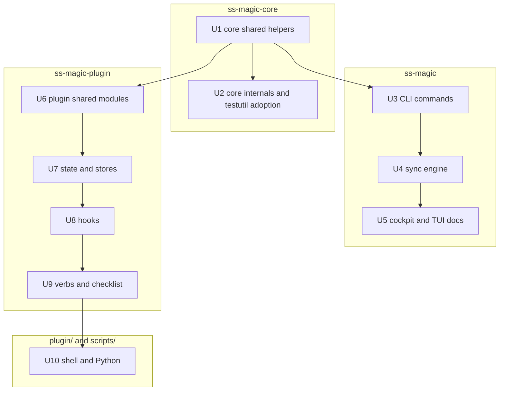

# Simplification Sweep - Plan

## Goal Capsule

- **Objective:** Every behavior of `ss-magic`, `ss-magic-plugin`, the packaged plugin scripts and the release builder is exactly what it was before this plan (same bytes on every stream, same exit codes, same files written with the same names and modes, same ordering of every side effect), while the 158 accepted simplification findings in `docs/plans/2026-09-10-001-refactor-simplify-sweep/validation/verdicts.json` are gone: each shared idea has one owner, each dead item is deleted, each stale comment says something true, and no safety check is thinner than it was.
- **Means:** Ten independently committable refactor units, ordered so shared helpers are extracted into `ss-magic-core` (or a plugin-local module) before their callers move (KTD1, KTD7), with behavior pinned by the existing suites plus the grep-checkable acceptance examples below (KTD3).
- **Authority hierarchy:** The settled decisions in `docs/plans/2026-09-10-001-refactor-simplify-sweep/brief/structure-pins.md`, restated in KTD4, are constraints no unit may cross. Product behavior is owned by the R-IDs; mechanism by the KTDs; units carry only local deltas. Repo conventions in `CLAUDE.md` bind every unit. The verdicts file is the authority on which findings are in and which are out.
- **Stop conditions:** Stop and report if any unit cannot be made green on every command of the Verification Contract before its commit; if a helper extraction turns out to require changing a caller's output, error text, stream, exit code or side-effect order (report the finding id and leave that caller's copy in place); or if a rejected finding turns out to be load-bearing for an accepted one.
- **Execution profile:** Deep. Ten units, each one commit on the branch the operator has already checked out, in the order given, never switching branches.
- **Tail ownership:** The implementing session runs the Verification Contract per unit, syncs the documents named in the Implementation Constraints per unit, and commits per unit. Nothing is tagged or released: a behavior-preserving refactor bumps no version (KTD6).

---

## Product Contract

### Summary

A deep `ce-simplify-code` sweep over the whole repository produced 251 findings in sixteen partitions. Validation against the live source merged 66 duplicates, rejected 27 (behavior changes, thinned gates, settled pins, unverified leads and low-value renames) and accepted 158. This plan turns the accepted findings into ten refactor units. It changes no behavior, adds no feature, bumps no version, and touches nothing the structure pins have settled.

### Problem Frame

The workspace grew fast, and several ideas ended up with more than one owner: the fd-lock opener is written three times, the Hinnant civil-date arithmetic three times, the `.superset/*` file names in three crates, the plugin's owner-only file modes seventeen times, the "print error, print usage, exit 2" tail nine times with two incompatible argument orders. A handful of items are dead (`Refusal::code`, `INSTALL_LOCK_NAME`, `FileState`, `transcript_root`), a handful of comments narrate plan history or state things that are no longer true, and a few hot paths do the same work twice. None of this is a bug today; every one of them is a place where the next change lands in one copy and not the other.

### Requirements

Each requirement names the finding ids it carries and the exact locations; the verdicts file carries the per-finding verification note. Line numbers are as of the sweep and may drift by a few lines.

#### Core shared helpers

- R1. One fd-lock opener (`cross-F2`). Add `crates/ss-magic-core/src/lockfile.rs` with `pub fn open_lock_file(path: &Path, mode: Option<u32>) -> io::Result<File>` (read, write, create; `.mode(m)` applied only when `Some`). Callers: `crates/ss-magic/src/update/apply.rs:234-244` keeps its `create_dir_all` of the parent and then delegates with `None`; `crates/ss-magic-plugin/src/tmproot.rs:218-229` is deleted and `with_lock`/`try_with_lock` call core with `None`; `crates/ss-magic-plugin/src/scratchpad.rs:594-606` delegates with `Some(STATE_FILE_MODE)` and keeps both of its error contexts.
- R2. One civil-date module (`cross-F3`). Add `crates/ss-magic-core/src/civil.rs` with `pub fn civil_from_days(days: i64) -> (i64, u32, u32)`, `pub fn days_from_civil(year: i64, month: u32, day: u32) -> i64` and `pub fn hms_from_secs(secs: u64) -> (u64, u64, u64)`, bodies moved verbatim from `crates/ss-magic/src/sync/reverse_sync.rs:707-724`, `crates/ss-magic-plugin/src/scratchpad.rs:655-672` and `crates/ss-magic-plugin/src/checklist/schema.rs:667-680`. Each caller keeps its own `format!` string and its own parse; only the arithmetic moves.
- R3. One state-tree query string (`cross-F4`). Add `pub const STATE_DIR_QUERY: &str = ".superset/.magic/";` to `crates/ss-magic-core/src/state_tree.rs` beside `STATE_REL`, pinned by a test to `format!("{STATE_REL}/")`. Callers: `crates/ss-magic-plugin/src/hook/mod.rs:93` and `crates/ss-magic-plugin/src/scratchpad.rs:66` (delete both `STATE_QUERY` consts), `crates/ss-magic-plugin/src/status.rs:1270` (replace the `format!`).
- R4. One backups path (`cross-F5`). Add `pub const BACKUPS_REL: &str = ".superset/backups";` to `crates/ss-magic-core/src/sync/mod.rs` beside `EXCLUDED_TREES`, pinned by a test to `EXCLUDED_TREES[0].join("/")`. `crates/ss-magic/src/sync/reverse_sync.rs:660-661` deletes its const and uses core's.
- R5. Core owns the `.superset` file names (`cross-F6`). In `crates/ss-magic-core/src/superset_files.rs:26-35` make `SUPERSET_DIR`, `CONFIG_JSON`, `MAGIC_JSON`, `MAGIC_LOCAL_JSON` `pub`, add `pub const MAGIC_JSON_REL: &str = ".superset/magic.json";` and `pub const MAGIC_LOCAL_REL: &str = ".superset/magic.local.json";` (each pinned by a test to the `Path::new(SUPERSET_DIR).join(...)` form), and delete `MAGIC_LOCAL_PATTERN` in favor of `MAGIC_LOCAL_REL`. Callers: `crates/ss-magic/src/main.rs:205`; `crates/ss-magic/src/workspace/migrate.rs:65` (delete the local `MAGIC_LOCAL_REL`) and its inline joins at `:298`, `:520` and `:570`; `crates/ss-magic-plugin/src/hook/pre_tool_use.rs:100` (`ROOT_MARKER` becomes `superset_files::MAGIC_JSON_REL`); `crates/ss-magic-plugin/src/config.rs:886-891` (`.superset` join) and `:926-932` (`magic_file_label` returns the two core consts); `crates/ss-magic-plugin/src/scratchpad.rs:70` (delete `SUPERSET_REL`, use `SUPERSET_DIR`); `crates/ss-magic-core/src/testutil.rs:101` (`write_magic` joins the consts).
- R6. One rel-path safety predicate (`cli-sync-F14`). Move `is_safe_rel` from `crates/ss-magic/src/sync/reverse_sync.rs:85-96` to `pub fn is_safe_rel(rel: &Path) -> bool` in `crates/ss-magic-core/src/sync/mod.rs`; `reverse_sync.rs` calls it at every site it does today (the defense-in-depth application at `:138` stays); `parse_ls_files_z` in `crates/ss-magic-core/src/git/mod.rs:251-262` replaces its string test with the predicate and its doc says the filter is one predicate applied at two layers.
- R7. One clock reader (`cross-F22`). Add `pub fn now_secs_or(fallback: u64) -> u64` to `crates/ss-magic-core/src/release.rs` and define `now_secs()` as `now_secs_or(0)`; `crates/ss-magic-plugin/src/heartbeat.rs:286-291` delegates.
- R8. One `.gitignore` file name (`core-git-F8`). Add `pub const GITIGNORE_FILE: &str = ".gitignore";` to `crates/ss-magic-core/src/git/gitignore.rs`, used at `gitignore.rs:47` and `:261`, and by `crates/ss-magic/src/workspace/migrate.rs:613` and `:628` in the `stage_paths` slices.
- R9. Shared test fixtures (`core-git-F15`, `plugin-stores-F15`). In `crates/ss-magic-core/src/testutil.rs` extract `pub fn init_repo_at(root: &Path, branch: &str)` from `init_main_repo` (which then creates the tempdir and calls it, keeping `gc.auto 0`), and add `pub fn ignored_repo() -> (TempDir, PathBuf)`: `init_main_repo("main")`, write `.gitignore` as `"target/\n.superset/.magic/\n"`, `git add` and commit it, return the canonicalized root. Callers: `crates/ss-magic-core/src/git/tests.rs:6-15`, `crates/ss-magic-core/src/git/discover/tests.rs:150-158` (keeps its sibling layout), and the eight plugin copies in `bypass/tests.rs`, `cache/tests.rs`, `expect_artifact/tests.rs`, `checklist/verbs/tests.rs`, `hook/session_start/tests.rs`, `hook/pre_compact/tests.rs`, `hook/subagent_stop/tests.rs` and `scratchpad/tests.rs`.

#### Core internals

- R10. Git module helpers (`core-git-F1`, `F2`, `F3`, `F4`, `F5`, `F10`). In `crates/ss-magic-core/src/git/mod.rs`: private `join_if_relative(path, base) -> PathBuf` and `canonicalize_ctx(path) -> Result<PathBuf>` (the "could not canonicalize {}" tail) used by `resolve` (`:48-57`), `main_checkout_root` (`:86-91`) and `discover::resolve_against` (`discover.rs:619-629`); private `git_raw_checked(args, cwd) -> Result<Output>` holding the spawn plus the success check and bail text, with `git()` trimming its stdout and `status_porcelain` (`:359-363`) keeping its untrimmed line parse; `pub(super) fn trimmed_utf8(bytes: &[u8]) -> String` replacing the ten `from_utf8_lossy(..).trim().to_string()` chains (`mod.rs:29,32,43,202,205,317,361,414,417`, `gitignore.rs:129`); private `spawn_output(program: &str, args: &[&str], cwd: Option<&Path>) -> io::Result<Output>` behind every `Command::new` in the module: `git_raw` (`:15`), `nothing_to_commit` (`:145`, via `.output()` and its own status test), `gh_available` (`:182`), `pr_create` (`:195`) and `timestamp_branch_suffix`'s `date` spawn (`:408`), each caller keeping its exact "failed to spawn" context and its own handling of the status. In `discover.rs:479-507` a private `scan_config_file(path) -> Result<FormatScan, &'static str>` holding the read/NotFound/unscannable block once. In `gitignore.rs:49-77` `ensure_entry` reads first and matches `NotFound`, both existing branches and contexts unchanged.
- R11. Git module hygiene (`core-git-F6`, `F7`, `F9`, `F12`). `discover.rs:107` drops `pub` from `GITFILE_MAX_BYTES` and its doc names the two decline reasons at `:339` and `:361` that restate 4 KiB; `discover.rs:155` drops the no-op `#[allow(dead_code)]`; the plan-id-only comments at `mod.rs:237`, `mod.rs:272` and `gitignore.rs:115` are deleted (the doc comments above them already carry the fact).
- R12. Test helpers come from `testutil` (`core-git-F13`, `core-git-F14`, `core-rest-F6`, `core-rest-F9`, `cross-F14`). `crates/ss-magic-core/src/git/tests.rs:19-23`, `sync/apply/tests.rs:4-8` and `sync/repo_scan/tests.rs:5-9` import `write_file`; `git/gitignore/tests.rs:99-111` uses `git_run(&["init", "-q"], root)`; `superset_files/tests.rs:63` imports `repo_scan::OPTIONS`; `crates/ss-magic/src/pack/tests.rs:14-47` and `crates/ss-magic/src/sync/reverse_sync/tests.rs:6-48` delete their local `init_main_repo`/`init_repo`, `write_magic`, `write_file`/`write` and `make_worktree` and import `ss_magic_core::testutil` (no test asserts on the `feature/rs-test` branch name).
- R13. `superset_files` internals (`core-rest-F1`, `F2`, `F3`). Delete the four `#[allow(dead_code)]` plus "consumed by U9/U11" lines at `superset_files.rs:241-243`, `:254-256`, `:355-357` and `sync/apply.rs:173-175`; add private `load_superset_json<T>(root, name) -> Result<Option<T>>` behind the four `load_*` functions at `:276-317`; add private `write_magic_file(root, name, cfg)` behind `write_magic_json`/`write_magic_local_json` at `:142-163`. Public signatures, docs and error contexts unchanged.
- R14. Glob compilation (`core-rest-F4`, `F5`). `crates/ss-magic-core/src/sync/pattern.rs` gains `pub fn compile_glob(pattern: &str) -> anyhow::Result<Glob>` (the shared "compiling glob" context) and `pub fn checked_glob(pattern: &str) -> Result<Option<Glob>, SyntaxError>` (today's `check_syntax` body returning the compiled `Glob` for a metacharacter pattern, `None` otherwise); `check_syntax` becomes `checked_glob(p).map(|_| ())` so `crates/ss-magic/src/tui/ui.rs` is untouched; `apply.rs:210-214` and `:295-299` and `repo_scan.rs:25-29` use them so each pattern compiles once.
- R15. Exclusion-list docs (`core-rest-F12`, `F13`). `sync/apply.rs:27-28` and `sync/repo_scan.rs:16` cross-reference each other in their doc comments, and `repo_scan::skip_excluded` documents that this scan deliberately does not apply `under_excluded_tree` (it answers "does this pattern match anything", not "what is copied"). No code change.

#### CLI commands

- R16. One root resolution (`cli-commands-F1`). Split `resolve_sync_roots` in `crates/ss-magic/src/main.rs:293-317` into `pub(crate) fn resolve_cwd_root(cwd: &Path) -> Result<PathBuf, ExitCode>` and `pub(crate) fn resolve_main_root(cwd_root: &Path) -> Result<PathBuf, ExitCode>`; `pack_core` (`pack.rs:120-132`) and `tui/menu.rs:116-144` call them; every message unchanged.
- R17. One empty-files guard (`cli-commands-F2`). `pub fn empty_files_notice(cfg: &MagicConfig, verb: &str) -> bool` beside `load_magic_or_exit` in `main.rs`, called from `main.rs:339-346` with `"sync"` and `pack.rs:141-148` with `"pack"`.
- R18. Migrate internals (`cli-commands-F4`, `F5`). `crates/ss-magic/src/workspace/migrate.rs`: add `const SETUP_CONFIG_REL: &str = ".superset/setup_config.json";`, pass `&[SETUP_SH_REL, SETUP_CONFIG_REL]` to `copy_into_repo` at `:359`, delete `rename_setup_config` (`:376-387`) and restate its tests at `migrate/tests.rs:263`, `:308` and `:405-410` against the new call; extract `stage_and_materialize_init` from `:505-540` and `:554-586`, with `run_init_noninteractive` loading `load_magic_json` and `load_config` in the order it does today.
- R19. Pack and update consts (`cli-commands-F6`, `F7`). `pack.rs` declares `ARCHIVE_PREFIX = "ss-magic-"` and `ARCHIVE_SUFFIX = ".tar.bz2"` used by `archive_file_name` (`:42-45`) and `is_pack_archive_rel` (`:221-230`); `update/apply.rs` adds `fn swap_outcome(target_tag: &str) -> ApplyOutcome` holding the match at `:358-363` and `:373-379`.
- R20. CLI consumers of R1, R5 and R8 (`cross-F2`, `cross-F6`, `core-git-F8`): `update/apply.rs::open_lock_file`, `main.rs:205`, `migrate.rs:65` and its inline joins, `migrate.rs:613,628`.

#### CLI sync engine

- R21. `reverse_sync.rs` shared blocks (`cli-sync-F5`, `F6`, `F7`, `F17`). Private `guard_both_sides(ctx, rel, baseline) -> Option<(Guard, Guard)>` and `backup_both_sides(ctx, rel, wt_guard, main_guard) -> Result<Vec<PathBuf>>` behind the Merge (`:1305-1329`) and Delete (`:1357-1387`) arms, worktree before main; private `print_backups(header, backups)` and `prune_best_effort(root, ts) -> Option<usize>` behind `finish_batch` (`:402-433`) and `backup_forward_targets` (`:640-656`), each keeping its own header and summary lines; `Cancel` maps to an empty vector so the "Nothing selected" message at `:362-372` has one site; `capture_baselines` behind `:347-358` and `:568-581`.
- R22. `reverse_sync.rs`/`merge.rs` names and docs (`cli-sync-F8`, `F10`, `F11`, `F12`, `F13`, `F18`, `cli-tui-F1`). `LEGACY_SIDE_DIRS = ["local", "main"]` at `:795` and `:830-838`; the `merge.rs:8-10` module doc and `:48-49` summary rewritten to what `default_decision` does; `default_decision()` takes no parameter, `cockpit::file_state` (`cockpit.rs:647-652`, called at `:526`) and `merge::FileState` are deleted and `CLAUDE.md`'s mention of `FileState` updated; the plan-id and "picker" comments at `reverse_sync.rs:62-63`, `:72`, `:105`, `:241` and `merge.rs:57` deleted or reworded; the eleven over-public items at `reverse_sync.rs:106,153,178,242,861,880,974,989,1002` and `merge.rs:251,272` narrowed to the visibility their signatures need; the sync-engine `ApplyOutcome` (`:1002-1007`) renamed `DecisionOutcome`; `WriteDirection` gains `pub fn label(self) -> &'static str` used by `apply_batch` (`:492-497`) and `cockpit::destructive_overwrites` (`cockpit.rs:479-493`).
- R23. Fewer stats and reads (`cli-sync-F15`, `F16`). `classify` (`:245-258`) stats both sides first and answers `Differs` when both stats succeed with different lengths, falling through to the read pair otherwise; `backup_if_exists` (`:592-606`) makes one `metadata` call and answers `Ok(None)` on any error.
- R24. Sync consumers of R2, R4 and R6: `format_timestamp` (`:704-724`) over `civil`, `BACKUPS_REL` from core, `is_safe_rel` from core.

#### CLI cockpit

- R25. Cockpit helpers and consts (`cli-tui-F3`, `F4`, `F5`, `F6`, `F7`, `F8`, `F9`, `F10`, `F11`, `F14`, `F15`, `F16`, `F17`) in `crates/ss-magic/src/tui/cockpit.rs` and `diffmodel.rs`: `scroll_bound(count: usize) -> u16` for `:233-239`, `:353-360`, `:364-371`; `content_width` and `scroll_lines` precomputed in `load_entry` and stored on `FileEntry` for `:730-743`, `:1019-1028`, `:964-965`; a `decided_count()` for `:1424`; a cached `preview: String` on `MergeOverlay` refreshed in `cycle_choice` for `:233-246`, `:275-277`, `:1599`; `LOCAL_SIDE_LABEL`/`MAIN_SIDE_LABEL` for `:1191-1203` and `:1511-1524`; a test pinning `HIGHLIGHT_SYMBOL.chars().count() == HIGHLIGHT_SYMBOL_WIDTH`; `diffmodel::LINE_NO_WIDTH = 4` with `SPLIT_GUTTER = LINE_NO_WIDTH + 1`, `SIGN_WIDTH = 2`, `UNIFIED_GUTTER = 2 * SPLIT_GUTTER + SIGN_WIDTH`, `NEW_GUTTER = SPLIT_GUTTER + SIGN_WIDTH` and `num()` formatting at `LINE_NO_WIDTH` (values stay 5, 12, 7, 4); `MERGE_FOOTER_LEGEND` for `:1336-1337`; `SECS_PER_MINUTE/HOUR/DAY` in `format_mtime` (`:712-726`); `HIGHLIGHT_SYMBOL` in `render_merge_hunk_list` (`:1578-1580`); one `app.merge.as_mut()` take for the overlay-only keys at `:1710-1753`; a `CreatedView` struct with `NEW_FILE_VIEW`/`MAIN_ONLY_VIEW` so `render_created` (`:1056-1066`) drops to six parameters and its `allow`; `Seg` imported at `:51`.
- R26. Cockpit and TUI docs and rules (`cli-tui-F12`, `cli-tui-F13`, `cli-sync-F3`). `tui/ui.rs:43-46`, `:82-83`, `:94-102`, `:210-213` and `tui/menu.rs:3` reworded to the surviving picker and flows; `cockpit::is_interactive` (`:87-93`) defined as `crate::menu_blocked_reason(stdin.is_terminal(), stdout.is_terminal()).is_none()`; the help line at `cockpit.rs:1390-1393` built from `sync::BACKUPS_REL` and a `pub(crate)` `reverse_sync::BACKUP_BATCHES_KEPT` (rendered text unchanged, so the 22-line overlay is unaffected).

#### Plugin shared modules

- R27. One mode policy (`cross-F7`). Add `crates/ss-magic-plugin/src/modes.rs` with `pub(crate) const STATE_DIR_MODE: u32 = 0o700;`, `STATE_FILE_MODE: u32 = 0o600;` and `COMMITTED_FILE_MODE: u32 = 0o644;`, each documenting the rule once. Every private `DIR_MODE`/`FILE_MODE`/`NEW_FILE_MODE` in `scratchpad.rs:119-122`, `heartbeat.rs:71-73`, `ledger.rs:98-101`, `cache.rs:105-107`, `bypass.rs:66-68`, `expect_artifact.rs:91-93`, `hook/pre_compact.rs:67`, `hook/subagent_stop.rs:85-86`, `hook/file_changed.rs:95`, `setup_ci.rs:82-84`, `compact_window.rs:127-132`, `checklist/verbs.rs:111` is deleted in favor of an import, and the inline `0o600` at `hook/session_start.rs:298-302` and `release_check.rs:108-116` is named. `tmproot.rs:101` keeps its own `DIR_MODE`: it is the shell-mirrored ownership contract, not the state-tree policy.
- R28. One human-verb I/O module (`cross-F8`, `cross-F11`, `cross-F12`). Add `crates/ss-magic-plugin/src/verb.rs` with `pub(crate) fn usage_error(usage: &str, message: impl Display) -> ExitCode` (prints `style::err(format!("error: {message}"))`, then `usage`, returns 2), `pub(crate) fn fail(message: impl Display) -> ExitCode` (the same without usage), `pub(crate) fn cwd() -> Result<PathBuf>` (`std::env::current_dir().context("reading the current directory")`) and `pub(crate) fn plural(n: usize) -> &'static str`. Callers: `config.rs:938-942`, `cache.rs:1004-1010`, `ledger.rs:1250-1254`, `compact_window.rs:837-849`, `checklist/verbs.rs:1438-1459` (delete `refused()` if these were its only callers), `expect_artifact.rs:448-453`, the inline tails in `status.rs:1888-1895`, `spill_index.rs:345-352`, `bypass.rs:184-211`, `setup_ci.rs:199-220` (keeps its flag-vs-argument message choice) and `release_check.rs:652-668`; the `current_dir` sites in `cache.rs:803,889,968`, `compact_window.rs:159,164`, `ledger.rs:1241`, `bypass.rs:213`, `config.rs:619,686,724`, `expect_artifact.rs:444`, `status.rs:1899`, `spill_index.rs:355`, `setup_ci.rs:222`, `checklist/verbs.rs:463` (fourteen sites; `config.rs:525` keeps its different "getting current directory" text); the `plural` copies at `ledger.rs:1525-1531`, `spill_index.rs:459-465` and the inline forms at `status.rs:2298`, `compact_window.rs:513`, `hook/session_end.rs:96`.
- R29. One rel-display helper (`cross-F9`). Add `pub(crate) fn rel_display(root: &Path, path: &Path) -> String` to `crates/ss-magic-plugin/src/pathnorm.rs` (strip the prefix, lossy, else the path itself lossy). Callers: `hook/session_start.rs:495-500`, `hook/pre_tool_use.rs:1065-1069`, `hook/pre_compact.rs:132-136`, `hook/subagent_stop.rs:543-554` (keeps its state-root derivation in front), `checklist/verbs.rs:1374-1379`, `scratchpad.rs:326-331` (`Ctx::rel_of` becomes a one-liner).
- R30. One harness config-dir resolver (`cross-F10`). Add `pub(crate) fn harness_config_dir() -> Option<PathBuf>` beside `non_empty_env` in `crates/ss-magic-plugin/src/status.rs` (`CLAUDE_CONFIG_DIR` non-empty, else `HOME` non-empty joined with `.claude`); `spill_index::projects_root` (`:116-124`) becomes `pub(crate)` and `harness_config_dir().map(|d| d.join("projects"))`; `ledger::transcript_root` (`:1162-1170`) is deleted and `run_backfill` calls `spill_index::projects_root()`; `status.rs:806-808` and `compact_window.rs:363-366` call the resolver.
- R31. One clock module (`plugin-verbs-c-F16`, R2 consumer). Add `crates/ss-magic-plugin/src/clock.rs` with `pub(crate) use ss_magic_core::release::now_secs;` and `pub(crate) fn format_rfc3339(secs: u64) -> String` built on `civil::civil_from_days` and `civil::hms_from_secs` with today's `format!`; delete both from `scratchpad.rs` and rewrite the imports in `ledger.rs:75`, `heartbeat.rs:51`, `release_check.rs:44`, `spill_index.rs:43`, `checklist/schema.rs:76` and every other importer. `checklist/schema.rs:667-680` calls `civil::days_from_civil`.
- R32. Atomic-write and directory primitives (`plugin-stores-F2`, `plugin-state-F17`). In `crates/ss-magic-plugin/src/atomic.rs` add `pub(crate) fn create_dir(path: &Path, mode: u32) -> io::Result<()>` (`DirBuilder::new().recursive(true).mode(mode).create(path)`), used by `bypass.rs:117-121`, `expect_artifact.rs:219-223`, `cache.rs:372-376`, `hook/subagent_stop.rs:454-458`, `heartbeat::ensure_store` (`:221-230`), `ledger::ensure_store` (`:1080-1089`) and `ledger::snapshot_prices` (`:1139-1144`), the last three dropping their redundant `is_dir()` pre-checks; each caller keeps its `with_context` and drops its now-unused `DirBuilderExt` import. `scratchpad.rs:510` (the per-component containment loop) and `tmproot.rs:203` (the non-recursive, error-ignoring ownership-contract create) keep their own `DirBuilder`. Replace the seven positional parameters of `write_atomically` with `pub(crate) struct AtomicWrite<'a> { pub prefix: &'a str, pub suffix: &'a str, pub what: Option<&'a str>, pub mode: Option<u32>, pub sync: bool }` (`Default` = `".atomic-"`, `".tmp"`, `None`, `None`, `false`) so the signature is `write_atomically(path: &Path, body: &str, opts: AtomicWrite<'_>) -> Result<()>`; every call site passes the values it passes today by name.
- R33. Plugin consumers of R3, R5 and R7: `hook/mod.rs:93`, `scratchpad.rs:66`, `status.rs:1270`; `hook/pre_tool_use.rs:100`, `config.rs:886-891,926-932`, `scratchpad.rs:70`; `heartbeat.rs:286-291`.

#### Plugin state and stores

- R34. Slugs (`plugin-state-F2`, `plugin-state-F3`, `plugin-state-F20`). `identity::slugify` (`identity.rs:138-159`) folds diacritics as today, then calls `ss_magic_core::reponame::sanitize_segment`, then truncates to a new `const SLUG_MAX_LEN: usize = 40;` with no `trim_matches` (the trim is a proven no-op and must not move after the truncation); `checklist/render::slugify` (`render.rs:455-470`) becomes a one-line wrapper over `sanitize_segment` keeping its doc, with a test in `render/tests.rs` pinning that its output is only `[a-z0-9-]`; `hook/subagent_stop.rs:520-522` names `const MAX_SLUG_CHARS: usize = 40;`.
- R35. State-module hygiene (`plugin-state-F5`, `F10`, `F14`, `F15`, `F16`, `cross-F21`). `scratchpad::CLAIM_DIRS` (`:113`) is built from `cache::DIR_NAME`, `bypass::DIR_NAME`, `expect_artifact::DIR_NAME` in that order; `heartbeat::prune` (`:323-335`) filters once; `tmproot::INSTALL_LOCK_NAME` (`:91-97`) and its `#[allow]` are deleted and the cross-language note moves to `NAMESPACE_DIR`'s doc, whose stale "not yet referenced" sentence (`:84-88`) is corrected to name `status` and `bootstrap.sh`; the forward-looking notes at `scratchpad.rs:199`, `:277` and `identity.rs:53-54` are deleted; `Refusal::code` (`scratchpad.rs:195-210`), its `#[allow]` and the eight assertions in `scratchpad/tests.rs` are deleted, and the false comment at `hook/pre_compact.rs:106` is replaced with the truth (the row carries `Display` text via `heartbeat_note`); `cache::MAX_AGE_SECS` (`:95-99`) is defined as `crate::heartbeat::MAX_AGE_SECS`.
- R36. Stores (`plugin-stores-F1`, `F5`, `F6`, `F7`, `F9`, `F11`, `F13`). `scratchpad.rs` gains `pub(crate) enum Bootstrap { Ready(Report), Refused(Report) }` and `pub(crate) fn ensure_for_verb(cwd: &Path) -> Result<Bootstrap>` (calls `ensure`; on `!wrote_state` prints every refusal as `style::err(format!("refused: {refusal}"))` and returns `Refused`; otherwise prints them as `style::warn` and returns `Ready`), used by `bypass.rs:238-247`, `expect_artifact.rs:492-501`, `cache.rs:838-847` and `checklist/verbs.rs:513-529` (which prints its extra info line in the `Refused` arm, after the refusals, as today); `claim.rs` gains `pub fn hashed_path(dir: &Path, target: &Path, ext: &str) -> PathBuf` behind `bypass::claim_path` (`:106-109`) and `expect_artifact::record_path` (`:199-202`), both dropping `pub`; `expect_artifact.rs:253-256` and `cache.rs:572-575` use `str::floor_char_boundary`; `scratchpad.rs` gains `pub fn state_root(root: &Path) -> PathBuf` and each store keeps `dir_in(state_root)` as its primitive with `dir_for_root(root)` defined over it, the inline joins at `bypass.rs:249` and `cache.rs:849` becoming `dir_in(&report.state_root)`; the stale narration at `cache.rs:437-439` is corrected; `cache::list` (`:343-347`) sorts with `sort_by_cached_key(|e| (Reverse(e.age_stamp()), e.key.clone()))`.

#### Plugin hooks

- R37. Hook core (`cross-F19`, `cross-F20`, `plugin-hook-core-F3`, `F5`, `F6`, `F7`, `F8`, `F11`, `F13`, `F14`, `F15`). `scratchpad.rs` derives `pub const STATE_FILES: [&str; 6]` from a private `STATE_FILE_BODIES: [(&str, &str); 6]` table and `state_file_body` looks the table up (`""` fallback kept); `hook/session_start.rs:66-90` becomes `const STATE_FILE_DESCRIPTIONS: [&str; scratchpad::STATE_FILES.len()]` zipped with `STATE_FILES` at render (`:549`), and the test at `session_start/tests.rs:470-476` asserts the guidance names every `STATE_FILES` entry; `session_start.rs:60-62` deletes `CHECKLIST_POINTER_NAME` and its stale comment in favor of `checklist::POINTER_NAME`; `scratchpad.rs` gains `pub(crate) fn ignore_refusal(root: &Path) -> Option<String>` holding the probe and the two sentences at `:438-455`, and `hook/mod.rs::state_tree_refusal` (`:619-631`) maps it with the ". No state was written." suffix; `handle_with` reads the pin once and passes it to `version_drift_notice` and `release_suggestion` (`:331`, `:394`); the cache-dir closure is memoized through a `OnceCell` inside `handle_with` (`:265`, `:395`); `pre_compact.rs` gains `fn trigger_display(trigger: &str) -> &str` for `:82-86` and `:189-193`; `hook/mod.rs` gains `pub(crate) const NO_REPOSITORY_DETAIL` used at `session_start.rs:167-169`, `pre_compact.rs:94-96`, `subagent_stop.rs:109-111`; `event.rs` owns `CLASS_UNROUTABLE` (returned by `DecodeError::class`, referenced by `hook/mod.rs:102-103`) and `ADDITIONAL_CONTEXT_CLIFF_CHARS = 10_000` (named in the comments at `event.rs:357,397`, `session_start.rs:464`, `pre_tool_use.rs:1554` and used at `session_start/tests.rs:261`); the four pre-U12 narration comments at `hook/mod.rs:182-183`, `:229-230`, `:238-239`, `:265-266` are deleted with the live fact restated; the `base` closures at `:423`, `:458`, `:504` become `bare_row` and one row builder passed into `gate_and_dispatch`.
- R38. Gates (`plugin-hook-gates-F2`, `F3`, `F7`, `F8`, `F9`, `F10`, `F11`, `F13`). `pre_tool_use.rs`: `fn gate_root(ctx) -> PathBuf` for `:768` and `:1458` (`actor_root` untouched); `fn bypass_paragraph(lead_in: &str, shown: &str) -> String` for `:1121-1124` and `:1165-1168`; `shipping_action` short-circuits on `!command.contains("<<")` (`:1241-1242`); `fn advise(context, detail) -> Outcome` beside `allow`/`deny` for `commit_nudge` (`:1466-1470`); `fn os_str_equal_ignoring_case(a: &OsStr, b: &OsStr) -> bool` for the `ends_with_ignoring_case` closure (`:576-581`), `paths_equal_ignoring_case` keeping its `Path` fallback; `pre_tool_use/tests.rs:46-51` `Repo::write` delegates to `testutil::write_file`. `scratchpad::Report` gains `pub(crate) fn tracked_paths(&self) -> impl Iterator<Item = &str>` behind `pre_compact::is_tracked` (`:140-144`) and `subagent_stop::tracked_under` (`:559-568`), each keeping its predicate. `file_changed.rs:348-358` returns `enum Export { NotInstalled, Failed, Script(String) }` matched at `:202-207` with today's three detail strings.

#### Plugin verbs and checklist

- R39. Config, release check, CI setup, status (`plugin-verbs-a-F2`, `F3`, `F4`, `F5`, `F6`, `F11`, `F12`, `F13`, `F16`, `F17`). `config.rs`: `fn write_roots(cwd, local) -> (PathBuf, PathBuf)` and `fn ensure_ignored_after_enable(cwd_root) -> Result<()>` behind `run_toggle_core` (`:623-637`) and `run_config_set_core` (`:730-749`); `resolve_with_roots` (`:194-199`) reads the cwd overlay once and reuses it when `main_root` is the same path. `release_check.rs`: `:524` uses `release::parse_bare_triple(pinned).is_some()`; `pub fn update_available(newest_tag: &str, pinned: &str) -> Option<bool>` behind `report` (`:517-534`) and `status::collect_newest_release` (`status.rs:1683-1686`), each keeping its notes; the `REFRESH_ARGV` doc (`:55-57`) reworded and a test pins `parse_args(&REFRESH_ARGV[1..])` to `Run { refresh: true, quiet: true, json: false }`. `setup_ci.rs`: `fn usage() -> String` formatting `WORKFLOW_REL` (`:75`, `:102`); `run_core` renders once (`:264`, `:286`, `:321`). `status::collect` resolves `config::resolve` once (`:920-927`) and passes the `PluginConfig` into `collect_enablement` (`:1102`). Two tests in `crates/ss-magic-plugin/src/tests.rs`: one parses `plugin/hooks/hooks.json` via `include_str!` and asserts every registered event token round-trips through `HookEvent::from_token`/`as_str` and equals `status::DECLARED_EVENTS` as a set; one scans `plugin/hooks/bootstrap.sh` via `include_str!` for `"$bin_path" <verb>` invocations and asserts each verb parses through `HumanVerb::from_token`.
- R40. Status and spill index (`cross-F13`, `plugin-verbs-b-F5`, `F6`, `F9`, `F10`, `F11`, `F12`). `status.rs`: `LABEL_WIDTH` and `row` become `pub(crate)` and `release_check::render_text` (`:575-579`) uses them; `pub(crate) fn unknown_text(note: Option<&str>) -> String` behind `unknown()`, `Field::render` (`:197-201`) and `:2283-2286`, used by `release_check.rs:593,605`; `pub(crate) const NO_REASON: &str = "no reason recorded";` at the nine `status.rs` sites and `release_check.rs:594,606`; `heartbeat_store_if_present` (`:1929-1938`) inlined at `:1908` with its comment kept; `spill_index.rs` gains `Index::empty(root, projects_root)` for `:174-182` and `:364-377`; `status/tests.rs:37-49` builds `repo()` on `testutil::init_main_repo`, and `:69` uses `NOW`.
- R41. Compact window and ledger (`plugin-verbs-c-F6`, `F7`, `F8`, `F9`, `F10`, `F11`, `F12`, `F13`, `F15`). `compact_window.rs`: `enable_tip` (`:658-662`) and the closing line (`:828-832`) format `WINDOW_KEY`/`SETTINGS_LOCAL_REL`; `USAGE` becomes `fn usage() -> String` formatting `WINDOW_MIN`, `WINDOW_MAX`, `SETTINGS_LOCAL_REL`, `SETTINGS_PROJECT_REL`, `WINDOW_KEY`; `recommend_report` parses each project settings file once and passes the `ExistingSettings` to a `window_from(rel, &ExistingSettings)` and an `env_value_from(&ExistingSettings)` (`:566-582`, `:676-679`); `read_settings_object` (`:296-300`) matches `NotFound` on the read. `ledger.rs`: `const LINE_BUF_BYTES: usize = 64 * 1024;` at `:683`; `rows_for_repository` (`:421-429`) filters on `peak_context_tokens`, sorts, then resolves attribution lazily with `take(limit)`; `fn comma_list(&BTreeSet<String>) -> String` for `:1462-1467` and `:1494-1499`; the two `.json` writers at `:358` and `:1154` stage with `".json"`; `OFFSETS_FILE_NAME`, `PRICES_DIR_NAME`, `PRICE_TABLE_VERSION`, `ledger_path`, `transcript_tree`, `RECOMMEND_ROWS`, `RECOMMEND_SCHEMA_VERSION` become private and `LEDGER_FILE_NAME`, `read` become `pub(crate)`.
- R42. Checklist (`plugin-checklist-F5`, `F6`, `F7`, `F8`, `F9`, `F10`). `schema.rs` owns `pub const DOCUMENT_ID: &str = "document";` (re-exported from `checklist/mod.rs`) used by `verbs.rs:863-866` and `validate.rs:91-92`; `ItemKind::from_token` and `Priority::from_token` (the latter implemented over `as_str`, which gives it a caller) beside `as_str`, used by `set_item_field` (`verbs.rs:967-988`) with its `bail!` texts unchanged; `Document::section` and `Document::items` (`schema.rs:474-486`) deleted; `render.rs` gains `fn prose_or(text: &str, placeholder: &str) -> String` for `:151-155`, `:257-261`, `:283-287`, `:299-303` and `fn render_refs(out: &mut String, refs: &[Reference])` for `:270-277`, `:338-345`; `validate.rs` gains `pub fn error_count(findings: &[Finding]) -> usize` (re-exported) for `verbs.rs:661-666` and `:763-767`.

#### Shell and Python

- R43. Bootstrap and shim (`shell-F1`, `F2`, `F3`, `F8`, `F10`). `plugin/hooks/bootstrap.sh`: `give_up` prints `'ss-magic: %s; installed nothing.\n'` and all sixteen call sites drop the suffix; `pin_is_triple()` holds the two `case` passes at `:166-174` and one `give_up` follows; `version_of()` holds the `--version | head -1 | awk '{print $NF}'` probe for `installed_version` (`:186-189`) and `:452`; `RELEASE_BASE` with `RELEASE_DOWNLOAD_BASE`/`RELEASE_PAGE_BASE` derived (`:42-43`). `plugin/hooks/run-hook.sh:44-46`: `give_up` renamed `be_inert` at its nine call sites.
- R44. tmproot shell contract (`cross-F16`, `cross-F17`). `plugin/lib/tmproot.sh` gains `SS_MAGIC_IDENTIFIER_HEX_LEN=16` and `SS_MAGIC_DIR_MODE=700` beside the existing three contract constants (each commented as mirroring `tmproot.rs::IDENTIFIER_HEX_LEN` / `::DIR_MODE`), `cut -c1-"$SS_MAGIC_IDENTIFIER_HEX_LEN"`, a character-class rejection plus `[ "${#short}" -eq "$SS_MAGIC_IDENTIFIER_HEX_LEN" ]` in place of the 16-fold glob (`:70-74`), and `[ "$mode" = "$SS_MAGIC_DIR_MODE" ]` (`:100`); `plugin/hooks/bootstrap.sh:423-427` replaces the 64-fold glob with the same class-plus-length test at 64. It also gains `ss_magic_read_data_root()` (prints the data root; returns 1 when no temp root resolves, 2 when the handoff file cannot be read or is empty), used by `plugin/hooks/run-hook.sh:57-78` (any non-zero is `be_inert`) and `plugin/bin/ss-magic-plugin:72-88` (a `case` on the code selects the existing messages), both dropping their `[ -r "$handoff" ]` pre-checks.
- R45. Scripts (`shell-F11`, `shell-F12`). `scripts/mark-latest.sh:58-60` matches with `[[ $1 =~ $BARE_CLI_TAG_RE ]]` (pattern in a variable, bash 3.2 safe); `scripts/test-bootstrap.sh` defines `sha256_stdin` beside `sha256_of` (`:59-62`) and derives `sha256_of() { sha256_stdin <"$1"; }`.
- R46. Builder (`python-F2`, `F3`, `F4`, `F5`, `F6`, `F7`). `scripts/build-plugin-zip.py`: `MARKETPLACE_MANIFEST`, `PLUGIN_JSON_REL`, `PLUGIN_JSON`, `HOOKS_MANIFEST` constants beside `CLI_MANIFEST` (`:255-261`) used at `:232`, `:334`, `:582`, `:826-831`, `:845`, `:927-943`, `:966-972`, `:999`; `_tree_digest_and_version(plugin_dir) -> tuple[str, str]` used twice in `check_bump` (`:824-832`); `_write(path, data, mode=None)` used by `_version_repo` (`:927-1018`); `MARKETPLACE_TAG_RE` beside `ARTIFACT_RE` for `:349`; `_semver` moved above its first caller with its precondition documented (`:748-754`, `:481`); `--plugin-dir` and `--root` documented in the module docstring's Usage block (`:44-51`).

#### Documentation

- R47. Every unit re-reads `CLAUDE.md` and `README.md` and updates every sentence that names a moved or deleted item (at least: `FileState` in the cockpit paragraph; `atomic.rs`'s `write_atomically(path, body, prefix, suffix, what, mode, sync)` description; `scratchpad` as the home of `now_secs`/`format_rfc3339`; `STATE_QUERY`; `transcript_root`; `INSTALL_LOCK_NAME`; the git module's "shell out via `git_raw`" sentence gaining `spawn_output`; `testutil`'s helper list gaining `init_repo_at` and `ignored_repo`; the wrapper and shim paragraph naming `ss_magic_read_data_root`), `CONTRIBUTING.md` when a build, test or release fact changes, and `.cursor/BUGBOT.md` as a self-contained restatement.

### Acceptance Examples

Each is checkable by a test or a grep from the repository root after its unit.

- AE1. (R1) `grep -rn 'fn open_lock_file' crates/` reports exactly one definition, in `crates/ss-magic-core/src/lockfile.rs`.
- AE2. (R2) `grep -rln '146_097' crates/` names only `crates/ss-magic-core/src/civil.rs`, and `cargo test -p ss-magic-core civil` passes a round-trip test over `days_from_civil(civil_from_days(d)) == d` for a range of days on both sides of the epoch.
- AE3. (R3) `grep -rn '"\.superset/\.magic/"' crates/` reports exactly one match, in `state_tree.rs`.
- AE4. (R4, R5) `grep -rn '"\.superset/backups"' crates/` reports one match (`sync/mod.rs`); `grep -rn --include='*.rs' '"\.superset/magic\.json"\|"\.superset/magic\.local\.json"' crates/ | grep -v '/tests'` reports one match each, both in `superset_files.rs`.
- AE5. (R6) `grep -rn 'fn is_safe_rel' crates/` reports one definition, in `crates/ss-magic-core/src/sync/mod.rs`, and the existing `parse_ls_files_z` tests still reject `..`-bearing and absolute entries.
- AE6. (R7) `grep -rn 'fn now_secs' crates/` reports only `now_secs` and `now_secs_or` in `crates/ss-magic-core/src/release.rs`.
- AE7. (R9, R12) `grep -rn 'fn ignored_repo\|fn init_main_repo\|fn init_repo_at\|fn write_file\|fn write_magic\|fn make_worktree' crates/` reports matches only in `crates/ss-magic-core/src/testutil.rs`.
- AE8. (R10) `grep -rn 'from_utf8_lossy' crates/ss-magic-core/src/git/ | grep -c 'trim()'` prints `1` (the helper), and `grep -rn 'Command::new' crates/ss-magic-core/src/git/mod.rs` reports exactly one match (`spawn_output`).
- AE9. (R8) `grep -rn --include='*.rs' '"\.gitignore"' crates/ | grep -v '/tests'` reports exactly one match, in `gitignore.rs`.
- AE10. (R11, R13, R22, R35, R37) `grep -rn 'consumed by U[0-9]\|wired into the menu by U[0-9]\|U27 owns\|of U12 onward\|Not yet referenced outside' crates/` reports nothing.
- AE11. (R22) `grep -rn 'FileState\|fn file_state' crates/ss-magic/src CLAUDE.md` reports nothing, and `grep -c 'ApplyOutcome' crates/ss-magic/src/sync/reverse_sync.rs` prints `0`.
- AE12. (R25) `cockpit/tests.rs` contains and passes a test asserting `HIGHLIGHT_SYMBOL.chars().count() == HIGHLIGHT_SYMBOL_WIDTH as usize`, and `grep -n 'const UNIFIED_GUTTER\|const NEW_GUTTER' crates/ss-magic/src/tui/cockpit.rs` shows both defined as expressions over `SPLIT_GUTTER`, not as `12` and `7`.
- AE13. (R27) `grep -rn --include='*.rs' '0o700\|0o600\|0o644' crates/ss-magic-plugin/src | grep -v '/tests'` reports matches only in `modes.rs` and `tmproot.rs`.
- AE14. (R28) `grep -rn 'fn usage_error\|fn fail(\|fn refuse(\|fn plural' crates/ss-magic-plugin/src` reports matches only in `verb.rs`, and `grep -rn 'context("reading the current directory")' crates/ss-magic-plugin/src` reports exactly one match, in `verb.rs` (`config.rs:525` keeps its different "getting current directory" context).
- AE15. (R29) `grep -rn 'fn display_rel\|fn display_path\|fn rel_to_repo\|fn rel_display' crates/ss-magic-plugin/src` reports one match, in `pathnorm.rs`.
- AE16. (R30) `grep -rn 'fn transcript_root\|fn projects_root\|fn harness_config_dir' crates/ss-magic-plugin/src` reports exactly two matches (`status.rs`, `spill_index.rs`), and `grep -rn '"CLAUDE_CONFIG_DIR"' crates/ss-magic-plugin/src --include='*.rs' | grep -v '/tests'` reports exactly one.
- AE17. (R31) `grep -rn 'fn format_rfc3339' crates/ss-magic-plugin/src` reports one match, in `clock.rs`, and `grep -rn 'scratchpad::{[^}]*now_secs\|scratchpad::now_secs\|scratchpad::format_rfc3339' crates/ss-magic-plugin/src` reports nothing.
- AE18. (R32) `grep -rn 'DirBuilder::new()' crates/ss-magic-plugin/src` reports matches only in `atomic.rs`, `scratchpad.rs` and `tmproot.rs`, and `grep -n 'pub(crate) fn write_atomically' crates/ss-magic-plugin/src/atomic.rs` shows a three-parameter signature taking `AtomicWrite`.
- AE19. (R36) `grep -rn 'fn ignored_repo' crates/ss-magic-plugin/src` reports nothing; `grep -rn 'while end > 0 && !' crates/ss-magic-plugin/src` reports nothing; `grep -rn 'pub fn claim_path\|pub fn record_path' crates/ss-magic-plugin/src` reports nothing.
- AE20. (R37) `grep -rn '"not inside a git repository; nothing to do"' crates/ss-magic-plugin/src` reports one match (`hook/mod.rs`); `grep -rn '"unroutable-event"' crates/ss-magic-plugin/src` reports one match (`event.rs`); `grep -rn --include='*.rs' '"checklist\.json"' crates/ss-magic-plugin/src | grep -v '/tests'` reports one match (`checklist/verbs.rs`).
- AE21. (R38) `grep -c 'ss-magic-plugin bypass {shown}' crates/ss-magic-plugin/src/hook/pre_tool_use.rs` prints `1`, and the existing shipping-action tests (heredoc-bearing and heredoc-free commands) still pass.
- AE22. (R39) `cargo test -p ss-magic-plugin` includes and passes a test comparing `plugin/hooks/hooks.json`'s registered events with `HookEvent::from_token` and `status::DECLARED_EVENTS`, one comparing `plugin/hooks/bootstrap.sh`'s `"$bin_path"` verbs with `HumanVerb::from_token`, and one parsing `REFRESH_ARGV` through `parse_args`.
- AE23. (R40) `grep -c '"no reason recorded"' crates/ss-magic-plugin/src/status.rs` prints `1` and the same grep over `release_check.rs` prints `0`; `grep -n 'const WIDTH' crates/ss-magic-plugin/src/release_check.rs` reports nothing.
- AE24. (R41) `grep -c 'suffix: ".jsonl"' crates/ss-magic-plugin/src/ledger.rs` prints `1` (the ledger writer) and `grep -c 'suffix: ".json"' crates/ss-magic-plugin/src/ledger.rs` prints `2` (the offsets and prices writers), and `grep -n '64 \* 1024' crates/ss-magic-plugin/src/ledger.rs` reports only the `LINE_BUF_BYTES` definition.
- AE25. (R43) `grep -n 'give_up "' plugin/hooks/bootstrap.sh | grep -c 'installed nothing'` prints `0`; `grep -c 'give_up' plugin/hooks/run-hook.sh` prints `0` and `grep -c 'be_inert' plugin/hooks/run-hook.sh` prints at least `10`; `/bin/bash scripts/test-bootstrap.sh` passes unchanged (the suite asserts the exact stderr lines).
- AE26. (R44) `grep -c 'cut -c1-16' plugin/lib/tmproot.sh` prints `0`; `grep -c 'ss_magic_read_data_root' plugin/lib/tmproot.sh plugin/hooks/run-hook.sh plugin/bin/ss-magic-plugin` prints a count of at least `1` for each file; `grep -c '\-r "\$handoff"' plugin/hooks/run-hook.sh plugin/bin/ss-magic-plugin` prints `0` for both.
- AE27. (R46) `python3 scripts/build-plugin-zip.py --selftest` passes, and `grep -c 'MARKETPLACE_MANIFEST\|HOOKS_MANIFEST\|PLUGIN_JSON_REL\|MARKETPLACE_TAG_RE' scripts/build-plugin-zip.py` prints at least `8`.
- AE28. (all) `cargo build --release --workspace` emits zero warnings and `python3 scripts/build-plugin-zip.py --check` prints the same seven assertion lines it prints today.

### Scope Boundaries

- No behavior change of any kind: not a byte on stdout or stderr, not an exit code, not a file name, mode, fsync or write order, not the set of `git` subprocesses a path spawns. A finding whose only safe form is a doc change is carried as a doc change (R11, R15).
- No new features, flags, verbs, `--check` assertion lines or CI steps.
- Nothing under a settled pin (KTD4). In particular the three atomic-write implementations stay three (`cross-F1`, rejected), `repo_scan` keeps descending into the excluded trees (`core-rest-F13` option a), `scratchpad`'s per-component directory loop keeps its pre-check, the checklist pointer is read per decision (`plugin-hook-gates-F12`), the ignored-tree probe runs in both the pipeline and `scratchpad::ensure` (`plugin-hook-core-F4`), and CI keeps its own artifact-name lookup (`cross-F18`).
- No version bump on either release line (KTD6).
- The 27 rejected findings and the 66 merged duplicates are out; the reasons are in `docs/plans/2026-09-10-001-refactor-simplify-sweep/validation/verdicts.json` and summarized in `validation/report.md` beside it.
- `config.rs:525`'s "getting current directory" context stays as it is (a different message, so not a copy of the fourteen `verb::cwd` sites).

---

## Planning Contract

### Key Technical Decisions

- KTD1. Where a shared helper lives. A helper both binaries need lives in `ss-magic-core`: `lockfile::open_lock_file` (R1), `civil::{civil_from_days, days_from_civil, hms_from_secs}` (R2), `state_tree::STATE_DIR_QUERY` (R3), `sync::BACKUPS_REL` and `sync::is_safe_rel` (R4, R6), the `superset_files` names and `*_REL` paths (R5), `release::now_secs_or` (R7), `gitignore::GITIGNORE_FILE` (R8), `testutil::{init_repo_at, ignored_repo}` (R9). A helper only the plugin needs lives in the plugin crate: `modes` (R27), `verb` (R28), `pathnorm::rel_display` (R29), `status::harness_config_dir` (R30), `clock` (R31), `atomic::{create_dir, AtomicWrite}` (R32), `claim::hashed_path` and `scratchpad::{ensure_for_verb, state_root, ignore_refusal, Report::tracked_paths}` (R36, R37). Nothing moves from one binary into the other, and the CLI keeps `resolve_cwd_root`/`empty_files_notice` in its own `main.rs` (R16, R17). New core modules are declared in `crates/ss-magic-core/src/lib.rs`; new plugin modules in `crates/ss-magic-plugin/src/main.rs`.
- KTD2. Atomic writes stay three implementations (`cross-F1` rejected). Core's `write_atomically` canonicalizes and stages `.{name}.{pid}.{seq}.tmp`, the CLI's `write_bytes` copies the target's mode and fsyncs, the plugin's is parameterized by prefix, suffix, mode and sync; one helper would change at least two of them. The plugin's copy only gains the `AtomicWrite` options struct (R32).
- KTD3. The behavior-preservation rule for every extraction. A helper takes the varying part as a parameter and the caller keeps everything a user or a test can observe: its own error-context strings, its own message text and stream, its own exit code, its own ordering of prints and writes. When one caller differs materially (checklist `init`'s extra info line, `scratchpad`'s per-component loop, `setup_ci`'s flag-vs-argument message, `subagent_stop`'s root derivation, `run_bulk`'s decisions loop) it keeps its own copy of that part and shares the rest. Efficiency items are accepted only where the result is provably identical (a stat-first `classify` answers `Differs` exactly when the read pair would; a lazily attributed `rows_for_repository` yields the same rows in the same order; a memoized cache-dir closure runs the same `create_dir_all` once instead of twice).
- KTD4. Settled decisions restated from `structure-pins.md`; every one is out of scope and an undo of any of them is a defect: the three-crate shape and the binaries' `crate::git`/`crate::hashing` re-exports; the `<module>/tests.rs` layout with `testutil` helpers behind the feature (re-implementing one IS a finding, which is why R9 and R12 exist); environment tests in child processes; the seven `--check` lines; the hooks-shim invariant asserted in two places; `seed_config` at three bootstrap sites; `execguard.sh` sourced by both the shim and the wrapper; the excluded-trees filter at every enumeration; `seed_block()` as a literal map; `landing()` called twice; the hand-rolled SHA-256 and FNV-1a; `status_porcelain` on `git_raw`; fail-open hooks beside fail-closed gates; `pathnorm::normalize` textual; `claim::take` rename-based; `HookEvent::{Unknown, Missing}` as values; the testability seams; `opt-level = "z"`; `git::discover`'s declines.
- KTD5. Cross-language vocabularies are pinned by tests, not by shared code. Shell and JSON cannot import a Rust constant, so `hooks.json` to `HookEvent`/`DECLARED_EVENTS`, `bootstrap.sh`'s verbs to `HumanVerb`, and `REFRESH_ARGV` to `parse_args` are pinned by tests that read the files through `include_str!` (R39). The shell side names its own constants beside the Rust ones with a comment naming the mirror (R44), the way the existing three `tmproot.sh` constants already do.
- KTD6. No version bump. A behavior-preserving refactor bumps nothing: the CLI stays at `0.11.1` (unreleased; `v0.11.0` is the published release) and the plugin at `1.0.0` (never published), which keeps the two different as `--check` requires. U10's edits under `plugin/` pass CI's `--check-bump` without a bump because the baseline is the newest version-shaped tag reachable from `HEAD`, `v0.11.0`, whose `plugin/.claude-plugin/plugin.json` reads `0.11.0`: the declared version already differs from `1.0.0`, which is exactly the signal the check wants. Any change under `plugin/` is still followed by `python3 scripts/build-plugin-zip.py --update-manifest` and then `--check`, so the committed digest pin moves with the bytes.
- KTD7. Unit order. Core surface first (U1) so every later crate compiles against it, core internals second (U2), then the CLI (U3 commands, U4 engine, U5 cockpit, in that order because U5 reads `WriteDirection::label` and `BACKUP_BATCHES_KEPT` from U4), then the plugin's shared modules (U6) before the three plugin consumer units (U7 state and stores, U8 hooks, U9 verbs and checklist), and the shell and Python scripts last (U10). Every unit leaves every command in the Verification Contract green and is one commit.
- KTD8. `str::floor_char_boundary` replaces the two hand-rolled backwalks (R36). The workspace builds with rustc 1.98.0 and pins no `rust-version`, and the method is stable there; the two loops it replaces compute exactly the largest char boundary at or below the index.
- KTD9. Comments explain the rule, never only cite a plan id. The sweep deletes comments whose whole content is a plan id (`consumed by U11`) and rewrites the ones that narrate a state that no longer exists; a new helper's doc comment carries the reasoning that used to sit at each call site, once.

### Implementation Constraints

- The executing session never switches git branches on its own: the operator creates and checks out the branch before `/lfg` runs.
- One commit per unit, after the unit's Verification Contract commands are green and its document sync is done.
- Never commit `.claude/settings.json`, `.claude/skills/`, `.scratchpad/` or `skills-lock.json`.
- Any change under `plugin/` must be followed by `python3 scripts/build-plugin-zip.py --update-manifest` and then `--check` in the same unit.
- Code comments explain the rule, never only cite a plan id.
- A behavior-preserving refactor bumps no version: the CLI is at `0.11.1` unreleased with `v0.11.0` published, the plugin at `1.0.0` never published, and the two must stay different. These units require no bump.
- Every unit ends with the document sync: `CLAUDE.md` and `README.md` always; `CONTRIBUTING.md` when build, test or release facts change; `.cursor/BUGBOT.md` kept self-contained, never referencing `CLAUDE.md` or `docs/solutions`.
- Markdown written by any unit uses en dashes, `./`-prefixed relative links and `plaintext`-tagged plain fences.

### Sequencing

The arrows are commit order, not only data dependence: U2, U3 and U6 each depend on U1 alone, but they are committed in numeric order so the history is linear and every intermediate commit is green.

---

## Implementation Units

### U1. Core shared helpers

- **Goal:** Every helper a later unit consumes exists in `ss-magic-core` with its tests, and the core callers that already exist use it; nothing outside core changes yet except where the old core symbol was deleted.
- **Requirements:** R1, R2, R3, R4, R5, R6, R7, R8, R9 (core half of each; the CLI and plugin callers follow in U3, U4 and U6).
- **Dependencies:** none.
- **Files:** `crates/ss-magic-core/src/lib.rs`, `crates/ss-magic-core/src/lockfile.rs` (new), `crates/ss-magic-core/src/civil.rs` (new), `crates/ss-magic-core/src/state_tree.rs`, `crates/ss-magic-core/src/sync/mod.rs`, `crates/ss-magic-core/src/superset_files.rs`, `crates/ss-magic-core/src/git/mod.rs`, `crates/ss-magic-core/src/git/gitignore.rs`, `crates/ss-magic-core/src/release.rs`, `crates/ss-magic-core/src/testutil.rs`, and the tests beside each.
- **Approach:**
  - `lockfile.rs`: `open_lock_file(path, mode)` builds `OpenOptions::new().read(true).write(true).create(true)`, applies `.mode(m)` under `Some`, and opens. Doc explains why the file is opened read-write (`fd_lock` needs a writable descriptor for an exclusive lock) and why the mode is optional (the CLI's cache-dir lock takes the umask, the plugin's state-tree lock is owner-only).
  - `civil.rs`: the three functions with the arithmetic moved verbatim from `reverse_sync.rs:707-724` (days to civil), `schema.rs:667-680` (civil to days) and the `secs / 86_400`, `% 3_600`, `% 60` split every formatter does; doc names Hinnant's algorithm and the proleptic-Gregorian range it covers. Tests: the round trip in AE2, and the three formatters' existing fixed-instant tests keep passing untouched in later units.
  - `state_tree.rs`: `STATE_DIR_QUERY` with a doc saying why the trailing slash matters (git's directory-only match) and a test against `format!("{STATE_REL}/")`.
  - `sync/mod.rs`: `BACKUPS_REL` beside `EXCLUDED_TREES` with a test against `EXCLUDED_TREES[0].join("/")`; `is_safe_rel` moved in with its doc; `git/mod.rs::parse_ls_files_z` calls it and its "the filter lives in ONE place" doc is reworded to "one predicate, applied here and again by reverse sync".
  - `superset_files.rs`: visibility, the two `*_REL` consts with pinning tests, `MAGIC_LOCAL_PATTERN` deleted and its one use switched to `MAGIC_LOCAL_REL`.
  - `release.rs`: `now_secs_or(fallback)` with `now_secs()` delegating; `gitignore.rs`: `GITIGNORE_FILE` used at its two sites.
  - `testutil.rs`: `init_repo_at` extracted (keeps `gc.auto 0`, `neutralize_global_excludes`, README, add, commit against the given root), `init_main_repo` becomes create-tempdir-then-call, `ignored_repo` added as R9 specifies, `write_magic` joins `SUPERSET_DIR`/`MAGIC_JSON`.
- **Test Scenarios:** civil round trip; `STATE_DIR_QUERY == STATE_REL + "/"`; `BACKUPS_REL == EXCLUDED_TREES[0].join("/")`; `MAGIC_JSON_REL == Path::new(SUPERSET_DIR).join(MAGIC_JSON)` and the local twin; `is_safe_rel` rejects absolute and `..`-bearing paths and accepts a plain nested rel; `open_lock_file(..., Some(0o600))` on a fresh path yields mode `0o600`; `ignored_repo()`'s root is ignored for `STATE_DIR_QUERY` under `git check-ignore --no-index`.
- **Verification:** the full Verification Contract; AE1 to AE7 for the core definitions (the "exactly one definition" greps already hold after this unit because the old copies in the binaries are deleted only when their callers move, so run the definition-site greps and confirm the binaries still compile against their local copies). Document sync, one commit.

### U2. Core internals and testutil adoption

- **Goal:** The git, discover, gitignore, superset_files and sync internals have one owner per idea, the plan-id comments are gone, and every test file in the workspace takes its fixtures from `testutil`.
- **Requirements:** R10, R11, R12, R13, R14, R15.
- **Dependencies:** U1.
- **Files:** `crates/ss-magic-core/src/git/mod.rs`, `git/discover.rs`, `git/gitignore.rs`, `git/tests.rs`, `git/gitignore/tests.rs`, `git/discover/tests.rs`, `superset_files.rs`, `superset_files/tests.rs`, `sync/apply.rs`, `sync/apply/tests.rs`, `sync/pattern.rs`, `sync/repo_scan.rs`, `sync/repo_scan/tests.rs`; `crates/ss-magic/src/pack/tests.rs`, `crates/ss-magic/src/sync/reverse_sync/tests.rs`.
- **Approach:**
  - `git/mod.rs`: add `spawn_output` first (the one `Command::new` in the module), rebuild `git_raw` on it, then `git_raw_checked` (spawn plus the `!status.success()` bail with the stderr text), then `trimmed_utf8`; `git()` is `trimmed_utf8(&git_raw_checked(args, cwd)?.stdout)`, `status_porcelain` calls `git_raw_checked` and keeps its untrimmed `lines()` parse and the comment saying why; `nothing_to_commit`, `gh_available`, `pr_create` and `timestamp_branch_suffix` call `spawn_output` with their own contexts and status handling. Add `join_if_relative` and `canonicalize_ctx`; `resolve` and `main_checkout_root` use them; `discover::resolve_against` uses `join_if_relative` and its own `canonicalize` call unchanged (it returns `Option`, not `Result`).
  - `discover.rs`: `scan_config_file`; `GITFILE_MAX_BYTES` private with the two-reasons doc; drop the `allow` at `:155`.
  - `gitignore.rs`: `ensure_entry` reads first, matches `NotFound`; delete the comment at `:115`.
  - `superset_files.rs`: `load_superset_json`, `write_magic_file`, the four allow-plus-comment deletions (also `sync/apply.rs:173-175`).
  - `pattern.rs`: `compile_glob`, `checked_glob`, `check_syntax` as the wrapper; `apply::build_matcher` and `expand_patterns` and `repo_scan::matches_for_patterns` use them.
  - Docs at `apply.rs:27-28`, `repo_scan.rs:16` and `repo_scan::skip_excluded` per R15.
  - Test files: imports per R12; `git/tests.rs::init_repo` and `discover/tests.rs::pair()` over `init_repo_at`; `pack/tests.rs` and `reverse_sync/tests.rs` over `init_main_repo`, `write_magic`, `write_file`, `make_worktree`.
- **Test Scenarios:** every existing test in the touched files passes unchanged in outcome; `status_porcelain` still parses a worktree-only modification's leading-space column (the pinned test); a glob pattern compiles once per `expand_patterns` call (a counting test over `checked_glob` is optional); the discover equivalence matrix is untouched and green.
- **Verification:** full Verification Contract; AE7, AE8, AE9, AE10. Document sync (the git module paragraph in `CLAUDE.md` gains `spawn_output`), one commit.

### U3. CLI commands

- **Goal:** `main.rs`, `pack.rs`, `tui/menu.rs`, `workspace/migrate.rs` and `update/apply.rs` each spell their shared ideas once and read the `.superset` and `.gitignore` names from core.
- **Requirements:** R16, R17, R18, R19, R20.
- **Dependencies:** U1.
- **Files:** `crates/ss-magic/src/main.rs`, `crates/ss-magic/src/pack.rs`, `crates/ss-magic/src/tui/menu.rs`, `crates/ss-magic/src/workspace/migrate.rs`, `crates/ss-magic/src/workspace/migrate/tests.rs`, `crates/ss-magic/src/update/apply.rs`.
- **Approach:**
  - `main.rs`: `resolve_cwd_root` and `resolve_main_root` (both `pub(crate)`, each holding exactly the message it prints today), `resolve_sync_roots` composed of them; `empty_files_notice`; `load_magic_or_exit` joins `superset_files::MAGIC_JSON_REL`.
  - `pack.rs`: `resolve_cwd_root`, `empty_files_notice(&cfg, "pack")`, `ARCHIVE_PREFIX`/`ARCHIVE_SUFFIX`.
  - `menu.rs`: the two calls, mapping `Err(code)` the way its inline blocks return today.
  - `migrate.rs`: `SETUP_CONFIG_REL`, the delete slice, `rename_setup_config` deleted, `stage_and_materialize_init(repo_root, files, existing_magic, existing_config) -> Result<bool>` with `run_init_noninteractive` loading `load_magic_json` then `load_config` before calling it (same order as its inline code today); the local `MAGIC_LOCAL_REL` deleted and its three joins switched to `superset_files::MAGIC_LOCAL_REL`; `stage_paths(.., &[SUPERSET_DIR, GITIGNORE_FILE])` at the two sites. Tests at `migrate/tests.rs:263`, `:308`, `:405-410` restated against `copy_into_repo` with the delete slice; the noop-when-absent case asserts the same outcome through the new call.
  - `update/apply.rs`: `open_lock_file` keeps `create_dir_all(parent)` and delegates to `ss_magic_core::lockfile::open_lock_file(path, None)`; `swap_outcome`.
- **Test Scenarios:** migrate's existing staging tests (rename of `setup.sh`, deletion of `setup_config.json`, idempotent re-run) pass; `pack` archive naming and the self-exclusion tests pass; the update lock tests (`try_lock_state` contended, stale reclaim) pass; `ss-magic sync` and `pack` on an empty `files` list print the same notice.
- **Verification:** full Verification Contract; AE4 (CLI half), AE9. Document sync, one commit.

### U4. CLI sync engine

- **Goal:** `sync/reverse_sync.rs` and `sync/merge.rs` carry each guard, backup, report and baseline block once, use core's civil arithmetic, backups path and safety predicate, and expose only what their callers need.
- **Requirements:** R21, R22, R23, R24.
- **Dependencies:** U3.
- **Files:** `crates/ss-magic/src/sync/reverse_sync.rs`, `crates/ss-magic/src/sync/reverse_sync/tests.rs`, `crates/ss-magic/src/sync/merge.rs`, `crates/ss-magic/src/sync/merge/tests.rs`, `crates/ss-magic/src/tui/cockpit.rs` (the `file_state` deletion and the `label()` calls only), `CLAUDE.md`.
- **Approach:**
  - Guards and backups: `guard_both_sides` returns `None` on either `Guard::Changed` (the caller maps it to the same `Skipped` reason it uses today) and `backup_both_sides` runs the worktree backup then the main backup, exactly the order the Merge and Delete arms use; Push and Pull arms untouched.
  - Batch tail: `print_backups(header, &backups)` and `prune_best_effort(root, ts) -> Option<usize>` (the three-way match on `prune_old_backups`, warning on failure); `finish_batch` and `backup_forward_targets` each pass their own header and keep their own "Pruned N" or summary lines.
  - `Cancel => Vec::new()` then the one `is_empty` block; `capture_baselines` over an iterator of `(rel, status, untracked)`.
  - `LEGACY_SIDE_DIRS`; `classify` stat-first per R23 with a comment explaining why differing lengths can never be `Identical` and why a failed stat falls through; `backup_if_exists` over one `metadata`.
  - `format_timestamp` over `civil`; `BACKUPS_REL` from core; `is_safe_rel` from core (the filter at `:138` stays with its defense-in-depth comment).
  - `merge.rs` docs; `default_decision()`; `FileState` and `cockpit::file_state` deleted (`cockpit.rs:526` becomes `let decision = default_decision();`); the `default_decision_is_conservative` test loses its `FileState` arguments; `CLAUDE.md`'s `FileState` mention removed.
  - Visibility narrowing per R22; `DecisionOutcome` rename; `WriteDirection::label()`.
- **Test Scenarios:** every reverse-sync test (baseline skip, backup-first apply, delete both sides main-first, gitignore-in-main gate for untracked sources only, prune keeps ten and the current batch) passes; `format_timestamp` fixed-instant test passes; `classify` on two files of different length answers `Differs` without reading (optional: a test with an unreadable-but-different-length file still answers `Differs`).
- **Verification:** full Verification Contract; AE2 (CLI consumer), AE4, AE5, AE11. Document sync, one commit.

### U5. Cockpit and TUI docs

- **Goal:** `tui/cockpit.rs` computes each derived value once, names each shared literal once, and the TUI module docs describe the flows that exist.
- **Requirements:** R25, R26.
- **Dependencies:** U4.
- **Files:** `crates/ss-magic/src/tui/cockpit.rs`, `crates/ss-magic/src/tui/cockpit/tests.rs`, `crates/ss-magic/src/tui/diffmodel.rs`, `crates/ss-magic/src/tui/ui.rs`, `crates/ss-magic/src/tui/menu.rs`, `crates/ss-magic/src/sync/reverse_sync.rs` (`BACKUP_BATCHES_KEPT` to `pub(crate)`).
- **Approach:** implement R25 item by item; the render output must be byte-identical, which the `TestBackend` tests prove: `scroll_bound` and the stored `content_width`/`scroll_lines` on `FileEntry` (computed in `load_entry`, read by `max_hscroll`, `max_scroll`, `render_diff`); `decided_count`; `MergeOverlay.preview` refreshed at the end of `cycle_choice`; side-label consts; the gutter derivation in `diffmodel.rs` and `cockpit.rs` with `num()` formatting `{n:>LINE_NO_WIDTH$}`; `MERGE_FOOTER_LEGEND`; the three duration consts; `HIGHLIGHT_SYMBOL` in the hunk list; the single overlay take in `handle_key`; `CreatedView`; the `Seg` import. R26: `is_interactive` over `menu_blocked_reason`; the help line from `BACKUPS_REL` and `BACKUP_BATCHES_KEPT`; the `ui.rs`/`menu.rs` doc rewordings.
- **Test Scenarios:** every `TestBackend` render test and every `handle_key` dispatch test passes with the same frames; the new `HIGHLIGHT_SYMBOL` width test; the help overlay still fits 22 lines (the existing sizing test).
- **Verification:** full Verification Contract; AE12. Document sync, one commit.

### U6. Plugin shared modules

- **Goal:** The plugin crate has one owner for its file modes, its human-verb I/O tail, its clock, its rel-display, its harness config directory and its directory/atomic-write primitives, and every call site in the crate uses them; the plugin reads the state-tree query, the `.superset` names and the clock fallback from core.
- **Requirements:** R27, R28, R29, R30, R31, R32, R33.
- **Dependencies:** U1.
- **Files:** `crates/ss-magic-plugin/src/main.rs` (module declarations), `modes.rs` (new), `verb.rs` (new), `clock.rs` (new), `atomic.rs`, `pathnorm.rs`, `status.rs`, `spill_index.rs`, `ledger.rs`, `compact_window.rs`, `scratchpad.rs`, `heartbeat.rs`, `cache.rs`, `bypass.rs`, `expect_artifact.rs`, `config.rs`, `release_check.rs`, `setup_ci.rs`, `checklist/verbs.rs`, `checklist/schema.rs`, `hook/mod.rs`, `hook/session_start.rs`, `hook/pre_tool_use.rs`, `hook/pre_compact.rs`, `hook/subagent_stop.rs`, `hook/file_changed.rs`, `hook/session_end.rs`, and the tests beside them.
- **Approach:**
  - Add the three new modules and the `atomic`/`pathnorm`/`status` additions first, each with a doc comment carrying the rule once (owner-only because the rows name repository paths; exit 2 means "the command as typed cannot be carried out"; the tracked-form invariant of a rel path; why `CLAUDE_CONFIG_DIR` wins over `HOME`).
  - Migrate call sites file by file per R27 to R33. For `write_atomically`, change the signature and fix every caller by passing today's values by field name (`AtomicWrite { prefix: ".hooks-", suffix: ".jsonl", mode: Some(STATE_FILE_MODE), ..Default::default() }` and so on); nothing about any written file changes. For `create_dir`, the three `ensure_store`/`snapshot_prices` sites drop their `is_dir()` pre-check and keep their context. For `verb::usage_error`, sites that returned `Result<ExitCode>` wrap in `Ok(...)`; `checklist::verbs::refused()` is deleted if `usage_error`/`fail` were its only callers, otherwise kept.
  - `clock.rs`: `format_rfc3339` over `civil` with the existing `format!`; delete the pair from `scratchpad.rs`; rewrite every `use`.
  - R33: `STATE_DIR_QUERY`, `MAGIC_JSON_REL`, `MAGIC_LOCAL_REL`, `SUPERSET_DIR`, `now_secs_or`.
- **Test Scenarios:** every plugin test passes unchanged in outcome; `format_rfc3339` fixed-instant tests; a `verb::usage_error` test asserting the two stderr lines and code 2 (stderr captured through the existing style-off test path); `harness_config_dir` with `CLAUDE_CONFIG_DIR` set, empty and unset (run in a child process per the environment-test convention); `create_dir` on an existing directory succeeds and leaves its mode alone.
- **Verification:** full Verification Contract; AE3, AE4 (plugin half), AE6, AE13, AE14, AE15, AE16, AE17, AE18. Document sync (`atomic.rs`, `scratchpad.rs` and the verbs' paragraphs in `CLAUDE.md`), one commit.

### U7. Plugin state and stores

- **Goal:** `identity`, `scratchpad`, `tmproot`, `heartbeat`, `claim`, `cache`, `bypass` and `expect_artifact` carry no dead item, no false comment and no second copy of a store idiom.
- **Requirements:** R34, R35, R36; R9's plugin consumers for `bypass/tests.rs`, `cache/tests.rs`, `expect_artifact/tests.rs`, `scratchpad/tests.rs`.
- **Dependencies:** U6.
- **Files:** `crates/ss-magic-plugin/src/identity.rs`, `identity/tests.rs`, `checklist/render.rs`, `checklist/render/tests.rs`, `scratchpad.rs`, `scratchpad/tests.rs`, `tmproot.rs`, `heartbeat.rs`, `claim.rs`, `cache.rs`, `cache/tests.rs`, `bypass.rs`, `bypass/tests.rs`, `expect_artifact.rs`, `expect_artifact/tests.rs`, `checklist/verbs.rs` (the `ensure_for_verb` call), `hook/subagent_stop.rs` (`MAX_SLUG_CHARS`), `hook/pre_compact.rs:106` (comment).
- **Approach:** R34 (fold, `sanitize_segment`, truncate; the render wrapper and its property test; the two slug consts), R35 (each deletion and correction as listed; the `Refusal::code` removal also removes the eight `code()` assertions in `scratchpad/tests.rs`, leaving the `Display` assertions), R36 (`ensure_for_verb` with its enum; `hashed_path`; `floor_char_boundary`; `state_root` plus the uniform `dir_in`/`dir_for_root`; the `Budget::Bytes` comment; `sort_by_cached_key`). The four test modules switch to `testutil::ignored_repo`.
- **Test Scenarios:** identity slug tests (accented, NFD, long, detached HEAD) produce the same slugs; the render slug property test; every store test (record, take exactly once, expiry, prune ordering with same-second ties) passes; the scratchpad refusal tests still assert the `Display` text; the verb-level refusal tests assert the same stderr lines and exit 1.
- **Verification:** full Verification Contract; AE10 (plugin half), AE19. Document sync, one commit.

### U8. Plugin hooks

- **Goal:** The hook pipeline and the five handlers carry each shared sentence, table, probe and helper once, read each input once, and their comments describe the shipped state.
- **Requirements:** R37, R38; R9's plugin consumers for `hook/session_start/tests.rs`, `hook/pre_compact/tests.rs`, `hook/subagent_stop/tests.rs`.
- **Dependencies:** U7.
- **Files:** `crates/ss-magic-plugin/src/hook/mod.rs`, `hook/event.rs`, `hook/session_start.rs`, `hook/session_start/tests.rs`, `hook/pre_tool_use.rs`, `hook/pre_tool_use/tests.rs`, `hook/pre_compact.rs`, `hook/pre_compact/tests.rs`, `hook/subagent_stop.rs`, `hook/subagent_stop/tests.rs`, `hook/file_changed.rs`, `scratchpad.rs` (`STATE_FILE_BODIES`, `ignore_refusal`, `Report::tracked_paths`), `checklist/mod.rs` (no change expected; `POINTER_NAME` is already exported).
- **Approach:** R37 and R38 item by item. `ignore_refusal` returns the two sentences without the hook's suffix so `scratchpad::ensure` keeps producing exactly today's `Refusal::NotIgnored` text and the hook appends ". No state was written."; `handle_with` reads the pin once and threads it; the `OnceCell` memo wraps the `Surroundings` closure without changing when it is first invoked; `advise()` builds only `additional_context`; `Export` carries the three detail strings; `tracked_paths()` yields `&str`.
- **Test Scenarios:** the pipeline tests (unroutable, no input, cwd missing, disabled, not ignored, handler panic) produce the same rows; the session-start guidance snapshot is byte-identical and under the cliff; the compaction and release notices fire once; the Read gate's hit and miss denials are byte-identical (the existing text assertions); the commit nudge on heredoc and non-heredoc commands; `file_changed`'s three direnv outcomes; the salvage slug for a long agent id is 40 characters.
- **Verification:** full Verification Contract; AE20, AE21. Document sync, one commit.

### U9. Plugin verbs and checklist

- **Goal:** `config`, `release_check`, `setup_ci`, `status`, `spill_index`, `compact_window`, `ledger` and the checklist family spell each shared value and block once, resolve each input once, and the cross-language vocabularies are pinned by tests.
- **Requirements:** R39, R40, R41, R42; R9's plugin consumer for `checklist/verbs/tests.rs`.
- **Dependencies:** U8.
- **Files:** `crates/ss-magic-plugin/src/config.rs`, `release_check.rs`, `release_check/tests.rs`, `setup_ci.rs`, `status.rs`, `status/tests.rs`, `spill_index.rs`, `compact_window.rs`, `compact_window/tests.rs`, `ledger.rs`, `checklist/mod.rs`, `checklist/schema.rs`, `checklist/validate.rs`, `checklist/render.rs`, `checklist/verbs.rs`, `checklist/verbs/tests.rs`, `tests.rs`.
- **Approach:** R39 to R42 item by item. The two vocabulary tests in `tests.rs` read `plugin/hooks/hooks.json` and `plugin/hooks/bootstrap.sh` with `include_str!("../../../plugin/...")` (the idiom `setup_ci.rs` already uses for the workflow template); the hooks test collects every `args[1]`-style event token the manifest passes to the shim, asserts `HookEvent::from_token(t).as_str() == t`, and asserts the set equals `DECLARED_EVENTS`; the bootstrap test scans lines for `"$bin_path" <token>` and asserts `HumanVerb::from_token(token).is_some()`. `Priority::from_token` iterates the three variants comparing `as_str()`; `ItemKind::from_token` matches its three literals. `recommend_report` parses each settings file once via `read_settings_object` and hands the parsed value to both consumers. `rows_for_repository` keeps its memoizing `resolved` map.
- **Test Scenarios:** the status report snapshot (text and `--json`) is byte-identical; `release-check` report text for the newer / not newer / not-a-triple pins; `setup-github-ci` state classification and diff output; `compact-window --recommend` never writes (the existing tree-snapshot test) and its report text is unchanged; ledger `rows_for_repository` ordering with a deleted worktree; checklist `set kind`/`set priority` accept the same tokens and reject with the same `bail!` texts; `render` output unchanged for a document with blank titles, refs and entries; the three new pin tests pass.
- **Verification:** full Verification Contract; AE22, AE23, AE24. Document sync, one commit.

### U10. Shell and Python

- **Goal:** `bootstrap.sh`, `run-hook.sh`, `bin/ss-magic-plugin`, `lib/tmproot.sh`, `mark-latest.sh`, `test-bootstrap.sh` and `build-plugin-zip.py` spell each shared value and block once, with every message, exit code and decision unchanged.
- **Requirements:** R43, R44, R45, R46.
- **Dependencies:** U9.
- **Files:** `plugin/hooks/bootstrap.sh`, `plugin/hooks/run-hook.sh`, `plugin/bin/ss-magic-plugin`, `plugin/lib/tmproot.sh`, `scripts/mark-latest.sh`, `scripts/test-bootstrap.sh`, `scripts/build-plugin-zip.py`, `.claude-plugin/marketplace.json` (digest re-pin).
- **Approach:**
  - `bootstrap.sh`: `give_up` gains the suffix; every call site loses it (a sed over `; installed nothing."` followed by a read-through); `pin_is_triple`; `version_of`; `RELEASE_BASE`. The 64-fold glob becomes `case "$expected" in *[!0-9a-f]*) give_up ...;; esac` plus `[ "${#expected}" -eq 64 ] || give_up ...` with the same message.
  - `run-hook.sh`: `give_up` to `be_inert` (definition and nine sites); the handoff block replaced by `data=$(ss_magic_read_data_root) || be_inert`, keeping the fallback-only sourcing of `tmproot.sh` exactly where it is.
  - `bin/ss-magic-plugin`: `data=$(ss_magic_read_data_root); rc=$?` then `case "$rc"` selecting the two existing `explain` messages (code 1 for no root, code 2 for the handoff), then the existing binary checks.
  - `tmproot.sh`: the two constants with mirror comments; `ss_magic_read_data_root` defined beside the resolver, using the existing root-resolution function and `cat "$handoff" 2>/dev/null`, returning 2 on empty output; the identifier check per R44.
  - `mark-latest.sh`: `BARE_CLI_TAG_RE` and `[[ =~ ]]`; `test-bootstrap.sh`: `sha256_stdin` moved up, `sha256_of` derived.
  - `build-plugin-zip.py`: R46 item by item; the docstring gains `--root` and `--plugin-dir`.
  - Then `python3 scripts/build-plugin-zip.py --update-manifest` and `--check`; no version surface changes (KTD6).
- **Test Scenarios:** `/bin/bash scripts/test-bootstrap.sh` passes every case unchanged, including the shim inertness cases and the wrapper's failure messages; `/bin/bash scripts/test-mark-latest.sh` passes; `python3 scripts/build-plugin-zip.py --selftest` passes; `--check` prints its seven lines; a manual run of the wrapper with no temp root and with an empty handoff prints the same two messages as before.
- **Verification:** full Verification Contract; AE25, AE26, AE27, AE28. Document sync (`CONTRIBUTING.md` only if the builder's documented flags are described there; `CLAUDE.md`'s shell paragraph names `ss_magic_read_data_root` and `be_inert`; `.cursor/BUGBOT.md` restated), one commit.

---

## Verification Contract

| Command | Applies to | Proves |
|---|---|---|
| `cargo test --workspace --locked` | every unit | every Rust unit, crate-root and pinning test, including the new civil round trip, the const-pinning tests and the three vocabulary tests |
| `cargo build --release --workspace` | every unit | zero warnings, both binaries link |
| `python3 scripts/build-plugin-zip.py --selftest` | every unit | the builder's own reproducibility and refusal tests |
| `python3 scripts/build-plugin-zip.py --check` | every unit; preceded by `--update-manifest` in any unit touching `plugin/` (U10) | the same seven assertion lines as today, digest pin current |
| `cargo tree --locked -p ss-magic-plugin -i self_update` | every unit | no match |
| `cargo tree --locked -p ss-magic-plugin -i inquire` | every unit | no match |
| `cargo tree --locked -p ss-magic-plugin -i ratatui` | every unit | no match |
| `/bin/bash scripts/test-bootstrap.sh` | every unit | bootstrap, shim and wrapper failure paths with unchanged messages |
| `/bin/bash scripts/test-mark-latest.sh` | every unit | the latest-mark selection with the native regex match |

Quality gates: no unit is committed with any command red; the acceptance examples named in each unit's Verification line are run and hold; `--update-manifest` precedes `--check` whenever `plugin/` changed; no version surface changes in any unit.

---

## Definition of Done

Global:

- All ten units committed in order on the branch the operator checked out, one commit each, no branch switch, none of `.claude/settings.json`, `.claude/skills/`, `.scratchpad/`, `skills-lock.json` committed.
- Every accepted finding in `docs/plans/2026-09-10-001-refactor-simplify-sweep/validation/verdicts.json` is carried by exactly one unit and its change is in that unit's commit; every rejected finding is untouched.
- AE1 to AE28 hold on the final tree.
- Both crate versions read exactly what they read before the plan (`0.11.1`, `1.0.0`); `--check` prints seven lines.
- `CLAUDE.md`, `README.md`, `CONTRIBUTING.md` and `.cursor/BUGBOT.md` describe the tree as it is; `.cursor/BUGBOT.md` links nowhere.
- Cleanup: no `#[allow(dead_code)]` added by any unit; no helper introduced and then left with a single caller because its second caller was abandoned; no leftover local copy of a helper beside its shared owner (the AE greps are the check).

Per unit:

| Unit | Done when |
|---|---|
| U1 | AE1 to AE7's definition sites exist in core with their tests; the binaries still build |
| U2 | AE7 to AE10 hold; the discover equivalence matrix and the porcelain-parse test are green |
| U3 | AE4 (CLI half) and AE9 hold; migrate, pack and update-lock tests green |
| U4 | AE2, AE4, AE5, AE11 hold; every reverse-sync and merge test green |
| U5 | AE12 holds; every `TestBackend` frame test green |
| U6 | AE3, AE6, AE13 to AE18 hold; every plugin test green |
| U7 | AE10 and AE19 hold; store and slug tests green |
| U8 | AE20 and AE21 hold; pipeline and handler tests green |
| U9 | AE22 to AE24 hold; the three vocabulary pin tests green |
| U10 | AE25 to AE28 hold; both shell suites and the builder selftest green; digest re-pinned |

---

## Appendix

- Sweep artifacts, promoted from the session scratchpad so the plan is self-contained: [docs/plans/2026-09-10-001-refactor-simplify-sweep/README.md](./2026-09-10-001-refactor-simplify-sweep/README.md) explains each folder and how the index is regenerated.
- Findings: [findings/](./2026-09-10-001-refactor-simplify-sweep/findings/) (16 partitions, 251 findings, each with quoted evidence, proposal and confidence).
- Structure pins: [brief/structure-pins.md](./2026-09-10-001-refactor-simplify-sweep/brief/structure-pins.md).
- Verdicts and report: [validation/verdicts.json](./2026-09-10-001-refactor-simplify-sweep/validation/verdicts.json), [validation/report.md](./2026-09-10-001-refactor-simplify-sweep/validation/report.md).
- Recon maps and the workspace index the reviewers worked from: [recon/](./2026-09-10-001-refactor-simplify-sweep/recon/), [index/](./2026-09-10-001-refactor-simplify-sweep/index/).
- Related conventions: [CLAUDE.md](../../CLAUDE.md), [docs/plans/2026-09-03-001-refactor-workspace-split-plan.md](./2026-09-03-001-refactor-workspace-split-plan.md) (the workspace split whose pins this plan honors).
