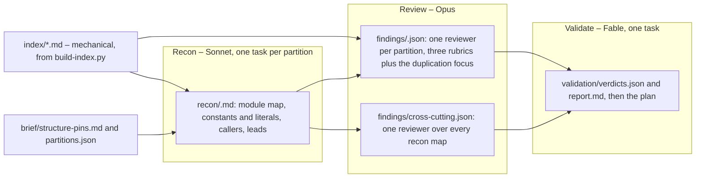

# Simplification sweep – artifacts behind the plan

Companion folder of [2026-09-10-001-refactor-simplify-sweep-plan.md](../2026-09-10-001-refactor-simplify-sweep-plan.md).
The plan's requirements cite finding ids; this folder holds the findings themselves, the verdict
each one received, and the material the reviewers worked from, so the plan can be executed and
audited from a fresh checkout without the session that produced it.

## How it was produced

One dynamic workflow on 2026-09-10, scope `origin/main...HEAD` (which, after the workspace split,
is every source file in the tree), in three phases:

Each partition review started as soon as its own recon map landed; the cross-cutting reviewer
waited for all fifteen. The validator re-read the cited lines of every finding before giving a
verdict, so a finding survives only if its quoted evidence is in the source.

## Folders

| Folder | Contents |
|---|---|
| `brief/` | `structure-pins.md`, the settled decisions every reviewer had to leave alone (restated as KTD4 in the plan); `partitions.json`, the fifteen module clusters with file sizes |
| `index/` | Workspace-wide tables the reviewers cross-checked against: every const and static, repeated string literals, bare numeric literals, function names declared in more than one file. `build-index.py` regenerates them; run it from the repository root |
| `recon/` | One map per partition: purpose and signature of every item, constants with their owners, callers of every public symbol, numbered leads |
| `findings/` | One JSON per partition plus `cross-cutting.json`: 251 findings with quoted evidence, problem, proposal, behavior-preservation argument, confidence (100 verified, 75 located, 50 lead) and a `settled` flag for pin collisions |
| `validation/` | `verdicts.json`: accepted, rejected or merged, with a reason per finding; `report.md`: the readable tables and the highest-value items |

Line numbers throughout are as of commit `e3d95ed` on 2026-09-10 and may drift by a few lines as
the units land.
