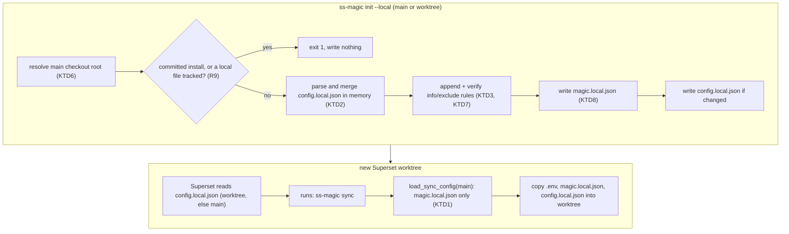
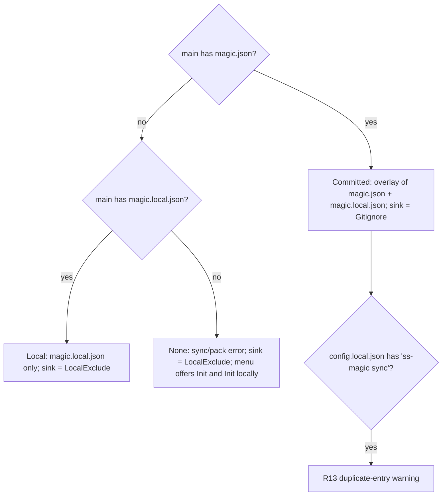

# Local (Uncommitted) Install - Plan

---

## Goal Capsule

- **Objective:** A developer can set up ss-magic for a repository on their own machine without changing any tracked file, and every Superset worktree created afterwards still receives the configured local files.
- **Means:** A second install mode, `local`, that keeps its pattern list in the gitignored `magic.local.json`, registers `ss-magic sync` directly in Superset's `.superset/config.local.json`, and writes its ignore rules into the shared `info/exclude` (KTD1, KTD2, KTD3).
- **Authority hierarchy:** Requirements (R-IDs) win on product behavior. KTDs win on mechanism. Units override neither. Project `CLAUDE.md` conventions (versioning, docs sync, secret-safety rules) bind every unit.
- **Stop conditions:** Stop and report if Superset's local-config contract turns out to reject the object `before` form, or if a local install cannot be made to leave `git status --porcelain` empty.
- **Execution profile:** Rust workspace change confined to `crates/ss-magic-core` (additive only) and `crates/ss-magic`. The plugin crate is not touched.
- **Tail ownership:** CLI version bump to `0.12.0`, docs sync (`README.md`, `CLAUDE.md`, `CONCEPTS.md`, `.cursor/BUGBOT.md`) in the same change.

---

## Product Contract

### Summary

Add `ss-magic init --local [PATTERN...]` and a matching "Initialize ss-magic locally" menu entry.
A local install writes only gitignored files into the main checkout: `.superset/magic.local.json` (the pattern list) and `.superset/config.local.json` (Superset's per-machine setup override, which calls `ss-magic sync` directly).
Its ignore rules go to the repository's shared `info/exclude`, not to a tracked `.gitignore`.
Forward sync, reverse sync, the merge cockpit and pack all work on a local install, and `config.local.json` is itself a forward-sync pattern so it reaches every worktree.

### Problem Frame

Today `ss-magic init` writes a committed workspace contract: `magic.json`, the `magic.sh` wrapper, a rewritten `.superset/config.json` `setup` array, and new `.gitignore` rules.
A developer who uses Superset on a team that does not (yet) use ss-magic cannot adopt it without proposing those files to the team.
Superset already offers a per-machine override file, `.superset/config.local.json`, that merges on top of the committed `config.json` (see Sources).
ss-magic has no path that uses it, so personal adoption is impossible without dirtying the repository.

### Key Decisions

- **A local install never writes or invokes `magic.sh`.** Superset calls the binary directly. (session-settled: user-directed — chosen over reusing the committed `magic.sh` wrapper: the wrapper is a committed file, and a local install must commit nothing.) Governs R3.
- **A local install registers its setup step in Superset's `config.local.json`.** (session-settled: user-directed — chosen over editing the tracked `.superset/config.json` `setup` array: a local install must commit nothing.) Governs R3, R4.
- **`config.local.json` is copied into worktrees.** (session-settled: user-directed — chosen over leaving it only in the main checkout: the user asked for it to be copied.) Governs R6.
- **A local install does not need a committed `magic.json`.** (session-settled: user-directed — chosen over requiring a tracked `magic.json` as `init` does today: stated in the request.) Governs R2, R7.
- **`config.local.json` travels main to worktree only.** It holds commands Superset runs for every new workspace, so a worktree edit must never reach main through reverse sync. Governs R12.

### Requirements

**Installing locally**

- R1. `ss-magic init --local [PATTERN...]` and the main-checkout menu entry "Initialize ss-magic locally" create a local install in the main checkout, also when run from a linked worktree, without opening a commit prompt.
- R2. A local install stores its sync patterns only in `.superset/magic.local.json`, seeded with `.superset/magic.local.json`, `.superset/config.local.json` and the chosen patterns.
- R3. A local install writes no `magic.sh`, no `magic.json` and no change to `.superset/config.json`.
- R4. A local install adds `ss-magic sync` to the `setup` key of `.superset/config.local.json`, preserving every other key's value and every existing setup entry, and is idempotent on re-run.
- R5. After a local install in a clean checkout, `git status --porcelain` is empty.

**Running on a local install**

- R6. `ss-magic sync` in a worktree copies the local install's patterns from the main checkout, including `.superset/config.local.json` and `.superset/magic.local.json`.
- R7. `ss-magic sync`, `ss-magic reverse-sync`, the interactive Sync cockpit and `ss-magic pack` accept a checkout whose only pattern list is `magic.local.json`.
- R8. On any checkout without a committed `magic.json`, every ignore rule ss-magic adds (backups tree, plugin state tree, reverse-sync secret gate) lands in the repository's `info/exclude`, never in a tracked `.gitignore`.
- R12. Reverse sync (bulk and cockpit) never pushes, merges or deletes `.superset/config.local.json` in the main checkout.

**Coexistence**

- R9. `init --local` refuses, writing nothing, when the main checkout already has a committed install (a `magic.json`, or a `config.json` `setup` that the migrate/normal detection recognizes), or when `.superset/magic.local.json` or `.superset/config.local.json` is tracked.
- R10. The main-checkout menu recognizes an existing local install and offers to edit its patterns (selection replaces the list) and to pack.
- R11. Committed-install behavior is unchanged, and the plugin crate's behavior is unchanged.
- R13. When a committed install exists and `config.local.json` still carries the `ss-magic sync` entry, the main-checkout menu and committed `init` print a warning naming the duplicate entry.

### Acceptance Examples

- AE1. **Covers R1, R2, R3, R5.**
  - **Given:** a clean git repository with a committed `.gitignore` and no `.superset/`.
  - **When:** `ss-magic init --local .env` runs in the main checkout.
  - **Then:** `magic.local.json` lists `.superset/magic.local.json`, `.superset/config.local.json`, `.env`; `config.local.json` is `{"setup": {"before": ["ss-magic sync"]}}`; no `magic.sh`, `magic.json` or `config.json` exists; `git status --porcelain` prints nothing.
- AE2. **Covers R3, R4.**
  - **Given:** a committed `.superset/config.json` with `setup: ["bun install"]`.
  - **When:** `ss-magic init --local` runs.
  - **Then:** `config.json` is byte-identical; `config.local.json` carries `ss-magic sync` in `setup.before`.
- AE3. **Covers R4.**
  - **Given:** an existing `config.local.json` of `{"setup": ["./mine.sh"], "teardown": {"after": ["x"]}, "note": 1}`.
  - **When:** `ss-magic init --local` runs twice.
  - **Then:** `setup` is `["ss-magic sync", "./mine.sh"]`; `teardown` and `note` keep their values; the second run does not rewrite the file.
- AE4. **Covers R6, R7.**
  - **Given:** a local install in main with `.env` present, and a fresh linked worktree.
  - **When:** `ss-magic sync` runs in the worktree.
  - **Then:** the worktree gains `.env`, `.superset/magic.local.json` and `.superset/config.local.json`.
- AE5. **Covers R8.**
  - **Given:** a local install, and a worktree file `secret.key` that matches a pattern and is not ignored in main.
  - **When:** `ss-magic reverse-sync` runs in the worktree.
  - **Then:** an anchored `secret.key` rule is appended to `info/exclude` in the common git dir; main's `.gitignore` is unchanged; the file lands in main; `git status --porcelain` in main is empty.
- AE6. **Covers R9.**
  - **Given:** a checkout that already has `.superset/magic.json`.
  - **When:** `ss-magic init --local` runs.
  - **Then:** it exits 1 with a message naming the committed install, and no file changes.
- AE7. **Covers R1.**
  - **Given:** a repository with no install and a linked worktree.
  - **When:** `ss-magic init --local .env` runs inside the worktree.
  - **Then:** the main checkout's `.superset/` gains both local files, the worktree gains none, and the output names the main checkout root.
- AE8. **Covers R12.**
  - **Given:** a local install and a worktree whose `config.local.json` was edited.
  - **When:** `ss-magic reverse-sync` runs in the worktree.
  - **Then:** main's `config.local.json` is unchanged, and the file is not offered in the cockpit.

### Scope Boundaries

- The plugin keeps reading `plugin.enabled` from `magic.json`'s overlay, so on a local-only install the plugin stays inert. `ss-magic-plugin enable` (without `--local`) would create a tracked `magic.json` and turn the checkout into a committed install, so the README tells local-install users not to enable the plugin yet.
- No conversion between modes (local to committed, or back) beyond the R13 warning. A user who later wants a committed install deletes the local files and runs `ss-magic init`.
- No uninstall verb for a local install.
- `config.local.json` is not added to the committed install's default patterns. Only a local install syncs it.
- Confidentiality controls for synced secret files and pack archives (file modes, retention) are unchanged; a local install uses the same copy and pack behavior as a committed one.

#### Deferred to Follow-Up Work

- Plugin support for local installs (`enabled` resolution, `enable` writing to `magic.local.json`, `seed-config`, the state-tree rule through the local sink), released on the `ss-magic-plugin` line.
- A "convert local install to committed" menu entry.
- Making `.superset/magic.local.json` forward-only as well. It controls which files a later bulk reverse sync pushes, but that exposure exists today on committed installs too.

### Sources

- Superset local config contract: https://docs.superset.sh/setup-teardown-scripts#local-config. `.superset/config.local.json` sits beside `config.json`; each key is either a plain array (replaces the committed key) or an object with `before`/`after` arrays (wraps the committed key); unspecified keys pass through; a worktree's copy wins over the main repo's.
- The same page says the file is "gitignored automatically" without saying how, so ss-magic does not rely on it (KTD3).

---

## Planning Contract

### Key Technical Decisions

- KTD1. **Install mode is derived from files, never stored.** `install_mode(main_root)` returns `Committed` when `.superset/magic.json` exists, `Local` when `magic.json` is absent and `.superset/magic.local.json` exists, and `None` otherwise. A new core loader `load_sync_config` uses the same predicate: the overlaid config when `magic.json` exists, the `magic.local.json` config alone when only it exists, and nothing otherwise. The `ss-magic sync` marker in `config.local.json` does not decide the mode; it only makes the setup merge idempotent (KTD2) and drives the R13 warning. The existing `load_overlaid` keeps its exact behavior because the plugin crate calls it (R11). Governs R7, R10, R11.
- KTD2. **The setup entry goes into `setup.before`, as the literal `ss-magic sync`.** `before` runs ss-magic ahead of the team's committed setup, so files such as `.env` exist before `bun install` or migrations run, and it leaves the committed steps in place. When `setup` is already a plain array (the replace form), the entry is prepended to that array instead. When the marker already appears anywhere in `setup`, nothing changes and the file is not rewritten. A `setup` value of any other JSON type is refused rather than overwritten. The literal matches the existing marker test (`entry_is_magic_marker` matches `ss-magic sync`). (session-settled: user-directed — chosen over calling the committed `magic.sh` wrapper: the wrapper is committed.) Governs R3, R4.
- KTD3. **Local ignore rules go to `<git-common-dir>/info/exclude`, and each append is verified.** That file is untracked, and git reads it for the main checkout and for every linked worktree (confirmed on git 2.56). Each rule is skipped when git already ignores the path. New rules are root-anchored literals (`/.superset/backups/`, `/secret.key`). The writer creates `info/` when it is missing, appends without reordering, and then re-checks with git. `info/exclude` has lower precedence than any tracked `.gitignore`, so a tracked negation can override the rule; the re-check turns that case into an error naming the path instead of a silent leak. Governs R5, R8.
- KTD4. **The ignore sink fails safe: only a committed install writes `.gitignore`.** Reverse sync, the cockpit and the forward backup pass resolve `install_mode` once from the main root. `Committed` maps to the `Gitignore` sink; `Local` and `None` map to `LocalExclude`. An unknown state therefore never dirties a tracked file. The sink is threaded into the backups rule and the secret gate. The secret gate keeps its strict re-check after the append: git must report the path ignored, or the push fails. Governs R8.
- KTD5. **Core additions are additive.** New functions sit beside `ensure_path_ignored` and `load_overlaid`; no existing signature changes, `state_tree` is untouched, and serde_json's `preserve_order` stays off. The plugin crate calls `load_overlaid` and re-exports `ensure_state_ignored`, so an additive change keeps the plugin binary's behavior identical and needs no plugin release. A consequence: rewriting `config.local.json` through a `serde_json::Map` sorts its keys alphabetically. Values survive, and an unchanged file is not rewritten (KTD2). Governs R11.
- KTD6. **The local install lives in its own module and always targets the main checkout.** `crates/ss-magic/src/workspace/local_install.rs` owns the interactive and non-interactive local init, so `migrate.rs` keeps its committed-layout scope. It resolves `git::main_checkout_root` from the cwd root, because Superset reads the main checkout's `config.local.json` and sync loads patterns from the main root; a worktree-local install would be dead. It reuses `build_pattern_options`, `ui::pick_patterns` and `merge_files_into_magic_config`. It does not run the legacy `~/.claude/skills` cleanup, which stays with committed init/migrate. Governs R1.
- KTD7. **No finishing-action prompt; ignore rules are written before the files.** A local install has nothing to commit, so it skips `pick_final_action`. In the interactive flow the pattern picker is the confirmation: Esc there returns before any write. All inputs (guard, `config.local.json` parse, merge) are validated first; then the `info/exclude` rules are written and verified; only then are the two JSON files written. A failure before the files leaves at most untracked exclude lines, never an unignored local file. Governs R1, R5.
- KTD8. **Interactive edit replaces the list; non-interactive init appends.** The interactive entry, which serves both first install and the edit menu entry, sets `files` to the local defaults followed by the picker selection, carrying `extras` (including `_comment`) through `merge_files_into_magic_config`, as committed `run_init` does. So deselecting a pattern removes it. The non-interactive `init --local PATTERN...` appends new patterns to the existing list. Governs R2, R10.
- KTD9. **`config.local.json` is excluded from reverse sync at the enumeration layer.** `compute_candidates` and `compute_reconcile_set` drop `.superset/config.local.json` beside their existing `under_excluded_tree` filter. Forward sync, which reads patterns from main, still copies it. It is not added to `EXCLUDED_TREES`, because that list also removes paths from forward sync and pack. Governs R12.
- KTD10. **A `PATH` check at install time is advisory only.** A local install prints a warning when the current `PATH` cannot resolve `ss-magic`. This catches only an invocation by absolute path; it does not prove that Superset's own environment resolves the binary. The README states the requirement, and the manual Superset smoke is the real check.

### High-Level Technical Design

### Assumptions

- Superset reads the main checkout's `.superset/config.local.json` when a new worktree has none, also when no `config.json` exists.
- Superset honors the object `before` form described in its docs.
- Superset runs `config.local.json` setup entries through a shell whose `PATH` resolves `ss-magic`.
- The worktree's copy of `config.local.json` equals main's at creation time. A later edit to main's copy reaches an existing worktree only on its next `ss-magic sync`.

### Risks

- **Superset cannot find `ss-magic`.** Workspace setup then fails, and with `setup.before` it fails ahead of the team's committed steps, instead of printing `magic.sh`'s install hint. Mitigation: README requirement and the manual Superset smoke; KTD10's warning is advisory only.
- **An older binary runs `init --local`.** A 0.11.x parser drops unknown flags after `init` and performs a committed init. Mitigation: the README tells users to run `ss-magic update` (or check `--version` is 0.12.0 or later) first.
- **A tracked `.gitignore` negation overrides an `info/exclude` rule.** Mitigation: the KTD3 re-check fails loudly.

---

## Implementation Units

### U1. Core: local config model, sync loader and install mode

- **Goal:** Give core everything the CLI needs to read and write a local install's files.
- **Requirements:** R2, R4, R7, R11; KTD1, KTD2, KTD5.
- **Dependencies:** none.
- **Files:** `crates/ss-magic-core/src/superset_files.rs`, `crates/ss-magic-core/src/superset_files/tests.rs`.
- **Approach:**
  1. Add the `config.local.json` name and a raw-map loader for it (absent is `None`, malformed is a hard error naming the path, like `read_json`).
  2. Add a pure merge that inserts the sync entry per KTD2 and reports whether anything changed.
  3. Add an atomic writer for `config.local.json`, through the existing staged-sibling-plus-rename helper used by `write_magic_json`.
  4. Add `LOCAL_SYNC_ENTRY`, a marker test over any `setup` shape, and the local-install default patterns (`.superset/magic.local.json`, `.superset/config.local.json`).
  5. Add `load_sync_config(root)` and `install_mode(root)` per KTD1, leaving `load_overlaid` untouched.
- **Patterns to follow:** `load_overlaid` error wording; `merge_setup_into_config` preservation discipline; `MagicConfig.extras` round-trip.
- **Test scenarios:**
  - Absent `config.local.json` merges to `{"setup": {"before": ["ss-magic sync"]}}`.
  - Object `setup` with `after` only gains a `before` holding the entry; `after` is unchanged.
  - Object `setup` with an existing `before` gets the entry prepended.
  - Array `setup` `["./mine.sh"]` becomes `["ss-magic sync", "./mine.sh"]` (Covers AE3).
  - Marker already in `before`, in `after` or in the array: merge reports no change.
  - `setup` as a string or number: merge returns an error.
  - Unknown top-level keys and the `teardown` key keep their values through a merge and write.
  - Malformed `config.local.json` is an error naming the path.
  - `load_sync_config`: `magic.json` present returns the overlay; absent with `magic.local.json` returns the local list; both absent returns `None`.
  - `install_mode`: `Committed`, `Local` and `None` cases, including `magic.json` present together with `magic.local.json` (committed wins).
- **Verification:** core tests pass, and `load_overlaid`'s existing tests pass unchanged.

### U2. Core: local-exclude ignore sink

- **Goal:** Write verified ignore rules into the shared `info/exclude` when asked.
- **Requirements:** R5, R8, R11; KTD3, KTD5.
- **Dependencies:** none.
- **Files:** `crates/ss-magic-core/src/git/mod.rs`, `crates/ss-magic-core/src/git/gitignore.rs`, `crates/ss-magic-core/src/git/gitignore/tests.rs`.
- **Approach:**
  1. Add a `git_common_dir(root)` probe that returns an absolute path (resolve a relative `--git-common-dir` answer against `root`, as `main_checkout_root` does).
  2. Add an `IgnoreSink` enum and an `ensure_path_ignored_in(sink, target_root, rule_source_root, rel, kind)` that delegates to `ensure_path_ignored` for `Gitignore` and to a new local-exclude writer for `LocalExclude`.
  3. The local-exclude writer probes git first (skip when already ignored), appends a root-anchored literal to `<common>/info/exclude` (creating the directory and file when absent), then re-checks and returns an error naming the path when git still does not ignore it.
- **Patterns to follow:** `gitignore::ensure_entry` append rules; `is_ignored_opt` trailing-slash directory probe; `ensure_gitignored_in_main`'s strict re-check.
- **Test scenarios:**
  - Main checkout: a `LocalExclude` file rule appends `/x.key` to `.git/info/exclude`, and `git check-ignore` then reports it ignored; `.gitignore` is not created.
  - Linked worktree: a rule written from the main root is honored inside the worktree.
  - A `Dir` rule is written with a trailing slash and matches before the directory exists.
  - A path already ignored by a committed `.gitignore` returns `Already` and writes nothing.
  - Missing `info/` directory is created.
  - Re-running appends no duplicate line.
  - A tracked `.gitignore` negation `!/.superset/backups/` makes the writer return an error.
  - `Gitignore` sink behaves exactly as `ensure_path_ignored`.
- **Verification:** core tests pass; no change in any plugin-crate file.

### U3. CLI: local install flows

- **Goal:** Implement interactive and non-interactive local install.
- **Requirements:** R1, R2, R3, R4, R5, R9; KTD6, KTD7, KTD8, KTD10.
- **Dependencies:** U1, U2.
- **Files:** `crates/ss-magic/src/workspace/local_install.rs` (new), `crates/ss-magic/src/workspace/local_install/tests.rs` (new), `crates/ss-magic/src/workspace/mod.rs`.
- **Approach:**
  1. Resolve the main checkout root from the cwd root (KTD6) and print it.
  2. A shared guard refuses when `install_mode` is `Committed`, when `migrate::detect_branch` on `config.json` returns `Migrate` or `Normal`, or when `git::tracked_files` lists either local file (R9).
  3. Compute everything in memory: the new `magic.local.json` (KTD8 semantics per entry point) and the merged `config.local.json`.
  4. Write in KTD7 order: `LocalExclude` rules for `.superset/magic.local.json`, `.superset/config.local.json`, `.superset/backups/` and `.superset/.magic/`; then `magic.local.json` via `write_magic_local_json`; then `config.local.json` only when the merge changed it.
  5. The non-interactive entry takes CLI patterns. The interactive entry runs `build_pattern_options` seeded from the existing `magic.local.json` files and `ui::pick_patterns`, prints a summary, then writes.
  6. Both print the KTD10 `PATH` warning when `ss-magic` does not resolve.
- **Patterns to follow:** `migrate::run_init_noninteractive` output lines; `init_magic_files` dedupe order (defaults first).
- **Test scenarios:**
  - Covers AE1. Fresh repo with committed `.gitignore`: files written as listed, no `magic.sh`/`magic.json`/`config.json`, `git status --porcelain` empty.
  - Covers AE2. Committed `config.json` stays byte-identical.
  - Covers AE6. `magic.json` present: exit code 1, no file created or changed.
  - Covers AE7. Run from a linked worktree: files land in main, none in the worktree.
  - `config.json` with a `magic.sh` marker but no `magic.json`: refused.
  - `config.json` with a `setup.sh` entry: refused, with a message pointing at migration.
  - A tracked `.superset/config.local.json`: refused, no write.
  - Non-interactive re-run with an extra pattern: the pattern is appended once; existing custom patterns and `_comment` are kept.
  - Interactive write with one previously selected pattern deselected: the pattern is gone; `_comment` is kept.
  - A malformed `config.local.json`: error, and neither JSON file nor `info/exclude` changes.
- **Verification:** new module tests pass; manual smoke of the interactive picker in a scratch repo.

### U4. CLI wiring: argv, menu and loaders

- **Goal:** Expose local install and make sync, reverse sync, the cockpit and pack accept it.
- **Requirements:** R1, R6, R7, R10, R12, R13; KTD1, KTD9.
- **Dependencies:** U1, U3.
- **Files:** `crates/ss-magic/src/cli.rs`, `crates/ss-magic/src/cli/tests.rs`, `crates/ss-magic/src/main.rs`, `crates/ss-magic/src/tui/menu.rs`, `crates/ss-magic/src/tui/menu/tests.rs`, `crates/ss-magic/src/workspace/migrate.rs`, `crates/ss-magic/src/workspace/migrate/tests.rs`, `crates/ss-magic/src/pack.rs`, `crates/ss-magic/src/sync/reverse_sync.rs`, `crates/ss-magic/src/sync/reverse_sync/tests.rs`, `crates/ss-magic/src/tests/sync.rs`.
- **Approach:**
  1. `Parsed::Init` carries a `local` flag set by `--local` anywhere after `init`; USAGE documents `init --local [PATTERN...]`.
  2. `main.rs` routes the flag to the U3 non-interactive entry.
  3. `Branch` gains `Local`; `detect_branch` takes the main root's `install_mode` and returns `Local` only when `config.json` yields neither `Migrate` nor `Normal` and the mode is `Local`.
  4. `operations_for(Main, Init)` offers `[Init, InitLocal]`; `operations_for(Main, Local)` offers `[EditConfigLocal, Pack]`. The main-checkout dispatch routes both new ops to the U3 interactive entry.
  5. The main-checkout menu and committed `run_init`/`run_init_noninteractive` print the R13 warning when the mode is `Committed` and `config.local.json` carries the marker.
  6. `load_magic_or_exit` (sync and pack) and reverse sync's candidate loaders switch to `load_sync_config`; the absent-config error names both `magic.json` and `magic.local.json`.
  7. `compute_candidates` and `compute_reconcile_set` drop `.superset/config.local.json` (KTD9).
- **Patterns to follow:** `has_no_backup` whole-slice flag scan; existing `operations_for` truth-table tests; the `under_excluded_tree` filter sites.
- **Test scenarios:**
  - `init --local .env` parses to local with patterns `[".env"]`; `init .env --local` parses the same; `init .env` stays committed.
  - `detect_branch` truth table extended with the local column: `setup.sh` still wins, magic marker still `Normal`, neither plus `Local` mode is `Local`.
  - `operations_for` rows for `Init` and `Local`, and every offered op has a dispatch arm (none reaches `unreachable!`).
  - Covers AE4. Integration: local install in main, `sync_core` in a fresh worktree copies `.env`, `magic.local.json` and `config.local.json`.
  - `sync_core` on a checkout with neither file still exits 1 with the updated message.
  - `pack_core` on a local install archives the local patterns.
  - Covers AE8. A differing worktree `config.local.json` is absent from both `compute_candidates` and `compute_reconcile_set`.
  - Committed install plus a marked `config.local.json`: the R13 warning text is produced.
- **Verification:** `cargo test --workspace --locked` passes.

### U5. Mode-aware ignore rules in sync flows

- **Goal:** Keep every lazily added ignore rule out of tracked files unless the install is committed.
- **Requirements:** R8; KTD4.
- **Dependencies:** U1, U2.
- **Files:** `crates/ss-magic/src/sync/reverse_sync.rs`, `crates/ss-magic/src/sync/reverse_sync/tests.rs`, `crates/ss-magic/src/main.rs`, `crates/ss-magic/src/tests/reverse_sync_flow.rs`.
- **Approach:**
  1. Resolve the sink once per flow from `install_mode(main_root)` per KTD4.
  2. Thread it into `ensure_backups_ignored` / `backups_root_for` and `ensure_gitignored_in_main`, via `ApplyContext` for the cockpit and bulk paths and via the forward backup pass's caller.
  3. Keep the strict re-check in `ensure_gitignored_in_main` for both sinks.
- **Patterns to follow:** the existing `ApplyContext` threading of `backup`.
- **Test scenarios:**
  - Covers AE5. Bulk reverse sync on a local install: `info/exclude` gains the anchored rule; main's `.gitignore` is unchanged; the secret lands in main.
  - Same scenario on a committed install: the rule still goes to `.gitignore` (regression guard).
  - No `magic.json`, a `magic.local.json`, and no `config.local.json`: the rule lands in `info/exclude`.
  - Forward sync with backups on a local install where the `info/exclude` backups rule was removed: the rule is re-added to `info/exclude`, not `.gitignore`.
  - Secret gate with a sink write that git does not honor: the push fails (strict re-check preserved).
- **Verification:** reverse-sync suites pass; after the AE5 scenario, `git status --porcelain` in main is completely empty, because the pushed file is ignored through `info/exclude`.

### U6. Version bump and docs

- **Goal:** Ship the change on the CLI release line with docs that match the code.
- **Requirements:** R11.
- **Dependencies:** U3, U4, U5.
- **Files:** `crates/ss-magic/Cargo.toml`, `Cargo.lock`, `README.md`, `CLAUDE.md`, `CONCEPTS.md`, `.cursor/BUGBOT.md`.
- **Approach:**
  1. Bump `ss-magic` to `0.12.0` in `Cargo.toml` and `Cargo.lock` (new user-visible behavior, minor bump; the plugin line stays `1.0.1`).
  2. README: a "Local install" section covering the command, the files written, `info/exclude`, the requirement that Superset's environment resolves `ss-magic`, updating to 0.12.0 first, and not enabling the plugin on a local install. Add the command to the command list.
  3. `CLAUDE.md`: Architecture entries for `local_install.rs`, the new core loaders, the ignore sink, `Branch::Local` and the reverse-sync exclusion; the `cli.rs` and menu descriptions.
  4. `CONCEPTS.md`: a "Local install" entry beside "Workspace contract".
  5. `.cursor/BUGBOT.md`: restate inline that a local install must never write a tracked file and that `config.local.json` never reverse-syncs into main.
- **Test expectation:** none -- docs and version surfaces; covered by `build-plugin-zip.py --check`.
- **Verification:** `python3 scripts/build-plugin-zip.py --check` passes all eight lines, including `distinct release lines`.

---

## Verification Contract

| Gate | Command | Applies to |
|---|---|---|
| Rust suite | `cargo test --workspace --locked` | U1-U5 |
| Lints | `cargo clippy --workspace --all-targets --locked` | U1-U5 |
| Release surfaces | `python3 scripts/build-plugin-zip.py --check` | U6 |
| Plugin builder selftest | `python3 scripts/build-plugin-zip.py --selftest` | U6 (unchanged, must stay green) |
| Plugin isolation | `cargo tree --locked -p ss-magic-plugin -i self_update` (and `inquire`, `ratatui`) report no match | U2, U5 |
| Manual smoke (CLI) | `ss-magic init --local .env` in a scratch repo, then `git status --porcelain` is empty and `ss-magic sync` in a new worktree copies the files | U3, U4 |
| Manual smoke (Superset) | When Superset is available: create a workspace through Superset for a local-install repo with no `config.json`, and confirm the setup step ran and the files exist | Assumptions |

---

## Definition of Done

- Every R1-R13 is covered by a passing test or one of the manual smokes above.
- No file under `crates/ss-magic-plugin/` or `plugin/` changed.
- Committed-install tests pass without modification other than the `detect_branch` signature update.
- `README.md`, `CLAUDE.md`, `CONCEPTS.md` and `.cursor/BUGBOT.md` describe local install as implemented.
- CLI version is `0.12.0` in `Cargo.toml` and `Cargo.lock`.
- No dead or experimental code from abandoned approaches remains in the diff.
