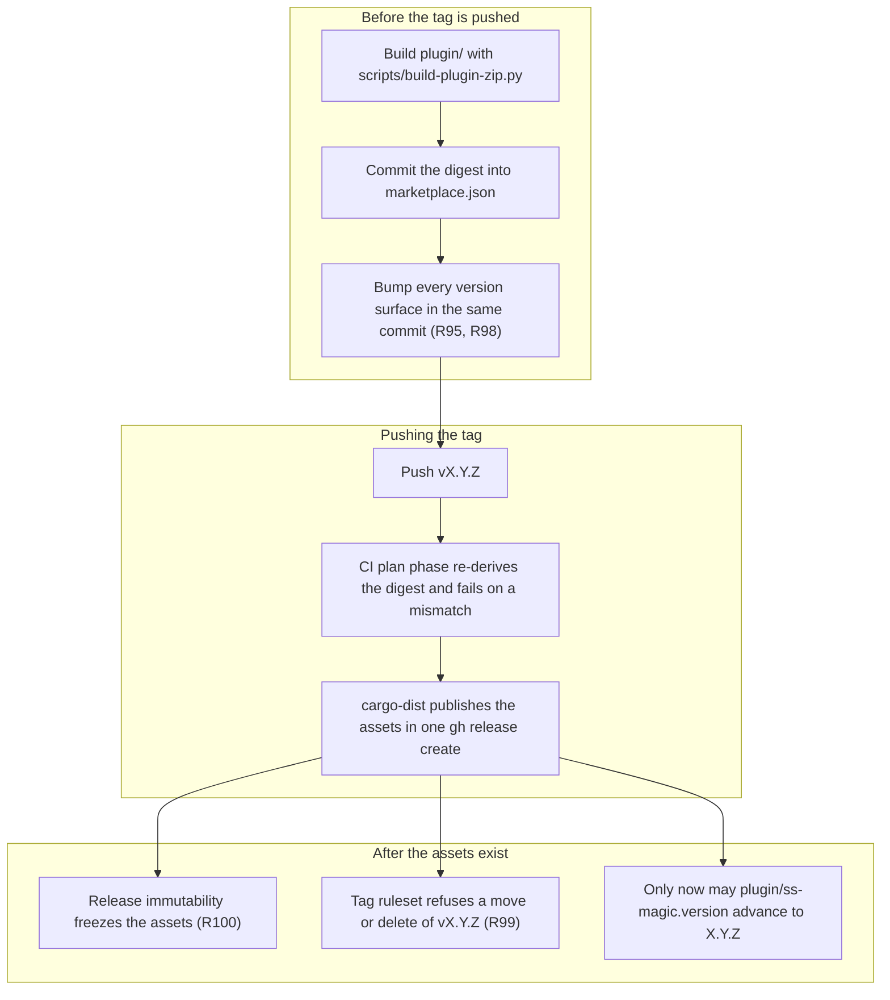

# Runbook: tag ruleset and release immutability

**Status: NOT APPLIED.** Everything below describes forge settings on
`ViktorStiskala/superset-magic` that a repository administrator must apply by hand. The agent that
wrote this runbook has no authority to change repository settings and deliberately did not try. Tick
the verification section off once a human has applied them.

## Why these two settings exist

The plugin reaches a machine as a **release asset pinned by SHA-256** in
[.claude-plugin/marketplace.json](../../.claude-plugin/marketplace.json). That pin is the only
integrity control on the plugin, and it is only as strong as the immutability of the thing it names.
Two forge-side controls close the gap:

- **R99 – a tag ruleset.** Without it, a released tag can be force-moved or deleted and recreated, so
  "the plugin at v0.10.0" stops being a fixed set of bytes.
- **R100 – release immutability.** Without it, a release asset can be **replaced under its existing
  name with the tag untouched** – demonstrated, not theoretical. The marketplace url would then serve
  different bytes, the digest check would fail for every user, and the plugin would simply stop
  installing.

Neither is self-protecting on a personal account: the owner, or any token with classic `repo` scope,
can delete the ruleset or disable immutability. They raise the cost of a mistake and make an
intentional change visible; they are not a boundary against the account owner.

Neither applies retroactively. Releases published before immutability was enabled stay mutable and
are **not** a trust root.

## The release ordering these settings enforce

Two pins move in opposite orders, and the settings below are what make the ordering meaningful.



The marketplace digest is committed **before** the tag, because the builder can produce it from the
working tree. Between that commit and the release publishing, the entry's `url` names an asset that
does not exist yet; that is expected and self-correcting. The binary pin in `plugin/ss-magic.version`
is the opposite: advancing it before the named release's assets are published makes the bootstrap's
fetch 404, so nothing installs and every hook fails open with no visible error.

The obvious workaround for a mis-cut release – tag, rebuild, commit the new digest, move the tag – is
exactly what the ruleset forbids. GitHub's own documentation is blunt about it: *"Git tags cannot be
moved."* Cut a new patch release instead.

## R99 – the tag ruleset

Apply this exactly. Every field is load-bearing.

| field | value | why |
|---|---|---|
| `target` | `tag` | branches are covered by ordinary branch protection, separately |
| `enforcement` | `active` | `evaluate` reports without blocking, which is not the point |
| `conditions.ref_name.include` | `["~ALL"]` | **not** `refs/tags/v*`. The release workflow triggers on `**[0-9]+.[0-9]+.[0-9]+*`, so a `0.9.1` tag with no `v` prefix would otherwise be uncovered |
| `rules` | `deletion`, `non_fast_forward`, `update` | delete, force-move, and update of an existing tag |
| `creation` | **deliberately absent** | it blocks tag *creation* for the owner too, which breaks releases – a maintainer pushing the tag is what triggers the pipeline |
| `bypass_actors` | `[]` | a bypass actor is a hole in the only control that makes a released tag mean something |

```bash
gh api --method POST repos/ViktorStiskala/superset-magic/rulesets \
  --input - <<'JSON'
{
  "name": "Released tags are immutable",
  "target": "tag",
  "enforcement": "active",
  "bypass_actors": [],
  "conditions": { "ref_name": { "include": ["~ALL"], "exclude": [] } },
  "rules": [
    { "type": "deletion" },
    { "type": "non_fast_forward" },
    { "type": "update" }
  ]
}
JSON
```

In the web UI the same thing is Settings → Rules → Rulesets → New ruleset → New tag ruleset, with
the target pattern set to **All tags**, enforcement **Active**, no bypass list, and the three rules
above ticked while **Restrict creations** stays unticked.

### Verifying it (AE83)

```bash
# The ruleset exists, is active, targets every tag, and has no bypass actors.
gh api repos/ViktorStiskala/superset-magic/rulesets \
  --jq '.[] | select(.target=="tag") | {id, name, enforcement}'

gh api repos/ViktorStiskala/superset-magic/rulesets/<id> \
  --jq '{enforcement, bypass: (.bypass_actors|length), include: .conditions.ref_name.include, rules: [.rules[].type]}'
```

Expected: `enforcement: "active"`, `bypass: 0`, `include: ["~ALL"]`, and `rules` containing exactly
`deletion`, `non_fast_forward` and `update`.

Then prove it against a real tag, as the repository owner – the point of the check is that the owner
is not exempt:

```bash
# 1. Deleting a released tag must be refused.
git push origin :refs/tags/v0.9.0

# 2. Force-moving a released tag must be refused.
git tag -f v0.9.0 HEAD && git push --force origin v0.9.0

# 3. Creating a NEW tag must still succeed, or the release pipeline is broken.
git tag test-ruleset-creation && git push origin test-ruleset-creation
git push origin :refs/tags/test-ruleset-creation   # this must now be refused too
```

Step 3 leaves a stray tag behind on purpose: with the ruleset active it cannot be deleted, which is
itself the confirmation. Use a name that is obviously disposable and not a version, since the release
workflow only triggers on version-shaped tags.

## R100 – release immutability

```bash
# Enable.
gh api --method PUT repos/ViktorStiskala/superset-magic/immutable-releases

# Confirm.
gh api repos/ViktorStiskala/superset-magic/immutable-releases
```

If that endpoint is not available on the account, the equivalent lives in the web UI under
Settings → General → Releases → **Immutable releases**. Disabling is
`gh api --method DELETE repos/ViktorStiskala/superset-magic/immutable-releases`; record here if it is
ever turned off, and why.

This is compatible with the pipeline as it stands: cargo-dist attaches every asset in the same
`gh release create` call that creates the release, and no later job touches it. The plugin zip rides
that same call as a `[[dist.extra-artifacts]]` entry, so it is frozen with everything else.

### Verifying it (AE84)

```bash
# Replacing a published asset under its existing name must be refused.
gh release upload v0.9.0 ss-magic-plugin-v0.9.0.zip --clobber
```

Expect a refusal. A release published **before** immutability was enabled will accept this, which is
the non-retroactivity limit stated above rather than a failure of the setting – run the check against
the first release cut after enabling it.

## Restoring these settings

If either is ever removed, this file is the record of what to put back. The ruleset JSON above is
complete and can be re-`POST`ed verbatim; immutability is the single `PUT`. Re-run both verification
sections afterwards, because a ruleset that exists but is set to `evaluate`, or one that acquired a
bypass actor, looks correct in a list and enforces nothing.
