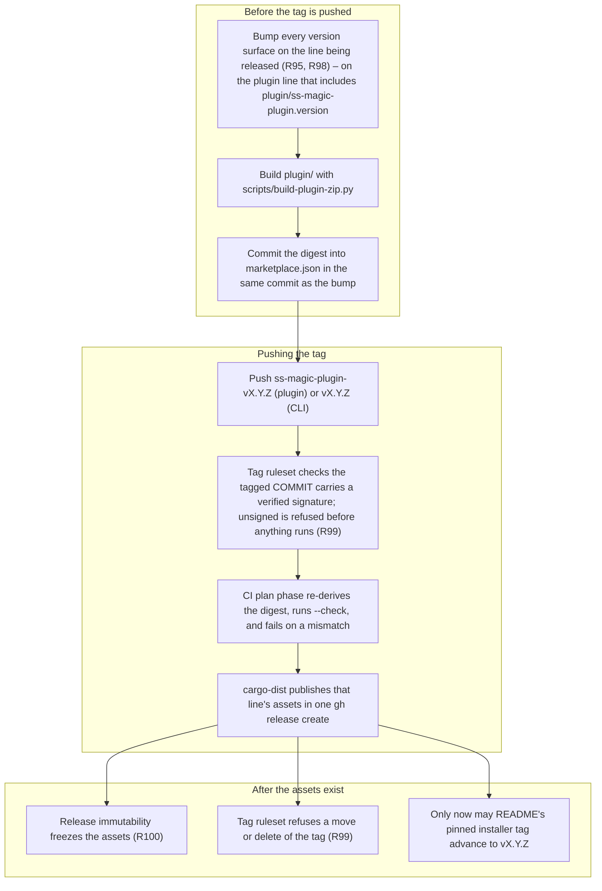

# Runbook: tag ruleset and release immutability

**Status: APPLIED and VERIFIED.** Both settings exist on `ViktorStiskala/superset-magic`, applied by
the repository owner on 2026-08-31 (before `v0.10.0` was published) and proved against the live
repository on 2026-09-08 – the evidence sits in the two verification sections below. This file
remains the record of what to put back if either is ever removed.

| control | state on 2026-09-08 |
|---|---|
| tag ruleset | `Protect tags`, id `21921226`, `active`, all tags, no bypass actors, rules `deletion`, `non_fast_forward`, `update`, `required_signatures` |
| release immutability | enabled (`enforced_by_owner: false`); `v0.11.0` and `v0.10.0` immutable, `v0.9.0` and older not (published before it was enabled) |

The ruleset carries one rule beyond the three this runbook originally specified,
`required_signatures`, and its meaning was measured rather than assumed – see the R99 table.

## Why these two settings exist

The plugin reaches a machine as a **release asset pinned by SHA-256** in
[.claude-plugin/marketplace.json](../../.claude-plugin/marketplace.json). That pin is the only
integrity control on the plugin, and it is only as strong as the immutability of the thing it names.
Two forge-side controls close the gap:

This repository publishes **two release lines** out of one workspace, so both tag shapes matter here:
`v*` for the `ss-magic` sync CLI and `ss-magic-plugin-v*` for the Claude Code plugin. The plugin's zip
and per-target archives ride the second shape; the CLI's installer and archives ride the first.

- **R99 – a tag ruleset.** Without it, a released tag can be force-moved or deleted and recreated, so
  "the plugin at ss-magic-plugin-v1.0.0" stops being a fixed set of bytes.
- **R100 – release immutability.** Without it, a release asset can be **replaced under its existing
  name with the tag untouched** – demonstrated, not theoretical. The marketplace url would then serve
  different bytes, the digest check would fail for every user, and the plugin would simply stop
  installing.

Neither is self-protecting on a personal account: the owner, or any token with classic `repo` scope,
can delete the ruleset or disable immutability. They raise the cost of a mistake and make an
intentional change visible; they are not a boundary against the account owner.

Neither applies retroactively. Releases published before immutability was enabled stay mutable and
are **not** a trust root.

## The release ordering these settings enforce

Two pins move in opposite orders, and the settings below are what make the ordering meaningful.


```mermaid
flowchart TD
  subgraph before["Before the tag is pushed"]
    A["Bump every version surface on the line being released (R95, R98) – on the plugin line that includes plugin/ss-magic-plugin.version"] --> B["Build plugin/ with scripts/build-plugin-zip.py"]
    B --> C["Commit the digest into marketplace.json in the same commit as the bump"]
  end
  subgraph tagging["Pushing the tag"]
    C --> D["Push ss-magic-plugin-vX.Y.Z (plugin) or vX.Y.Z (CLI)"]
    D --> S["Tag ruleset checks the tagged COMMIT carries a verified signature; unsigned is refused before anything runs (R99)"]
    S --> E["CI plan phase re-derives the digest, runs --check, and fails on a mismatch"]
    E --> F["cargo-dist publishes that line's assets in one gh release create"]
  end
  subgraph after["After the assets exist"]
    F --> G["Release immutability freezes the assets (R100)"]
    F --> H["Tag ruleset refuses a move or delete of the tag (R99)"]
    F --> I["Only now may README's pinned installer tag advance to vX.Y.Z"]
  end
```

The marketplace digest is committed **before** the tag, because the builder can produce it from the
working tree – and `plugin/ss-magic-plugin.version` moves with it, never after it. The pin is one of
the files under `plugin/` the digest is computed over, and `--check` (which the CI plan phase runs)
requires it to EQUAL the plugin crate's version, so a tag pushed from a tree whose pin still lags is
refused before any asset is built; advancing it after the release would move the digest instead and
leave the frozen zip pinning the previous binary forever. Between the bump commit and the release
publishing, the marketplace entry's `url` names an asset that does not exist yet and the pin names a
release that does not exist yet; both are expected and self-correcting, because an installed bootstrap
only ever reads the pin shipped inside the released zip, which cannot exist before the release does.
README's installer tag is the opposite: a person copies it straight off `main`, so advancing it before
the named CLI release exists 404s the documented install command for everyone who copies it – which
is why `--check` compares that one surface `<=` the crate version rather than `==`, and why it is the
one pin that moves in a follow-up commit.

The obvious workaround for a mis-cut release – tag, rebuild, commit the new digest, move the tag – is
exactly what the ruleset forbids. GitHub's own documentation is blunt about it: *"Git tags cannot be
moved."* Cut a new patch release instead.

## R99 – the tag ruleset

Apply this exactly. Every field is load-bearing.

| field | value | why |
|---|---|---|
| `target` | `tag` | branches are covered by ordinary branch protection, separately |
| `enforcement` | `active` | `evaluate` reports without blocking, which is not the point |
| `conditions.ref_name.include` | `["~ALL"]` | the two shapes to protect are `refs/tags/v*` and `refs/tags/ss-magic-plugin-v*`, but listing them is **not** enough: the release workflow triggers on `**[0-9]+.[0-9]+.[0-9]+*`, so a `0.9.1` tag with no `v` prefix would still be uncovered. `~ALL` is the superset that covers both shapes and anything version-shaped that slips past them |
| `rules` | `deletion`, `non_fast_forward`, `update` | delete, force-move, and update of an existing tag |
| `rules` (also) | `required_signatures` | the COMMITS a tag push introduces must carry a signature GitHub verifies. Measured on 2026-09-08: a lightweight, unsigned tag object pointing at a signed commit was ACCEPTED, and a tag pointing at an unsigned commit was REFUSED with `Commits must have verified signatures`. So the rule is about the commit, not the tag object; a release tag on `main`'s tip passes because every commit there is signed (locally with the maintainer's SSH key, or by GitHub's web-flow key for a merge made in the UI), while a tag on a locally made, unsigned commit is refused before the pipeline starts |
| `creation` | **deliberately absent** | it blocks tag *creation* for the owner too, which breaks releases – a maintainer pushing the tag is what triggers the pipeline |
| `bypass_actors` | `[]` | a bypass actor is a hole in the only control that makes a released tag mean something |

```bash
gh api --method POST repos/ViktorStiskala/superset-magic/rulesets \
  --input - <<'JSON'
{
  "name": "Protect tags",
  "target": "tag",
  "enforcement": "active",
  "bypass_actors": [],
  "conditions": { "ref_name": { "include": ["~ALL"], "exclude": [] } },
  "rules": [
    { "type": "deletion" },
    { "type": "non_fast_forward" },
    { "type": "update" },
    { "type": "required_signatures" }
  ]
}
JSON
```

That JSON is the ruleset as it exists (read back from the API on 2026-09-08), so re-posting it
restores the current state exactly. In the web UI the same thing is Settings → Rules → Rulesets →
New ruleset → New tag ruleset, with the target pattern set to **All tags**, enforcement **Active**,
no bypass list, and the four rules above ticked (`required_signatures` is labelled **Require signed
commits**) while **Restrict creations** stays unticked.

### Verifying it (AE83)

```bash
# The ruleset exists, is active, targets every tag, and has no bypass actors.
gh api repos/ViktorStiskala/superset-magic/rulesets \
  --jq '.[] | select(.target=="tag") | {id, name, enforcement}'

gh api repos/ViktorStiskala/superset-magic/rulesets/<id> \
  --jq '{enforcement, bypass: (.bypass_actors|length), include: .conditions.ref_name.include, rules: [.rules[].type]}'
```

Expected: `enforcement: "active"`, `bypass: 0`, `include: ["~ALL"]`, and `rules` containing exactly
`deletion`, `non_fast_forward`, `update` and `required_signatures`.

**Result on 2026-09-08:** id `21921226`, name `Protect tags`, `enforcement: "active"`, `bypass: 0`,
`include: ["~ALL"]`, `rules: ["deletion", "non_fast_forward", "update", "required_signatures"]`,
created `2026-08-31T12:52:13+02:00`.

Then prove it against a real tag, as the repository owner – the point of the check is that the owner
is not exempt. Run steps 1 and 2 against **both** shapes, since a ruleset scoped to one of them would
pass a check that only ever exercises that one – but only ever against a tag that has actually been
published on that line. At the time of writing every published tag is on the CLI line (the newest is
`v0.11.0`) and no plugin release has been cut at all, so the `ss-magic-plugin-v*` half of steps 1 and
2 waits for the first plugin release: run the `v*` half now and come back for the other. Do not fill
in the crate's version and run it anyway. Deleting a tag that origin does not have fails with `remote ref
does not exist`, which says nothing about the ruleset; and force-pushing one is a *creation*, which
the ruleset deliberately permits, which the release workflow picks up as a real plugin release cut
from whatever `HEAD` was (its trigger is `**[0-9]+.[0-9]+.[0-9]+*`), and which the ruleset then makes
permanent.

```bash
# 1. Deleting a released tag must be refused, on either line.
git push origin :refs/tags/v0.9.0
git push origin :refs/tags/<newest ss-magic-plugin-v* tag>

# 2. Force-moving a released tag must be refused, on either line.
git tag -f v0.9.0 HEAD && git push --force origin v0.9.0
git tag -f <newest ss-magic-plugin-v* tag> HEAD && git push --force origin <newest ss-magic-plugin-v* tag>

# 3. Creating a NEW tag must still succeed, or the release pipeline is broken.
git tag test-ruleset-creation && git push origin test-ruleset-creation
git push origin :refs/tags/test-ruleset-creation   # this must now be refused too
```

Step 3 leaves a stray tag behind on purpose: with the ruleset active it cannot be deleted, which is
itself the confirmation. Use a name that is obviously disposable and not a version, since the release
workflow only triggers on version-shaped tags.

#### What was run on 2026-09-08, and what happened

Steps 1 and 2 were **not** run against `v0.9.0`: had a rule been misconfigured they would have deleted
or moved a published release tag, so the same two rules were proved on the disposable tag from step 3
instead. Every probe was pushed as the repository owner over SSH. The CLI-line results:

| probe | command | result |
|---|---|---|
| create (step 3) | `git tag -s test-ruleset-creation 51b76c8 && git push origin test-ruleset-creation` | accepted (`[new tag]`) |
| delete (step 1) | `git push origin :refs/tags/test-ruleset-creation` | refused: `GH013 … Cannot delete this tag` |
| force-move (step 2) | `git tag -f -s test-ruleset-creation 088c7d1 && git push --force origin test-ruleset-creation` | refused: `GH013 … Cannot update this protected ref.` |
| unsigned tag object on a signed commit | `git tag --no-sign test-unsigned-probe 51b76c8 && git push origin test-unsigned-probe` | **accepted** – `required_signatures` does not look at the tag object |
| tag on an unsigned commit | `git commit-tree --no-gpg-sign …` then `git tag --no-sign test-unsigned-commit-probe <that> && git push origin …` | refused: `Commits must have verified signatures. Found 1 violation` – nothing landed |

Two disposable tags therefore exist permanently on the remote, both pointing at `main`'s
`51b76c83446906eebd3b9c34eb39d7c02fea062c`: `test-ruleset-creation` (the planned one, a signed
annotated tag) and `test-unsigned-probe` (a lightweight tag that landed because the signature rule
checks the commit, not the tag – its own delete attempt was then refused with `Cannot delete this
tag`, which is one more confirmation). Neither is version-shaped, so neither triggered the release
workflow. The `ss-magic-plugin-v*` half of steps 1 and 2 still waits for the first plugin release.

## R100 – release immutability

```bash
# Enable.
gh api --method PUT repos/ViktorStiskala/superset-magic/immutable-releases

# Confirm.
gh api repos/ViktorStiskala/superset-magic/immutable-releases
```

If that endpoint is not available on the account, the equivalent lives in the web UI under
Settings → General → Releases → **Immutable releases**. Disabling is
`gh api --method DELETE repos/ViktorStiskala/superset-magic/immutable-releases`; record here if it is
ever turned off, and why.

This is compatible with the pipeline as it stands: cargo-dist attaches every asset in the same
`gh release create` call that creates the release, and no later job touches it. The plugin zip rides
that same call as a `[[package.metadata.dist.extra-artifacts]]` entry declared on the **plugin
crate**, so it is frozen with the rest of the plugin release's assets. (Declaring it at workspace
level instead would attach it to every release, the CLI's included – that is why it lives on the
crate.)

One step after the release does not touch assets and is worth knowing about here, because it looks
at first like something immutability would block: after a plugin release, the newest bare `v*`
release has to be re-marked as the repository's latest. That is `gh release edit --latest`, which
changes only the mark and never an asset, so immutability does not conflict with it. The release
workflow does it automatically: cargo-dist's post-announce job `custom-mark-latest` calls
`.github/workflows/mark-latest.yml`, which runs `scripts/mark-latest.sh` and fails loudly if the
mark did not take. The same workflow is `workflow_dispatch`-able as the manual fallback, and
`CONTRIBUTING.md` documents the one-line `gh release edit` alternative.

### Verifying it (AE84)

Substitute a tag that actually exists on each line. At the time of writing the newest published CLI
release is `v0.11.0` and no plugin release has been cut at all, so the second command is the one to
run first; naming an unreleased tag here would fail for a reason that has nothing to do with the
setting under test.

```bash
# Replacing a published asset under its existing name must be refused, on either line.
gh release upload <newest ss-magic-plugin-v* tag> ss-magic-plugin-v<X.Y.Z>.zip --clobber
gh release upload v0.11.0 ss-magic-x86_64-unknown-linux-gnu.tar.gz --clobber
```

Expect a refusal. A release published **before** immutability was enabled will accept this, which is
the non-retroactivity limit stated above rather than a failure of the setting – run the check against
the first release cut after enabling it.

**Result on 2026-09-08:** `gh api repos/ViktorStiskala/superset-magic/immutable-releases` returned
`{"enabled":true,"enforced_by_owner":false}`; the release list shows `immutable: true` on `v0.11.0`
and `v0.10.0` and `false` on `v0.9.0`, `v0.3.0`, `v0.2.0` and `v0.1.1`, exactly the non-retroactive
split the paragraph above predicts. The `--clobber` probe above was not run against a real asset (a
misconfiguration would have replaced published bytes); the equivalent proof that touches nothing was
run instead – adding a NEW asset to the frozen release:

```bash
gh release upload v0.11.0 ae84-junk-asset.txt
# HTTP 422: Cannot upload assets to an immutable release.
```

The release's 14 assets were unchanged afterwards. The plugin-line command waits for the first plugin
release.

## Restoring these settings

If either is ever removed, this file is the record of what to put back. The ruleset JSON above is
complete – four rules, as the live ruleset has – and can be re-`POST`ed verbatim; immutability is the
single `PUT`. Re-run both verification
sections afterwards, because a ruleset that exists but is set to `evaluate`, or one that acquired a
bypass actor, looks correct in a list and enforces nothing.
