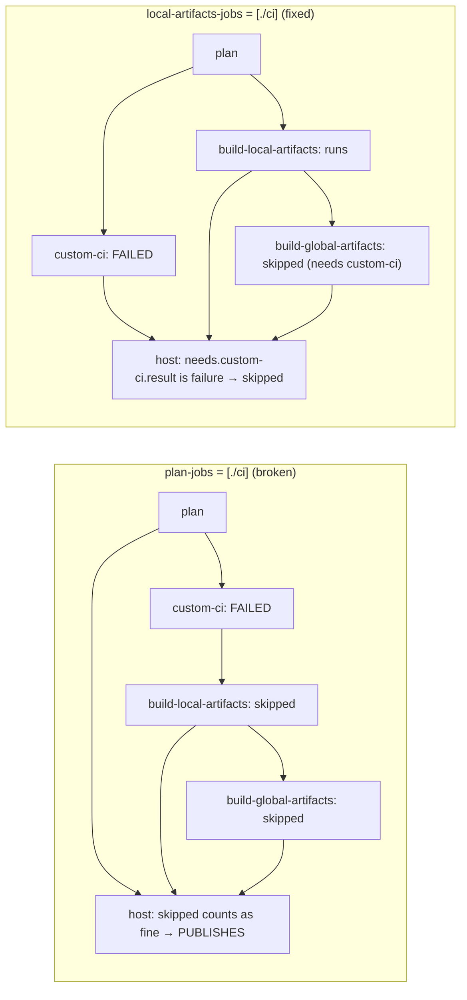

# A failing cargo-dist plan job skips the builds, and the host job still publishes an empty release

## Problem

The release workflow's test suite ran as a cargo-dist **plan job** (`plan-jobs = ["./ci"]`). The
intent, recorded in `dist-workspace.toml` at the time, was "red tests mean no artifacts are ever built
(and hence nothing can be published)". The first half is true. The second is not.

cargo-dist 0.32's `host` job (the one that runs `dist host` and `gh release create`) is guarded by:

```plaintext
always() && needs.plan.result == 'success' && needs.plan.outputs.publishing == 'true'
  && (needs.build-global-artifacts.result == 'skipped' || needs.build-global-artifacts.result == 'success')
  && (needs.build-local-artifacts.result == 'skipped' || needs.build-local-artifacts.result == 'success')
```

"Skipped is fine" exists so a release with nothing to build can still publish. A plan job sits upstream
of `build-local-artifacts` and appears in **neither** of `host`'s lists. When it fails, both build jobs
are skipped, every term above is true, and `host` publishes a release with no assets.



On 2026-09-30 PR #7 was merged, and `v0.11.1` and `ss-magic-plugin-v1.0.0` were pushed about a minute
later, before CI on `main` had finished. Both release runs failed their gate and both published empty
releases. The repository has **immutable releases** (no asset can ever be added) and a **tag ruleset**
(no tag can be moved or deleted). GitHub's documentation also says that after deleting an immutable
release, *"you cannot reuse the same tag name"*. Both version numbers were lost for good.

## Symptoms

- Release run: `plan` ok, `custom-ci / test (…)` failed, `build-local-artifacts` and
  `build-global-artifacts` skipped, `host` and `announce` **success**, `custom-mark-latest` skipped.
- `gh release view v0.11.1 --json assets` lists `dist-manifest.json` and nothing else.
- `gh api repos/<owner>/<repo>/releases/latest` names the plugin tag. `custom-mark-latest` hands the
  mark back to the newest CLI release, but it runs only when every job before it succeeded, so it was
  skipped too.
- Downstream: `marketplace.json` on `main` pinned a zip URL that 404s. Installed 0.11.0 CLIs selected
  `v0.11.1`, failed the download and fell through silently, on every gated command. CLIs released
  before 0.11.0 read the plugin tag as Latest and reported "up to date".

## The trigger: two tests coupled to things that change without a code change

The gate went red on a merge that touched none of the failing code.

1. **A fixed fixture timestamp reaching a real-clock prune.**
   `heartbeat::tests::the_log_is_trimmed_to_its_bound_once_it_passes_the_trigger` stamped its rows
   with `NOW = 1_788_091_200` (2026-08-30 12:00Z) and appended through `heartbeat::append`, which
   prunes rows older than 30 days against `SystemTime::now()`. From 2026-09-29 12:00Z every row read as
   expired, and the test saw 0 rows instead of 2000. The PR's last CI run (2026-09-11) was green. The
   merge (2026-09-30) was not.
2. **A literal version standing in for the crate version.** Six `hook::session_start` tests pinned
   the plugin root at `"1.0.0"` and relied on it equalling `CARGO_PKG_VERSION`, so the version-drift
   notice stayed out of their `systemMessage` assertions. The first bump (to 1.0.1, needed to recover
   from the incident) turned the notice on and failed all six.

## What Didn't Work

- **Upgrading cargo-dist.** 0.33.0 (2026-09-10) and `main` at the time keep the identical `host`
  condition. The one related upstream fix (PR #2145/#2146, "don't run host if plan fails") added
  `needs.plan.result == 'success'` and did not cover plan jobs.
- **Hand-editing `release.yml`.** `dist plan` / `dist host` run an integrity check against the
  generated file, so an edit needs `allow-dirty = ["ci"]`. That gives up drift detection for every
  future `dist` upgrade.
- **Running the tests inside `build-local-artifacts` via `github-build-setup`.** A failure there would
  read as `failure`, which does block `host`. But that job holds `id-token: write` for attestations,
  and running the whole dev-dependency tree there could forge provenance. It would also run the suite
  once per target.
- **Re-tagging.** The ruleset refuses a move or delete, and a deleted immutable release's tag name is
  never reusable. Recovery is always the next patch version.

## Solution

1. **Move the gate to `local-artifacts-jobs = ["./ci"]`** and regenerate. For a local-artifacts job,
   cargo-dist adds `custom-ci` to `host`'s `needs` **and** adds
   `(needs.custom-ci.result == 'skipped' || needs.custom-ci.result == 'success')` to `host`'s `if`.
   `custom-ci` is skipped only on a non-publishing run, which `host` refuses anyway. A red or cancelled
   suite now skips `host`, `announce` and `custom-mark-latest`. `ci.yml` must declare
   `workflow_call.inputs.plan` (optional, unused): cargo-dist passes `with: plan:` to such a job, and
   GitHub rejects an undeclared input.
2. **Assert the shape where it lives.** `scripts/build-plugin-zip.py --check` gained
   `release gate blocks publishing`, run on the GENERATED `release.yml`. `custom-ci` must call
   `ci.yml`, and `host` must need it and check its result. Every job `build-local-artifacts` waits on
   must appear as `needs.<job>.result` in `host`'s `if`. That last rule is the general form of the
   defect, so any future plan job fails `--check` instead of a release. Run against the old
   `release.yml`, it reports both defects.
3. **Inject the clock and derive the version in tests.** `heartbeat::append` now delegates to
   `append_at(store, row, now)`, and the test pins `now` to its fixture `NOW`. The session-start tests
   pin `env!("CARGO_PKG_VERSION")` and use `ss-magic-plugin-v999.0.0` as the "newer" release.
4. **Contain the damage on the forge.** Immutability still allows editing title, notes, the pre-release
   flag and the latest mark: `gh release edit v0.11.0 --latest`, then both empty releases got
   `--prerelease` and a "(broken – no assets, do not use)" title. Both updaters drop pre-releases, so
   neither selects them any more. The fix shipped as `v0.11.2` and `ss-magic-plugin-v1.0.1`.

## Why This Works

`host` publishes unless something it **directly** checks failed. A job whose failure only causes other
jobs to be skipped cannot stop it. `local-artifacts-jobs` is the one cargo-dist list whose members are
both in `host`'s `needs` and checked by result in `host`'s `if` (`global-artifacts-jobs` is too, but
runs only after every build). The builds now run alongside the tests. On a red gate that wastes build
minutes and leaves attested archives in Actions artifact storage, but nothing is uploaded to a release.
The tests still run in their own job with a read-only token, never in the job holding `id-token: write`.

## Prevention

- **A publish gate must be checked by the publishing job itself.** "Upstream of the builds" is not
  "upstream of the publish" when the publisher treats a skipped dependency as success. Ask what
  `host`'s `if` checks, not what runs first.
- **Assert on the generated artifact, not on the config that produced it.** The property belongs to
  `release.yml`, and a later cargo-dist template could change how a config key maps to it.
- **Tag only after CI on `main` is green for that exact commit.** With immutable releases and a tag
  ruleset, a red release still burns its version, even when the gate works and nothing is published.
- **A fixture timestamp must never reach code that reads the real clock.** Pass the clock in, as
  `prune(.., now)` already did. A test that mixes the two passes until the fixture date ages out of the
  window, then fails on a merge that touched nothing near it.
- **A test that means "the running version" must say `env!("CARGO_PKG_VERSION")`.** A literal
  standing in for it passes until the first bump.

## Related Issues

- [docs/runbooks/forge-tag-and-release-protection.md](../../runbooks/forge-tag-and-release-protection.md) – the ruleset and immutability, and the incident record
- [CONTRIBUTING.md](../../../CONTRIBUTING.md) – "A red release gate", and the release procedure's wait-for-green step
- cargo-dist template: `templates/ci/github/release.yml.j2` (0.32.0), the `host` job's `needs`/`if`
